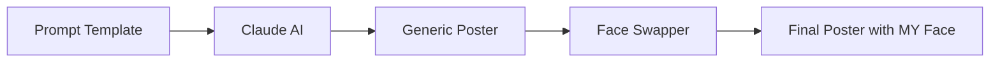

# Day 1 Notes - AI Personality Profile

> *"The first step to mastering AI is understanding how it sees you."*

---

## Date

Day 1 of #ABTalks-60-Day-Claude-Challenge

---

## What I Did Today

### Step 1: The Prompt

Used the custom `prompt.md` template in **Claude** to generate my AI Personality Profile.

### Step 2: The Output

Claude generated a cinematic poster with:

- Dark cyberpunk aesthetic
- Futuristic coding workspace vibe
- My AI working style & strengths
- LinkedIn-shareable quality

**But there was one problem...**

### Step 3: The Problem

The poster had a **generic AI-generated face** — not me.

### Step 4: The Fix

Used a **face-swapper tool** to replace the generic face with **my actual photo**.

### Step 5: The Result

Final output = Cinematic AI poster + MY face

---

## Key Takeaway

> AI can generate 90% of the magic. The last 10% (your face, your identity) — that's on YOU.

---

## Files Created Today

| File | Purpose |
|------|---------|
| `prompt.md` | The prompt template used in Claude |
| `output.md` | Description of final result |
| `Screenshot/` | Final face-swapped poster |

---

## Workflow Summary

