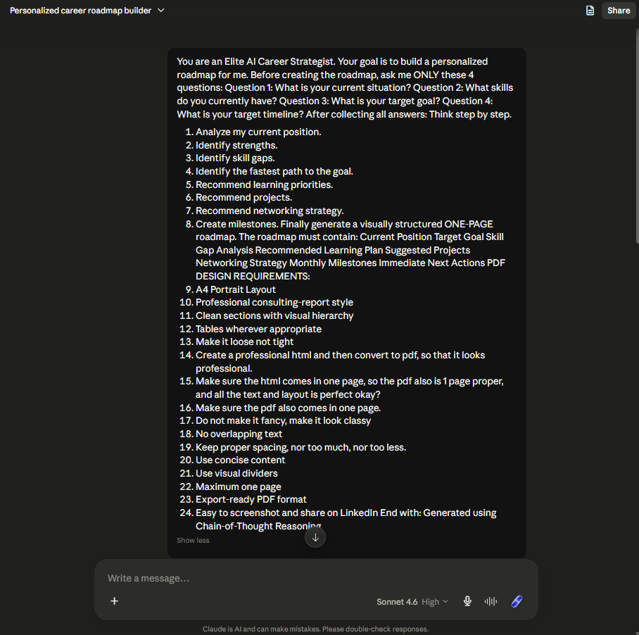
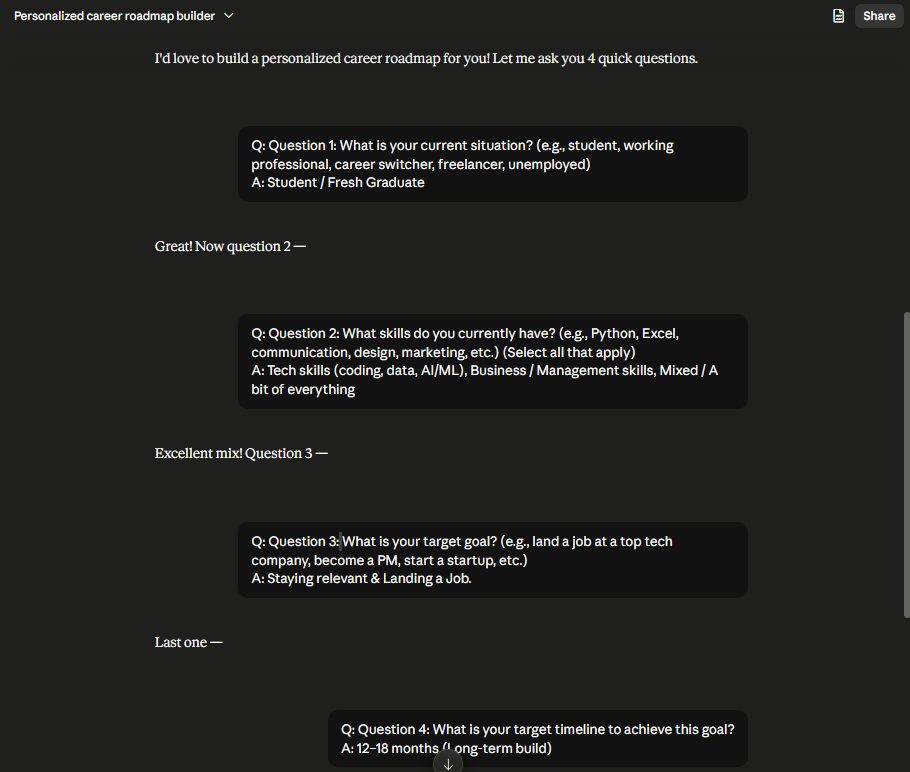
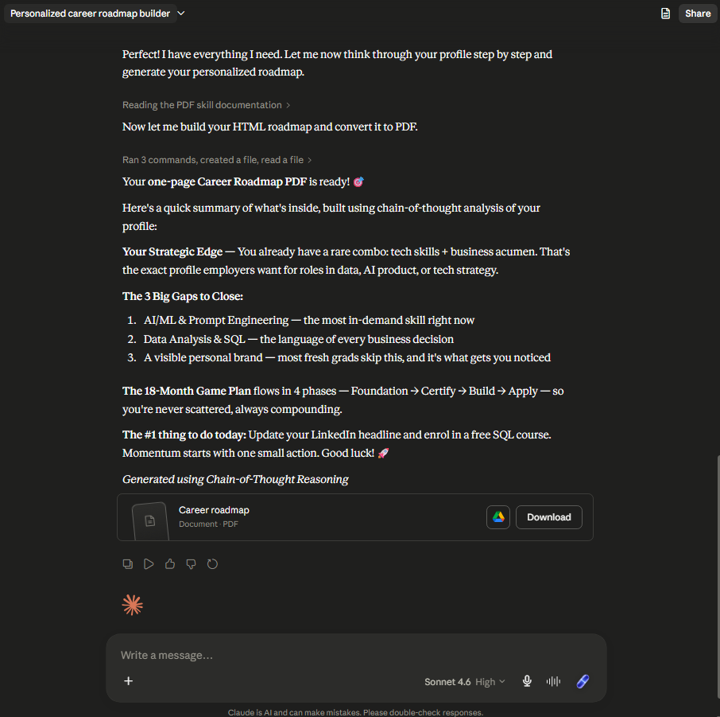
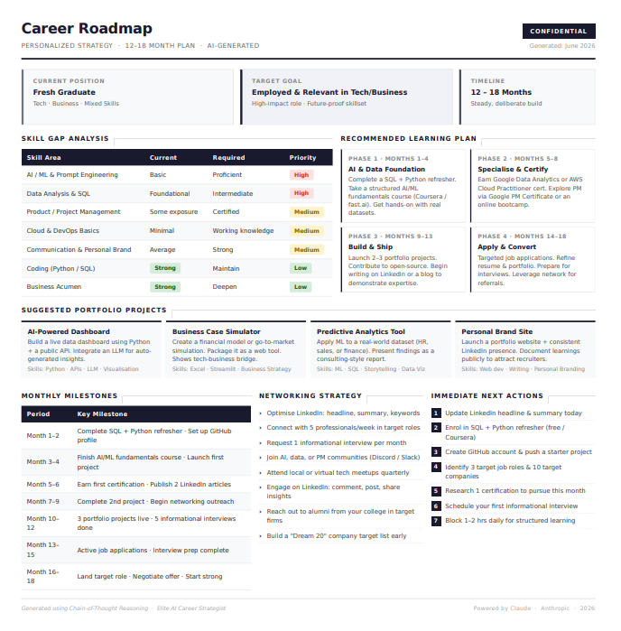
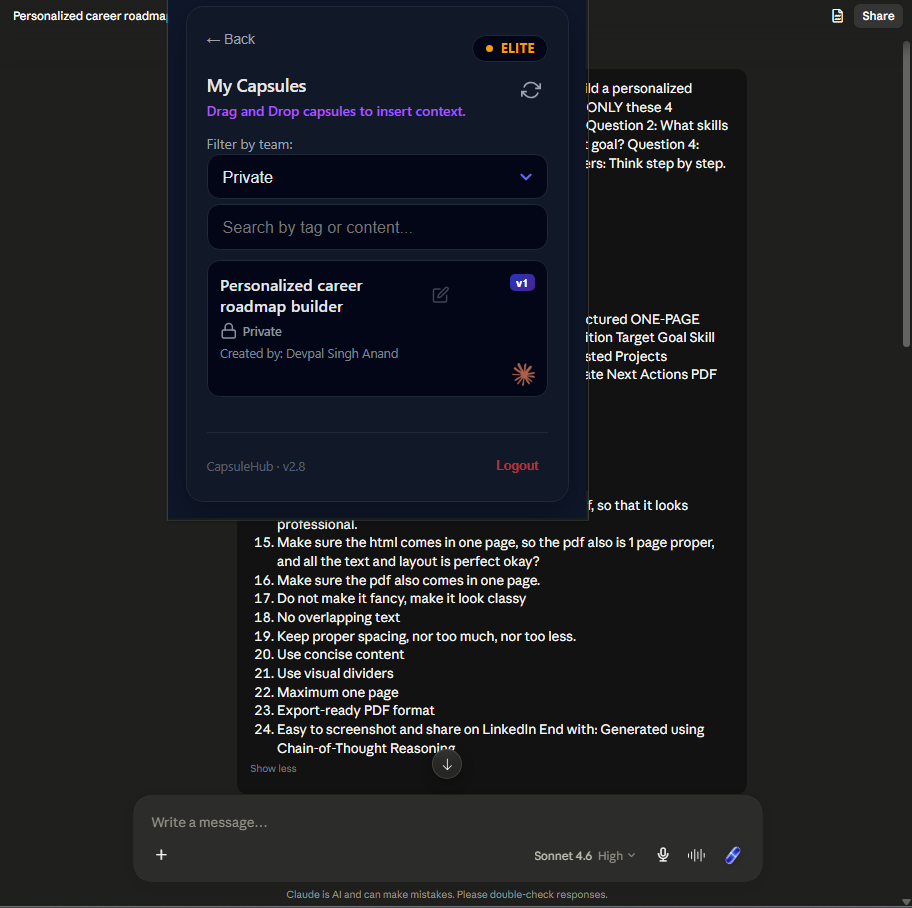

# Day 4 - Chain-of-Thought Prompting

One instruction changed everything: "Think step by step."

---

## What I Worked On

Used the "Elite AI Career Strategist" chain-of-thought prompt template from the ABTalks challenge. The prompt forces Claude to ask 4 questions first, collect the answers, then reason through a step-by-step analysis before producing a career roadmap.

The key instruction is "Think step by step." Without it, Claude would jump straight to generating a roadmap based on assumptions. With it, Claude builds an internal reasoning chain — analyzing current position, identifying strengths, identifying skill gaps, finding the fastest path, recommending learning priorities, recommending projects, recommending a networking strategy, and creating milestones — and then constructs the roadmap from that logic.

I answered four questions: my current situation (student/fresh graduate), my skills (tech + business + mixed), my target goal (staying relevant and landing a job), and my timeline (12-18 months). Claude analyzed each answer, identified the tech + business combo as a strategic edge, found three skill gaps, and generated a one-page career roadmap PDF with an 18-month plan broken into 4 phases: Foundation, Certify, Build, and Apply.

I also used the Capsule Hub Chrome Extension to capture the entire conversation as a reusable capsule.

---

## The Prompt Used

You are an Elite AI Career Strategist. Your goal is to build a personalized roadmap for me. Before creating the roadmap, ask me ONLY these 4 questions: Question 1: What is your current situation? Question 2: What skills do you currently have? Question 3: What is your target goal? Question 4: What is your target timeline? After collecting all answers: Think step by step.

1. Analyze my current position.
2. Identify strengths.
3. Identify skill gaps.
4. Identify the fastest path to the goal.
5. Recommend learning priorities.
6. Recommend projects.
7. Recommend networking strategy.
8. Create milestones. Finally generate a visually structured ONE-PAGE roadmap. The roadmap must contain: Current Position Target Goal Skill Gap Analysis Recommended Learning Plan Suggested Projects Networking Strategy Monthly Milestones Immediate Next Actions PDF DESIGN REQUIREMENTS:

- A4 Portrait Layout
- Professional consulting-report style
- Clean sections with visual hierarchy
- Tables wherever appropriate
- Make it loose not tight
- Create a professional html and then convert to pdf, so that it looks professional.
- Make sure the html comes in one page, so the pdf also is 1 page proper, and all the text and layout is perfect okay?
- Make sure the pdf also comes in one page.
- Do not make it fancy, make it look classy
- No overlapping text
- Keep proper spacing, nor too much, nor too less.
- Use concise content
- Use visual dividers
- Maximum one page
- Export-ready PDF format
- Easy to screenshot and share on LinkedIn

End with: Generated using Chain-of-Thought Reasoning

---

## The Four Questions and Answers

| Question | My Answer |
|----------|-----------|
| Q1: What is your current situation? | Student / Fresh Graduate |
| Q2: What skills do you currently have? | Tech skills (coding, data, AI/ML), Business / Management skills, Mixed / A bit of everything |
| Q3: What is your target goal? | Staying relevant & Landing a Job |
| Q4: What is your target timeline? | 12-18 months (Long-term build) |

---

## Chain-of-Thought Reasoning

After collecting the four answers, Claude followed the "Think step by step" instruction and worked through each analysis phase before producing the roadmap:

1. **Analyzed current position** — Student/fresh graduate with a mixed skill set spanning both tech and business. Not specialized yet, but has breadth most fresh grads don't.

2. **Identified strengths** — The rare combination of technical skills (coding, data, AI/ML) plus business/management awareness. Most fresh grads have one or the other. Having both is a strategic edge for roles in data, AI product, or tech strategy.

3. **Identified skill gaps** — Three critical gaps emerged from the analysis: (a) AI/ML and Prompt Engineering depth — the most in-demand skill right now and one where surface-level knowledge isn't enough, (b) Data Analysis and SQL — the language of every business decision, and something employers test for directly, and (c) A visible personal brand — most fresh grads skip this entirely, and it's exactly what gets you noticed.

4. **Identified the fastest path** — Leverage the existing tech + business combo as a differentiator, then close the gaps in a structured 18-month plan rather than trying to learn everything at once.

5. **Recommended learning priorities** — SQL and data analysis first (most immediately hireable skill), then AI/ML and prompt engineering (deepens the existing foundation), then personal branding (creates visibility for opportunities).

6. **Recommended projects** — Projects that demonstrate both technical ability and business thinking, not just one or the other.

7. **Recommended networking strategy** — Building visibility through content creation, community participation, and strategic connections rather than cold outreach.

8. **Created milestones** — 18-month timeline broken into 4 phases (Foundation, Certify, Build, Apply), each with specific deliverables and checkpoints.

Each step fed into the next. The roadmap wasn't assembled from generic career advice — it was constructed from the specific answers I provided. The gap analysis came from my actual skills. The milestones came from my actual timeline. The priorities came from my actual goal.

---

## The Career Roadmap

### Strategic Edge

The tech + business combo is rare and exactly what employers want for roles in data, AI product, or tech strategy. This isn't something to build — it's something already in place that the roadmap leverages.

### 3 Big Gaps to Close

| Gap | Why It Matters |
|-----|---------------|
| AI/ML & Prompt Engineering | The most in-demand skill right now. Surface-level knowledge won't cut it — depth is what separates candidates |
| Data Analysis & SQL | The language of every business decision. Employers test for this directly and it's the fastest hireable skill to pick up |
| Personal Brand | Most fresh grads skip this entirely. Visibility is what gets you noticed when hundreds of people have the same degree |

### 18-Month Game Plan

| Phase | Focus | Key Actions |
|-------|-------|-------------|
| Phase 1: Foundation | Core skills & basics | SQL course, Python projects, LinkedIn setup |
| Phase 2: Certify | Validate what you know | Certifications, portfolio pieces, first public content |
| Phase 3: Build | Real-world proof | End-to-end projects, community contributions, networking |
| Phase 4: Apply | Go to market | Job applications, interview prep, leveraging network |

### Immediate Next Actions

The #1 thing to do today: Update your LinkedIn headline and enrol in a free SQL course. Momentum starts with one small action.

Generated using Chain-of-Thought Reasoning.

---

## Biggest Insight

The most surprising thing about Claude's reasoning process was how the chain-of-thought structure made each recommendation traceable. When Claude said "learn SQL," it wasn't pulling from a generic career advice template. It was because the gap analysis showed data analysis as a weakness, the tech + business combo made data roles the fastest path, and SQL is the most hireable skill you can pick up in 30 days. Same recommendation you'd get from any career guide, but completely different reasoning behind it.

On Day 2, I saw that structure in the prompt produces structure in the output. On Day 3, I saw that a role changes what the AI considers worth saying. But chain-of-thought does something neither of those did — it changes the AI's process. It doesn't just give you a better answer. It gives you a visible reasoning chain that you can evaluate, question, and trust because each step follows from the last.

That's the real power. Not "think step by step so the answer is better." Think step by step so you can see how the answer was built.

---

## Capsule Hub Observations

Used the Capsule Hub Chrome Extension to capture the entire Claude conversation as a reusable capsule. Here's what I observed:

**How it works:** Capsule Hub doesn't save prompts before a conversation — it captures the existing conversation context after the fact. You start the conversation first, run through your prompt and Q&A, then create a capsule from the completed (or in-progress) exchange. The capsule preserves the full context: the prompt, the four Q&A pairs, and the chain-of-thought reasoning Claude produced.

**Why this matters for chain-of-thought workflows:** The capsule captures not just the final roadmap but the reasoning chain that produced it. If you wanted to continue this career planning in a new Claude session — say, to update the roadmap after 3 months — the new Claude instance would already know your situation, skills, goals, timeline, and the reasoning behind each recommendation. You wouldn't have to re-explain anything.

**Setup process:** Install from Chrome Web Store, pin to toolbar, open Claude.ai, run your conversation, then click the Capsule Hub extension to create a capsule from the current conversation.

**One issue encountered:** Got a "Summary failed: Timed out waiting for messages" error on the first attempt. This seems to happen when the conversation is long or the server is slow. Refreshing and retrying resolved it. Not a dealbreaker, but something to be aware of with longer chain-of-thought conversations.

---

## Key Learnings

- Chain-of-thought doesn't change the input or the persona — it changes the AI's process. Instead of jumping to an answer, the AI reasons through intermediate steps first, and each step builds on the previous one.

- "Think step by step" is the simplest version of chain-of-thought prompting. Three words that force structure into the AI's reasoning. No special syntax, no complex template, just a directive to slow down and reason.

- The output becomes traceable. You can see why each recommendation exists because it came from a logical chain, not a generic template. This is the real difference — not better answers, but answers you can verify.

- For career planning specifically, chain-of-thought prevents the AI from hallucinating a roadmap based on assumptions. Every section of the roadmap traces back to a specific answer the user provided. The gap analysis comes from actual skills. The milestones come from the actual timeline. The priorities come from the actual goal.

- Capsule Hub captures conversation context as a reusable capsule — useful for continuing complex workflows in new sessions without starting over. The fact that it preserves the reasoning chain, not just the final output, makes it especially valuable for chain-of-thought workflows.

- Comparing across days: Day 2 (structured prompt) gave me better output through input structure. Day 3 (role-based prompt) gave me different perspectives through persona. Day 4 (chain-of-thought) gave me verifiable reasoning through process. Three different levers, three different outcomes.

---

## Screenshots

| Screenshot | What It Shows |
|------------|---------------|
|  | The prompt saved with a name in Claude |
|  | The four questions with replies |
|  | The chain-of-thought reasoning process |
|  | The career roadmap PDF |
|  | The Capsule Hub capsule |
