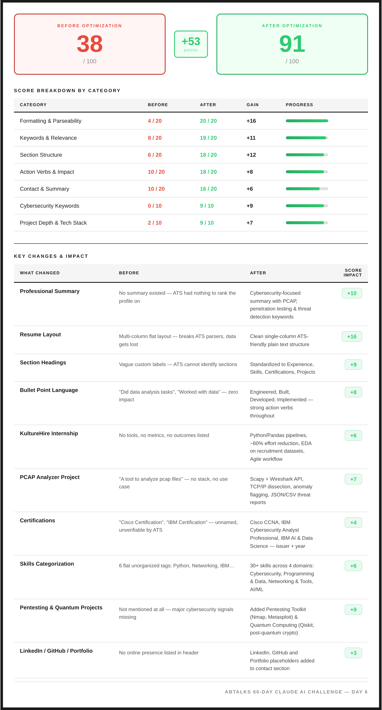

# Day 6 - AI Resume Optimizer

Your resume speaks two languages now. One for the machine. One for the human.

---

## What I Worked On

Took my raw, unoptimized resume and ran it through an AI-powered ATS optimization pipeline. The task was straightforward: feed Claude my current resume, let it analyze every section for ATS friendliness, and then rebuild it from scratch to pass automated screening systems — the same systems that 98% of Fortune 500 companies use to filter candidates before a human ever reads a single word.

The result was a +53 point jump in ATS friendliness score — from 38/100 to 91/100. Not by fabricating experience or inflating credentials, but by restructuring what I already had into a format that machines can parse and humans can appreciate. The content didn't change much. The delivery changed everything.

I used Claude AI to generate both the ATS comparison dashboard and the fully optimized resume, then rendered the dashboard as a high-resolution image for my LinkedIn carousel.

---

## The Prompt I Used

```
You are an expert ATS Resume Optimizer. I will provide you my resume. Before generating anything, follow this 2-step process:

**STEP 1 — Ask First:**
Use the `ask_user_input_v0` tool to ask: "Is your resume old or does any information need updating before I optimize it?" with two options: **Yes** and **No**.

If I say **YES** → Use the `ask_user_input_v0` tool with `multi_select` type to present this checklist and ask which fields need updating:
1. 📛 Name
2. 📞 Contact Information (Phone / Email / Location)
3. 🎓 Education
4. 💼 Experience / Internships
5. 🛠️ Projects
6. 🧠 Skills
7. 📜 Certifications
8. 🎯 Target Field / Role

Wait for me to provide the updates for the selected fields. Incorporate those updates into the resume before proceeding to Step 2.
If I say **NO** → Proceed directly to Step 2.

**STEP 2 — Generate ATS Score Comparison Dashboard HTML:**
Once you have the final resume content (original or updated), analyze it thoroughly and generate a SINGLE HTML file that shows an ATS Score Comparison Dashboard with the following structure:

**TOP SECTION — Score Cards:**
- Left card: "BEFORE OPTIMIZATION" with red accent — show the low ATS score as a large number (e.g. 38) with "/ 100" below it. Background: #FFF5F5, border: 2px solid #c0392b
- Center: Delta box showing the point improvement (e.g. "+53 points") with green accent. Background: #F0FFF4, border: 2px solid #2ecc71
- Right card: "AFTER OPTIMIZATION" with green accent — show the high ATS score as a large number (e.g. 91) with "/ 100" below it. Background: #F0FFF4, border: 2px solid #27ae60

**MIDDLE SECTION — Score Breakdown by Category Table:**
A table with columns: Category | Before | After | Gain | Progress bar
- Analyze the resume across 6-8 ATS categories such as: Formatting & Parseability, Keywords & Relevance, Section Structure, Action Verbs & Impact, Contact & Summary, Domain-Specific Keywords, Project Depth & Tech Stack
- Each row shows Before score (red), After score (green), Gain (dark), and a green gradient progress bar
- Table header background: #F5F5F5 with dark text and dark bottom border
- Row separators: #E0E0E0

**BOTTOM SECTION — Key Changes & Impact Table:**
A table with columns: What Changed | Before | After | Score Impact
- List 8-10 specific changes made (e.g. Professional Summary, Resume Layout, Section Headings, Bullet Point Language, Internship descriptions, Project descriptions, Certifications, Skills Categorization, etc.)
- "Before" column: describe what was wrong (muted text #555555)
- "After" column: describe the improvement (slightly brighter text #444444)
- "Score Impact" column: green pill badge showing points gained (e.g. "+10") styled with color #2ecc71, background rgba(46,204,113,0.1), border rgba(46,204,113,0.3)
- "What Changed" column: bold dark text (#1A1A1A)

**FOOTER:**
- Right-aligned text: "ABTalks 60-Day Claude AI Challenge — Day 6"
- Uppercase, letter-spacing 1.5px, font-size 11px, semi-transparent (#1A1A1A at 50% opacity)
- Thin separator line (#E0E0E0) above the footer

**DESIGN REQUIREMENTS FOR THE HTML:**
* Light mode background (#FFFFFF) everywhere
* Use 'DM Sans' font family (with sans-serif fallback)
* Main text color: #1A1A1A
* Outer wrapper: 4px solid #1A1A1A border + 2px inset #1A1A1A inner border
* Max width: 900px, centered with padding: 28px
* Before scores: red (#e74c3c), After scores: green (#2ecc71), Gain: dark (#1A1A1A)
* Score numbers: 56px font-weight 700
* Score labels: 10px uppercase letter-spacing 2px
* Progress bars: green gradient (#27ae60 to #2ecc71), animated with 1.1s ease transition
* Table headers: 10px uppercase, dark text, #F5F5F5 background
* Clean, professional, LinkedIn-carousel-worthy design
* Category names: #1A1A1A font-weight 500
* Description text (Before): #555555
* Description text (After): #444444
* Score breakdown totals must add up correctly to the overall Before and After scores
* Responsive layout that works at 1080px width
* Add a 300ms delayed JavaScript animation to set progress bar widths from 0% to their target percentage

**STEP 3 — Then generate the resume.**
After the dashboard HTML, generate the fully optimized, ATS-friendly resume as clean, well-formatted plain text. Include all sections: Professional Summary, Contact Information, Education, Experience, Projects, Skills, and Certifications. Use strong action verbs, quantified achievements, and ATS-optimized keywords throughout. Format it so it can be directly copied into a resume builder or saved as a document.

**OUTPUT:** Return the dashboard HTML first, then the optimized resume below it.
```

---

## Resume Comparison

### ATS Score Dashboard



### Download Resumes

- [📄 Original Resume (Before)](PDFs/Original-Resume.pdf)
- [📄 ATS-Friendly Resume (After)](PDFs/ATS-Friendly-Resume.pdf)

---

## Biggest Insight

A resume isn't just a document for hiring managers anymore. It's a data file that gets parsed, scored, and ranked by an algorithm before any human sees it. That means every resume now needs to speak two languages — one that the ATS understands (standard headings, keyword density, single-column formatting, action verbs) and one that impresses the hiring manager (quantified achievements, clear narrative, professional summary).

The +53 point jump didn't come from adding fake experience. It came from restructuring what was already there. My projects, certifications, and skills were the same — but the original resume buried them under vague headings, passive language, and a layout that ATS parsers literally could not read. The optimized version didn't change the content. It changed the delivery. And that made all the difference.

On Day 2, structure in the prompt produced structure in the output. On Day 3, a role changed what the AI considered worth saying. On Day 4, chain-of-thought made reasoning traceable. On Day 5, context eliminated the need for clarification. On Day 6, the lesson is about translation — taking the same raw material and expressing it in a language that both machines and humans can process. The content is constant. The format is the variable. And in 2026, the format is what gets you past the first filter.

---

## Tool of the Day — Claude AI

**What it is:** Claude AI by Anthropic is a large language model designed for nuanced reasoning, long-form content generation, and structured output — including HTML, data tables, and formatted documents.

**How I used it for resume optimization:**
1. Fed my raw resume into Claude with the ATS optimizer prompt
2. Claude analyzed every section for ATS friendliness across 7 scoring categories
3. Generated an interactive score comparison dashboard as HTML (rendered to PNG)
4. Produced the fully optimized ATS-friendly resume as clean plain text

**Why it works for this task:** Resume optimization requires two things — understanding what ATS systems look for (standard section headings, keyword density, action verbs, scannable formatting) and rewriting content to match those requirements without losing the human narrative. Claude handles both simultaneously, producing output that scores well algorithmically while still reading naturally to a human reviewer.

---

## Key Learnings

- **ATS optimization is about structure, not content.** The biggest gain (+16 points) came from switching to a single-column layout. The content was identical — the parser just couldn't read the multi-column version. Formatting is not cosmetic. It's functional.

- **Action verbs are a scoring signal.** "Did data analysis tasks" scores near zero. "Engineered Python/Pandas pipelines, reducing effort by ~60%" scores high. The difference isn't the work — it's the verb. ATS systems weight action verbs like Engineered, Built, Developed, and Implemented because they signal impact and ownership.

- **Keywords need context.** Listing "Python" as a flat skill tag is worth almost nothing. Categorizing it under "Programming & Data" alongside Pandas, NumPy, and Scikit-learn creates keyword clusters that ATS systems recognize as domain expertise. Context applies to resumes the same way it applies to prompts.

- **Certifications need full names and issuers.** "Cisco Certification" is unverifiable by ATS. "Cisco CCNA" with the issuer name and year is parseable, verifiable, and scores. Specificity is not optional — it's the difference between a match and a miss.

- **The resume gap is invisible.** My original resume scored 38/100 and I had no idea. It looked fine to me. But ATS parsers couldn't read it properly — missing sections, vague headings, zero keyword density. You don't know what's broken until you measure it against the system that's filtering you.

- **Comparing across days:** Day 2 taught structure. Day 3 taught persona. Day 4 taught reasoning. Day 5 taught context. Day 6 taught translation — the same raw content, restructured for a different audience. The AI didn't create new experience for me. It took what I had and expressed it in a format that scores. That's the most practical application of AI so far: not generating from nothing, but optimizing what already exists.
