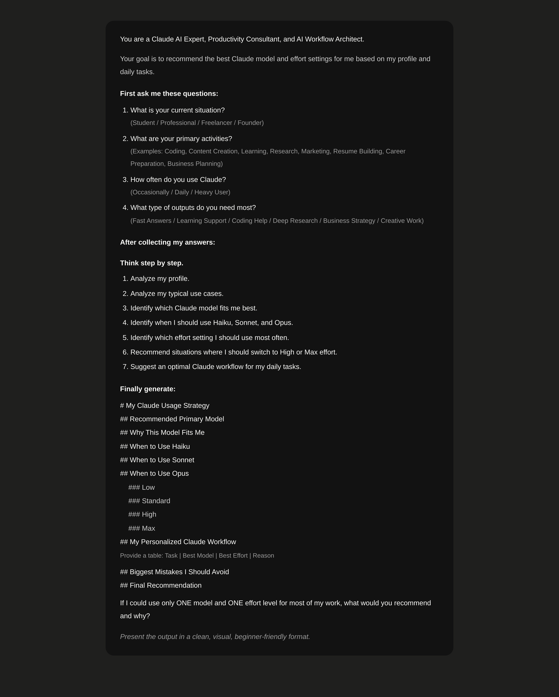
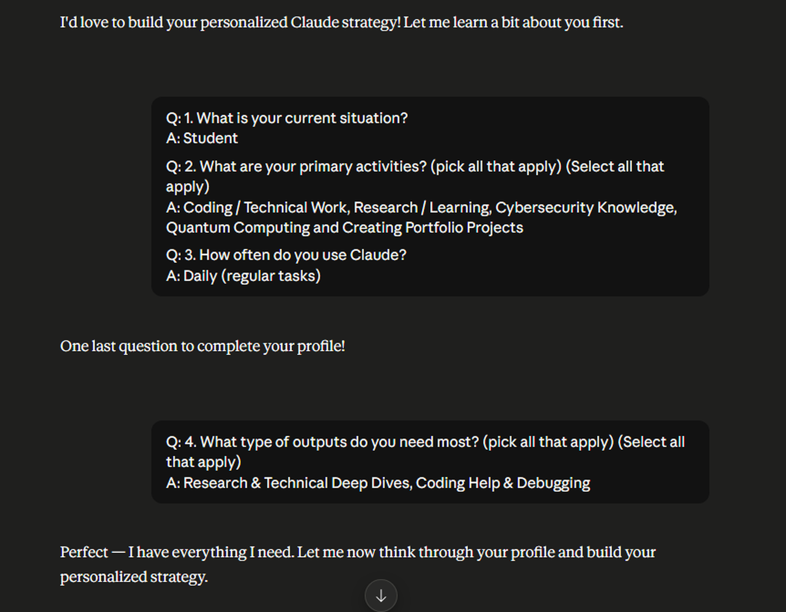
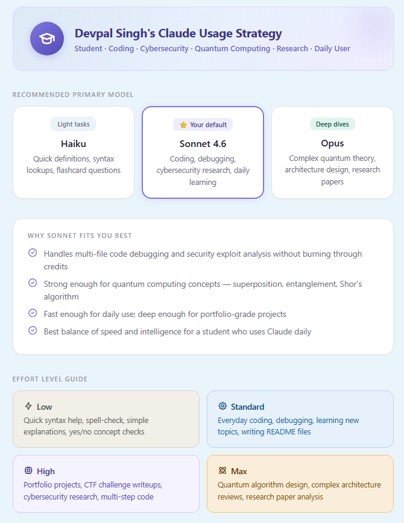
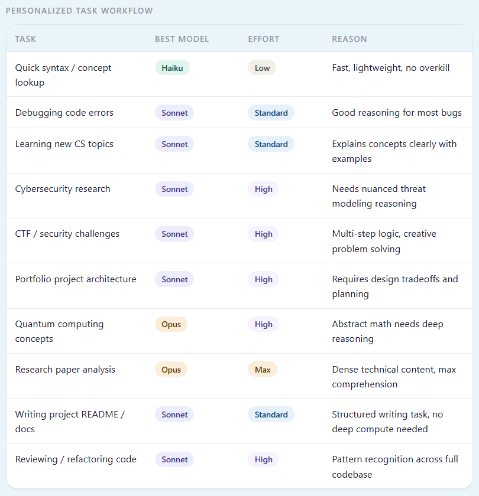
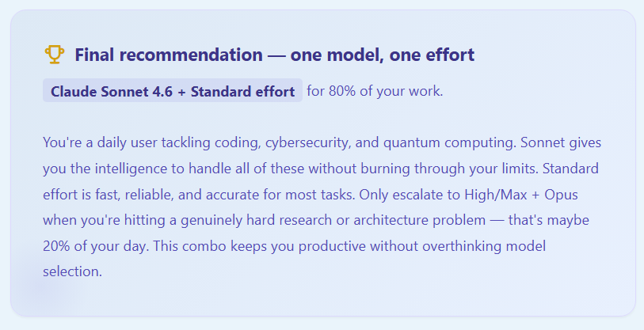

# Day 7 - Claude Model Selection & Reasoning Effort

The right model. The right effort. Every time.

---

## What I Worked On

Built a personalized Claude usage strategy by asking Claude itself to recommend which model to use and what reasoning effort level to set for each type of task I work on daily. Instead of guessing or defaulting to the most expensive option every time, I treated model selection as a decision — one that should be intentional, not automatic.

Claude analyzed my specific use case — a student who codes daily, studies cybersecurity, explores quantum computing, and builds portfolio projects — and produced a complete strategy covering model recommendations (Haiku, Sonnet, Opus), effort level guidelines (Low, Standard, High, Max), a personalized task workflow mapping every common task to the right model-effort combo, and a list of the biggest mistakes to avoid. The final recommendation was simple: Claude Sonnet 4.6 + Standard effort for 80% of daily work, escalating to Opus + High/Max only for genuinely hard research and architecture problems.

The insight wasn't about which model is "best." It was about matching the tool to the task. Using Opus for a syntax lookup is like using a sledgehammer to hang a picture frame — it works, but it's wasteful. Using Haiku for quantum algorithm design is like using a screwdriver to build a house — it's not enough tool for the job. The strategy gave me a framework to make that decision consciously instead of defaulting to one model for everything.

I also rendered the full strategy as a high-resolution infographic split across three panels for my LinkedIn carousel — model selection and effort guide, task workflow and mistakes, and the final recommendation.

---

## The Prompt I Used

```
You are an expert AI usage strategist. I need you to build a personalized Claude model selection and reasoning effort strategy for my specific use case. Here is my profile:

**About Me:**
- Current Role: Student
- Primary Activities: Coding, debugging, cybersecurity research, quantum computing exploration, portfolio projects, daily learning
- Usage Pattern: Daily Claude user, mix of quick tasks and deep work
- Skill Level: Between beginner and intermediate across most areas

**Build me a complete strategy that includes:**

1. **Recommended Primary Model** — Which Claude model should I default to? (Haiku, Sonnet, or Opus). Show all three with their best use case and mark my default.

2. **Why My Default Fits Me Best** — 4-5 specific reasons why that model matches my daily workflow better than the others.

3. **Effort Level Guide** — Explain all four effort levels (Low, Standard, High, Max) with 2-3 example tasks for each that fit my profile.

4. **Personalized Task Workflow** — A table mapping my common tasks to the best model + effort combo, with a reason for each choice. Include at least 8-10 tasks covering: quick lookups, debugging, learning new topics, cybersecurity research, CTF challenges, portfolio architecture, quantum computing, research paper analysis, writing docs, and code review.

5. **Biggest Mistakes to Avoid** — 5 specific mistakes I might make when choosing models and effort levels, with practical advice for each.

6. **Final Recommendation** — A one-line recommendation: which model + effort level should I use for 80% of my work, and when should I escalate?

Make it practical, specific to my profile, and actionable — not generic advice.
```

---

## Prompt & Output — Side by Side

| Prompt Sent to Claude | Claude's Response |
|---|---|
|  |  |

---

## Devpal Singh's Claude Usage Strategy

### Part 1 — Model Selection & Effort Guide



**Recommended Primary Model: Sonnet 4.6**

Out of the three Claude models available — Haiku, Sonnet, and Opus — Sonnet 4.6 emerged as the clear default for my daily workflow. Haiku is designed for lightweight tasks like quick definitions, syntax lookups, and flashcard-style questions where speed matters more than depth. Opus is built for deep analytical reasoning — complex quantum theory, architecture design, and research paper analysis where the model needs to think harder and longer. Sonnet sits exactly in the middle: strong enough for multi-file code debugging and security exploit analysis, fast enough for daily interactive use, and efficient enough not to burn through usage limits.

The four reasons Sonnet fits best: it handles multi-file code debugging and security exploit analysis without excessive token consumption; it is strong enough for quantum computing concepts like superposition, entanglement, and Shor's algorithm; it is fast enough for daily use while deep enough for portfolio-grade projects; and it offers the best balance of speed and intelligence for a student who relies on Claude every single day.

**Effort Level Guide:**

| Level | Best For | Example Tasks |
|-------|----------|---------------|
| Low | Quick, simple interactions | Syntax help, spell-check, simple explanations, yes/no concept checks |
| Standard | Everyday productive work | Coding, debugging, learning new topics, writing README files |
| High | Complex, multi-step tasks | Portfolio projects, CTF challenge writeups, cybersecurity research, multi-step code |
| Max | Maximum reasoning depth | Quantum algorithm design, complex architecture reviews, research paper analysis |

The effort level controls how many reasoning tokens Claude spends thinking before responding. Low effort means Claude responds quickly with less internal deliberation — perfect for when you just need a fast answer. Standard is the default for most work. High tells Claude to think longer and consider more possibilities — useful for complex debugging or security analysis. Max gives Claude the most reasoning budget — reserved for the hardest problems where you need the deepest analysis possible.

---

### Part 2 — Task Workflow & Mistakes to Avoid



**Personalized Task Workflow:**

| Task | Best Model | Effort | Reason |
|------|-----------|--------|--------|
| Quick syntax / concept lookup | Haiku | Low | Fast, lightweight, no overkill |
| Debugging code errors | Sonnet | Standard | Good reasoning for most bugs |
| Learning new CS topics | Sonnet | Standard | Explains concepts clearly with examples |
| Cybersecurity research | Sonnet | High | Needs nuanced threat modeling reasoning |
| CTF / security challenges | Sonnet | High | Multi-step logic, creative problem solving |
| Portfolio project architecture | Sonnet | High | Requires design tradeoffs and planning |
| Quantum computing concepts | Opus | High | Abstract math needs deep reasoning |
| Research paper analysis | Opus | Max | Dense technical content, max comprehension |
| Writing project README / docs | Sonnet | Standard | Structured writing task, no deep compute needed |
| Reviewing / refactoring code | Sonnet | High | Pattern recognition across full codebase |

Notice the pattern: Sonnet covers 8 out of 10 tasks in my daily workflow. Only quantum computing concepts and research paper analysis require Opus, and only research papers need Max effort. This confirms the strategy — Sonnet is the workhorse, Opus is the specialist.

**Biggest Mistakes to Avoid:**

1. **Using Opus for every task** — It's slower and costs more usage. Reserve it for quantum theory and dense research papers only. Defaulting to Opus is the most common way to burn through your Claude limits without getting better results.

2. **Running Max effort on simple debugging** — You waste tokens and time. Standard effort handles 80% of daily code fixes perfectly. Escalating effort prematurely is like using a microscope to read a billboard — unnecessary precision that costs more without adding value.

3. **Pasting code without context** — Always describe what the code should do, what's failing, and what you've already tried. Without context, even the right model at the right effort level will give you generic answers that don't solve your actual problem.

4. **Asking one giant question** — Break complex problems into smaller steps. Instead of "build me a cybersecurity tool," start with "design the architecture for a network scanner" and iterate. Smaller prompts with clear goals produce better results than massive prompts with vague objectives.

5. **Not building in public** — Use Claude to help write project docs, READMEs, and case studies for your portfolio as you go. The strategy isn't just about efficiency — it's about creating visible output from every interaction.

---

### Part 3 — Final Recommendation



**Claude Sonnet 4.6 + Standard effort for 80% of daily work.**

The reasoning is straightforward: as a daily user tackling coding, cybersecurity, and quantum computing, Sonnet provides the intelligence to handle all of these without burning through usage limits. Standard effort is fast, reliable, and accurate for most tasks. Only escalate to High/Max + Opus when hitting a genuinely hard research or architecture problem — that's roughly 20% of the day. This combination keeps you productive without overthinking model selection every time you open Claude.

---

## Biggest Insight

Model selection is not about finding the "best" model — it's about finding the right model for the task at hand. The same person who needs Opus for quantum algorithm design needs Haiku for a quick Python syntax check, and those two use cases are equally valid. The mistake most people make is treating Claude as one-size-fits-all: either defaulting to the cheapest model for everything (and getting shallow results on hard problems) or defaulting to the most powerful model for everything (and burning through limits on tasks that didn't need it).

The effort level dimension adds another layer of intentionality. Two identical prompts to the same model can produce vastly different results depending on how much reasoning budget you give Claude. Low effort on a complex debugging task gives you surface-level suggestions. Max effort on the same task gives you a thorough analysis with multiple approaches. But Max effort on a simple formatting question just wastes tokens without improving the answer. The effort level is a dial, not a switch — and knowing where to set it for each task is what separates efficient AI users from wasteful ones.

On Day 2, I learned that structure in the prompt produces structure in the output. On Day 3, a role changed what the AI considered worth saying. On Day 4, chain-of-thought made reasoning traceable. On Day 5, context eliminated the need for clarification. On Day 6, translation — restructuring the same content for a different audience. On Day 7, the lesson is about resource allocation — matching the depth of reasoning and the power of the model to the complexity of the task. Not every question needs maximum compute. Not every answer needs maximum depth. The most effective AI users don't just write better prompts — they make better decisions about which tools to use and how hard to push them.

---

## Tool of the Day — Claude Model Selector & Effort Dial

**What it is:** Claude's built-in model selection (Haiku, Sonnet, Opus) and reasoning effort control (Low, Standard, High, Max) give users fine-grained control over both the intelligence of the model and the depth of reasoning applied to each prompt.

**How I used it for this challenge:**
1. Started by mapping all my daily tasks to understand the full range of complexity I deal with
2. Asked Claude to build a personalized strategy matching each task type to the optimal model + effort combination
3. Validated the recommendations by testing the same prompt at different model/effort levels and comparing output quality
4. Rendered the complete strategy as a three-panel infographic for my LinkedIn carousel

**Why it matters:** Most people pick one model and stick with it. The model selector and effort dial together create a 12-cell matrix (3 models x 4 effort levels), and most users only ever use one or two of those cells. Today's challenge was about exploring the full matrix and building a strategy that uses all of it intentionally — Haiku + Low for quick lookups, Sonnet + Standard for daily work, Sonnet + High for complex projects, and Opus + Max for deep research. Each combination has a specific purpose, and knowing when to use which one is the real skill.

---

## Key Learnings

- **Sonnet is the default for a reason.** It covers 80% of daily tasks for most users — coding, debugging, learning, writing, research. Haiku is too shallow for complex work. Opus is overkill for routine tasks. Sonnet sits in the sweet spot between speed and intelligence, and for a daily user, that balance matters more than raw capability.

- **Effort level is the hidden variable.** Most people focus on model selection and ignore the effort dial entirely. But the same model at Low vs. Max effort can produce dramatically different outputs. Standard effort with Sonnet is the baseline. High effort is for when you need Claude to think harder about a problem. Max effort is for when you need the deepest possible analysis. The effort level multiplies the model's capability — using the right model with the wrong effort is like driving a sports car in first gear.

- **Escalation should be intentional, not default.** The strategy is simple: start with Sonnet + Standard, and only escalate when the output quality clearly doesn't match the task complexity. If Sonnet + Standard gives you a thorough, accurate answer, there's no reason to use Opus or Max. Escalation costs tokens and time — it should solve a problem, not prevent one.

- **Context still matters regardless of model.** Even with the right model and the right effort level, pasting code without context or asking vague questions produces generic output. The lessons from Day 5 (context engineering) apply here too — the model and effort determine how Claude processes your input, but the quality of that input determines what Claude has to work with.

- **Comparing across days:** Day 2 taught structure. Day 3 taught persona. Day 4 taught reasoning. Day 5 taught context. Day 6 taught translation. Day 7 taught resource allocation — not every task deserves maximum compute, and the skill is in knowing which tasks do. The most practical takeaway from the entire first week: write structured prompts (Day 2), give context upfront (Day 5), and match the model and effort to the task (Day 7). Those three practices alone will transform how effectively you use any AI model.

- **The 80/20 rule applies to AI usage.** Sonnet + Standard handles 80% of tasks. The remaining 20% — deep research, complex architecture, quantum theory — requires escalation. But that 80% is where most people spend their time, and optimizing for it is more valuable than having Opus available for edge cases. Build your workflow around the default, not the exception.
