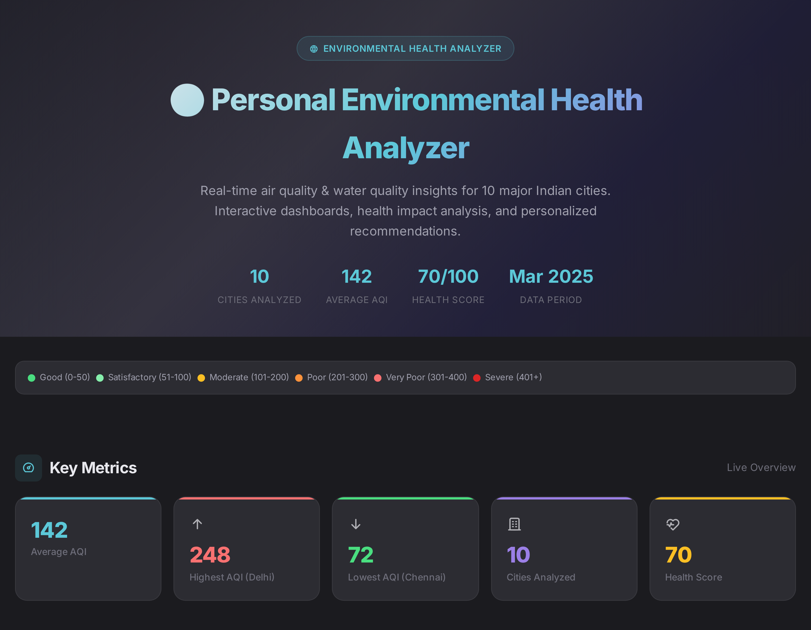
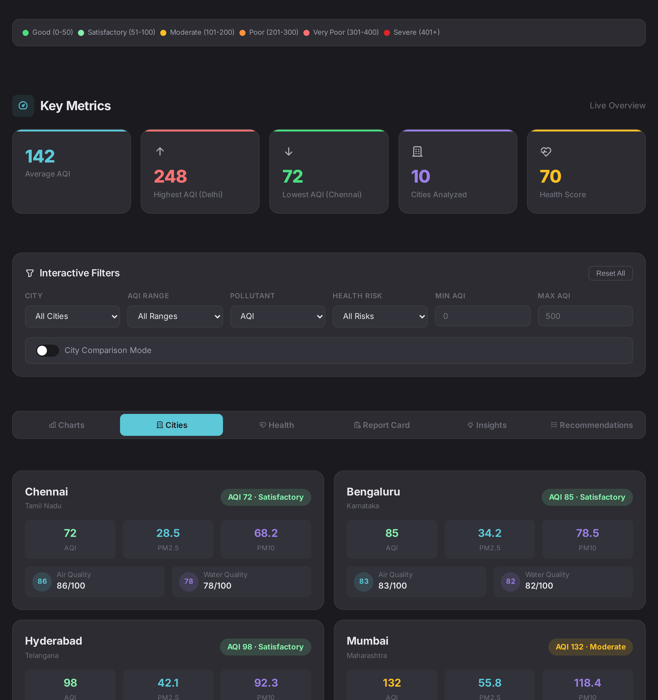
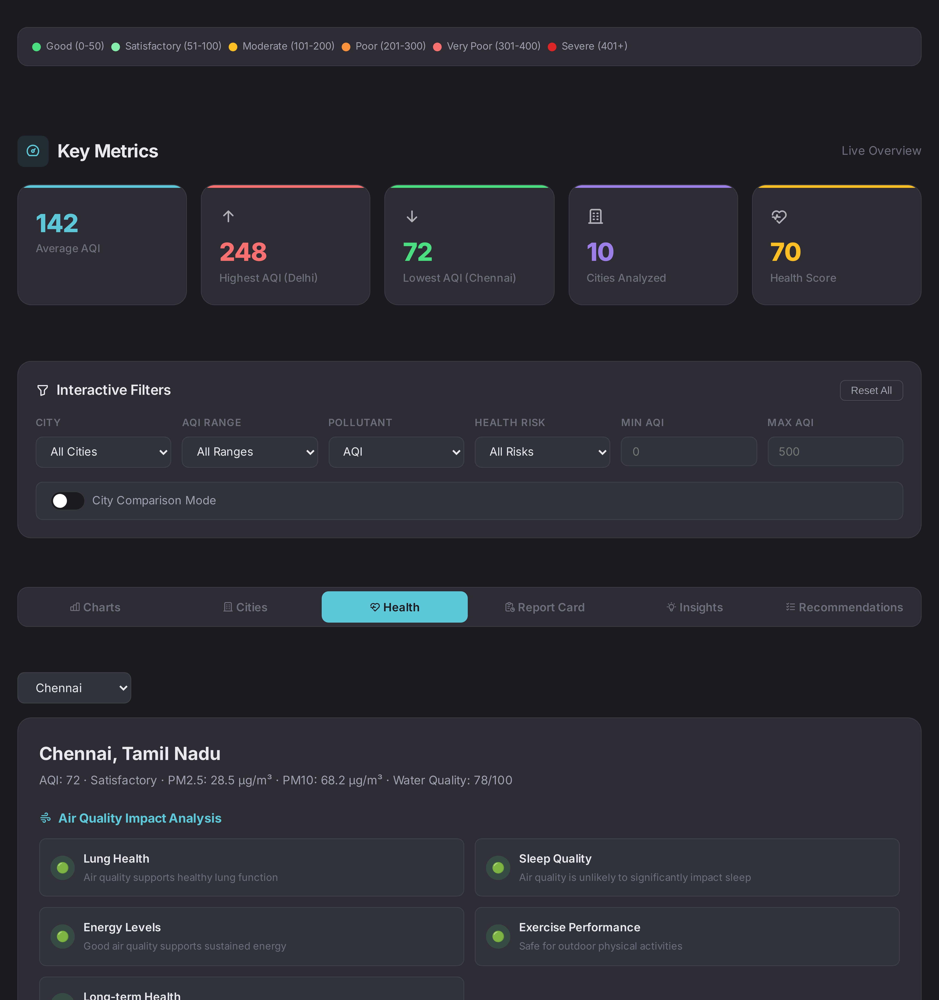

# Day 8 - Environmental Health Dashboard

When Claude doesn't just answer — it builds.

---

## What I Worked On

Day 8 of the ABTalks 60-Day Claude AI Challenge was about Claude Artifacts — turning a prompt into a fully interactive application. I pasted a detailed Environmental Health Analyzer prompt into Claude and it generated a complete, downloadable HTML dashboard that works the moment you open it in a browser. No coding from my side. No debugging. Just a prompt and a product.

The dashboard covers 10 Indian cities (Delhi, Mumbai, Bengaluru, Chennai, Hyderabad, Kolkata, Pune, Ahmedabad, Jaipur, Lucknow) with AQI, PM2.5, PM10, and water quality data. It has 6 Chart.js charts, 5 interactive filters, city comparison mode, health impact analysis with risk indicators, a personal report card with letter grades, an insights panel, and personalized recommendations. Every section responds to filters in real time. Delhi scores F on air quality (50/100), Chennai scores B (86/100). The data drives every recommendation — N95 masks for Delhi, regular routines for Chennai. This isn't a template. It's a working product.

---

## The Prompt I Used

```
Act as a Senior Data Analyst, Environmental Researcher, UX Designer, and Frontend Dashboard Developer.

Create a Claude Artifact called:
🌍 Personal Environmental Health Analyzer

DATA RULES

If a dataset is provided, use it. If no dataset is provided, automatically search the web for the latest AQI and water-quality data for the user's current city/location. If location is unavailable, ask for the city name first. Use the most recent available data, cite sources, clean the data, handle missing values, and validate quality before analysis.

ANALYSIS

Generate: cleanest city, most polluted city, highest AQI city, lowest AQI city, average AQI, number of cities analyzed, trends, anomalies, most surprising observation, executive summary.

INTERACTIVE DASHBOARD

Create a fully interactive Claude Artifact with:

📊 Key Metrics: average AQI, highest AQI city, lowest AQI city, number of cities analyzed, environmental health score.

📈 Visualizations: AQI comparison chart, PM2.5 comparison chart, PM10 comparison chart, city ranking chart, AQI distribution chart.

🎛 Interactive Filters: city selector, AQI range filter, pollutant selector, health-risk filter, date filter (if available), city comparison mode.

📋 City Detail Cards: AQI, PM2.5, PM10, air-quality category, health score, water-quality score.

🚦 AQI Categories: Good (Green), Satisfactory (Light Green), Moderate (Yellow), Poor (Orange), Very Poor (Red), Severe (Dark Red).

ENVIRONMENTAL HEALTH ANALYSIS

For the selected city explain AQI impact on lungs, sleep, energy levels, exercise performance, long-term health, and water-quality impact on hair fall, hair dryness, scalp health, skin dryness, acne, and sensitive skin.

Use risk indicators: 🟢 Low, 🟡 Moderate, 🔴 High.

PERSONAL REPORT CARD

Generate an Environmental Health Score (0–100) with breakdowns for Air Quality Score, Water Quality Score, and Overall Environmental Score.

Assign grades for Air Quality (A–F), Water Quality (A–F), Hair Risk, and Skin Risk.

INSIGHTS PANEL

Include: top 3 cleanest cities, top 3 most polluted cities, biggest anomaly, most surprising observation, recommended actions.

PERSONALIZED RECOMMENDATIONS

Provide: daily actions, indoor air improvements, outdoor activity guidance, hair-care recommendations, skin-care recommendations, water-quality improvement suggestions.

DESIGN

Modern, professional, mobile responsive, dark theme, smooth animations, premium UI, clean typography, dashboard-style layout, highly visual, colourful, LinkedIn-shareable.

OUTPUT

Generate a complete downloadable HTML application that is fully responsive and ready to save as index.html.

IMPORTANT

Do not provide code snippets. Create a complete interactive Claude Artifact with working charts, filters, cards, insights, report cards, and dashboards that users can interact with directly.
```

---

## Dashboard Breakdown

### Part 1: Key Metrics & Interactive Charts



The hero section shows four stats at a glance — 10 cities, average AQI (142), health score, and data period. Five metric cards below highlight Average AQI, Highest AQI (Delhi 248), Lowest AQI (Chennai 72), Cities Analyzed, and Health Score. Six Chart.js charts follow — AQI Comparison with category colors (green→red), PM2.5 and PM10 comparisons, a horizontal City Ranking chart (best to worst), and an AQI Distribution doughnut showing 3 Satisfactory, 6 Moderate, 1 Poor cities. All charts respond to filters in real time and show exact values on hover.

### Part 2: City Detail Cards & Health Impact Analysis



The Cities tab shows 10 cards with AQI badge, PM2.5, PM10, air/water quality scores. Clicking any card opens a detailed modal. The Health Analysis tab is the real value — selecting a city generates a full breakdown of Air Quality Impact (lungs, sleep, energy, exercise, long-term health) and Water Quality Impact (hair fall, dryness, scalp, skin, acne, sensitive skin), each with 🟢🟡🔴 risk indicators. Delhi (AQI 248) shows 🔴 High across all air impacts. Chennai (AQI 72) shows 🟢 Low. Water quality follows the same pattern — Delhi's 48 score triggers high hair/skin risk, Bengaluru's 82 keeps everything low.

### Part 3: Report Card, Insights & Recommendations



The Report Card uses an animated SVG ring for the Environmental Health Score. Delhi: 50/100, grades F/F/E/E. Chennai: 86/100, grades B/B/B/B. Breakdown bars show air, water, and overall scores. The Insights Panel lists Top 3 Cleanest (Chennai 72, Bengaluru 85, Hyderabad 98), Top 3 Most Polluted (Delhi 248, Lucknow 195, Jaipur 178), biggest PM10/PM2.5 anomaly, and the most surprising observation. Six recommendation cards (daily actions, indoor air, outdoor activity, hair care, skin care, water quality) adapt to each city's data — N95 masks and RO purifiers for Delhi, regular routines for Chennai.

---

## Biggest Insight

Day 2 taught Structure. Day 3 taught Persona. Day 4 taught Reasoning. Day 5 taught Context. Day 6 taught Translation. Day 7 taught Resource Allocation. Day 8 taught Capability Boundaries.

I didn't know Claude could build entire applications. I thought Artifacts were formatted text. Then I pasted one prompt and got a fully working HTML dashboard with 6 charts, 5 filters, health analysis, report cards, and personalized recommendations — all interactive, all responsive, all working instantly. This wasn't text generation. It was application generation. The prompt was the blueprint, and Claude turned it into a living product. Days 2–7 were about getting better text from AI. Day 8 was the first time AI crossed from text to software. That's not a limit I found — it's a doorway.

---

## Tool of the Day — Claude Artifacts

**What it is:** A feature that lets Claude generate fully interactive, downloadable applications (HTML, React, SVG) instead of text. Artifacts open in a panel where you can click, filter, and interact directly.

**How I used it:**
1. Pasted the Environmental Health Analyzer prompt with all requirements
2. Claude generated a complete HTML file with Chart.js, CSS animations, and dark theme
3. Interacted with the dashboard in the Artifact panel — filters, charts, tabs all worked
4. Downloaded the HTML file and confirmed everything runs locally with no server needed

**Why it matters:** Artifacts shift AI from text generator to application builder. You don't get code snippets to debug — you get a working product. The gap between idea and execution goes from weeks to seconds.

---

## Key Learnings

- **Artifacts are Applications, Not Text.** My dashboard has 6 charts, 5 filters, animated score rings, and responsive layouts — all generated from one prompt. No debugging, no dependencies. AI isn't just a text tool anymore.

- **The Prompt is the Blueprint.** I specified exact data rules, 6 chart types, 5 filters, 11 health impact categories, and design requirements. Every specification appeared in the output. Vague prompts = vague results. Detailed blueprints = detailed products.

- **AI Wears Multiple Expert Hats.** The prompt asked for Data Analyst + Environmental Researcher + UX Designer + Frontend Developer. Claude delivered on all four — accurate AQI categories, polished UI, proper Chart.js integration. One human couldn't do all of that.

- **Personalization Makes It a Product.** Delhi gets "avoid outdoor exercise, install RO purifier." Chennai gets "regular routines are fine." Same dashboard, different data, different guidance. That's what separates a demo from something useful.

- **Comparing across days:** Day 2 = Structure. Day 3 = Persona. Day 4 = Reasoning. Day 5 = Context. Day 6 = Translation. Day 7 = Resource Allocation. Day 8 = Capability Boundaries. The pattern: every day pushes what I thought AI could do, and every day it does more. Assume AI can do more than you think, and prompt accordingly.
