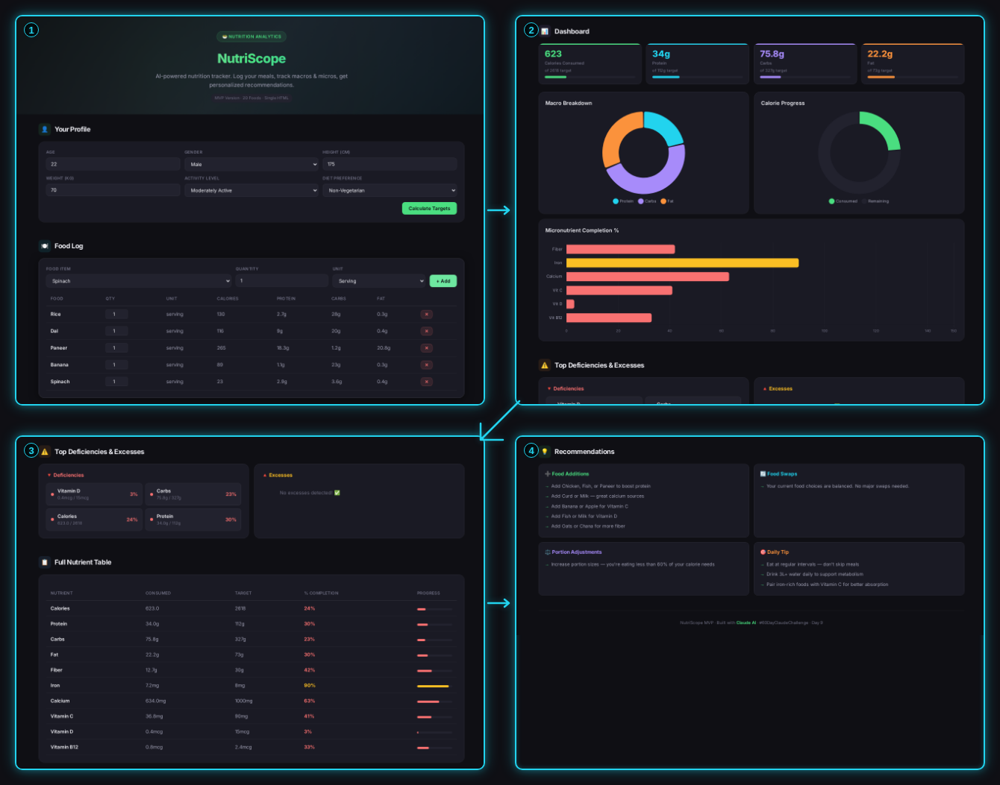
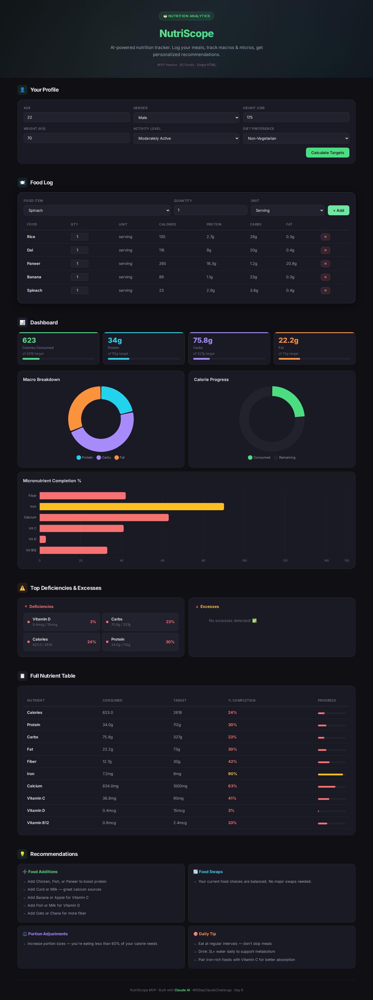
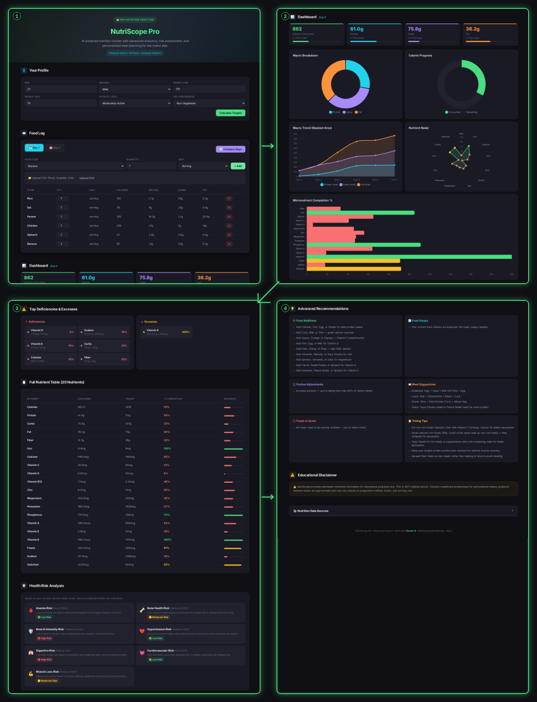
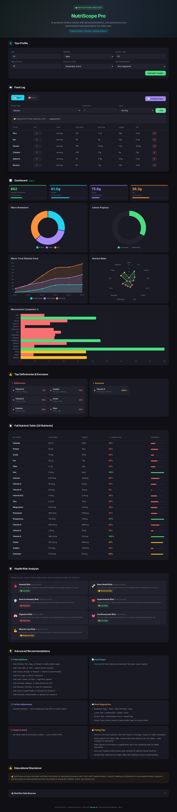

# Day 9 - AI Nutrition Analytics App

Build small. Then build bigger.

---

## What I Worked On

Day 9 of the ABTalks 60-Day Claude AI Challenge was about iterative AI development — the idea that you don't ask AI to build a massive app in one prompt. You build an MVP first, then enhance it. The task was to create NutriScope, a nutrition tracking app, in two stages: Prompt 1 for the MVP (20 foods, basic tracking) and Prompt 2 for the enhanced version (60 foods, CSV upload, meal planner, risk analysis, more nutrients).

For the MVP, I asked Claude to build a single-file HTML app with profile inputs (age, gender, height, weight, activity level, diet preference), food logging for 20 common Indian foods, tracking for 10 nutrients (calories, protein, carbs, fat, fiber, iron, calcium, vitamin C, D, B12), a dashboard with Chart.js charts, deficiency/excess indicators, and personalized recommendations. Claude generated a working app instantly — I logged Rice, Dal, Paneer, and Banana, and the dashboard showed calorie progress, macro breakdown, micronutrient completion bars, and specific food recommendations like "Add Spinach or Rajma for iron" and "Swap Paneer for Chana — same protein, less fat."

Then I pasted Prompt 2 to enhance it. The enhanced version (NutriScope Pro) expanded to 60 foods, added 10 more micronutrients (zinc, magnesium, potassium, phosphorus, vitamin A, E, K, folate, sodium, selenium), CSV upload for bulk food logging, a 2-day meal planner with day comparison, a risk analysis section with health risk indicators, better charts including a nutrient radar chart, advanced recommendations with meal-specific suggestions and timing tips, an educational disclaimer, and nutrition source citations. The difference between the two versions was massive — but the key insight was that each prompt was focused and manageable, so Claude delivered reliably on both.

---

## Prompt 1 — Build MVP

```
Build a complete single-file HTML application called NutriScope.

Requirements:

Profile Inputs:
Age, gender, Height, Weight, Activity Level, Dietary Preference (Vegetarian, Non-Vegetarian, Eggetarian).

Food Logging:
Add Food, Quantity, Unit, Editable Table, Remove Entry.

Food Database:
Include 20 common foods only:
Rice, Roti, Dal, Paneer, Curd, Chana, Rajma, Banana, Apple, Milk, Oats, Bread, Egg, Chicken, Fish, Potato, Poha, Idli, Dosa, Spinach.

Track:
Calories, Protein, Carbs, Fat, Fiber, Iron, Calcium, Vitamin C, Vitamin D, Vitamin B12.

Calculations:
Energy, Macro Targets, Micronutrient Targets, Percentage Completion.

Dashboard:
Energy Progress, Macro Chart, Top Deficiencies, Top Excesses, Nutrient Table.

Recommendations:
Food additions, food swaps, portion adjustments based on dietary preference.

Design:
Premium SaaS UI, Mobile Responsive, Chart.js, Dark Theme, Modern Cards, No Backend, Single HTML File.

Return only the complete HTML code.
```

---

## Prompt 2 — Enhance Application

```
Enhance the existing NutriScope application.

Add:
CSV Upload, 40 more foods, Additional micronutrients, 2-day meal planner, Risk Analysis, Educational Disclaimer, Nutrition Sources, Better Charts, Advanced Recommendations.

Return the updated HTML only.
```

---

## MVP Version — NutriScope



<details>
<summary>📄 Full Page Screenshot</summary>



</details>

The MVP has a clean profile setup (age, gender, height, weight, activity, diet preference), food logging with dropdown for 20 Indian foods, quantity/unit selection, and an editable table with remove buttons. The dashboard shows four metric cards (Calories, Protein, Carbs, Fat) with progress bars, three Chart.js charts (macro doughnut, calorie progress, micronutrient completion), and a full nutrient table with color-coded completion percentages. The deficiency/excess section flags nutrients below 70% or above 120% of target. Recommendations include food additions, swaps, and portion adjustments based on diet preference. Everything works in a single HTML file with no backend.

---

## Enhanced Version — NutriScope Pro



<details>
<summary>📄 Full Page Screenshot</summary>



</details>

NutriScope Pro adds 40 more foods (60 total), 10 more micronutrients (20 total), CSV upload for bulk logging, a 2-day meal planner with day comparison, and a risk analysis section showing health risks like anemia, bone health, and cardiovascular risk with 🟢🟡🔴 indicators. The charts are upgraded with a nutrient radar chart and macro trend area chart. Advanced recommendations now include meal-specific suggestions (breakfast, lunch, dinner based on diet), foods to avoid based on excesses, and timing tips (pair iron with vitamin C, avoid calcium with iron). An educational disclaimer and collapsible nutrition sources section (IFCT, USDA, NIN) are added at the bottom.

---

## MVP vs Enhanced — Comparison

| Feature | MVP | Enhanced |
|---------|-----|----------|
| Foods | 20 | 60 |
| Nutrients Tracked | 10 | 20 |
| CSV Upload | ❌ | ✅ |
| Meal Planner | ❌ | 2-Day + Compare |
| Risk Analysis | ❌ | ✅ 7 Health Risks |
| Chart Types | 3 | 5 |
| Recommendations | Basic | Advanced + Meals + Timing |
| Disclaimer | ❌ | ✅ |
| Data Sources | ❌ | ✅ IFCT, USDA, NIN |

The MVP took one focused prompt and gave me a working app. The enhanced version took a second focused prompt and layered on complexity. If I had asked for everything in one prompt, I'd likely have gotten a broken or incomplete output. Iterative development isn't just a best practice — it's how you actually get AI to build real products.

---

## Biggest Insight

Day 2 taught Structure. Day 3 taught Persona. Day 4 taught Reasoning. Day 5 taught Context. Day 6 taught Translation. Day 7 taught Resource Allocation. Day 8 taught Capability Boundaries. Day 9 taught Iteration.

The biggest lesson today: one big prompt → one big mess. Two focused prompts → two working products. When I asked Claude for the MVP, it knew exactly what to build because the scope was tight — 20 foods, 10 nutrients, basic dashboard. It delivered a clean, working app. When I asked for the enhancement, it knew exactly what to add because the scope was just the delta — 40 more foods, CSV upload, meal planner, risk analysis. It layered on complexity without breaking what already worked. If I had combined both prompts into one mega-request, Claude would have tried to build everything at once and probably missed things or produced buggy code. Iterative development with AI isn't about being cautious. It's about being smart. Build small, verify it works, then enhance. That's how real developers build software, and it turns out that's how you should build with AI too.

---

## Tool of the Day — Iterative Prompting

**What it is:** Instead of asking AI to build a complex application in one shot, you break it into stages — MVP first, then focused enhancement prompts. Each prompt builds on the last.

**How I used it:**
1. Prompt 1: Built the NutriScope MVP with 20 foods and basic tracking
2. Tested the MVP — verified charts, food logging, and recommendations worked
3. Prompt 2: Asked Claude to enhance the working MVP with 40 more foods, CSV, meal planner, risk analysis
4. Compared both versions side by side to see exactly what the enhancement added

**Why it matters:** Iterative prompting mirrors how real software is built — MVP → feedback → enhancement. It dramatically increases reliability because each step is small enough for AI to execute correctly. The enhancement prompt only needs to specify what's new, not rebuild everything.

---

## Key Learnings

- **MVP First, Always.** The MVP prompt was specific and bounded — 20 foods, 10 nutrients, basic dashboard. Claude delivered a working app on the first try. No debugging needed. Small scope = reliable output.

- **Enhancement Prompts Are Easier Than Mega-Prompts.** The second prompt just said "add CSV upload, 40 more foods, meal planner, risk analysis, better charts, advanced recommendations." Because the MVP already existed, Claude didn't need to rebuild the foundation — it just added layers. That's way more reliable than one 200-line mega-prompt.

- **Compare Before and After.** Seeing both versions side by side made the iterative value obvious — the MVP had 20 foods and 3 charts, the enhanced had 60 foods, 5 charts, CSV upload, meal planner, and risk analysis. The gap is exactly what iterative development delivers.

- **Real Developers Iterate.** This isn't an AI trick — it's a software engineering practice. MVP → feedback → enhance. The fact that it works with AI too tells me that good development practices are universal, whether your developer is human or artificial.

- **Comparing across days:** Day 2 = Structure. Day 3 = Persona. Day 4 = Reasoning. Day 5 = Context. Day 6 = Translation. Day 7 = Resource Allocation. Day 8 = Capability Boundaries. Day 9 = Iteration. The pattern: every day adds a new dimension to how I think about AI prompting, and every dimension makes the outputs better. Iteration is the meta-skill — it's not about one perfect prompt, it's about a process of building, testing, and refining.
