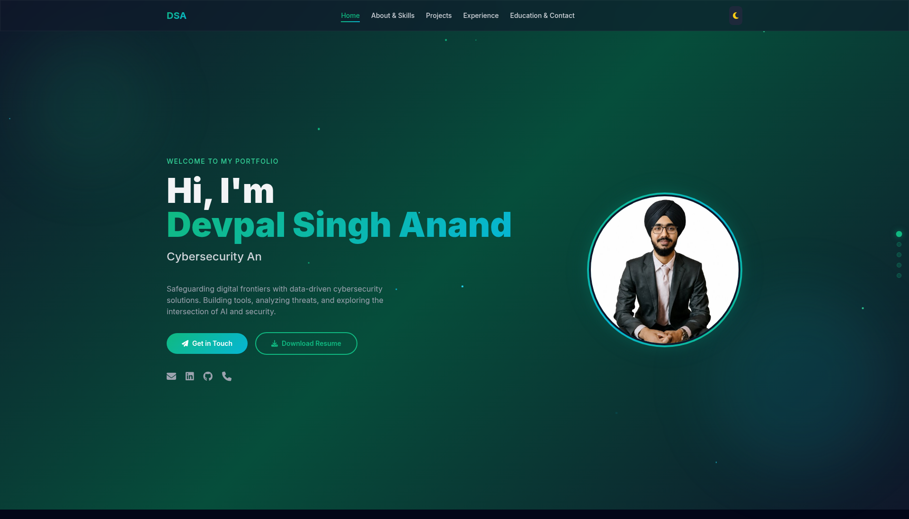
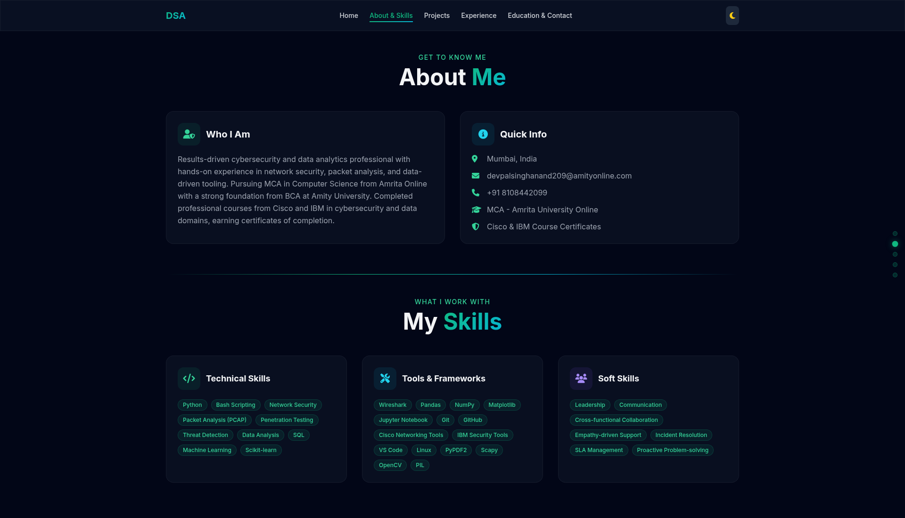
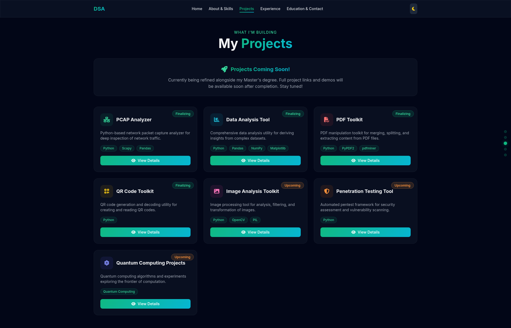
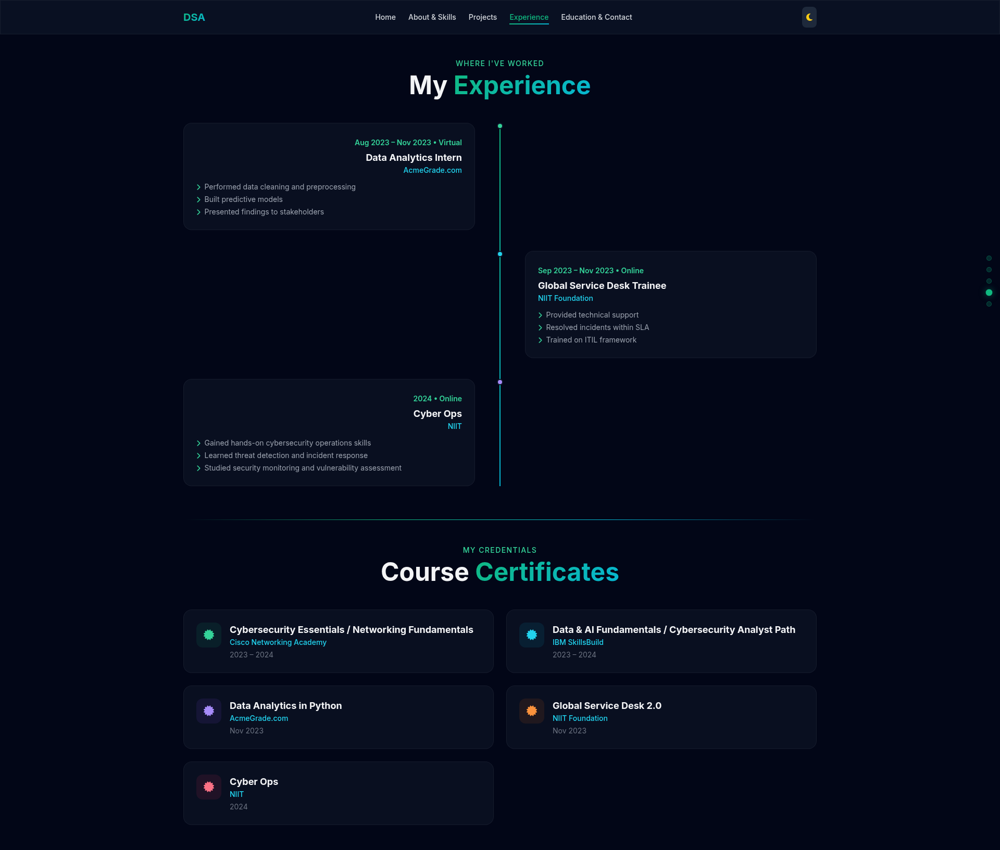
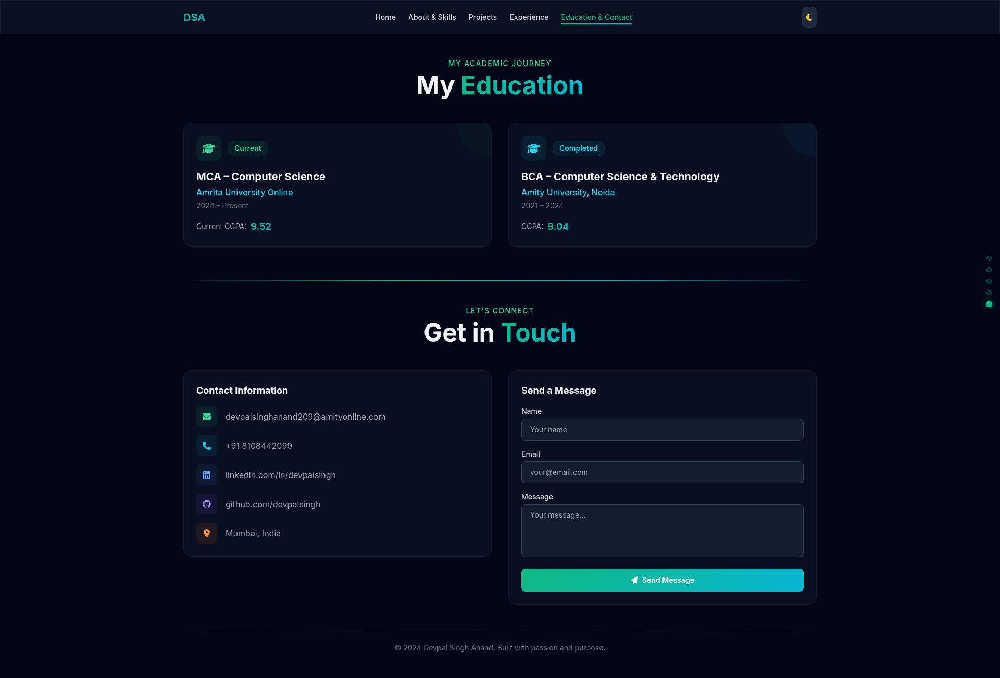

# Day 10 - Personal Portfolio Website

From resume to website in one prompt.

---

## What I Worked On

Day 10 of the ABTalks 60-Day Claude AI Challenge was about personal branding — using Claude to transform my resume into a modern 5-page SPA portfolio website. The task was to create a complete, single-file HTML portfolio with hero section, skills, projects, experience, certifications, and contact form — all generated by AI from my personal data.

I uploaded my resume (Devpal_Singh_Resume_ATS.docx) and profile photo (profilenew.png) to Claude, then used a structured prompt with my personal info, skills, projects, experience, certifications, education, and design preferences. Claude extracted everything from the resume and generated a complete, working portfolio website in a single HTML file. No templates. No drag-and-drop builders. Just one prompt → one working site.

The portfolio is a **5-page Single Page Application** (not a scrolling page) with page-switching navigation: Home, About & Skills, Projects, Experience & Certifications, Education & Contact. It features a hero section with typing animation cycling through my roles (Cybersecurity Analyst → Data Analyst → AI/ML Enthusiast → Python Developer), my profile photo with a static gradient border, skills organized by category (no JavaScript in skills), 7 project cards with tech stacks and status badges (4 Finalizing + 3 Upcoming), an experience timeline with 3 positions, 5 certification cards, education section with CGPA, and a contact form. It has dark/light mode toggle (dark default), glassmorphism cards, smooth page transitions, reveal animations, active nav highlighting, page indicator dots, and full mobile responsiveness — all built with Tailwind CSS via CDN in a single HTML file.

---

## Prompt — Build Portfolio

```
You are an expert full-stack web developer and personal branding designer.

Build a complete, modern, single-file personal portfolio website using HTML, Tailwind CSS (CDN), and vanilla JavaScript for this person:

=== PERSONAL INFO ===
Name: Devpal Singh Anand
Title: Cybersecurity Analyst | Data Analysis | AI/ML Enthusiast
Location: Mumbai, India
Email: devpalsinghanand209@amityonline.com
LinkedIn: linkedin.com/in/devpalsingh
GitHub: github.com/devpalsingh
About: Results-driven cybersecurity and data analytics professional with hands-on experience in network security, packet analysis, and data-driven tooling.

=== SKILLS ===
Technical: Python, Bash Scripting, Network Security, Packet Analysis, Threat Detection, Data Analysis, SQL, ML Fundamentals, Scikit-learn
Tools: Wireshark, Pandas, NumPy, Matplotlib, Jupyter, Git, GitHub, VS Code, Linux, Scapy, OpenCV
Soft Skills: Leadership, Communication, Cross-functional Collaboration, Empathy-driven Support, Incident Resolution, SLA Management

=== PROJECTS ===
1. PCAP Analyzer (Finalizing) — Network packet capture analyzer — Tech: Python, Scapy, Pandas
2. Data Analysis Tool (Finalizing) — CSV/Excel analysis utility — Tech: Python, Pandas, NumPy, Matplotlib
3. PDF Toolkit (Finalizing) — PDF manipulation toolkit — Tech: Python, PyPDF2, pdfminer
4. QR Code Toolkit (Finalizing) — QR generation and decoding utility — Tech: Python
5. Image Analysis Toolkit (Upcoming) — Image processing with OpenCV — Tech: Python, OpenCV, PIL
6. Penetration Testing Tool (Upcoming) — Automated pentest framework — Tech: Python
7. Quantum Computing Projects (Upcoming) — Quantum crypto exploration — Tech: Quantum Computing

=== EXPERIENCE ===
- Data Analytics Intern — AcmeGrade.com (Aug 2023 – Nov 2023)
- Global Service Desk Trainee — NIIT Foundation (Sep 2023 – Nov 2023)
- Cyber Ops — NIIT (2024)

=== CERTIFICATIONS ===
- Cybersecurity Essentials / Networking Fundamentals — Cisco Networking Academy (2023–2024)
- Data & AI Fundamentals / Cybersecurity Analyst Path — IBM SkillsBuild (2023–2024)
- Data Analytics in Python — AcmeGrade.com (Nov 2023)
- Global Service Desk 2.0 — NIIT Foundation (Nov 2023)
- Cyber Ops — NIIT (2024)

=== EDUCATION ===
- MCA – Computer Science — Amrita University Online (2024–Present) — CGPA: 9.52
- BCA – Computer Science & Technology — Amity University, Noida (2021–2024) — CGPA: 9.04

=== DESIGN PREFERENCES ===
Mode: Dark/Light toggle | Style: Modern, minimal, premium | Colors: Emerald Green + Cyan Teal | Font: Inter
Layout: 5-page SPA (not single scrolling page) | No JavaScript in skills section

=== REQUIREMENTS ===
5-page SPA with page switching (Home, About & Skills, Projects, Experience & Certs, Education & Contact), Hero (typing animation, photo, social links), About, Skills (category cards, no JS), Projects (cards with Finalizing/Upcoming badges, clickable modal), Experience Timeline, Certification Cards, Education with CGPA, Contact (form + links), Dark/Light toggle, Mobile responsive, Smooth page transitions, Page indicator dots, Single HTML file, Tailwind CDN, SEO meta tags.

Return only the complete HTML code.
```

---

## Portfolio Screenshots

### Page 1: Home


### Page 2: About & Skills


### Page 3: Projects


### Page 4: Experience & Certifications


### Page 5: Education & Contact


---

## Portfolio Features

| Feature | Details |
|---------|---------|
| Layout | 5-page SPA with page-switching navigation |
| Hero | Typing animation, profile photo (static border), social links, CTA buttons |
| About Me | Bio + 4 stat cards |
| Skills | Category-based cards with tech tag pills (no JavaScript listed) |
| Projects | 7 cards — 4 Finalizing (green) + 3 Upcoming (orange), clickable modal |
| Experience | Vertical timeline, 3 positions (Acmegrade, NIIT Foundation, NIIT) |
| Certifications | 5 certification cards (Cisco, IBM, Acmegrade, NIIT Foundation, NIIT) |
| Education | 2 cards (MCA CGPA 9.52, BCA CGPA 9.04) |
| Contact | Form + direct contact cards |
| Dark/Light | Toggle with localStorage persistence |
| Responsive | Hamburger nav, flexible grids |
| Animations | Page transitions, scroll reveal, typing, floating particles |
| Navigation | Desktop nav + mobile hamburger + page indicator dots |
| File | Single HTML, ~111KB, no build step |

---

## Biggest Insight

Your portfolio is your first impression. Claude didn't just copy my resume — it designed a premium website around it. The layout, the animations, the color scheme, the responsive design — all generated from a structured prompt. The lesson: AI doesn't replace your personal brand, it amplifies it. Give it your story, and it gives you a stage.

---

## Tool of the Day — Personal Branding with AI

**What it is:** Using AI to generate a professional portfolio that showcases your skills, projects, and experience — without writing code manually.

**How I used it:**
1. Uploaded my resume and profile photo to Claude
2. Used a structured prompt with personal info, skills, projects, and design preferences
3. Claude extracted resume data and generated a complete portfolio
4. One prompt → one working website
5. Iteratively refined: removed KultureHire, added Cyber Ops (NIIT), updated CGPAs, changed badges to Finalizing/Upcoming

**Why it matters:** A portfolio is essential for career growth, but most people never build one because it takes time and design skills. AI removes that barrier — you just need your content and a clear prompt.

---

## Key Learnings

- **Structured Prompts = Better Output.** The prompt template with clear sections (Personal Info, Skills, Projects, Design Preferences) gave Claude everything it needed to build a tailored portfolio. Generic prompts = generic results.

- **Resume as Data Source.** Uploading my resume meant Claude could extract real details instead of me typing everything manually. The portfolio felt authentic because the content was mine.

- **Design Preferences Matter.** Specifying "Emerald Green + Cyan Teal, dark default, glassmorphism, Inter font" gave the portfolio a distinct identity. Without design preferences, you get a default look.

- **Iteration is Key.** The first version was a skeleton. Through multiple rounds of feedback — removing KultureHire, adding Cyber Ops, correcting "Certified" to "Course Certificates", changing "In Progress" to "Finalizing/Upcoming", updating CGPAs — the portfolio evolved into something truly personal and accurate.

- **Single File = Zero Friction.** One HTML file, no build step, no dependencies to install. Open in browser, and it works. That's the power of Tailwind CDN + vanilla JS.

- **Comparing across days:** Day 2 = Structure. Day 3 = Persona. Day 4 = Reasoning. Day 5 = Context. Day 6 = Translation. Day 7 = Resource Allocation. Day 8 = Capability Boundaries. Day 9 = Iteration. Day 10 = Personal Branding. Every day adds a dimension — today was about using AI to represent yourself professionally.
