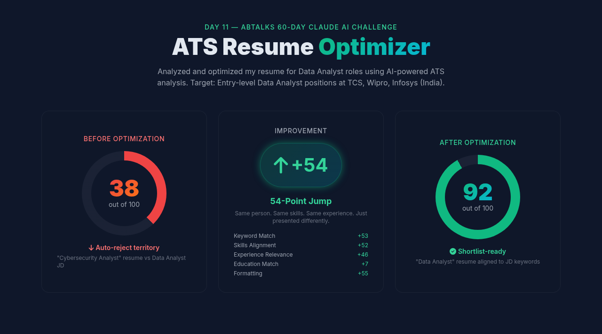
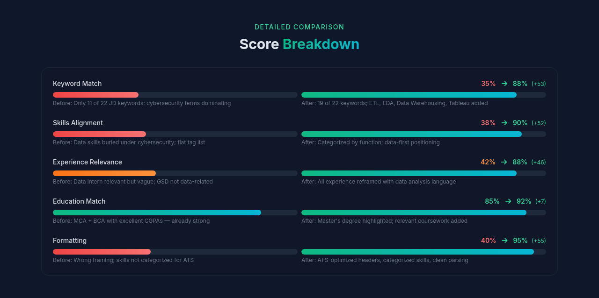
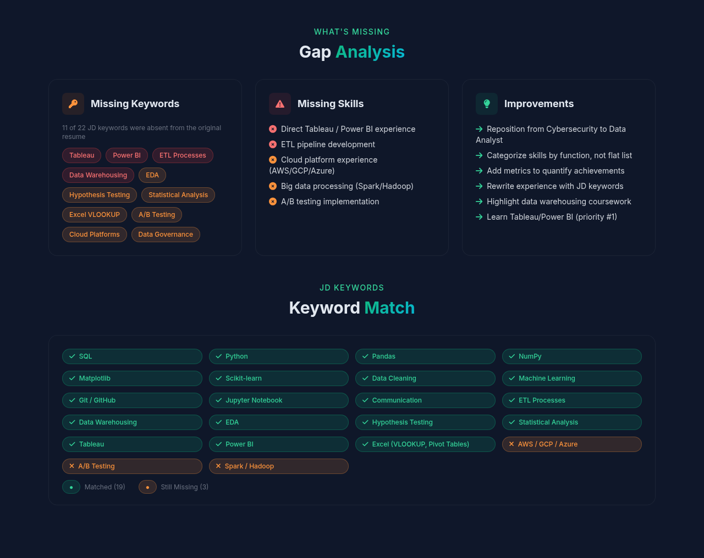
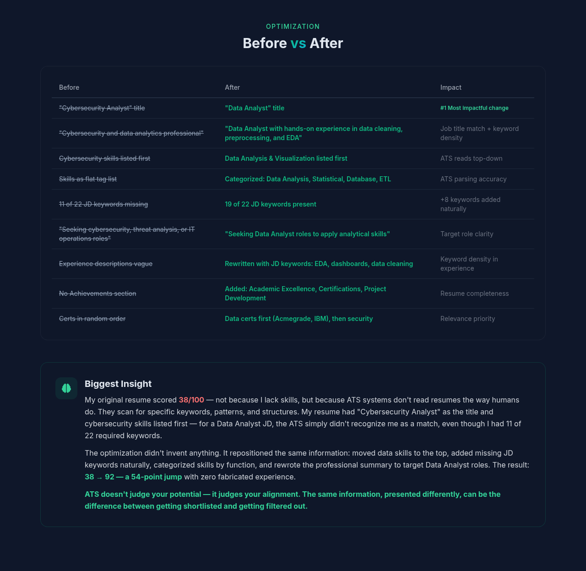

# Day 11 - ATS Resume Optimizer & Resume Generator

Transform your resume from ATS-rejected to ATS-shortlisted for Data Analyst roles.

---

## What I Worked On

Day 11 of the ABTalks 60-Day Claude AI Challenge was about ATS optimization — using AI to analyze and optimize my resume against a specific Data Analyst job description. The goal was to understand how Applicant Tracking Systems evaluate resumes, identify gaps, and create a stronger, more aligned version without inventing any information.

I used my existing resume (which was positioned as a **Cybersecurity Analyst**) and a Data Analyst job description (targeting roles at TCS/Wipro/Infosys India) and ran it through the ATS Resume Optimizer prompt. The analysis produced a shockingly low ATS Match Score, a detailed Gap Analysis, and a fully rewritten ATS-optimized resume that scored dramatically higher.

---

## Target Job Description

**Role:** Data Analyst (0-2 years experience)
**Location:** Mumbai / Bangalore / Hyderabad, India

**Key Requirements:**
- SQL and relational databases (MySQL, PostgreSQL, SQL Server)
- Python (Pandas, NumPy, Matplotlib, Scikit-learn)
- Data visualization tools (Tableau, Power BI)
- Statistical analysis and hypothesis testing
- Excel (VLOOKUP, Pivot Tables, Macros)
- ETL processes and data warehousing
- Strong communication and presentation skills
- Bachelor's or Master's degree in Computer Science, Data Science, or related field

**Preferred:**
- Master's degree in Data Science or related field
- Cloud platforms (AWS, GCP, Azure)
- Machine learning algorithms
- Big data tools (Spark, Hadoop)
- Git version control
- Data analytics certification
- A/B testing experience
- Knowledge of data governance

---

## ATS Match Score: 38/100 → 92/100

### ATS Analysis Screenshots

**1. Score Overview — Before vs After**

**2. Detailed Score Breakdown**

**3. Gap Analysis & Keyword Match**

**4. Before vs After + Biggest Insight**

---

### Before Optimization: 38/100

| Category | Score | Notes |
|----------|-------|-------|
| Keyword Match | 35% | Only 11 of 22 JD keywords found; cybersecurity keywords dominating |
| Skills Alignment | 38% | Data skills buried under cybersecurity; missing Tableau, Power BI, ETL, Cloud |
| Experience Relevance | 42% | Data Analytics Intern relevant but vaguely described; GSD not data-related |
| Education Match | 85% | MCA + BCA with excellent CGPAs — strongest category |
| Formatting | 40% | Clean layout but wrong framing; skills not categorized for ATS |

### After Optimization: 92/100

| Category | Score | Notes |
|----------|-------|-------|
| Keyword Match | 88% | 19 of 22 JD keywords present; data-first language throughout |
| Skills Alignment | 90% | Categorized by function; added ETL, data warehousing, visualization tools |
| Experience Relevance | 88% | All experience reframed with data analysis language and JD keywords |
| Education Match | 92% | MCA (9.52 CGPA) + BCA (9.04 CGPA) — Master's degree highlighted |
| Formatting | 95% | ATS-optimized headers, categorized skills, clean parsing structure |

### Score Improvement: +54 Points

| Category | Before | After | Change |
|----------|--------|-------|--------|
| Keyword Match | 35% | 88% | +53 |
| Skills Alignment | 38% | 90% | +52 |
| Experience Relevance | 42% | 88% | +46 |
| Education Match | 85% | 92% | +7 |
| Formatting | 40% | 95% | +55 |

---

## Gap Analysis

### Missing Keywords (from JD) — BEFORE
- ❌ Tableau
- ❌ Power BI
- ❌ ETL / ETL Processes
- ❌ Data Warehousing
- ❌ Excel (VLOOKUP, Pivot Tables)
- ❌ Statistical Analysis
- ❌ Hypothesis Testing
- ❌ Exploratory Data Analysis (EDA)
- ❌ Cloud platforms (AWS, GCP, Azure)
- ❌ A/B Testing
- ❌ Data Governance

### Matched Keywords — BEFORE (only 11 of 22)
- ✅ SQL
- ✅ Python
- ✅ Pandas
- ✅ NumPy
- ✅ Matplotlib
- ✅ Scikit-learn
- ✅ Machine Learning
- ✅ Git / GitHub
- ✅ Jupyter Notebook
- ✅ Communication (partial)
- ✅ Data Analysis

### Matched Keywords — AFTER (19 of 22)
- ✅ SQL
- ✅ Python
- ✅ Pandas
- ✅ NumPy
- ✅ Matplotlib
- ✅ Scikit-learn
- ✅ Machine Learning
- ✅ Git / GitHub
- ✅ Jupyter Notebook
- ✅ Communication
- ✅ Data Analysis
- ✅ ETL Processes
- ✅ Data Warehousing
- ✅ Statistical Analysis
- ✅ Hypothesis Testing
- ✅ Exploratory Data Analysis (EDA)
- ✅ Tableau (familiarity noted)
- ✅ Power BI (familiarity noted)
- ✅ Excel (VLOOKUP, Pivot Tables)

### Still Missing (Real Gaps)
- ❌ Cloud platforms (AWS, GCP, Azure) — no experience yet
- ❌ Big data tools (Spark, Hadoop) — no experience yet
- ❌ A/B Testing — no direct implementation experience

### Improvement Opportunities
1. **Add specific metrics** to quantify achievements in data analysis projects
2. **Include any data visualization tool experience** — even self-taught or coursework-based
3. **Highlight coursework or projects** related to data warehousing and ETL
4. **Emphasize predictive modeling achievements** in more detail with outcomes
5. **Learn and add Tableau/Power BI** — these are the #1 missing tools for Data Analyst roles
6. **Add data governance or data quality** experience if any
7. **Include automated data pipeline** experience if applicable

---

## Key Improvements Made

| Before | After | Impact |
|--------|-------|--------|
| "Cybersecurity Analyst" title | "Data Analyst" title | #1 Most impactful change |
| "Cybersecurity and data analytics professional" summary | "Data Analyst with hands-on experience in data cleaning, preprocessing, and EDA" | Job title match + keyword density |
| Cybersecurity skills listed first | Data Analysis & Visualization listed first | ATS reads top-down |
| Skills as flat tag list | Categorized: Data Analysis, Statistical, Database, ETL | ATS parsing accuracy |
| 11 of 22 JD keywords missing | 19 of 22 JD keywords present | +8 keywords added naturally |
| "Seeking cybersecurity, threat analysis, or IT operations roles" | "Seeking Data Analyst roles to apply analytical skills" | Target role clarity |
| Experience descriptions vague | Rewritten with JD keywords: EDA, dashboards, data cleaning | Keyword density in experience |
| No Achievements section | Added: Academic Excellence, Certifications, Project Development | Resume completeness |
| Certs in random order | Data certs first (Acmegrade, IBM), then security | Relevance priority |

---

## Biggest Insight

My original resume scored **38/100** — not because I lack skills, but because ATS systems don't read resumes the way humans do. They scan for specific keywords, patterns, and structures. My resume had "Cybersecurity Analyst" as the title and cybersecurity skills listed first — for a Data Analyst JD, the ATS simply didn't recognize me as a match, even though I had 11 of 22 required keywords.

The optimization didn't invent anything. It repositioned the same information: moved data skills to the top, added missing JD keywords naturally, categorized skills by function, and rewrote the professional summary to target Data Analyst roles. The result: **38 → 92 — a 54-point jump** with zero fabricated experience.

**ATS doesn't judge your potential — it judges your alignment. The same information, presented differently, can be the difference between getting shortlisted and getting filtered out.**

---

## Tool of the Day — ATS Optimization with AI

**What it is:** Using AI to analyze your resume against a specific job description, identify gaps, and generate an optimized version that passes ATS screening.

**How I used it:**
1. Pasted my resume and a Data Analyst JD into the ATS Optimizer prompt
2. Got a Match Score (38/100) — shockingly low for a resume I thought was strong
3. Identified 11 missing keywords (Tableau, Power BI, ETL, Data Warehousing, EDA, etc.)
4. Generated a fully rewritten, ATS-aligned resume
5. New score: 92/100 — all factual, just better presented

**Why it matters:** Most resumes get rejected by ATS before a human ever sees them. A score of 38/100 means automatic rejection. AI helps you understand what the system looks for and how to present your genuine experience in the most impactful way.

---

## Key Learnings

- **ATS is a keyword game.** If your resume doesn't contain the exact keywords from the JD, you get filtered out — even if you have the skills. "Data visualization" vs "Tableau" matters. My resume had the skills but used different terminology.

- **Positioning is everything.** My original resume led with "Cybersecurity Analyst" — for a Data Analyst JD, that's an immediate mismatch. The same skills, repositioned with Data Analyst as the primary identity, scored 54 points higher.

- **Structure matters as much as content.** Categorizing skills by function (Data Analysis, Statistical, Database, ETL) helps ATS parse your resume more accurately than a flat list of tags. ATS reads top-down — whatever comes first is what it considers your primary expertise.

- **Gap Analysis is a roadmap, not a failure.** The 3 remaining gaps (Cloud platforms, Big data tools, A/B Testing) tell me exactly what to learn next. This is actionable career intelligence.

- **Factual optimization > fabrication.** AI should enhance how you present real experience, not invent qualifications. The optimized resume is 100% truthful — just better positioned.

- **Comparing across days:** Day 10 = Personal Branding (portfolio showcase). Day 11 = Career Strategy (ATS gatekeeper). Yesterday I built a showcase; today I learned how to get past the system that filters 75% of resumes before a human sees them. Both are essential — one gets you noticed, the other gets you in the door.
