# Day 12 - Job Search & Personal Branding Toolkit

Build your complete job search and personal branding toolkit — cover letters, outreach emails, networking messages, personal branding, and interview prep.

---

## What I Worked On

Day 12 of the ABTalks 60-Day Claude AI Challenge was about going beyond resumes. Day 11 taught me how to get past ATS filters. Day 12 was about everything after — how you reach out, how you present yourself, how you network, and how you prepare for interviews.

I used my ATS-optimized resume from Day 11, my ABTalks profile assessment, and a Data Analyst job description to generate a full 12-section job search toolkit using AI. Every section is personalized to my profile and ready to use immediately.

---

## Target Role

**Role:** Data Analyst (0-2 years experience)
**Location:** Mumbai / Bangalore / Remote
**Work Preference:** Remote only (cannot relocate presently or work from office due to current circumstances, but ready whenever the job calls)
**Target Companies:** TCS, Wipro, Infosys, Accenture, Deloitte, Cognizant

---

## The Complete Job Search & Personal Branding Toolkit

---

### SECTION 1: ATS-Friendly Cover Letter

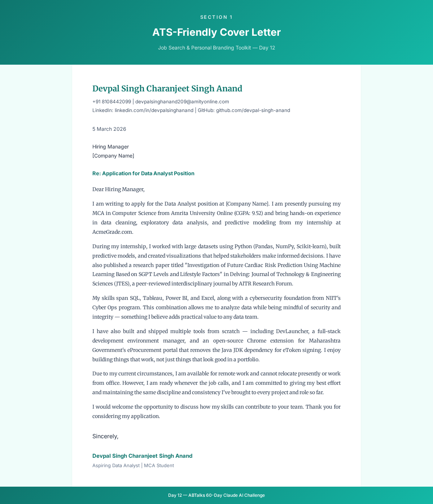

**When to use:** Attach this with your resume when applying through company portals, job boards, or email applications. The cover letter complements your resume — it should never just repeat it.

---

### SECTION 2: Recruiter Outreach Email

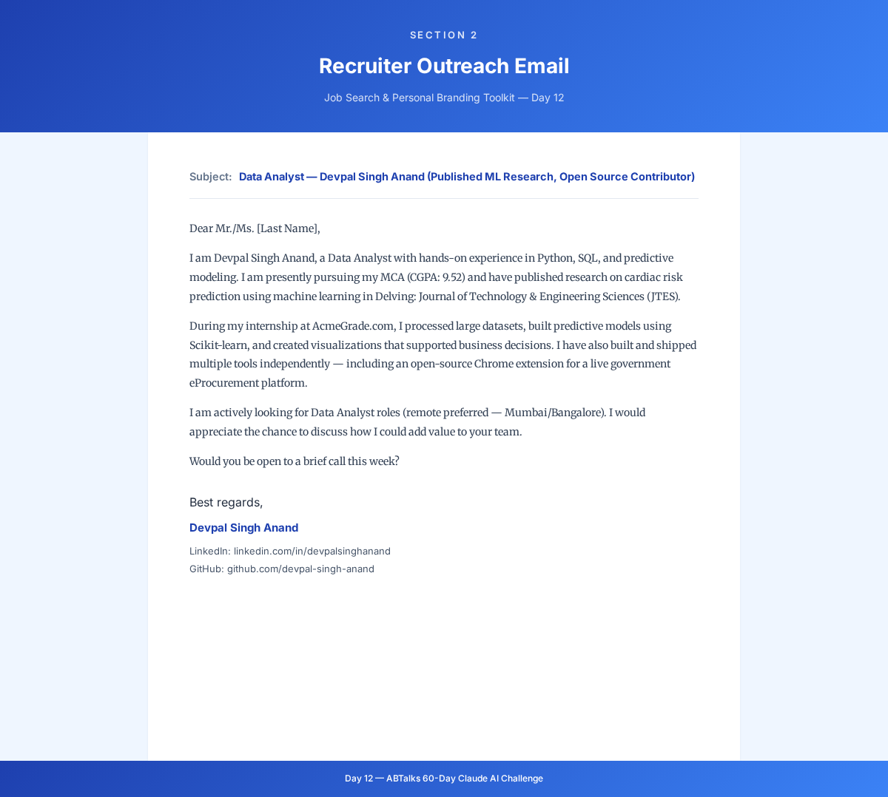

**When to use:** Send this when reaching out to a recruiter on LinkedIn, via email, or through a job platform. Keep it short — recruiters scan emails in under 10 seconds. The goal is to get a reply, not to tell your whole story.

---

### SECTION 3: Hiring Manager Email

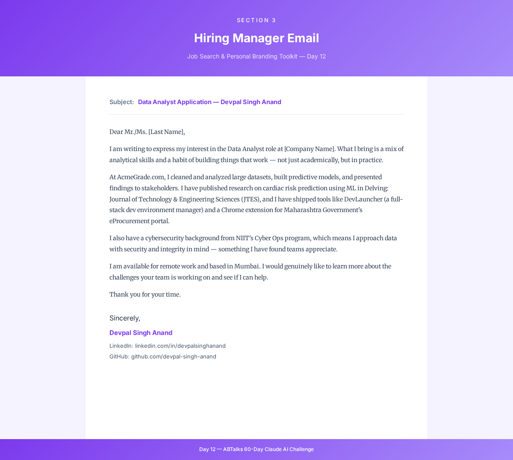

**When to use:** Send this when you have identified the hiring manager for a role you are targeting — through LinkedIn, a referral, or the job posting. This is more substantive than a recruiter email because hiring managers want to see depth and genuine interest in their team's work.

---

### SECTION 4: LinkedIn Connection Request

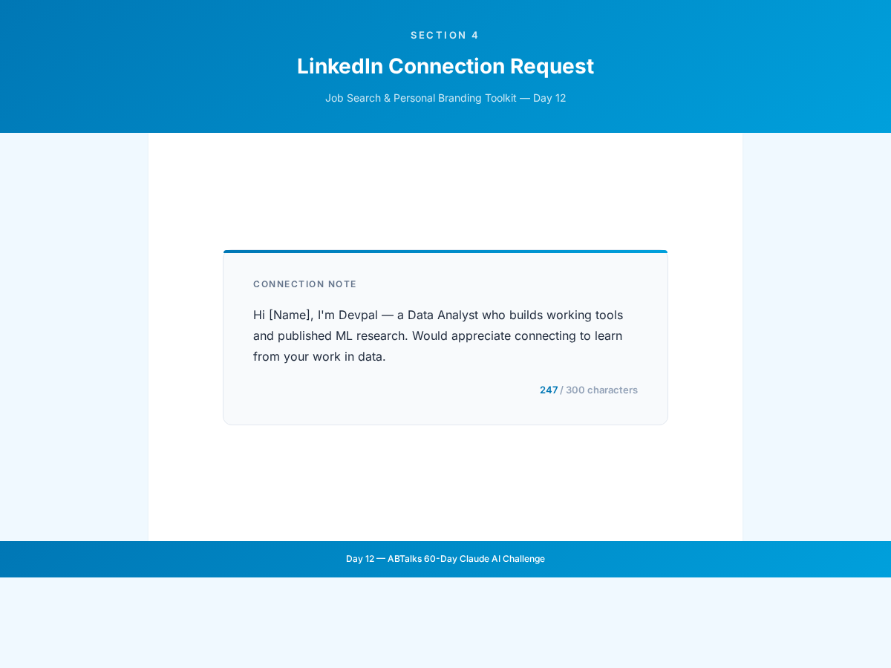

**When to use:** Use this when sending a connection request on LinkedIn to recruiters, professionals in your target companies, or people in your industry. LinkedIn limits connection notes to 300 characters — every word counts. Keep it human, genuine, and not sales-pitchy.

---

### SECTION 5: Referral Request Message

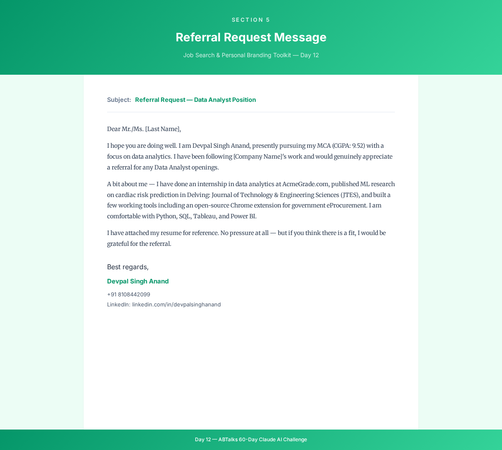

**When to use:** Send this to someone you know (or have a mutual connection with) who works at a company you are targeting. The key is to be specific about the role, make it easy for them to refer you, and keep it low-pressure. Always attach your resume.

---

### SECTION 6: Follow-Up Email

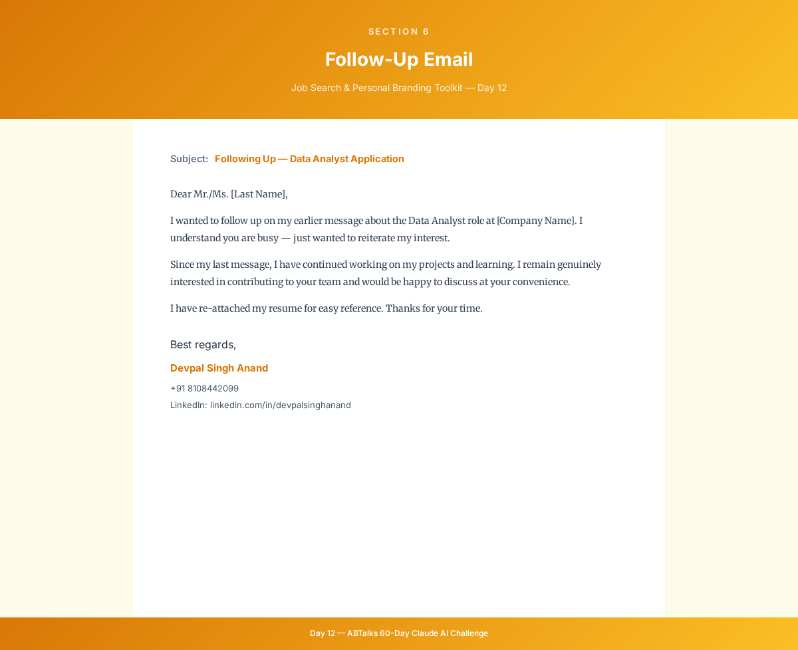

**When to use:** Send this 5 business days after your initial outreach if you have not received a response. Keep it short, respectful, and genuine — no pressure, no guilt-tripping. The goal is to gently reappear on their radar, not to push.

---

### SECTION 7: 30-Second Professional Introduction

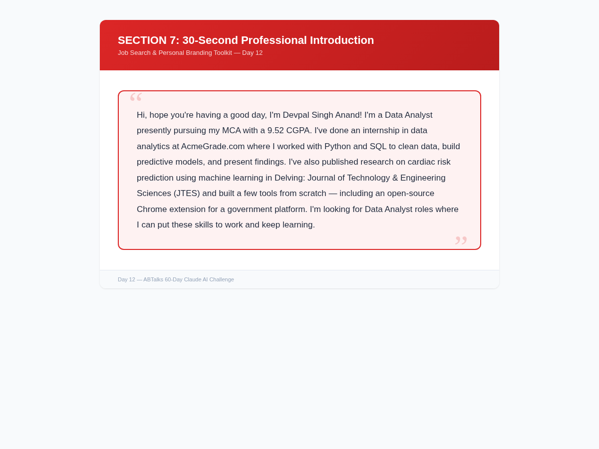

**When to use:** Use this at interviews, networking events, career fairs, or any professional introduction. Speak it naturally at a conversational pace — it should take roughly 30 seconds. Genuine, not rehearsed-sounding.

---

### SECTION 8: Top 10 Job Titles Best Suited for My Profile

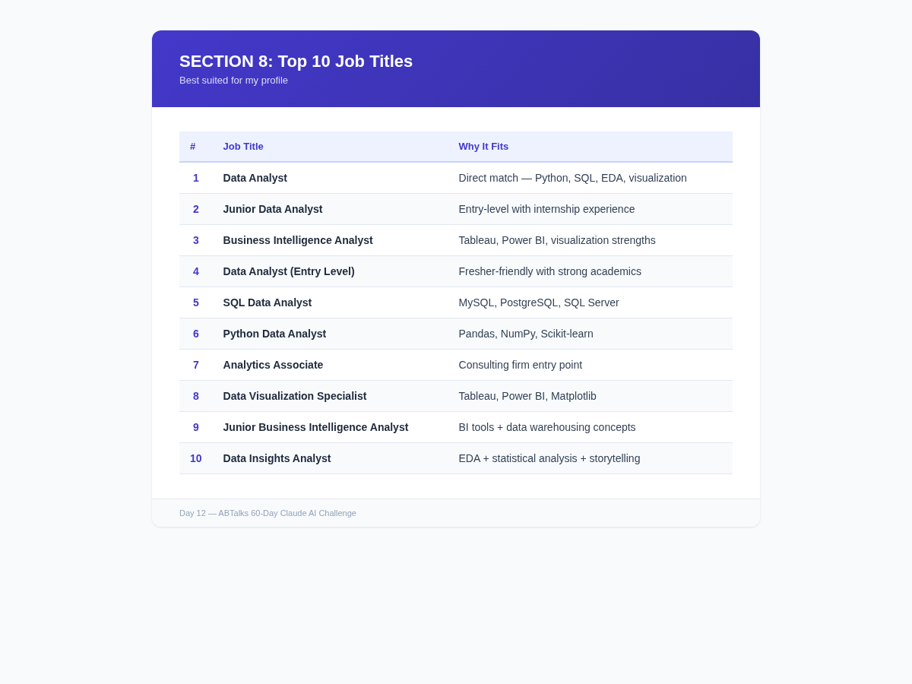

**When to use:** Use this list to focus your job search. Apply to roles matching these titles on job boards, company career pages, and LinkedIn. The closer the title matches, the higher your chances of getting past ATS filters and catching a recruiter's attention.

---

### SECTION 9: Key Strengths Recruiters Will Notice

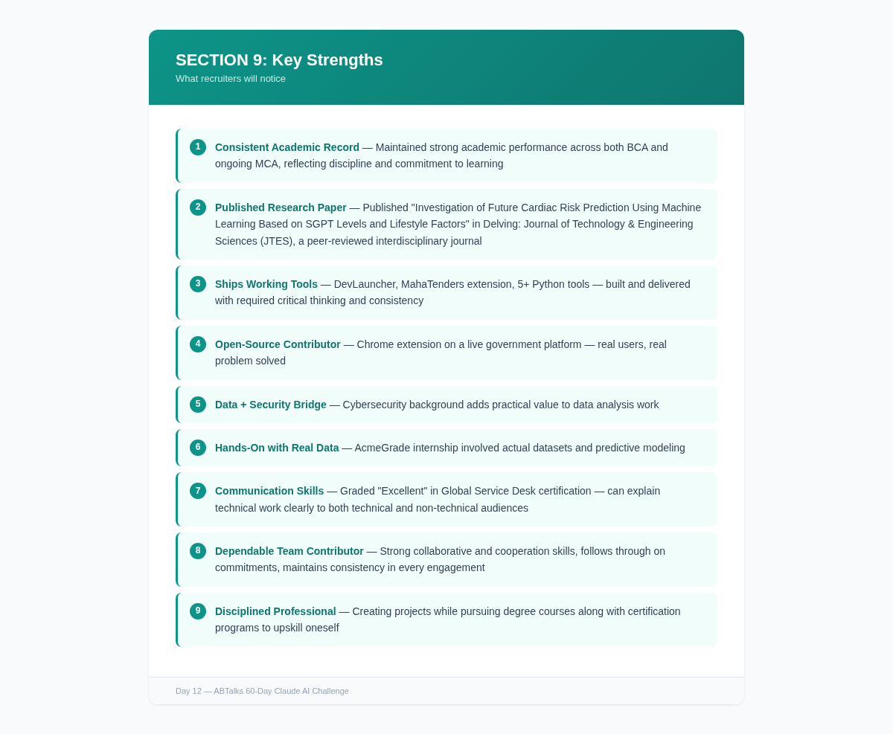

**When to use:** Reference these when tailoring your resume, writing cover letters, or preparing for interviews. Each strength is backed by evidence — not just claims. Recruiters look for proof, and these are your proof points.

---

### SECTION 10: Skill Gap Analysis

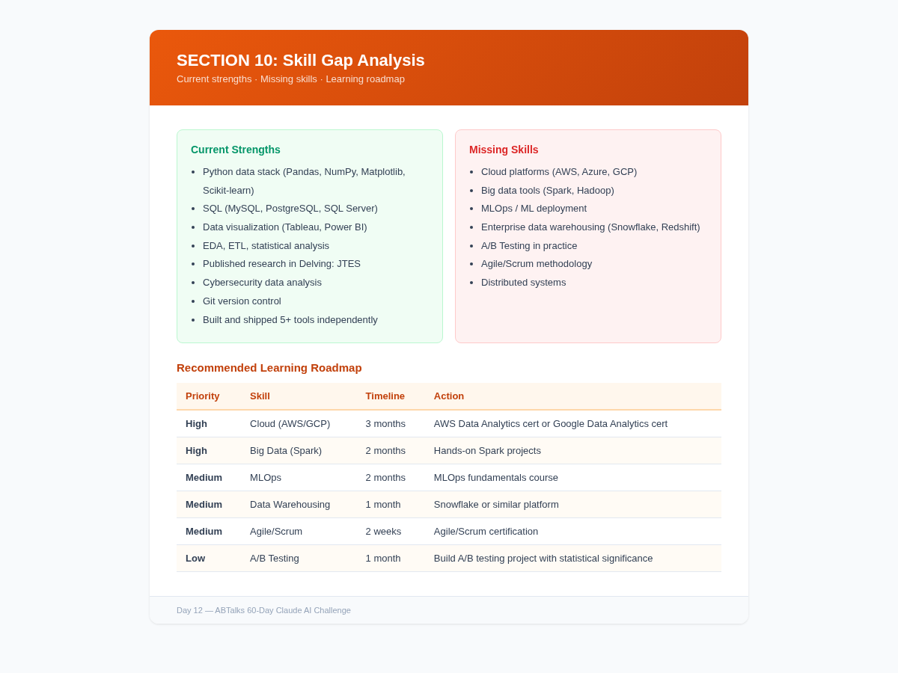

**When to use:** Use this as a personal learning roadmap. When recruiters or hiring managers ask about gaps, be honest — then show this plan. It demonstrates self-awareness, initiative, and a growth mindset. Prioritize the high-priority items first.

---

### SECTION 11: Personal Brand Summary

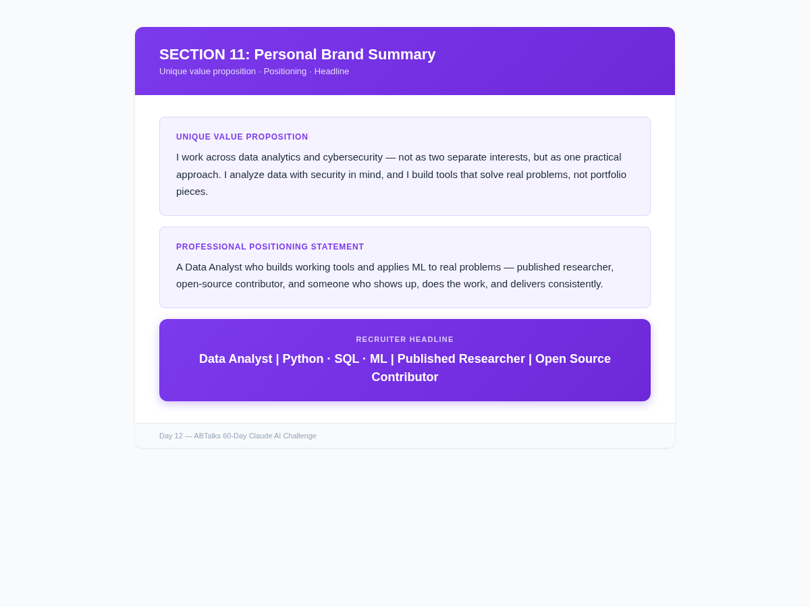

**When to use:** Your personal brand is the foundation for your LinkedIn headline, resume summary, portfolio bio, and any professional introduction. If you don't define your brand, others will define it for you. These three elements — value proposition, positioning statement, and headline — should be consistent across every platform where you appear professionally.

---

### SECTION 12: Interview Talking Points

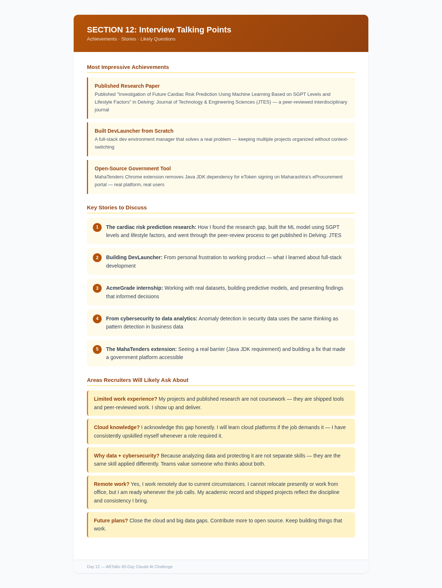

**When to use:** Review these before any interview, networking conversation, or professional meeting. The key is to tell stories, not memorize answers. Stories are memorable. Bullet points are forgettable. Use the achievements as your opening, the stories as your substance, and the Q&A prep as your safety net.

---

## Biggest Insight

Before Day 12, I thought getting hired was about having a good resume. After building this toolkit, I realized the resume is just one piece of the puzzle.

The cover letter gets you noticed. The outreach email gets you a conversation. The referral request gets you past the pile. The follow-up shows persistence. The 30-second intro makes you memorable. The personal brand makes you findable. And the interview talking points make you confident.

Each of these is a different conversation with a different person — and they all need different messaging. What you say to a recruiter is different from what you say to a hiring manager, which is different from what you say to a potential referrer. One resume can't do all of that. You need a complete toolkit.

**The job search isn't a single event — it's a campaign. And every campaign needs different tools for different situations.**

---

## Tool of the Day — Job Search & Personal Branding with AI

**What it is:** Using AI to generate a complete job search toolkit — cover letters, outreach emails, LinkedIn messages, personal branding, and interview prep — all personalized to your profile and target role.

**How I used it:**
1. Combined my ATS-optimized resume (Day 11) + ABTalks profile assessment + Data Analyst JD
2. Used the mega prompt to generate all 12 sections
3. Got personalized content based on my actual work — published research, shipped tools, dual specialization
4. Identified skill gaps with a prioritized learning roadmap
5. Built interview talking points around stories I can tell, not answers I can memorize

**Why it matters:** Most job seekers use the same generic resume for every interaction. AI helps you create targeted messaging for every touchpoint — recruiter, hiring manager, referral, follow-up — each tailored for that specific conversation.

---

## Key Learnings

- **One resume, many conversations.** Your resume is a static document, but your job search involves dozens of dynamic conversations. Each one needs different messaging — the recruiter wants a quick match, the hiring manager wants depth, the referrer wants trust.

- **Personalization beats templates.** Generic cover letters get ignored. Content that references your specific work — published research, shipped tools — makes you credible without sounding boastful.

- **Your brand exists whether you build it or not.** If you don't define your professional identity, recruiters will define it for you. The personal brand summary forces you to articulate what makes you different — honestly.

- **Skill gaps are a roadmap, not a weakness.** The gap analysis didn't just tell me what I'm missing — it gave me a prioritized learning roadmap with timelines. Cloud and big data first. A/B testing later. This is practical career guidance.

- **Interview prep is about stories, not answers.** The talking points gave me stories to tell — the cardiac risk prediction story, the DevLauncher story, the MahaTenders story. Stories are more memorable than bullet points.

- **Comparing across days:** Day 11 = ATS gatekeeper (getting past the filter). Day 12 = Complete job search campaign (everything after the filter). Day 11 got my foot in the door; Day 12 gave me the full toolkit for every conversation that follows.
