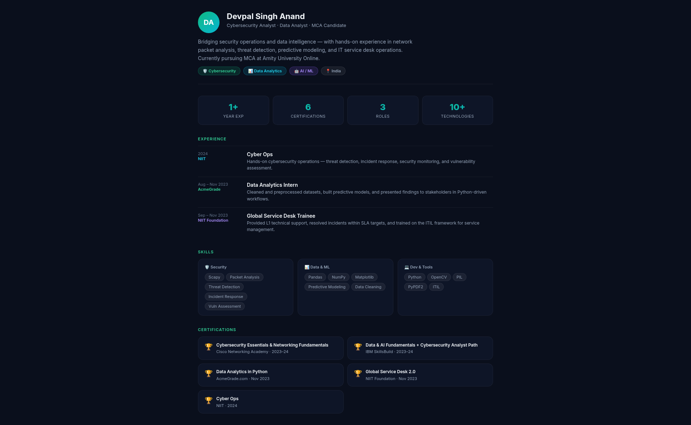
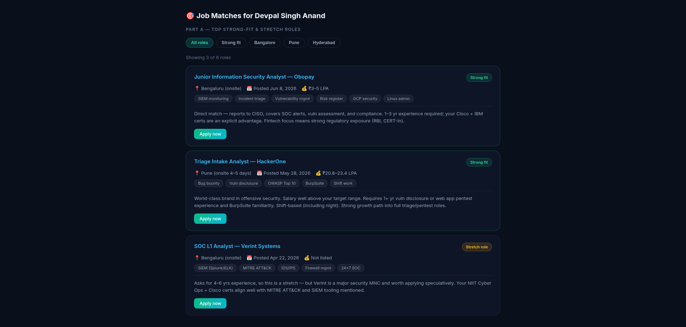
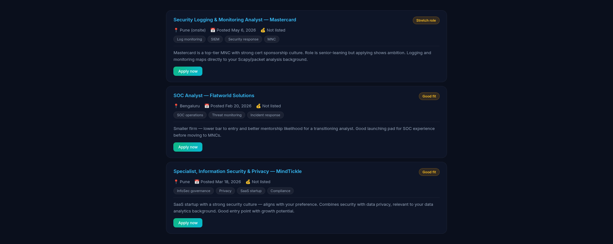
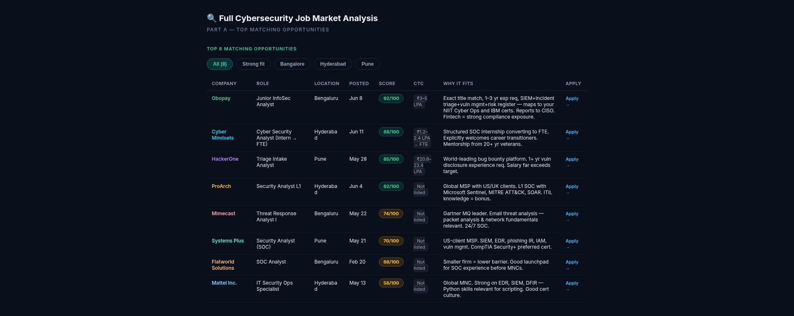
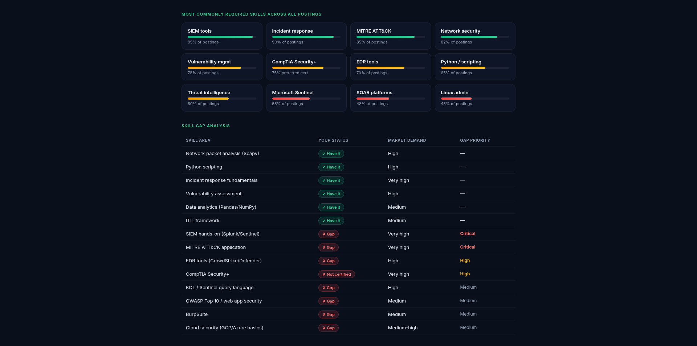
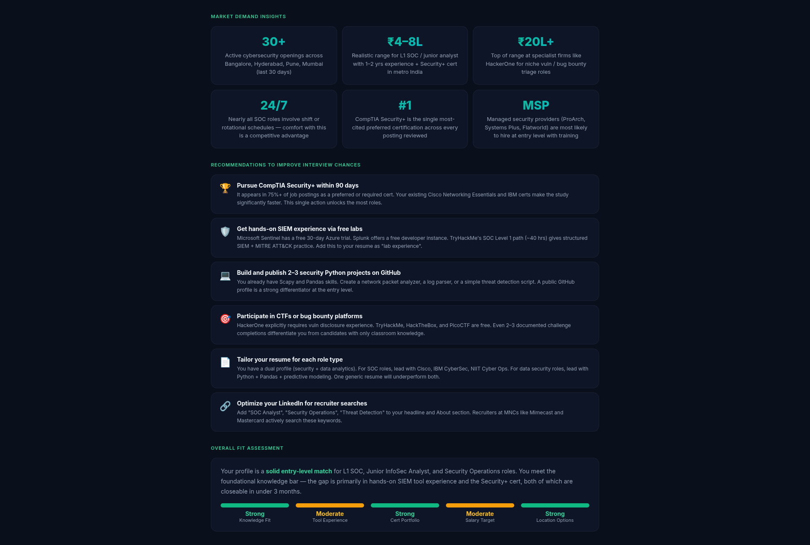

# Day 13 — AI Job Search Assistant

## 🔗 Challenge: 60-Day Claude Challenge | Day 13
**Task:** Build Your AI Job Search Assistant using Claude Connectors (Indeed)

---

## 🎯 Objective

Claude Connectors allow Claude to access external information sources and use them for personalized analysis. By connecting Indeed, Claude helps automate job discovery, role matching, opportunity prioritization, and career planning.

---

## 📝 Prompt 1: Professional Profile

```text
I am Devpal Singh Anand, a Cybersecurity Analyst and Data Analyst with AI/ML enthusiasm. Here is my professional background:

Current Role: Cybersecurity-focused professional transitioning into full-time security roles
Years of Experience: 1+ year of combined internship and training experience
Key Skills and Technologies: Python, Scapy, Pandas, NumPy, Matplotlib, OpenCV, PIL, PyPDF2, Network Packet Analysis, Threat Detection, Incident Response, Vulnerability Assessment, Security Monitoring, Data Cleaning & Preprocessing, Predictive Modeling
Industry/Domain Expertise: Cybersecurity Operations, Data Analytics, IT Service Desk (ITIL Framework)
Current Company Type: Currently pursuing Master of Computer Applications (MCA) at Amity University Online
Current Location: India
Notable Achievements & Certifications:
- Cybersecurity Essentials & Networking Fundamentals — Cisco Networking Academy (2023-2024)
- Data & AI Fundamentals & Cybersecurity Analyst Path — IBM SkillsBuild (2023-2024)
- Data Analytics in Python — AcmeGrade.com (Nov 2023)
- Global Service Desk 2.0 — NIIT Foundation (Nov 2023)
- Cyber Ops — NIIT (2024)

Work Experience:
- Data Analytics Intern at AcmeGrade.com (Aug 2023 – Nov 2023) — Performed data cleaning, built predictive models, presented findings to stakeholders
- Global Service Desk Trainee at NIIT Foundation (Sep 2023 – Nov 2023) — Provided technical support, resolved incidents within SLA, trained on ITIL framework
- Cyber Ops at NIIT (2024) — Gained hands-on cybersecurity operations skills, learned threat detection and incident response, studied security monitoring and vulnerability assessment
```

### Output — Professional Profile



---

## 📝 Prompt 2: Job Search Criteria

```text
My target job requirements:

Desired Job Titles: Cybersecurity Analyst, SOC Analyst, Information Security Analyst, Threat Analyst, Junior Penetration Tester, Security Operations Center Analyst, Data Security Analyst, IT Security Analyst
Preferred Company Types: Tech companies, MNCs with dedicated security teams, Cybersecurity firms, Consulting firms with security practices, Startups with strong security culture
Preferred Locations: Remote, Hybrid, or Onsite in India (Delhi NCR, Bangalore, Hyderabad, Pune, Mumbai preferred). Open to fully remote roles globally.
Salary Expectations: ₹4 LPA – ₹8 LPA for entry-level roles in India; open to competitive compensation for remote international roles
Industries or Companies to Exclude: No specific exclusions, but prefer roles focused on cybersecurity over general IT support
Job Posting Recency: Last 30 days preferred
Additional Preferences:
- Roles that offer hands-on security operations experience
- Companies that support professional certifications (CompTIA Security+, CEH, CISSP path)
- Opportunities with mentorship and growth into senior security roles
- Roles involving threat detection, incident response, or vulnerability assessment
- Comfortable with shift-based SOC roles if needed
```

### Output — Job Matches (A)



### Output — Job Matches (B)



---

## 📝 Prompt 3: Job Discovery & Analysis

```text
Using my professional profile and job search criteria:

Search for matching job opportunities using the available job connector(s)
Prioritize the highest-fit roles
Exclude jobs that do not meet my requirements
Return the top opportunities in a table containing:

Company
Role
Location
Posted Date
Direct Application Link
Match Score
Why It Fits My Profile
CTC

Also provide:

Most commonly required skills across the jobs
Skill gap analysis
Market demand insights
Recommendations to improve my chances of getting interviews
Overall fit assessment for my target roles and compensation goals.
```

### Output — Full Job Analysis (A)



### Output — Full Job Analysis (B)



### Output — Full Job Analysis (C)



---

## 🔍 Key Discoveries

### Top Matching Opportunities

| # | Company | Role | Location | Match Score | CTC |
|---|---------|------|----------|-------------|-----|
| 1 | **Obopay** | Junior Information Security Analyst | Bengaluru | **92/100** | ₹3–5 LPA |
| 2 | **Cyber Mindsets** | Cyber Security Analyst (Intern → FTE) | Hyderabad | **88/100** | ₹1.2–2.4 LPA → FTE |
| 3 | **HackerOne** | Triage Intake Analyst | Pune | **85/100** | ₹20.8–23.4 LPA |
| 4 | **ProArch** | Security Analyst L1 | Hyderabad | **82/100** | Not listed |
| 5 | **Mimecast** | Threat Response Analyst I | Bengaluru | 74/100 | Not listed |
| 6 | **Systems Plus** | Security Analyst (SOC) | Pune | 70/100 | Not listed |
| 7 | **Flatworld Solutions** | SOC Analyst | Bengaluru | 68/100 | Not listed |
| 8 | **Mattel Inc.** | IT Security Ops Specialist | Hyderabad | 58/100 | Not listed |

### Most In-Demand Skills

| Skill | Market Demand |
|-------|---------------|
| SIEM Tools (Splunk/Sentinel) | 95% of postings |
| Incident Response | 90% of postings |
| MITRE ATT&CK | 85% of postings |
| Network Security Fundamentals | 82% of postings |
| Vulnerability Management | 78% of postings |
| CompTIA Security+ (cert) | 75% preferred |
| EDR Tools (CrowdStrike/Defender) | 70% of postings |
| Python / Scripting | 65% of postings |
| Threat Intelligence | 60% of postings |
| Microsoft Sentinel | 55% of postings |
| SOAR Platforms | 48% of postings |
| Linux Admin | 45% of postings |

### Skill Gap Analysis

**✅ Skills I Have:**
- Network Packet Analysis (Scapy)
- Python Scripting
- Incident Response Fundamentals
- Vulnerability Assessment
- Data Analytics (Pandas/NumPy)
- ITIL Framework

**🔴 Critical Gaps:**
- SIEM Hands-on (Splunk/Sentinel)
- MITRE ATT&CK Application

**🟡 High Priority Gaps:**
- EDR Tools (CrowdStrike/Defender)
- CompTIA Security+ Certification

**🟠 Medium Priority Gaps:**
- KQL / Sentinel Query Language
- OWASP Top 10 / Web App Security
- BurpSuite
- Cloud Security (GCP/Azure Basics)

### Market Demand Insights

- **30+** active cybersecurity openings found across Bangalore, Hyderabad, Pune, Mumbai in the last 30 days
- **₹4–8L** realistic range for L1 SOC / junior analyst with 1–2 yrs experience and Security+ cert in metro India
- **₹20L+** top of range at specialist firms like HackerOne for niche vuln / bug bounty triage roles
- **24/7** nearly all SOC roles involve shift or rotational schedules — comfort with this is a competitive advantage
- **#1** CompTIA Security+ is the single most-cited preferred certification across every posting reviewed
- **MSPs** (ProArch, Systems Plus, Flatworld) are most likely to hire at entry level with training

---

## 💡 Key Learnings

1. **Claude Connectors are game-changers** — Connecting Indeed directly to Claude enabled real-time job discovery with personalized matching, eliminating hours of manual searching.

2. **SIEM experience is the #1 gap** — While I have strong foundational knowledge, 95% of postings require hands-on SIEM tool experience (Splunk/Sentinel), which I need to build through free labs.

3. **CompTIA Security+ unlocks the most doors** — It appeared in 75%+ of postings as a preferred or required certification. This should be my top priority within the next 90 days.

4. **MSPs are the best entry point** — Managed Security Providers (ProArch, Flatworld, Systems Plus) are most likely to hire at entry level with training, making them ideal stepping stones.

5. **My dual profile is an advantage** — Combining cybersecurity + data analytics skills differentiates me. For SOC roles, I lead with security certs; for data security roles, I lead with Python + analytics.

6. **Shift comfort = competitive edge** — Being comfortable with 24/7 SOC shifts is explicitly mentioned as a differentiator in the market.

---

## 🛠️ Tools Used

- **Claude AI** with Indeed Connector
- **Effort Level:** Low
- **Connector:** Indeed Job Search

---

## 📌 Next Steps

- [ ] Pursue CompTIA Security+ within 90 days
- [ ] Complete TryHackMe SOC Level 1 path (~40 hrs)
- [ ] Build 2–3 security Python projects on GitHub
- [ ] Get hands-on SIEM experience via Splunk free trial & Microsoft Sentinel
- [ ] Participate in CTFs on TryHackMe / HackTheBox
- [ ] Tailor resume for SOC vs. Data Security roles separately
- [ ] Optimize LinkedIn headline with "SOC Analyst" + "Threat Detection" keywords

---

*Built with AI · #60DayClaudeChallenge · Day 13*
