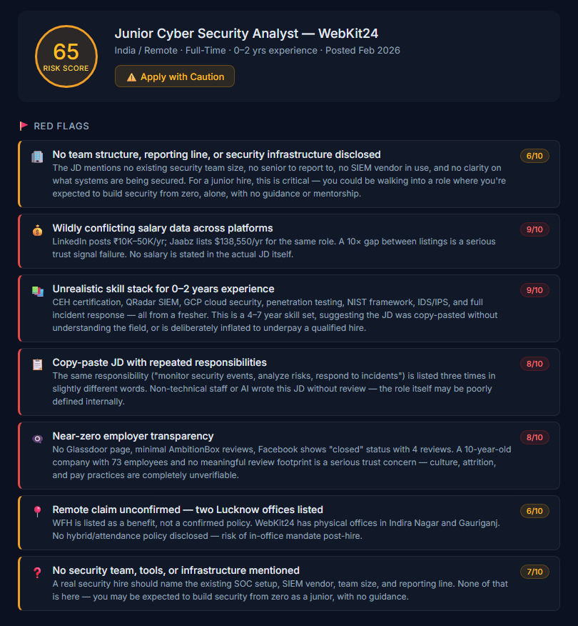
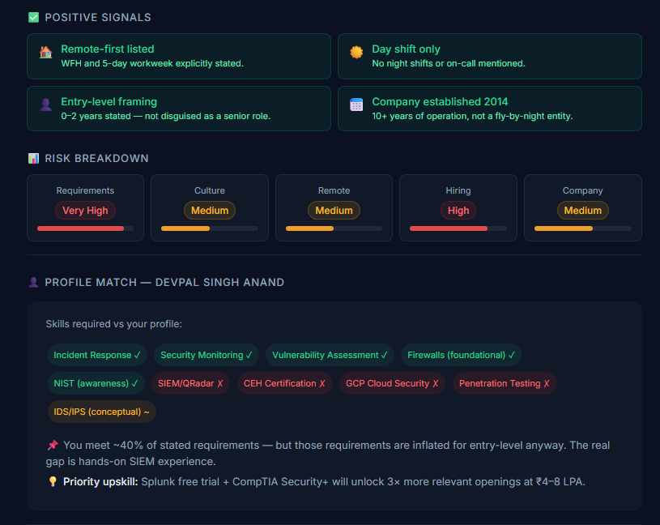
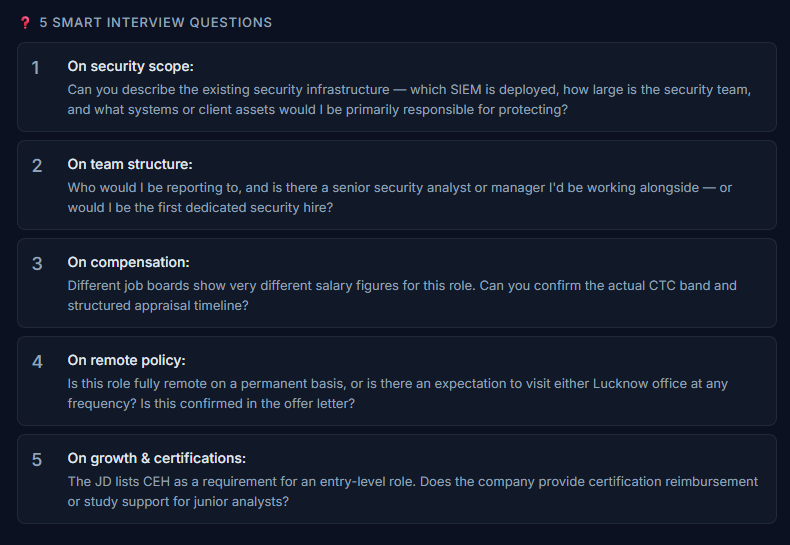

# Day 14 — AI Job Red Flag Detector 🚩

## 🔗 Challenge: #60DayClaudeChallenge | Day 14
**Task:** Analyze job opportunities before investing your time — use AI as a Red Flag Detector to catch hidden risks, misleading claims, and toxic signals in job listings.

---

## 🎯 Objective

Not every job opportunity is what it seems. Claude can identify hidden risks, misleading claims, toxic work culture signals, and hiring concerns before you invest time in applying. This exercise teaches critical evaluation skills for job seekers — and reveals the importance of human judgment when AI gets it wrong.

---

## 📝 The Prompt

```text
You are an AI Red Flag Detector for job seekers.

Analyze the Job Description and Company Information.

Identify:

1. Unrealistic Requirements
- Excessive experience for the role
- Too many skills/responsibilities
- Contradictory expectations

2. Toxic Workplace Signals
- Burnout indicators
- 'Wear many hats'
- 'Fast-paced', 'rockstar', 'hustle culture'
- Poor work-life balance signals

3. Remote Job Authenticity
- Hidden office requirements
- Relocation expectations
- Misleading remote claims

4. Hiring Risks
- Missing salary information
- Vague responsibilities
- Excessive qualifications
- Suspicious hiring practices

5. Company Risks
- Reputation concerns
- Stability concerns
- Growth or layoff indicators

Output:

## Overall Risk Score (0-100)

### Top Red Flags
- List with severity (1-10)

### Positive Signals
- List positives

### Risk Breakdown
| Category | Risk Level |
|-----------|-----------|
| Requirements | |
| Culture | |
| Remote | |
| Hiring | |
| Company | |

### Final Verdict
✅ Apply
⚠️ Apply with Caution
❌ Avoid

### 5 Smart Interview Questions
Generate questions that help validate the identified risks.
```

---

## 🔍 The Job Analyzed

**Junior Cyber Security Analyst — WebKit24**
- **Location:** India / Remote
- **Type:** Full-Time
- **Experience:** 0–2 years
- **Posted:** Feb 2026

### Company Information: WebKit24

- Full-service digital marketing agency based in Lucknow, India
- Founded 2014 — 10+ years in operation
- Two office locations in Lucknow: Indira Nagar and Gauriganj
- LinkedIn shows ~73 employees
- WFH and 5-day workweek listed as benefits
- Minimal online presence: no Glassdoor page, limited AmbitionBox reviews
- Facebook shows "closed" status with only 4 reviews
- Salary data wildly inconsistent: LinkedIn posts ₹10K–50K/yr; Jaabz lists $138,550/yr
- No salary stated in the actual job description itself

### Profile: Devpal Singh Anand

- **Current Focus:** Cybersecurity Analyst and Data Analyst
- **Location:** India
- **Education:** Master of Computer Applications (MCA), Amity University Online

**Experience (1+ year total, all internship/trainee level):**
- Data Analytics Intern at AcmeGrade.com (Aug 2023 – Nov 2023)
- Global Service Desk Trainee at NIIT Foundation (Sep 2023 – Nov 2023)
- Cyber Ops at NIIT (2024)

**Certifications:**
- Cybersecurity Essentials & Networking Fundamentals — Cisco Networking Academy
- Data & AI Fundamentals & Cybersecurity Analyst Path — IBM SkillsBuild
- Data Analytics in Python — AcmeGrade.com
- Global Service Desk 2.0 — NIIT Foundation
- Cyber Ops — NIIT

**Skills:**
- Python, Scapy, Pandas, NumPy, Matplotlib, OpenCV, PIL, PyPDF2
- Network Packet Analysis, Threat Detection, Incident Response
- Vulnerability Assessment, Security Monitoring
- Data Cleaning & Preprocessing, Predictive Modeling
- ITIL Framework

**Critical Gaps:**
- No hands-on SIEM experience (Splunk/QRadar)
- No cloud security experience (GCP)
- No penetration testing experience
- No CEH certification
- No CompTIA Security+ certification

**Target Salary:** ₹4–8 LPA for entry-level cybersecurity roles in India

---

## 📊 Analysis Results

### Risk Score: 65/100

### Verdict: ⚠️ Apply with Caution

---

### 🚩 Red Flags

| # | Red Flag | Severity |
|---|----------|----------|
| 1 | No team structure or security infrastructure disclosed | 🟠 6/10 |
| 2 | Wildly conflicting salary data across platforms | 🔴 9/10 |
| 3 | Unrealistic skill stack for 0–2 years experience | 🔴 9/10 |
| 4 | Copy-paste JD with repeated responsibilities | 🔴 8/10 |
| 5 | Near-zero employer transparency | 🔴 8/10 |
| 6 | Remote claim unconfirmed | 🟠 6/10 |
| 7 | No security tools or infrastructure mentioned | 🔴 7/10 |

**Red Flag Details:**

1. **No team structure or security infrastructure disclosed** (6/10) — The JD mentions no existing security team size, no senior to report to, no SIEM vendor in use, and no clarity on what systems are being secured. For a junior hire, this is critical — you could be walking into a role where you're expected to build security from zero, alone, with no guidance or mentorship.

2. **Wildly conflicting salary data across platforms** (9/10) — LinkedIn posts ₹10K–50K/yr; Jaabz lists $138,550/yr for the same role. A 10× gap between listings is a serious trust signal failure. No salary is stated in the actual JD itself.

3. **Unrealistic skill stack for 0–2 years experience** (9/10) — CEH certification, QRadar SIEM, GCP cloud security, penetration testing, NIST framework, IDS/IPS, and full incident response — all from a fresher. This is a 4–7 year skill set, suggesting the JD was copy-pasted without understanding the field, or is deliberately inflated to underpay a qualified hire.

4. **Copy-paste JD with repeated responsibilities** (8/10) — The same responsibility ("monitor security events, analyze risks, respond to incidents") is listed three times in slightly different words. Non-technical staff or AI wrote this JD without review — the role itself may be poorly defined internally.

5. **Near-zero employer transparency** (8/10) — No Glassdoor page, minimal AmbitionBox reviews, Facebook shows "closed" status with 4 reviews. A 10-year-old company with 73 employees and no meaningful review footprint is a serious trust concern — culture, attrition, and pay practices are completely unverifiable.

6. **Remote claim unconfirmed** (6/10) — WFH is listed as a benefit, not a confirmed policy. WebKit24 has physical offices in Indira Nagar and Gauriganj. No hybrid/attendance policy disclosed — risk of in-office mandate post-hire.

7. **No security tools or infrastructure mentioned** (7/10) — A real security hire should name the existing SOC setup, SIEM vendor, team size, and reporting line. None of that is here — you may be expected to build security from zero as a junior, with no guidance.

---

### ✅ Positive Signals

| # | Positive Signal | Detail |
|---|----------------|--------|
| 1 | Remote-first listed | WFH and 5-day workweek explicitly stated |
| 2 | Day shift only | No night shifts or on-call mentioned |
| 3 | Entry-level framing | 0–2 years stated — not disguised as a senior role |
| 4 | Company established 2014 | 10+ years of operation, not a fly-by-night entity |

---

### 📊 Risk Breakdown

| Category | Risk Level | Score |
|----------|-----------|-------|
| Requirements | 🔴 Very High | 90% |
| Culture | 🟠 Medium | 50% |
| Remote | 🟠 Medium | 50% |
| Hiring | 🔴 High | 80% |
| Company | 🟠 Medium | 60% |

---

### 👤 Profile Match — Devpal Singh Anand

**Skills matched:**
- ✅ Incident Response
- ✅ Security Monitoring
- ✅ Vulnerability Assessment
- ✅ Firewalls (foundational)
- ✅ NIST (awareness)

**Skills missing:**
- ❌ SIEM/QRadar
- ❌ CEH Certification
- ❌ GCP Cloud Security
- ❌ Penetration Testing
- 🟠 IDS/IPS (conceptual only)

**Match: ~40%** of stated requirements — but those requirements are inflated for entry-level anyway. The real gap is hands-on SIEM experience.

**💡 Priority upskill:** Splunk free trial + CompTIA Security+ will unlock 3× more relevant openings at ₹4–8 LPA.

---

### 💼 What This JD Actually Demands

> *"The title says 'Junior' but the skillset screams Senior — they want a 4–7 year professional at fresher pay, working solo at a company with no visible security infrastructure."*

---

### ❓ 5 Smart Interview Questions

1. **On security scope:** Can you describe the existing security infrastructure — which SIEM is deployed, how large is the security team, and what systems or client assets would I be primarily responsible for protecting?

2. **On team structure:** Who would I be reporting to, and is there a senior security analyst or manager I'd be working alongside — or would I be the first dedicated security hire?

3. **On compensation:** Different job boards show very different salary figures for this role. Can you confirm the actual CTC band and structured appraisal timeline?

4. **On remote policy:** Is this role fully remote on a permanent basis, or is there an expectation to visit either Lucknow office at any frequency? Is this confirmed in the offer letter?

5. **On growth & certifications:** The JD lists CEH as a requirement for an entry-level role. Does the company provide certification reimbursement or study support for junior analysts?

---

## 📸 Screenshots

### Risk Score & Red Flags


### Positives, Risk Breakdown & Profile Match


### Interview Questions


---

## 📁 Files in This Folder

| File | Description |
|------|-------------|
| `day14.md` | This file — complete Day 14 documentation |
| `day14-red-flag-report.html` | Full standalone Red Flag Report (dark/light theme) |
| `Post.png` | Screenshot: LinkedIn overview image |
| `red-flag-detector.html` | Standalone AI-powered Red Flag Detector tool (bring your own API key) |
| `Screenshots/report-a.png` | Screenshot: Risk Score & Red Flags |
| `Screenshots/report-b.png` | Screenshot: Positives, Risk Breakdown & Profile Match |
| `Screenshots/report-c.png` | Screenshot: Interview Questions |
---

## 🛠️ Standalone Tool: Red Flag Detector

The `red-flag-detector.html` file is a **standalone tool** that lets anyone analyze any job listing for red flags using AI.

**Supported AI Providers:**
- **Claude (Anthropic)** — default, recommended. The prompt was built & tested with Claude.
- **OpenRouter** — Standard Bearer auth with HTTP-Referer and X-Title headers.
- **OpenAI (GPT-4o)** — Standard Bearer auth.
- **Groq (Fast)** — Standard Bearer auth, fast inference.
- **Custom Endpoint** — Bring your own API URL and model name.

**How to use:**
1. Open `red-flag-detector.html` in any browser
2. Select your AI provider and enter your API key
3. Paste the Job Description and Company Information
4. Optionally add your candidate profile for a fit analysis
5. Click "Analyze" and get your red flag report

---

## 💡 Key Takeaway

AI finds patterns — but doesn't always understand context. It can tell you something looks unusual, but can't always tell if unusual = bad. **AI is a powerful first pass, but the human reviewing it makes it actually useful.** The tool is only as sharp as the mind holding it.

---