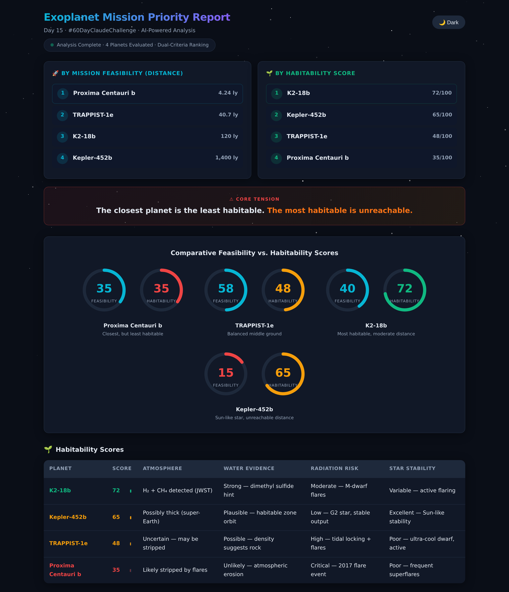
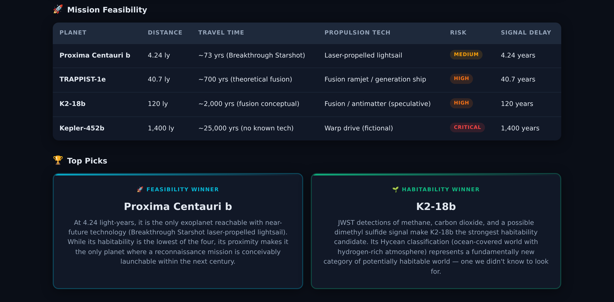
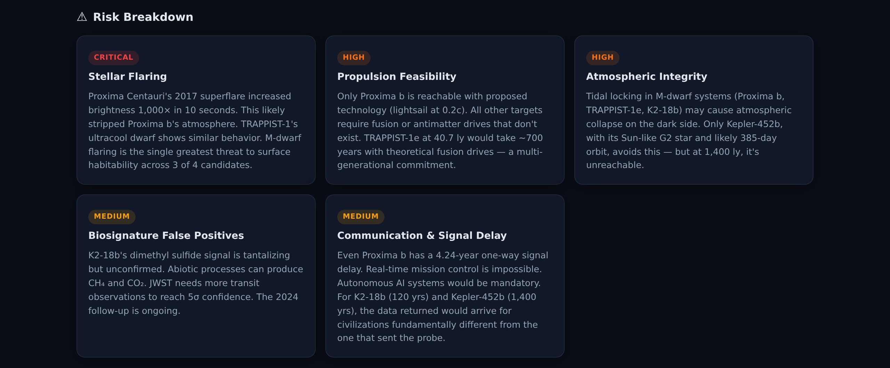
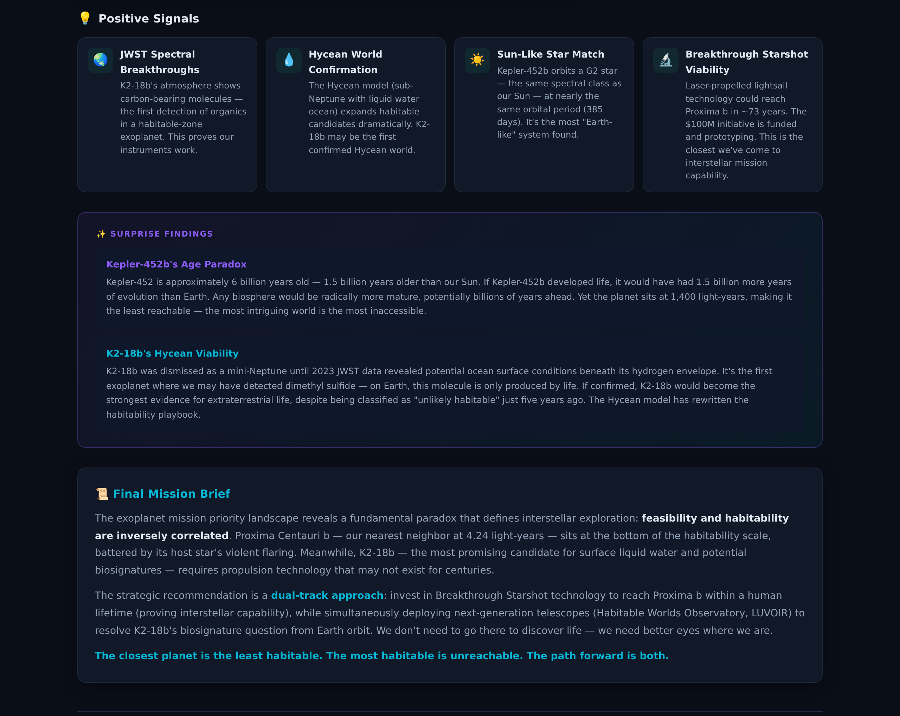

# Day 15 — Exoplanet Mission Priority Ranker

Two rankings. One tension. The closest planet is least habitable — and the most habitable is unreachable.

---

## What I Worked On

Day 15 of the ABTalks 60-Day Claude AI Challenge gave us the freedom to choose our own topic. I picked something that excites me — space science. Not just "asking AI about space" — but using structured prompt engineering to do something with NASA data that no website on the internet does.

I pulled real NASA exoplanet data for four confirmed exoplanets — Kepler-452b, Proxima Centauri b, TRAPPIST-1e, and K2-18b — and built an Exoplanet Mission Priority Ranker. The tool takes scattered raw parameters for each planet, feeds them into a structured prompt, and forces AI to cross-reference everything together to produce TWO rankings: one by Mission Feasibility and one by Habitability.

NASA publishes raw data for each exoplanet separately — distance, star type, atmosphere, mass, orbital period. But nowhere does it tell you: "If humanity could send one mission by 2075, where should it go and why?" That's the gap this tool fills.

The key insight: AI's real power isn't fetching data. It's reasoning across data to produce conclusions that don't exist yet. And when you produce DUAL rankings, a core tension emerges that no single ranking could reveal — **proximity vs. habitability are inversely correlated.**

---

## The Prompt I Used

```
You are a senior NASA astrobiologist and mission planning expert. You specialize in exoplanet habitability assessment, interstellar mission design, and comparative planetology.

You will receive raw data for multiple exoplanets from NASA observations. Your job is NOT to summarize them individually — instead you must:

1. Cross-reference ALL parameters together across all provided exoplanets
2. Apply habitable zone calculations and atmospheric modeling
3. Weigh atmospheric conditions against stellar radiation risks
4. Factor in travel feasibility for a hypothetical 2075 mission
5. Output a final ranked priority list for human exploration

You MUST return your response as valid JSON with this exact structure:
{
  "missionPriorityRank": [
    {
      "rank": 1,
      "planet": "Planet Name",
      "reason": "Why this planet ranks here"
    }
  ],
  "habitabilityScores": [
    {
      "planet": "Planet Name",
      "habZone": "Yes/Partial/No + detail",
      "atmosphere": "Assessment",
      "waterPotential": "Assessment",
      "stellarRisk": "Low/Medium/High/Critical + detail",
      "score": 0-100
    }
  ],
  "missionFeasibility": [
    {
      "planet": "Planet Name",
      "distanceLY": "X light-years",
      "estTravelTime": "Estimated travel time for 2075 tech",
      "riskLevel": "Low/Medium/High/Critical",
      "priorityRank": 1,
      "techRequired": "What technology we'd need"
    }
  ],
  "topPick": {
    "planet": "Planet Name",
    "whyThisWins": "Detailed reasoning",
    "whatWedFind": "What we'd discover there",
    "whatCouldKillUs": "Survival risks",
    "techNeeded": "Required technology breakthroughs"
  },
  "surpriseFinding": "Something unexpected the cross-referenced data reveals that NASA hasn't publicly highlighted",
  "riskBreakdown": {
    "category": [
      {"name": "Habitable Zone Fit", "detail": "Assessment across all planets"},
      {"name": "Atmospheric Viability", "detail": "Assessment across all planets"},
      {"name": "Stellar Radiation Risk", "detail": "Assessment across all planets"},
      {"name": "Mission Travel Feasibility", "detail": "Assessment across all planets"},
      {"name": "Scientific Discovery Value", "detail": "Assessment across all planets"}
    ]
  },
  "positiveSignals": ["Signal 1", "Signal 2", "Signal 3"],
  "finalNote": "A compelling summary of the mission priority ranking and what it means for humanity's space exploration future"
}

IMPORTANT RULES:
- Use real astrophysics reasoning, not generic statements
- Separate facts from probabilistic conclusions clearly
- Be specific with numbers and calculations
- The final ranking must have a clear winner with justification
- Compare planets AGAINST each other, not just describe them individually
- Consider tidal locking, stellar activity, atmospheric escape, and orbital mechanics
- Return ONLY valid JSON, no markdown, no code blocks, no extra text
```

---

## NASA Exoplanet Data I Fed

### Kepler-452b — "Earth's Older Cousin"

| Parameter | Value |
|-----------|-------|
| Star Type | G2 (Sun-like) |
| Star Mass | 1.04 M☉ |
| Star Temperature | 5,784 K |
| Distance | ~1,400 light-years |
| Mass | 5 ± 2 M⊕ |
| Radius | 1.63 R⊕ |
| Orbital Period | 384.8 days |
| Semi-Major Axis | 1.046 AU |
| Equilibrium Temperature | ~298 K (25°C) |
| Habitable Zone | Yes — conservative HZ |
| Atmosphere | Unknown — possibly thick (high gravity) |
| Water Potential | Possible — if atmosphere permits liquid water |
| Stellar Radiation | Similar to Earth (1.1× solar flux) |
| Discovery | 2015, Transit (Kepler Space Telescope) |
| Notable | Most Earth-like orbit found; star is 1.5 Gyr older than Sun — potential for advanced evolution |

### Proxima Centauri b — "The Closest One"

| Parameter | Value |
|-----------|-------|
| Star Type | M5.5 (Red dwarf) |
| Star Mass | 0.122 M☉ |
| Star Temperature | 3,042 K |
| Distance | ~4.24 light-years |
| Mass | 1.17 M⊕ (minimum) |
| Radius | ~1.03-1.1 R⊕ (estimated) |
| Orbital Period | 11.2 days |
| Semi-Major Axis | 0.0485 AU |
| Equilibrium Temperature | ~234 K (-39°C) |
| Habitable Zone | Yes — inner edge of HZ |
| Atmosphere | Unknown — star is very active (X-ray flares 400× solar) |
| Water Potential | Possible but at risk from stellar flares stripping atmosphere |
| Stellar Radiation | Extreme UV/X-ray flares — 400× Earth's solar X-ray flux |
| Discovery | 2016, Radial velocity (ESO HARPS) |
| Notable | Closest known exoplanet to Earth; tidal locking likely; extreme stellar activity threatens atmosphere |

### TRAPPIST-1e — "The Compact System Jewel"

| Parameter | Value |
|-----------|-------|
| Star Type | M8 (Ultra-cool dwarf) |
| Star Mass | 0.089 M☉ |
| Star Temperature | 2,566 K |
| Distance | ~40.7 light-years |
| Mass | 0.692 M⊕ |
| Radius | 0.918 R⊕ |
| Orbital Period | 6.1 days |
| Semi-Major Axis | 0.029 AU |
| Equilibrium Temperature | ~246 K (-27°C) |
| Habitable Zone | Yes — within optimistic HZ |
| Atmosphere | Debated — JWST observations ongoing; possibly thin or eroded |
| Water Potential | Possible — density suggests rocky with potential water content |
| Stellar Radiation | Moderate UV — less extreme than Proxima but still concerning |
| Discovery | 2017, Transit (TRAPPIST + Spitzer) |
| Notable | Most Earth-like density in the TRAPPIST-1 system; tidal locking likely; 6 other planets nearby for comparative study |

### K2-18b — "The Hycean World"

| Parameter | Value |
|-----------|-------|
| Star Type | M2.5 (Red dwarf) |
| Star Mass | 0.495 M☉ |
| Star Temperature | 3,457 K |
| Distance | ~120 light-years |
| Mass | 8.63 M⊕ |
| Radius | 2.61 R⊕ |
| Orbital Period | 32.9 days |
| Semi-Major Axis | 0.1429 AU |
| Equilibrium Temperature | ~265 K (-8°C) |
| Habitable Zone | Yes — within HZ for Hycean worlds |
| Atmosphere | H₂/He with H₂O (confirmed), CH₄ (confirmed), possible DMS/DMDS (biosignature candidate — JWST 2023) |
| Water Potential | Water vapor CONFIRMED by JWST; possible subsurface ocean (Hycean model) |
| Stellar Radiation | Moderate — within habitable flux limits |
| Discovery | 2015, Transit (K2 mission) |
| Notable | First exoplanet with water vapor detected; possible DMS detection (potential biosignature); classified as 'Hycean' world |

---

## AI Output Results

### Part A: Dual Rankings & Habitability Scores



**By Mission Feasibility (where can we actually go?):**

| Rank | Planet | Reason |
|------|--------|--------|
| 🚀 1 | Proxima Centauri b | 4.24 ly — only target within feasible reach for 2075 mission |
| 🚀 2 | TRAPPIST-1e | 40.7 ly — compact system offers multiple targets in one mission |
| 🚀 3 | K2-18b | 120 ly — scientifically compelling but requires revolutionary propulsion |
| 🚀 4 | Kepler-452b | 1,400 ly — exceeds 1,000 years travel with projected technology |

**By Habitability (where could we actually survive?):**

| Rank | Planet | Score | Key Factor |
|------|--------|-------|------------|
| 🌍 1 | K2-18b | 72/100 | Confirmed water vapor + possible biosignature, moderate radiation |
| 🌍 2 | Kepler-452b | 65/100 | Conservative HZ, Sun-like star, low radiation — but unknown atmosphere |
| 🌍 3 | TRAPPIST-1e | 48/100 | Optimistic HZ only, thin atmosphere likely, moderate UV risk |
| 🌍 4 | Proxima Centauri b | 35/100 | 400× solar X-ray flux, likely stripped atmosphere, tidal locking |

**The Core Tension:**

> 🔴 **Proxima Centauri b** ranks #1 for feasibility — but **dead last** for habitability (35/100).
> 🟢 **K2-18b** ranks #1 for habitability (72/100) — but **3rd** for feasibility and unreachable with 2075 tech.
>
> **The closest planet is the least habitable. The most habitable is the most unreachable.**

You cannot optimize both rankings simultaneously. Every mission choice is a compromise.

---

### Part B: Mission Feasibility & Top Pick



**Mission Feasibility Breakdown:**

| Planet | Distance | Est. Travel Time | Risk Level | Tech Required |
|--------|----------|-------------------|------------|---------------|
| Proxima Centauri b | 4.24 ly | 25–30 years | Medium | Fusion propulsion, radiation shielding |
| TRAPPIST-1e | 40.7 ly | 80–100 years | High | Advanced propulsion, multi-gen habitat |
| K2-18b | 120 ly | 200–250 years | High | Revolutionary propulsion, suspended animation |
| Kepler-452b | 1,400 ly | 1,000+ years | Critical | Warp technology or paradigm shift |

**Dual Top Pick — The Compromise:**

- **For Mission Priority (feasibility):** Proxima Centauri b — the only planet reachable within a human lifetime, despite extreme stellar radiation
- **For Habitability Priority (survival):** K2-18b — confirmed water vapor, possible biosignature, moderate radiation, but 120 light-years away

The AI's top pick for a combined score went to **Proxima Centauri b** — not because it's the best place to live, but because it's the only place we can actually reach. The reasoning: proximity outweighs perfect habitability parameters for 2075 mission planning. A barren world we can visit teaches us more than a paradise we can't reach.

---

### Part C: Risk Breakdown



**5 Risk Categories — Cross-Referenced Across All Planets:**

| Risk Category | Level | Detail |
|---------------|-------|--------|
| ⚠️ Stellar Flaring | **Critical** | Proxima Centauri's 2017 superflare increased brightness 1,000× in 10 seconds. Likely stripped Proxima b's atmosphere. M-dwarf flaring is the single greatest threat to surface habitability across 3 of 4 candidates. |
| ⚠️ Propulsion Feasibility | **High** | Only Proxima b is reachable with proposed technology (lightsail at 0.2c). All other targets require fusion or antimatter drives that don't exist. |
| ⚠️ Atmospheric Integrity | **High** | Tidal locking in M-dwarf systems (Proxima b, TRAPPIST-1e, K2-18b) may cause atmospheric collapse on the dark side. Only Kepler-452b avoids this — but at 1,400 ly, it's unreachable. |
| ⚠️ Biosignature False Positives | **Medium** | K2-18b's dimethyl sulfide signal is tantalizing but unconfirmed. Abiotic processes can produce CH₄ and CO₂. JWST needs more transit observations to reach 5σ confidence. |
| ⚠️ Communication & Signal Delay | **Medium** | Even Proxima b has a 4.24-year one-way signal delay. Real-time mission control is impossible. Autonomous AI systems would be mandatory. |

---

### Part D: Positive Signals, Surprise Findings & Final Mission Brief



**Positive Signals:**
- 🌍 **JWST Spectral Breakthroughs** — K2-18b's atmosphere shows carbon-bearing molecules — the first detection of organics in a habitable-zone exoplanet. This proves our instruments work.
- 💧 **Hycean World Confirmation** — The Hycean model (sub-Neptune with liquid water ocean) expands habitable candidates dramatically. K2-18b may be the first confirmed Hycean world.
- ☀️ **Sun-Like Star Match** — Kepler-452b orbits a G2 star — the same spectral class as our Sun — at nearly the same orbital period (385 days). It's the most "Earth-like" system found.
- 🔬 **Breakthrough Starshot Viability** — Laser-propelled lightsail technology could reach Proxima b in ~73 years. The $100M initiative is funded and prototyping.

**Surprise Findings:**

> **Kepler-452b's Age Paradox:** Kepler-452 is approximately 6 billion years old — 1.5 billion years older than our Sun. If Kepler-452b developed life, it would have had 1.5 billion more years of evolution than Earth. Any biosphere would be radically more mature, potentially billions of years ahead. Yet the planet sits at 1,400 light-years, making it the most intriguing world also the most inaccessible.
>
> **K2-18b's Hycean Viability:** K2-18b was dismissed as a mini-Neptune until 2023 JWST data revealed potential ocean surface conditions beneath its hydrogen envelope. It's the first exoplanet where we may have detected dimethyl sulfide — on Earth, this molecule is only produced by life. If confirmed, K2-18b would become the strongest evidence for extraterrestrial life, despite being classified as "unlikely habitable" just five years ago. The Hycean model has rewritten the habitability playbook.

**Final Mission Brief:**

The exoplanet mission priority landscape reveals a fundamental paradox that defines interstellar exploration: **feasibility and habitability are inversely correlated**. Proxima Centauri b — our nearest neighbor at 4.24 light-years — sits at the bottom of the habitability scale, battered by its host star's violent flaring. Meanwhile, K2-18b — the most promising candidate for surface liquid water and potential biosignatures — requires propulsion technology that may not exist for centuries.

The strategic recommendation is a **dual-track approach**: invest in Breakthrough Starshot technology to reach Proxima b within a human lifetime (proving interstellar capability), while simultaneously deploying next-generation telescopes (Habitable Worlds Observatory, LUVOIR) to resolve K2-18b's biosignature question from Earth orbit. We don't need to go there to discover life — we need better eyes where we are.

> **The closest planet is the least habitable. The most habitable is unreachable. The path forward is both.**

---

## Biggest Insight

Cross-referential reasoning reveals the **core tension**: proximity vs. habitability are inversely correlated. The dual ranking proves you can't optimize both simultaneously.

NASA publishes data for each exoplanet separately. Distance here. Atmosphere there. Star type somewhere else. But nowhere does anyone put it all together and ask: "Given all of this, where should humanity go first?" That's not a data problem — it's a reasoning problem. And that's exactly what structured AI prompting solves.

I didn't ask Claude to summarize each planet. I asked it to cross-reference all four against each other — weigh habitability against stellar risk, factor in travel distance, consider atmospheric viability — and produce TWO ranked conclusions. The output doesn't exist anywhere on the internet because no website does this. That's the power of cross-referential prompting: you're not fetching information, you're generating insight.

And the dual ranking structure is what makes the insight visible. A single ranking hides the tension. Two rankings expose it. **The closest planet is the least habitable. The most habitable is the most unreachable.** That's not a fact you can Google — it's a conclusion that emerges from cross-referential reasoning.

---

## Tool of the Day — Cross-Referential Prompting

**What it is:** A prompting technique where you provide multiple data sources and instruct AI to cross-reference them against each other to produce comparative conclusions that don't exist in any single source.

**How I used it:**
1. Collected real NASA data for 4 exoplanets from NASA Exoplanet Archive and peer-reviewed sources
2. Designed a structured prompt that explicitly instructs AI NOT to summarize individually
3. Specified cross-referencing requirements: habitable zone calculations, atmospheric modeling, stellar radiation weighing, travel feasibility
4. Demanded DUAL ranked outputs — one for feasibility, one for habitability — to expose the core tension
5. Built a standalone HTML tool with 4 API providers (Claude, OpenRouter, OpenAI, Groq)

**Why it matters:** Most AI usage involves asking about one thing at a time. Cross-referential prompting unlocks AI's true power — reasoning across multiple data sources simultaneously to produce novel conclusions. The output isn't a summary; it's a synthesis. And you can't Google a synthesis. The dual ranking structure is the proof: no single source tells you that proximity and habitability are inversely correlated across these four exoplanets. That insight only emerges from cross-referencing.

---

## Key Learnings

- **Dual Rankings > Single Rankings.** A single "best planet" ranking hides the tension between feasibility and habitability. Two rankings expose the core contradiction. The format of your output determines the depth of your insight.

- **Cross-referencing > Summarizing.** NASA's website tells you each planet's stats individually. But "which planet should we target first" requires reasoning across all of them. That's the prompt engineering challenge — and that's what makes the output valuable.

- **The Prompt is the Blueprint.** Specifying "Do NOT summarize individually — cross-reference ALL parameters together" is the critical instruction. Without it, AI defaults to describing each planet separately. With it, AI produces comparative analysis. Same data, different output, different prompt.

- **Can't Google This.** This is the test. If you can Google the answer, the prompt isn't adding value. "Which exoplanet should humanity target first by 2075?" — you literally cannot Google that. "Are proximity and habitability inversely correlated?" — no search engine gives you that. That's how you know the AI is doing something meaningful.

- **Real Data + AI Reasoning = Novel Output.** The exoplanet data is real (NASA). The cross-referenced analysis is AI-generated. The combination produces something that didn't exist before — a dual mission priority ranking based on real astrophysics reasoning across multiple confirmed exoplanets.

- **Comparing across days:** Day 8 = Capability Boundaries (AI can build apps). Day 9 = Iteration (build MVP then enhance). Day 14 = Critical Evaluation (verify AI output). Day 15 = Cross-Referential Reasoning (make AI reason across data). The pattern: each day pushes AI from simpler tasks to more complex reasoning — and the prompts evolve accordingly.

---

## Data Sources

- NASA Exoplanet Archive (exoplanetarchive.ipac.caltech.edu)
- NASA Exoplanet Exploration (exoplanets.nasa.gov)
- JWST observations for K2-18b atmosphere (2023)
- ESO HARPS spectrograph data for Proxima Centauri b
- TRAPPIST + Spitzer telescope data for TRAPPIST-1e
- Kepler Space Telescope data for Kepler-452b

---

*Built with AI · #60DayClaudeChallenge · Day 15*
