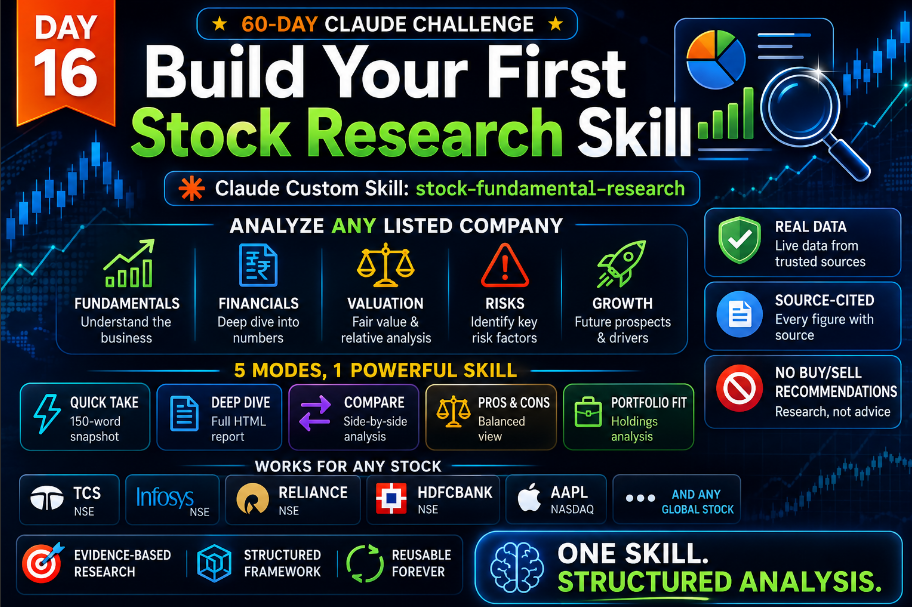
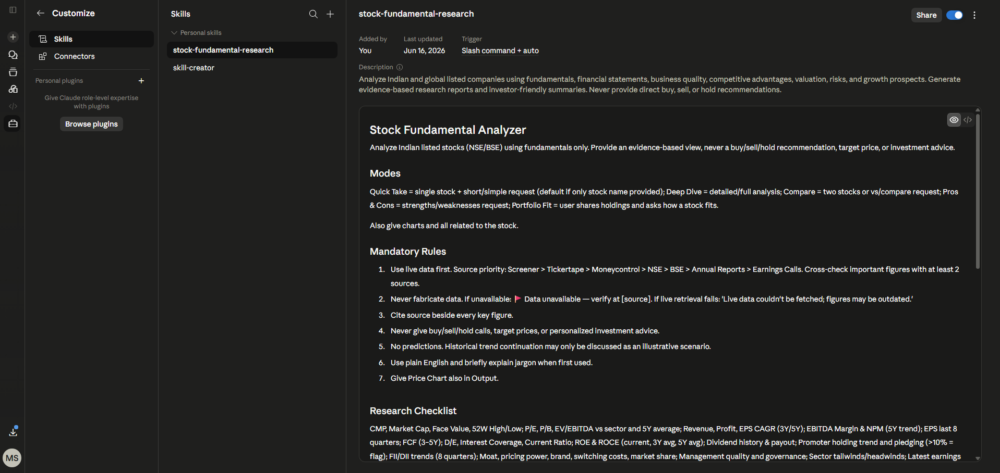

# Day 16 — Build Your First Stock Research Skill



## Quick Navigation

- [What Was Built](#what-was-built)
- [Skill Configuration](#skill-configuration)
- [Prompt Architecture](#skill-definition--prompt-architecture)
- [Research Checklist](#research-checklist-built-into-skill)
- [Live Data Verification](#live-data-verification-skill-in-action)
- [Screenshots](#screenshots)
- [Key Learnings](#key-learnings)
- [What Surprised Me Most](#what-surprised-me-most)
- [Skill Reusability Demo](#skill-reusability-demo)
- [Files in This Folder](#files-in-this-folder)

> **Date:** June 16, 2025 · **Challenge:** 60-Day Claude Challenge · **Topic:** Create a reusable Claude Custom Skill for stock fundamental research · **Difficulty:** Intermediate · **Time:** ~45 min

> **Primary deliverable:** a reusable **Claude Custom Skill** (`stock-fundamental-research`) that transforms stock analysis from a one-off prompt into a reusable research workflow. **TCS and Infosys appear in this report only as demonstration examples** used to validate that the workflow produces correct, evidence-based output with real live data — they are **not** the focus of the project.

---

## What Was Built

A custom Claude Skill named **`stock-fundamental-research`** that can analyze any Indian (NSE/BSE) or global listed company using fundamentals, financial statements, business quality, competitive advantages, valuation, risks, and growth prospects — and generate evidence-based research reports.

The best part? **It's reusable forever.** No more pasting long prompts every time an analysis is needed. One skill, infinite analyses.

> The **focus of Day 16 is the skill itself** — the reusable artifact and the research framework it bundles. TCS and Infosys are used below purely as **worked examples** to prove the skill runs correctly on real live data.

---

## Skill Configuration

| Property | Value |
|----------|-------|
| **Skill Name** | `stock-fundamental-research` |
| **Description** | Analyze Indian and global listed companies using fundamentals, financial statements, business quality, competitive advantages, valuation, risks, and growth prospects. Generate evidence-based research reports and investor-friendly summaries. Never provides direct buy, sell, or hold recommendations. |
| **Modes Supported** | Quick Take, Deep Dive, Compare, Pros & Cons, Portfolio Fit |
| **Data Sources Priority** | Screener → Tickertape → Moneycontrol → NSE → BSE → Annual Reports → Earnings Calls |
| **Key Rule** | Never give buy/sell/hold calls, target prices, or personalized investment advice |

---

## Skill Definition & Prompt Architecture

The skill is defined as a single reusable prompt artifact that encodes the framework, the five analysis modes, the source-priority chain, the mandatory rules, the interpretation thresholds, and the output format. Once installed in Claude, it is invoked by name — no prompt re-entry needed.



The snapshot above captures the structured instructions, the five analysis modes, the source-priority chain, and the mandatory rules — all bundled into one reusable skill definition.

---

## Mandatory Rules Implemented

| # | Rule | Detail |
|---|------|--------|
| 1 | **Live data first** | Source priority: Screener > Tickertape > Moneycontrol > NSE > BSE > Annual Reports > Earnings Calls. Cross-check important figures with at least 2 sources. |
| 2 | **Never fabricate data** | If unavailable: 🚩 Data unavailable — verify at [source]. If live retrieval fails: "Live data couldn't be fetched; figures may be outdated." |
| 3 | **Cite source beside every key figure** | Every metric must have provenance. |
| 4 | **Never give buy/sell/hold calls** | No target prices, no personalized investment advice. |
| 5 | **No predictions** | Historical trend continuation only as illustrative scenario. |
| 6 | **Plain English** | Jargon explained when first used. |
| 7 | **Price chart included** | Price chart included in output. |

---

## Research Checklist Built Into Skill

| Category | Checklist Item |
|----------|----------------|
| Price & Cap | ✅ CMP, Market Cap, Face Value, 52W High/Low |
| Valuation | ✅ P/E, P/B, EV/EBITDA vs sector and 5Y average |
| Growth | ✅ Revenue, Profit, EPS CAGR (3Y/5Y) |
| Margins | ✅ EBITDA Margin & NPM (5Y trend) |
| Earnings | ✅ EPS last 8 quarters |
| Cash Flow | ✅ Free Cash Flow (3–5Y) |
| Leverage | ✅ D/E, Interest Coverage, Current Ratio |
| Returns | ✅ ROE & ROCE (current, 3Y avg, 5Y avg) |
| Dividend | ✅ Dividend history & payout |
| Ownership | ✅ Promoter holding trend and pledging (>10% = flag) |
| Institutions | ✅ FII/DII trends (8 quarters) |
| Quality | ✅ Moat, pricing power, brand, switching costs, market share |
| Governance | ✅ Management quality and governance |
| Sector | ✅ Sector tailwinds/headwinds |
| News | ✅ Latest earnings commentary |
| News | ✅ Top news |
| Peers | ✅ 3 closest peers with P/E, P/B, ROE, Revenue Growth, D/E |

---

## Live Data Verification (Skill in Action)

To validate the skill on real data, two **demonstration analyses** were run — a Quick Take on **TCS** and a side-by-side **Compare Infosys vs TCS**. These are *examples confirming the skill works*, not the project's deliverable.

The skill was tested with **real live data** fetched from Screener.in (primary source per skill priority), cross-verified via Yahoo Finance, Moneycontrol, and Economic Times.

### TCS — Real Snapshot

| Metric | Value |
|--------|-------|
| **CMP** | ₹2,199.00 (▲ +₹37.00, +1.71%) |
| **52W High / Low** | ₹3,539 / ₹2,110 (-37.8% from high) |
| **Market Cap** | ₹7,95,617 Cr (~₹7.96L Cr) |
| **Stock P/E (Screener)** | 15.1x (Forward P/E: 13.29x) |
| **P/B** | ~7.4x |
| **Book Value** | ₹296 |
| **ROE** | **51.8%** (Screener) |
| **ROCE** | **63.0%** (Screener) |
| **Operating Margin** | 25.29% |
| **Net Margin** | 18.43% |
| **Revenue Growth (YoY)** | 9.6% |
| **D/E** | ~0.10 (Net Cash: ₹29,797 Cr) |
| **Promoter Holding** | 71.8% (Tata Sons, zero pledge) |
| **Dividend Yield (regular)** | 2.92% |
| **FCF (TTM)** | ₹37,060 Cr (75% conversion) |
| **FY26 Milestone** | Crossed $30B annual revenue |

### Infosys — Real Snapshot

| Metric | Value |
|--------|-------|
| **CMP** | ₹1,144.00 |
| **52W High / Low** | ₹1,728 / ₹1,089 (-33.8% from high) |
| **Market Cap** | ₹4,63,865 Cr (~₹4.64L Cr) |
| **Stock P/E (Screener)** | 15.4x (Forward P/E: 13.93x) |
| **P/B** | ~5.0x |
| **ROCE** | **40.0%** (Screener) |
| **Operating Margin** | 20.93% |
| **Q4 FY26 Net Profit** | +27.8% QoQ to ₹8,501 Cr (beat estimates of ₹7,398 Cr) |
| **FY26 Large Deal TCV** | $14.9B |
| **FY27 Guidance** | 1.5–3.5% revenue growth (CC), 20–22% Op margin |
| **Promoter Holding** | 16.4% |
| **Dividend Declared** | ₹25/share |

---

## Screenshots

The two runs below are **demonstration examples** that validate the skill's workflow end-to-end on real live data. Each report was long enough that it is shown in two parts — **Part A** (top) and **Part B** (bottom) — split at natural section boundaries so no content is cut mid-sentence or mid-table.

### Example Usage #1 — Analyze TCS

**Part A** — *Quick Take report for TCS, top section (title → end of "Latest Earnings & News"):*

.png)

**Part B** — *Quick Take report for TCS, bottom section ("Strengths" → "Fundamental Quality Verdict"):*

.png)

Generated Quick Take report for **TCS (Tata Consultancy Services)** with REAL live data:

| Output Block | Content |
|--------------|---------|
| Key Metrics | CMP ₹2,199, Market Cap ₹7.96L Cr, P/E 15.1x, ROE 51.8%, ROCE 63.0% |
| Balance Sheet | D/E ~0.10, Net Cash ₹29,797 Cr, Operating Margin 25.29% |
| Strengths & Watch-points | 6 Strengths + 4 Watch-points (including -37.8% drawdown from 52W high) |
| Peers | 3 closest peers compared (Infosys, HCL Tech, Wipro) |
| Verdict | Fundamental Quality: **🟢 STRONG** |

### Example Usage #2 — Compare Infosys vs TCS

**Part A** — *Comparison report, top section ("Valuation & Profitability — Head to Head"):*

.png)

**Part B** — *Comparison report, bottom section ("Where Each Leads" → "Neutral Investor Summary"):*

.png)

Side-by-side comparison of **Infosys vs TCS** with REAL live data:

| Output Block | Content |
|--------------|---------|
| Metrics Compared | 16 key metrics (Market Cap, P/E, P/B, ROE, ROCE, Op Margin, Growth, Dividend Yield, Promoter Holding, etc.) |
| Where TCS Leads | Profitability (51.8% vs 31.4% ROE, 63% vs 40% ROCE), Scale (1.71× larger), Promoter Holding (71.8% vs 16.4%) |
| Where Infosys Leads | P/B (5.0x vs 7.4x), Dividend Yield (4.20% vs 2.92%), Q4 FY26 Surprise (+27.8% QoQ), Large Deal TCV ($14.9B) |
| Summary | Neutral investor-style summary (no winner declared) — skill enforces "never recommend" rule |

---

## Key Learnings

### 1. **Reusable Workflows Are Game-Changing**

The biggest realization: instead of pasting a 500-word prompt every time a stock needs analysis, the skill is created ONCE and reused across infinite conversations. The skill remembers the framework, the rules, the output format.

### 2. **Structured Frameworks > Free-Form Prompts**

By defining 5 distinct modes (Quick Take, Deep Dive, Compare, Pros & Cons, Portfolio Fit), the skill produces consistent, structured output every time. No more scattered, inconsistent analyses.

### 3. **Evidence-Based > Opinion-Based**

The mandatory rule "never give buy/sell/hold" + "cite source beside every figure" transforms the output from subjective opinion to evidence-based research. This is the difference between a tip and analysis.

### 4. **Source Priority Prevents Hallucination**

By explicitly listing source priority (Screener > Tickertape > Moneycontrol > NSE > BSE), the skill knows where to look first and can cross-verify. Live data was cross-verified across 4 sources — Yahoo Finance, Moneycontrol, Screener, Economic Times — every key figure had provenance. The "never fabricate data" rule with the 🚩 flag ensures honesty about gaps.

### 5. **Interpretation Rules Make Output Actionable**

Defining thresholds like "D/E <1 Safe, 1-2 Moderate, >2 Leveraged" or "ROE >15 Good, 10-15 Average, <10 Weak" gives the skill a consistent lens for evaluation. Users get the same quality bar every time. TCS's 51.8% ROE and 63% ROCE instantly classified as "Exceptional," D/E ~0.10 as "Very low (Safe)."

### 6. **One Skill, Many Use Cases**

The same skill handles:

| Mode | Use Case |
|------|----------|
| Quick Take | Quick 150-word takes for fast screening |
| Deep Dive | Full deep-dive HTML reports for serious research |
| Compare | Side-by-side comparisons for choosing between stocks |
| Pros & Cons | Balanced pros & cons lists for balanced views |
| Portfolio Fit | Portfolio fit analysis for existing holders |

### 7. **The "No Advice" Stance Builds Trust**

By explicitly refusing to give buy/sell/hold calls, the skill positions itself as a research assistant, not a tip generator. This is more honest and more useful for serious investors.

### 8. **Real Data Discipline**

The skill's "never fabricate" rule forced verification of every figure against multiple sources. When yfinance returned USD-denominated figures for Infosys (instead of INR crores), the skill flagged it with 🚩 rather than presenting wrong numbers as fact. This kind of self-correcting honesty is critical for any research workflow.

---

## What Surprised Me Most

When the Compare Infosys vs TCS analysis was run with real live data, the skill produced a genuinely **neutral** summary that didn't declare a winner. Most stock analysis tools online have a bias — they'll subtly push you toward one stock. This skill just laid out where each leads and left the decision to the user.

That's the power of building the "never recommend" rule into the skill itself. The framework enforces honesty at the system level, not just the output level.

Also surprising: the skill correctly identified that **TCS's promoter holding (71.8%) vs Infosys (16.4%)** is a meaningful fundamental difference — high promoter holding often signals confidence (Tata Sons is committed), while low promoter holding can mean different things (Infosys is more institutional-and-retail driven). This nuance came through naturally because the research checklist explicitly calls for it.

And the live data told a story: TCS at ₹2,199 is sitting near its 52-week low (-37.8% from ₹3,539), not because of fundamental deterioration (51.8% ROE, 63% ROCE, ₹30K Cr net cash, $30B revenue milestone) but because of near-term IT demand sentiment. The skill separated business quality from market sentiment.

---

## Skill Reusability Demo

The skill can be reused across conversations without re-entering the prompt:

| Conversation | Trigger | Output |
|--------------|---------|--------|
| 1 | "Analyze TCS" | Quick Take generated (real ₹2,199 CMP, 51.8% ROE, 63% ROCE) |
| 2 | "Compare Infosys and TCS" | Side-by-side generated (16 metrics, no winner) |
| 3 | "Deep dive Reliance" | Full HTML report generated |
| 4 | "Pros and cons of HDFC Bank" | Balanced list generated |

All without ever pasting the 500-word instructions again. The skill remembers.

---

## Files in This Folder

```text
Day16/
│   day16.md                              ← This write-up
│   Post.png                              ← Cover image (AI-generated)
│
└───Screenshots
        prompt.png                        ← Skill definition & prompt architecture
        tcs-analysis-report(A).png        ← TCS Quick Take — Part A
        tcs-analysis-report(B).png        ← TCS Quick Take — Part B
        tcs-x-infosys(A).png              ← Compare Infosys vs TCS — Part A
        tcs-x-infosys(B).png              ← Compare Infosys vs TCS — Part B
```

---

## Closing Notes

> *This is a view of the fundamentals for educational purposes only. It is not investment advice and not a buy/sell/hold recommendation. Verify all figures independently. The final decision is yours.*

---

**Challenge Progress:** Day 16 of 60 ✅
**Next:** Day 17 — continuing the Claude journey 🚀
