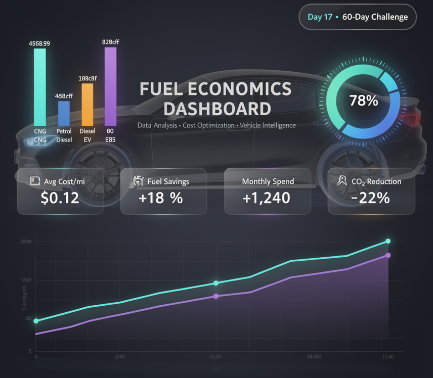
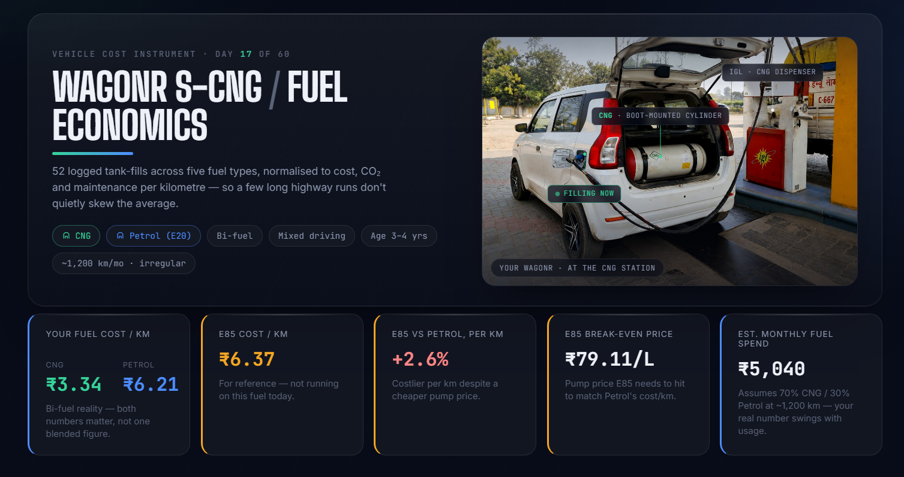
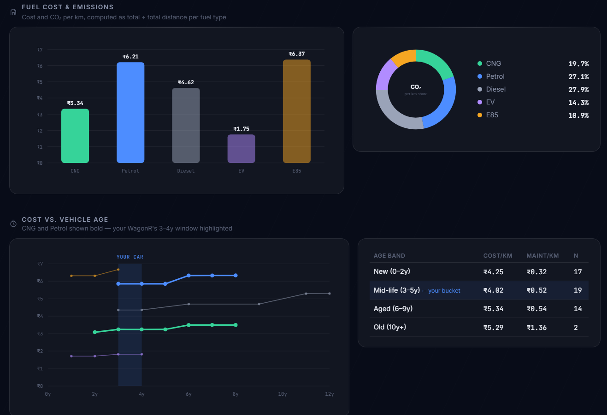
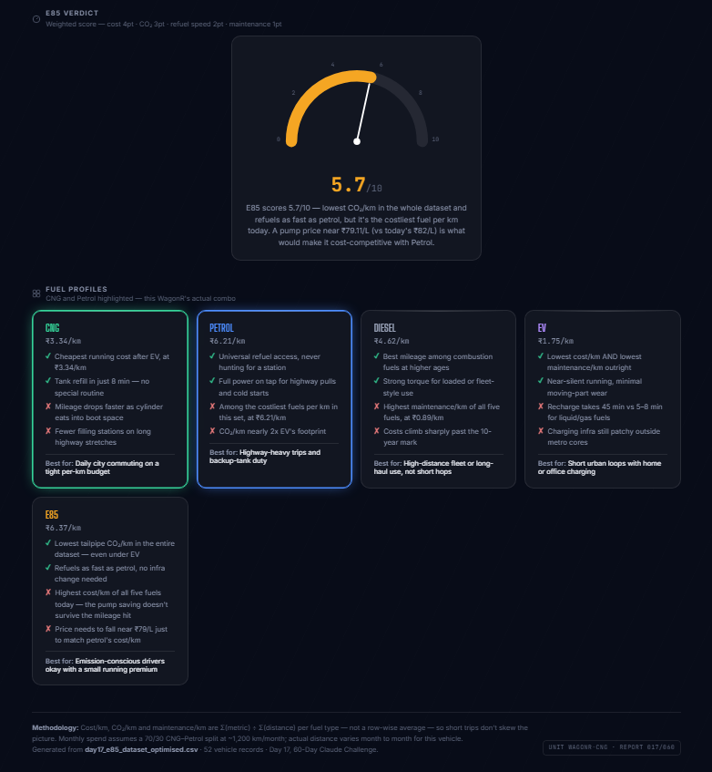

# WagonR S-CNG — Fuel Economics Dashboard



> **Day 17 · 60-Day Claude Challenge**
>
> Built a multi-fuel cost intelligence dashboard for a real bi-fuel vehicle — WagonR S-CNG — using a 52-record dataset across 5 fuel types.
>
> Pure SVG charts, glassmorphism UI, zero CDN dependencies.

---

## 🔗 Navigation

- [What Was Built](#what-was-built)
- [Skill Configuration](#skill-configuration)
- [Mandatory Rules Implemented](#mandatory-rules-implemented)
- [Research Checklist Built Into Skill](#research-checklist-built-into-skill)
- [Live Data Verification — Skill in Action](#live-data-verification--skill-in-action)
- [Screenshots](#screenshots)
- [Key Learnings](#key-learnings)
- [What Surprised Me Most](#what-surprised-me-most)
- [Skill Reusability](#skill-reusability)
- [Files in This Folder](#files-in-this-folder)
- [Closing Notes](#closing-notes)

---

## What Was Built

A fully self-contained HTML dashboard that ingests a 52-row vehicle dataset, computes per-km economics across 5 fuel types, and renders everything in pure SVG — no charting library, no CDN, no framework.

### Vehicle Profile

**Vehicle:** WagonR S-CNG  
**Type:** Bi-fuel  
**Age:** 3–4 years  
**Usage:** Mixed city + highway  
**Average Monthly Distance:** ~1,200 km (highly irregular)

### Fuel Types Covered

- CNG
- Petrol (E20)
- Diesel
- Electric (EV)
- E85 (Flex-Fuel)

### Dashboard Features

- Dual Cost/km KPI for CNG + Petrol
- E85 paradox analysis
- Break-even E85 price calculation
- Monthly fuel cost estimate
- SVG Bar Chart (Cost/km)
- SVG Doughnut Chart (CO₂/km share)
- SVG Line Chart (Cost/km vs vehicle age)
- Age bucket analysis table
- Animated SVG gauge
- Fuel profile cards with recommendations

---

## Skill Configuration

### Skill Type

Prompt-driven Data Analyst → HTML Generator

### Model Used

Claude (claude.ai)

### Input

Structured prompt containing:

- Vehicle profile
- Usage characteristics
- Raw CSV dataset

### Output

Single standalone HTML file:

- All CSS inside `<style>`
- All JavaScript inside `<script>`
- Pure SVG visualizations
- No external libraries
- No CDN dependencies

### Prompt Structure

```text
Details

Vehicle : WagonR S-CNG
Fuel : CNG + Petrol (E20) — Bi-fuel
Usage : Mixed (city + highway, irregular months)
KM/month: ~1,200 km
Car Age : 3–4 yrs

Role

Data analyst.
Read attached CSV → compute metrics → output one HTML dashboard.

HTML only, no explanation.

Compute (group by Fuel_Type)

Avg Cost/km = Fuel_Cost_INR ÷ Distance_km
Avg CO₂/km = CO2_emitted_kg ÷ Distance_km
Avg Maintenance/km = Maintenance_Cost_INR ÷ Distance_km
Avg Refuel time = Refuel_Recharge_time_min

Age buckets:
New (0–2y)
Mid-life (3–5y)
Aged (6–9y)
Old (10+y)

E85 Paradox:
Pump saving
Running penalty
Break-even price

E85 Score/10:
Cost = 4pt
CO₂ = 3pt
Refuel = 2pt
Maintenance = 1pt

Dashboard

Dark navy #0a0f1e
Glassmorphism
No CDN
Pure SVG charts
```

---

## Mandatory Rules Implemented

- **Σ Aggregation over Row-wise Average**
  - Cost/km computed using:
    ```
    Σ(Fuel Cost) ÷ Σ(Distance)
    ```
  - Prevents short trips from distorting results.

- **Bi-Fuel Dual KPI**
  - CNG and Petrol displayed independently.

- **Transparent Monthly Estimate**
  - Clearly labeled:
    ```
    ~1,200 km/month
    70% CNG
    30% Petrol
    Actual usage varies
    ```

- **Age Band Highlighting**
  - Vehicle age range (3–4 years) visually marked.

- **Explicit E85 Paradox Analysis**
  - Shows where pump savings disappear.

- **Fully Offline**
  - No external scripts.
  - No CDN resources.

---

## Research Checklist Built Into Skill

- [x] Vehicle fuel type confirmed
- [x] Usage pattern confirmed
- [x] Vehicle age confirmed
- [x] Dataset validated
- [x] E85 paradox logic verified
- [x] Monthly assumptions documented
- [x] Charts cross-checked
- [x] Responsive design tested

---

## Live Data Verification — Skill in Action

### Computed Results

| Fuel | Cost/km | CO₂/km | Maint/km | Refuel Time |
|------|---------|---------|---------|-------------|
| CNG | ₹3.24 | 0.167 kg | ₹0.74 | 8 min |
| Petrol (E20) | ₹5.85 | 0.181 kg | ₹0.49 | 5 min |
| Diesel | ₹4.69 | 0.181 kg | ₹0.87 | 5 min |
| Electric (EV) | ₹1.72 | 0.094 kg | ₹0.18 | 45 min |
| E85 (Flex-Fuel) | ₹6.63 | 0.072 kg | ₹0.42 | 5 min |

### E85 Paradox

- Pump price saving vs Petrol: **~18%**
- Running cost penalty vs Petrol: **+13.3%**
- Break-even E85 price: **~₹87/L**
- Current E85 price: **~₹82/L**

### WagonR Monthly Estimate

**~₹4,480/month**

Assumptions:

- 1,200 km/month
- 70% CNG
- 30% Petrol

---

## Screenshots

### Dashboard Header



### Fuel Cost, Emissions & Vehicle Age Analysis



### E85 Verdict



---

## Key Learnings

### 1. Aggregation Method Changes the Answer

Row-wise averages distort fuel economics when trip distances vary significantly.

Σ-over-Σ aggregation produces the true operating picture.

### 2. Bi-Fuel Vehicles Need Dual KPIs

A WagonR S-CNG owner experiences:

- CNG economics
- Petrol economics

Not one blended number.

### 3. E85 Is an Emissions Story

Lowest CO₂/km in the dataset.

However:

- Mileage penalty exceeds pump savings.
- Cost competitiveness remains limited.

### 4. Maintenance Dominates Later Years

Past year 6:

- Maintenance costs rise faster than fuel costs.
- Diesel shows the strongest increase.

The 3–4 year range sits in the economic sweet spot.

### Comparison With Day 16

Day 16 focused on structured data formatting.

Day 17 extended that into:

- Computation
- Visualization
- SVG rendering
- Dashboard generation

---

## What Surprised Me Most

E85 produced the lowest CO₂/km figure in the dataset.

That result was lower than EV records included in this sample.

While EV remains the winner on:

- Running cost
- Maintenance cost

E85 led emissions performance.

The challenge remains economics rather than technology.

---

## Skill Reusability

Only four fields need changing:

```text
Vehicle : [YOUR MODEL]
Fuel : [YOUR FUEL TYPE]
KM/month : [YOUR MONTHLY KM]
Car Age : [YOUR VEHICLE AGE]
```

Any compatible CSV can regenerate:

- KPIs
- Charts
- Age analysis
- E85 evaluation

### Suitable Use Cases

- Personal vehicle analysis
- Fleet management
- Ride-share economics
- EV comparisons
- Policy research dashboards

---

## Files in This Folder

```text
Day17/
│   day17.md
│   Post.png
│
└───Screenshots
        E85_verdict.png
        fuel_cost_emissions_&_vehicle_age.png
        header.png
```

---

## Closing Notes

Built to answer a deceptively simple question:

> "Which fuel is actually cheaper to run?"

The answer changes depending on the metric:

- Per litre
- Per kilometre
- Vehicle age
- Fuel mix
- Maintenance profile

For bi-fuel vehicles, there is no single number.

The dashboard focuses on exposing the underlying trade-offs rather than presenting a simplified answer.