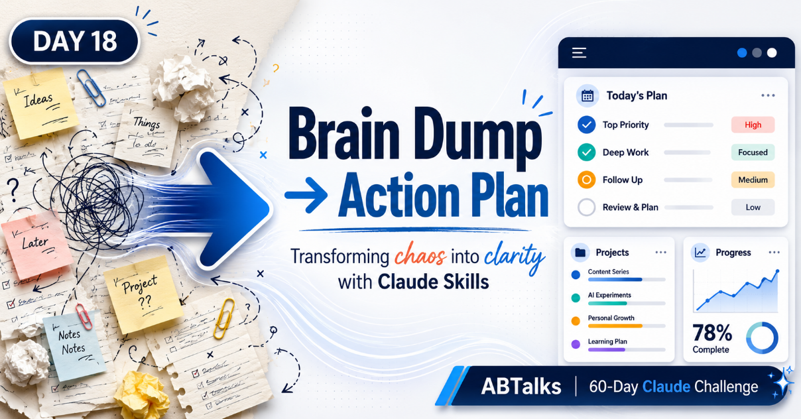
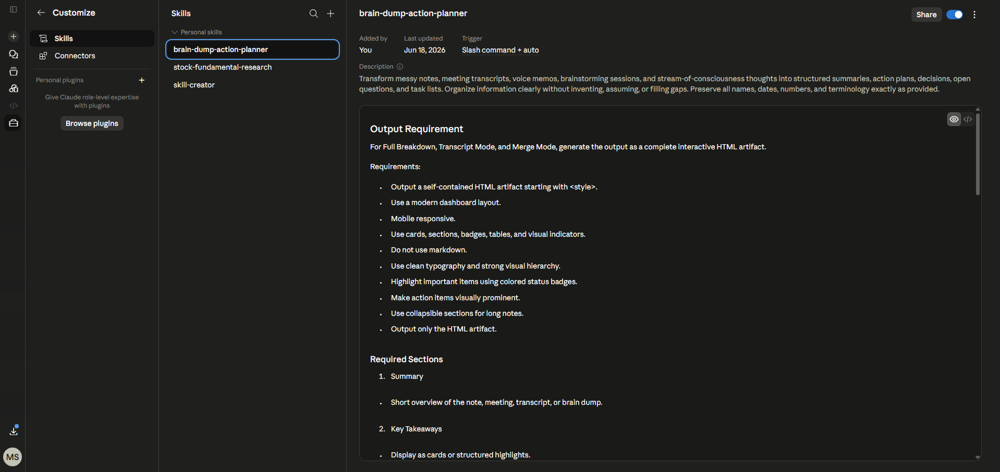
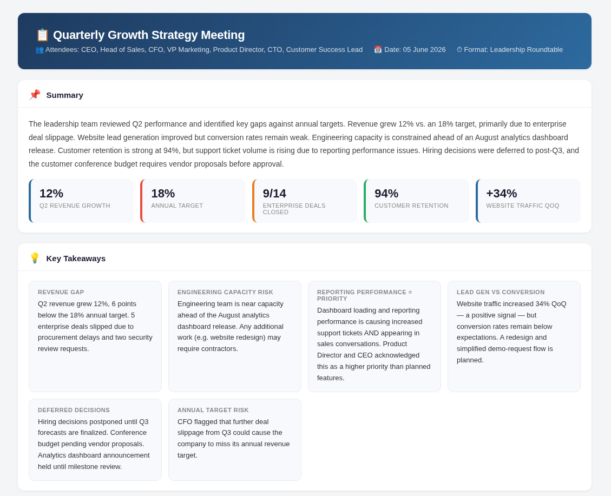
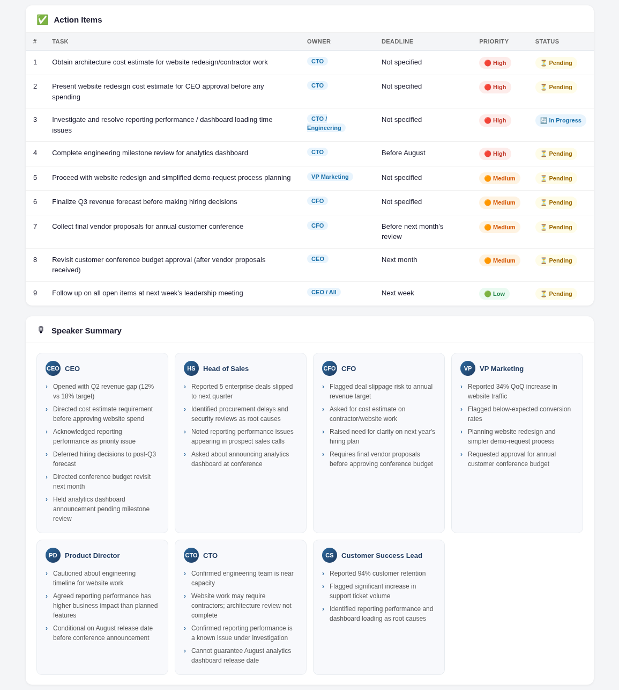
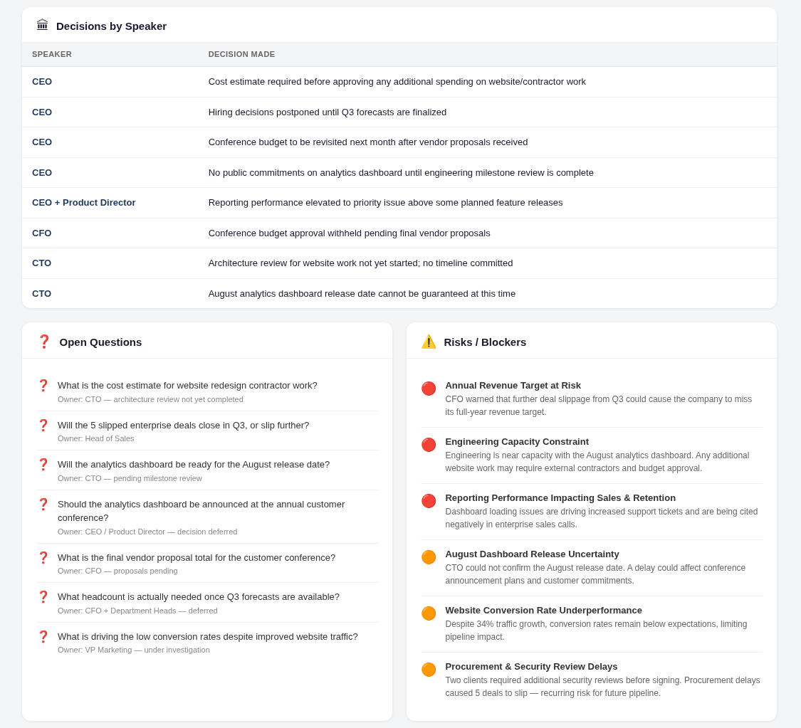
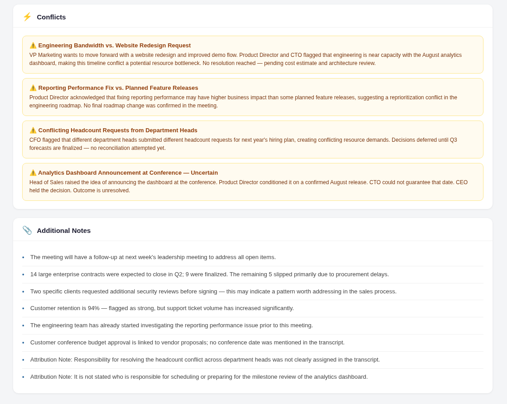

# Day 18 — Build a Brain Dump Action Planner Skill

> **Day:** 18 · **Topic:** Brain Dump Action Planner Skill · **Skill:** `brain-dump-action-planner` · **Date:** 2026-06-18

## 🔗 Navigation

- [What Was Built](#what-was-built)
- [Skill Configuration](#skill-configuration)
- [Mandatory Rules Implemented](#mandatory-rules-implemented)
- [Research Checklist Built Into Skill](#research-checklist-built-into-skill)
- [Live Data Verification (Skill in Action)](#live-data-verification-skill-in-action)
- [Screenshots](#screenshots)
- [Key Learnings](#key-learnings)
- [What Surprised Me Most](#what-surprised-me-most)
- [Skill Reusability Demo](#skill-reusability-demo)
- [Files in This Folder](#files-in-this-folder)
- [Closing Notes](#closing-notes)

---

## What Was Built

Built a reusable Claude Custom Skill named `brain-dump-action-planner` that ingests any messy unstructured input — meeting transcripts, voice memo transcripts, brainstorm dumps, stream-of-consciousness notes — and outputs a self-contained interactive HTML dashboard. The dashboard renders as a Notion/Linear-style artifact with seven fixed sections: Summary, Key Takeaways, Action Items, Open Questions, Risks/Blockers, Conflicts, and Additional Notes. Three operating modes (Full Breakdown, Transcript Mode, Merge Mode) are auto-selected based on input shape.

## Skill Configuration

- **Skill Name:** `brain-dump-action-planner`
- **Description:** Transform messy notes, meeting transcripts, voice memos, brainstorming sessions, and stream-of-consciousness thoughts into structured summaries, action plans, decisions, open questions, and task lists. Organize information clearly without inventing, assuming, or filling gaps. Preserve all names, dates, numbers, and terminology exactly as provided.
- **Trigger:** Auto-invoked when input matches meeting notes, transcripts, voice memos, brainstorms, or unstructured thought dumps.
- **Tools used:** Claude artifact renderer (HTML output)
- **Inputs:** Raw text — single note (Full Breakdown), labeled transcript (Transcript Mode), or multiple notes (Merge Mode)
- **Output:** Self-contained HTML artifact starting with `<style>`, mobile responsive, dashboard layout with cards, tables, badges, and visual indicators
- **Effort level:** Low / Medium (per task spec)

## Mandatory Rules Implemented

The skill is bound by a strict rule set that prevents the most common LLM failure modes (hallucination, silent inference, unauthorized conflict resolution):

- **Self-contained HTML artifact starting with `<style>`** — no markdown, no external dependencies
- **Seven required sections** — Summary, Key Takeaways, Action Items (interactive table), Open Questions, Risks/Blockers, Conflicts, Additional Notes; plus Source Information in Merge Mode
- **Status badge system** — 🔴 High Priority · 🟠 Medium Priority · 🟢 Low Priority · ⚠️ Conflict · ❓ Open Question · ✅ Completed · ⏳ Pending
- **Missing information → "Not specified"** — never invent, infer, assume, predict, estimate, or complete
- **Preserve verbatim** — all names, dates, numbers, and terminology kept exactly as provided
- **Transcript Mode extras** — Speaker Summary, Decisions by Speaker, Action Items by Speaker, Attribution Notes when ownership is unclear
- **Merge Mode extras** — Duplicate Items section, Conflict Resolution Review section, Source Note; never auto-resolve conflicts
- **Design goals** — Notion / ClickUp / Linear / Asana / Airtable aesthetic; responsive cards, clean tables, section headers, badges, hover effects, soft shadows

## Research Checklist Built Into Skill

Before producing output, the skill implicitly runs this verification chain:

- [ ] Detect input shape → select mode (Full Breakdown / Transcript / Merge)
- [ ] Extract all speakers using exact labels (Transcript Mode)
- [ ] Pull every name, date, number verbatim — no paraphrasing
- [ ] Categorize content into the 7 required sections (+ Source Info in Merge Mode)
- [ ] Flag missing fields as "Not specified" — never infer
- [ ] Surface conflicts explicitly — never auto-resolve
- [ ] Apply status badges consistently (🔴 🟠 🟢 ⚠️ ❓ ✅ ⏳)
- [ ] Confirm output is self-contained HTML starting with `<style>`, no markdown
- [ ] Confirm mobile responsive layout
- [ ] Confirm Notion/Linear aesthetic with cards, tables, badges, hover effects

## Live Data Verification (Skill in Action)

**Input:** A 25-line Quarterly Growth Strategy Meeting transcript with 7 speakers (CEO, Head of Sales, CFO, VP Marketing, Product Director, CTO, Customer Success Lead). The transcript contains hard numbers (12% revenue growth vs 18% target, 9/14 enterprise deals closed, 94% retention, +34% traffic), deferred decisions, capacity constraints, and unresolved conflicts.

**Mode auto-selected:** Transcript Mode (speaker labels detected).

**Output highlights from the generated dashboard:**

- **Summary card** — 5-stat dashboard: `12%` Q2 growth · `18%` target · `9/14` deals closed · `94%` retention · `+34%` traffic
- **Key Takeaways** — 6 cards covering revenue gap, engineering capacity risk, reporting performance priority, lead gen vs conversion, deferred decisions, annual target risk
- **Action Items table** — 9 rows with Owner / Deadline / Priority / Status columns; missing deadlines marked "Not specified" instead of invented
- **Speaker Summary** — 7 speaker cards, each with 3–6 bullet points extracted verbatim from their contributions
- **Decisions by Speaker** — 8-row table attributing each decision to its decision-maker
- **Open Questions** — 7 unresolved questions, each with an owner note
- **Risks / Blockers** — 6 risk items with priority icons (🔴🔴🔴🟠🟠🟠)
- **Conflicts** — 4 explicit conflicts surfaced (engineering bandwidth vs website redesign, reporting fix vs feature releases, headcount requests, dashboard announcement timing) — none auto-resolved
- **Additional Notes** — 8 supporting notes, including 2 Attribution Notes flagging unclear ownership

The skill correctly preserved every number verbatim, refused to invent deadlines that weren't in the transcript, and surfaced conflicts instead of papering over them.

## Screenshots

*Header, summary stat boxes, and 6 key takeaway cards.*

*9-row action items table with owners, deadlines, priority badges, and status — plus 7 speaker cards.*

*Decisions-by-speaker table, 7 open questions, and 6 risk/blocker items.*

*4 surfaced conflicts (none auto-resolved) and 8 additional notes including attribution notes.*

## Key Learnings

- **The skill's value isn't the dashboard — it's the rule set.** The HTML output is a side effect. The actual deliverable is the constraint system that prevents hallucination, silent inference, and unauthorized conflict resolution.
- **"Not specified" > a confident guess.** Marking missing info explicitly is more useful than inventing a plausible value. The dashboard becomes trustworthy because it admits what it doesn't know.
- **Mode auto-selection by input shape is powerful.** One skill, three modes (Full Breakdown / Transcript / Merge), selected automatically based on whether speaker labels exist or multiple notes are present. No flag-passing required.
- **Surfacing conflicts > resolving them.** The skill's refusal to auto-resolve conflicts (Merge Mode) forces the human back into the loop where judgment belongs.

**Comparing across days:** Day 17 introduced the mechanics of defining and saving a Custom Skill in Claude — the scaffolding, the trigger description, the instructions field. Day 18 shifted focus from skill *structure* to skill *discipline*. The lesson: a skill that produces pretty output is easy to build; a skill that refuses to invent, infer, or resolve conflicts on the user's behalf is the actual unlock. Day 17 was about *how to build* a skill. Day 18 was about *what to forbid* inside one.

## What Surprised Me Most

The realization: the most valuable line in the entire skill prompt is *"Never invent values."* Not the dashboard layout. Not the status badges. Not the seven sections. A single negative constraint — don't make things up — is what turned the output from a convincing-looking summary into a trustworthy artifact. Every other instruction shapes the presentation; that one instruction protects the integrity.

## Skill Reusability Demo

The same skill flexes across input shapes without re-configuration:

- **Brainstorm dump (no speaker labels)** → Full Breakdown Mode activates automatically. A stream-of-consciousness product idea becomes a structured Summary + Key Takeaways + Action Items dashboard, with open questions surfaced and risks flagged.
- **Voice memo transcript (single speaker, rambling)** → Full Breakdown Mode. The ramble is compressed into action items with the speaker as default owner; topics without clear next steps become open questions.
- **Two related meeting notes (merge)** → Merge Mode activates. Duplicate items surface in a dedicated section, conflicting decisions land in the Conflict Resolution Review section, and a Source Note preserves provenance. Conflicts are presented, not resolved.

The skill's mode-detection logic means the same `brain-dump-action-planner` handles a one-on-one meeting, a product brainstorm, and a multi-source merge — without the user ever specifying which mode to use.

## Files in This Folder

- `day18.md` — this write-up
- `day18linkedin.md` — LinkedIn post + referral comment
- `Post.png` — Day 18 topic-overview banner
- `Screenshot/skill_snapshot.png` — Claude skill configuration screen
- `Screenshot/QuarterlyGrowth_KeyTakeaways.png` — Header, summary stats, key takeaways
- `Screenshot/ActionItems_SpeakerSummary.png` — Action items table + speaker summary cards
- `Screenshot/Decision_Questions_Risks.png` — Decisions by speaker, open questions, risks
- `Screenshot/Conflicts_AdditionalNotes.png` — Conflicts + additional notes

## Closing Notes

Day 18 shipped a reusable skill that turns chaos into clarity — and does so without inventing a single value. The full skill definition, the generated dashboard artifact, and the key learnings captured here live in the repository:

🔗 **GitHub:** https://github.com/devpal-singh-anand/ABTalks-60-Day-Claude-Challenge/tree/main/Day18

The dashboard is the visible output. The rule set is the actual deliverable.
