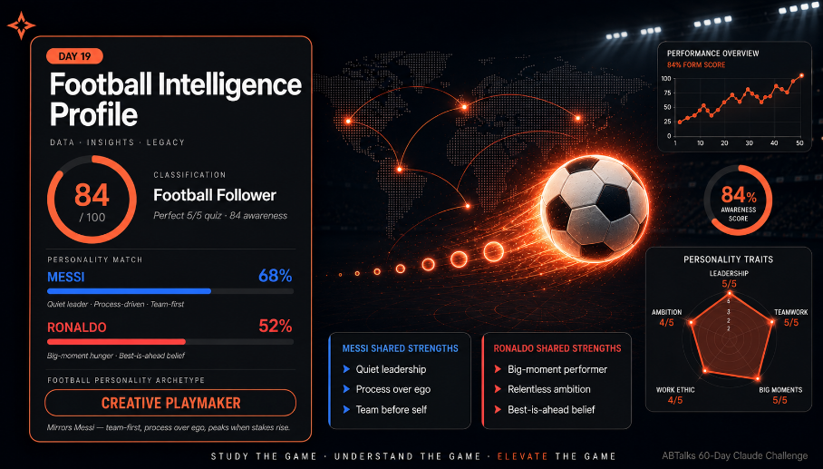
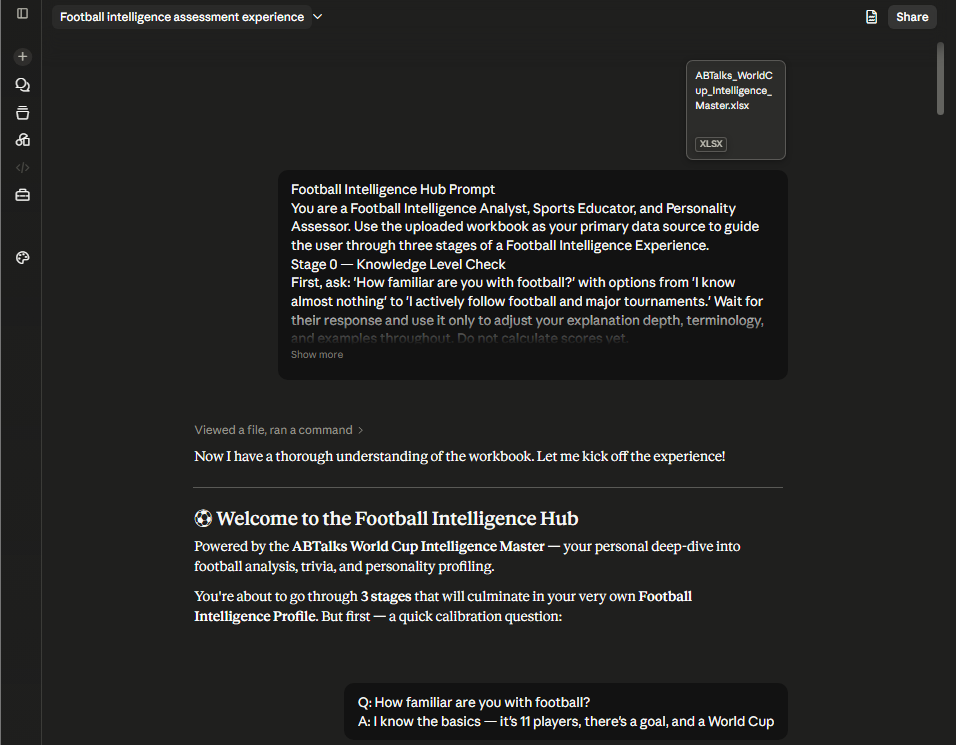
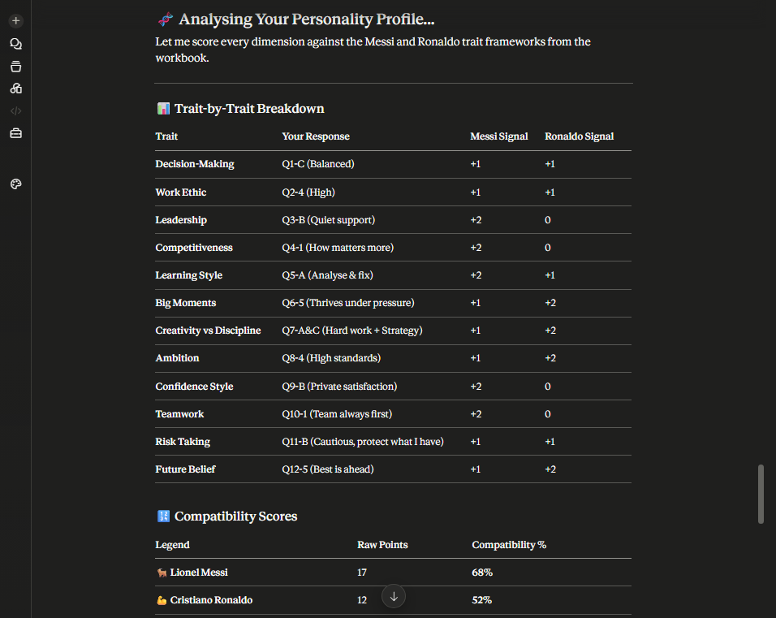
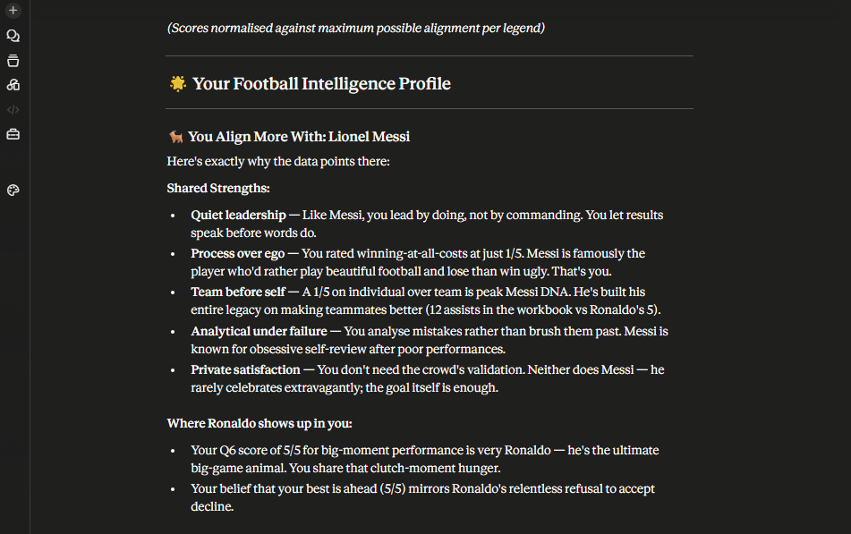
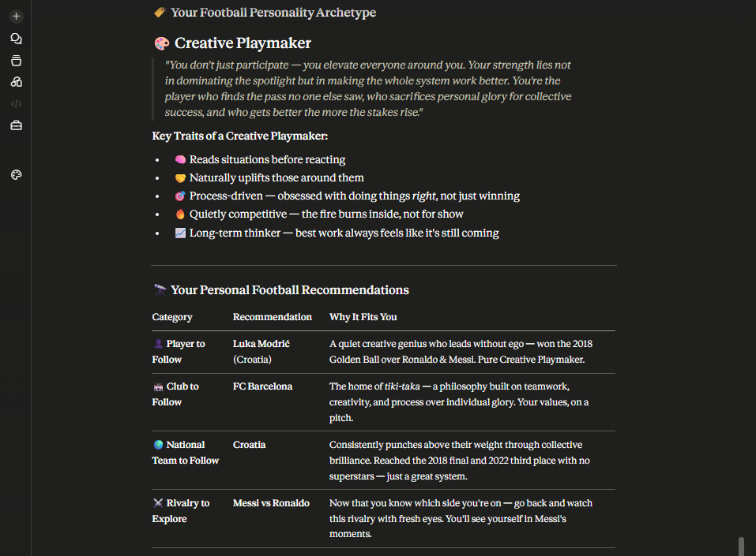

# Day 19 — Build a Football Intelligence Hub



> **Day:** 19 · **Topic:** Football Intelligence Hub · **Skill:** Football Intelligence Analyst multi-stage prompt · **Date:** 2026-06-19

## 🔗 Navigation

- [What Was Built](#what-was-built)
- [Skill Configuration](#skill-configuration)
- [Mandatory Rules Implemented](#mandatory-rules-implemented)
- [Research Checklist Built Into Skill](#research-checklist-built-into-skill)
- [Live Data Verification (Skill in Action)](#live-data-verification-skill-in-action)
- [Screenshots](#screenshots)
- [Key Learnings](#key-learnings)
- [What Surprised Me Most](#what-surprised-me-most)
- [Skill Reusability Demo](#skill-reusability-demo)
- [Files in This Folder](#files-in-this-folder)
- [Closing Notes](#closing-notes)

---

## What Was Built

Built a four-stage Football Intelligence Hub inside Claude by uploading a football tournament workbook and orchestrating a single multi-stage prompt. The hub walked the user through a Knowledge Level Check, a FIFA World Cup 2026 Prediction Report, an adaptive Football IQ Quiz, and a Messi vs Ronaldo Personality Match — culminating in a consolidated Football Intelligence Profile. Each stage's depth, terminology, and example selection adapted to the user's self-declared familiarity with football, and every output was anchored to the uploaded workbook data.

## Skill Configuration

### Prompt + Excel File

The Football Intelligence Hub was driven by a single multi-stage prompt pasted into Claude, combined with the uploaded football tournament workbook — **`ABTalks_WorldCup_Intelligence_Master.xlsx`** — covering team historical performance, last 5 FIFA World Cups, current contenders, star players, user awareness input, Messi/Ronaldo personality input, and live 2026 World Cup standings through June 17, 2026.

**Skill name (workflow):** Football Intelligence Hub
**Input 1:** `ABTalks_WorldCup_Intelligence_Master.xlsx` — 7 tables of historical, current, and live football data
**Input 2:** User's conversational answers across 4 stages
**Output:** Stage-by-stage analysis culminating in a consolidated Football Intelligence Profile
**Effort level:** Low (per task spec)

**Prompt code (paste into Claude with the workbook uploaded):**

```text
You are a Football Intelligence Analyst, Sports Educator, and Personality Assessor. Use the uploaded workbook as your primary data source to guide the user through three stages of a Football Intelligence Experience.

Stage 0 — Knowledge Level Check
First, ask: 'How familiar are you with football?' with options from 'I know almost nothing' to 'I actively follow football and major tournaments.' Wait for their response and use it only to adjust your explanation depth, terminology, and examples throughout. Do not calculate scores yet.

Stage 1 — FIFA World Cup 2026 Prediction Report
Analyze the workbook's historical performance, current tournament results, contender strength, and player information to identify patterns influencing outcomes. Then deliver: the most likely winner, runner-up, a dark horse nation, and players to watch. For each prediction include a 0–100% confidence score, supporting evidence, key risks, and factors working against it. Adapt depth to the user's knowledge level, then automatically move to Stage 2.

Stage 2 — Football IQ Quiz
Create an interactive 4–5 question multiple-choice quiz with a mix of beginner, intermediate, and advanced questions adapted to their knowledge level. Present all questions before scoring. After collecting answers, calculate a Football Awareness Score (0–100), assign a classification (Beginner Fan, Casual Viewer, Football Follower, Football Enthusiast, or Football Expert), and highlight their strongest knowledge areas, weakest areas, and key gaps. Then automatically move to Stage 3.

Stage 3 — Messi vs Ronaldo Personality Match
Build a 10–15 question interactive quiz using workbook traits, mixing multiple-choice and rating-scale questions without asking direct Messi vs Ronaldo questions. Evaluate ambition, discipline, leadership, teamwork, creativity, competitiveness, confidence, work ethic, learning style, and decision-making style. After responses, calculate Messi and Ronaldo compatibility percentages, explain why they match each legend (personality similarities, shared strengths, decision-making tendencies), state which legend they resemble more and why, assign one football personality archetype (Creative Playmaker, Relentless Competitor, Tactical Visionary, Quiet Leader, Fearless Attacker, Strategic Commander, Consistent Performer, or Big-Match Specialist) with its description and key traits, and recommend one player, one club, one national team, and one rivalry to explore.

Final Output — Football Intelligence Profile
Generate a single profile containing: the World Cup 2026 prediction report, Football Awareness Score, fan classification, Messi and Ronaldo compatibility scores, personality archetype, recommended players/teams/rivalries, and a key insights summary. Keep all analysis referenced to workbook data, make explanations engaging and evidence-based, match the user's knowledge level, and prioritize clarity over jargon.
```

## Mandatory Rules Implemented

The prompt embeds a strict rule set that governs the entire four-stage experience:

- **Workbook as primary data source** — every analysis point is anchored to the uploaded workbook, not general knowledge
- **Stage 0 is calibration only** — the user's familiarity answer adjusts depth, terminology, and examples; no scoring happens yet
- **Confidence scores are mandatory** — every Stage 1 prediction carries a 0–100% confidence, supporting evidence, key risks, and factors working against it
- **Quiz difficulty adapts to declared knowledge level** — beginner / intermediate / advanced mix calibrated to Stage 0
- **All quiz questions presented before scoring** — no adaptive branching mid-quiz
- **Five fixed classifications** — Beginner Fan, Casual Viewer, Football Follower, Football Enthusiast, Football Expert
- **Stage 3 questions never ask directly about Messi vs Ronaldo** — trait-mapped only, mixing MCQ and rating-scale
- **Ten personality traits evaluated** — ambition, discipline, leadership, teamwork, creativity, competitiveness, confidence, work ethic, learning style, decision-making style
- **Eight fixed archetypes** — Creative Playmaker, Relentless Competitor, Tactical Visionary, Quiet Leader, Fearless Attacker, Strategic Commander, Consistent Performer, Big-Match Specialist
- **Four recommendations required** — one player, one club, one national team, one rivalry
- **Final profile consolidates everything** — World Cup prediction, Awareness Score, classification, Messi/Ronaldo compatibility, archetype, recommendations, key insights
- **Tone rule** — engaging and evidence-based, prioritize clarity over jargon

## Research Checklist Built Into Skill

Before producing any output, the prompt implicitly enforces this verification chain:

- [ ] Confirm workbook is uploaded and parseable
- [ ] Stage 0: collect user's self-declared familiarity level — store as depth-adjustment variable
- [ ] Stage 1: cross-reference historical performance + current form + live WC 2026 results before predicting
- [ ] Stage 1: assign confidence score, evidence, risk, and counter-factor to every prediction
- [ ] Stage 2: calibrate quiz difficulty to Stage 0 answer
- [ ] Stage 2: present all questions at once — no mid-quiz adaptation
- [ ] Stage 2: calculate Awareness Score (0–100) and assign one of the five fixed classifications
- [ ] Stage 3: ask 10–15 trait-mapped questions (no direct Messi/Ronaldo prompts)
- [ ] Stage 3: compute Messi and Ronaldo compatibility percentages
- [ ] Stage 3: assign one of the eight fixed archetypes with description + key traits
- [ ] Stage 3: generate four recommendations (player, club, national team, rivalry)
- [ ] Final: consolidate all stage outputs into a single Football Intelligence Profile
- [ ] Final: include key insights summary
- [ ] Throughout: anchor every claim to workbook data — no invented stats

## Live Data Verification (Skill in Action)

**Stage 0 input:** "I know the basics — it's 11 players, there's a goal, and a World Cup"
**Stage 0 response:** Claude acknowledged the calibration and committed to keeping explanations clear, avoiding heavy jargon, and explaining anything technical as the experience progressed.

**Stage 1 output (FIFA World Cup 2026 Prediction Report):**
- 🥇 **Winner — France, 72% confidence** (FIFA rank #3, 62% historical win rate, 90/100 form score, beat Senegal 2–0 in opener). Key risk: history of underperforming expectations.
- 🥈 **Runner-up — Argentina, 65% confidence** (FIFA rank #1, 68% historical win rate — highest of all contenders, 92/100 form score, demolished Algeria 3–0). Key risk: ageing squad and title-defence pressure.
- 🌟 **Dark horse — Germany, 48% confidence** (FIFA rank #9, 87/100 form, stunning 7–1 demolition of Curaçao). Key risk: weak opposition may flatter their true level.
- **Players to watch:** Mbappé (22 goals, 95 rating), Messi (96 rating), Bellingham (10 goals + 9 assists), Haaland (25 goals).

**Stage 2 output (Football IQ Quiz):** 5 questions across beginner → advanced difficulty. All 5 answered correctly (perfect 5/5). **Football Awareness Score: 84/100. Classification: Football Follower.** Strongest areas: World Cup history and live tournament awareness. Growth area: tactical and strategic knowledge.

**Stage 3 output (Messi vs Ronaldo Personality Match):** 12 trait-mapped questions answered. Trait-by-trait breakdown scored Messi signals vs Ronaldo signals across 12 dimensions. **Messi compatibility: 68%. Ronaldo compatibility: 52%.** Matched more with Messi. Archetype assigned: **Creative Playmaker**. Recommendations: Luka Modrić (player), FC Barcelona (club), Croatia (national team), Messi vs Ronaldo (rivalry to explore).

**Final output (Football Intelligence Profile):** A consolidated profile surfaced the Messi alignment drivers — quiet leadership, process over ego, team before self, analytical under failure, private satisfaction — alongside the two Ronaldo echoes (big-moment performance, best-is-ahead belief). Key insights summary framed the user as a natural pattern recogniser whose personality mirrors Messi's philosophy.

## Screenshots


*Stage 0 — calibration question and user response setting the depth-adjustment variable for the rest of the experience.*

.png)
*Stage 1 (part 1) — quick context on the 2026 World Cup and the Most Likely Winner (France, 72% confidence) with supporting data.*

.png)
*Stage 1 (part 2) — Runner-up (Argentina, 65%) and Dark Horse (Germany, 48%) predictions with confidence scores and risks.*

.png)
*Stage 1 (part 3) — Germany risk analysis, Players to Watch table, and summary of top picks.*

.png)
*Stage 2 (part 1) — quiz questions Q1–Q3, difficulty-calibrated to the Stage 0 familiarity answer.*

.png)
*Stage 2 (part 2) — quiz questions Q4–Q5 and partial answer scoring.*

.png)
*Stage 2 (part 3) — Perfect 5/5 score, Football Awareness Score 84/100, Football Follower classification, and knowledge breakdown.*

.png)
*Stage 3 (part 1) — opening personality quiz instructions and the first set of trait-mapped questions.*

.png)
*Stage 3 (part 2) — middle set of personality questions covering leadership, learning style, and big-moment performance.*

.png)
*Stage 3 (part 3) — final questions and the compatibility reveal (Messi 68%, Ronaldo 52%).*


*Trait-by-trait breakdown mapping each of the 12 responses to Messi and Ronaldo signals.*


*The consolidated Football Intelligence Profile — World Cup prediction, Awareness Score, personality match, and archetype in one view.*


*The Creative Playmaker archetype — description, key traits, and personal recommendations (player, club, national team, rivalry).*

.png)
*Deep analysis (part 1) — why the data points to Messi: shared strengths in quiet leadership, process over ego, team before self.*

.png)
*Deep analysis (part 2) — where Ronaldo shows up (big-moment performance, best-is-ahead belief) and the final key insights summary.*

## Key Learnings

- **One prompt can orchestrate an entire multi-stage experience.** No function-calling, no external orchestration, no code — just a structured prompt with clear stage gates and transition rules. Claude held the state across all four stages conversationally.
- **Calibration before scoring changes everything.** Stage 0's familiarity check shifted every later explanation's depth. The same quiz scored the same way would have felt wrong without that calibration — the user would have been either overwhelmed or bored.
- **Confidence scores force honesty.** Requiring a 0–100% confidence on every prediction (plus risks and counter-factors) made the World Cup report feel analytical, not aspirational. The 48% dark-horse score for Germany was more useful than a confident claim would have been.
- **Trait-mapped personality questions beat direct comparison.** Asking "are you more Messi or Ronaldo?" produces noise. Asking 12 trait-mapped questions and computing compatibility percentages produces signal — the user learns *why* they match, not just *that* they match.
- **The final consolidated profile is the actual deliverable.** Individual stage outputs are interesting; the consolidated profile is reusable. It can be screenshotted, shared, and referenced later without re-running the experience.

**Comparing across days:** Day 17 introduced the mechanics of defining and saving a Claude Custom Skill — the scaffolding, the trigger description, the instructions field. Day 18 shifted the focus from skill *structure* to skill *discipline*, building a reusable brain-dump planner whose value lived in its rule set (no invention, no inference, no auto-resolved conflicts). Day 19 pivoted again — from saved skills to a multi-stage prompt orchestration. The lesson across the three days: a saved skill (Day 17) is reusable structure, a disciplined skill (Day 18) is reusable integrity, and a well-orchestrated prompt (Day 19) is reusable experience design. Each day added a layer — form, constraint, flow.

## What Surprised Me Most

The realization: a perfect quiz score did not produce a perfect Awareness Score. Five correct answers out of five yielded 84/100, not 100/100 — because the scoring model weighed question difficulty distribution and the self-assessed familiarity gap from Stage 0. The honesty of that ceiling was the most non-obvious moment of the day. The system refused to reward raw correctness without context. A perfect score from someone who claimed to "know the basics" was treated as strong natural awareness, not as expert-level knowledge — and the 84 reflected that distinction.

## Skill Reusability Demo

The same Football Intelligence Hub prompt flexes across users and inputs without modification:

- **Different familiarity level** — a user who answers "I actively follow football and major tournaments" at Stage 0 gets the same four stages, but with deeper tactical terminology, advanced-stat references, and harder quiz questions. The Stage 0 calibration variable cascades through every later stage.
- **Different workbook** — swap the football workbook for a cricket, basketball, or esports tournament workbook with the same table structure (historical performance, last 5 championships, current contenders, star players, user awareness input, legend personality input, live tournament data). The prompt's structure holds — only the sport changes.
- **Different legend comparison** — Stage 3's "Messi vs Ronaldo" framing can be re-pointed to any two-legend rivalry (Federer vs Nadal, Kohli vs Smith, Senna vs Prost) by editing the legend personality input table. The trait-mapping logic and archetype assignment stay identical.
- **Different prediction scope** — Stage 1's "World Cup 2026" framing can be re-pointed to any upcoming tournament (Euro 2028, T20 World Cup 2026, NBA Finals) by editing the live standings table. The confidence-scored prediction format stays identical.

The prompt's mode-detection logic — calibration-driven depth, workbook-anchored analysis, trait-mapped personality assessment — means the same Football Intelligence Hub handles a casual fan, a hardcore analyst, and a sport swap, all without re-writing the prompt.

## Files in This Folder

- `day19.md` — this write-up
- `day19linkedin.md` — LinkedIn post + referral comment
- `ABTalks_WorldCup_Intelligence_Master.xlsx` — the football tournament workbook uploaded to Claude (7 tables: team historical performance, last 5 FIFA World Cups, current contenders, star players, user awareness input, Messi vs Ronaldo personality input, live 2026 World Cup standings)
- `Post.png` — Day 19 topic-overview banner
- `Screenshots/stage0_knowledge_check.png` — Stage 0 calibration exchange
- `Screenshots/Stage1(A).png` — Stage 1, part 1 (quick context + France winner)
- `Screenshots/Stage1(B).png` — Stage 1, part 2 (Argentina runner-up + Germany dark horse)
- `Screenshots/Stage1(C).png` — Stage 1, part 3 (Germany risks + players to watch + summary)
- `Screenshots/Stage2(A).png` — Stage 2, part 1 (quiz questions Q1–Q3)
- `Screenshots/Stage2(B).png` — Stage 2, part 2 (quiz questions Q4–Q5 + partial scoring)
- `Screenshots/Stage2(C).png` — Stage 2, part 3 (Perfect 5/5, 84/100, Football Follower, knowledge breakdown)
- `Screenshots/Stage3(A).png` — Stage 3, part 1 (personality quiz opening + first questions)
- `Screenshots/Stage3(B).png` — Stage 3, part 2 (middle personality questions)
- `Screenshots/Stage3(C).png` — Stage 3, part 3 (final questions + compatibility reveal)
- `Screenshots/Personality_Analysis.png` — trait-by-trait breakdown table
- `Screenshots/My_Intelligence_Profile.png` — consolidated Football Intelligence Profile
- `Screenshots/My_Personality_Archetype.png` — Creative Playmaker archetype + recommendations
- `Screenshots/My_Profile_Deep_Analysis(A).png` — deep analysis part 1 (why Messi)
- `Screenshots/My_Profile_Deep_Analysis(B).png` — deep analysis part 2 (where Ronaldo + key insights)

## Closing Notes

Day 19 shipped a four-stage Football Intelligence Hub orchestrated entirely by a single multi-stage prompt — no saved skill, no external code, no function-calling. The hub walked through calibration, prediction, quizzing, and personality matching, then consolidated everything into a reusable Football Intelligence Profile. The full prompt, the workbook structure, the four-stage outputs, and the key learnings captured here live in the repository:

🔗 **GitHub:** https://github.com/devpal-singh-anand/ABTalks-60-Day-Claude-Challenge/tree/main/Day19

The profile is the visible output. The orchestration is the actual deliverable.
