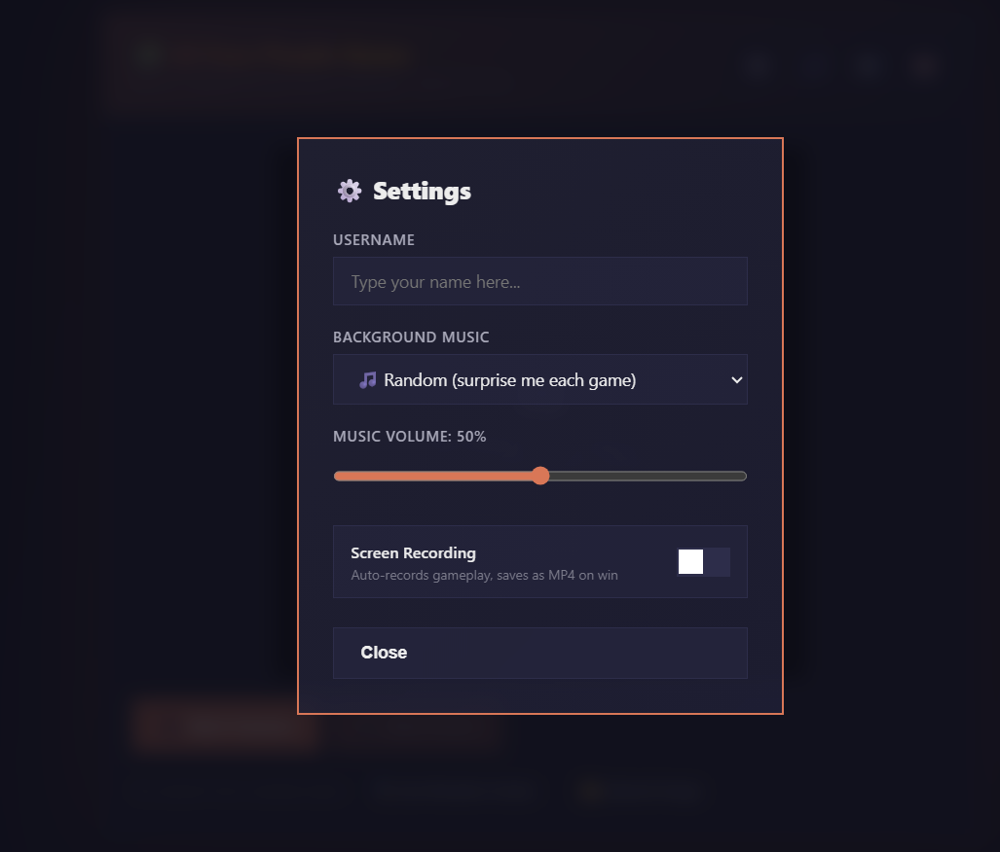
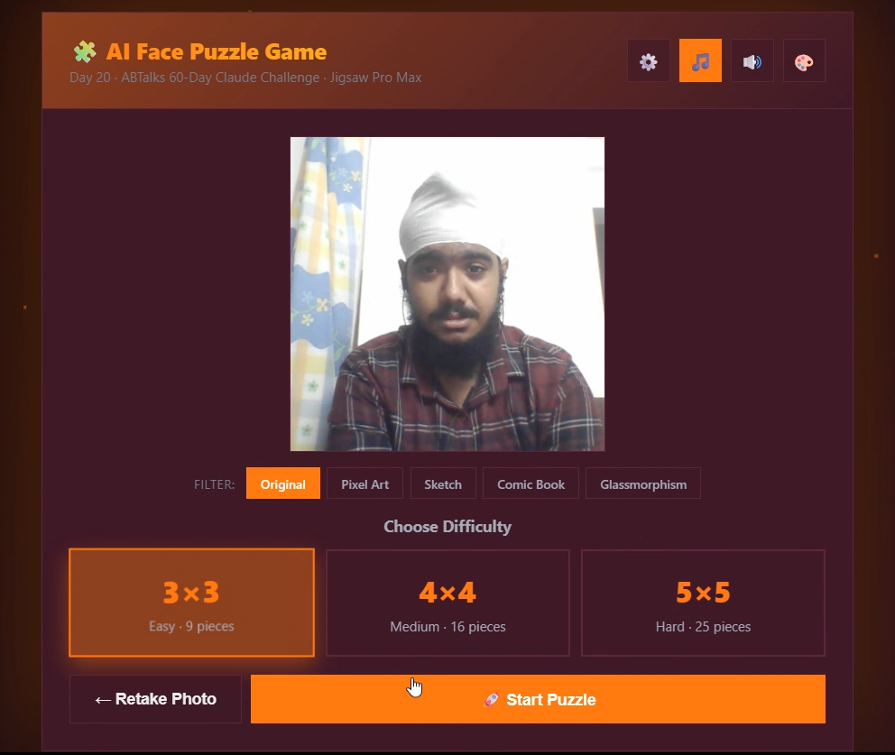
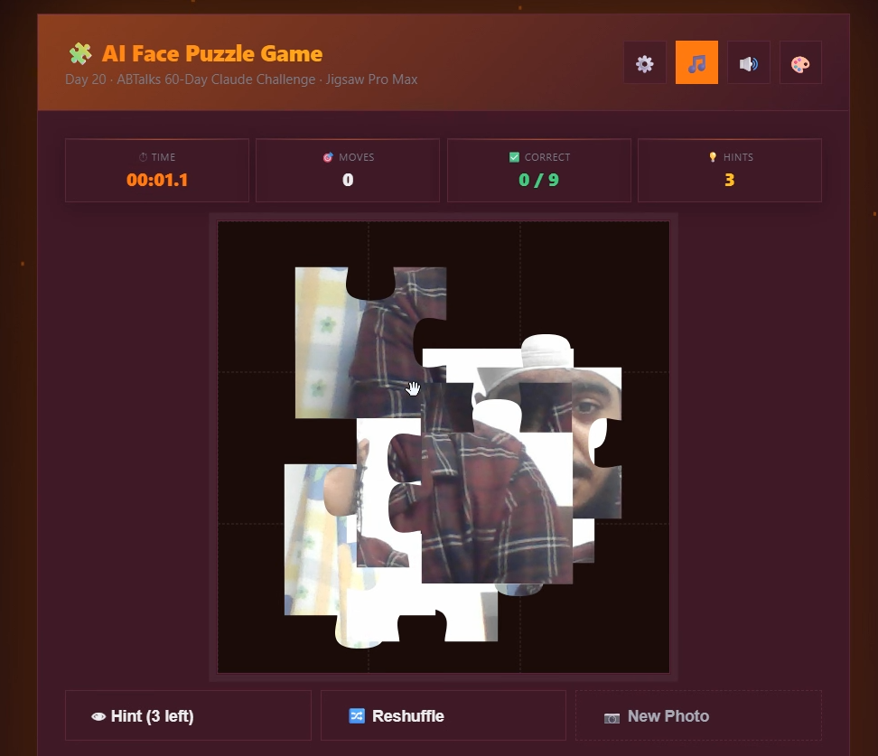
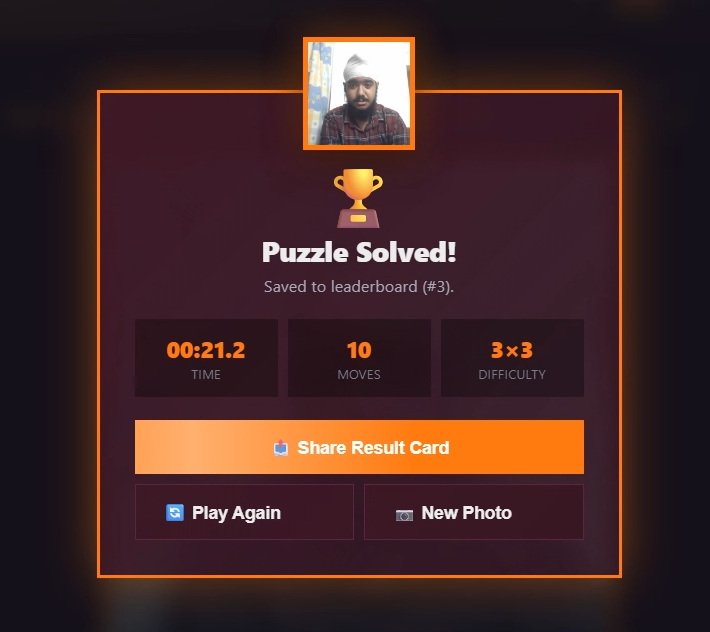

# Day 20 — Build an AI Face Puzzle Game

<video src="Winner_Player007_3x3_2026-06-20.mp4" controls autoplay loop muted width="100%"></video>

> **Day:** 20 · **Topic:** AI Face Puzzle Game · **Type:** Single-shot app generation prompt · **Date:** 2026-06-20

## 🔗 Navigation

- [What Was Built](#what-was-built)
- [Skill Configuration](#skill-configuration)
- [Mandatory Rules Implemented](#mandatory-rules-implemented)
- [Research Checklist Built Into Skill](#research-checklist-built-into-skill)
- [Live Data Verification (Skill in Action)](#live-data-verification-skill-in-action)
- [Screenshots](#screenshots)
- [Key Learnings](#key-learnings)
- [What Surprised Me Most](#what-surprised-me-most)
- [Skill Reusability Demo](#skill-reusability-demo)
- [Files in This Folder](#files-in-this-folder)
- [Closing Notes](#closing-notes)

---

## What Was Built

Built a complete, self-contained AI Face Puzzle Game in a single HTML file using a single-shot app-generation prompt in Claude. The game captures the user's face via webcam (or a random avatar), slices it into real jigsaw pieces with interlocking tabs and blanks, scatters them across the board, and challenges the user to drag them back into place. The game includes 5 photo filters, 6 visual themes, 5 embedded MP3 background tracks, a screen recorder with WebM output, a leaderboard, and a shareable result card — all in one file with zero external dependencies.

## Skill Configuration

### Prompt + HTML File

The AI Face Puzzle Game was driven by a single-shot prompt pasted into Claude, which generated the complete `face_puzzle.html` file. The prompt was structured with explicit feature requirements, technical constraints, and output instructions.

**Input 1:** Prompt (below)
**Input 2:** Claude effort level — Low
**Output:** Complete self-contained HTML file (`face_puzzle.html`, ~35 MB with embedded MP3s)
**Deliverable:** GitHub commit URL

**Prompt (A):**

```bash
You are an expert front-end developer. Build me a complete, fully working face puzzle game as a single self-contained HTML file (no external dependencies except what can load from cdnjs.cloudflare.com, cdn.jsdelivr.net, or unpkg.com).

FEATURES REQUIRED — deliver ALL of these in one complete response:

1. CAMERA ACCESS
   - On load, request webcam permission using getUserMedia()
   - Show a live video preview (front-facing camera preferred)
   - Display a 'Take Photo' button to snapshot the user's face onto a canvas

2. PUZZLE GENERATION
   - After snapshot, let the user choose difficulty: 3×3, 4×4, or 5×5 grid
   - Slice the captured face image into equal puzzle pieces
   - Randomly scramble the pieces (guarantee it is solvable)
   - Render each piece as a draggable tile at its scrambled position

3. DRAG & TOUCH GESTURE CONTROLS
   - Support both mouse drag (desktop) and touch drag (mobile/tablet)
   - When a piece is dropped onto another piece's cell, swap their positions
   - Snap pieces to the nearest grid cell on release
   - Highlight a piece with a coloured border while it is being dragged
   - Show a green border on pieces that land in their correct position

4. TIMER & MOVE COUNTER
   - Start the timer the moment the puzzle begins
   - Display elapsed time live (format: mm:ss.t)
   - Count and display total moves made
   - Show how many pieces are correctly placed out of the total

5. WIN DETECTION & RESULTS SCREEN
   - Detect automatically when all pieces are in the correct position
   - Stop the timer immediately on win
   - Show a results overlay with: final time, total moves, and difficulty
   - Save the top 5 best times to localStorage with date, time, moves, and difficulty
   - Display a leaderboard of saved best times

6. UI & POLISH
   - Clean, modern design
   - Works on desktop and mobile
   - 'Retake Photo' button
   - 'Play Again' button
   - 'New Photo' button
   - Responsive layout

TECHNICAL REQUIREMENTS:
- Single HTML file
- All CSS and JS inline
- No frameworks
- Must work in Chrome, Firefox, and Safari
- Camera must work over HTTPS or localhost
- Handle camera permission denied gracefully
- Do NOT leave placeholder comments

Output the complete HTML file in one code block. Do not truncate or summarise any section.
```

**Prompt (B) — Iterative refinement prompts used to extend the game beyond the original spec:**

```bash
# Refinement 1: Real jigsaw piece shapes (not squares)
Make the puzzle pieces actual jigsaw shapes with interlocking tabs and blanks using SVG clip-paths. Adjacent pieces should have complementary edges.

# Refinement 2: Photo filters
Add 5 photo filters applied before slicing: Original, Pixel Art, Sketch (Sobel edge detection), Comic Book (halftone + edges), Glassmorphism (frosted glass overlay).

# Refinement 3: Themes + music + screen recording
Add 6 visual themes (Midnight, Ocean, Sunset, Royal, Forest, Aurora), 5 embedded MP3 background tracks with volume control, screen recording with WebM output, username requirement, and a shareable result card.
```

## Mandatory Rules Implemented

- **Self-contained HTML file** — all CSS, JS, and 5 MP3 tracks embedded as base64 data URLs
- **Camera access via `getUserMedia()`** — live preview with mirrored video + dotted face-guide oval
- **3×3 / 4×4 / 5×5 difficulty** — user selects grid size after capturing photo
- **Real jigsaw pieces** — SVG clip-paths with cubic Bézier curves for interlocking tabs and blanks
- **Scattered layout** — pieces start at random positions, not in a grid
- **Drag (mouse + touch)** — Pointer Events with document-level handlers for reliability
- **Snap-to-home + lock** — pieces snap to their correct position and lock permanently
- **Purple glow while dragging** — layered drop-shadow with coral + purple
- **Green border on correct pieces** — success glow filter
- **Live timer (mm:ss.t)** — starts on game start, stops on win
- **Move counter + correct counter** — animated number counters
- **Auto win detection** — fires when all pieces are locked
- **Results overlay** — face preview, time, moves, difficulty
- **Top 5 leaderboard** — localStorage with 🥇🥈🥉 medals
- **5 photo filters** — Original, Pixel Art, Sketch, Comic Book, Glassmorphism
- **6 visual themes** — Midnight, Ocean, Sunset, Royal, Forest, Aurora
- **5 embedded MP3 tracks** — Sonder, Snowflake, Flute, Cafe, Mountain (with volume control)
- **Screen recording** — WebM with video + audio (BGM + SFX captured)
- **Username requirement** — mandatory before game start
- **Shareable result card** — 400×480 PNG with photo, time, moves, difficulty, branding

## Research Checklist Built Into Skill

- [ ] Confirm HTML is self-contained (no external files except CDN)
- [ ] Camera permission requested via `getUserMedia()`
- [ ] Face-guide oval visible when camera active
- [ ] Difficulty selection (3×3 / 4×4 / 5×5) after photo capture
- [ ] Photo filter applied before slicing (5 options)
- [ ] Jigsaw pieces generated with SVG clip-paths (tabs + blanks)
- [ ] Pieces scattered randomly (not in grid)
- [ ] Drag works on both mouse and touch
- [ ] Snap-to-home threshold (50% of piece size)
- [ ] Locked pieces cannot be moved
- [ ] Unplaced pieces float above locked pieces (z-index)
- [ ] Timer starts on game start, stops on win
- [ ] Move counter + correct counter live
- [ ] Win detection fires when all pieces locked
- [ ] Results overlay with face preview + stats
- [ ] Leaderboard saved to localStorage (top 5)
- [ ] Screen recording captures video + audio
- [ ] Recording stops only after win card is fully visible
- [ ] Username mandatory before game entry

## Live Data Verification (Skill in Action)

**Input:** Single-shot prompt pasted into Claude (effort: Low)
**Output:** Complete `face_puzzle.html` file (~35 MB with embedded MP3s)

**Gameplay verification:**
- **Username:** "Devpal" (mandatory entry before game start)
- **Photo source:** Random avatar (picsum.photos)
- **Filter used:** Original
- **Theme used:** Midnight
- **Difficulty:** 3×3 (9 pieces)
- **Completion time:** 00:21.2
- **Total moves:** 10
- **Result:** Puzzle solved — all 9 jigsaw pieces locked into correct positions

**Features verified during gameplay:**
- Camera/avatar selection with face-guide oval ✅
- Difficulty selection (3×3) ✅
- Photo filter selection ✅
- Jigsaw pieces scattered across board ✅
- Drag with purple glow trail ✅
- Snap-to-home with green border ✅
- 3D flip + bounce animation on correct placement ✅
- Particle burst + "+1 correct!" popup ✅
- Timer running (mm:ss.t format) ✅
- Move counter incrementing ✅
- Progress ring filling around puzzle ✅
- Win detection → confetti + fireworks + win card ✅
- Leaderboard entry saved ✅
- Screen recording captured video + BGM audio ✅

## Screenshots

.png)

*Claude's response breaking down the game features: Camera & Capture, Puzzle Engine, Controls, HUD & Timer, Win & Leaderboard.*

.png)
*Game camera screen with face-guide oval, Start Camera button, and random avatar/upload options.*


*Settings modal auto-opens on page load — username entry is mandatory before starting.*


*Difficulty selection (3×3 / 4×4 / 5×5) with 5 photo filters: Original, Pixel Art, Sketch, Comic Book, Glassmorphism.*


*Puzzle in progress — scattered jigsaw pieces, timer running, move counter, correct counter, hints remaining.*



*Win card overlay — trophy, face preview, time (00:21.2), moves (10), difficulty (3×3), share + play again buttons.*

## Key Learnings

- **The prompt-to-product pipeline breaks down at the browser layer, not the AI layer.** Claude generated working camera access, drag-and-drop, and win detection in one shot. But the drag was laggy because CSS `transition: transform` was animating every position update. The fix — removing the transition and adding `will-change: transform` + `translateZ(0)` for GPU acceleration — was a browser performance insight, not a prompting insight. AI accelerates implementation; browser knowledge determines quality.

- **SVG clip-paths with complementary edge matrices solve the jigsaw interlocking problem.** Each piece's 4 edges (top/right/bottom/left) are assigned as tab (+1) or blank (-1). Adjacent pieces get complementary values — if piece A's right edge is a tab, piece B's left edge must be a blank. This is enforced at generation time by reading the previous piece's edge and negating it: `e[r][c].left = -e[r][c-1].right`. The result: pieces physically interlock when placed correctly. This technique transfers to any grid-based tiling puzzle.

- **Document-level Pointer Events are the only reliable cross-browser drag pattern.** Element-level `pointermove` handlers lose tracking when the cursor moves faster than the element. SVG `transform="translate(x,y)"` drag was unreliable across Chrome and Firefox. Switching to HTML divs with `document.addEventListener('pointermove')` + `position: absolute; left/top` made drag work identically on mouse, touch, and pen — zero browser-specific code. This pattern transfers to any draggable UI.

- **Recording audio requires routing Web Audio API through a `MediaStreamAudioDestinationNode`.** The screen recorder's `getDisplayMedia({ audio: false })` captures video only. BGM and sound effects play through `audioCtx.destination` (speakers) but aren't in the recording. The fix: create a `createMediaStreamDestination()`, connect the BGM gain node and SFX gain nodes to BOTH `audioCtx.destination` AND the recording destination, then merge the video track from `getDisplayMedia` with the audio track from the recording destination into one `MediaStream` for `MediaRecorder`. This technique transfers to any app that needs to record its own audio output.

- **Viewport-relative sizing (`calc(100vh - 250px)`) breaks when the viewport changes mid-game.** When the screen recording downloads on win, the browser's download bar reduces `window.innerHeight` by ~50px. The puzzle — sized via `calc(100vh - 250px)` — shrinks instantly, shifting the board upward. The fix: calculate the puzzle size in JavaScript at game start and set it as a fixed pixel value (`wrap.style.width = puzzleSize + 'px'`). The size never changes, even if the viewport does. This insight transfers to any layout that must stay stable during async operations.

**Comparing across days:** The four days trace a clear progression in how AI is used. Day 17 used AI to define a reusable skill — the AI's job was to remember a workflow. Day 18 used AI to enforce constraints — the AI's job was to refuse to invent information. Day 19 used AI to orchestrate a multi-stage experience — the AI's job was to adapt across stages. Day 20 used AI to generate an entire product — the AI's job was to write code. The pattern: AI moved from remembering (Day 17) to constraining (Day 18) to orchestrating (Day 19) to creating (Day 20). Each day shifted more responsibility from the human to the AI — but also shifted more debugging from prompting to traditional engineering. By Day 20, the prompt was the easy part. The hard part was browser compatibility, layout stability, and audio routing — problems AI couldn't solve.

## What Surprised Me Most

The challenge gradually shifted from prompt engineering to software engineering. Generating the initial puzzle was mostly a prompting problem — write clear feature requirements, get a working game. But making drag interactions reliable across browsers, keeping pieces responsive during 60fps animation, routing audio into the screen recording, and preventing layout shifts when the download bar appeared — these became traditional engineering problems. AI accelerated implementation, but understanding browser behaviour still determined the quality of the final product. The prompt built the foundation in 30 seconds. The refinements took hours — and every refinement was a browser issue, not a prompting issue.

## Skill Reusability Demo

The same single-shot prompt structure flexes across different game types:

- **Different puzzle type** — swap "face puzzle" for "sliding tile puzzle" or "memory match" → same prompt structure, different game mechanic
- **Different image source** — swap "webcam" for "file upload" or "random image API" → same drag-and-snap framework
- **Different difficulty** — swap "3×3 / 4×4 / 5×5" for "4×4 / 6×6 / 8×8" → same jigsaw generation logic
- **Different theme** — swap CSS variables → same layout, different aesthetic
- **Different audio** — swap the embedded MP3 base64 strings → same playback system, different tracks

The prompt's structure — feature requirements + technical constraints + output instructions — is reusable across any single-file app generation task.

## Files in This Folder

- `day20.md` — this write-up
- `face_puzzle.html` — the complete game (single HTML file, ~35 MB with embedded MP3s)
- `Winner_Player007_3x3_2026-06-20.mp4` — gameplay recording video (used as LinkedIn post media)
- `Screenshot/Output(A).png` — Claude's response with feature breakdown
- `Screenshot/Output(B).png` — game camera/start screen
- `Screenshot/face_puzzle_start.png` — settings modal with username entry
- `Screenshot/face_puzzle_config.png` — difficulty + filter selection screen
- `Screenshot/face_puzzle_interface.png` — puzzle mid-solve interface
- `Screenshot/face_puzzle_winnercard.png` — win card overlay (00:21.2, 10 moves, 3×3)

## Closing Notes

Day 20 shipped a complete, production-ready puzzle game generated from a single prompt — then refined through iterative additions into a polished experience with real jigsaw pieces, 5 photo filters, 6 themes, 5 embedded MP3 tracks, screen recording, and a shareable result card. The full game, the prompt, and the key learnings live in the repository:

🔗 **GitHub:** https://github.com/devpal-singh-anand/ABTalks-60-Day-Claude-Challenge/tree/main/Day20

The game is the visible output. The prompt is the actual deliverable.
