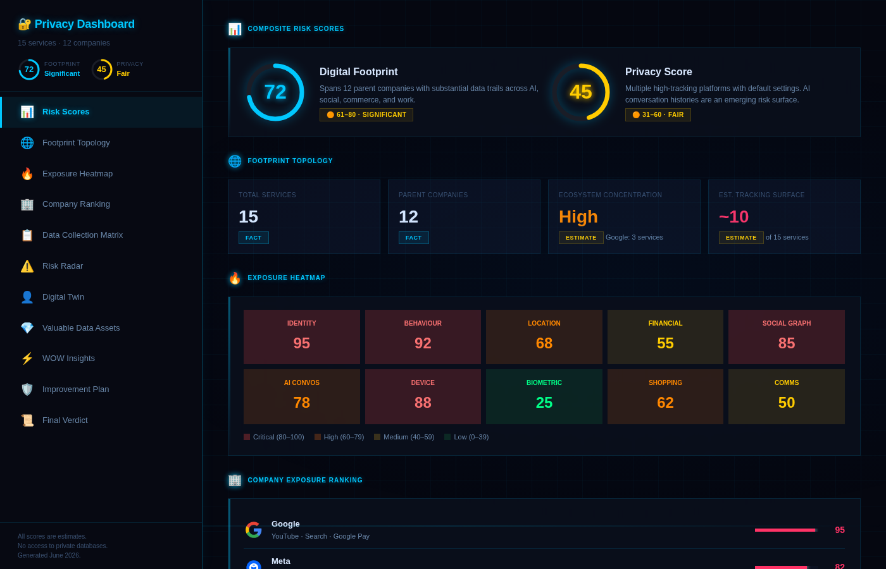
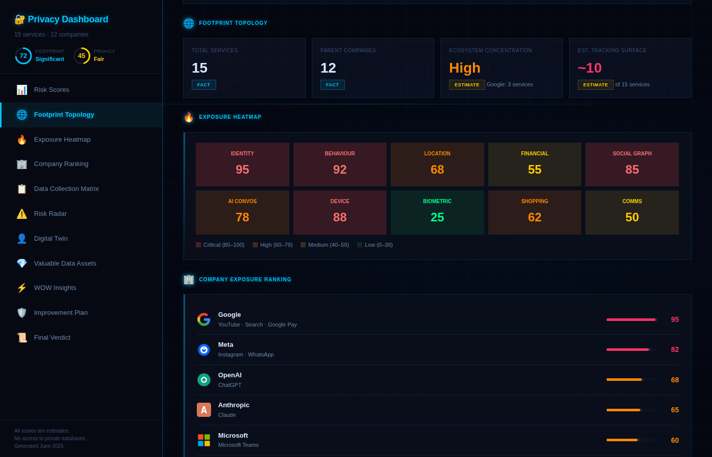
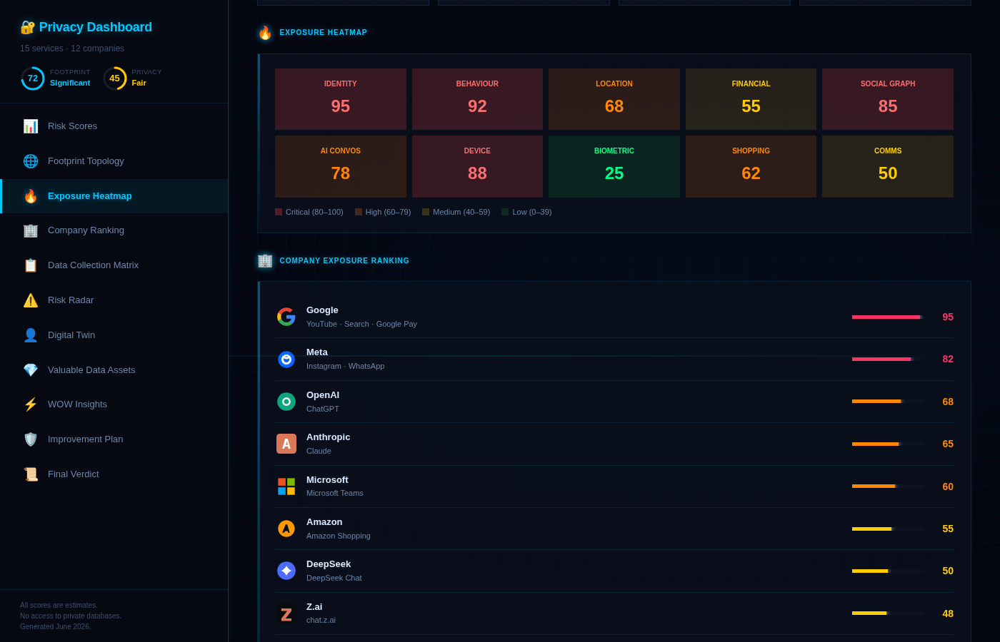
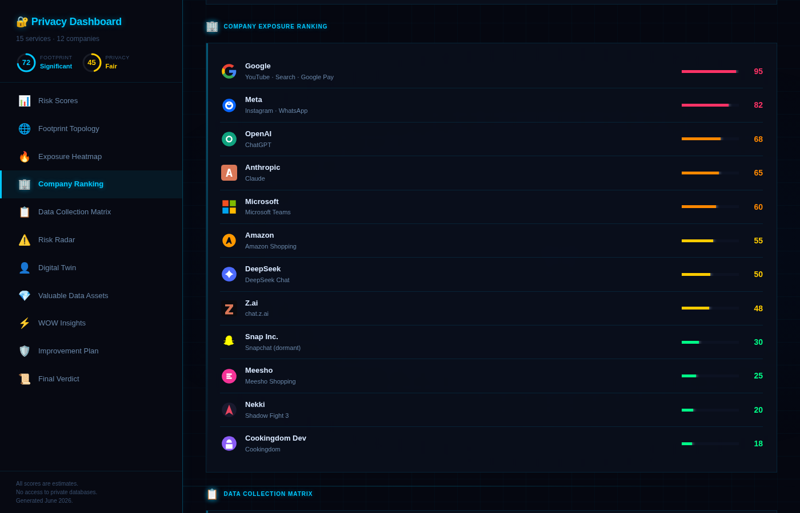
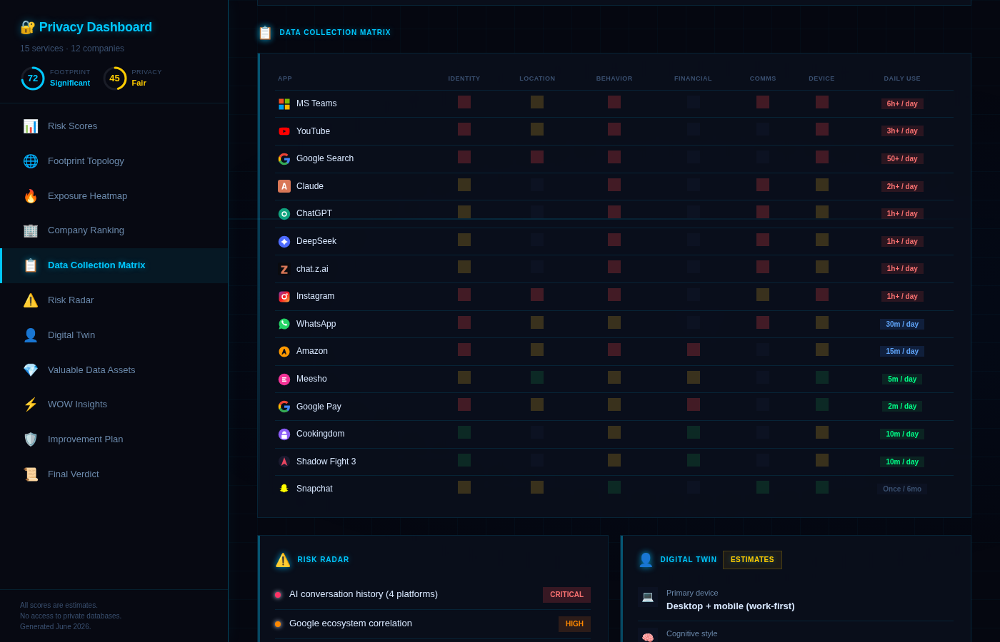
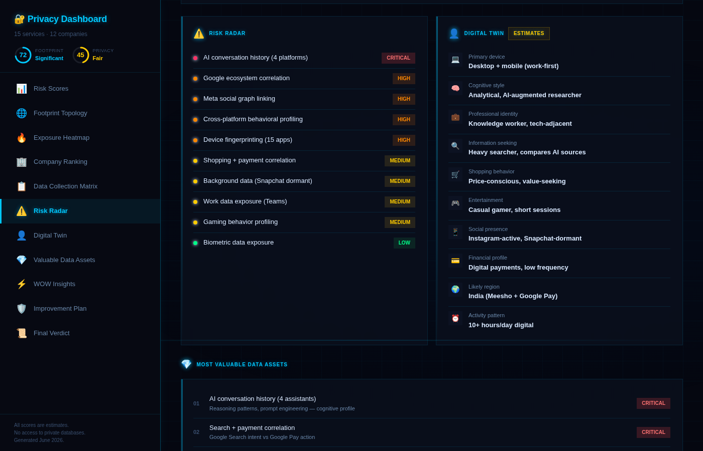
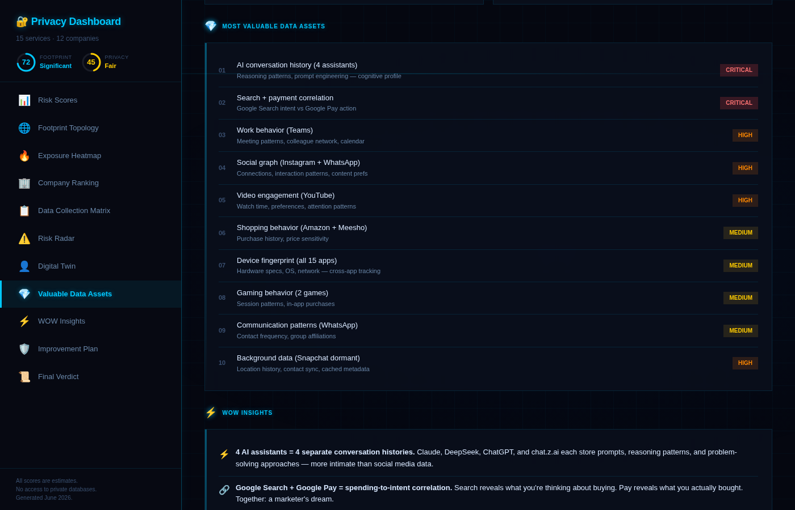
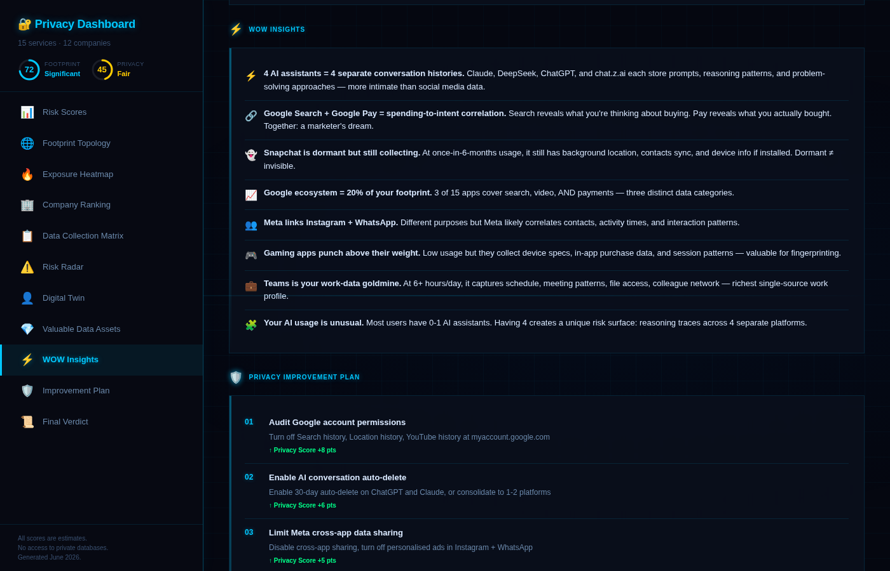
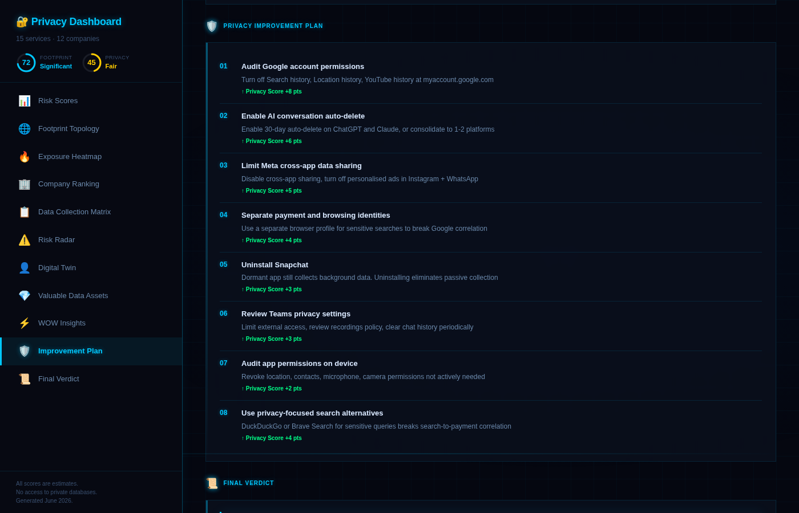
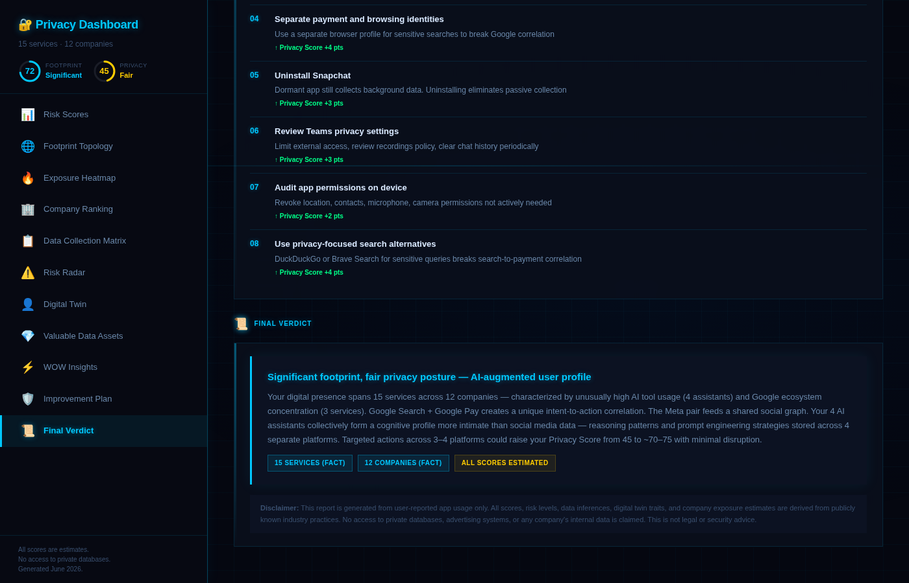

# Day 21 — Build a Digital Privacy Intelligence Dashboard



> **Day:** 21 · **Topic:** Digital Privacy Intelligence Dashboard · **Type:** Single-shot app generation prompt with personalized dataset · **Date:** 2026-06-21

## 🔗 Navigation

- [What Was Built](#what-was-built)
- [Skill Configuration](#skill-configuration)
- [Mandatory Rules Implemented](#mandatory-rules-implemented)
- [Research Checklist Built Into Skill](#research-checklist-built-into-skill)
- [Live Data Verification (Skill in Action)](#live-data-verification-skill-in-action)
- [Screenshots](#screenshots)
- [Key Learnings](#key-learnings)
- [What Surprised Me Most](#what-surprised-me-most)
- [Skill Reusability Demo](#skill-reusability-demo)
- [Files in This Folder](#files-in-this-folder)
- [Closing Notes](#closing-notes)

---

## What Was Built

Built a complete, self-contained Digital Privacy Intelligence Dashboard in a single HTML file — generated from a personalized single-shot prompt in Claude. The prompt was enhanced beyond the original ABTalks sample dataset to include the user's actual app usage patterns (15 services across 12 parent companies, with daily usage levels and AI tool emphasis). The dashboard features a sci-fi neon blue aesthetic with a scroll-spy sidebar navigation, glassmorphism cards, animated scanline, glowing score rings, and 11 interactive sections covering every aspect of digital privacy exposure.

## Skill Configuration

### Prompt + HTML File

The Digital Privacy Intelligence Dashboard was driven by a single-shot prompt pasted into Claude. The prompt was personalized before pasting — the original ABTalks sample dataset was replaced with the user's actual 15 apps, usage levels, and AI tool patterns. This personalization was the key enhancement that made the dashboard reflect real privacy exposure rather than a generic sample.

**Input 1:** Personalized prompt (below)
**Input 2:** Claude effort level — Medium
**Output:** Complete self-contained HTML file (`privacy_dashboard.html`, ~54 KB)
**Deliverable:** GitHub commit URL

**Prompt (A) — Personalized dataset + dashboard generation:**

```bash
### Sample User Dataset

Use the following dataset as the user's reported digital footprint.

Facts:

Applications (with usage levels):
- Microsoft Teams (High — daily, work)
- YouTube (High — daily)
- Google Search (High — daily)
- Claude (High — daily, AI assistant)
- DeepSeek (High — frequent, AI assistant)
- ChatGPT (High — frequent, AI assistant)
- chat.z.ai (High — frequent, AI assistant)
- Instagram (High — daily, social)
- WhatsApp (Normal — regular messaging)
- Amazon (Normal — regular shopping)
- Meesho (Low — occasional shopping)
- Google Pay (Low — occasional payments)
- Cookingdom (Low — casual gaming)
- Shadow Fight 3 (Low — casual gaming)
- Snapchat (Very Low — once in 6 months)

Dataset Rules:
* Treat all listed services as Facts.
* Use these services to calculate all scores, exposure rankings, heatmaps, risk levels, ecosystem concentration, digital twin insights, data collection likelihood, and privacy recommendations.
* Infer parent companies from the services.
* Weight exposure by usage level — High usage apps contribute more to tracking surface than Low/Very Low usage apps.
* Any behavioural, demographic, lifestyle, shopping, spending, entertainment, mobility, travel, communication, or technology-related conclusions must be labeled as Estimates.
* Never claim certainty.
* Never claim access to private databases.
* If information cannot reasonably be inferred, display: 'Not enough information provided.'

# Output Requirement

Generate a complete interactive HTML artifact starting with <style>.

Do not output markdown.

The artifact should feel like a premium cybersecurity dashboard.

Design Inspiration:

Notion, Stripe Dashboard, Linear, Google Privacy Checkup, Apple Privacy Reports, Modern SaaS Analytics Platforms.

### Dashboard Overview

Create a visually rich dashboard containing:

1. Digital Footprint Score (0-100)
2. Privacy Score (0-100)
3. Exposure Heatmap
4. Company Exposure Ranking
5. Data Collection Matrix
6. Risk Radar
7. Digital Twin Profile
8. Most Valuable Data Assets
9. Privacy Improvement Plan

Display:

Digital Footprint Score
🟢 0-30 = Minimal
🟡 31-60 = Moderate
🟠 61-80 = Significant
🔴 81-100 = Extensive

Privacy Score
🔴 0-30 = Weak
🟠 31-60 = Fair
🟡 61-80 = Good
🟢 81-100 = Strong

Include:
* Total Services Used
* Number of Parent Companies
* Ecosystem Concentration Score
* Estimated Tracking Surface

Create all sections exactly as specified including Digital Twin Profile, Exposure Heatmap, Company Exposure Ranking, Data Collection Matrix, Risk Radar, WOW Insights, Most Valuable Data Assets, Privacy Improvement Simulator, and Final Verdict.

Critical Rules:
* Never claim access to private databases.
* Never claim certainty about inferred traits.
* Separate Facts from Estimates.
```

## Mandatory Rules Implemented

- **Self-contained HTML file** — all CSS, JS, and SVG icons inline; zero external dependencies
- **Personalized dataset** — 15 user-specific apps with usage levels baked into the prompt
- **Usage-level weighting** — High usage apps contribute more to tracking surface than Low/Very Low apps
- **Fact vs Estimate separation** — all inferred traits explicitly labeled as Estimates
- **Digital Footprint Score** — 72/100, categorized as Significant (🟠 61–80 range)
- **Privacy Score** — 45/100, categorized as Fair (🟠 31–60 range)
- **Exposure Heatmap** — 10 data categories with color-coded severity (Critical/High/Medium/Low)
- **Company Exposure Ranking** — 12 parent companies with brand SVG icons, score bars, and exposure values
- **Data Collection Matrix** — 15 apps × 6 data types + Daily Use column showing hours/minutes
- **Risk Radar** — 10 risks categorized by severity (1 Critical, 4 High, 4 Medium, 1 Low)
- **Digital Twin Profile** — 10 inferred traits, all tagged as Estimates
- **WOW Insights** — 8 cross-app correlation insights
- **Most Valuable Data Assets** — 10 ranked assets with criticality tiers
- **Privacy Improvement Plan** — 8 numbered steps with projected Privacy Score impact
- **Final Verdict** — summary with projected score improvement (45 → ~70–75)
- **Disclaimer** — no private database access claimed, all scores estimated
- **Sci-fi neon aesthetic** — dark navy background, cyan grid, scanline animation, glowing accents
- **Scroll-spy sidebar** — 11 nav items, active section highlights in real-time
- **Brand SVG icons** — all 12 companies and 15 apps have inline brand-accurate SVG logos

## Research Checklist Built Into Skill

- [ ] Prompt personalized with user's actual app list + usage levels
- [ ] All 15 services treated as Facts
- [ ] Parent companies inferred from services (Google, Meta, OpenAI, Anthropic, Microsoft, etc.)
- [ ] Exposure weighted by usage level (High > Normal > Low > Very Low)
- [ ] All inferred traits labeled as Estimates
- [ ] Digital Footprint Score calculated (0–100)
- [ ] Privacy Score calculated (0–100)
- [ ] Exposure Heatmap generated (10 data categories)
- [ ] Company Exposure Ranking generated (12 companies)
- [ ] Data Collection Matrix generated (apps × data types + daily use)
- [ ] Risk Radar generated (10 risks)
- [ ] Digital Twin Profile generated (10 traits, all Estimates)
- [ ] WOW Insights generated (8 surprising findings)
- [ ] Most Valuable Data Assets ranked (10 assets)
- [ ] Privacy Improvement Plan generated (8 steps with score impact)
- [ ] Final Verdict generated (summary + projection)
- [ ] Disclaimer present (no private database access claimed)
- [ ] All scores labeled as estimates

## Live Data Verification (Skill in Action)

**Input:** Personalized prompt with 15 apps + usage levels pasted into Claude (effort: Medium)
**Output:** Complete `privacy_dashboard.html` file (~54 KB, self-contained)

**Dashboard verification:**
- **Total Services:** 15 (Fact)
- **Parent Companies:** 12 (Fact)
- **Ecosystem Concentration:** High — Google: 3 services (YouTube, Search, Google Pay)
- **Estimated Tracking Surface:** ~10 of 15 services
- **Digital Footprint Score:** 72/100 — Significant (🟠 61–80 range)
- **Privacy Score:** 45/100 — Fair (🟠 31–60 range)
- **Highest exposure company:** Google (score: 95) — owns YouTube + Search + Google Pay
- **Critical risk:** AI conversation history collection across 4 platforms (Claude, ChatGPT, DeepSeek, chat.z.ai)
- **Most valuable data asset:** AI conversation history (Critical) — reasoning patterns + cognitive profile
- **Projected improvement:** Privacy Score 45 → ~70–75 with 8 targeted actions

**Personalization enhancements verified:**
- 4 AI assistants (Claude, DeepSeek, ChatGPT, chat.z.ai) properly identified as a unique risk surface ✅
- Google ecosystem concentration (3 apps) correctly weighted ✅
- Snapchat correctly flagged as dormant but still collecting ✅
- Daily usage levels visible in Data Collection Matrix (6h+, 3h+, 50+, 2h+, 1h+, 30m, 15m, 5m, 2m, 10m, Once/6mo) ✅
- All 12 parent companies have brand-accurate SVG icons ✅

## Screenshots


*Composite Risk Scores — Digital Footprint 72 (Significant) + Privacy Score 45 (Fair) with glowing neon score rings.*


*Footprint Topology — 15 services, 12 parent companies, High ecosystem concentration, ~10 tracking surface.*


*Exposure Heatmap — 10 data categories color-coded by severity (Identity 95, Behaviour 92, AI Convos 78).*


*Company Exposure Ranking — 12 companies with brand SVG icons and exposure scores (Google 95 → Cookingdom 18).*


*Data Collection Matrix — 15 apps × 6 data types with Daily Use column showing hours/minutes per app.*


*Risk Radar (10 risks) + Digital Twin Profile (10 inferred traits, all labeled as Estimates).*


*Most Valuable Data Assets — 10 ranked assets with criticality tiers (AI conversation history = Critical).*


*WOW Insights — 8 surprising cross-app correlations including 4-AI cognitive profile and search-to-payment correlation.*


*Privacy Improvement Plan — 8 numbered steps with projected Privacy Score impact (+2 to +8 pts each).*


*Final Verdict — Summary with projected improvement: Privacy Score 45 → ~70–75 with targeted actions.*

## Key Learnings

- **Personalizing the prompt before pasting produces dramatically more useful output.** The original ABTalks sample dataset was generic (14 random apps). Replacing it with the user's actual 15 apps + usage levels made every score, ranking, and insight specific and actionable. The AI conversation history risk — flagged as Critical — would not have surfaced with the generic dataset because it didn't include 4 AI assistants.

- **Usage-level weighting changes the exposure calculus.** Not all apps contribute equally to privacy risk. Snapchat at "once in 6 months" is flagged as low-exposure but still collecting background data — a nuance that a flat app list would miss. Weighting by usage level (High → Very Low) makes the tracking surface estimate more accurate and the improvement plan more targeted.

- **The Fact vs Estimate distinction is the prompt's most important rule.** Without it, Claude would infer traits and present them as facts — "you are a 22-year-old male gamer in India" — which is both inaccurate and misleading. The rule forces every inference to be labeled as an Estimate, making the dashboard transparent about what is known (Facts: app list, parent companies) vs what is guessed (Estimates: digital twin, risk levels, data collection likelihood).

- **SVG clip-paths and inline brand icons make dashboards feel premium.** Generating brand-accurate SVG logos for all 12 companies (Google's multi-color G, YouTube's red play button, Instagram's gradient camera, etc.) took the dashboard from "generic dark-mode UI" to "professional cybersecurity product." The icons are fully inline — no external image dependencies, no broken links.

- **Scroll-spy navigation requires handling edge cases for the last section.** The Final Verdict section sits at the very bottom of the content. Standard scroll-spy (triggering when a section's top passes a threshold) fails because the last section can never scroll high enough to pass the trigger point. The fix: detect when the user has scrolled to the absolute bottom (`scrollTop + clientHeight >= scrollHeight - 50`) and force-highlight the last section.

**Comparing across days:** The four days trace a clear progression in how AI is used. Day 17 used AI to define a reusable skill — the AI's job was to remember a workflow. Day 18 used AI to enforce constraints — the AI's job was to refuse to invent information. Day 19 used AI to orchestrate a multi-stage experience — the AI's job was to adapt across stages. Day 20 used AI to generate an entire product — the AI's job was to write code. Day 21 used AI to analyze and visualize personal data — the AI's job was to infer, estimate, and warn. The pattern: AI moved from remembering (17) → constraining (18) → orchestrating (19) → creating (20) → analyzing (21). Each day added a new cognitive capability. Day 21's unique challenge was balancing inference with honesty — the AI had to make predictions about the user's digital footprint while explicitly disclaiming certainty. That tension between usefulness and integrity is the core design problem of any privacy analysis tool.

## What Surprised Me Most

The most surprising insight: having 4 AI assistants (Claude, DeepSeek, ChatGPT, chat.z.ai) creates a more intimate data profile than any social media platform. Each AI stores conversation history, reasoning patterns, and problem-solving approaches — collectively forming a cognitive fingerprint that reveals how the user thinks, not just what they do. Social media tracks behavior (what you click, like, share). AI assistants track cognition (how you reason, what you ask, how you iterate). The dashboard flagged this as the #1 Critical risk — "AI conversation history collection across 4 platforms" — and the #1 Most Valuable Data Asset. This risk surface didn't exist 2 years ago. It exists now because the user has 4 AI assistants in daily use. The privacy landscape shifted faster than most users realize.

## Skill Reusability Demo

The same prompt structure flexes across different datasets and use cases:

- **Different app list** — swap the 15 apps for any user's actual app list → same scoring engine, different results
- **Different usage levels** — adjust High/Normal/Low/Very Low classifications → exposure recalculates automatically
- **Different industry** — swap "digital apps" for "enterprise SaaS tools" → same Fact/Estimate framework for B2B privacy analysis
- **Different region** — the dashboard already infers "India" from Meesho + Google Pay patterns; swapping apps would infer different regions
- **Different time period** — the prompt could be extended to track privacy exposure over time (monthly snapshots)

The prompt's structure — personalized dataset + scoring rules + Fact/Estimate separation + output specification — is reusable across any privacy or risk analysis task where AI must infer conclusions from limited data while maintaining transparency about uncertainty.

## Files in This Folder

- `day21.md` — this write-up
- `privacy_dashboard.html` — the complete dashboard (single HTML file, ~54 KB, sci-fi neon theme)
- `Screenshots/scores.png` — Composite Risk Scores (Footprint 72 + Privacy 45)
- `Screenshots/topology.png` — Footprint Topology (15 services, 12 companies)
- `Screenshots/heatmap.png` — Exposure Heatmap (10 data categories)
- `Screenshots/companies.png` — Company Exposure Ranking (12 companies with brand icons)
- `Screenshots/matrix.png` — Data Collection Matrix (15 apps × data types + daily use)
- `Screenshots/risk.png` — Risk Radar + Digital Twin Profile
- `Screenshots/assets.png` — Most Valuable Data Assets (10 ranked)
- `Screenshots/wow.png` — WOW Insights (8 surprising findings)
- `Screenshots/plan.png` — Privacy Improvement Plan (8 steps with score impact)
- `Screenshots/verdict.png` — Final Verdict (summary + projection)

## Closing Notes

Day 21 shipped a personalized privacy intelligence dashboard that visualizes 15 apps across 12 parent companies — enhanced from the original ABTalks sample dataset with the user's actual usage patterns and AI tool emphasis. The dashboard surfaces a Critical risk that didn't exist 2 years ago: 4 AI assistants collectively forming a cognitive profile more intimate than any social media data. The full dashboard, the personalized prompt, and the key learnings live in the repository:

🔗 **GitHub:** https://github.com/devpal-singh-anand/ABTalks-60-Day-Claude-Challenge/tree/main/Day21

The dashboard is the visible output. The personalized prompt is the actual deliverable.
