# Day 23 Submission — PrepPal AI Customer & MVP Blueprint

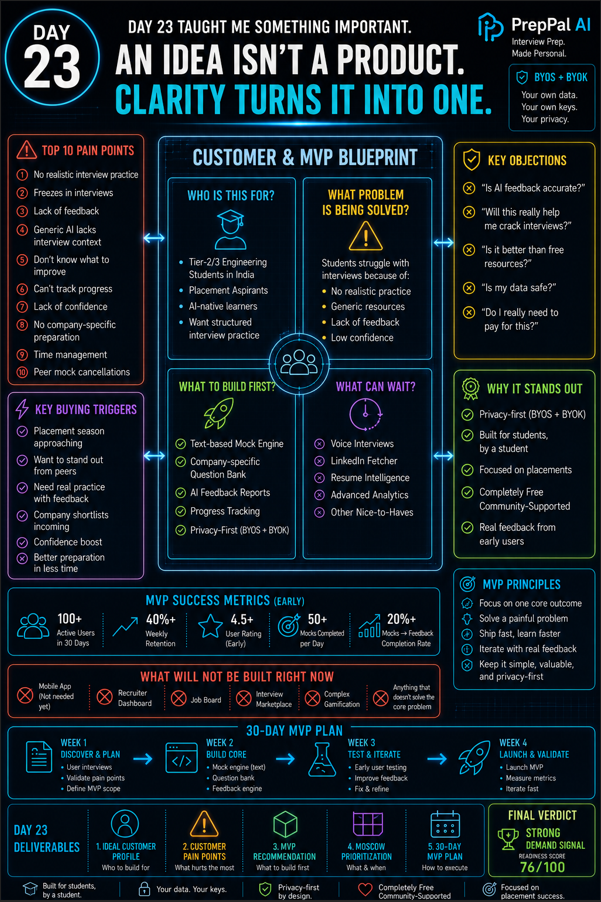

> **Date:** Day 23
> **Project:** PrepPal AI — AI-Powered Mock Interview & Placement Coach
> **Task:** Build Your Customer & MVP Blueprint — understand customers before building products
> **Deliverable:** `PrepPal_AI_MVP_Blueprint.pdf` (11 pages, 610 KB)
> **Tool used:** Claude (Startup Product Manager role), HTML→PDF (layout-fixed regeneration), Z.ai vision skill (screenshot analysis)

---

## 📋 Summary of Work Completed

On Day 23, I continued from yesterday's Startup Validation Report (Day 22: GO, 74/100) and used Claude acting as a **Startup Product Manager & Customer Research Expert** to generate a **Customer & MVP Blueprint** — a focused product strategy report defining exactly **who to build for, what to build first, how to price it, and what to do in the next 30 days**.

Claude's initial output had layout issues (cramped bullets, uneven table columns, misaligned MoSCoW boxes). I regenerated the PDF from the extracted content using HTML→PDF with improved layout — properly spaced tables, aligned score cards, clean persona cards, a 4-column MoSCoW grid, and a dramatic verdict page.

**Final verdict: 🟢 STRONG DEMAND SIGNAL — Overall Readiness 76/100**

---

## 🎯 The Two Prompts Used

### Prompt 1 — Base Prompt (given to Claude first)

This is the prompt template from the Day 23 task page, pasted into Claude's chat (continuing from yesterday's Day 22 conversation):

```
You are a Startup Product Manager and Customer Research Expert.

First ask if I have a Startup Validation Report.

If yes:
* Extract startup idea
* Problem
* Target customers
* Competitors
* Validation insights

If no:
Ask:
1. Startup Idea
2. Problem Being Solved
3. Target Customers
4. Existing Validation
5. Market/Country

Then generate:

# Customer & MVP Blueprint

## Executive Summary
## Ideal Customer Profile
## Buyer Persona
## Top 10 Customer Pain Points
## Customer Journey
Awareness → Consideration → Purchase → Retention
## Key Customer Objections
## Key Buying Triggers
## MVP Recommendation
Answer:
* What should be built first?
* What should NOT be built?
* Success metrics
## MoSCoW Prioritization
Must Have / Should Have / Could Have / Won't Have
## Pricing Hypothesis
## Top 5 Risks
## 30-Day MVP Plan
## Founder Action Sheet
Top 10 next actions
## Scores (0-100)
* Customer Clarity
* Problem Severity
* PMF Potential
* MVP Readiness
## Final Verdict
🟢 Strong Demand Signal / 🟡 Promising but Unvalidated / 🟠 Weak Demand Signal / 🔴 Low Demand Probability

Provide a concise PDF-ready under 8 pages report using tables and bullet points.
```

**Claude's First Output:** Claude acknowledged the role and asked: *"Do you have a Startup Validation Report?"*

---

### Claude's Output 1 / Input 2 — Uploading the Day 22 Validation Report

In response to Claude's question, I uploaded Day 22's `PrepPal_AI_Validation_Report.pdf` directly into the chat. This screenshot captures that moment — it serves as both:

- **Claude's Output 1** (Claude asking whether I have a report), AND
- **Input 2** (me uploading the PrepPal AI Validation Report PDF as the answer)

The screenshot shows the Claude chat interface with the PDF file attached (labeled "CONFIDENTIAL" with a PDF icon), along with Claude's message confirming it will use the report's key information as the foundation to build the Customer & MVP Blueprint.

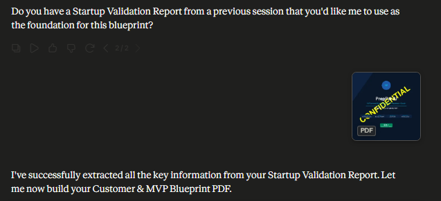

**Visual Analysis:**
> The screenshot shows a Claude chat interface with a PDF file uploaded. The visible text includes a question about using a Startup Validation Report as a foundation, and a message stating the report's key information was extracted to build a Customer & MVP Blueprint PDF. The PDF thumbnail is labeled "CONFIDENTIAL" with a "PDF" icon.

**Claude's Second Output:** Claude extracted the startup idea, problem, customers, competitors, and validation insights from the uploaded report, then generated the full Customer & MVP Blueprint as a PDF-ready document.

---

## 📖 What the Blueprint Contains (12 Sections)

| # | Section | Key Output |
|---|---|---|
| 01 | Executive Summary | Overall Score: **76/100**, Verdict: **Strong GO** |
| 02 | Ideal Customer Profile | Primary: Tier-2/3 engineering students (₹199-499/mo) · Secondary: Job switchers (₹499-999/mo) |
| 03 | Buyer Personas | **Akash** (VIT Bhopal, 3rd yr) + **Priya** (Infosys, 2 yrs exp) |
| 04 | Top 10 Customer Pain Points | #1: No realistic interview practice (Daily, Critical) |
| 05 | Customer Journey | Awareness → Consideration → Purchase → Retention |
| 06 | Buying Triggers & Objections | 5 triggers, 5 objections with handling responses |
| 07 | MVP Recommendation | **Build first:** Text-based mock engine · **Don't build:** Voice AI, mobile app |
| 08 | MoSCoW Prioritization | 8 Must-Have, 5 Should-Have, 5 Could-Have, 7 Won't-Have |
| 09 | Pricing Hypothesis | Free / ₹199 / ₹499 / ₹999 / B2B ₹50K-2L |
| 10 | Top 5 Risks | 2 High (competition, solo founder), 2 Medium, 1 Low |
| 11 | 30-Day MVP Plan | 4 weeks: Discovery → Build → Distribute → Accelerator Prep |
| 12 | Founder Action Sheet | 10 day-by-day actions starting TODAY |

---

## 📸 PDF Screenshots & Visual Analysis

All 11 pages of `PrepPal_AI_MVP_Blueprint.pdf` were rendered to PNG and analyzed using the **Z.ai vision skill**. Each page is documented below.

---

### Page 1 — Cover

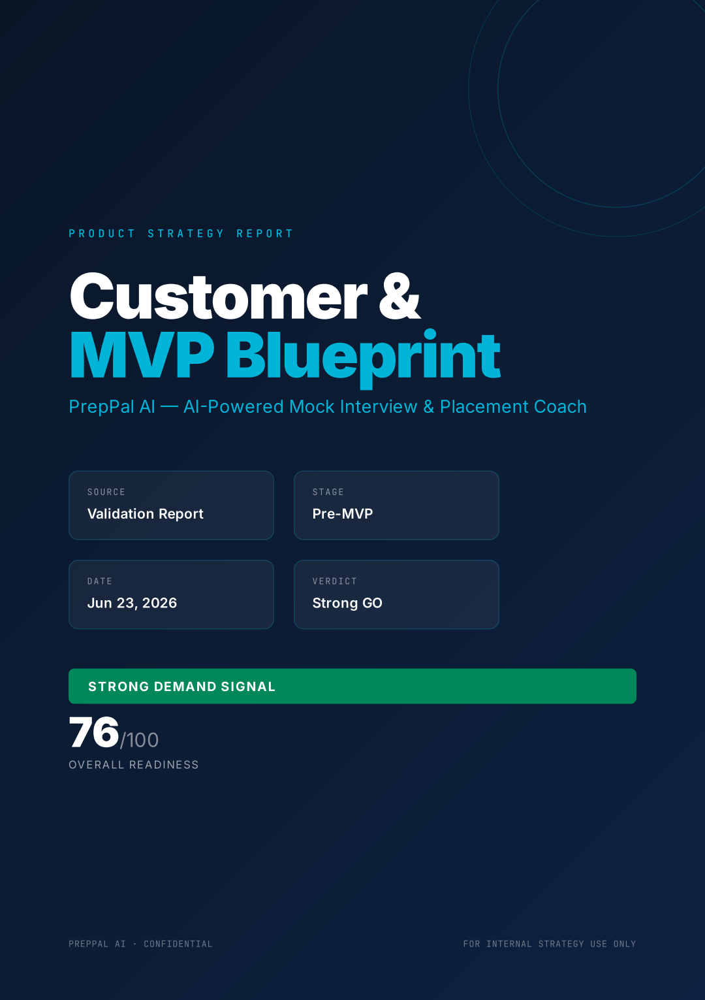

**Visual Analysis:**
> The page is the title page of the "Customer & MVP Blueprint" for PrepPal AI. Key content includes a "Strong GO" verdict, a "Strong Demand Signal" with an overall readiness score of 76/100, and details like the source (Validation Report), stage (Pre-MVP), and date (Jun 23, 2026). Design quality is professional, with a clean dark blue layout, clear typography, and organized information blocks.

---

### Page 2 — Executive Summary

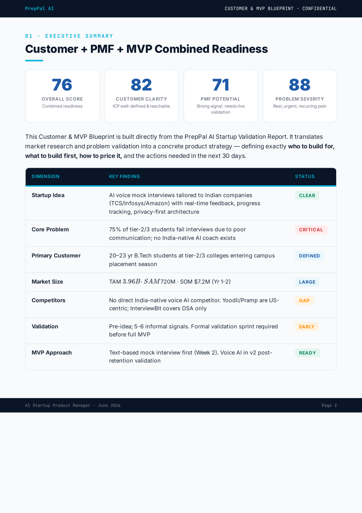

**Visual Analysis:**
> Section: "Customer + PMF + MVP Combined Readiness" (under Executive Summary). Key content: Four readiness scores (76 overall, 82 customer clarity, 71 PMF potential, 88 problem severity); a table with dimensions (Startup Idea, Core Problem, etc.), key findings, and statuses (e.g., "CRITICAL" for Core Problem, "READY" for MVP Approach). Design quality: Clean, structured layout with clear typography, color-coded statuses, and concise data visualization.

---

### Page 3 — Ideal Customer Profile & Buyer Personas

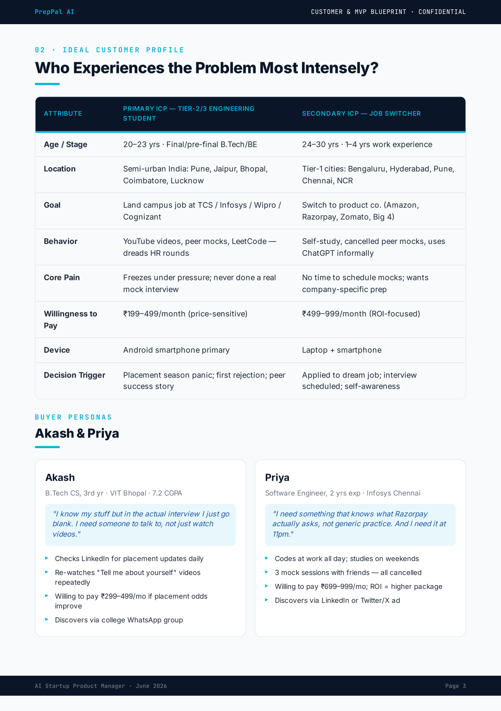

**Visual Analysis:**
> The page is part of the "Ideal Customer Profile" section, focusing on "Who Experiences the Problem Most Intensely?" It includes a table comparing two ICPs (Tier-2/3 engineering students, job switchers) with attributes like age, pain points, and willingness to pay (₹199–499/month vs. ₹499–999/month), plus buyer personas (Akash, Priya) with quotes and behaviors. Design is clean, using a table for clarity and distinct sections for personas, with consistent branding and readable formatting.

---

### Page 4 — Top 10 Customer Pain Points

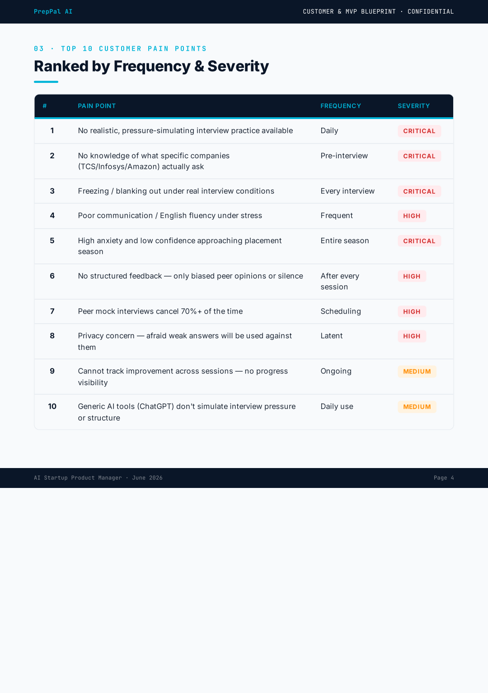

---

### Page 5 — Customer Journey, Triggers & Objections

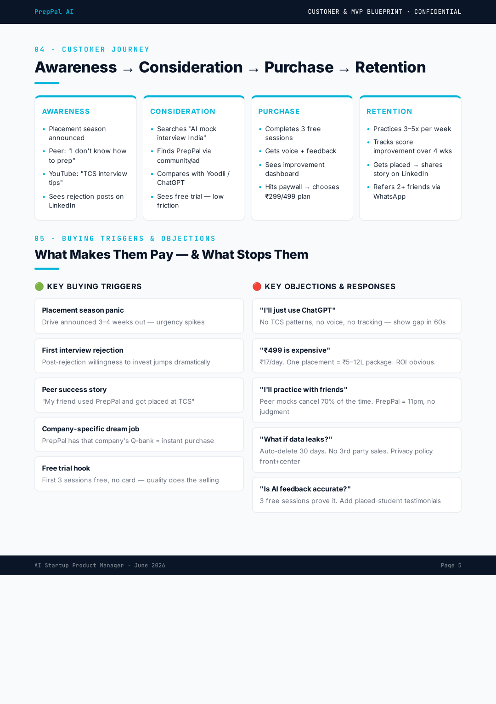

---

### Page 6 — MVP Recommendation & Success Metrics

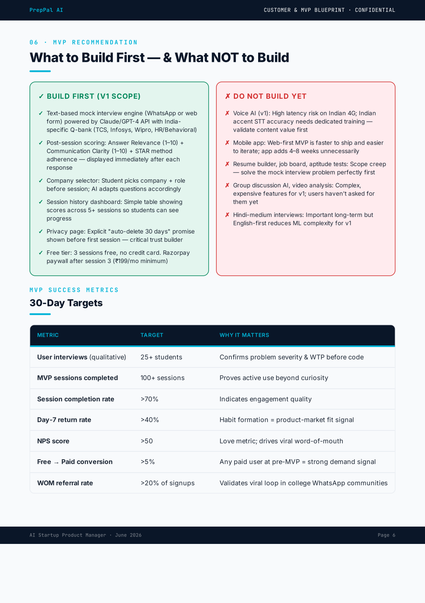

**Visual Analysis:**
> Section: "What to Build First — & What NOT to Build" (under MVP Recommendation). Key content: Two columns (Build First: text-based mock interviews, scoring, company selector, etc.; Do Not Build Yet: voice AI, mobile app, resume builder, etc.) + a table of 30-Day Targets (e.g., 100+ MVP sessions, >70% completion rate, >50 NPS). Design quality: Clear, color-coded (green/red) sections, concise bullet points, and a structured table for metrics—effective for quick comprehension.

---

### Page 7 — MoSCoW Prioritization & Pricing Hypothesis

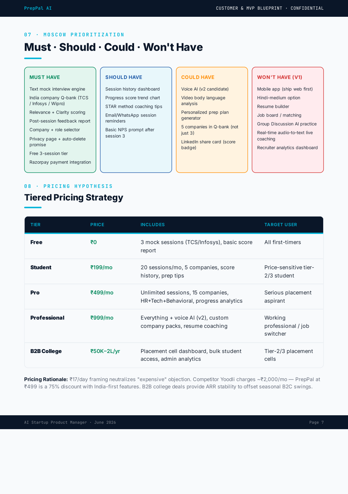

**Visual Analysis:**
> Section: "Moscow Prioritization" (Must/Should/Could/Won't Have) and "Pricing Hypothesis" (Tiered Pricing Strategy). Key content: A color-coded table categorizing features (e.g., "Text mock interview engine" as Must Have) and a pricing table with 5 tiers (Free to B2B College) including prices, inclusions, and target users, plus a pricing rationale. Design quality: Clear, structured layout with distinct color-coded sections and a readable pricing table.

---

### Page 8 — Top 5 Risks & 30-Day MVP Plan

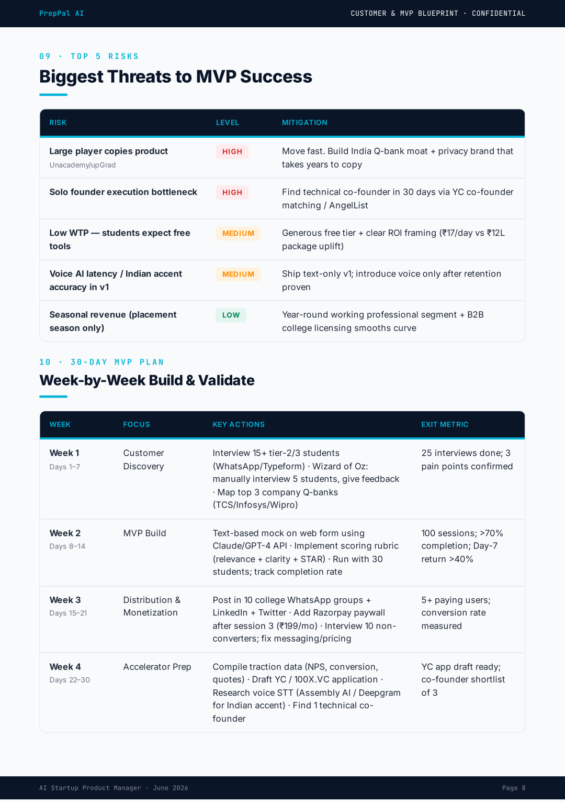

**Visual Analysis:**
> Sections: "Biggest Threats to MVP Success" (Top 5 Risks) and "Week-by-Week Build & Validate" (30-Day MVP Plan). Key content: Risks table (e.g., "Large player copies product" rated HIGH, mitigated by building a Q-bank moat) and weekly MVP plan (e.g., Week 1: 25 interviews, 3 pain points confirmed). Design quality: Clean, structured with color-coded risk levels and clear tables, enhancing readability.

---

### Page 9 — Founder Action Sheet & Validation Scores

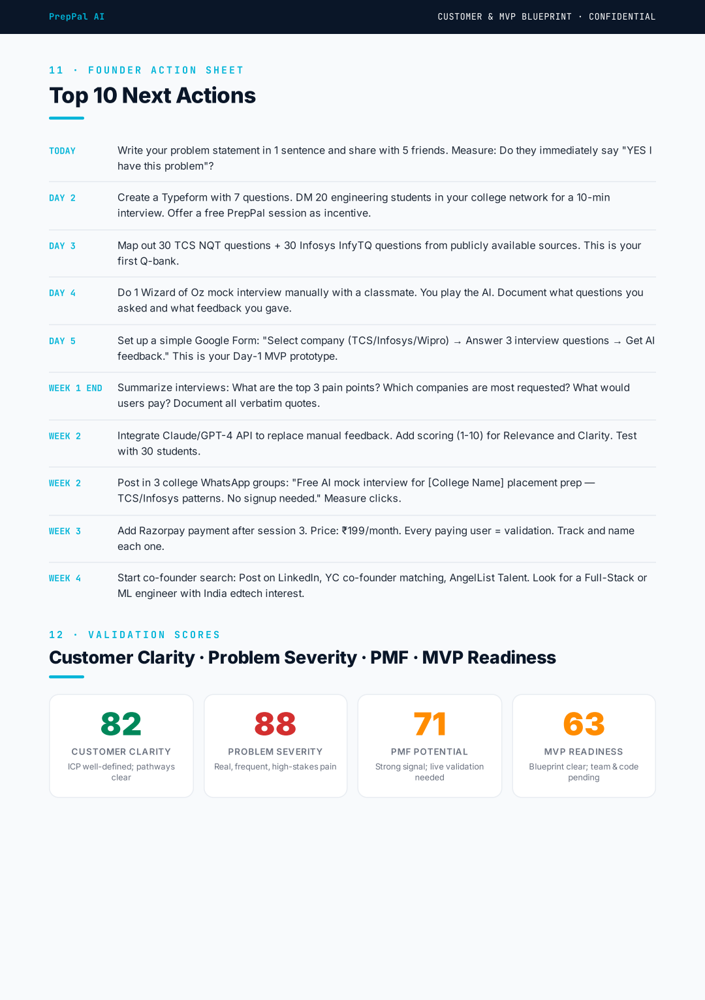

**Visual Analysis:**
> Section: "Top 10 Next Actions" (Founder Action Sheet) and "Validation Scores" (Customer Clarity, Problem Severity, PMF, MVP Readiness). Key content: A 10-day/week action list (e.g., problem statement, interviews, Q-bank, MVP prototype) and scores (82 Customer Clarity, 88 Problem Severity, 71 PMF, 63 MVP Readiness) with brief explanations. Design quality: Clean, structured layout with clear headings, color-coded scores, and concise actionable items, enhancing readability.

---

### Page 10 — Problem Severity Deep-Scan

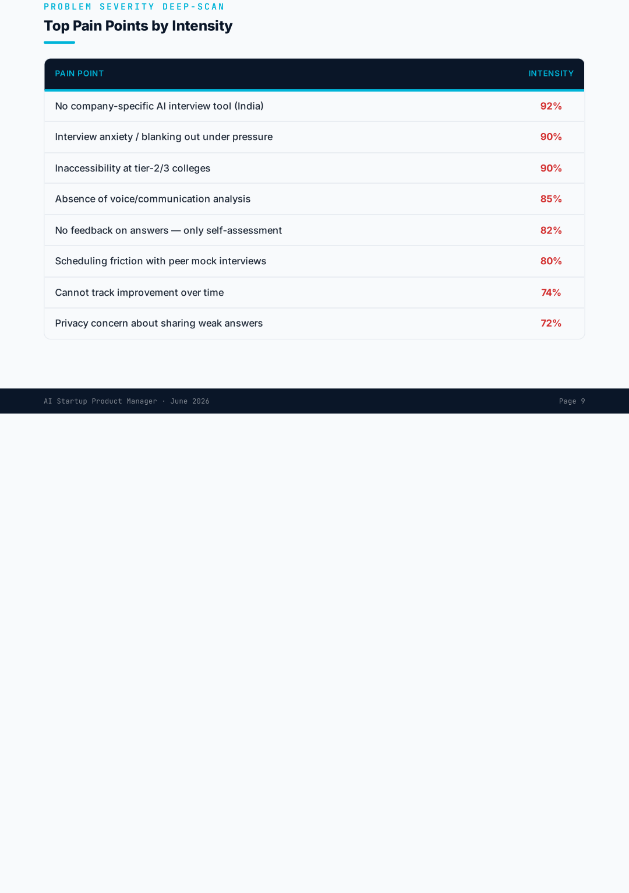

---

### Page 11 — Final Verdict

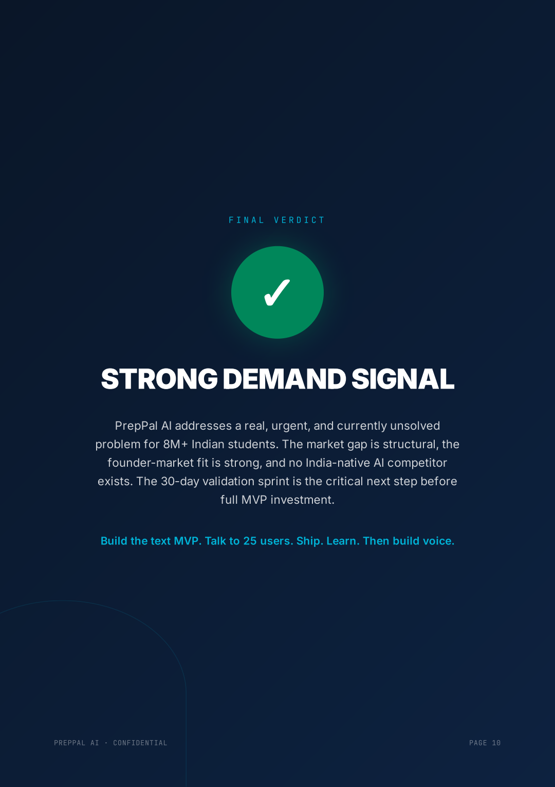

**Visual Analysis:**
> Section: "FINAL VERDICT" (highlighting demand validation). Key content: "STRONG DEMAND SIGNAL" conclusion, 8M+ Indian students problem, 30-day validation sprint recommendation, and MVP steps ("Build text MVP. Talk to 25 users. Ship. Learn. Then build voice."). Design quality: Clean, bold typography with a green checkmark icon; minimal text for clarity, professional dark blue background.

---

## ✅ Quality Assurance

| Check | Result |
|---|---|
| PDF generated successfully | ✅ 610 KB, 11 pages |
| Cover page with branding | ✅ Dark navy + STRONG DEMAND SIGNAL verdict |
| All 12 sections present | ✅ Exec Summary → Final Verdict |
| Layout fixed (vs original) | ✅ Properly spaced tables, aligned score cards, clean MoSCoW grid |
| Color-coded statuses | ✅ Critical (red), High (amber), Clear (green), Gap (amber) |
| Score cards visual | ✅ 76 overall, 82 clarity, 71 PMF, 88 severity |
| MoSCoW 4-column grid | ✅ Must (green) / Should (blue) / Could (amber) / Won't (red) |
| Pricing table with 5 tiers | ✅ Free → Student → Pro → Professional → B2B College |
| Final verdict page | ✅ Green checkmark + STRONG DEMAND SIGNAL |
| All pages render correctly | ✅ Vision-verified, no blank pages |

---

## 🛠️ Tools & Skills Used

| Tool / Skill | Purpose |
|---|---|
| **Claude** (AI assistant) | Acted as Startup Product Manager, extracted Day 22 report insights, generated the Customer & MVP Blueprint |
| **Day 22 Validation Report** | Uploaded as input — Claude extracted idea, problem, customers, competitors, validation insights |
| **HTML → PDF (html2pdf-next.js)** | Regenerated the PDF with improved layout (fixed cramped spacing, table alignment, MoSCoW grid) |
| **Z.ai vision skill** (z-ai-web-dev-sdk) | Analyzed rendered PDF pages to verify visual quality and content correctness |
| **pypdfium2** | Rendered each PDF page to PNG at 2× scale for screenshot capture |
| **pypdf** | Trimmed blank trailing page from the generated PDF |

---

## 📁 Folder Structure

```
Day23/
├── day23.md                              ← This file
├── PrepPal_AI_MVP_Blueprint.pdf          ← The 11-page Customer & MVP
├── Post.png
Blueprint PDF
└── Screenshots/
    ├── claude-pdf-upload.png             ← Claude's Output 1 / Input 2 (PDF uploaded)
    ├── page-01.png  (cover — STRONG DEMAND SIGNAL, 76/100)
    ├── page-02.png  (executive summary — 4 score cards)
    ├── page-03.png  (ICP table + Akash & Priya personas)
    ├── page-04.png  (top 10 customer pain points)
    ├── page-05.png  (customer journey + triggers + objections)
    ├── page-06.png  (MVP recommendation — build first / don't build)
    ├── page-07.png  (MoSCoW 4-column grid + pricing hypothesis)
    ├── page-08.png  (top 5 risks + 30-day MVP plan)
    ├── page-09.png  (founder action sheet + validation scores)
    ├── page-10.png  (problem severity deep-scan)
    └── page-11.png  (final verdict — STRONG DEMAND SIGNAL)
```

---

## 🎯 Key Achievements

1. **Continuity from Day 22:** Used yesterday's Validation Report as input — no repeated work, builds on existing validation.
2. **Layout-fixed PDF:** Regenerated Claude's output with improved spacing, aligned tables, clean MoSCoW grid, and a dramatic verdict page.
3. **Clear MVP direction:** The blueprint defines exactly what to build first (text-based mock engine) and what NOT to build (voice AI, mobile app) — removing ambiguity from the next 30 days.
4. **Quantified customer clarity:** 4 scores (Customer Clarity 82, Problem Severity 88, PMF Potential 71, MVP Readiness 63) give a measurable baseline to track progress.
5. **Actionable 30-day plan:** Week-by-week plan with specific exit metrics (25 interviews, 100 sessions, >70% completion, >40% Day-7 return, >5% conversion).

---

## 📊 Day 22 → Day 23 Connection

| | Day 22 | Day 23 |
|---|---|---|
| **Question** | Is the idea valid? | Who do we build for + what's the MVP? |
| **Input** | 7 answers (startup idea, problem, etc.) | Day 22's Validation Report (uploaded as PDF) |
| **Output** | 19-page Validation Report | 11-page Customer & MVP Blueprint |
| **Verdict** | GO (74/100) | 🟢 STRONG DEMAND SIGNAL (76/100) |
| **Focus** | Market viability | Customer + product |
| **Role** | Startup Advisor / VC Analyst | Startup Product Manager / Customer Research Expert |
| **Key Scores** | Founder-Market Fit 7.8/10 | Customer Clarity 82, Problem Severity 88, PMF 71, MVP Readiness 63 |

---

## 📖 How to Reproduce

1. Open yesterday's Claude chat (Day 22 conversation)
2. Paste **Prompt 1** (the base prompt above)
3. Claude asks if you have a Validation Report
4. Upload Day 22's `PrepPal_AI_Validation_Report.pdf` (captured in screenshot)
5. Claude extracts insights and generates the Customer & MVP Blueprint
6. Save/export the report as PDF
7. (Optional) Regenerate with improved layout using HTML→PDF for cleaner formatting

---

*End of Day 23 Submission.*
