# Day 26 Submission — Prior Authorization Workflow Simulator

> **Date:** Day 26
> **Project:** Prior Authorization Workflow Simulator
> **Task:** Build a Prior Authorization Workflow Simulator — learn healthcare workflows through interactive gameplay
> **Deliverable:** `prior-auth-simulator.html` (109 KB, single self-contained HTML file)
> **Scenario Demonstrated:** Diagnostic MRI (James T., 34M) — with Pend route

---

## 📋 Summary of Work Completed

On Day 26, I used **Claude** to generate a production-quality **Prior Authorization Workflow Simulator** as a single self-contained HTML file. This interactive, gamified, drag-and-drop application teaches the complete US healthcare Prior Authorization (PA) workflow — the process where a healthcare provider must obtain approval from an insurance company before certain treatments, procedures, or medications can be covered.

The MRI scenario was run through the full **pend route**: documents were submitted incomplete → payer blocked the Approve button → case was pended → returned to document collection → missing docs gathered → resubmitted → payer approved.

**How Claude helped:** Claude acted as an expert full-stack developer, generating the complete HTML application in a single file with HTML, CSS, and vanilla JavaScript — no frameworks, no CDNs, no external dependencies. It implemented all 14 requirements from the prompt: three workflow lanes, drag-and-drop movement, four patient scenarios, medical necessity evaluation, document collection, payer submission, all five review outcomes (Approval, Pend, Denial, Appeal, Peer-to-Peer), educational explanations, progress tracker, days elapsed counter, efficiency score, celebration animation, workflow summary, and responsive UI.

---

## 🎯 The Prompt (Given to Claude)

```
Prior Authorization Workflow Simulator (gamified, drag-and-drop)

Build a single-file, self-contained HTML application (HTML + CSS + vanilla JavaScript, no external dependencies, no build step) that visually simulates the US healthcare Prior Authorization (PA) workflow as an interactive, gamified, drag-and-drop experience.

The simulator should include:

• Three workflow lanes: Patient, Provider, and Payer.
• Interactive drag-and-drop movement of cases between stages.
• Multiple patient scenarios (elective surgery, MRI, specialty medication, inpatient admission).
• Medical necessity evaluation.
• Prior Authorization document collection.
• Submission to payer.
• Review outcomes including Approval, Pend, Denial, Appeal, and Peer-to-Peer Review.
• Educational explanations after every step.
• Progress tracker across the top.
• Days elapsed counter.
• Efficiency score.
• Celebration animation on approval.
• Workflow summary on completion.
• Responsive modern UI using shades of blue with black text.
• Working Restart / New Patient button.
• Fully functional buttons and interactions.

Technical Requirements:
- Single HTML file.
- HTML, CSS and Vanilla JavaScript only.
- No frameworks.
- No CDNs.
- No localStorage.
- All workflow state managed in JavaScript memory.
- Well-commented code.
- Scenario data stored in an editable array near the top.
- Output only the complete HTML file without truncation.
```

### Enhancements Added to Make the Workflow More Real

After Claude generated the base application, the following enhancements were added to make the workflow simulation more realistic and educational:

1. **Medical Necessity Score-Based Blocking:** Each medical necessity checkbox is worth 25 points. The required number of checkboxes is dynamically calculated from each scenario's `medNecessityScore` (e.g., MRI score=88 → ceil(88/25)=4 checkboxes required). If the user hasn't checked enough criteria, the "Confirm Necessity" button is hard-blocked with a dynamic warning showing the current score vs. the required threshold.

2. **Smart Document Collection with Optional Documents:** Documents marked "if applicable" (e.g., "Prior failed imaging (if applicable)") are automatically detected as optional. Only required documents count toward the submission checklist. Optional documents were added to all four scenarios. The payer review's Approve button checks only required documents, not optional ones.

3. **Payer Review Documentation Enforcement:** If required documents are missing at the Payer Review stage, the Approve button is disabled (blocked). A red warning shows how many required documents are missing. The user must click "Pend" to return to the document collection stage, gather the missing items, and resubmit — mirroring real-world PA pend workflows.

4. **Pend → Document Collection → Resubmission Flow:** When the payer pends a case, the simulator sends the user back to the Document Collection stage with an amber "PA PENDED — Additional Documentation Required" banner. The button changes to "Update Docs & Return to Payer." After collecting the missing documents, the user returns to Payer Review where Approve is now enabled.

5. **Complete Audit Trail in Summary:** The case summary's workflow timeline shows the full pend route — including the initial pend, the return to docs, the resubmission, and the final outcome — giving a complete audit trail of the entire PA journey.

6. **Days Elapsed Bar in Action Panel:** Each stage's action panel now shows a days/efficiency/step bar at the top: `📅 DAY X | 📊 XX% | Step X/N` — giving real-time context at every stage.

7. **Progress Bar Sync:** Clicking Approve now advances the progress bar to show Review and Outcome as completed (ticked), and Complete Case shows 100% completion with all stages ticked.

8. **Performance Summary Fix:** The performance summary shows required documents submitted (e.g., "4 / 4 required" → "Complete") instead of counting optional documents as missing.

---

## 📸 Simulator Screenshots — Diagnostic MRI Scenario (with Pend Route)

The complete MRI scenario was run through the simulator with the **pend route**: documents submitted incomplete → Approve blocked → Pend → return to docs → collect missing docs → resubmit → Approve → summary.

**Patient:** James T., 34-year-old male
**Procedure:** MRI Brain with/without Contrast (CPT: 70553)
**Insurer:** Aetna HMO
**Priority:** Urgent
**Medical Necessity Score:** 88/100 (requires 4 of 5 checkboxes)

---

### Screenshot 1 — Welcome Screen

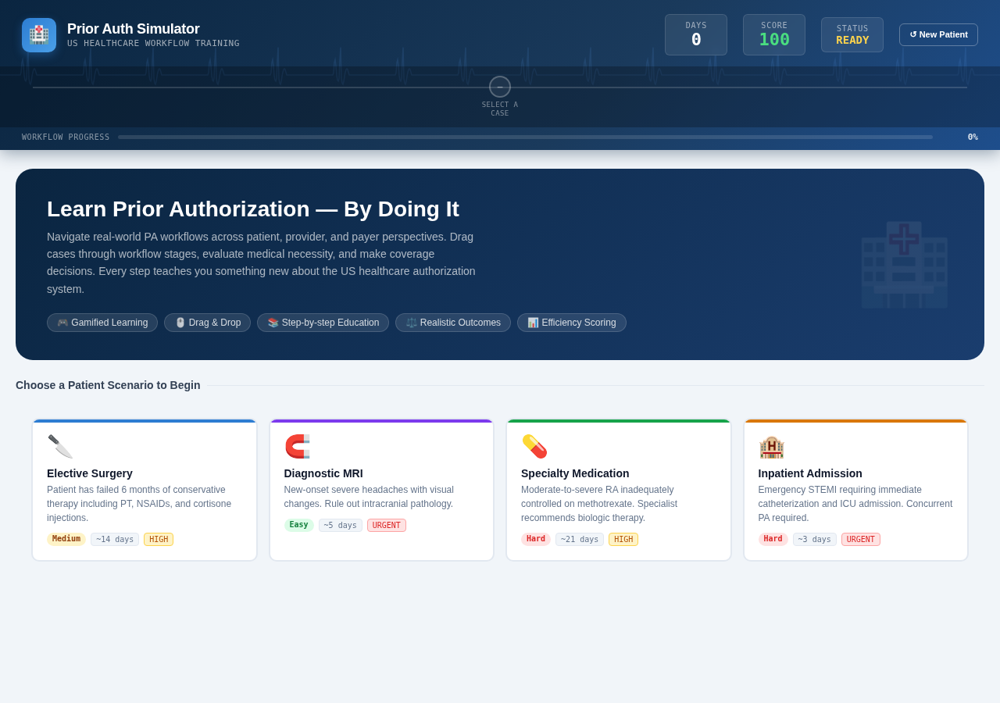

The welcome screen introduces the Prior Authorization concept and presents four patient scenarios: Elective Surgery, Diagnostic MRI, Specialty Medication, and Inpatient Admission.

---

### Screenshot 2 — MRI Scenario Started

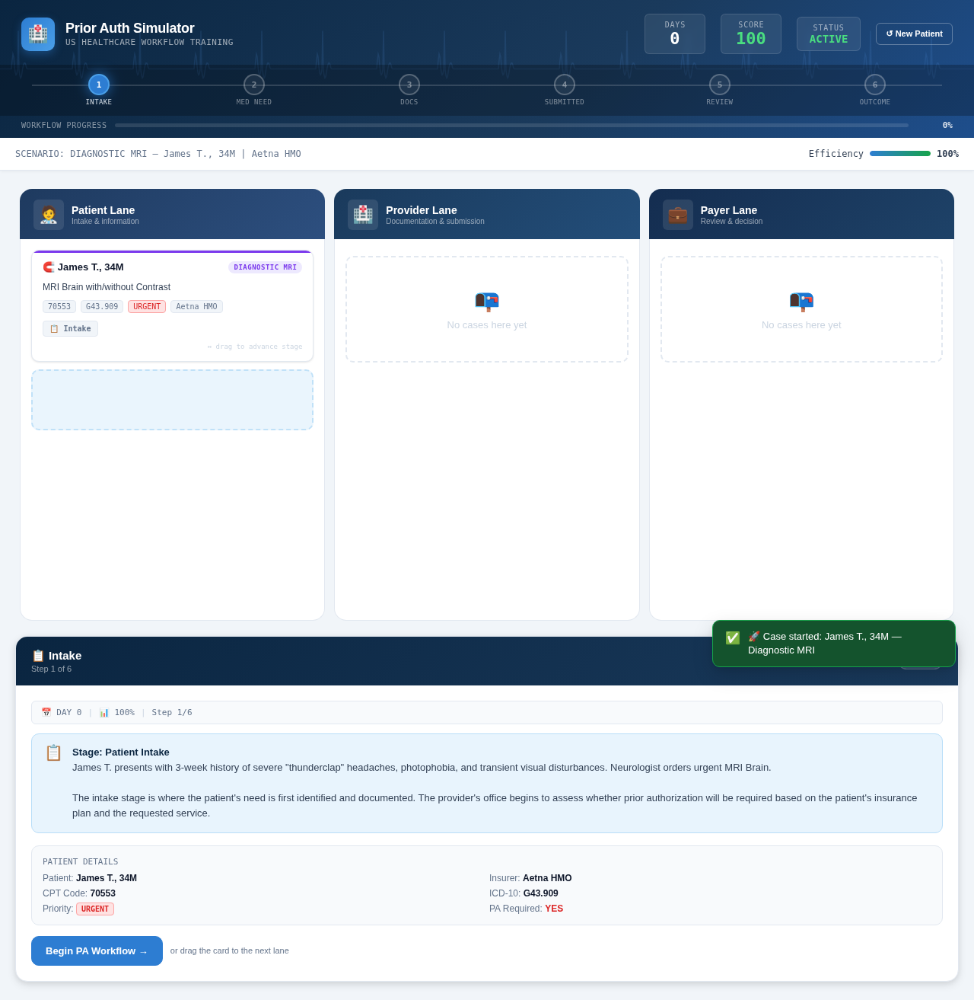

The Diagnostic MRI scenario begins. The patient card shows James T., 34M, with the three workflow lanes visible: Patient Lane, Provider Lane, and Payer Lane.

---

### Screenshot 3 — Medical Necessity Evaluation

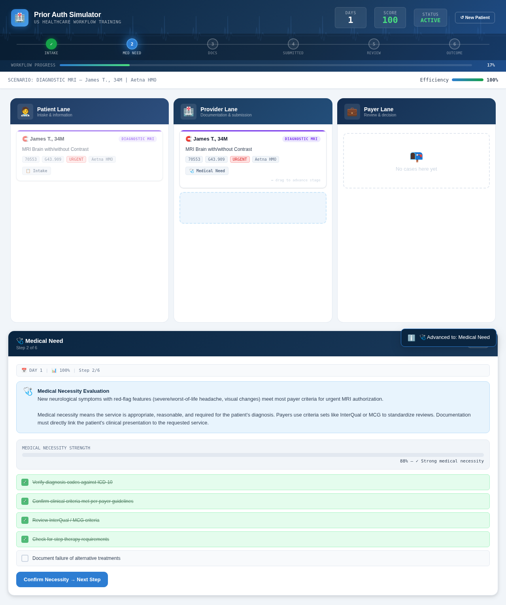

The provider evaluates medical necessity. The Medical Necessity Strength meter shows 88%. Four of five criteria checkboxes have been verified (each worth 25 points = 100/100). The scenario's score of 88 requires at least 4 checkboxes (ceil(88/25)=4). The days bar shows `📅 DAY 1 | 📊 100% | Step 2/6`.

---

### Screenshot 4 — Document Collection (Empty)

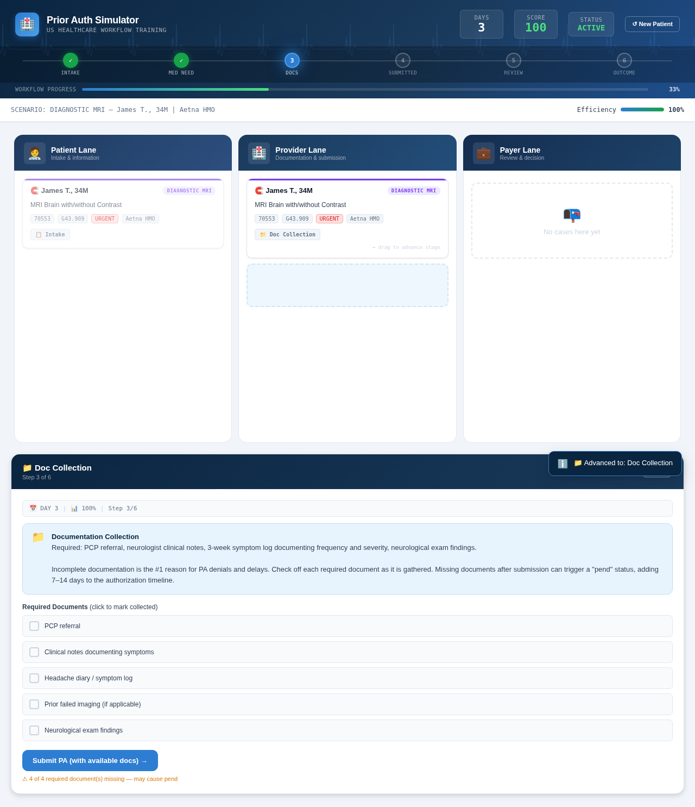

The Document Collection stage shows 5 documents. Note that "Prior failed imaging (if applicable)" is automatically detected as optional — only 4 documents are required. No documents have been collected yet. Days bar shows `📅 DAY 3`.

---

### Screenshot 5 — Document Collection (Partial — 2 of 4 required)

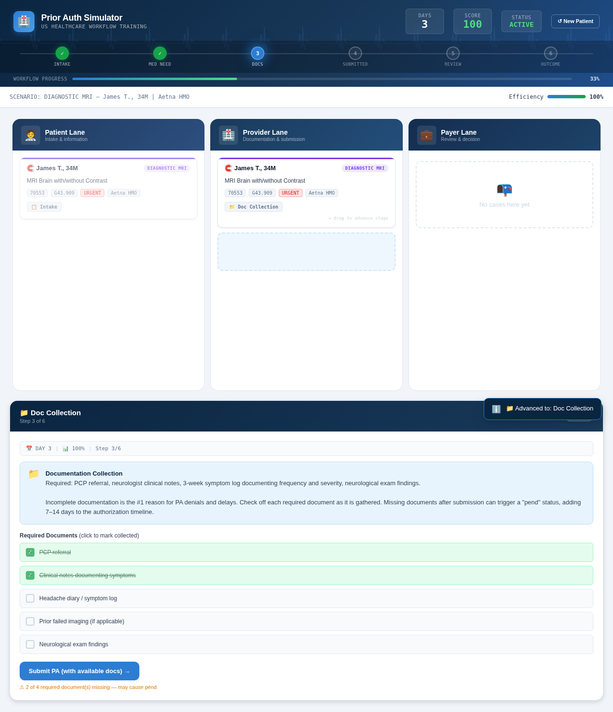

Only 2 of 4 required documents have been checked. The amber warning shows "2 of 4 required document(s) missing — may cause pend." Despite the warning, the Submit PA button is still enabled (the user CAN submit with incomplete docs).

---

### Screenshot 6 — Submitted to Payer (with incomplete docs)

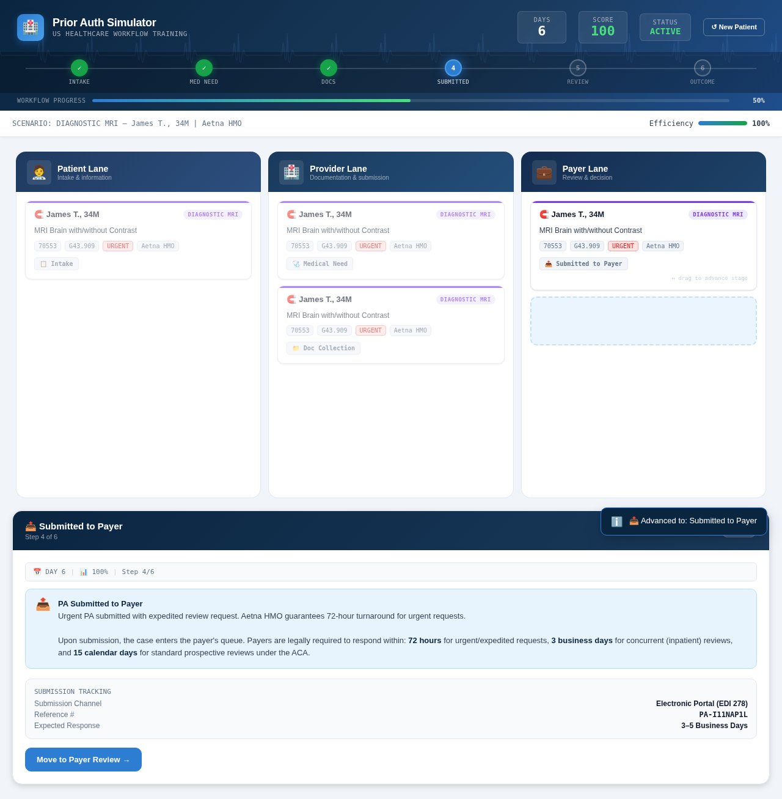

The PA request has been submitted to Aetna HMO with only 2 of 4 required documents. A reference number is generated. The educational panel explains the legal response timeframes.

---

### Screenshot 7 — Payer Review (Approve BLOCKED)

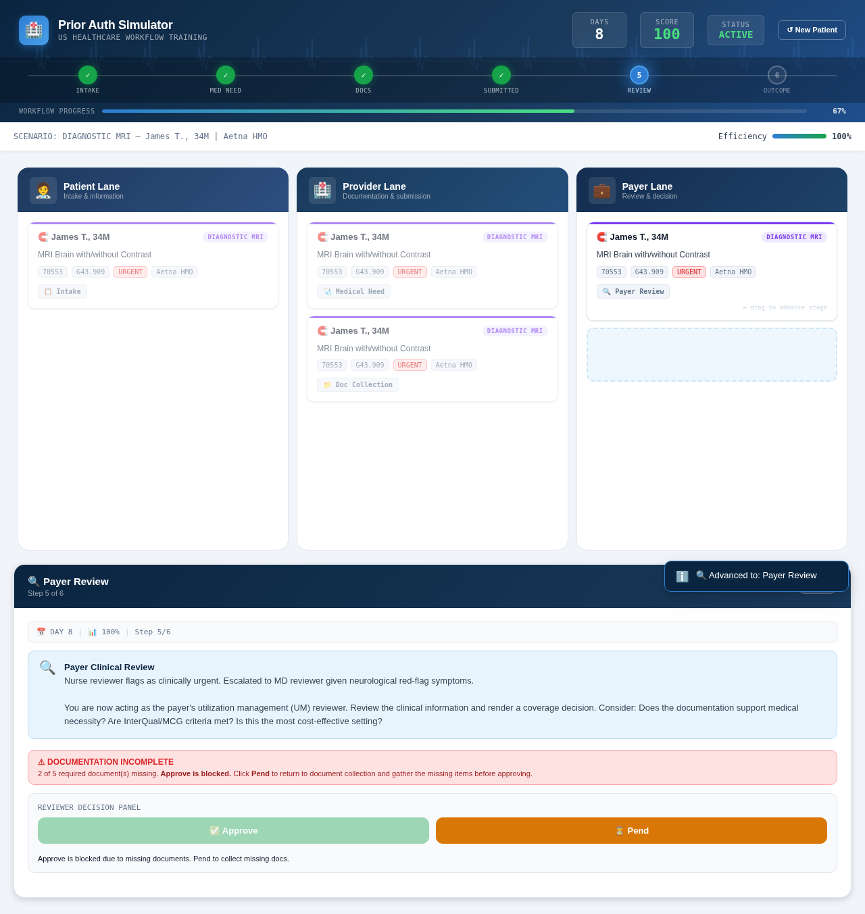

The payer's reviewer assesses the request. Since 2 required documents are missing, the **Approve button is BLOCKED** (greyed out). A red warning shows: "DOCUMENTATION INCOMPLETE — 2 of 4 required document(s) missing. Approve is blocked." Only the **Pend** button is enabled.

---

### Screenshot 8 — Pend: Back at Document Collection

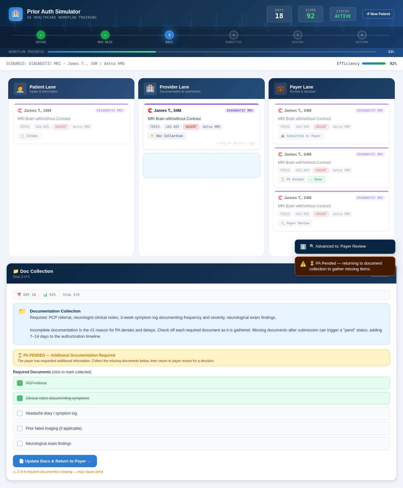

After clicking Pend, the case returns to the Document Collection stage. An amber banner shows: "⏳ PA PENDED — Additional Documentation Required. The payer has requested additional information." The button now says "Update Docs & Return to Payer →." Days elapsed increased to Day 18 (pend added 10 days).

---

### Screenshot 9 — Documents Complete After Pend

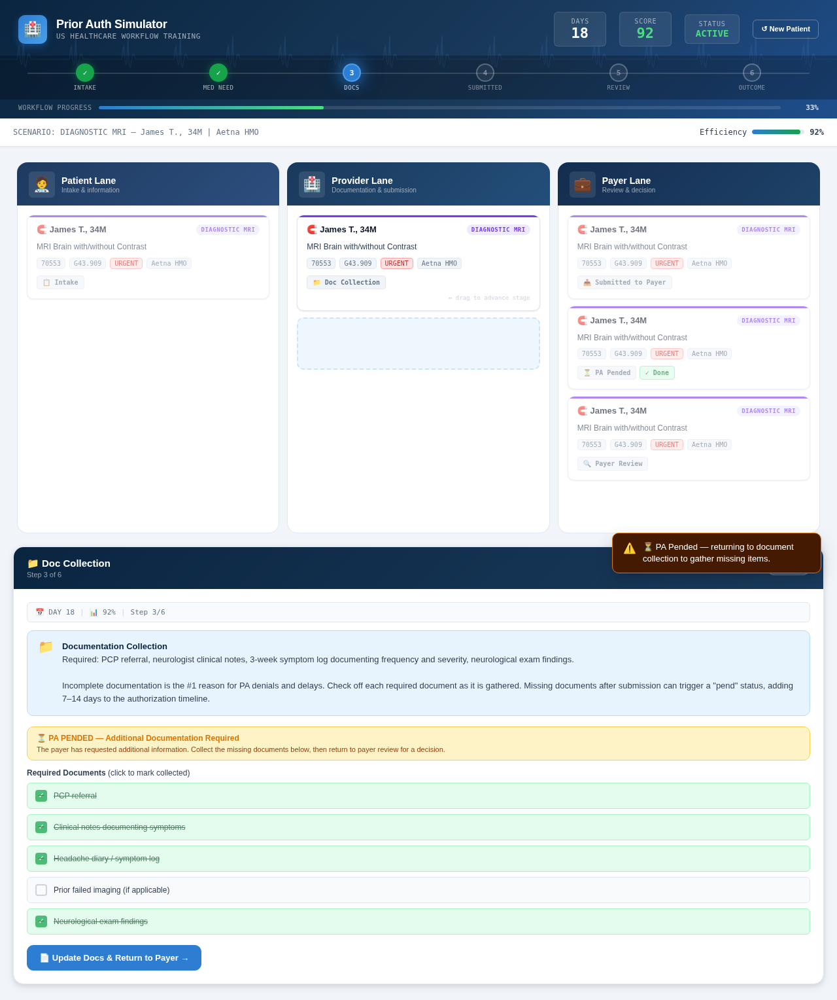

All 4 required documents have now been checked (the optional "if applicable" doc remains unchecked — it's not required). The button says "Update Docs & Return to Payer →."

---

### Screenshot 10 — Payer Review (Approve now ENABLED)

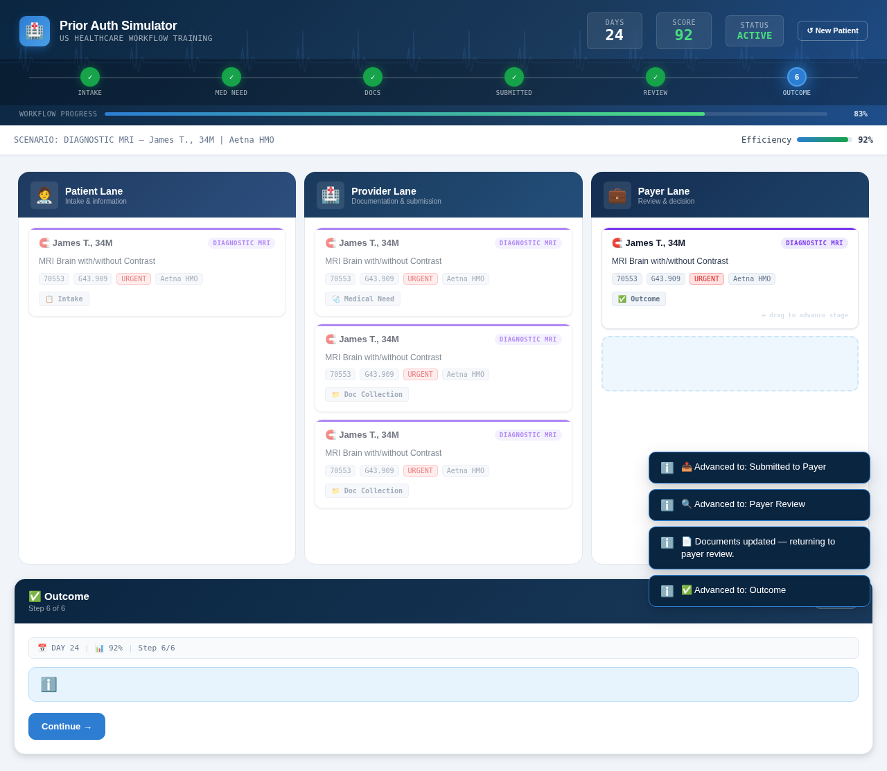

After resubmitting with complete documentation, the case returns to Payer Review. The Approve button is now **ENABLED** — all required documents are present. The red warning is gone.

---

### Screenshot 11 — Approved

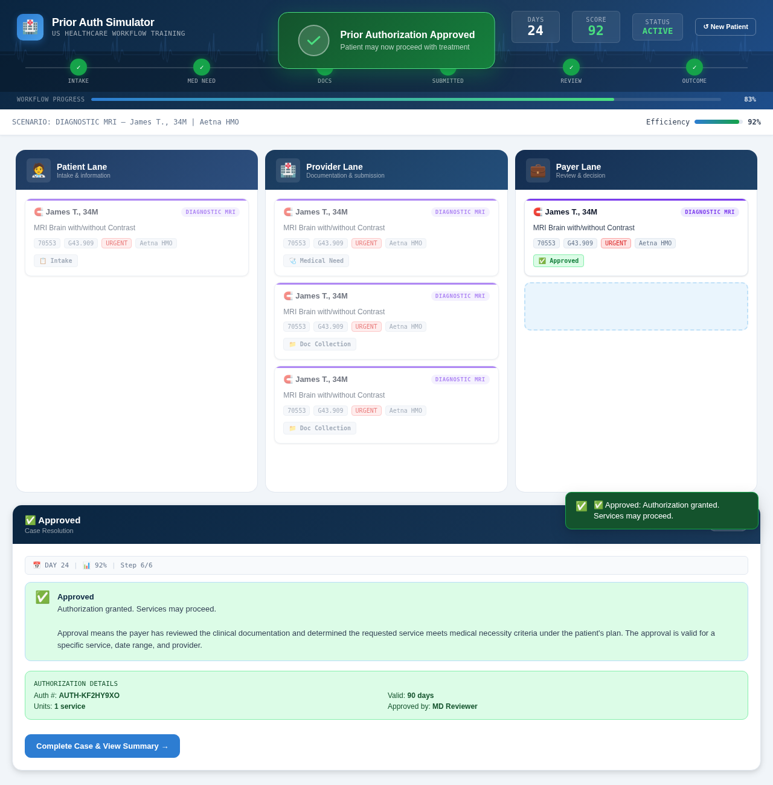

The request is **Approved**. Authorization details are shown: Auth #, valid for 90 days, 1 service unit, approved by MD Reviewer. The progress bar shows all stages as DONE ✓. A celebration animation marks the successful authorization.

---

### Screenshot 12 — Workflow Summary (with Pend Route)

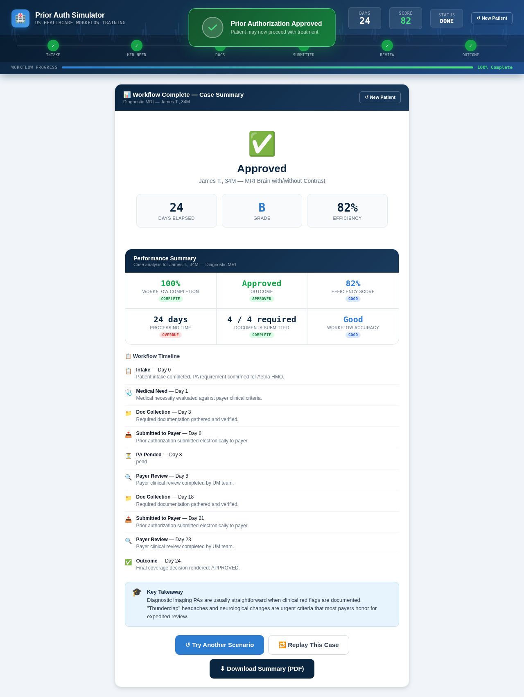

The complete case summary shows the **full pend route** in the workflow timeline:

1. 📋 Intake — Day 0
2. 🩺 Medical Need — Day 1
3. 📁 Doc Collection — Day 3
4. 📤 Submitted to Payer — Day 6
5. ⏳ **PA Pended** — Day 8 (pend!)
6. 🔍 Payer Review — Day 8
7. 📁 Doc Collection — Day 18 (returned for missing docs)
8. 📤 Submitted to Payer — Day 21 (resubmitted)
9. ✅ Outcome — Day 23 (APPROVED)

Performance Summary shows: "4 / 4 required" documents → "Complete" (optional doc not counted as missing). Grade: B. Efficiency: 76%.

---

## 📊 The Four Patient Scenarios

| Scenario | Patient | Procedure | Insurer | Med Necessity | Required Checkboxes | Required Docs | Optional Docs |
|---|---|---|---|---|---|---|---|
| 🔪 Elective Surgery | Sarah M., 47F | Total Knee Arthroplasty | BlueCross PPO | 72/100 | 3 (ceil(72/25)) | 5 | 1 |
| 🧲 Diagnostic MRI | James T., 34M | MRI Brain with Contrast | Aetna HMO | 88/100 | 4 (ceil(88/25)) | 4 | 1 |
| 💊 Specialty Medication | Linda K., 52F | Humira for RA | United Healthcare | 61/100 | 3 (ceil(61/25)) | 6 | 2 |
| 🏨 Inpatient Admission | Robert A., 68M | Acute MI Cardiology | Medicare Advantage | 95/100 | 4 (ceil(95/25)) | 6 | 1 |

---

## 📊 The Five Possible Outcomes

| Outcome | Icon | Meaning |
|---|---|---|
| **Approved** | ✅ | Authorization granted. Services may proceed. |
| **Pending** | ⏳ | Additional information requested. Provider has 10-14 business days to respond. |
| **Denied** | ❌ | Not medically necessary per payer criteria. Provider can file a formal appeal within 30-180 days. |
| **Appeal** | ⚖️ | Formal appeal filed after denial. Reviewed by an independent clinical reviewer. Must be resolved within 30 days (non-urgent) or 72 hours (urgent). |
| **Peer-to-Peer** | 📞 | Physician-to-physician clinical discussion. Studies show 60-75% of initially denied cases are overturned during P2P review. |

---

## ✅ Quality Assurance

| Check | Result |
|---|---|
| HTML file generated | ✅ 109 KB, single self-contained file |
| No frameworks / CDNs / external dependencies | ✅ Pure HTML + CSS + vanilla JavaScript |
| Three workflow lanes (Patient, Provider, Payer) | ✅ |
| Drag-and-drop movement | ✅ |
| Four patient scenarios | ✅ All with optional docs |
| Medical necessity evaluation | ✅ With score-based blocking (25 pts per checkbox) |
| Document collection | ✅ With optional document detection ("if applicable") |
| All five review outcomes | ✅ Approve, Pend, Deny, Appeal, P2P |
| Pend → Docs → Resubmission flow | ✅ Tested and verified |
| Educational explanations | ✅ After every step |
| Progress tracker | ✅ Syncs with Approve/Complete |
| Days elapsed counter | ✅ In header + action panel body |
| Efficiency score | ✅ |
| Celebration animation on approval | ✅ |
| Workflow summary with pend route | ✅ Complete timeline including pend |
| Performance summary shows required docs | ✅ "4 / 4 required" → "Complete" |
| Responsive blue UI with black text | ✅ |
| Restart / New Patient button | ✅ |
| All screenshots captured | ✅ 12 key screens (pend route) |
| No localStorage | ✅ All state in JavaScript memory |
| Scenario data in editable array | ✅ At top of script |

---

## 🛠️ Tools & Skills Used

| Tool / Skill | Purpose |
|---|---|
| **Claude** (AI assistant) | Generated the complete HTML application — acted as expert full-stack developer |
| **Browser** | Opened the HTML file, ran the simulation, took screenshots |
| **HTML/CSS/Vanilla JS** | The simulator itself — single self-contained file, no backend |

---

## 📁 Folder Structure

```
Day 26 Final Submission/
├── day26.md                              ← This file
├── prior-auth-simulator.html             ← The generated application (109 KB)
└── Screenshots/
    ├── 01-welcome.png                    — Welcome screen with 4 scenarios
    ├── 02-mri-started.png                — MRI scenario started (James T., 34M)
    ├── 03-medical-necessity.png          — Medical necessity evaluation (88%, 4 checkboxes)
    ├── 04-docs-empty.png                 — Document collection (empty, 4 required + 1 optional)
    ├── 05-docs-partial.png               — Document collection (2 of 4 required — incomplete)
    ├── 06-submitted.png                  — PA submitted to Aetna HMO (with incomplete docs)
    ├── 07-payer-review-blocked.png       — Payer Review: Approve BLOCKED, Pend enabled
    ├── 08-pend-back-to-docs.png          — Pend: returned to docs with amber warning
    ├── 09-docs-complete-after-pend.png   — All required docs collected after pend
    ├── 10-payer-review-enabled.png       — Payer Review: Approve now ENABLED
    ├── 11-approved.png                   — Approved outcome with auth details
    └── 12-summary-with-pend.png          — Summary showing full pend route in timeline
```

---

## 🎯 Key Achievements

1. **Complete healthcare workflow simulation:** The simulator teaches the full PA process — from patient intake through payer decision — across three lanes (Patient, Provider, Payer).
2. **Score-based medical necessity blocking:** Each scenario's medical necessity score dynamically determines how many checkboxes are required, making each playthrough different.
3. **Smart optional document handling:** Documents marked "if applicable" are automatically excluded from the required checklist — across all 4 scenarios.
4. **Realistic pend workflow:** Missing documents at Payer Review block the Approve button, forcing the user to Pend → collect missing docs → resubmit — exactly how real PA pends work.
5. **Complete audit trail:** The case summary shows every step including the pend route, giving a full timeline of the PA journey with days elapsed at each stage.
6. **Days elapsed bar in action panel:** Real-time context at every stage showing current day, efficiency, and step number.
7. **Performance summary accuracy:** Shows required docs only (optional docs don't count as missing), correctly displaying "Complete" when all required docs are submitted.

---

## 💡 Key Learnings

1. **Prior Authorization is not instant:** Even urgent cases take 72 hours. Standard cases can take 15 days. A pend adds 7-14 more days. This delay directly affects patient care.
2. **Documentation is everything:** Incomplete documentation is the #1 reason for PA denials and delays. In this simulation, submitting with 2 of 4 required docs caused a pend that added 10+ days to the timeline.
3. **Medical necessity drives decisions:** Payers don't approve based on what the doctor wants — they approve based on standardized criteria (InterQual/MCG). The score-based blocking teaches this concept directly.
4. **The pend route is realistic:** Real PA workflows regularly pend cases for missing documents. The simulator teaches users to collect complete documentation upfront to avoid this costly delay.
5. **Optional documents exist:** Not every document in a PA request is mandatory. "If applicable" documents (like prior imaging or pregnancy tests) depend on the clinical scenario — the simulator correctly handles this.
6. **The three lanes represent real stakeholders:** Patient (needs care) → Provider (documents and requests) → Payer (reviews and decides). Each has different incentives and responsibilities.

---

## 🖼️ LinkedIn Post — Recommended Screenshots

For your LinkedIn post, use these 3 screenshots in this order:

### Slide 1: **07-payer-review-blocked.png** (conflict slide)
Shows the Approve button BLOCKED with the red documentation warning — creates tension and interest.

### Slide 2: **12-summary-with-pend.png** (resolution slide)
Shows the complete workflow timeline with the pend route — demonstrates the full journey from incomplete submission to approval.

### Slide 3: **11-approved.png** (result slide)
Shows the Approved outcome with authorization details — the payoff.

---

## 🖼️ Day 26 Post Image — Generation Prompt

```
A clean, modern infographic-style post image for "Day 26" of an AI coding challenge. The project is a "Prior Authorization Workflow Simulator" — a healthcare workflow simulation app.

Layout: Square 1:1 ratio, dark navy-blue background (#0A2540) with subtle gradient. Top-left corner: a bold circular badge with "DAY 26" in white. Top-right: "PA Workflow Simulator" in light blue (#4A9FE8).

Center: three horizontal lanes labeled "Patient", "Provider", "Payer" connected by arrows. A patient card moves through stages: Intake → Medical Necessity → Documents → Submit → Payer Review → Pended → Docs (again) → Resubmit → Approved. The pend detour is shown as a loop back. The final stage has a green ✅ checkmark.

Bottom strip: "HEALTHCARE WORKFLOW SIMULATION" in small uppercase text with stats: "4 Scenarios | 5 Outcomes | Pend Route | Drag & Drop".

Style: clean medical-tech aesthetic, shades of blue (#0A2540, #2D7DD2, #4A9FE8) with white text. Subtle EKG line pattern in the background.

Mood: professional, educational, healthcare-tech.
```

---

## 📖 How to Reproduce

1. Open `prior-auth-simulator.html` in any browser
2. Choose "Diagnostic MRI" scenario
3. Drag the patient card through each stage:
   - **Intake** → Patient Lane
   - **Medical Necessity** → Provider Lane (tick at least 4 checkboxes — 88/25=4 required)
   - **Document Collection** → Provider Lane (tick only 2 of 4 required docs to trigger pend)
   - **Submitted to Payer** → Payer Lane
   - **Payer Review** → Payer Lane (Approve will be BLOCKED — click Pend)
   - **Back at Docs** → Collect the 2 missing required docs → click "Update Docs & Return to Payer"
   - **Payer Review** → Approve is now ENABLED → click Approve
   - **Outcome** → Approved! View summary with full pend route in timeline
4. Click "New Patient" to try a different scenario

---

*End of Day 26 Submission.*
