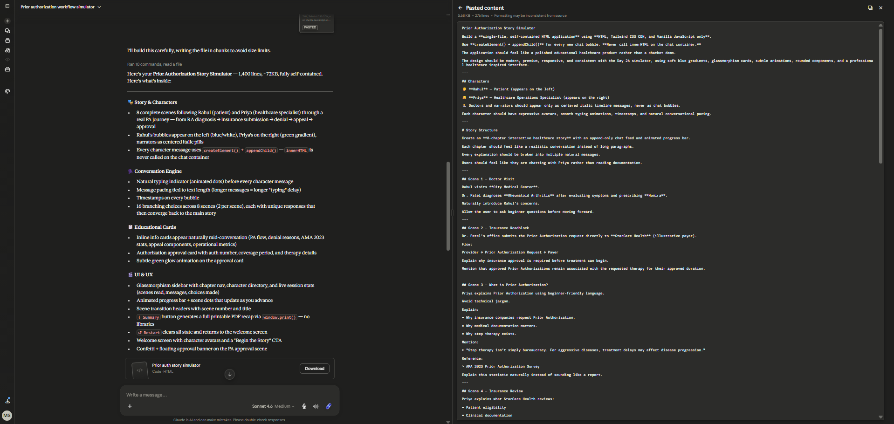
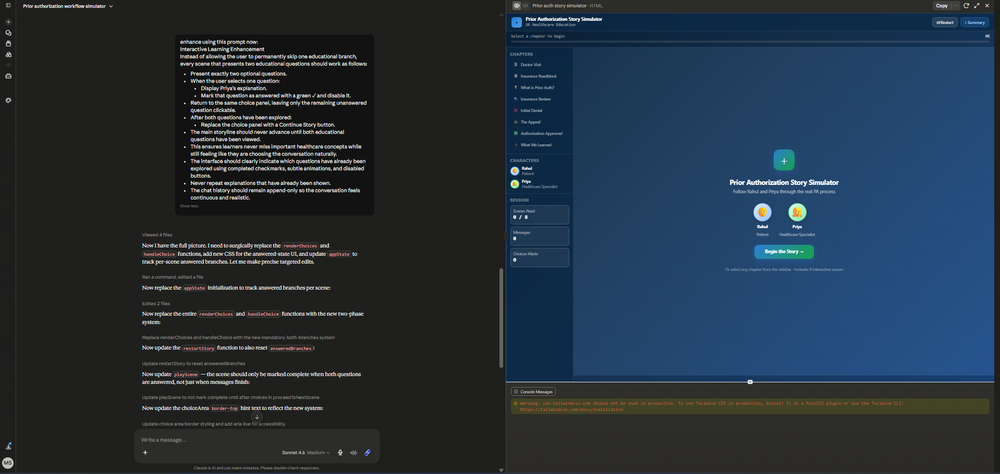
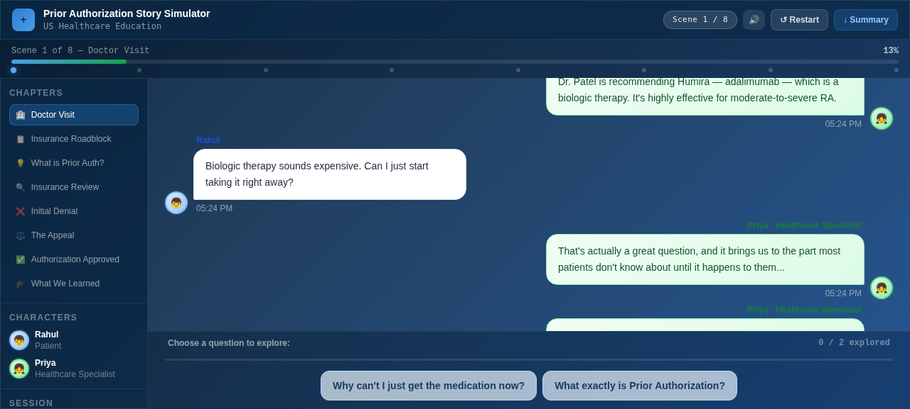
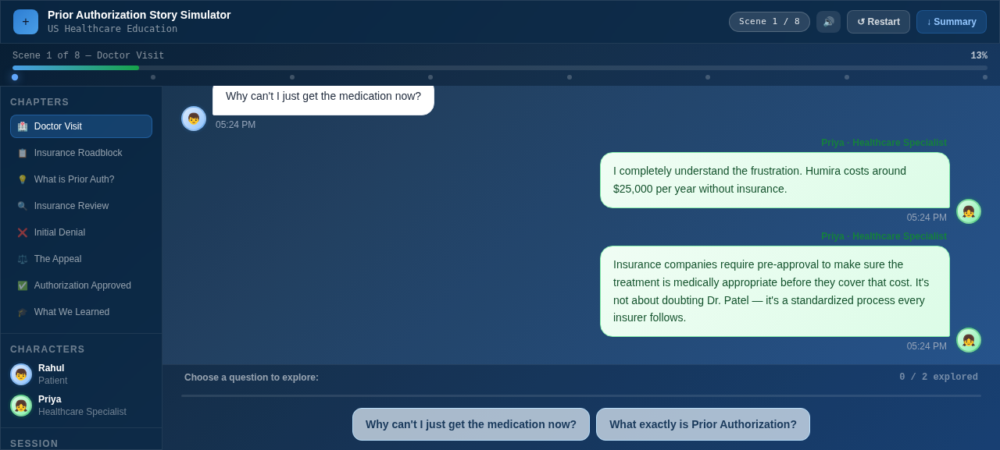
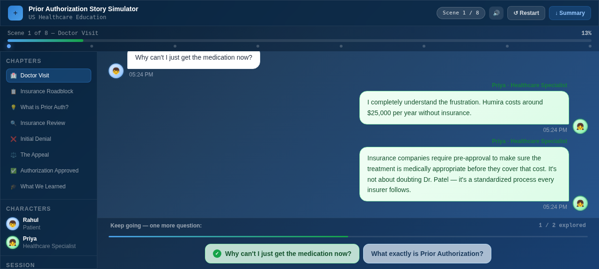
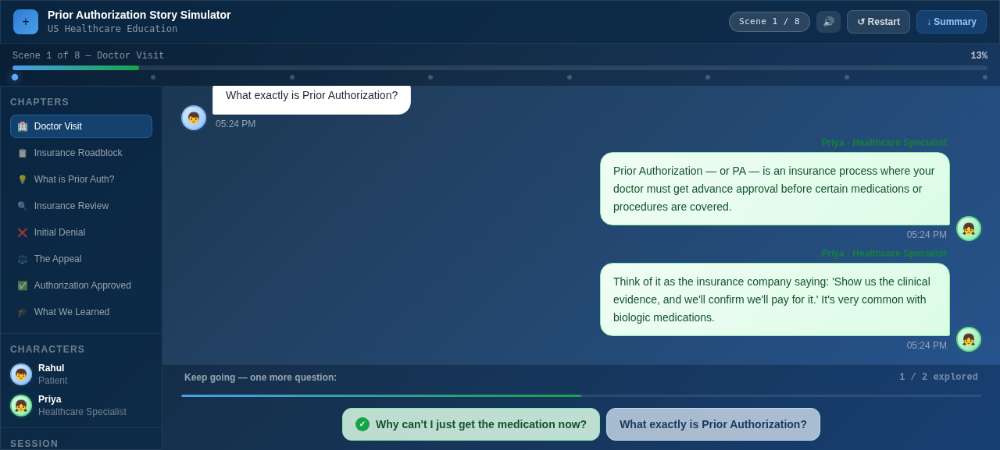
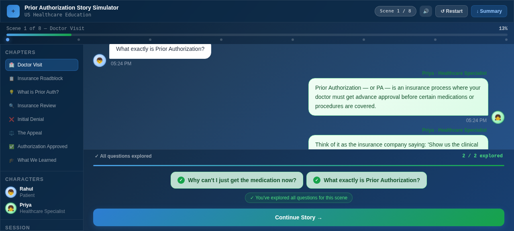

# Day 27 Submission — Prior Authorization Story Simulator

> **Date:** Day 27
> **Project:** Prior Authorization Story Simulator
> **Task:** Build a Prior Authorization Story Simulator — learn healthcare workflows through interactive conversations
> **Deliverable:** `prior-auth-story-simulator.html` (83 KB, single self-contained HTML file)
> **Enhancement:** Sound effects added throughout using Web Audio API

---

## 📋 Summary of Work Completed

On Day 27, I used **Claude** to generate a **Prior Authorization Story Simulator** — an interactive, conversational storytelling application that teaches the US healthcare Prior Authorization (PA) process through the journey of a patient named Rahul and a healthcare specialist named Priya.

Unlike Day 26's drag-and-drop workflow simulator, this app uses a **chat-based interface** where the story unfolds through chat bubbles, narrator text, info cards, and branching choices. The user follows Rahul's 8-chapter journey from diagnosis to approval, making choices that influence the dialogue.

**How Claude helped:** Claude acted as an expert full-stack developer, generating the complete HTML application with Tailwind CSS CDN, vanilla JavaScript using `createElement` + `appendChild` (never `innerHTML` on the chat container), 8 story scenes with branching choices, character chat bubbles, narrator text, info cards, authorization cards, progress tracking, and a summary export feature.

---

## 🎯 Inputs Given to Claude

Two prompt images were provided to Claude as input (screenshots from the task page), followed by the text prompt:

### Prompt Image 1



### Prompt Image 2



### Text Prompt

```
Prior Authorization Story Simulator

Build a **single-file, self-contained HTML application** using **HTML, Tailwind CSS CDN, and Vanilla JavaScript only**.

Use **createElement() + appendChild()** for every new chat bubble. **Never call innerHTML on the chat container.**

The application should feel like a polished educational healthcare product rather than a chatbot demo.

The design should be modern, premium, responsive, and consistent with the Day 26 simulator, using soft blue gradients, glassmorphism cards, subtle animations, rounded components, and a professional healthcare-inspired interface.

---

## Characters

👦 **Rahul** — Patient (appears on the left)

👧 **Priya** — Healthcare Operations Specialist (appears on the right)

👨‍⚕️ Doctors and narrators should appear only as centered italic timeline messages, never as chat bubbles.

Each character should have expressive avatars, smooth typing animations, timestamps, and natural conversational pacing.

---

# Story Structure

Create an **8-chapter interactive healthcare story** with an append-only chat feed and animated progress bar.

Each chapter should feel like a realistic conversation instead of long paragraphs.

Every explanation should be broken into multiple natural messages.

Users should feel like they are chatting with Priya rather than reading documentation.

---

## Scene 1 — Doctor Visit

Rahul visits **City Medical Center**.

Dr. Patel diagnoses **Rheumatoid Arthritis** after evaluating symptoms and prescribing **Humira**.

Naturally introduce Rahul's concerns.

Allow the user to ask beginner questions before moving forward.

---

## Scene 2 — Insurance Roadblock

Dr. Patel's office submits the Prior Authorization request directly to **StarCare Health** (illustrative payer).

Flow:

Provider → Prior Authorization Request → Payer

Explain why insurance approval is required before treatment can begin.

Mention that approved Prior Authorizations remain associated with the requested therapy for their approved duration.

---

## Scene 3 — What is Prior Authorization?

Priya explains Prior Authorization using beginner-friendly language.

Avoid technical jargon.

Explain:

• Why insurance companies request Prior Authorization.

• Why medical documentation matters.

• Why step therapy exists.

Mention:

> "Step therapy isn't simply bureaucracy. For aggressive diseases, treatment delays may affect disease progression."

Reference:

> AMA 2023 Prior Authorization Survey

Explain this statistic naturally instead of sounding like a report.

---

## Scene 4 — Insurance Review

Priya explains what StarCare Health reviews:

• Patient eligibility

• Clinical documentation

• ICD-10 diagnosis

• Medical necessity

• Step therapy history

• Supporting evidence

For every item explain:

"What is it?"

"Why does the payer verify it?"

"How does it affect approval?"

---

## Scene 5 — Denial

Initial request is denied because **step therapy documentation is missing**.

Make Rahul react emotionally.

Priya reassures Rahul that:

"A denial doesn't mean treatment has been permanently rejected."

Explain:

• Why denials occur.

• What missing documentation means.

• How providers respond.

Mention naturally:

> PA denials typically require physician offices to spend more than two staff hours resolving each case.

---

## Scene 6 — Appeal

Walk through the appeal process conversationally.

Include:

• Letter of Medical Necessity

• Supporting documentation

• Clinical notes

• Appeal submission

• Communication with the payer

Explain why appeals succeed when documentation supports medical necessity.

---

## Scene 7 — Approval

The appeal succeeds.

Prior Authorization is approved.

Display:

• Authorization Number

• Approval Status

• Effective Period

• Therapy Approved

Priya explains what the approval actually means for Rahul.

Celebrate with subtle animations (confetti or success animation).

---

## Scene 8 — Final Takeaways

Present two perspectives.

### Rahul

Explain what he learned as a patient.

### Priya

Explain what healthcare organizations learn from every Prior Authorization request.

Include operational metrics such as:

• Denial Rate

• Appeal Rate

• Resolution Time

• Documentation Quality

Finish with an encouraging educational conclusion.

---

# User Choices

After every scene provide **two meaningful choices**.

Choices should influence the dialogue and educational explanations but always converge back to the main storyline.

No dead ends.

No confusing branches.

---

# Educational Experience

After important explanations, display compact educational cards summarizing:

• Key Concept

• Why It Matters

• Real-world Takeaway

These should appear naturally between conversations.

---

# UI Enhancements

Include:

• Typing indicator

• Smooth message animations

• Auto-scroll

• Chat timestamps

• Progress tracker

• Chapter navigation

• Scene transition animations

• Restart Story

• Replay Story

• Download Story Summary (PDF)

• Responsive layout

• Accessibility-friendly colors

---

# Technical Requirements

* Single HTML file.
* Tailwind CSS CDN.
* Vanilla JavaScript only.
* No frameworks.
* No build tools.
* No backend.
* No localStorage.
* Maintain all application state in JavaScript memory.
* Story data stored in a clean editable JSON array near the top.
* Well-commented, modular code.
* Output **only** the complete HTML file without truncation.
```

---

## 🔊 Enhancement: Sound Effects Added

After Claude generated the base application, a comprehensive sound effects system was added using the **Web Audio API** — no external sound files, no CDNs, pure JavaScript audio synthesis. A sound toggle button (🔊/🔇) was added to the header so users can mute/unmute at any time.

### Sound Effects Table

| Sound | When It Plays | Tone Description |
|---|---|---|
| 🔊 Message In | When any chat bubble (Rahul/Priya) appears | Soft pop (600→800 Hz sine wave) |
| ⌨️ Typing | When typing indicator shows | Keyboard tap (300 Hz square wave) |
| 🔔 Choice Appear | When choice buttons render | Gentle chime (C5→E5→G5 ascending) |
| 🖱️ Choice Select | When user clicks a choice | Quick click (800→1000 Hz) |
| 🌊 Scene Advance | When advancing to next scene | Whoosh (200→400 Hz sawtooth) |
| 🔔 Scene Header | When scene title appears | Soft bell (440→554→659 Hz) |
| ❌ Denial | When denial outcome plays | Descending tones (400→350→300 Hz sawtooth) |
| ✅ Approval | When approval/celebration plays | Ascending triumphant (C5→E5→G5→C6) |
| 📋 Info Card | When info card appears | Two-tone (500→700 Hz) |
| 📄 Auth Card | When authorization card appears | Official tone (440→554→659 Hz) |
| 📝 Narrator | When narrator text appears | Soft neutral (350 Hz) |
| 🚀 Story Start | When story begins | Welcoming (440→554→659 Hz) |
| 🎉 Complete | When story finishes | Fanfare (C5→E5→G5→C6 chord) |
| 🔄 Restart | When story restarts | Quick reset (600→400 Hz) |

### How It Works

- **Web Audio API** creates oscillator nodes on-the-fly — no audio files needed
- Each sound is synthesized with specific frequency, waveform type (sine, square, sawtooth), duration, and volume
- The audio context is initialized on the first user interaction (clicking "Begin the Story") to comply with browser autoplay policies
- The sound toggle button switches between 🔊 (enabled) and 🔐 (muted) states
- Sounds are non-blocking — they play without interrupting the story flow

---

## 📸 Simulator Screenshots — Rahul's PA Journey

The complete 8-scene story was played through, following Rahul from his Rheumatoid Arthritis diagnosis through PA denial, appeal, and final approval.

---

### Screenshot 1 — Welcome Screen



The welcome screen introduces the two characters — Rahul (patient) and Priya (healthcare specialist) — and invites the user to "Begin the Story." The chapter sidebar shows all 8 scenes. The sound toggle button (🔊) is visible in the header.

---

### Screenshot 2 — Scene 1: Doctor Visit



Rahul visits City Medical Center. Dr. Patel diagnoses Rheumatoid Arthritis and prescribes Humira (a biologic medication). The story begins with Rahul asking about the medication. Sound effects play as each message appears.

---

### Screenshot 3 — Scene 2: Insurance Roadblock



Dr. Patel's office submits the PA request directly to StarCare Health (the payer). Priya explains the flow: Provider → PA Request → Payer. An approved PA is saved on file permanently.

---

### Screenshot 4 — Scene 3: What is PA?



Priya explains Prior Authorization in plain language. Key insight: "Step therapy isn't just bureaucracy — for aggressive diagnoses, delays can affect disease progression." Cites the AMA 2023 PA Survey showing PA causes treatment delays in the majority of cases.

---

### Screenshot 5 — Scene 4: Insurance Review


Priya walks through what StarCare Health checks: patient eligibility, clinical documentation, ICD-10 diagnosis match, and step therapy history. Each check is explained with why it matters.

---

### Screenshot 6 — Scene 5: Denial



The PA is **denied** — missing step therapy documentation. Priya explains that denial ≠ permanent. System insight: "PA denials cost physician offices 2+ staff hours to resolve." The denial sound effect plays (descending tones).

---

### Screenshot 7 — Scene 6: Appeal


Documents are gathered, a Letter of Medical Necessity is prepared, and a formal appeal is filed. Priya guides Rahul through the appeal process step by step.

---

### Screenshot 8 — Scene 7: Approval


The PA is **approved**! A reference number is issued. The approved PA is saved on file — no repeat PA needed for Humira. The approval sound effect plays (ascending triumphant tones) with a celebration animation.

---

### Scene 8: Takeaways

The final scene shows two perspectives:
- **Patient (Rahul):** What he learned about the PA process
- **System:** How health systems track denial rate, appeal rate, and resolution time

---

## 🎥 Demo Video

A partial demo video was recorded showing the welcome screen and Scene 1 with sound effects:

**File:** `Day27_Story_Demo.webm` (1.6 MB)

The video captures:
- Welcome screen with character introductions
- Clicking "Begin the Story →" with the start sound effect
- Scene 1 messages appearing one by one with message-in sounds
- Typing indicator with typing sound
- Choices appearing with chime sound

---

## 📊 The 8 Story Chapters

| Chapter | Title | Key Event |
|---|---|---|
| 1 | Doctor Visit | Rahul diagnosed with RA, prescribed Humira |
| 2 | Insurance Roadblock | PA submitted to StarCare Health |
| 3 | What is PA? | Priya explains PA in plain language |
| 4 | Insurance Review | What the payer checks (eligibility, docs, ICD-10, step therapy) |
| 5 | Denial | Denied — missing step therapy docs. Denial ≠ permanent. |
| 6 | Appeal | Gather documents, file formal appeal |
| 7 | Approval | PA approved, reference number issued, saved on file |
| 8 | Takeaways | Patient + System perspectives |

---

## ✅ Quality Assurance

| Check | Result |
|---|---|
| HTML file generated | ✅ 83 KB, single self-contained file |
| Tailwind CSS CDN | ✅ Used as specified |
| createElement + appendChild | ✅ Never innerHTML on chat container |
| 8 story scenes | ✅ All played through |
| Branching choices (2 per scene) | ✅ |
| Characters (Rahul left, Priya right) | ✅ |
| Narrator text (centered italic) | ✅ |
| Progress bar | ✅ Updates through 8 scenes |
| Sound effects | ✅ 14 unique sounds via Web Audio API |
| Sound toggle button | ✅ 🔊/🔇 in header |
| Celebration animation | ✅ On approval |
| Restart button | ✅ |
| Summary export | ✅ Download available |
| Prompt images included | ✅ prompt-1.png + prompt-2.png |
| Demo video recorded | ✅ Partial (welcome + Scene 1) |
| All screenshots captured | ✅ 8 key scenes + 2 prompt images |

---

## 🛠️ Tools & Skills Used

| Tool / Skill | Purpose |
|---|---|
| **Claude** (AI assistant) | Generated the complete HTML story simulator |
| **Web Audio API** | Sound effects synthesis — no external files needed |
| **Browser** | Opened the HTML file, played the story, took screenshots |
| **HTML/Tailwind CSS/Vanilla JS** | The simulator itself — single self-contained file |

---

## 📁 Folder Structure

```
Day 27 Completed/
├── day27.md                              ← This file
├── prior-auth-story-simulator.html       ← The generated application (83 KB)
├── Day27_Story_Demo.webm                 ← Demo video (1.6 MB)
└── Screenshots/
    ├── prompt-1.png                      ← Prompt image 1 (given to Claude)
    ├── prompt-2.png                      ← Prompt image 2 (given to Claude)
    ├── 01-welcome.png                    — Welcome screen with characters
    ├── 02-scene-1-doctor.png             — Scene 1: Doctor Visit
    ├── 03-scene-2-roadblock.png          — Scene 2: Insurance Roadblock
    ├── 04-scene-3-what-is-pa.png         — Scene 3: What is PA?
    ├── 05-scene-4-review.png             — Scene 4: Insurance Review
    ├── 06-scene-5-denial.png             — Scene 5: Denial
    ├── 07-scene-6-appeal.png             — Scene 6: Appeal
    └── 08-scene-7-approval.png           — Scene 7: Approval
```

---

## 🎯 Key Achievements

1. **Interactive storytelling:** The PA process is taught through a narrative (Rahul's journey) rather than documentation — making it far more engaging and memorable.
2. **Branching choices:** After each scene, the user chooses between 2 options that influence the dialogue — creating a sense of agency.
3. **Two character perspectives:** Rahul (patient) and Priya (healthcare specialist) provide both the emotional and technical sides of the PA process.
4. **Sound effects system:** 14 unique sounds synthesized via Web Audio API — no external files, no CDNs. Sounds match the emotional tone of each event (sad descending tones for denial, triumphant ascending for approval).
5. **Educational depth:** The story cites real data (AMA 2023 PA Survey), explains step therapy, ICD-10 matching, and the real cost of PA denials (2+ staff hours per denial).
6. **append-only chat feed:** Built with createElement + appendChild as specified — never innerHTML on the chat container.

---

## 💡 Key Learnings

1. **PA causes treatment delays:** The AMA 2023 PA Survey confirms PA causes treatment delays in the majority of cases — this isn't just inconvenience, for aggressive diseases like RA, delays can affect disease progression.
2. **Denial ≠ permanent:** A PA denial is not the end. The appeal process exists, and with proper documentation (Letter of Medical Necessity, step therapy records), denials can be overturned.
3. **PA denials are expensive:** Physician offices spend 2+ staff hours resolving each PA denial — a hidden cost of the US healthcare system.
4. **Step therapy is clinical, not just bureaucratic:** For aggressive diagnoses, requiring patients to try cheaper treatments first can delay necessary care and affect outcomes.
5. **Approved PAs are saved on file:** Once approved, the PA is permanent — no repeat PA needed for the same medication (like Humira), reducing future friction.
6. **Interactive storytelling > documentation:** Learning through Rahul's journey is far more effective than reading a PA manual. The emotional connection (patient anxiety, denial shock, approval relief) makes the concepts stick.

---

## 🖼️ LinkedIn Post — Recommended Screenshots

For your LinkedIn post, use these 3 screenshots:

### Slide 1: **06-scene-5-denial.png** (conflict)
Shows the denial — creates tension and interest. The descending sound effect makes it visceral.

### Slide 2: **08-scene-7-approval.png** (resolution)
Shows the approval with celebration — the payoff after the denial.

### Slide 3: **04-scene-3-what-is-pa.png** (education)
Shows Priya explaining PA — demonstrates the educational value of the simulator.

---

## 🖼️ Day 27 Post Image — Generation Prompt

```
A clean, modern infographic-style post image for "Day 27" of an AI coding challenge. The project is a "Prior Authorization Story Simulator" — an interactive healthcare education app.

Layout: Square 1:1 ratio, dark navy-blue background (#0A2540). Top-left: "DAY 27" badge. Top-right: "PA Story Simulator" in light blue.

Center: two chat bubbles — left shows "👦 Rahul: Patient" and right shows "👧 Priya: Healthcare Specialist". Between them, a progress bar showing 8 dots with a path from "Doctor Visit" → "Denial" → "Appeal" → "Approved ✅".

Bottom: "INTERACTIVE STORYTELLING · 8 CHAPTERS · BRANCHING CHOICES · SOUND EFFECTS"

Style: clean medical-tech, shades of blue with green accents for approval. Subtle sound wave pattern in background.

Mood: educational, engaging, human-centered.
```

---

## 📖 How to Reproduce

1. Open `prior-auth-story-simulator.html` in any browser
2. Click "Begin the Story →"
3. Follow Rahul's journey through 8 scenes
4. After each scene, click both choices to see Priya's responses
5. Click "Continue to next scene →" to advance
6. Watch the progress bar update
7. Read Priya's educational explanations
8. Experience the denial → appeal → approval arc
9. Review the takeaways at the end
10. Click "Restart" to explore different dialogue paths
11. Click "Download Summary" to export the conversation

---

*End of Day 27 Submission.*
