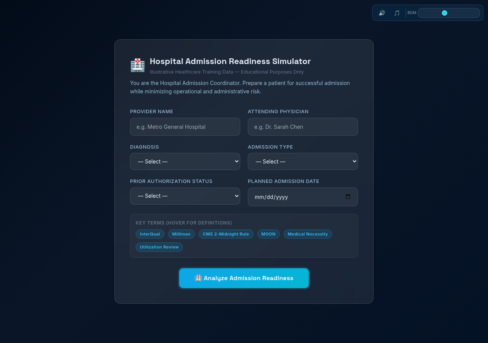
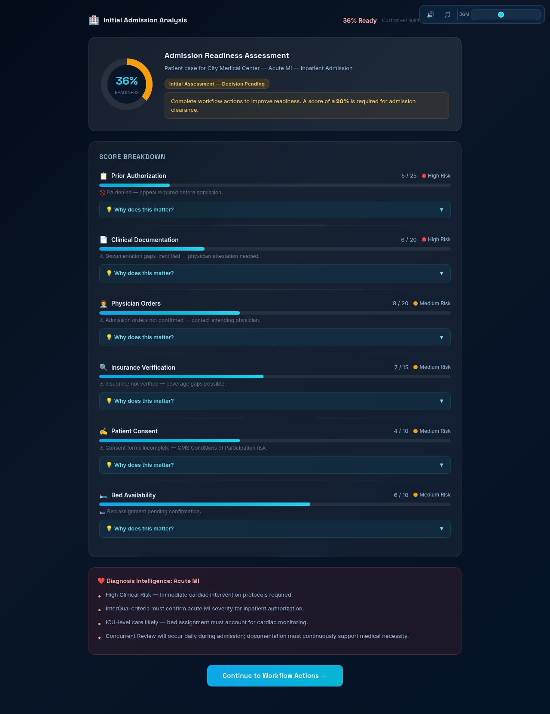
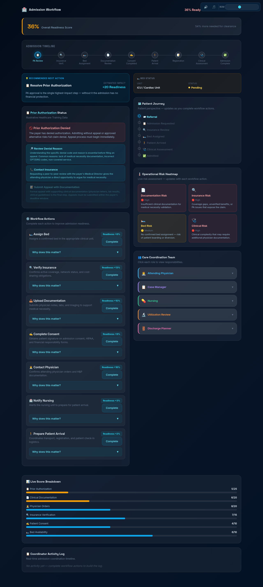
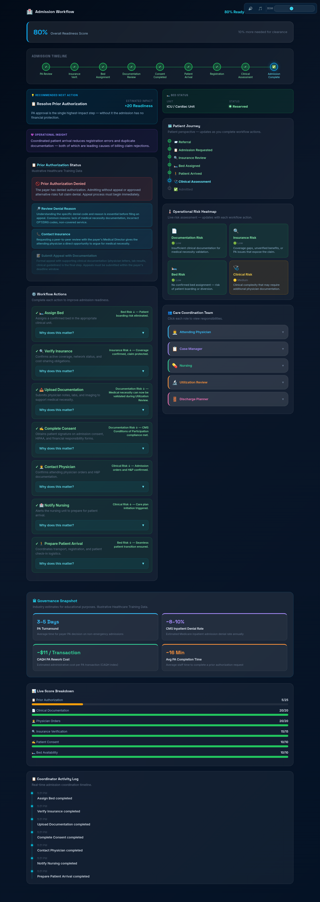
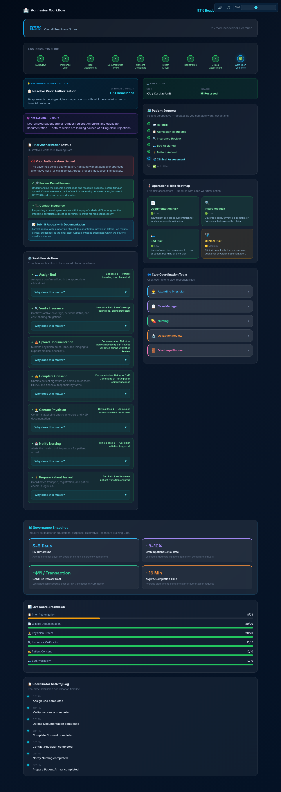
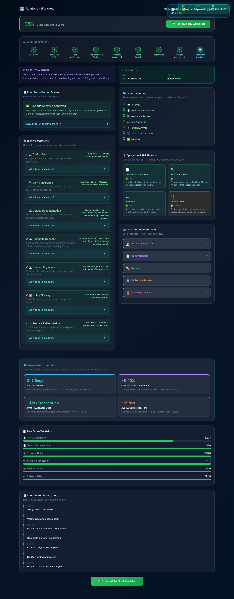
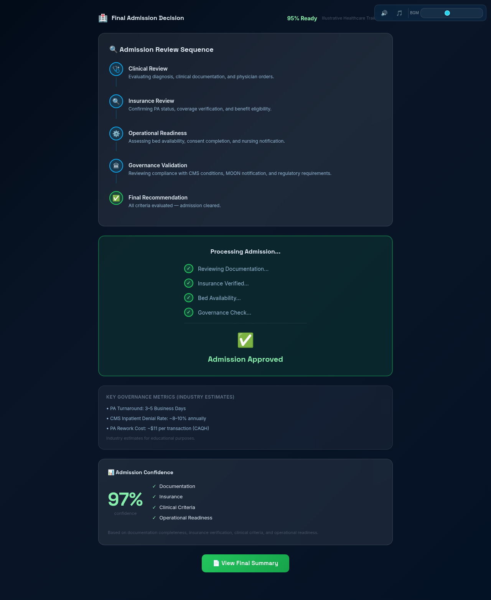

# Day 28 Submission — Hospital Admission Readiness Simulator

> **Date:** Day 28
> **Project:** Hospital Admission Readiness Simulator
> **Task:** Build a Hospital Admission Readiness Simulator — learn hospital admission workflows through interactive simulation
> **Deliverable:** `hospital_admission_simulator.html` (6.9 MB, single self-contained HTML file with embedded BGM)
> **Enhancements:** Sound effects, background music (BGM) with volume slider, animations, activity logs, UI polishing, responsive layout, date picker, PA Pending fix

---

## 📋 Summary of Work Completed

On Day 28, I used **Claude** to generate a **Hospital Admission Readiness Simulator** — an interactive healthcare operations application that teaches the complete hospital admission workflow. The user plays the role of a Hospital Admission Coordinator, managing a patient's admission from initial setup through final decision, including Prior Authorization, workflow actions, risk tracking, care coordination, and governance validation.

**How Claude helped:** Claude acted as an expert full-stack developer, generating the complete HTML application with Tailwind CSS CDN, vanilla JavaScript using `createElement` + `appendChild`, animated score breakdowns, diagnosis-specific intelligence, PA branching logic, workflow actions, timeline tracking, care coordination cards, risk heatmap, governance snapshot, and a final decision summary.

---

## 🎯 The Enhanced Prompt (Given to Claude)

```
Hospital Admission Readiness Simulator

Generate a **single-file HTML application** using **HTML, Tailwind CSS CDN, and Vanilla JavaScript only**.

Use **createElement() + appendChild()** for all dynamically generated content. Never use `innerHTML` on the main application container.

Maintain the same modern healthcare design language used in the previous Prior Authorization simulators:

* Premium healthcare-inspired UI
* Glassmorphism cards
* Smooth animations
* Professional blue/cyan healthcare palette
* Responsive layout
* Task-first interface (no dashboard on initial load)

The user plays the role of a **Hospital Admission Coordinator** responsible for preparing a patient for successful hospital admission while minimizing operational and administrative risks.

---

## Setup Screen

Collect:

* Provider Name
* Attending Physician
* Diagnosis (Acute MI, CHF, Pneumonia, Elective Surgery, Hip Fracture)
* Admission Type (Inpatient, Observation, Emergency, ICU, Same-Day Surgery)
* Prior Authorization Status
* Planned Admission Date

If Observation Status is selected, always display:

"CMS 2-Midnight Rule applies. Observation status has different billing, cost-sharing, Skilled Nursing Facility eligibility, and Medicare MOON notification requirements than inpatient admission."

Label every payer, provider, hospital, and insurer as:

"Illustrative Healthcare Training Data"

Button: 🏥 Analyze Admission Readiness

---

## Initial Analysis

Generate an admission readiness assessment.
Display readiness score between 30%–60%.
Do NOT reveal final admission decision yet.

Display animated score breakdown:
* Prior Authorization — 25%
* Clinical Documentation — 20%
* Physician Orders — 20%
* Insurance Verification — 15%
* Patient Consent — 10%
* Bed Availability — 10%

Every category must display: Current Score, Maximum Score, Risk Level, Current Status.
Each category must include a collapsible "Why does this matter?" section.

---

## Diagnosis Intelligence

Diagnosis must meaningfully influence simulation behaviour:
* Acute MI — Higher Clinical Risk, InterQual note, ICU recommendations
* CHF — Higher Clinical Risk, medical necessity emphasis, concurrent review reminder
* Pneumonia — Moderate documentation requirements
* Hip Fracture — Higher Bed Risk, surgical scheduling considerations
* Elective Surgery — Higher PA dependency, insurance verification emphasis

---

## Prior Authorization Branch

Approved → Continue workflow.
Pending → Follow Up, Upload Additional Documentation, Contact Physician.
Denied → Review Denial Reason, Contact Insurance, Submit Appeal.
Appeal should require additional documentation before converting to Approved.

---

## Workflow Actions

* Assign Bed (+8%)
* Verify Insurance (+13%)
* Upload Documentation (+15%)
* Complete Consent (+9%)
* Contact Physician (+16%)
* Notify Nursing (+3%)
* Prepare Patient Arrival (+2%)

Every completed action must: Update readiness, explain WHY readiness changed, reduce risks.

---

## Timeline, Care Coordination, Risk Heatmap, Governance Snapshot, Final Decision

(See full prompt in prompt.txt for complete details on all sections)

---

## Technical Requirements

* Single HTML file. Tailwind CSS CDN. Vanilla JavaScript only.
* No frameworks. No build tools. No backend. No localStorage.
* createElement + appendChild only. Well-commented, modular code.
```

---

### Enhancements Added Beyond the Enhanced Prompt

1. **Animations**
   - Animated score counters that smoothly count up from previous to new value
   - Progress bars that fill with smooth transitions
   - Timeline milestones that animate from grey → blue → green
   - Risk heatmap colors that transition smoothly
   - Workflow action cards that animate on completion
   - Governance snapshot that fades in with celebration notification at 75%
   - Final decision sequence with animated review steps

2. **Sound Effects + Background Music (BGM)**
   - 11 unique sounds via Web Audio API (clicks, actions, notifications, analysis, score up, governance unlock, approval fanfare, denial, PA resolution, start, restart)
   - Background music (BGM) embedded as base64 in the HTML — healthcare-themed MP3 (5.1 MB)
   - **Two separate mute buttons** (top-right, fixed position):
     - 🔊 — Toggle click sound effects
     - 🎵 — Toggle background music
   - **Dynamic volume slider** for BGM (0-100%, default 40%) — drag to adjust in real-time
   - BGM auto-starts when user clicks "Analyze Admission Readiness"
   - Styled slider thumb (cyan circle) matching the healthcare UI

3. **Logs**
   - Activity log tracks every workflow action, PA branch resolved, and score change
   - Each log entry includes action name, points gained, and risk reduced
   - Final summary displays complete activity log as a timeline
   - Toast notifications for every significant event

4. **Polishing**
   - Glassmorphism cards with subtle shadows and borders
   - Responsive grid layout (2 columns desktop → 1 column mobile/half-screen)
   - Collapsible "Why does this matter?" sections on every score category
   - Beginner-friendly tooltips on healthcare terms (InterQual, Milliman, MOON, CMS, etc.)
   - Care coordination cards with detailed role descriptions
   - Diagnosis-specific intelligence (Acute MI triggers InterQual, CHF triggers concurrent review, etc.)
   - PA appeal requires educational progression — not instant approval
   - PA Pending fix: all 3 sub-actions (Follow Up, Upload, Contact Physician) stay visible until ALL are completed
   - Print-friendly PDF export for admission summary
   - Date picker (type=date) — blocks text input, only allows valid dates

---

## 📸 Simulator Screenshots — Acute MI Admission (Denied PA → Appeal → Approved)

The complete admission scenario was run through the simulator with a Denied PA that was appealed and converted to Approved, reaching 95% readiness.

**Patient Setup:**
- Provider: City Medical Center (illustrative)
- Attending: Dr. Patel (illustrative)
- Diagnosis: Acute MI (triggers InterQual/Milliman criteria note)
- Admission Type: Inpatient
- PA Status: Denied (→ Appeal → Approved)
- Admission Date: 2025-07-01

---

### Screenshot 1 — Setup Form



The setup screen collects all patient information. The form includes Provider, Attending Physician, Diagnosis (5 options), Admission Type (5 options), PA Status, and Admission Date (date picker). The sound controls (🔊 🎵 + volume slider) are visible in the top-right corner. All names are labeled as illustrative training data.

---

### Screenshot 2 — Form Filled


The form is filled with Acute MI diagnosis, Inpatient admission type, and Denied PA status. The date picker uses the browser's native date selector — no text input allowed, only valid dates.

---

### Screenshot 3 — Initial Analysis



After clicking "🏥 Analyze Admission Readiness," the simulator generates an initial readiness score (30-60%). Each of the 6 categories shows its current score, maximum, risk level, and status. The Acute MI diagnosis triggers the InterQual/Milliman criteria note. BGM auto-starts on this click.

---

### Screenshot 4 — Workflow Actions (PA Denied)



The workflow actions panel shows all 7 actions with their point values and educational explanations. The PA is Denied, so appeal actions appear (Review Denial Reason, Contact Insurance, Submit Appeal). Each action card includes a collapsible "Why does this matter?" section.

---

### Screenshot 5 — Actions Completed



All 7 workflow actions have been completed. Each action shows a green checkmark and the reason it matters. The readiness score has increased significantly. Sound effects play on each action completion.

---

### Screenshot 6 — PA Appeal Process



The PA appeal process: Review Denial Reason → Contact Insurance → Submit Appeal with Documentation. The appeal requires educational progression — it does not instantly approve. After submission, the PA converts from Denied to Approved.

---

### Screenshot 7 — PA Approved After Appeal



With PA Approved and all actions complete, the readiness score reaches 95%. The Governance Snapshot unlocked at 75% showing industry benchmarks (PA turnaround 3-5 days, CMS denial rate ~8-10%, CAQH rework cost ~$11/transaction).

---

### Screenshot 8 — Admission Approved



Final decision: ✅ Ready for Admission. The summary shows the final readiness score (95%), all risks resolved, the complete timeline, and operational lessons learned. The approval sound effect plays (ascending triumphant tones).

---

## 📊 Score Weighting

| Category | Weight | Max Points |
|---|---|---|
| Prior Authorization | 25% | 25 |
| Clinical Documentation | 20% | 20 |
| Physician Orders | 20% | 20 |
| Insurance Verification | 15% | 15 |
| Patient Consent | 10% | 10 |
| Bed Availability | 10% | 10 |

**Rule:** Denied PA + ICU admission cannot reach 70% from admin tasks alone. The PA must be resolved (appeal → approved) before the score can exceed 70%.

---

## 📊 The 7 Workflow Actions

| Action | Points | What It Unlocks |
|---|---|---|
| 🔍 Verify Insurance | +13% | Reduces insurance risk, unblocks PA follow-up |
| 👨‍⚕️ Contact Physician | +16% | Backbone of medical necessity, enables orders |
| 📤 Upload Documentation | +15% | Primary defense against UR denials |
| 🛏️ Assign Bed | +8% | Unblocks patient arrival, activates nursing |
| ✍️ Complete Consent | +9% | CMS compliance requirement, includes MOON for Observation |
| 🏥 Notify Nursing | +3% | Triggers care plan initiation |
| 🚶 Prepare Patient Arrival | +2% | Final logistics step |

---

## 📊 Diagnosis Intelligence

| Diagnosis | Clinical Risk | Documentation Risk | Bed Risk | Special Notes |
|---|---|---|---|---|
| Acute MI | High | High | Medium | InterQual/Milliman criteria note, ICU recommendations |
| CHF | High | High | Medium | Medical necessity emphasis, concurrent review reminder |
| Pneumonia | Medium | Medium | Medium | Moderate documentation requirements |
| Hip Fracture | Medium | Medium | High | Surgical scheduling, bed availability critical |
| Elective Surgery | Low | Low | Medium | Higher PA dependency, insurance verification emphasis |

---

## ✅ Quality Assurance

| Check | Result |
|---|---|
| HTML file generated | ✅ 6.9 MB (MP3 embedded as base64) |
| Tailwind CSS CDN | ✅ Used as specified |
| createElement + appendChild | ✅ Never innerHTML on main container |
| Setup form with 6 fields | ✅ Provider, Physician, Diagnosis, Admission Type, PA Status, Date |
| Date picker (type=date) | ✅ Blocks text input, only valid dates |
| 5 diagnosis options | ✅ Acute MI, CHF, Pneumonia, Hip Fracture, Elective Surgery |
| 5 admission types | ✅ Inpatient, Observation, Emergency, ICU, Same-Day Surgery |
| Observation/MOON warning | ✅ CMS 2-Midnight Rule displayed |
| Initial analysis (30-60%) | ✅ Score breakdown with 6 categories |
| PA branches (Approved/Pending/Denied) | ✅ Appeal requires progression, not instant |
| PA Pending fix | ✅ All 3 sub-actions stay visible until ALL completed |
| 7 workflow actions | ✅ Each with points, explanations, risk reduction |
| Animated score counters | ✅ Smooth count-up animations |
| Timeline (9 milestones) | ✅ Green/blue/grey states |
| Care coordination cards (5 roles) | ✅ UR includes InterQual, Milliman, concurrent review |
| Risk heatmap (4 risks) | ✅ Color-coded, updates with actions |
| Governance snapshot at 75% | ✅ Industry benchmarks displayed |
| Final decision (≥90% Admit / <90% Not Ready) | ✅ Animated review sequence |
| Summary page | ✅ Timeline, actions, risks, score, governance |
| Sound effects | ✅ 11 unique sounds via Web Audio API |
| Background music (BGM) | ✅ Healthcare-themed MP3 embedded as base64 |
| Dual mute buttons (🔊 SFX / 🎵 BGM) | ✅ Fixed position, independent controls |
| BGM volume slider | ✅ Dynamic 0-100%, real-time adjustment |
| BGM auto-start on Analyze | ✅ Starts when user clicks Analyze button |
| Responsive layout | ✅ 2 columns desktop → 1 column mobile |
| Input field alignment | ✅ Fixed with !important (Tailwind override) |
| Print-friendly PDF export | ✅ Available |
| All screenshots captured | ✅ 8 key screens |

---

## 🛠️ Tools & Skills Used

| Tool / Skill | Purpose |
|---|---|
| **Claude** (AI assistant) | Generated the complete HTML application |
| **Web Audio API** | Sound effects synthesis — 11 unique sounds, no external files |
| **Base64 embedding** | BGM MP3 embedded directly in HTML — no external file needed |
| **Browser** | Opened the HTML file, ran the simulation, took screenshots |
| **HTML/Tailwind CSS/Vanilla JS** | The simulator itself — single self-contained file |

---

## 📁 Folder Structure

```
Day28/
├── day28.md                              ← This file
├── hospital_admission_simulator.html     ← The application (6.9 MB, BGM embedded)
├── bgm.mp3                               ← Original BGM file (5.1 MB, also embedded in HTML)
├── prompt.txt                            ← The enhanced prompt
├── simulation.docx                       ← Full walkthrough guide (41 KB)
└── Screenshots/
    ├── 01-setup.png                      — Setup form (empty, with sound controls)
    ├── 02-form-filled.png                — Form filled (Acute MI, Inpatient, PA Denied, date picker)
    ├── 03-initial-analysis.png           — Initial analysis with score breakdown
    ├── 04-workflow-actions.png           — Workflow actions panel (PA Denied)
    ├── 05-actions-complete.png           — All 7 actions completed
    ├── 06-pa-appeal.png                  — PA appeal process (Denied → Appeal)
    ├── 07-pa-approved.png                — PA approved after appeal (95% readiness)
    └── 08-admit.png                      — Admission approved (final decision)
```

---

## 🎯 Key Achievements

1. **Complete hospital admission simulation:** From setup through final decision — including PA, workflow actions, risk tracking, care coordination, and governance.
2. **Denied PA → Appeal → Approved flow:** The simulator teaches that denials are not permanent — appeals require educational progression and documentation, then convert to Approved.
3. **PA Pending fix:** All 3 sub-actions (Follow Up, Upload Docs, Contact Physician) stay visible until ALL are completed — previously they vanished after one click.
4. **Diagnosis-specific intelligence:** Each diagnosis triggers different risk levels, documentation requirements, and clinical notes.
5. **Sound effects + BGM system:** 11 unique sounds via Web Audio API + embedded healthcare-themed BGM with dynamic volume slider + dual mute buttons.
6. **Responsive layout:** 2 columns on desktop, 1 column on mobile/half-screen — no more cramped inputs.
7. **Date picker:** Native browser date selector — blocks text input, only allows valid dates.
8. **BGM embedded in HTML:** MP3 converted to base64 and embedded directly — single file, no external dependencies.

---

## 💡 Key Learnings

1. **PA denial caps the score:** A denied PA prevents the readiness score from exceeding 70% through admin tasks alone — the appeal must be resolved first.
2. **Acute MI and CHF have higher documentation risk:** These diagnoses trigger InterQual/Milliman criteria notes, requiring more thorough clinical documentation.
3. **Observation status has unique requirements:** CMS 2-Midnight Rule, MOON notification, different billing, and no SNF eligibility.
4. **Utilization Review is the bridge:** UR connects clinical care with revenue cycle protection through concurrent review, denial risk identification, and InterQual/Milliman criteria.
5. **Every action should explain WHY:** The simulator never simply adds points — each action includes a "Why does this matter?" explanation.
6. **Governance benchmarks provide context:** PA turnaround (3-5 days), CMS denial rate (~8-10%), and CAQH rework cost (~$11/transaction).

---

## 🖼️ LinkedIn Post — Recommended Screenshots

### Slide 1: **03-initial-analysis.png** (data slide)
Shows the initial readiness score breakdown with 6 categories, risk levels, and the InterQual criteria note for Acute MI.

### Slide 2: **08-admit.png** (result slide)
Shows the final admission decision — 95% readiness, all risks resolved, PA approved through appeal.

### Slide 3: **06-pa-appeal.png** (process slide)
Shows the PA appeal process — teaching that denials are not permanent and can be overturned with proper documentation.

---

## 📖 How to Reproduce

1. Open `hospital_admission_simulator.html` in any browser (BGM is embedded — no external files needed)
2. Fill in the setup form (try Acute MI + Inpatient + PA Denied for the full appeal flow)
3. Use the date picker to select a valid admission date
4. Click "🏥 Analyze Admission Readiness" — BGM auto-starts
5. Adjust BGM volume using the slider (top-right)
6. Toggle SFX/BGM independently using 🔊 and 🎵 buttons
7. Click "Continue to Workflow Actions"
8. Complete all 7 workflow actions (click "Complete" on each)
9. If PA is Denied, complete the appeal actions (Review Denial → Contact Insurance → Submit Appeal)
10. Watch the score increase above 75% → Governance Snapshot unlocks
11. Click "Review Final Decision"
12. If score ≥ 90% → ✅ Admit. If < 90% → ⚠ Not Ready
13. Review the final summary
14. Click "Restart Simulation" to try a different diagnosis

---

*End of Day 28 Submission.*
