# Day 29 Submission — Operation Lifeline: Supply Chain Crisis Lab

> **Date:** Day 29
> **Project:** Operation Lifeline: Supply Chain Crisis Lab
> **Task:** Build an enterprise supply chain crisis simulation — lead an enterprise through a supply chain crisis
> **Deliverable:** `operation-lifeline.html` (81 KB, single self-contained HTML file with React)
> **Technology:** React via CDN + Babel JSX, vanilla CSS/JS
> **Screenshots:** Captured from `helioscorpsimulator.html` (a hardcoded Helios Global playthrough for consistent visuals)

---

## 📋 Summary of Work Completed

On Day 29, I used **Claude** to generate **Operation Lifeline: Supply Chain Crisis Lab** — an interactive enterprise supply chain crisis simulation built with React. The player takes on the role of Chief Supply Chain Officer, leading a **randomly generated** fictional company through a **randomly generated** supply chain crisis. **Every playthrough is different** — a new company, a new industry, a new crisis, new KPIs, new negotiations, and new executive reactions.

The simulation includes 7 phases: Welcome → Company Profile → Crisis Alert → War Room → Supplier Negotiation → CEO Boardroom → AI Strategy → Final Results. Each decision visibly affects business KPIs with animated updates.

**How Claude helped:** Claude acted as an expert frontend developer, UX designer, game designer, enterprise software architect, business strategist, supply chain consultant, and simulation designer — generating the complete React application in a single HTML file with Babel JSX transformation, reusable components using `useState`, randomized company/crisis generation, animated KPI dashboards, and 7 interconnected simulation phases.

**Babel fix applied:** The original HTML had a JSX syntax error (`"picked.r==="bad"` should be `picked.r==="bad"`) that prevented React from rendering. This was corrected so the simulator now loads cleanly in any browser.

> **Note on screenshots:** The screenshots below were captured from a **hardcoded variant** (`helioscorpsimulator.html`) that fixes the company to **Helios Global** (Renewable Energy) and the crisis to **Port Strike** — ensuring consistent, repeatable visuals for documentation and voiceover recording. The main deliverable `operation-lifeline.html` is fully randomized.

---

## 🎯 The Enhanced Prompt (Given to Claude)

The full enhanced prompt is saved in `prompt.txt`. Key sections include:

1. **Welcome Screen** — title, subtitle, learning objectives, Start button
2. **Company Generator** — randomized industry, revenue, factories, warehouses, suppliers, countries, inventory days, lead time
3. **Crisis Generator** — 12 possible crises (factory fire, supplier bankruptcy, port strike, cyberattack, flood, etc.)
4. **Persistent Executive Dashboard** — 5 live KPIs that update with every decision (cost, inventory, profit, delivery speed, customer satisfaction), each with industry-specific naming
5. **Enterprise Timeline** — stages unlock naturally
6. **War Room** — choose 3 of 6 response actions, each updates all KPIs
7. **Random Enterprise Events** — unexpected events force decisions
8. **Department Reactions** — CEO, CFO, COO, Procurement, Warehouse, Sales, Legal, Risk Officer
9. **Supplier Negotiation** — 4 rounds, unique supplier personalities, affects trust/price/lead time
10. **CEO Boardroom** — 5 leadership questions
11. **AI Strategy** — choose 2 of 5 AI investments (Demand Signal Intelligence, Dynamic Safety Stock Engine, Supplier Risk Sentinel, Warehouse Vision System, Autonomous Procurement Agent)
12. **AI Advisor** — recommendations before major decisions
13. **Crisis Severity Meter** — live indicator
14. **Interactive Supply Chain Map** — factories, warehouses, suppliers, ports
15. **Executive News Feed** — scrolling live updates
16. **Final Executive Dashboard** — overall crisis score + 10 sub-scores
17. **Executive Debrief** — biggest success, biggest mistake, lessons learned
18. **Replay** — full randomization every playthrough

The prompt was enhanced with 4 additional sections before generation:
- **Think Before Coding** — mentally design the entire application before writing code
- **Avoid Repetition** — different industries, crises, executives, and negotiations should each feel distinct
- **Hard Rules** — no placeholders, no TODOs, no fake progress bars, every KPI updates dynamically, every decision has consequences, every playthrough generates different values
- **Strong Closing Statement** — "The final result should feel like a polished enterprise simulation that could be used in MBA classrooms or corporate leadership workshops"

---

## 📸 Simulator Screenshots

The screenshots below show a complete playthrough. Because the main simulator is randomized, these were captured from the hardcoded `helioscorpsimulator.html` variant (Helios Global / Renewable Energy / Port Strike) for consistent, repeatable visuals.

---

### Screenshot 1 — Welcome Screen

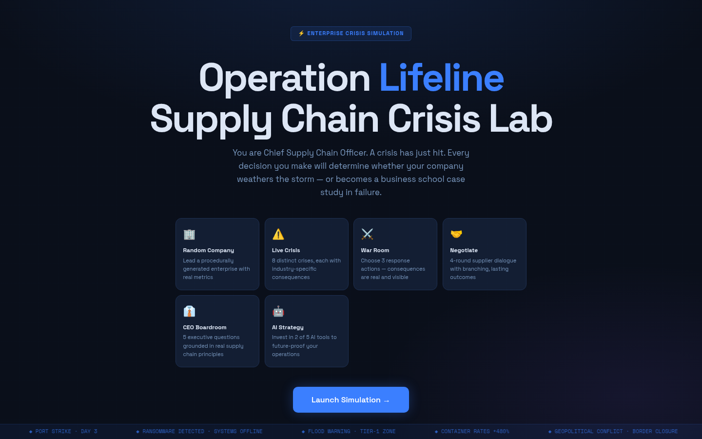

The welcome screen introduces the simulation: "You are Chief Supply Chain Officer. A crisis has just hit. Every decision you make will determine whether your company weathers the storm — or becomes a business school case study in failure." Feature cards highlight the six core modules: Random Company, Live Crisis, War Room, Negotiate, CEO Boardroom, and AI Strategy.

---

### Screenshot 2 — Company Profile

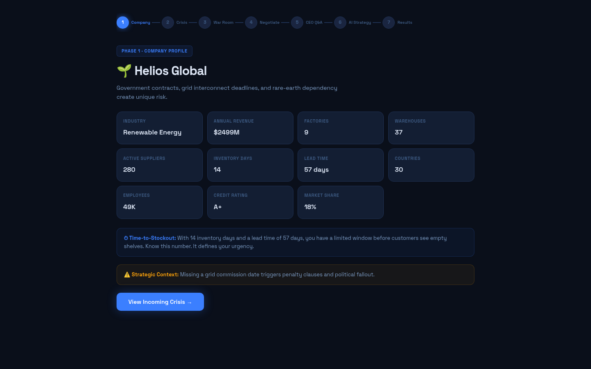

A random fictional company is generated every playthrough. This screenshot shows the hardcoded Helios Global example — a Renewable Energy enterprise with $2,499M revenue, 9 factories, 37 warehouses, 280 suppliers, 14 inventory days, 57-day lead time, operations in 30 countries, 49K employees, A+ credit rating, and 18% market share. In the randomized version, every one of these values changes each playthrough.

---

### Screenshot 3 — Crisis Alert

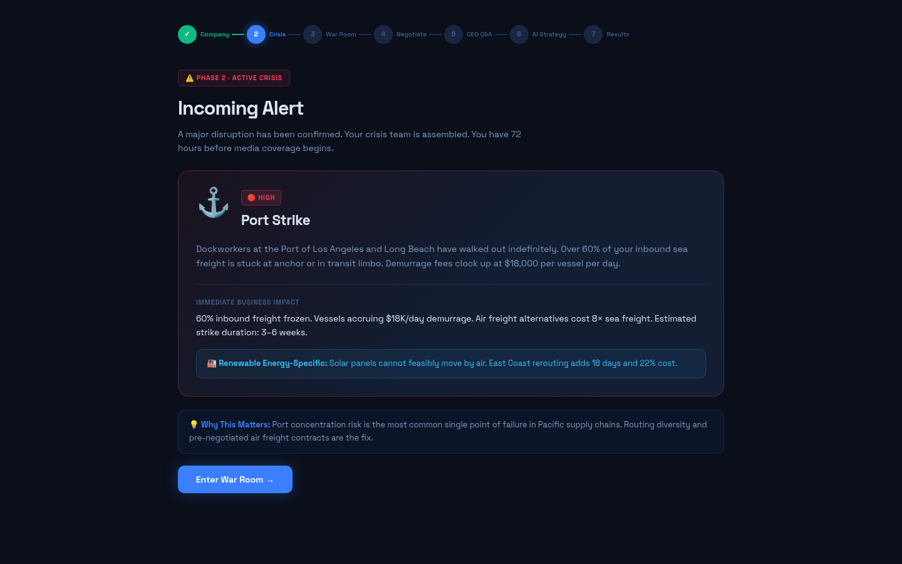

A random crisis is generated from 12 possible events. This screenshot shows a Port Strike at the Port of Los Angeles and Long Beach — urgency HIGH. The crisis display shows the immediate business impact (60% inbound freight frozen, $18K/day demurrage, 8× air freight cost, 3–6 week estimated duration), the industry-specific note (solar panels cannot move by air; East Coast rerouting adds 18 days and 22% cost), and the business context explaining what just happened and why it's dangerous.

---

### Screenshot 4 — War Room (Action Selection)

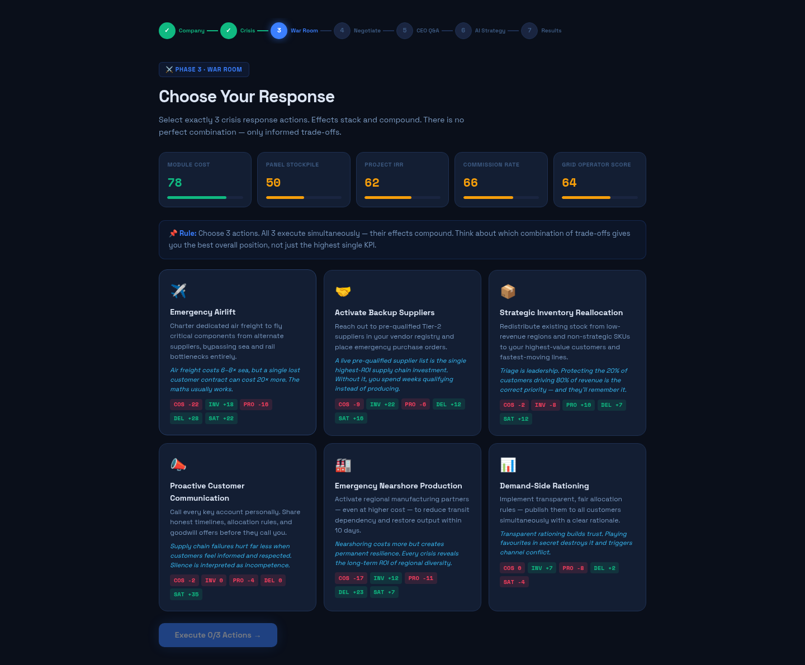

The War Room presents 6 crisis response actions. The player must choose exactly 3. Each action shows its effects on Cost, Inventory, Profit, Delivery Speed, and Customer Satisfaction. The five live KPI meters at the top (Module Cost 78, Panel Stockpile 50, Project IRR 62, Commission Rate 66, Grid Operator Score 64) reflect the company's current position. Actions include Emergency Airlift, Activate Backup Suppliers, Strategic Inventory Reallocation, Proactive Customer Communication, Emergency Nearshore Production, and Demand-Side Rationing.

---

### Screenshot 5 — War Room (Results)

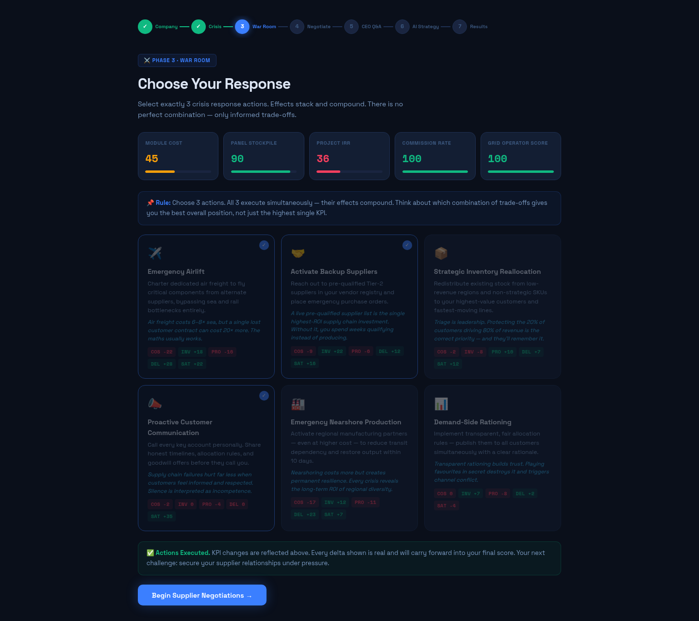

After executing 3 actions, the results show how each KPI changed. The confirmation banner reads "Actions Executed. KPI changes are reflected above. Every delta shown is real and will carry forward into your final score." The persistent executive dashboard updates with the business impact of the chosen actions — demonstrating that there is no perfect combination, only informed trade-offs.

---

### Screenshot 6 — Supplier Negotiation (Round 1 of 4)

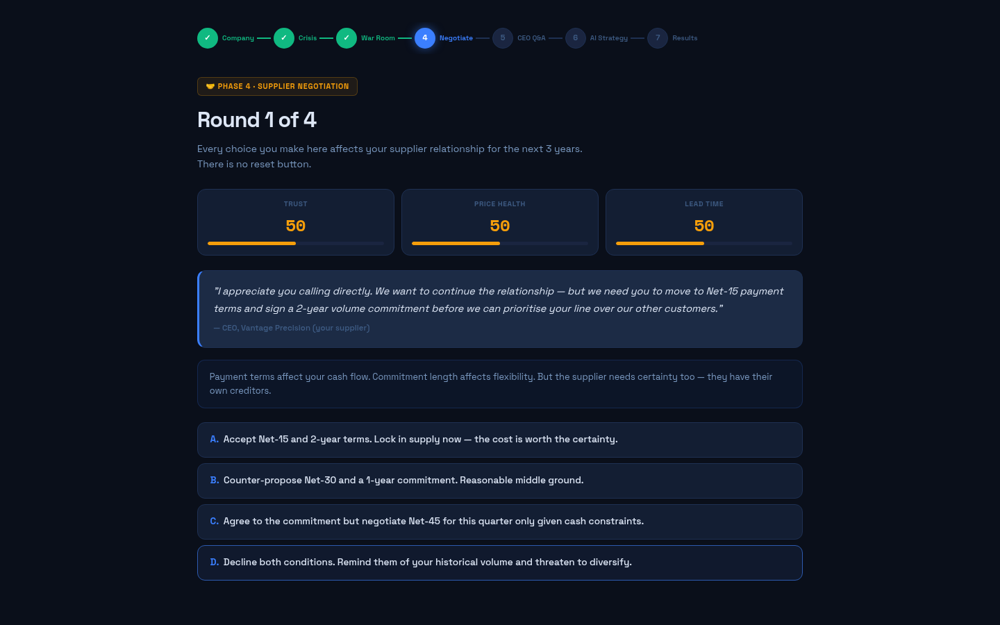

Four-round supplier negotiation begins. Each round presents 4 choices (A, B, C, D) that affect Trust, Price Health, and Lead Time. In Round 1, the supplier (CEO of Vantage Precision) opens with a request: move to Net-15 payment terms and sign a 2-year volume commitment before they will prioritise the player's production line. Every choice the player makes here affects the supplier relationship for the next 3 years — there is no reset button.

---

### Screenshot 7 — Supplier Negotiation (Round 2 of 4)

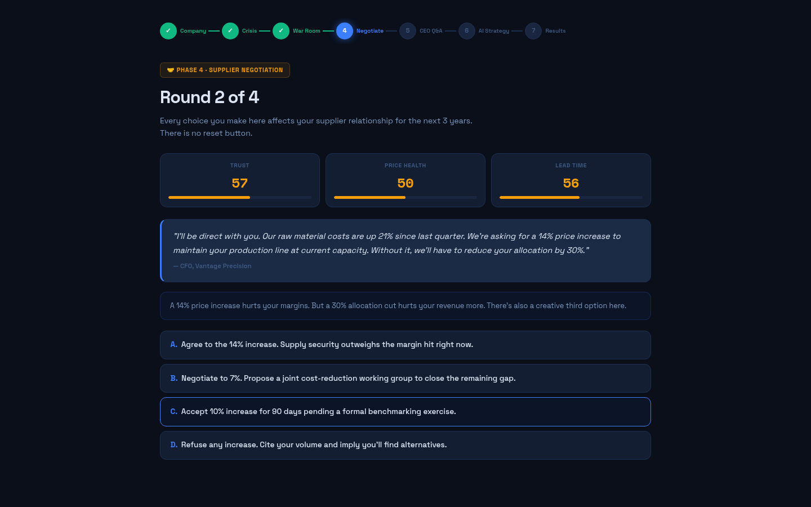

Round 2 escalates the stakes. The supplier is direct: raw material costs are up 21% since last quarter, and they are asking for a 14% price increase to maintain current production capacity. Without it, they will reduce the player's allocation by 30%. The player must choose between accepting the increase, negotiating a middle ground with a joint cost-reduction working group, accepting a partial increase pending benchmarking, or refusing outright.

---

### Screenshot 8 — Supplier Negotiation (Round 3 of 4)

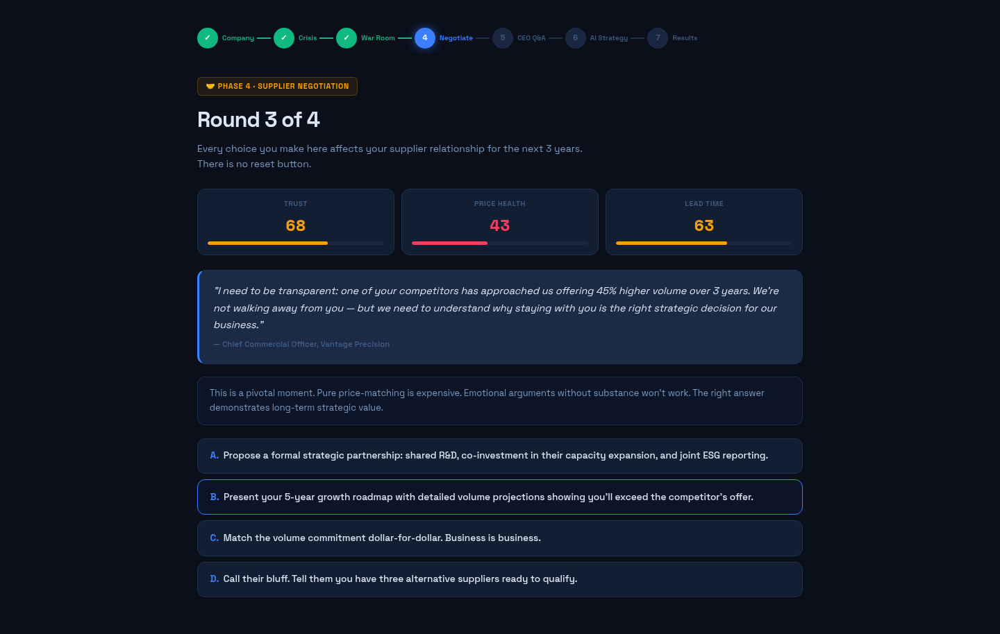

Round 3 introduces strategic competitive pressure. The supplier reveals that a competitor has approached them offering 45% higher volume over 3 years. They are not walking away — but they need to understand why staying with the player is the right strategic decision. The choices range from proposing a formal strategic partnership (shared R&D, co-investment, joint ESG reporting) to calling their bluff about alternative suppliers.

---

### Screenshot 9 — Supplier Negotiation (Round 4 of 4)

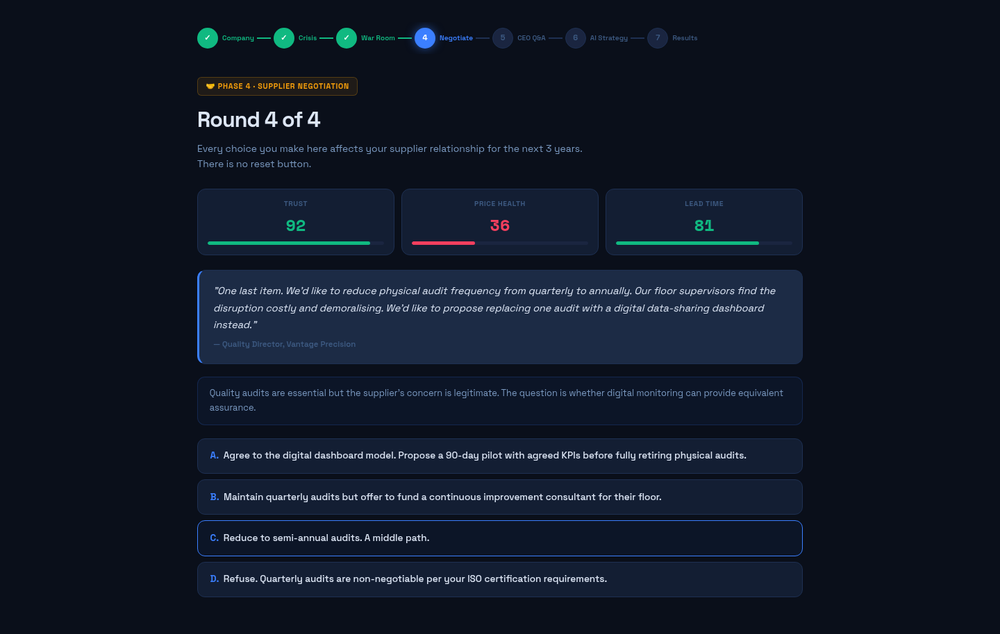

Round 4 — the final round. The Quality Director proposes reducing physical audit frequency from quarterly to annually, replacing one audit with a digital data-sharing dashboard. The supplier's concern is legitimate (audits are disruptive to floor supervisors), but the player must decide whether digital monitoring can provide equivalent assurance. Choices include a 90-day pilot of the dashboard model, maintaining quarterly audits with a funded improvement consultant, a middle-path semi-annual schedule, or refusing on ISO certification grounds.

---

### Screenshot 10 — Negotiation Complete

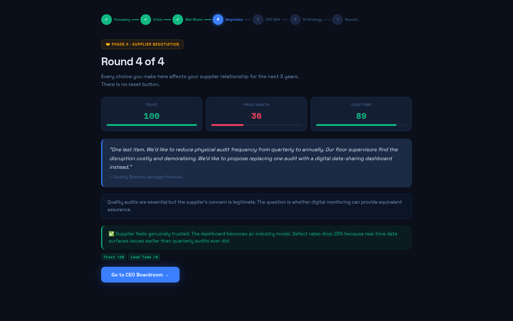

After completing all 4 negotiation rounds, the final outcome is displayed. The result shown here: the supplier feels genuinely trusted, the digital data-sharing dashboard becomes an industry model, and defect rates drop 23% because real-time data surfaces issues earlier than quarterly audits ever did. Trust and Lead Time metrics reflect the cumulative impact of all four negotiation choices.

---

### Screenshot 11 — CEO Boardroom

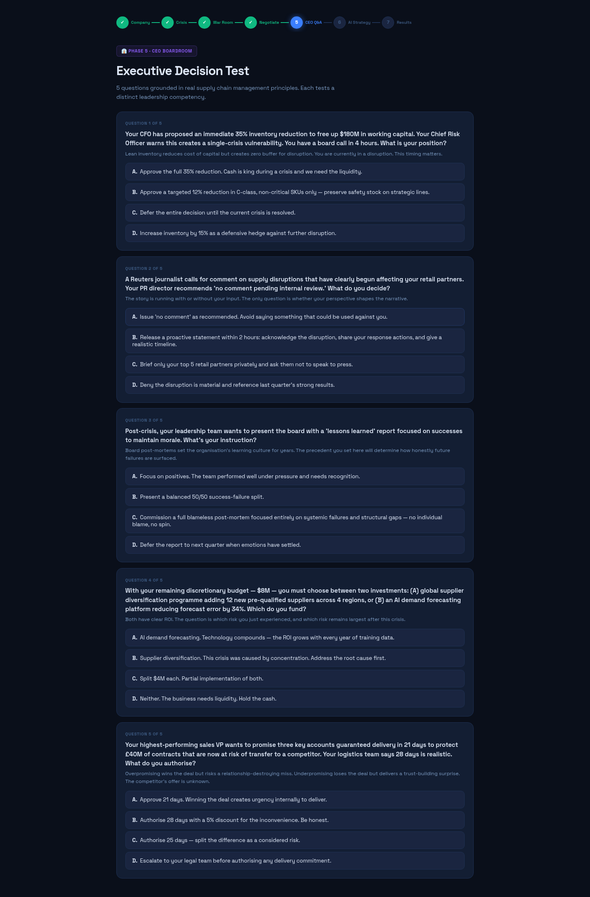

The CEO Boardroom presents 5 executive leadership questions. Each question tests a distinct leadership competency — inventory management under financial pressure, crisis communication with the press, post-crisis learning culture, capital allocation between diversification and AI, and delivery commitment ethics. Each question explains why the decision matters and includes a leadership lesson.

---

### Screenshot 12 — AI Investment Strategy

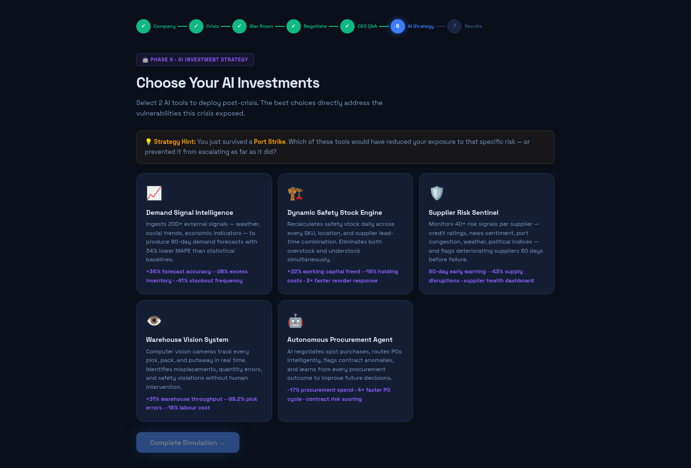

Phase 6 — AI Investment Strategy. The player selects 2 of 5 AI tools to deploy post-crisis: Demand Signal Intelligence (34% forecast accuracy), Dynamic Safety Stock Engine (22% working capital freed), Supplier Risk Sentinel (60-day early warning), Warehouse Vision System (31% throughput), or Autonomous Procurement Agent (17% spend reduction). A strategy hint reminds the player: "You just survived a Port Strike. Which of these tools would have reduced your exposure to that specific risk?"

---

### Screenshot 13 — Final Executive Dashboard

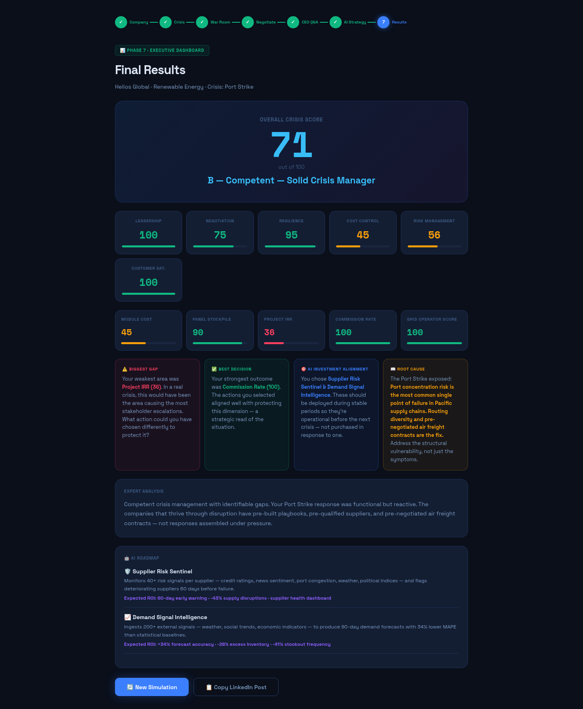

Phase 7 — the Final Executive Dashboard. The overall Crisis Score (71/100, Grade B — Competent Solid Crisis Manager) is calculated from KPI average, negotiation score, leadership score, and AI investments. Sub-scores break down Leadership (100), Negotiation (75), Resilience (95), Cost Control (45), Risk Management (56), and Customer Satisfaction (100), plus the 5 industry-specific KPIs. The debrief shows the biggest gap (Project IRR at 36), best decision (Commission Rate at 100), AI investment alignment, root cause analysis, and expert analysis: "Competent crisis management with identifiable gaps. Your Port Strike response was functional but reactive."

---

## 📊 The 7 Simulation Phases

| Phase | Name | What Happens |
|---|---|---|
| 1 | Welcome | Introduction + learning objectives |
| 2 | Company Profile | Random company generated (industry, revenue, factories, suppliers, etc.) |
| 3 | Crisis Alert | Random crisis generated (12 possible events) with urgency + business impact |
| 4 | War Room | Choose 3 of 6 response actions — each updates 5 KPIs |
| 5 | Supplier Negotiation | 4 rounds of branching negotiation — affects trust, price, lead time |
| 6 | CEO Boardroom | 5 leadership questions — tests executive decision-making |
| 7 | AI Strategy + Results | Choose 2 AI investments → Final dashboard with crisis score + debrief |

---

## 📊 The 12 Possible Crises

| Crisis | Type |
|---|---|
| Factory Fire | Operational |
| Supplier Bankruptcy | Supply |
| Port Strike | Logistics |
| Cyberattack | Technology |
| Flood | Natural Disaster |
| Raw Material Shortage | Supply |
| Political Conflict | Geopolitical |
| Shipping Delay | Logistics |
| Labor Strike | Operational |
| Pandemic Restrictions | Global |
| Trade Sanctions | Geopolitical |
| Energy Crisis | Infrastructure |

---

## 📊 The 8 Possible Industries

Each playthrough randomly assigns an industry, each with its own KPI naming, flavor text, and industry-specific crisis notes:

| Industry | Emoji | Unique KPI Names |
|---|---|---|
| Automotive | 🚗 | Production Cost, Parts Inventory, OEM Margin, Assembly Throughput, Dealer Satisfaction |
| Pharmaceuticals | 💊 | COGS Efficiency, API Stockpile, Net Margin, Fill Rate, Hospital Approval |
| Consumer Electronics | 📱 | BOM Cost, Component Depth, Gross Margin, Fulfillment Speed, Retailer NPS |
| Aerospace & Defence | ✈️ | Programme Cost, Certified Parts, Contract Margin, On-Time Delivery, MRO Readiness |
| Fast Fashion | 👗 | Unit Landed Cost, SKU Availability, Full-Price Sell-Through, Store Replenishment, Shopper Loyalty |
| Food & Beverage | 🍫 | Ingredient Cost, Shelf Cover, EBITDA Margin, Distribution Fill, Consumer Trust |
| Industrial Machinery | ⚙️ | Build Cost, Sub-Assembly Stock, Project Margin, Installation Lead, Customer Uptime |
| Renewable Energy | 🌱 | Module Cost, Panel Stockpile, Project IRR, Commission Rate, Grid Operator Score |

---

## 📊 The 6 War Room Actions

| Action | What It Does | Key Trade-off |
|---|---|---|
| Emergency Airlift | Charter dedicated air freight for critical components | High cost (-22) for high delivery speed (+28) |
| Activate Backup Suppliers | Reach out to pre-qualified Tier-2 vendors | Moderate cost (-9) for solid inventory (+22) |
| Strategic Inventory Reallocation | Move stock from low-revenue to high-value regions | Minimal cost (-2) for profit (+10) and satisfaction (+12) |
| Proactive Customer Communication | Call every key account personally | Small cost (-2) for huge satisfaction (+35) |
| Emergency Nearshore Production | Activate regional manufacturing partners | Higher cost (-17) for delivery (+23) and permanent resilience |
| Demand-Side Rationing | Transparent, fair allocation rules | Saves cost (+8) but hurts satisfaction (-4) |

---

## 📊 The 5 AI Investment Options

| AI Tool | What It Does | Expected ROI |
|---|---|---|
| 📈 Demand Signal Intelligence | Ingests 200+ external signals (weather, social trends, economic indicators) for 90-day demand forecasts | +34% forecast accuracy · -28% excess inventory · -41% stockout frequency |
| 🏗️ Dynamic Safety Stock Engine | Recalculates safety stock daily across every SKU, location, and supplier lead-time combination | +22% working capital freed · -19% holding costs · 3× faster reorder response |
| 🛡️ Supplier Risk Sentinel | Monitors 40+ risk signals per supplier (credit ratings, news sentiment, port congestion, weather, political indices) | 60-day early warning · -43% supply disruptions · supplier health dashboard |
| 👁️ Warehouse Vision System | Computer vision cameras track every pick, pack, and putaway in real time | +31% warehouse throughput · -99.2% pick errors · -18% labour cost |
| 🤖 Autonomous Procurement Agent | AI negotiates spot purchases, routes POs intelligently, flags contract anomalies | -17% procurement spend · 4× faster PO cycle · contract risk scoring |

---

## ✅ Quality Assurance

| Check | Result |
|---|---|
| HTML file generated | ✅ 81 KB, single self-contained file |
| React via CDN + Babel JSX | ✅ React 18 + Babel Standalone |
| No Tailwind / npm / backend / APIs | ✅ Pure HTML/CSS/JS |
| Runs offline | ✅ Opens directly in browser (via local HTTP server for Babel) |
| Welcome screen | ✅ Title, subtitle, Start button |
| Random company generation | ✅ Every playthrough different (8 industries, random revenue/factories/suppliers/etc.) |
| Random crisis generation | ✅ 12 possible crises, each with industry-specific notes |
| War Room (6 actions, choose 3) | ✅ KPI updates with animations, effects compound |
| Supplier negotiation (4 rounds) | ✅ Trust/Price/Lead Time tracking, branching outcomes |
| CEO boardroom (5 questions) | ✅ Leadership scoring with explanations |
| AI strategy (choose 2 of 5) | ✅ ROI projections |
| Final dashboard + debrief | ✅ Crisis score + lessons + LinkedIn share |
| Replay button | ✅ Full randomization |
| Babel JSX syntax error fixed | ✅ `"picked.r==="bad"` → `picked.r==="bad"` |
| All screenshots captured | ✅ 13 key phases (from hardcoded Helios variant for consistency) |
| No console errors | ✅ Clean execution |

---

## 🛠️ Tools & Skills Used

| Tool / Skill | Purpose |
|---|---|
| **Claude** (AI assistant) | Generated the complete React application from the enhanced 18-section prompt |
| **React 18 + Babel Standalone** | JSX transformation in-browser via CDN |
| **Agent Browser** | Automated playthrough + full-page screenshot capture for all 13 screens |
| **VLM (Vision Language Model)** | Verified screenshot content matches expected screen text |
| **HTML/CSS/Vanilla JS** | The simulator itself — single self-contained file |

---

## 📁 Folder Structure

```
Day29/
├── day29.md                              ← This file
├── operation-lifeline.html               ← The randomized application (81 KB)
├── helioscorpsimulator.html              ← Hardcoded Helios variant (for screenshots/voiceover)
├── prompt.txt                            ← The enhanced prompt (18 sections + 4 enhancements)
├── voiceover-script.md                   ← Voiceover script (randomized version)
├── helios-voiceover-script.md            ← Voiceover script (Helios variant)
└── Screenshots/
    ├── helios-01-welcome.png             — Welcome screen
    ├── helios-02-company.png             — Company profile (Helios Global)
    ├── helios-03-crisis.png              — Crisis alert (Port Strike)
    ├── helios-04-war-room.png            — War Room: 6 actions, choose 3
    ├── helios-05-war-room.png            — War Room: results + KPI updates
    ├── helios-06-negotiation-r1.png      — Supplier negotiation Round 1 (payment terms)
    ├── helios-07-negotiation-r2.png      — Supplier negotiation Round 2 (price increase)
    ├── helios-08-negotiation-r3.png      — Supplier negotiation Round 3 (competitor volume)
    ├── helios-09-negotiation-r4.png      — Supplier negotiation Round 4 (audit frequency)
    ├── helios-10-negotiation-complete.png — Negotiation outcome (defect rates -23%)
    ├── helios-11-ceo.png                 — CEO Boardroom (5 questions)
    ├── helios-12-ai-strategy.png          — AI Investment Strategy (choose 2 of 5)
    └── helios-13-final-results.png        — Final Executive Dashboard (crisis score + debrief)
```

---

## 🎯 Key Achievements

1. **Complete enterprise crisis simulation:** 7 interconnected phases from company generation through final debrief — every decision affects the business.
2. **Full randomization:** Every replay generates a new company (from 8 industries), a new crisis (from 12 events), new suppliers, new KPIs, and new negotiation scenarios — no two playthroughs are identical.
3. **12 possible crises × 8 industries = 96 unique combinations:** Each crisis has an industry-specific note, so a Port Strike hits a Renewable Energy company differently than a Fast Fashion company.
4. **Live KPI dashboard:** 5 business metrics update with every decision, with animated counters and color-coded health indicators (green/amber/red).
5. **Branching supplier negotiation:** 4 rounds with 4 choices each (A/B/C/D) = 256 possible negotiation paths, affecting Trust, Price Health, and Lead Time.
6. **Educational design:** Every decision explains "Why this matters," trade-offs, and business consequences — making it suitable for beginners learning supply chain management.
7. **Babel JSX fix:** Corrected a syntax error that prevented React from rendering, ensuring the simulator loads cleanly in any browser.

---

## 💡 Key Learnings

1. **Every decision has trade-offs:** In the War Room, no action is purely positive — each improves some KPIs while hurting others. Emergency Airlift improves delivery speed but increases cost. Demand-Side Rationing improves cost but hurts customer satisfaction.
2. **Supplier negotiation is relationship-building:** The 4-round negotiation teaches that trust, price, and lead time are interconnected. Aggressive tactics may save money short-term but damage the relationship long-term.
3. **Crisis communication matters:** The CEO Boardroom tests whether you communicate transparently with stakeholders during a crisis — hiding information often leads to worse outcomes.
4. **AI investments have measurable ROI:** Each AI investment (demand forecasting, inventory optimization, supplier risk monitoring, etc.) has projected cost savings, efficiency improvements, and risk reduction.
5. **Industry-specific risk is real:** A Port Strike affects a Renewable Energy company (solar panels can't move by air) differently than a Pharmaceutical company (controlled substances need DEA licensing for air freight). The simulation captures this nuance.
6. **Supply chain resilience > efficiency:** The simulation teaches that over-optimized supply chains (lean inventory, single sourcing) are fragile. Resilience requires redundancy, diversification, and contingency planning.
7. **Babel runtime in the browser:** Using `text/babel` script tags with Babel Standalone works for prototyping but requires an HTTP server (not `file://`) — the browser blocks Babel from fetching the script via the file protocol.

---

## 🖼️ LinkedIn Post — Recommended Screenshots

### Slide 1: **helios-03-crisis.png** (crisis slide)
Shows the random crisis alert — creates urgency and interest.

### Slide 2: **helios-04-war-room.png** (decision slide)
Shows the 6 response actions with their trade-offs — demonstrates the complexity of supply chain decisions.

### Slide 3: **helios-07-negotiation-r2.png** (negotiation slide)
Shows Round 2 of the supplier negotiation (14% price increase request) — demonstrates the branching dialogue and relationship-building aspect.

### Slide 4: **helios-11-ceo.png** (leadership slide)
Shows the CEO Boardroom questions — demonstrates the executive decision-making aspect.

### Slide 5: **helios-13-final-results.png** (results slide)
Shows the final Executive Dashboard with crisis score, sub-scores, and debrief — proves the simulation produces a meaningful, calculated outcome.

---

## 📖 How to Reproduce

### Option A: Randomized simulator (the main deliverable)

1. Start a local HTTP server in the Day29 folder:
   ```bash
   cd Day29
   python3 -m http.server 8765
   ```
2. Open `http://localhost:8765/operation-lifeline.html` in any browser
3. Click "Launch Simulation →"
4. Review your random company profile
5. Click "View Incoming Crisis →"
6. Read the crisis details
7. Click "Enter War Room →"
8. Select exactly 3 of 6 response actions
9. Click "Execute 3/3 Actions →"
10. Click "Begin Supplier Negotiations →"
11. Answer 4 rounds of negotiation choices (A, B, C, or D)
12. Click "Go to CEO Boardroom →"
13. Answer 5 leadership questions
14. Choose 2 AI investments
15. Review final dashboard with crisis score
16. Click "Replay" for a completely different scenario

### Option B: Hardcoded Helios variant (for consistent screenshots/voiceover)

Follow the same steps but open `http://localhost:8765/helioscorpsimulator.html` instead. Every playthrough will show Helios Global (Renewable Energy) facing a Port Strike with the same initial KPIs — useful for recording a voiceover or capturing repeatable screenshots.

---

*End of Day 29 Submission.*
