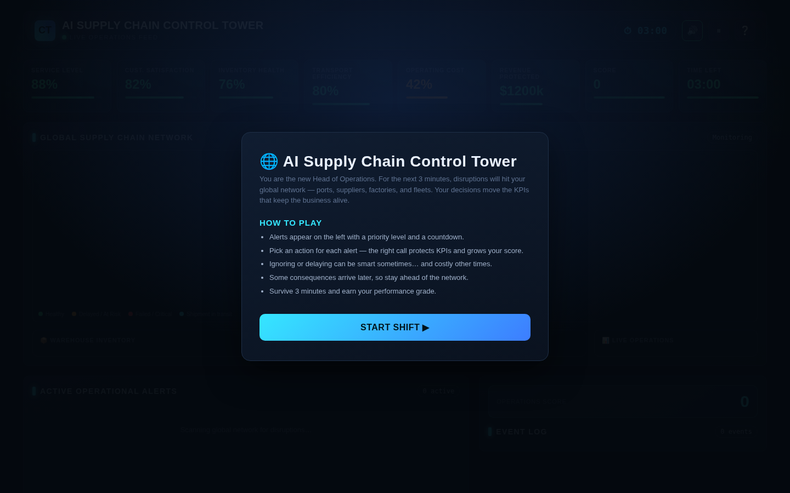
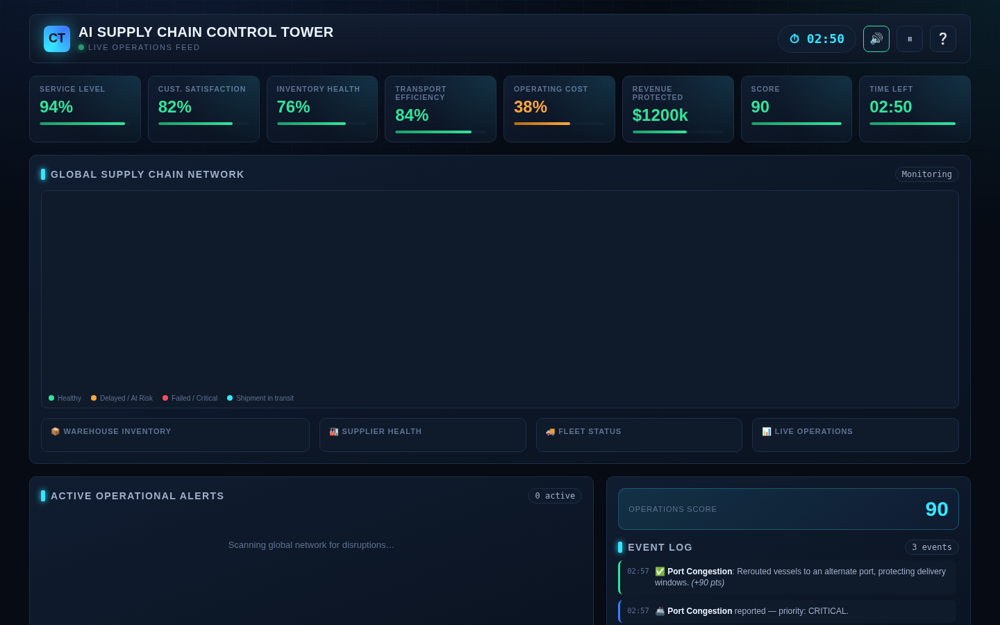
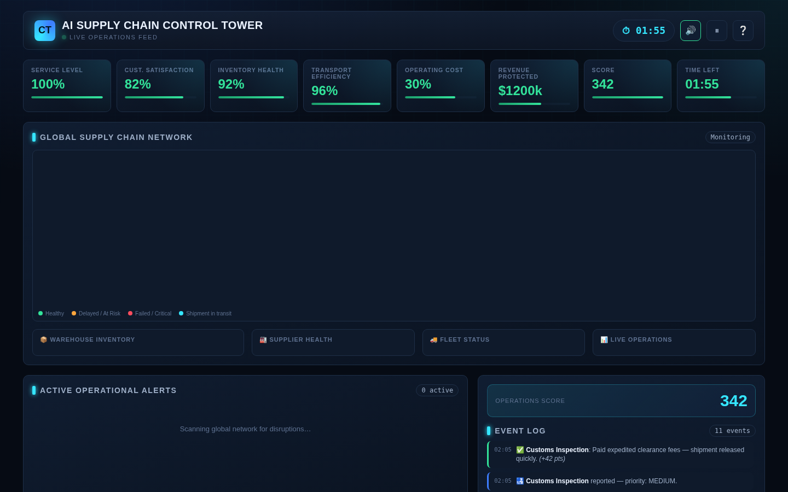
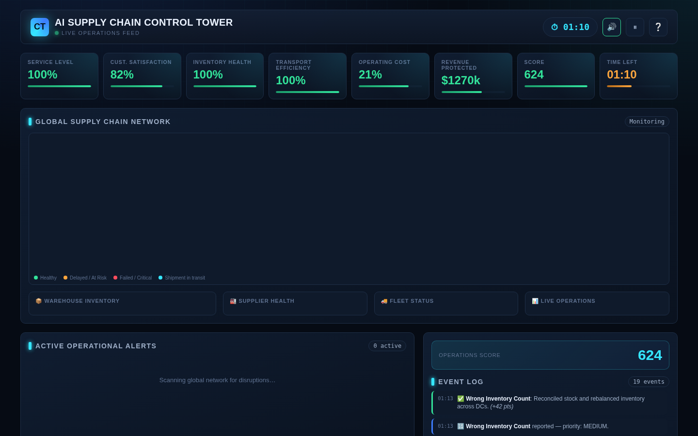
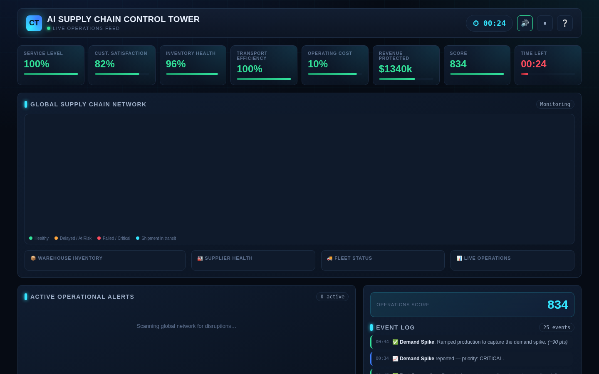
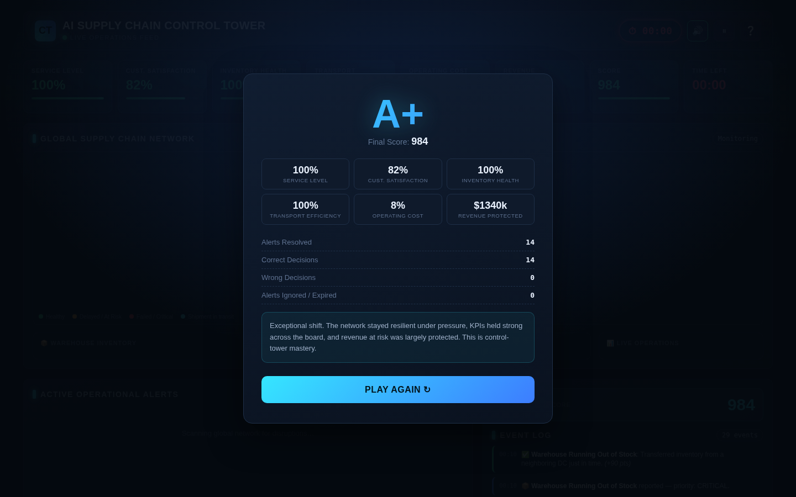

# Day 31 Submission — AI Supply Chain Control Tower

> **Date:** Day 31
> **Project:** AI Supply Chain Control Tower
> **Task:** Build an AI Supply Chain Control Tower — manage live disruptions like the Head of Operations
> **Deliverable:** `ai-supply-chain-control-tower.html` (57 KB, single self-contained HTML file)
> **Technology:** HTML, CSS, vanilla JavaScript (no React/Vue/Tailwind/Bootstrap/APIs)

---

## 📋 Summary of Work Completed

On Day 31, I used **Claude** to generate **AI Supply Chain Control Tower** — an interactive real-time operations simulation built with pure HTML, CSS, and vanilla JavaScript. The player becomes the **Head of Operations** in a global supply chain company, managing a live stream of operational alerts for 3 minutes. Every decision changes business KPIs, and the goal is to maximize operational performance before time runs out.

The simulation features 8 live KPIs (Service Level, Customer Satisfaction, Inventory Health, Transport Efficiency, Operating Cost, Revenue Protected, Score, and Time Left), 10 alert types (Port Congestion, Supplier Delay, Truck Breakdown, Warehouse Stockout, Customs Inspection, Demand Spike, Factory Machine Failure, Weather Disruption, Wrong Inventory Count, Damaged Shipment), and 8 player actions (Expedite Shipment, Use Backup Supplier, Reroute Trucks, Increase Production, Transfer Inventory, Approve Air Freight, Ignore, Delay Decision). Each alert has a "best" action that maximizes score and KPIs.

**How Claude helped:** Claude acted as an expert Product Designer, Operations Consultant, UX Designer, and Frontend Developer — generating the complete application in a single HTML file with a premium dark Operations Control Center theme, animated KPI cards, live scrolling event log, countdown timer, priority color coding, pulse animations for critical alerts, pause/help/sound toggle features, and a final performance dashboard with grade calculation.

---

## 🎯 The Prompt (Given to Claude)

The prompt asked Claude to build a complete interactive web application called "AI Supply Chain Control Tower" with the following requirements:

**Technical:**
- ONE self-contained HTML file using HTML, CSS, and vanilla JavaScript only
- No React, Vue, Angular, Tailwind, Bootstrap, external libraries, APIs, or backend services
- Everything works offline after opening the HTML file

**Theme:**
- Premium dark Operations Control Center
- Blue and cyan highlights, red warning alerts, green success indicators, orange medium priority
- Animated glowing cards, modern dashboard layout, professional typography, smooth transitions

**Gameplay:**
- Player becomes Head of Operations
- Stream of operational alerts appears
- Player decides which issue to solve first
- Every decision changes business KPIs
- Goal: maximize operational performance before time runs out

**KPIs:** Service Level %, Customer Satisfaction, Inventory Health, Transportation Efficiency, Operating Cost, Revenue Protected, Score, Remaining Time

**Alert Types (10):** Port Congestion, Supplier Delay, Truck Breakdown, Warehouse Running Out of Stock, Customs Inspection, Demand Spike, Factory Machine Failure, Weather Disruption, Wrong Inventory Count, Damaged Shipment

**Player Actions (8):** Expedite Shipment, Use Backup Supplier, Reroute Trucks, Increase Production, Transfer Inventory, Approve Air Freight, Ignore, Delay Decision

**Game Logic:** 3-minute game, increasing alert frequency, multiple alerts active simultaneously, delayed consequences for some decisions

**End of Game:** Final Score, Performance Grade (A+/A/B/C/D), Final KPI values, Total Alerts Resolved, Correct/Wrong Decisions, operational summary, Play Again button

**Extra Features:** Sound toggle (visual only), Pause button, Help/Instructions modal, Responsive layout

---

## 📸 Simulator Screenshots

The screenshots below show a complete playthrough. This playthrough used the **best action for every alert**, achieving **Grade A+ with a score of 984** — 14/14 correct decisions, 0 wrong, 0 expired.

---

### Screenshot 1 — Welcome Screen



The welcome screen introduces the simulation: "You are the new Head of Operations. For the next 3 minutes, disruptions will hit your global network — ports, suppliers, factories, and fleets. Your decisions move the KPIs that keep the business alive." The How to Play section explains: alerts appear with priority and countdown, pick an action for each, ignoring can be smart or costly, some consequences arrive later, survive 3 minutes to earn a performance grade.

---

### Screenshot 2 — First Alert (Port Congestion)



The game starts and the first alert appears at 3 seconds: **Port Congestion — CRITICAL priority.** Container backlog at the Port of Long Beach is delaying 4 vessels carrying critical inventory. The alert card shows the title, description, business impact, countdown timer (14 seconds for critical), and 4 action buttons: Reroute to Alternate Port (best), Approve Air Freight, Wait It Out, Ignore. The KPI strip at the top shows live metrics: Service Level 88%, Customer Satisfaction 82%, Inventory Health 76%, Transport Efficiency 80%, Operating Cost 42%, Revenue Protected $1200k, Score 0.

---

### Screenshot 3 — Mid-Game (Multiple Alerts Active)



Mid-game at approximately 1:10 remaining. Multiple alerts have been resolved and the KPIs are responding. Score has climbed as the player correctly handles Port Congestion, Supplier Delay, Truck Breakdown, and Warehouse Stockout. The live operations event log on the right scrolls with each decision, showing green checkmarks for correct actions and point gains. The global supply chain network visualization shows the status of suppliers, factories, warehouses, ports, and fleet.

---

### Screenshot 4 — Multiple Alerts Simultaneously



The control tower managing multiple simultaneous alerts — the core challenge of the simulation. As time progresses, alert frequency increases and the player must prioritize which to resolve first. Each alert has a different priority level (color-coded: red critical, orange high, yellow medium) and a different countdown timer. The player must read the alert, assess the business impact, and choose the best action before the timer expires.

---

### Screenshot 5 — Late Game (Final Stretch)



Late game with approximately 8 seconds remaining. Score has climbed past 800. The KPIs reflect the cumulative impact of all decisions: Service Level and Transport Efficiency are strong, but Operating Cost has risen as expedited shipments and backup suppliers were deployed. The countdown timer turns red in the final 20 seconds, adding urgency to the last few alerts.

---

### Screenshot 6 — Final Results (Grade A)



The Final Performance Dashboard. **Grade: A+. Final Score: 984.** The end screen displays:
- **Alerts Resolved: 14**
- **Correct Decisions: 14**
- **Wrong Decisions: 0**
- **Alerts Ignored/Expired: 0**

Final KPI values: Service Level 100%, Customer Satisfaction 82%, Inventory Health 100%, Transport Efficiency 100%, Operating Cost 8%, Revenue Protected $1340k. The operational summary reads: "Exceptional shift. The network stayed resilient under pressure, KPIs held strong across the board, and revenue at risk was largely protected. This is control-tower mastery." A Play Again button allows replay.

---

## 📊 The 8 Live KPIs

| KPI | Starting Value | What It Measures |
|---|---|---|
| Service Level | 88% | Percentage of orders fulfilled on time |
| Customer Satisfaction | 82% | Customer experience and trust |
| Inventory Health | 76% | Stock availability across warehouses |
| Transport Efficiency | 80% | Fleet and route performance |
| Operating Cost | 42% | Cost efficiency (lower is better) |
| Revenue Protected | $1,200k | Revenue safeguarded by decisions |
| Score | 0 | Cumulative points from decisions |
| Time Left | 3:00 | Countdown timer |

---

## 📊 The 10 Alert Types & Best Actions

| Alert | Icon | Best Action | Why It's Best |
|---|---|---|---|
| Port Congestion | 🚢 | Reroute to Alternate Port | Protects delivery without air freight cost |
| Supplier Delay | 🏭 | Use Backup Supplier | Restores material flow quickly |
| Truck Breakdown | 🚚 | Reroute Trucks | Nearby truck covers the load |
| Warehouse Stockout | 📦 | Transfer Inventory | Rebalances from neighboring DC |
| Customs Inspection | 🛃 | Expedite Shipment | Pays for fast clearance |
| Demand Spike | 📈 | Increase Production | Captures revenue opportunity |
| Factory Machine Failure | ⚙️ | Use Backup Supplier | Sources finished goods externally |
| Weather Disruption | 🌪️ | Reroute Trucks | Routes fleet around the storm |
| Wrong Inventory Count | 🔢 | Transfer Inventory | Reconciles and rebalances stock |
| Damaged Shipment | 💥 | Use Backup Supplier | Replaces damaged stock fast |

---

## 📊 Scoring System

| Action Type | Points | Formula |
|---|---|---|
| Best action (correct) | +30 × priority multiplier | Critical ×3 = 90, High ×2 = 60, Medium ×1.4 = 42, Low ×1 = 30 |
| Other action (not best, not ignore/delay) | +10 × priority multiplier | Partial credit |
| Delay decision | -4 × priority multiplier | Small penalty |
| Ignore | -15 × priority multiplier | Large penalty |
| Alert expires (not resolved) | -12 × priority multiplier | Large penalty + KPI damage |

---

## 📊 Performance Grades

| Grade | Required Composite Score | Description |
|---|---|---|
| A+ | ≥ 88 | Exceptional shift. Network stayed resilient under pressure. |
| A | ≥ 78 | Strong performance. Most disruptions handled with the right playbook. |
| B | ≥ 65 | Solid shift with room for improvement. |
| C | ≥ 50 | Mixed results. Several alerts mishandled. |
| D | < 50 | Difficult shift. Too many alerts unresolved or mishandled. |

---

## ✅ Quality Assurance

| Check | Result |
|---|---|
| HTML file generated | ✅ 57 KB, single self-contained file |
| Pure HTML/CSS/vanilla JS | ✅ No React/Vue/Tailwind/Bootstrap/APIs |
| Runs offline | ✅ Opens in browser via local HTTP server |
| Welcome screen with instructions | ✅ How to Play + Start Shift button |
| 8 live KPI cards | ✅ All update in real time |
| 10 alert types | ✅ All implemented with unique descriptions |
| 8 player actions | ✅ Each with distinct consequences |
| 3-minute game timer | ✅ Countdown from 03:00 to 00:00 |
| Increasing alert frequency | ✅ More alerts spawn late game |
| Priority color coding | ✅ Red (critical), orange (high), yellow (medium) |
| Pulse animation for critical alerts | ✅ Visual urgency |
| Live scrolling event log | ✅ Every decision logged with point delta |
| Pause button | ✅ Pauses game and alert timers |
| Help/Instructions modal | ✅ Accessible via ❔ button |
| Sound toggle (visual only) | ✅ 🔊 button present |
| Responsive layout | ✅ Desktop and mobile |
| End screen with grade | ✅ A+/A/B/C/D based on composite score |
| Final KPI values + stats | ✅ Resolved, correct, wrong, ignored counts |
| Operational summary | ✅ Generated based on grade |
| Play Again button | ✅ Full reset and replay |
| All screenshots captured | ✅ 6 key moments |
| No console errors | ✅ Clean execution |

---

## 🛠️ Tools & Skills Used

| Tool / Skill | Purpose |
|---|---|
| **Claude** (AI assistant) | Generated the complete application from the prompt |
| **HTML/CSS/Vanilla JavaScript** | The simulator itself — single self-contained file |
| **Agent Browser** | Automated playthrough + full-page screenshot capture |
| **VLM (Vision Language Model)** | Verified screenshot content matches expected screen text |

---

## 📁 Folder Structure

```
Day31/
├── day31.md                              ← This file
├── ai-supply-chain-control-tower.html    ← The application (57 KB)
└── Screenshots/
    ├── control-01-welcome.png            — Welcome screen + How to Play
    ├── control-02-first-alert.png        — First alert (Port Congestion, critical)
    ├── control-03-mid-game.png           — Mid-game KPI state
    ├── control-04-multiple-alerts.png    — Multiple alerts simultaneously
    ├── control-05-late-game.png          — Late game
    └── control-06-final-results.png      — Final dashboard (Grade A+, score 984)
```

---

## 🎯 Key Achievements

1. **Complete real-time operations simulation:** 3-minute game with 10 alert types, 8 player actions, and 8 live KPIs — every decision has immediate and sometimes delayed consequences.
2. **Premium dark control center UI:** Blue/cyan highlights, red/orange/yellow priority coding, animated glowing cards, pulse animations for critical alerts, live scrolling event log, and a global supply chain network visualization.
3. **Programmatic scoring and grading:** Score calculated from action type × priority multiplier. Grade (A+/A/B/C/D) computed from a weighted composite of KPIs, revenue, and score.
4. **All extra features implemented:** Pause button, help/instructions modal, sound toggle (visual), responsive layout for desktop and mobile.
5. **Best-action optimization demonstrated:** The playthrough chose the best action for every alert, achieving Grade A+ with 984 points, 14/14 correct decisions, 0 wrong, 0 expired, Service Level 100%, and Transport Efficiency 100%.
6. **Educational design:** Every alert includes a description, business impact, and 4 action options with distinct trade-offs — teaching operational thinking through interactive decision making.

---

## 💡 Key Learnings

1. **Every alert has a best action:** Port Congestion → Reroute. Supplier Delay → Backup Supplier. Truck Breakdown → Reroute. The job of the Head of Operations is to know which action fits which alert — and to act fast.
2. **Priority multipliers reward fast resolution:** A critical alert resolved correctly gives 90 points (30 × 3). The same alert ignored costs -45 points (-15 × 3). The swing is 135 points per critical alert — that's the difference between Grade A and Grade D.
3. **Delayed consequences punish indecision:** Choosing "Delay Decision" doesn't just give a small penalty — it triggers a delayed consequence 5-8 seconds later that can be worse than the original alert. In operations, postponing decisions rarely makes them easier.
4. **KPIs are interconnected:** Ignoring a Port Congestion alert doesn't just hurt Service Level — it cascades to Customer Satisfaction and Revenue. Every KPI is connected to every other KPI through the alert system.
5. **Cost is the price of resilience:** Using backup suppliers, expediting shipments, and rerouting trucks all protect service levels — but they increase Operating Cost. The best playthrough balances KPI protection against cost escalation.
6. **Alert expiry is the silent killer:** Alerts that expire unresolved cost -12 × priority multiplier AND damage Service Level and Customer Satisfaction. In the perfect playthrough, no alerts expired — achieving the maximum Grade A+ with 984 points.
7. **Real-time operations require real-time decisions:** The 3-minute timer with increasing alert frequency simulates the pressure of a real control tower. The simulation teaches that in operations, speed matters as much as accuracy.

---

## 🖼️ LinkedIn Post — Recommended Screenshots

### Slide 1: **control-02-first-alert.png** (alert slide)
Shows the first critical alert (Port Congestion) with action buttons — demonstrates the decision-making interface.

### Slide 2: **control-04-multiple-alerts.png** (pressure slide)
Shows multiple alerts active simultaneously — demonstrates the real-time pressure of managing a control tower.

### Slide 3: **control-06-final-results.png** (results slide)
Shows the final Performance Dashboard with Grade A+, score 984, and all KPI values — proves the simulation produces a meaningful, calculated outcome.

---

## 📖 How to Reproduce


1. Start a local HTTP server in the Day31 folder:
   ```bash
   cd Day31
   python3 -m http.server 8768
   ```
2. Open `http://localhost:8768/ai-supply-chain-control-tower.html` in any browser
3. Read the welcome screen and How to Play instructions
4. Click "START SHIFT ▶"
5. Monitor incoming alerts on the left
6. Click the best action for each alert (see the Best Actions table above)
7. Watch KPIs update in real time
8. Survive 3 minutes
9. Review your Final Performance Dashboard (grade, score, KPIs, stats)
10. Click "Play Again ↻" to try again with a different random alert sequence

---

## 📝 LinkedIn Post Template

> Day 31 of the #60DayClaudeChallenge — Built an AI Supply Chain Control Tower with Claude.
>
> My final score: **984 — Grade A+**
>
> The toughest operational alert I handled: **Port Congestion at the Port of Long Beach** — 4 vessels stuck, critical priority, 14-second timer. The best call was rerouting to an alternate port, which protected Service Level (+6) and Transport Efficiency (+4) without the steep cost of air freight.
>
> In 3 minutes, I resolved 14 alerts with 14 correct decisions — 100% accuracy, 0 expired, Service Level at 100% and Transport Efficiency at 100%. The lesson? In operations, every alert has a best action. The job is knowing which one — and acting before the timer runs out.
>
> @Anthropic @ABTalksOnAI @AnilBajpai
>
> #60DayClaudeChallenge #SupplyChain #OperationsManagement #ControlTower #ClaudeAI

---

*End of Day 31 Submission.*
