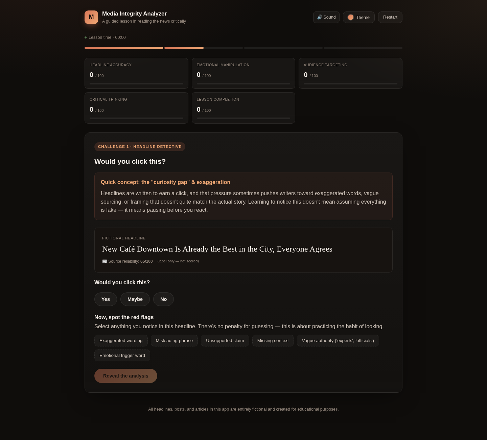
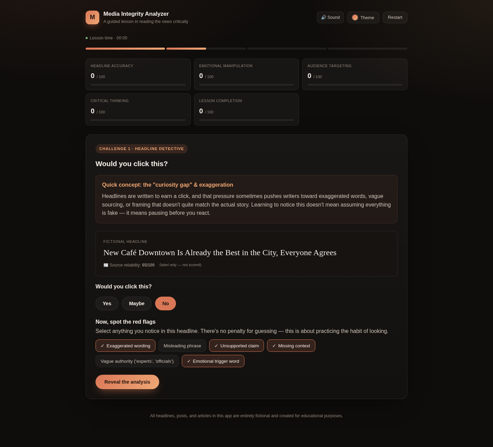
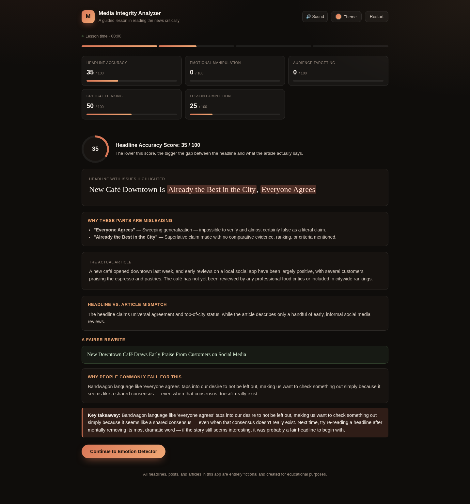
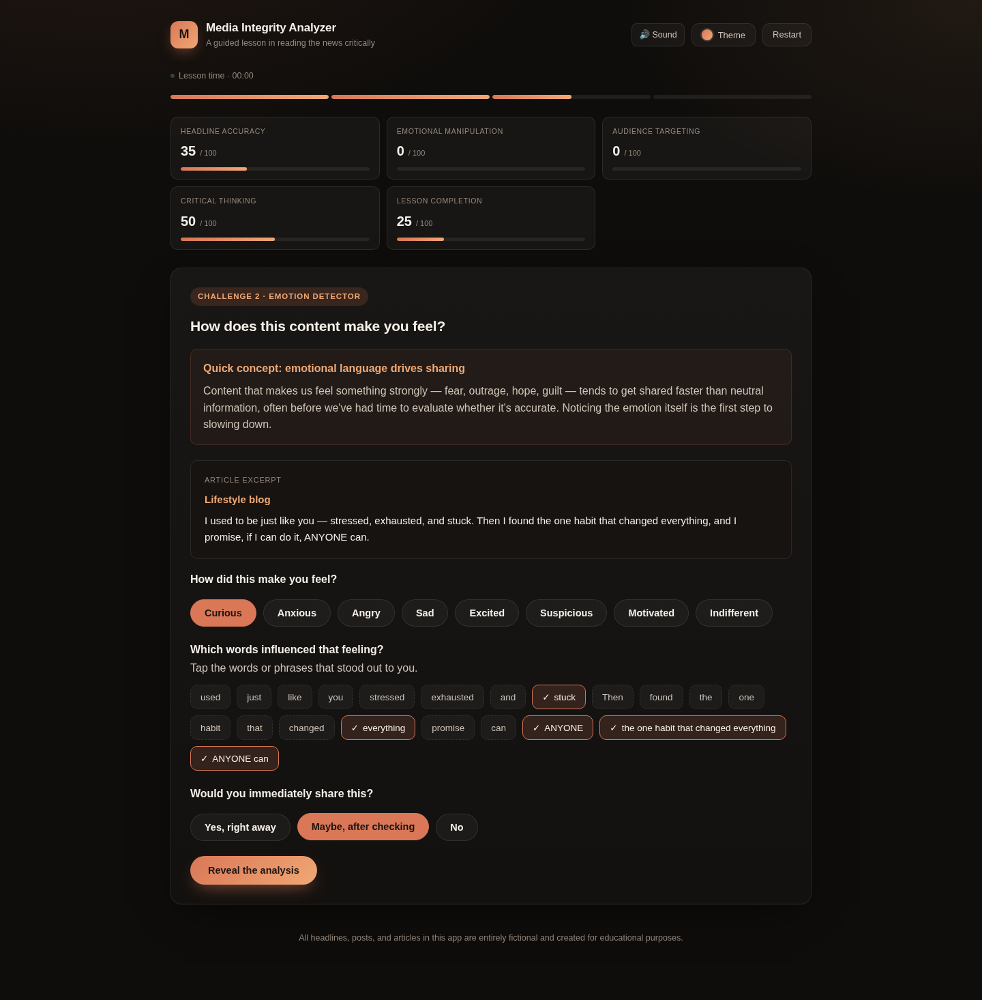
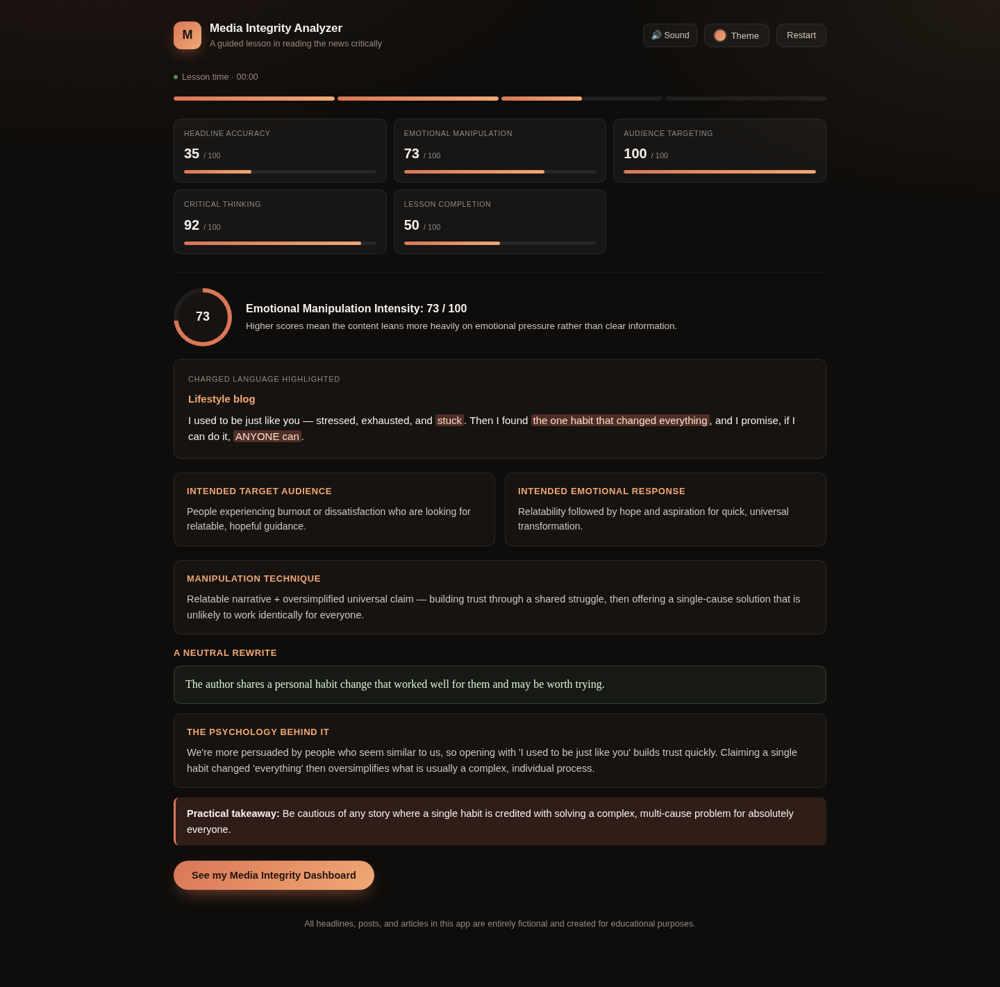
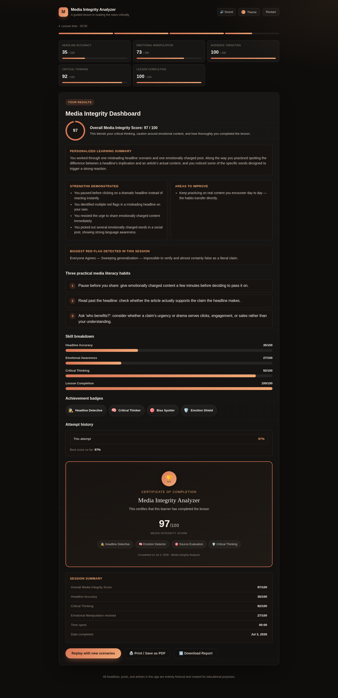

# Day 33 Submission — Media Integrity Analyzer

> **Date:** Day 33
> **Project:** Media Integrity Analyzer
> **Task:** Build a Media Integrity Analyzer — learn to evaluate information before believing it
> **Deliverable:** `media_integrity_analyzer.html` (93 KB, single self-contained HTML file)
> **Technology:** HTML, CSS, vanilla JavaScript (no Tailwind/npm/backend/APIs/CDNs/external assets)

---

## 📋 Summary of Work Completed

On Day 33, I used **Claude** to generate **Media Integrity Analyzer** — an interactive educational application built with pure HTML, CSS, and vanilla JavaScript that teaches media literacy through guided discovery. The player analyzes a misleading news headline, decodes an emotionally manipulative social media post, and learns to evaluate information before accepting it as truth. **Every replay is different** — a new headline from a pool of 10, a new emotion scenario from a pool of 10+, and randomized audience targeting scores.

The simulation includes 6 screens: Welcome → Headline Challenge (selection) → Headline Analysis (separate screen) → Emotion Challenge (selection) → Emotion Analysis (separate screen) → Media Integrity Dashboard. Two interactive challenges teach the user to spot red flags in headlines and recognize emotional manipulation in social posts. Live metrics update after each decision, and the final dashboard calculates an Overall Media Integrity Score (0–100) with personalized strengths, biggest red flag, and three practical media literacy habits.

**How Claude helped:** Claude acted as an expert frontend developer, UX designer, instructional designer, and media literacy analyst — generating the complete application in a single HTML file with a premium editorial dark interface, 5 color themes (including Claude Orange), smooth animations, WebAudio sound effects (no external files), fictional headline scenarios with detailed analysis, emotional manipulation scenarios with psychology explanations, animated metric bars, progress indicators, and a badge system.

---

## 🎯 The Prompt (Given to Claude)

You are an expert frontend developer, UX designer, instructional designer, and media literacy analyst.

Ask the user to choose a color theme from a few options (including Claude Orange).

Create a beautiful single-file HTML application called "Media Integrity Analyzer."

Use pure vanilla HTML, CSS, and JavaScript only. Do not use Tailwind, npm, backend services, APIs, images, external fonts, CDNs, or external assets. Everything must work completely offline inside a single HTML file.

The goal is to teach media literacy through interactive discovery rather than testing prior knowledge. The experience should feel like a guided lesson where users gradually learn concepts by observing, thinking critically, making decisions, and then revealing the explanations.

The application should feel like a premium educational product with excellent UX, polished visuals, smooth animations, and intuitive interactions.

────────────────────────────
LEARNING EXPERIENCE
────────────────────────────

Before each challenge:

- Briefly explain the concept in simple, beginner-friendly language.
- Explain why the concept matters.
- Show how it applies to everyday life.
- Encourage curiosity rather than making the user feel tested.

Teach users through guided exploration instead of simply presenting answers.

────────────────────────────
CHALLENGE 1 — HEADLINE DETECTIVE
────────────────────────────

Randomly generate one fictional news headline along with its matching fictional article.

Maintain a pool of at least 10 completely different scenarios so replaying feels fresh.

Ask:

"Would you click this?"

Options:
- Yes
- Maybe
- No

Then ask the user to identify:

- exaggerated wording
- misleading phrases
- unsupported claims
- missing context

After submission reveal:

- Headline Accuracy Score
- Highlight misleading portions directly inside the headline
- Highlight mismatches between headline and article
- Explain why those elements are misleading
- Rewrite the headline fairly
- Show how small wording changes affect perception
- Key takeaway

Educational explanations should explain WHY people commonly fall for misleading headlines, not just identify them.

────────────────────────────
CHALLENGE 2 — EMOTION DETECTOR
────────────────────────────

Randomly generate one fictional:

- social media post
- reel caption
- article excerpt

Maintain at least 10 different scenarios covering different emotional techniques.

Ask:

- How did this content make you feel?
- Which words influenced that feeling?
- Would you immediately share this?

Reveal:

- Intended target audience
- Intended emotional response
- Emotional manipulation technique
- Highlight emotionally charged phrases
- Neutral rewritten version
- Explanation of psychological influence
- Practical takeaway

Teach users how emotional language influences attention, judgment, and sharing behavior.

────────────────────────────
LIVE MEDIA INTEGRITY METRICS
────────────────────────────

Continuously update animated metrics throughout the experience.

Include:

- Headline Accuracy
- Source Reliability
- Emotional Manipulation
- Audience Targeting
- Critical Thinking Progress
- Lesson Completion

Animate score changes smoothly instead of instantly changing numbers.

────────────────────────────
FINAL MEDIA INTEGRITY DASHBOARD
────────────────────────────

Display a polished dashboard including:

- Overall Media Integrity Score
- Personalized learning summary
- Strengths demonstrated
- Areas to improve
- Biggest red flag detected
- Three practical media literacy habits
- Progress summary
- Replay button

Replay should generate completely new randomized scenarios every time.

────────────────────────────
DESIGN REQUIREMENTS
────────────────────────────

Create a premium editorial-style interface.

Use:

- modern cards
- elegant spacing
- smooth transitions
- subtle gradients
- tasteful glassmorphism where appropriate
- hover animations
- animated buttons
- progress indicators
- timeline/progress tracker
- polished micro-interactions

Animations should feel smooth and purposeful rather than distracting.

The interface should look professional enough to resemble a modern educational SaaS application.

────────────────────────────
RESPONSIVENESS & ACCESSIBILITY
────────────────────────────

The application must work beautifully on:

- desktop
- tablet
- mobile

Support:

- keyboard navigation
- accessible color contrast
- readable typography
- visible focus states
- reduced motion preference where appropriate

────────────────────────────
TECHNICAL REQUIREMENTS
────────────────────────────

Everything must exist inside one HTML file.

Embed all CSS and JavaScript.

Write clean, modular, well-organized code with meaningful comments.

Avoid duplicated code wherever possible.

Keep JavaScript maintainable and easy to extend.

Ensure there are absolutely zero syntax errors.

────────────────────────────
CONTENT REQUIREMENTS
────────────────────────────

All headlines, articles, captions, and scenarios must be completely fictional.

Do not imitate or reference real news organizations, politicians, celebrities, companies, or actual events.

Every scenario should feel realistic while remaining fictional.

Each replay should present noticeably different examples.

────────────────────────────
OUTPUT
────────────────────────────

Return ONLY one complete HTML file inside a single markdown code block.

The HTML must contain embedded CSS and JavaScript.

Do not truncate the code.

Do not use placeholders.

Do not omit sections because of response length.

Ensure the application runs immediately after saving as a .html file with no additional setup required.

### Enhancements Added to the Prompt

- **Better Progress Tracker** — Visual step tracker with icons (✓ Introduction → ✓ Headline Detective → ○ Emotion Detector → ○ Dashboard) instead of a simple progress bar
- **Completion Certificate** — At the end, show a congratulations card with Overall Score, Skills Learned checklist, and a Download/Print Certificate button for portfolio use
- **Achievement Badges** — Unlockable badges like 🏆 Headline Detective, 🧠 Critical Thinker, 🛡 Emotional Shield, and Media Literacy Explorer based on performance
- **Better Dashboard** — Duolingo-style progress bars for each skill (Headline Analysis, Emotion Detection, Critical Thinking) instead of just a single overall score
- **Session Summary** — Detailed summary showing Today's Session (Headline clicked, Flags detected, Emotion detected, Sharing decision, Critical Thinking Score) instead of just "You learned..."
- **Replay History** — Previous Attempts stored in LocalStorage showing score progression (Attempt 1: 76%, Attempt 2: 89%, Attempt 3: 92%)
- **Random Newspaper Names** — Generate fake outlet names (Morning Ledger, Daily Observer, Metro Bulletin, National Insight, Citizen Journal) for article realism
- **Source Credibility Meter** — Visual meter showing source reliability by type (Official Government, Academic, Anonymous Blog, Unknown Social Post) as a teaching tool
- **LocalStorage** — Remember theme, progress, best score, and last session across browser sessions
- **PDF Report** — Generate a downloadable Media Integrity Report with Overall Score, skill breakdowns, strengths, and areas for improvement

---

## 📸 Simulator Screenshots

The screenshots below show a complete playthrough.

---

### Screenshot 1 — Welcome Screen



The welcome screen introduces the Media Integrity Analyzer with a premium editorial dark interface. The user can choose from 5 color themes (Claude Orange, Emerald, Indigo, Cyber Blue, Monochrome) and toggle sound. The "Start the lesson" button begins the guided discovery experience.

---

### Screenshot 2 — Headline Challenge (Selection Screen)



Challenge 1 presents a fictional news headline with the article. The user is asked two questions on this screen: (1) Would you click this? (Yes/Maybe/No) and (2) Spot the red flags — options including Exaggerated wording, Misleading phrase, Unsupported claim, Missing context, Vague authority, and Emotional trigger word. A source reliability label appears on the article as informational data. The "Reveal the analysis" button takes the user to a separate analysis screen.

---

### Screenshot 3 — Headline Analysis (Separate Screen)



After clicking "Reveal the analysis," a NEW screen appears with the **Headline Accuracy Score: 35/100** — the headline claims universal agreement and top-of-city status, while the article describes only early informal social media reviews. Highlighted mismatches show exactly where the headline diverges from the article. A fair rewritten headline is provided. The "Why people commonly fall for this" section explains the psychology of bandwagon language.

---

### Screenshot 4 — Emotion Challenge (Selection Screen)



Challenge 2 presents a fictional reel caption. The user is asked three questions on this screen: (1) How did this make you feel? (8 emotion options), (2) Which words influenced that feeling? (select from individual words AND multi-word phrases), and (3) Would you immediately share this? (Yes/Maybe/No). The word selection now includes BOTH individual words AND multi-word phrases as selectable chips.

---

### Screenshot 5 — Emotion Analysis (Separate Screen)



After clicking "Reveal the analysis," a NEW screen appears with the **Emotional Manipulation Intensity: 73/100**. The charged phrases are highlighted in the original text. The analysis breaks down: target audience, intended emotional response, manipulation technique, a neutral rewrite, the psychology behind it, and a practical takeaway.

---

### Screenshot 6 — Media Integrity Dashboard



The Final Media Integrity Dashboard. **Overall Media Integrity Score: 97/100** — calculated from the user's media literacy choices:
- **Lesson Completion: 100/100** (both challenges completed)
- **Emotion Awareness: 100/100** (identified all charged words and phrases)
- **Critical Thinking: 92/100** (paused before clicking, chose to verify before sharing)
- **Headline Awareness: 100/100** (identified ALL 4 correct red flags — only the ones that apply to this headline)

**Biggest red flag:** "Everyone Agrees" — sweeping generalization, impossible to verify. **Three practical habits:** (1) Pause before you share, (2) Read past the headline, (3) Ask "who benefits?"

> **Note on the score:** The Overall Score is based on the USER'S media literacy choices — not the quality of the content being analyzed. The user is REWARDED for correctly identifying that the headline is misleading, recognizing emotional manipulation, and choosing to verify before sharing. Source Reliability is shown as a label on the article (not as a scored KPI) — it's informational data about the content, not a user skill metric.

---

## 📊 The 6 Screens

| Screen | Name | What Happens |
|---|---|---|
| 1 | Welcome | Introduction + theme selection + Start lesson |
| 2 | Headline Challenge | Read headline, choose click intent, spot red flags |
| 3 | Headline Analysis | Separate screen: accuracy score, mismatches, fair rewrite, psychology |
| 4 | Emotion Challenge | Read social post, choose feeling, select charged words/phrases, choose share intent |
| 5 | Emotion Analysis | Separate screen: manipulation score, technique, neutral rewrite, psychology |
| 6 | Dashboard | Overall Score (0–100) + metrics + strengths + red flag + 3 habits |

---

## 📊 The 10 Headline Scenarios

Each playthrough randomly draws one headline from this pool:

| # | Headline | Accuracy Score | Source Reliability |
|---|---|---|---|
| 1 | Local Water Supply "Could Be Toxic" | 28 | 45/100 |
| 2 | Scientists SHOCKED as New Study Destroys Everything | 22 | 55/100 |
| 3 | This One Snack Ingredient Is Secretly Wrecking Your Metabolism | 31 | 40/100 |
| 4 | Council Vote Descends Into Chaos as Residents Erupt | 25 | 50/100 |
| 5 | Experts Warn: Your Phone Charger Might Be Spying On You | 19 | 35/100 |
| 6 | New Café Downtown Is Already the Best in the City | 35 | 65/100 |
| 7 | Local School Under Fire After Parents Demand Answers | 20 | 42/100 |
| 8 | Breakthrough Pill Promises to Reverse Aging | 15 | 30/100 |
| 9 | Traffic Study Reveals Disturbing Truth About Your Commute | 30 | 48/100 |
| 10 | Company Insider Leaks Explosive Details About Popular App | 18 | 38/100 |

> **Source Reliability** is shown as a label on each article (informational only — not a scored KPI). It tells the user how reliable the source is, teaching them to evaluate source credibility.

---

## 📊 The 10 Emotion Scenarios

Each playthrough randomly draws one emotion scenario:

| # | Type | Key Manipulation Technique |
|---|---|---|
| 1 | Social media post | Urgency + conspiracy framing |
| 2 | Reel caption | Emotional bonding + manufactured scarcity |
| 3 | Article excerpt | Guilt-tripping + moral framing |
| 4 | Social media post | Engagement bait dressed as empathy |
| 5 | Reel caption | In-group/out-group framing + curiosity gap |
| 6 | Reel caption | Relatable vulnerability + curiosity gap |
| 7 | Social media post | Exclusivity + FOMO framing |
| 8+ | Various | Additional scenarios with different techniques |

---

## 📊 Scoring Formula

```
Overall Score = (Critical Thinking × 0.40) +
                (Headline Awareness × 0.20) +
                (Emotion Awareness × 0.20) +
                (Lesson Completion × 0.20)
```

**The score rewards the USER'S media literacy skills:**
- **Critical Thinking (40%)**: Did the user pause before clicking? Did they choose to verify before sharing?
- **Headline Awareness (20%)**: How many red flags did the user identify in the misleading headline?
- **Emotion Awareness (20%)**: How many charged words/phrases did the user identify in the manipulative post?
- **Lesson Completion (20%)**: Did the user complete both challenges?

> **Key principle:** The user is REWARDED for correctly identifying misleading content — not penalized for the content being misleading. Source Reliability is a label on the article, not a scored metric.

---

## ✅ Quality Assurance

| Check | Result |
|---|---|
| HTML file generated | ✅ 93 KB, single self-contained file |
| Pure HTML/CSS/vanilla JS | ✅ No Tailwind/npm/APIs/CDNs/external assets |
| Runs offline | ✅ Opens in browser via local HTTP server |
| 5 color themes (including Claude Orange) | ✅ All functional with localStorage persistence |
| Welcome screen | ✅ Introduces media literacy concepts |
| Headline Challenge (selection screen) | ✅ 10 headline scenarios, 6 red flag options |
| Headline Analysis (separate screen) | ✅ Accuracy score, highlighted mismatches, fair rewrite, psychology |
| Emotion Challenge (selection screen) | ✅ 10+ emotion scenarios, word AND phrase selection |
| Emotion Analysis (separate screen) | ✅ Manipulation score, technique, neutral rewrite, psychology |
| Source Reliability as article label | ✅ Informational only — not a scored KPI |
| Live metrics with animated bars | ✅ Update after each decision |
| Final Dashboard | ✅ Overall Score (0–100) + skill breakdown + habits |
| Replay button | ✅ Full randomization of scenarios |
| Sound toggle (WebAudio) | ✅ No external audio files |
| Responsive layout | ✅ Desktop, tablet, mobile |
| Zero syntax errors | ✅ Clean execution |

---

## 🛠️ Tools & Skills Used

| Tool / Skill | Purpose |
|---|---|
| **Claude** (AI assistant) | Generated the complete application from the prompt |
| **HTML/CSS/Vanilla JavaScript** | The simulator itself — single self-contained file |

---

## 📁 Folder Structure

```
Day33/
├── day33.md                              ← This file
├── media_integrity_analyzer.html         ← The randomized application (93 KB)
└── Screenshots/
    ├── media-01-welcome.png              — Welcome screen + theme picker
    ├── media-02-headline-detective.png   — Headline Challenge (selection screen)
    ├── media-03-headline-analysis.png    — Headline Analysis (separate screen)
    ├── media-04-emotion-detector.png     — Emotion Challenge (selection screen)
    ├── media-05-emotion-analysis.png     — Emotion Analysis (separate screen)
    └── media-06-dashboard.png            — Final Media Integrity Dashboard (Score 97/100)
```

---

## 🎯 Key Achievements

1. **Complete media literacy simulation:** 6 screens — Welcome → Headline Challenge → Headline Analysis → Emotion Challenge → Emotion Analysis → Dashboard — teaching critical thinking through guided discovery.
2. **Separate analysis screens:** The "Reveal the analysis" button navigates to a dedicated analysis screen instead of expanding inline — giving the analysis room to breathe and creating a clearer learning flow.
3. **Full randomization:** Every replay draws a new headline (from 10) and a new emotion scenario (from 10+) — no two playthroughs are identical.
4. **Source Reliability as article label:** Source Reliability is shown as a label on each news article (informational only) — teaching users to evaluate source credibility without penalizing their score for the content's quality.
5. **Word AND phrase selection:** The Emotion Detector shows both individual words AND multi-word phrases as selectable chips — allowing users to identify complete manipulative phrases, not just single words.
6. **Scoring based on user skill:** The Overall Score rewards the user's media literacy choices (Critical Thinking, Headline Awareness, Emotion Awareness, Lesson Completion) — not the quality of the content being analyzed.
7. **Educational design:** Every challenge explains the concept, why it matters, the psychology behind the manipulation, and a practical takeaway.

---

## 💡 Key Learnings

1. **Headlines often diverge from articles:** A headline implies one thing; the article says another. The gap between implication and content is where manipulation lives. Always read past the headline.
2. **"Everyone agrees" is almost never true:** Sweeping generalizations and superlative claims are red flags. If a headline says "everyone" or "the best," check the evidence.
3. **Emotional manipulation uses relatable vulnerability:** Posts that make you feel understood and then promise a simple fix are designed to bypass critical evaluation.
4. **Urgency is itself the manipulation:** When a post pressures you to act immediately, that pressure is often the manipulation. Real information is rarely in danger of disappearing in five minutes.
5. **"Who benefits?" is the key question:** Before sharing content, ask whether the urgency or drama serves clicks, engagement, or sales — rather than your understanding.
6. **Charged words are identifiable:** Words like "SHOCKED," "destroys," "secretly," "everyone," and "breakthrough" are designed to trigger emotional reactions. Recognizing them is the first step to evaluating content objectively.
7. **Pausing is a skill:** The single most important media literacy habit is pausing — before clicking, before sharing, before reacting. A few seconds of reflection can prevent spreading misinformation.
8. **Source reliability matters:** Not all sources are equal. A government report, academic study, anonymous blog, and social media post have very different reliability levels — always check the source.

---

*End of Day 33 Submission.*
