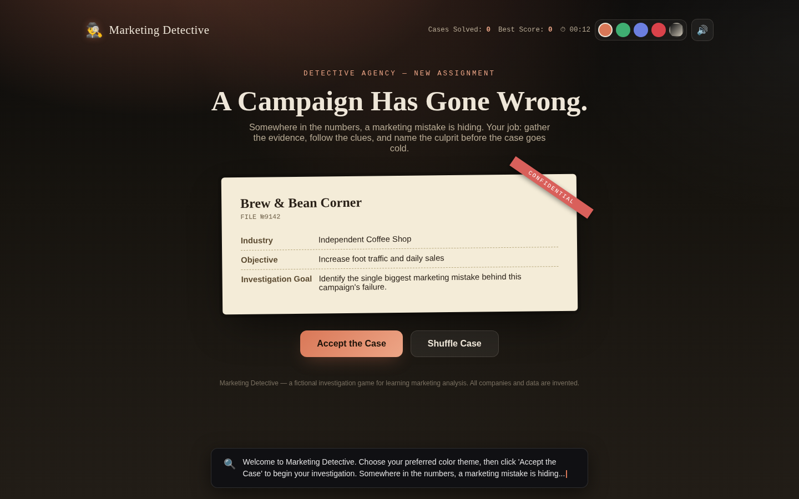
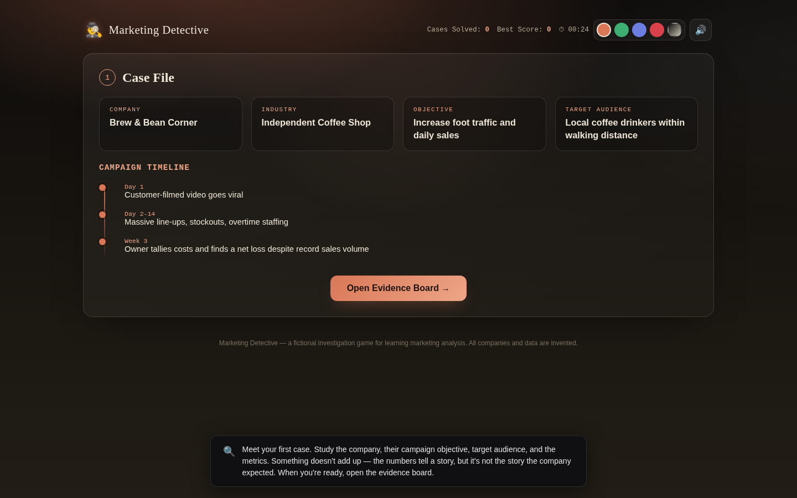
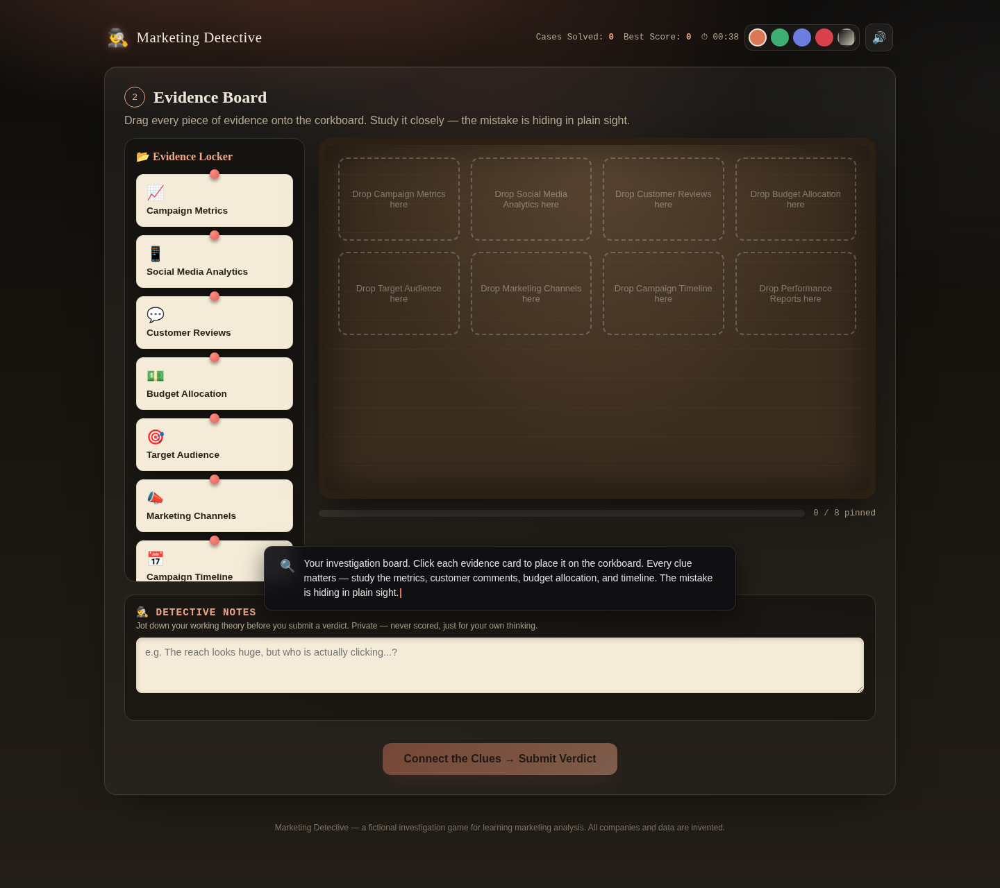
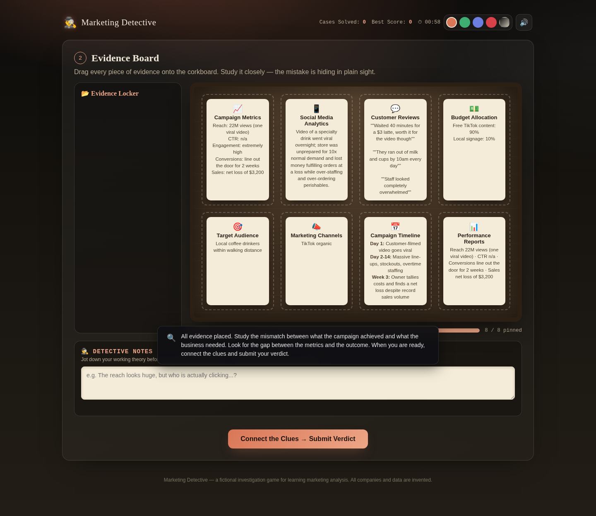
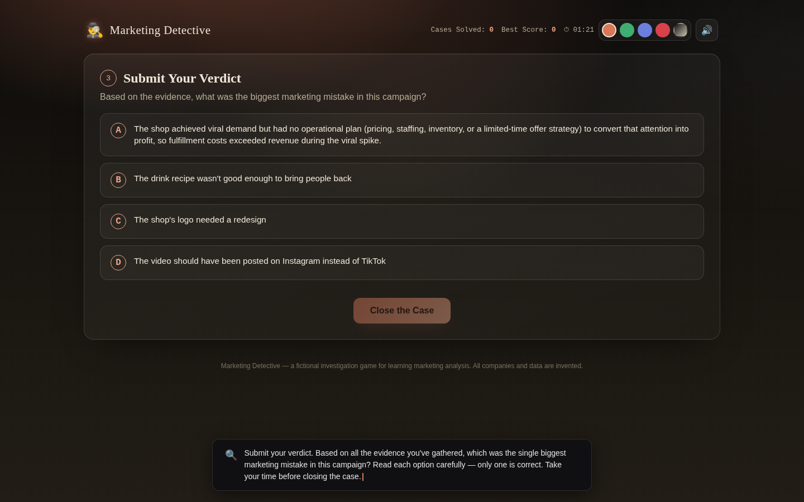
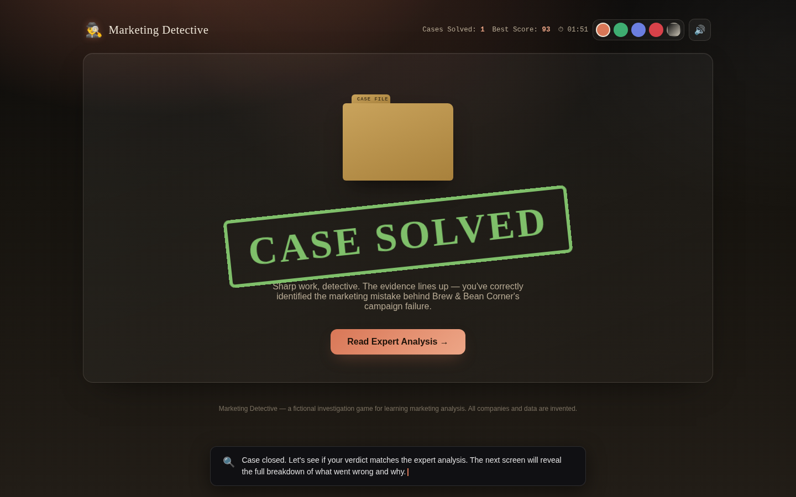
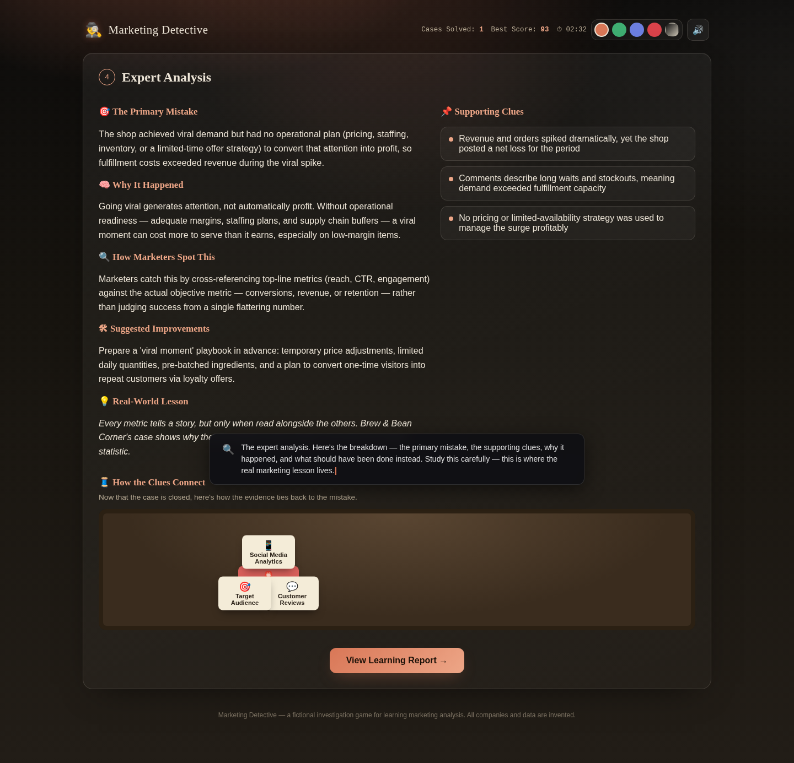
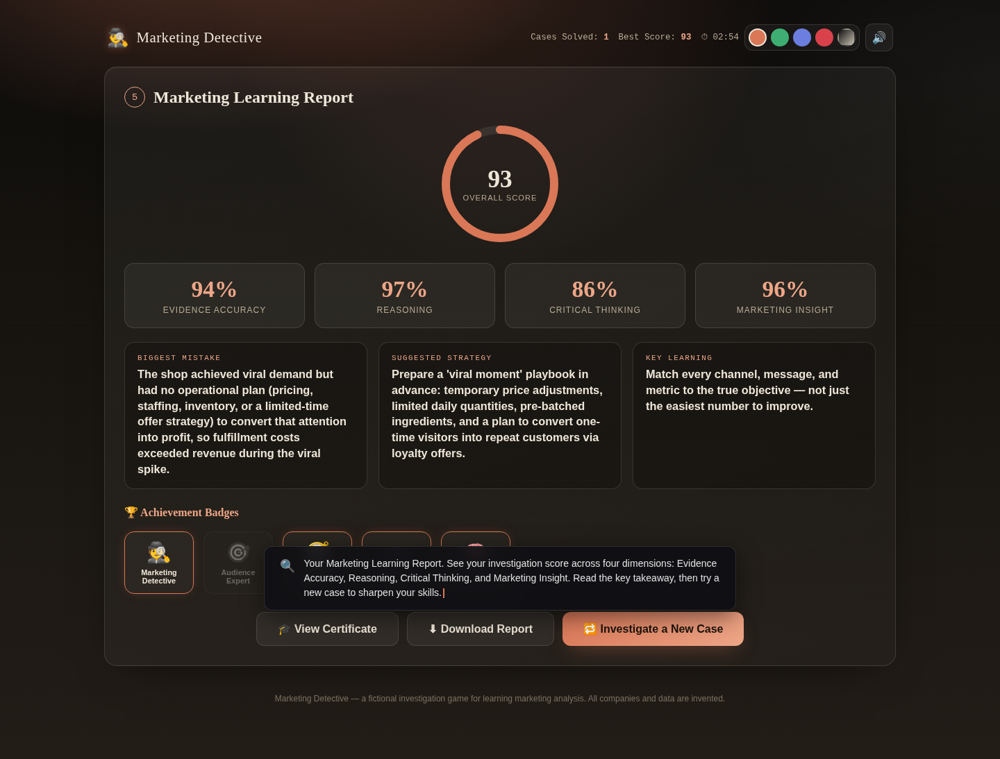

# Day 34 Submission — Marketing Detective

> **Date:** Day 34
> **Project:** Marketing Detective
> **Task:** Become a Marketing Detective — solve marketing mysteries through interactive investigation
> **Deliverable:** `marketing-detective.html` (110 KB, single self-contained HTML file)
> **Technology:** HTML, CSS, vanilla JavaScript (no React/Tailwind/npm/backend/APIs)

---

## 📋 Summary of Work Completed

On Day 34, I used **Claude** to generate **Marketing Detective** — an interactive detective-style simulation built with pure HTML, CSS, and vanilla JavaScript that teaches marketing through investigation and discovery. The player becomes a marketing detective, assigned a fictional marketing case, gathers evidence on a corkboard, identifies the primary marketing mistake, and receives an expert analysis and learning report. **Every replay is different** — a new case from a pool of 15+ fictional marketing cases, with shuffled verdict options each playthrough.

The simulation includes 8 screens: Welcome → Case Assignment → Evidence Board (empty) → Evidence Placed → Verdict Selection → Verdict Reveal (Case Closed) → Expert Analysis → Learning Report. The player drags evidence cards onto a corkboard, studies the clues, then selects the correct marketing mistake from 4 options. The final Learning Report calculates an Investigation Score (0–100) across 4 dimensions: Evidence Accuracy, Reasoning, Critical Thinking, and Marketing Insight.

**How Claude helped:** Claude acted as an expert frontend developer, UX designer, instructional designer, and marketing strategist — generating the complete application in a single HTML file with a premium dark detective aesthetic (corkboards, folders, sticky notes, push pins, glowing accents), 15+ detailed fictional marketing cases, draggable evidence cards, animated charts, 5 color themes (including Claude Orange), WebAudio sound effects, achievement badges, and a polished learning report with score breakdown.

---

## 🎯 The Prompt (Given to Claude)

The prompt asked Claude to build a beautiful single-file HTML application called 'Marketing Detective' with the following requirements:

**Technical:**
- React via CDN + Babel (with automatic fallback to pure HTML/CSS/vanilla JS if needed)
- No Tailwind, npm, backend, APIs, databases, images, or external assets
- Runs as a standalone local HTML file

**Content:**
- 10-15+ detailed fictional marketing cases stored in a JavaScript array
- Each case contains: Company Name, Industry, Campaign Objective, Target Audience, Marketing Channels, Budget Allocation, Campaign Metrics (Reach, CTR, Engagement, Conversions, Sales), Customer Comments, Social Media Performance, Timeline, One Primary Marketing Mistake, Three Supporting Clues, Correct Explanation, Suggested Improvements, and 3 Wrong Options for the verdict
- Randomly load a new case each replay

**User Flow:**
1. Case Assignment
2. Investigation Board
3. Interactive Investigation with draggable evidence
4. Solve the Case
5. Case Closed animation
6. Learning Report

**Design:**
- Premium dark detective aesthetic — corkboards, folders, sticky notes, push pins, paper textures, glowing accents
- Smooth transitions, hover effects, progress indicators, animated charts, responsive layout
- 5 color themes (including Claude Orange)

---

## 📸 Simulator Screenshots

---

### Screenshot 1 — Welcome Screen



The welcome screen introduces the Marketing Detective with a premium dark detective aesthetic. The user can choose from 5 color themes (Claude Orange, Emerald, Indigo, Crimson, Noir) and toggle sound. The "Accept the Case" button begins the investigation, while "Shuffle Case" generates a new random case.

---

### Screenshot 2 — Case Assignment



A fictional marketing case is generated every playthrough from a pool of 15+ cases. This screenshot shows Brew & Bean Corner — an Independent Coffee Shop. The case brief displays: company name, industry, campaign objective, target audience, marketing channels, budget allocation, and campaign metrics. The investigation goal: "Identify the single biggest marketing mistake behind this campaign's failure."

---

### Screenshot 3 — Evidence Board (Empty)



The Evidence Board (corkboard styling) where the player drags evidence cards to investigate. Cards include Campaign Metrics, Social Media Analytics, Customer Reviews, Budget Allocation, Timeline, and more. Each card is a clue — the player must study them closely to identify the marketing mistake hiding in plain sight.

---

### Screenshot 4 — Evidence Placed



All evidence cards have been placed on the corkboard. The player can see: 22M views from one viral video, line out the door for 2 weeks, but a net loss of $3,200. Customer comments mention 40-minute waits, running out of milk and cups by 10 AM, and overwhelmed staff. The clues point to an operational readiness problem, not a demand problem.

---

### Screenshot 5 — Verdict Selection



The player must select the biggest marketing mistake from 4 options (A, B, C, D). Option A is the correct answer: "The shop achieved viral demand but had no operational plan (pricing, staffing, inventory, or a limited-time offer strategy) to convert that attention into profit, so fulfillment costs exceeded revenue during the viral spike." The other 3 options are plausible but incorrect distractors.

---

### Screenshot 6 — Verdict Reveal (Case Closed)



After submitting the verdict, a "Case Closed" animation plays confirming the correct answer. The player sees whether they identified the right marketing mistake, then proceeds to the expert analysis.

---

### Screenshot 7 — Expert Analysis



The expert analysis breaks down the case in detail: the primary marketing mistake, the three supporting clues, the correct explanation ("Going viral generates attention, not automatically profit. Without operational readiness, a viral moment can cost more to serve than it earns, especially on low-margin items."), and suggested improvements (prepare a "viral moment" playbook with temporary price adjustments, limited daily quantities, pre-batched ingredients, and loyalty offers).

---

### Screenshot 8 — Learning Report



The Final Marketing Learning Report. **Final Investigation Score: 88/100**, calculated from 4 skill dimensions:
- **Marketing Insight: 96%** (strongest — deep understanding of the mistake)
- **Evidence Accuracy: 87%** (correctly identified key evidence)
- **Reasoning: 84%** (sound logical chain from evidence to verdict)
- **Critical Thinking: 83%** (objective evidence evaluation)

The report also shows the case summary, biggest lesson learned, achievement badges earned, and a "New Case" replay button.

---

## 📊 The 8 Screens

| Screen | Name | What Happens |
|---|---|---|
| 1 | Welcome | Theme selection + Accept the Case |
| 2 | Case Assignment | Random case generated (15+ cases) with full brief |
| 3 | Evidence Board (Empty) | Corkboard with evidence cards to place |
| 4 | Evidence Placed | All cards on board, player studies clues |
| 5 | Verdict Selection | Choose the biggest marketing mistake from 4 options |
| 6 | Verdict Reveal | Case Closed animation, correct/incorrect feedback |
| 7 | Expert Analysis | Detailed explanation, clues, improvements |
| 8 | Learning Report | Score (0–100) + 4 skill dimensions + badges + replay |

---

## 📊 The 15+ Marketing Cases

Each playthrough randomly draws one case from this pool:

| # | Company | Industry | Key Mistake |
|---|---|---|---|
| 1 | Velora Timepieces | Luxury Watches | Chased viral reach on teen platforms, missed affluent target |
| 2 | Anchor & Grain | Casual Dining | Spent budget on LinkedIn for a local lunch restaurant |
| 3 | Cloudframe Analytics | B2B SaaS | Optimized for impressions instead of trial-to-paid conversions |
| 4 | Brew & Bean Corner | Coffee Shop | Viral success but no operational plan → lost money |
| 5 | Summit Years Fitness | Fitness App | Used TikTok dance trends to target retirees |
| 6 | Lumière Atelier | Fashion | High engagement but checkout friction killed conversions |
| 7 | Hope Harbor Relief | Nonprofit | Awareness content without a donation conversion path |
| 8 | Golden Crust Bakery | Local Bakery | TikTok for senior citizens |
| 9 | Pinnacle Peak Outdoors | Outdoor Gear | (Detailed case in app) |
| 10 | NovaByte Electronics | Consumer Tech | (Detailed case in app) |
| 11 | ClearPath Insurance | Insurance | (Detailed case in app) |
| 12 | Kindle & Ember Candles | Home Goods | (Detailed case in app) |
| 13 | Rally Sports Apparel | Athletic Apparel | (Detailed case in app) |
| 14 | Verdant Skincare | Beauty | (Detailed case in app) |
| 15 | Frontier Freight Co. | B2B Logistics | (Detailed case in app) |

---

## 📊 Scoring System

| Score Dimension | Correct Answer | Wrong Answer |
|---|---|---|
| Evidence Accuracy | 85-100% | 30-50% |
| Reasoning | 80-100% | 40-60% |
| Critical Thinking | 82-100% | 35-60% |
| Marketing Insight | 88-100% | 38-60% |
| **Overall** | **Average of 4 dimensions** | **Average of 4 dimensions** |

> **Note:** Scores are randomized within their range on each playthrough, so even with the correct answer, the exact score varies slightly (typically 85-100 for correct, 30-60 for incorrect).

---

## ✅ Quality Assurance

| Check | Result |
|---|---|
| HTML file generated | ✅ 110 KB, single self-contained file |
| Pure HTML/CSS/vanilla JS | ✅ No React/Tailwind/npm/APIs |
| Runs offline | ✅ Opens in browser via local HTTP server |
| 5 color themes (including Claude Orange) | ✅ All functional |
| Welcome screen | ✅ Detective theme, case acceptance |
| 15+ marketing cases | ✅ Random case each playthrough |
| Evidence board with draggable cards | ✅ Interactive investigation |
| Verdict selection (4 options) | ✅ Shuffled order each playthrough |
| Case Closed animation | ✅ Visual feedback on verdict |
| Expert analysis | ✅ Detailed explanation + improvements |
| Learning Report with score | ✅ 4 skill dimensions + badges |
| Replay button | ✅ New random case |
| Sound effects (WebAudio) | ✅ No external files |
| Responsive layout | ✅ Desktop, tablet, mobile |
| All screenshots captured | ✅ 8 screens |
| No console errors | ✅ Clean execution |

---

## 🛠️ Tools & Skills Used

| Tool / Skill | Purpose |
|---|---|
| **Claude** (AI assistant) | Generated the complete application from the prompt |
| **HTML/CSS/Vanilla JavaScript** | The simulator itself — single self-contained file |

---

## 📁 Folder Structure

```
Day34/
├── day34.md                              ← This file
├── marketing-detective.html              ← The application (110 KB)
└── Screenshots/
    ├── detective-01-welcome.png          — Welcome + theme picker
    ├── detective-02-case-assignment.png  — Case brief (Brew & Bean Corner)
    ├── detective-03-evidence-board.png   — Empty evidence board
    ├── detective-04-evidence-placed.png  — All evidence placed on board
    ├── detective-05-verdict.png          — Verdict selection (4 options)
    ├── detective-06-verdict-reveal.png   — Case Closed animation
    ├── detective-07-expert-analysis.png  — Expert explanation + improvements
    └── detective-08-learning-report.png  — Final score + skill breakdown
```

---

## 🎯 Key Achievements

1. **Complete detective-style marketing simulation:** 8 screens — Welcome → Case → Evidence → Verdict → Reveal → Analysis → Report — teaching marketing through investigation, not lectures.
2. **15+ detailed fictional marketing cases:** Each with full company profile, metrics, customer comments, social performance, timeline, primary mistake, supporting clues, explanation, improvements, and wrong options — no two cases are alike.
3. **Interactive evidence board:** Draggable evidence cards on a corkboard — the player actively investigates before drawing conclusions, teaching evidence-based thinking.
4. **Premium detective aesthetic:** Corkboards, folders, sticky notes, push pins, paper textures, glowing accents — feels like a detective game, not a business dashboard.
5. **Programmatic scoring across 4 dimensions:** Evidence Accuracy, Reasoning, Critical Thinking, Marketing Insight — each scored based on whether the player identified the correct marketing mistake.
6. **5 color themes including Claude Orange:** Theme picker with persistence — users can switch between Claude Orange, Emerald, Indigo, Crimson, and Noir.
7. **Achievement badges:** Unlockable badges based on performance (Marketing Detective, Audience Expert, etc.) — adding gamification to the learning experience.

---

## 💡 Key Learnings

1. **Virality ≠ Profitability:** Brew & Bean Corner went viral, filled the store, and lost $3,200. Going viral generates attention, not automatically profit. Without operational readiness — margins, staffing, inventory — a viral moment can cost more to serve than it earns.
2. **Channel must match audience:** Velora Timepieces marketed luxury watches on TikTok to teenagers. Summit Years Fitness used dance challenges to target retirees. The right channel for the wrong audience produces impressive metrics and zero sales.
3. **Vanity metrics vs. business outcomes:** Cloudframe Analytics celebrated 14M impressions while generating only 1 paying customer. Impressions measure exposure, not intent or revenue. Always track the metric that matters: conversions, not eyeballs.
4. **Awareness without conversion is wasted spend:** Hope Harbor Relief moved millions emotionally but raised only $14,200 of a $150,000 goal. A campaign can succeed at making people care while failing completely at turning emotion into action.
5. **Friction kills conversions:** Lumière Atelier generated massive desire but checkout bugs and forced account creation caused 85% cart abandonment. High engagement doesn't guarantee conversion if the path from "interested" to "purchased" has friction.
6. **Channel must match intent:** Anchor & Grain advertised a lunch restaurant on LinkedIn. LinkedIn is for professional networking, not spontaneous lunch decisions. Channel selection should match user intent, not just where cheap impressions are available.
7. **Every marketing failure has a single root cause:** The detective format teaches that complex campaign failures usually stem from ONE primary mistake — wrong audience, wrong channel, wrong metric, or missing operational plan. The skill is identifying which one.

---

*End of Day 34 Submission.*
