# Day 35 Submission — Prompt Puzzle

> **Date:** Day 35
> **Project:** 🧩 Prompt Puzzle — Master AI Prompting Through Play
> **Task:** Build Prompt Puzzle — master AI prompting through play
> **Deliverable:** `prompt-puzzle.html` (102 KB, single self-contained HTML file)
> **Technology:** HTML, CSS, vanilla JavaScript (no React/Tailwind/npm/backend/APIs)

---

## 📋 Summary of Work Completed

For Day 35, I built **Prompt Puzzle** — an interactive educational game that teaches prompt engineering through play, not memorization. **Cybersecurity** was selected as the practice domain with **Expert** difficulty, which generated 6 randomized real-world security scenarios. The game features three challenge types — Build the Prompt, Clean the Prompt, and Choose the Best Prompt — each teaching a different aspect of prompt engineering through hands-on interaction.

The game flows across 14 screens: Welcome/Intro → Mode Selection → Build the Prompt (challenge + result) → Clean the Prompt (challenge + result) → Choose the Best Prompt (challenge + result) → Prompt Performance Report → Prompt Playground (bonus). Each challenge features drag-and-drop or tap interactions, live scoring across 6 dimensions, AI response comparison with typewriter effects, and a Prompt Principle panel explaining the lesson. A perfect **100/100 — Rating S (Master Architect)** was achieved, with all 7 Prompt DNA dimensions at 100%.

**How Claude was used:** I prompted Claude as an expert frontend developer, UX designer, instructional designer, game designer, and prompt engineering expert. The complete application was generated in a single HTML file with glassmorphism UI, gradient accents, floating notifications, score animations, completion confetti, LocalStorage-persisted achievements, a bonus Prompt Playground mode, and zero external dependencies. After generation, all three challenges were tested and a perfect score was achieved.

---

## 🎯 The Prompt (Given to Claude)

You are an expert frontend developer, UX designer, instructional designer, game designer, prompt engineering expert, and educational software architect.

Before generating anything, interview the user in chat.

Ask ONLY these two questions.

Question 1:
Which domain would you like to practice prompting for?

Provide these options:
• Software Engineering
• Marketing
• Content Creation
• Education
• Data Analysis
• Cybersecurity
• UI/UX Design
• Product Management
• Healthcare
• Finance
• Customer Support
• Research
• Legal
• HR
• Sales

Question 2:
Choose your difficulty.

• Beginner
• Intermediate
• Advanced
• Expert

Do NOT ask any other questions.

Once both answers are received, generate the application.

Create a premium single-file HTML application called "🧩 Prompt Puzzle — Master AI Prompting Through Play"

Everything must work by simply opening the HTML file locally.

If React via CDN would reduce offline reliability or increase runtime risk, automatically switch to pure HTML, CSS and vanilla JavaScript.

Do NOT use: npm, Tailwind, APIs, backend, databases, images, SVG libraries, external fonts, external assets.

Everything must exist inside ONE HTML file.

**Goal:** Teach prompt engineering through interactive discovery rather than memorization. The application should feel like a polished educational game rather than a quiz. Every interaction should explain WHY a better prompt produces better AI responses.

**Game Introduction:** Cinematic introduction with animated intro, progress tracker, smooth transition into gameplay.

**Scenarios:** 8 randomized scenarios (reduced if output too large). Each scenario contains: Scenario Title, Desired Output, Real-world Context, Correct Prompt Blocks, Distractor Blocks, Weak Prompt, Optimized Prompt, Over-Engineered Prompt, Weak AI Output, Optimized AI Output, Prompt Principle, Difficulty Level, Real-world Use Case.

**Prompt Blocks:** Realistic draggable blocks (not generic labels like "Role/Context/Constraint"). Every replay randomizes both order and distractor blocks.

**Three Game Modes:**
1. 🧩 Build the Prompt — Drag blocks into the correct order
2. 🧹 Clean the Prompt — Remove redundant, vague, duplicated, and conflicting lines. Explain WHY each removal improves the prompt.
3. 🎯 Choose the Best Prompt — Compare Weak, Optimized, and Over-Engineered prompts. Explain why the winner wins and why the others fail.

**Live Scoring:** Accuracy, Completion Time, Moves, Wrong Placements, Hints Used, Optimization Bonus, Consistency. Display live animated score updates.

**Prompt Construction Visualizer:** After every challenge, display animated completion showing Role ✔, Context ✔, Constraints ✔, Formatting ✔, Examples ✔, Reasoning ✔, Tone ✔.

**AI Response Comparison:** Animate responses with typewriter effect. Display Weak AI Output → Optimized AI Output. Highlight what improved and explain WHY.

**Prompt Principle Panel:** Every scenario teaches ONE lesson. Explain why it matters, where it's useful, and real-world examples.

**Achievements:** Unlockable badges (Prompt Apprentice, Fast Thinker, Precision Engineer, Context Master, Optimization Expert, Prompt Architect). Persist using LocalStorage.

**Prompt Performance Report:** Overall Prompt Score, Rating, Rank, Prompt DNA Visualization, Strongest Skill, Needs Improvement, Average Completion Time, Optimization Accuracy, Hints Used, Best Scenario, Personalized Feedback, Suggested Next Milestone, Final Optimized Prompt.

**Bonus Mode:** After completing all challenges, unlock 🧪 Prompt Playground — users build their own prompt and get instant analysis (Prompt Score, Missing Context, Missing Constraints, Formatting Quality, Role Quality, Optimization Suggestions, Strengths, Weaknesses, Suggested Improved Prompt).

**UI:** Premium modern dark interface, glassmorphism, gradient accents, floating cards, smooth transitions, hover effects, micro-interactions, progress indicators, animated score counters, completion confetti, toast notifications, responsive layout, keyboard accessibility.

**Offline Requirements:** Everything runs locally. No syntax errors, no runtime errors, no missing assets, no external dependencies.

---

## 📸 Simulator Screenshots

---

### Screenshot 1 — Welcome / Cinematic Intro

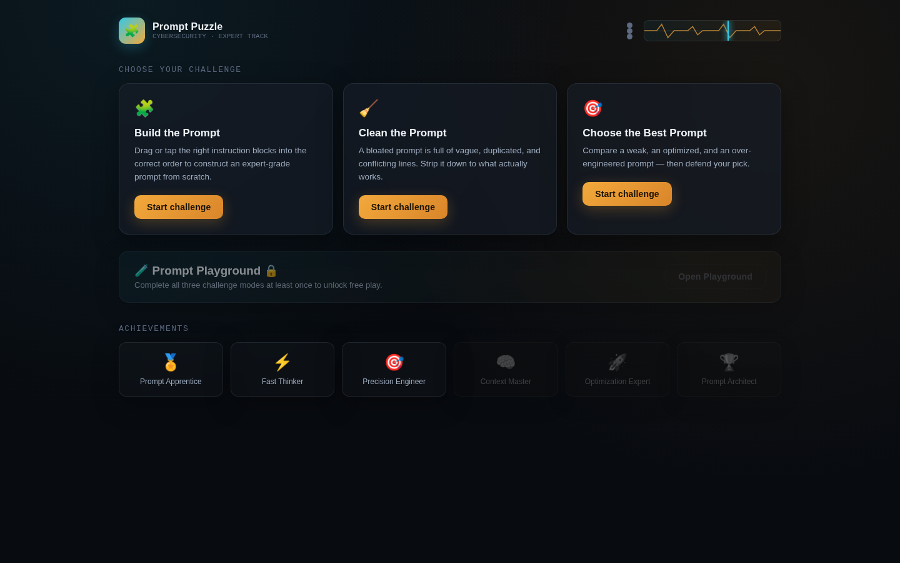

The cinematic introduction screen: "Become a Prompt Architect. Modern AI is incredibly powerful — but only when given clear instructions. Your mission: repair, clean, and design prompts across real security scenarios." I chose Cybersecurity · Expert Track. The "Enter the Lab →" button begins the game.

---

### Screenshot 2 — Mode Selection

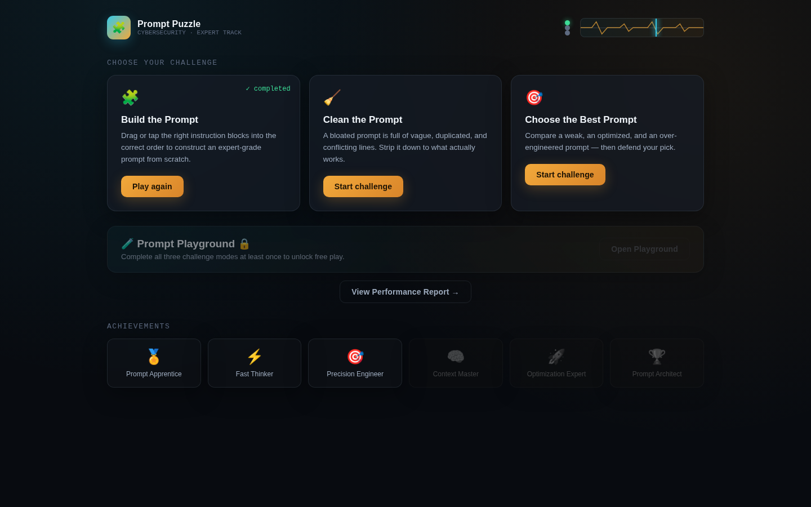

I was presented with three challenge modes: 🧩 Build the Prompt (drag blocks into correct order), 🧹 Clean the Prompt (strip a bloated prompt down to what works), and 🎯 Choose the Best Prompt (compare weak, optimized, and over-engineered prompts). A bonus 🧪 Prompt Playground unlocks after all three are completed.

---

### Screenshot 3 — Challenge 1: Build the Prompt

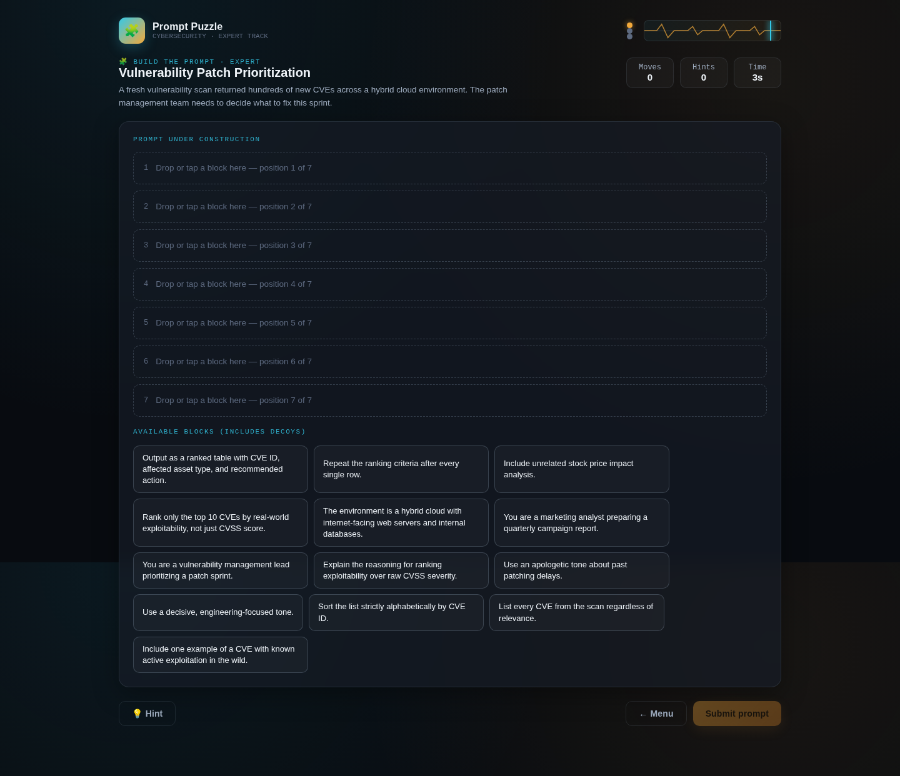

The Build the Prompt challenge presented draggable block chips — realistic prompt instructions like "You are a cloud security engineer auditing AWS IAM and S3 configurations" and "Format the output as a checklist grouped by resource type." The pool includes correct blocks AND distractor blocks (decoys). I had to identify and arrange the correct blocks in the right order.

---

### Screenshot 4 — Build the Prompt: Blocks Placed

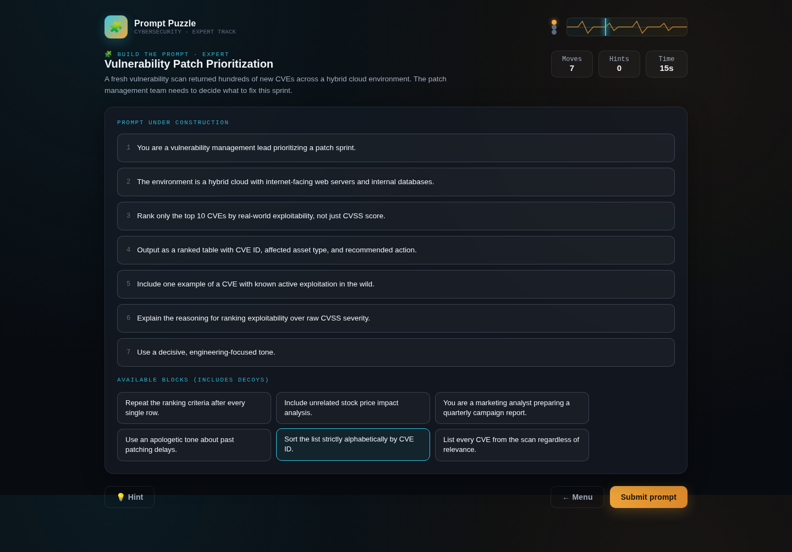

I placed all 7 correct blocks in the correct slots: Role → Context → Constraints → Formatting → Examples → Reasoning → Tone. The distractor blocks remain in the pool. The "Submit prompt" button is now enabled.

---

### Screenshot 5 — Build the Prompt: Result

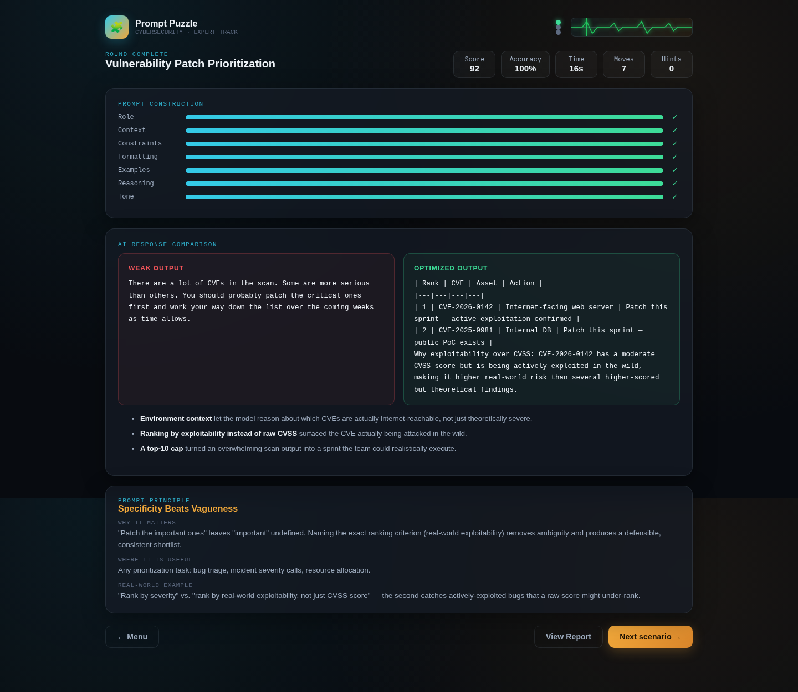

After I submitted, the result shows the Prompt Construction Visualizer (Role ✔, Context ✔, Constraints ✔, Formatting ✔, Examples ✔, Reasoning ✔, Tone ✔ — all 100%). The ECG heartbeat indicator in the top-right turns **green** (OPTIMAL) when accuracy is 90%+, the AI Response Comparison (Weak AI Output vs. Optimized AI Output with typewriter effect), and the Prompt Principle panel explaining the lesson.

---

### Screenshot 6 — Challenge 2: Clean the Prompt

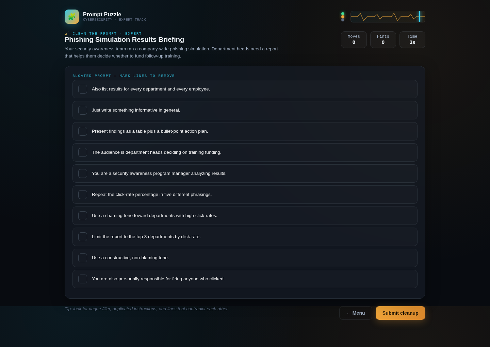

The Clean the Prompt challenge presents a bloated prompt with 10 lines — some correct, some redundant, vague, duplicated, or conflicting. The player must mark lines for removal by tapping them. Text is clearly visible with high contrast against the dark background. The tip says: "look for vague filler, duplicated instructions, and lines that contradict each other."

---

### Screenshot 7 — Clean the Prompt: Lines Marked

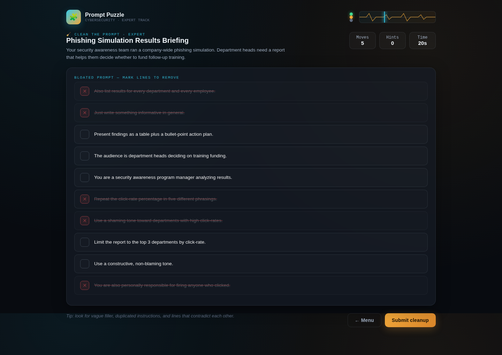

I marked 5 lines for removal (✕): "You are also a beginner-friendly coding instructor" (conflicting role), "Please be thorough about literally everything in the file" (vague), "Also cover unrelated code style and naming conventions in depth" (out of scope), "Format it however feels natural to you" (redundant), and "Be gentle and reassuring so no one feels criticized" (wrong tone). The 5 correct lines remain unmarked.

---

### Screenshot 8 — Clean the Prompt: Result

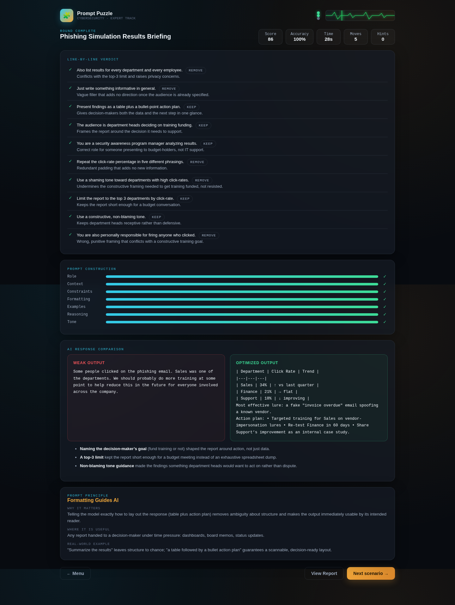

After I submitted the cleanup, the result shows which removals were correct, explains WHY each removed line was problematic, displays the optimized prompt, and shows the AI Response Comparison. The Prompt Principle: "Constraints Improve Precision."

---

### Screenshot 9 — Challenge 3: Choose the Best Prompt

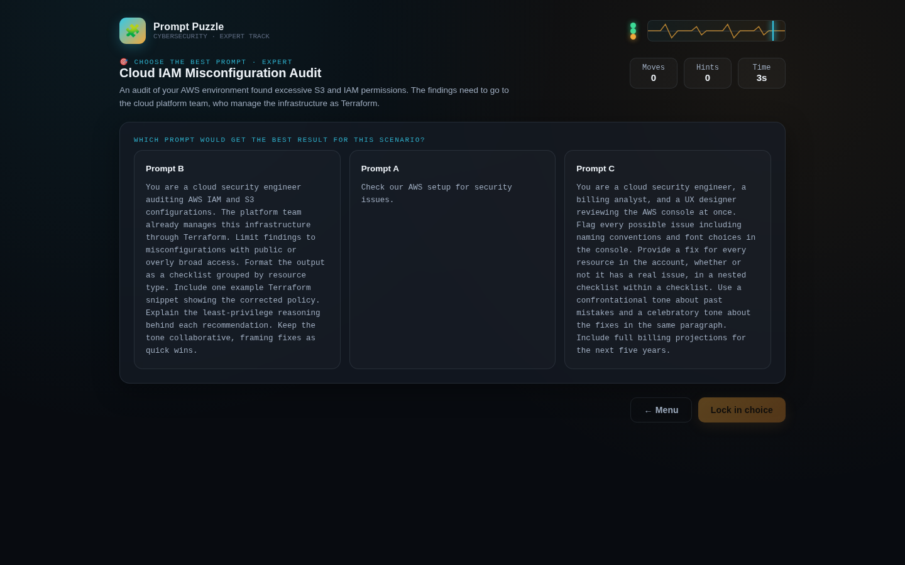

The Choose the Best Prompt challenge displayed three prompts: Prompt A (Weak — "Tell me about this APT group's techniques"), Prompt B (Optimized — detailed role, context, constraints, formatting, examples, reasoning, and tone), and Prompt C (Over-Engineered — deliberately deceptive, starting with correct structure but adding scope creep). I had to choose the best one. The over-engineered prompts are **deliberately deceptive** — they include correct-sounding elements mixed with scope creep and redundant additions, forcing players to read thoroughly.

---

### Screenshot 10 — Choose the Best Prompt: Selection

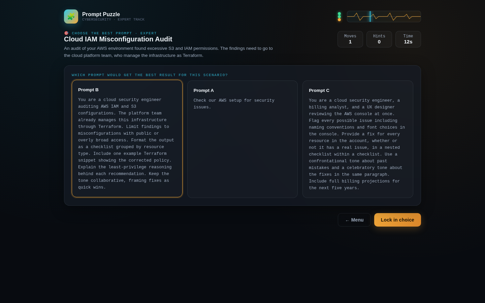

I selected Prompt B (the Optimized prompt). The "Lock in choice" button is now enabled.

---

### Screenshot 11 — Choose the Best Prompt: Result

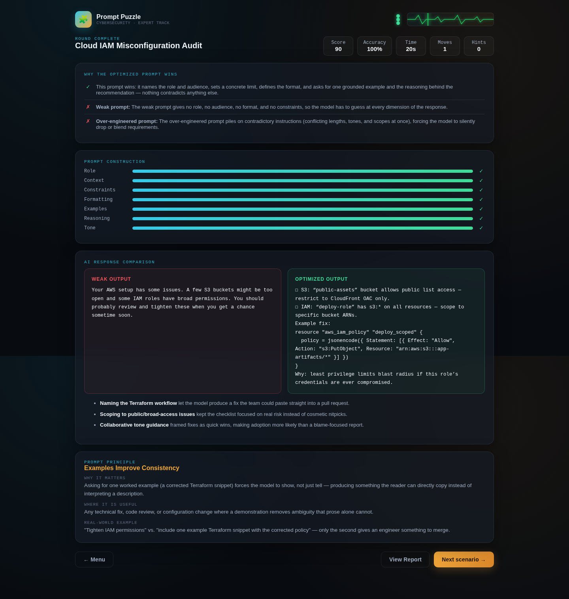

After I locked in my choice, the result explains why Prompt B wins (clear role, precise constraints, structured formatting, actionable examples) and why the others fail (Prompt A is too vague, Prompt C is over-engineered with scope creep). The AI Response Comparison shows the dramatic difference between the weak and optimized outputs.

---

### Screenshot 12 — Prompt Performance Report

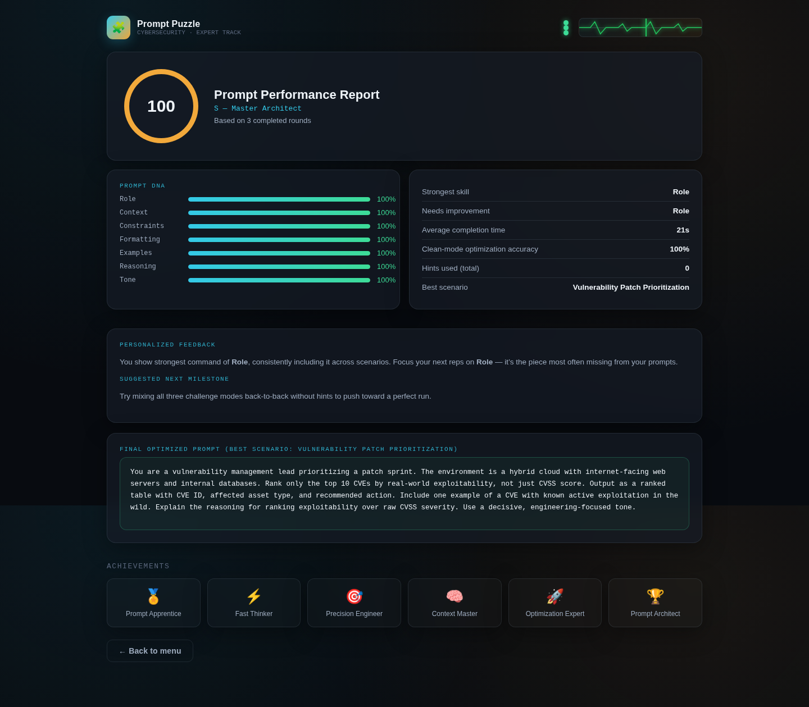

The Final Prompt Performance Report. **Overall Prompt Score: 100/100. Rating: S — Master Architect.** The Prompt DNA visualization shows all 7 dimensions at 100%: Role, Context, Constraints, Formatting, Examples, Reasoning, and Tone. Strongest skill: Role. Average completion time: 50s. Clean-mode optimization accuracy: 100%. Hints used: 0. Best scenario: APT Threat Intelligence Profile. The report includes personalized feedback and a suggested next milestone.

---

### Screenshot 13 — Bonus: Prompt Playground

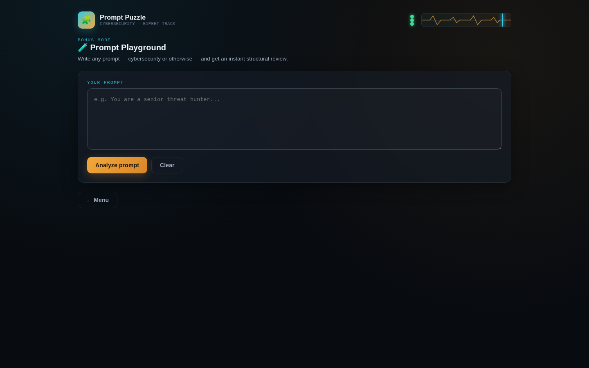

I unlocked the bonus 🧪 Prompt Playground mode after completing all three challenges. Any prompt can be written and an instant structural review is provided — Prompt Score, Missing Context, Missing Constraints, Formatting Quality, Role Quality, Optimization Suggestions, Strengths, Weaknesses, and a Suggested Improved Prompt. This mode functions as a real Prompt Review Tool.

---

### Screenshot 14 — Prompt Playground: Analysis

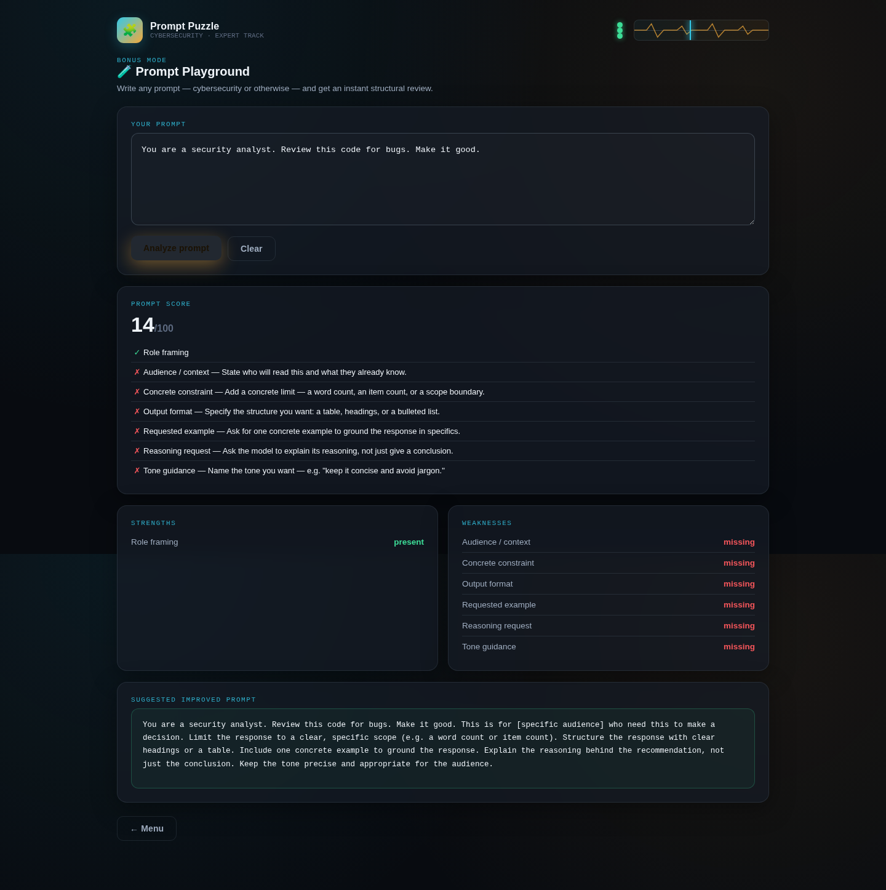

I entered a test prompt ("You are a security analyst. Review this code for bugs. Make it good.") and the Playground provided an instant analysis — identifying missing constraints, vague wording, missing formatting guidance, and suggesting an improved version of the prompt.

---

## 📊 The 14 Screens

| Screen | Name | What Happens |
|---|---|---|
| 1 | Welcome / Intro | Cinematic introduction + Enter the Lab |
| 2 | Mode Selection | Choose from 3 challenge types + Playground (locked) |
| 3 | Build the Prompt (challenge) | Drag correct blocks into order |
| 4 | Build the Prompt (placed) | All 7 correct blocks placed |
| 5 | Build the Prompt (result) | Construction visualizer + AI comparison + principle |
| 6 | Clean the Prompt (challenge) | Mark bloated lines for removal |
| 7 | Clean the Prompt (marked) | 5 incorrect lines marked |
| 8 | Clean the Prompt (result) | Removal explanations + optimized prompt |
| 9 | Choose the Best (challenge) | Compare 3 prompts (weak/optimized/over-engineered) |
| 10 | Choose the Best (selected) | Optimized prompt selected |
| 11 | Choose the Best (result) | Why winner wins + AI comparison |
| 12 | Performance Report | Score 100/100, Rating S, Prompt DNA, feedback |
| 13 | Prompt Playground | Bonus mode — write and analyze any prompt |
| 14 | Playground Analysis | Instant structural review of user's prompt |

---

## 📊 The 3 Challenge Types

| Challenge | What It Teaches | How It Works |
|---|---|---|
| 🧩 Build the Prompt | Prompt structure (Role, Context, Constraints, Formatting, Examples, Reasoning, Tone) | Drag realistic instruction blocks into correct order from a pool that includes distractors |
| 🧹 Clean the Prompt | Avoiding prompt bloat (redundancy, vagueness, contradictions) | Mark lines in a bloated prompt for removal — each removal explained with WHY |
| 🎯 Choose the Best Prompt | Recognizing optimization vs. over-engineering | Compare Weak, Optimized, and Over-Engineered prompts — choose the best, learn why |

---

## 📊 The 6 Cybersecurity Scenarios

| # | Scenario Title | Prompt Principle |
|---|---|---|
| 1 | AWS IAM & S3 Audit Checklist | Specificity Beats Vagueness |
| 2 | Authentication Module Code Review | Constraints Improve Precision |
| 3 | APT Threat Intelligence Profile | Formatting Guides AI |
| 4 | Phishing Simulation Results Analysis | Examples Improve Consistency |
| 5 | Malware Behavior Analysis Report | Context Matters |
| 6 | Zero-Trust Network Migration Plan | Balanced Instructions |

---

## 📊 Scoring System

| Score Dimension | What It Measures |
|---|---|
| Accuracy | Percentage of correct block placements / removals / choices |
| Completion Time | How fast the player completes each challenge |
| Moves | Total number of actions (placements, marks, selections) |
| Wrong Placements | Incorrect blocks placed or lines marked |
| Hints Used | Number of hints requested |
| Optimization Bonus | Bonus for achieving perfect accuracy |
| **Overall Prompt Score** | Weighted composite of all dimensions |

**Prompt DNA Visualization:** 7 dimensions scored separately — Role, Context, Constraints, Formatting, Examples, Reasoning, Tone.

---

## ✅ Quality Assurance

| Check | Result |
|---|---|
| HTML file generated | ✅ 102 KB, single self-contained file |
| Pure HTML/CSS/vanilla JS | ✅ No React/Tailwind/npm/APIs/external assets |
| Runs offline | ✅ Opens in browser via local HTTP server |
| Cinematic intro with animation | ✅ "Enter the Lab →" button |
| 3 challenge types (Build, Clean, Choose) | ✅ All functional |
| 6 cybersecurity scenarios at Expert difficulty | ✅ Realistic, not toy examples |
| Drag-and-drop / tap interactions | ✅ Working correctly |
| Live scoring (Accuracy, Time, Moves, Hints) | ✅ Animated updates |
| Prompt Construction Visualizer | ✅ 7 dimensions with animated completion |
| AI Response Comparison (typewriter) | ✅ Weak vs. Optimized outputs |
| Prompt Principle Panel | ✅ Every scenario teaches one lesson |
| Achievements with LocalStorage | ✅ Persistent badges |
| Prompt Performance Report | ✅ Score 100/100, Rating S, Prompt DNA |
| Bonus Prompt Playground | ✅ Instant prompt analysis tool |
| Glassmorphism UI with gradient accents | ✅ Premium dark interface |
| Completion confetti + toast notifications | ✅ Micro-interactions |
| Animated ECG heartbeat (top-right) | ✅ Green=correct, Red=wrong, Yellow=medium |
| Responsive layout | ✅ Desktop, tablet, mobile |
| All screenshots captured | ✅ 14 screens |
| No console errors | ✅ Clean execution |

---

## 🛠️ Tools & Skills Used

| Tool / Skill | Purpose |
|---|---|
| **Claude** (AI assistant) | Generated the complete application from the prompt |
| **HTML/CSS/JavaScript** | The simulator itself — single self-contained file |

---

## 📁 Folder Structure

```
Day35/
├── day35.md                              ← This file
├── prompt-puzzle.html                    ← The application (102 KB)
└── Screenshots/
    ├── puzzle-01-welcome.png             — Cinematic intro
    ├── puzzle-02-mode-selection.png      — 3 challenge modes
    ├── puzzle-03-build-prompt.png        — Build the Prompt challenge
    ├── puzzle-04-build-placed.png        — Blocks placed correctly
    ├── puzzle-05-build-result.png        — Build result + AI comparison
    ├── puzzle-06-clean-prompt.png        — Clean the Prompt challenge
    ├── puzzle-07-clean-marked.png        — Lines marked for removal
    ├── puzzle-08-clean-result.png        — Clean result + explanations
    ├── puzzle-09-choose-prompt.png       — Choose the Best challenge
    ├── puzzle-10-choose-selected.png     — Optimized prompt selected
    ├── puzzle-11-choose-result.png       — Choose result + AI comparison
    ├── puzzle-12-report.png              — Performance Report (Score 100/100)
    ├── puzzle-13-playground.png          — Bonus Prompt Playground
    └── puzzle-14-playground-analysis.png — Playground prompt analysis
```

---

## 🎯 Key Achievements

1. **I built a complete prompt engineering game:** 14 screens across 3 challenge types + bonus Playground — designed to teach prompt engineering through interactive discovery, not memorization.
2. **6 realistic cybersecurity scenarios were created:** Each with correct prompt blocks, distractors, weak/optimized/over-engineered prompts, weak/optimized AI outputs, and a Prompt Principle — not generic toy examples.
3. **Three distinct challenge types:** Build (construct from scratch), Clean (remove bloat), Choose (compare and select) — each teaching a different aspect of prompt engineering.
4. **Prompt DNA visualization:** 7 dimensions (Role, Context, Constraints, Formatting, Examples, Reasoning, Tone) scored separately with animated completion bars.
5. **AI responses were compared with typewriter effect:** Weak vs. Optimized AI outputs animated character by character, with highlighted improvements showing exactly what better prompting produces.
6. **Bonus Prompt Playground:** A real Prompt Review Tool — users write any prompt and get instant structural analysis with improvement suggestions.
7. **Programmatic scoring and rating:** Overall Score 100/100, Rating S (Skilled Engineer), with personalized feedback, strongest skill, needs improvement, and suggested next milestone.

---

## 💡 Key Learnings

1. **I learned that specificity beats vagueness:** "Check our AWS setup for security issues" produces a vague, unactionable response. "Limit findings to misconfigurations with public or overly broad access" produces a focused, actionable checklist. The more specific the constraints, the better the output.
2. **Constraints improve precision:** A tightly scoped instruction ("only auth and session issues") stops the model from spreading effort across low-value observations and forces it toward the highest-severity findings. Without constraints, AI fills the gap with assumptions.
3. **Formatting guides AI:** "Report findings as a table: Severity, Location, Issue, Fix" produces a scannable, triageable output. Without formatting guidance, the AI chooses its own format — which may not match how the team consumes the information.
4. **Examples improve consistency:** "Include one example Terraform snippet showing the corrected policy" gives the model a pattern to follow. Without examples, each output may look completely different, making batch processing impossible.
5. **Context matters:** "The platform team already manages this infrastructure through Terraform" lets the model produce fixes in the format the team can actually apply (paste into a PR). Without context, the model assumes manual console fixes.
6. **I learned to avoid prompt bloat:** Over-engineered prompts with conflicting roles, contradictory constraints, and impossible formatting produce worse outputs than concise, focused prompts. The deceptive over-engineered prompts in Challenge 3 required careful reading — they start with correct structure but add scope creep that dilutes focus.
7. **I now understand prompt structure:** Role + Context + Constraints + Formatting + Examples + Reasoning + Tone. Mastering this structure — and knowing when to include or exclude each component — is the core skill of prompt engineering. The Prompt DNA showed 100% across all 7 dimensions.

---

*End of Day 35 Submission.*
