# Day 37 – Task Compass

## Overview

A single-file HTML application that teaches how work flows through real organizations by putting you in the role of a manager routing tickets across an AI Startup. Instead of testing job titles, it tests ownership thinking, delegation habits, workflow sequencing, and cross-team collaboration through nine concrete scenarios spread across three stages.

The problem it addresses is one that most organizational training gets wrong: it teaches theory in the abstract. People learn what a Product Manager does, but not when a ticket should land on their desk versus someone else's. Task Compass closes that gap by presenting realistic workplace tickets — "Users report the AI chatbot gives wildly wrong answers, but only for non-English queries" — and asking you to decide who owns it, how it routes through teams, and which departments need to collaborate.

The educational objective is organizational thinking, not correctness. Every answer reveals reasoning rather than a score, and the final reflection focuses on patterns in your decision-making rather than points.

---

## Features

- **Workplace selector** pre-configured for AI Startup context, with 10 role cards (AI Engineer, Frontend Engineer, Backend Engineer, QA Engineer, Product Manager, UX Designer, Customer Success, DevOps Engineer, Marketing Lead, Founder), each with a distinct color identity.
- **Stage 1 — Who Owns This?** presents a workplace ticket and asks you to drag or click one role into the ownership slot. After submission, it reveals the primary owner, explains why they own it, and lists supporting roles with their specific contributions. Never says "correct" or "wrong" — instead shows "Aligned with common practice" or "A different pattern is more common."
- **Stage 2 — Task Routing** asks you to build the workflow sequence by placing role cards into numbered slots in order. After submission, an animated flow diagram shows the ticket traveling through each role to resolution, with an explanation of why that order is standard practice.
- **Stage 3 — Collaboration Challenge** presents larger escalation situations and asks you to assign 2–4 departments. After submission, it reveals the primary owner, supporting teams, reasoning, and a communication flow diagram showing how information moves through the organization.
- **Organizational Thinking Dashboard** visualizes five metrics — Ownership Thinking, Delegation, Workflow Planning, Cross-Team Collaboration, and Decision Confidence — as animated bars, plus an Organizational Thinking Style classification.
- **Reflection Report** generates personalized feedback across four dimensions: what you understood well, where you over-assigned responsibility, where collaboration could improve, and what might surprise you. Ends with a key insight about how organizations actually work.
- **Three export options** — Print/Save as PDF, TXT report, and JSON report — all fully client-side with no external libraries.
- **Game feel** includes drag-and-drop with click-to-select fallback, snap animations, confetti on correct answers, ripple button effects, smooth screen transitions, progress indicator, and keyboard accessibility throughout.

### Ten Refinements That Took This From Working to Polished

1. **Namespaced role card IDs.** Card IDs use a stage-prefixed pattern (`card-s1-ai`, `card-s2-ai`, `card-s3-ai`) rather than generic IDs like `card-ai`. This eliminates any possibility of duplicate IDs colliding if a future version renders multiple stages simultaneously, and makes DOM lookups predictable.
2. **Minimum collaboration requirement.** Stage 3 requires at least 2 departments before submission is enabled. This reinforces the core lesson that complex workplace problems usually involve collaboration rather than a single owner — the constraint itself is the teaching mechanism.
3. **Improved Stage 3 validation.** Dynamic helper text updates in real time ("Select at least 2 departments... 1/2 selected") so users always understand why they can't continue. The hint disappears once the minimum is met, reducing friction without removing the guardrail.
4. **Duplicate role prevention.** Once a role card is placed in a workflow sequence or collaboration team, it gets a `used` class that disables further interaction, grays it out, and sets `pointer-events:none`. This prevents the same role from appearing twice in a sequence — a common source of confusing submissions.
5. **Dual interaction support.** Every stage supports both drag-and-drop and click-to-select. A role card can be clicked to select it, then the target slot clicked to place it. This makes the experience work on touch devices and for users who prefer clicking, without requiring separate code paths.
6. **Reusable component architecture.** Role cards are built by a shared `buildRoleCard()` function that accepts a stage prefix, a drag-state key, and an optional callback. This reduces duplicated code across all three stages and makes adding a new workplace theme a matter of swapping data arrays rather than rewriting rendering logic.
7. **More meaningful organizational analytics.** The dashboard calculates five metrics rather than a single score: Ownership Thinking (Stage 1 accuracy), Workflow Planning (Stage 2 step matching), Delegation (Stage 3 team-sizing efficiency), Cross-Team Collaboration (Stage 3 overlap with ideal teams), and Decision Confidence (composite average). A sixth dimension — Organizational Thinking Style — classifies the player as Ownership Focused, Collaborative Planner, Systems Thinker, or Balanced Coordinator.
8. **Enhanced reflection report.** Instead of a numeric score, the reflection covers four qualitative dimensions: strengths, over-assignment tendencies, collaboration gaps, and surprising patterns. Each section generates text dynamically based on actual performance data, and ends with a randomized key insight drawn from a pool of organizational principles.
9. **Multiple offline export options.** Three fully client-side export paths: a print-optimized PDF layout (using the browser's native print dialog with a hidden `#printArea` div), a plain-text report, and a structured JSON file. No external libraries, no server calls, no data leaving the browser.
10. **Production-level polish.** Numerous UX improvements: smoother CSS transitions with cubic-bezier easing, confetti celebrations on aligned answers, animated workflow diagrams with staggered delays, progress tracking in the topbar, glassmorphism with backdrop-filter, responsive grid layouts, keyboard accessibility (tabindex + Enter/Space activation), ripple button effects, and clean state management through a single `App` object.

---

## Screenshots

### Home Screen

The landing screen shows the AI Startup workplace context, learning objectives, simulation overview, and progress tracker. The glassmorphism cards sit on a radial gradient background with a floating compass icon.

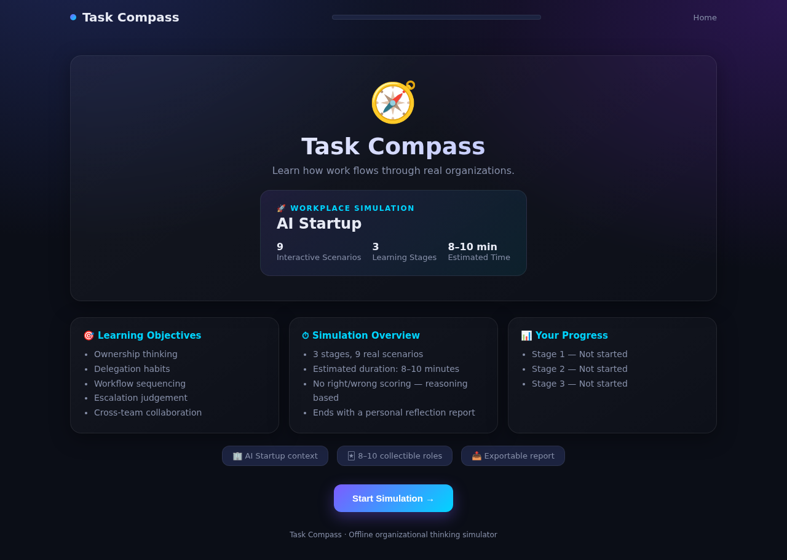

### Stage 1 — Who Owns This?

Each ticket presents a realistic workplace scenario with 8 role cards. You drag or click one role into the ownership slot, then submit to see the reveal.

**Q1: AI chatbot wrong answers for non-English queries**

The question screen with the ticket and role pool:

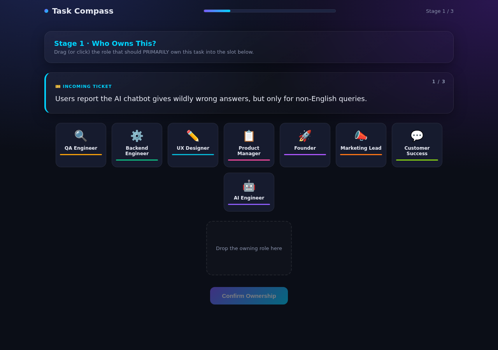

The reveal shows the primary owner (AI Engineer), why they own it, and supporting roles (QA Engineer, Product Manager) with their specific contributions:

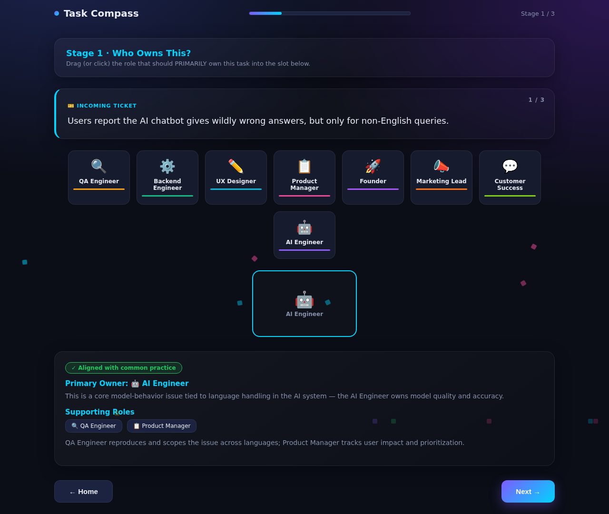

**Q3: API response times doubled (intentional miss)**

I deliberately picked QA Engineer instead of Backend Engineer to show the "different pattern" badge. The reveal still explains the correct owner and reasoning without marking it as "wrong":

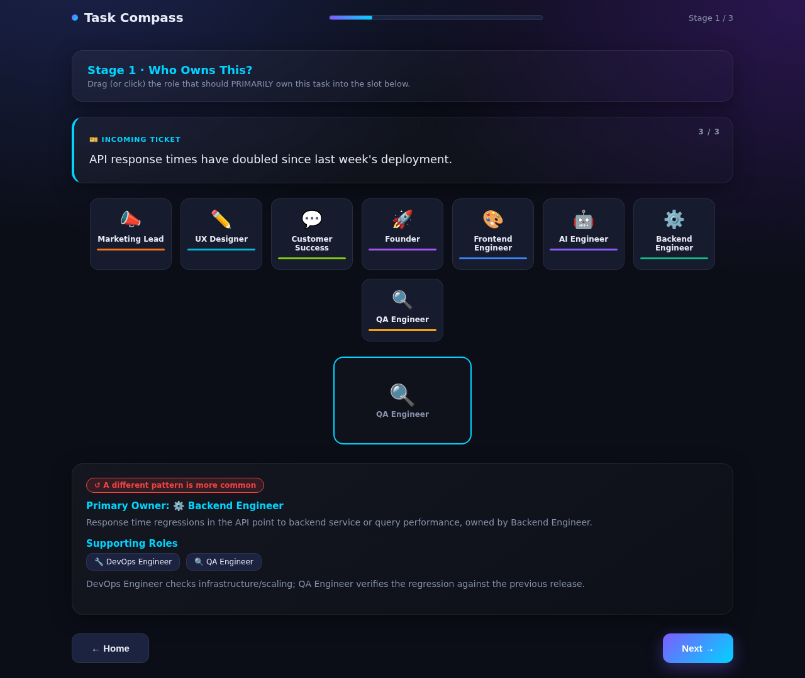

### Stage 2 — Task Routing

Each ticket requires building a workflow sequence. You place role cards into numbered slots in order, then submit to see an animated flow diagram.

**Q1: AI assistant gave a factually incorrect answer**

The question screen with sequence slots and role pool:

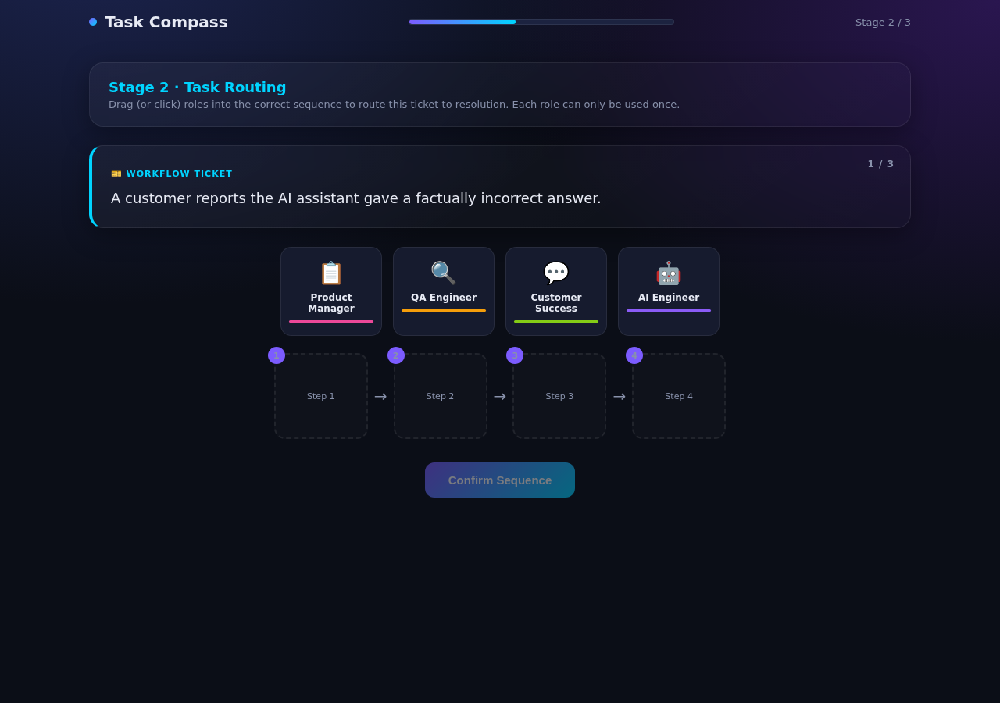

The reveal animates the ticket flowing through Customer Success → QA → AI Engineer → Product Manager → Customer, with an explanation of why this order is standard:

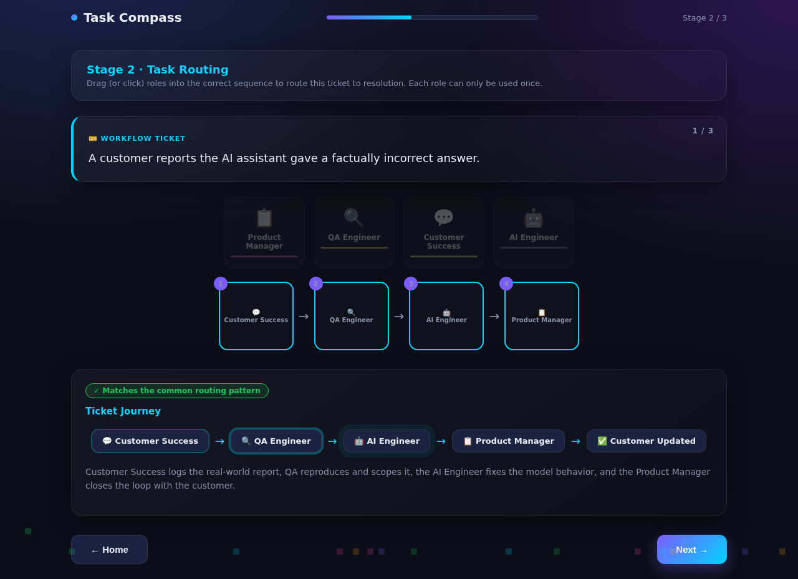

**Q2: Payment webhook failing intermittently**

A 5-step workflow (CS → QA → Backend → DevOps → PM) showing how a more complex ticket routes through more hands:

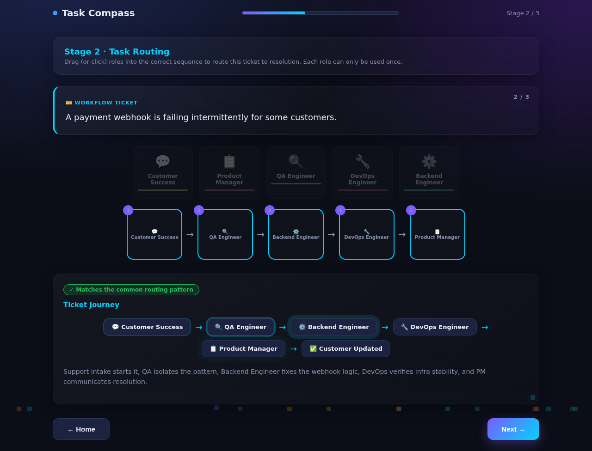

### Stage 3 — Collaboration Challenge

Larger escalation situations where you assign 2–4 departments. The reveal shows the primary owner, supporting teams, reasoning, and a communication flow diagram.

**Q1: Customer satisfaction scores suddenly drop**

The question screen with the collaboration zone (minimum 2 departments required):

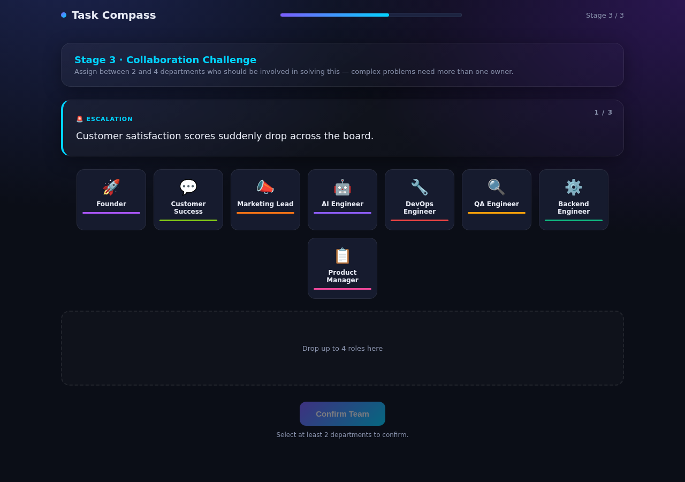

The reveal shows the primary owner (Customer Success), supporting teams (Backend, QA, Product Manager), and the communication flow through the organization:

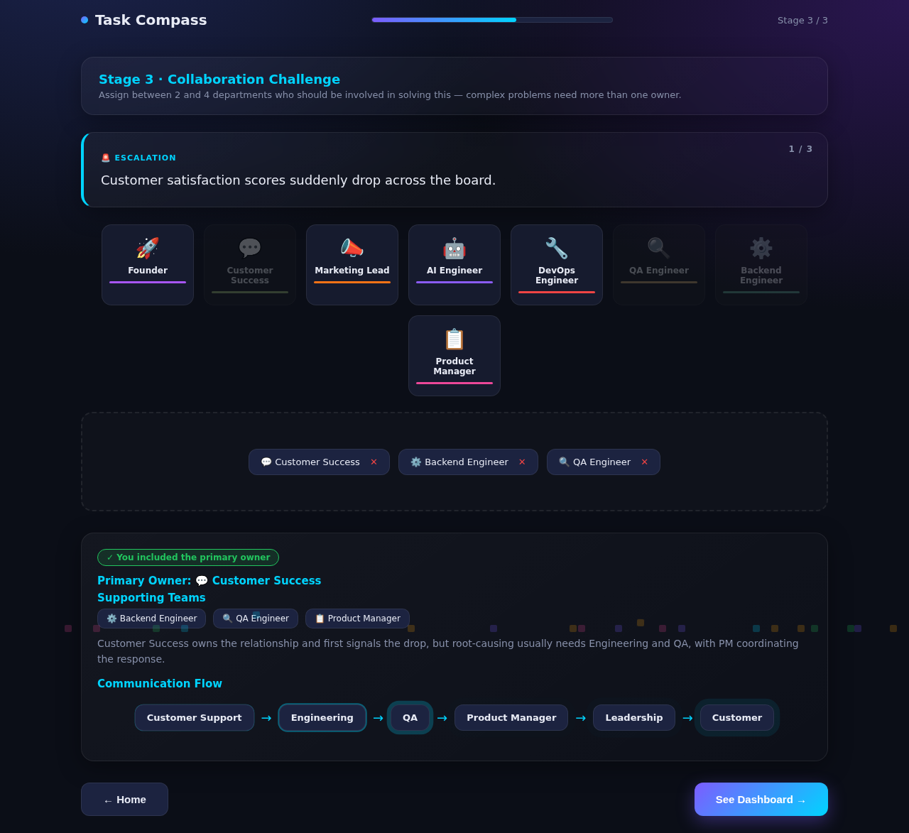

**Q2: Negative reviews spike after a new AI feature launch**

All 4 correct departments assigned (PM + AI + CS + Marketing), showing the full communication flow:

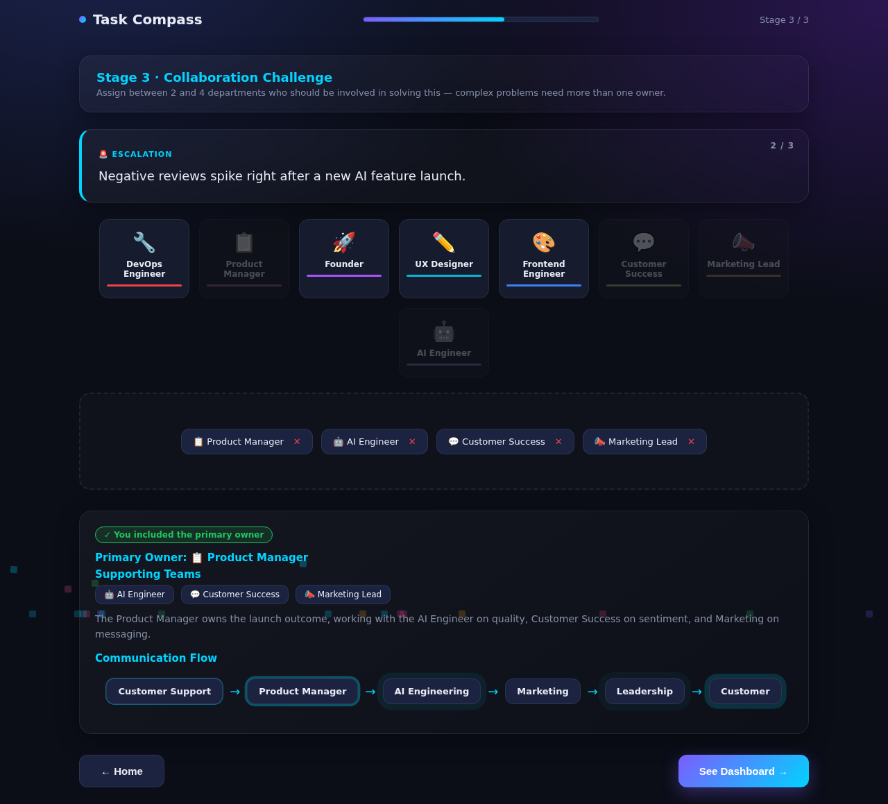

**Q3: Major promised feature is delayed (missed primary)**

I picked Backend + Frontend + Founder but missed the Product Manager (the actual primary owner). The reveal flags that the primary owner is usually essential:

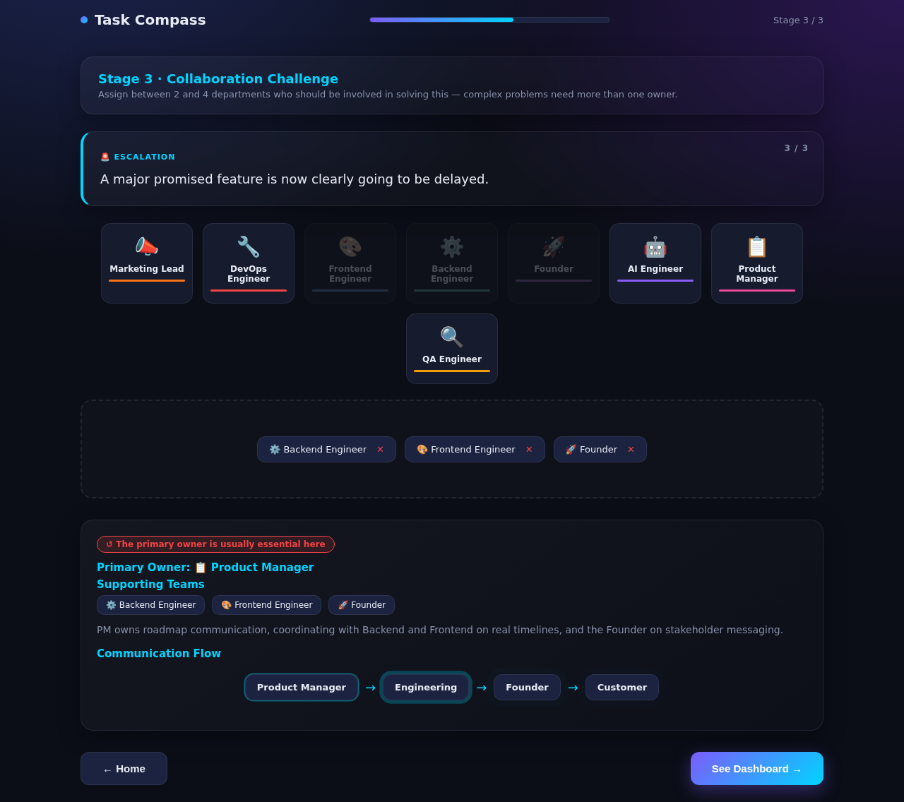

### Organizational Thinking Dashboard

The dashboard visualizes five metrics as animated bars and classifies your thinking style. This run scored: Ownership 67%, Delegation 83%, Workflow Planning 69%, Cross-Team Collaboration 83%, Decision Confidence 76% — resulting in a "Collaborative Planner" style.

📄 **[View Dashboard Report (PDF)](reports/Dashboard.pdf)**

### Organizational Reflection

The reflection report generates personalized feedback across four dimensions, ending with a key insight. This run's takeaway: "Clear ownership usually improves speed more than adding more people."

📄 **[View Reflection Report (PDF)](reports/Reflection.pdf)** 

---

## Technologies Used

- HTML5
- CSS3 (glassmorphism, backdrop-filter, CSS custom properties, cubic-bezier transitions, @keyframes animations, responsive grid)
- Vanilla JavaScript (single `App` object pattern, drag-and-drop API, DOM manipulation, no dependencies)
- CSS-based confetti and ripple effects (no canvas or external libraries)
- Browser Print API (native PDF export via `window.print()` with a print-optimized layout)

---

## Key Learnings

### Technical Learnings

- **Namespaced DOM IDs prevent subtle bugs in multi-stage apps.** When the same role appears across stages, generic IDs like `card-ai` break `getElementById` if two stages render simultaneously. Prefixing with the stage (`card-s1-ai`) is a cheap fix that eliminates an entire class of bugs without adding complexity.
- **Drag-and-drop and click-to-select should share the same state.** Rather than building two interaction models, both input methods write to the same `App.s1drag` / `App.s2drag` / `App.s3drag` state variable. The slot's `onclick` handler reads that state just like the `ondrop` handler does. This halves the interaction code and ensures both methods produce identical behavior.
- **Print CSS needs an override strategy for dynamic content.** The app's built-in print CSS hides everything except a `#printArea` div that only gets populated when the user clicks "Print / Save as PDF." For headless PDF generation, this means the page appears empty. The solution is injecting a runtime style override that neutralizes the visibility rules while preserving the dark background — without modifying the source HTML file.
- **Scoring algorithms should reflect what you're teaching, not what's easy to measure.** The dashboard calculates Delegation as team-sizing efficiency (how close your team size is to the ideal), not just accuracy. This rewards selecting the right number of people, not just the right people — which is the actual skill being taught.

### Conceptual Learnings

- **Ownership and collaboration aren't opposites — they're layers.** Stage 1 asks "who owns this?" and Stage 3 asks "who should be involved?" The same ticket can have a clear primary owner AND require four departments. The app structures this as two separate questions rather than forcing a choice between individual and collective ownership.
- **Workflow sequencing reveals bottlenecks more than role assignment does.** Getting the right owner (Stage 1) is easier than getting the right order (Stage 2). A 5-step workflow like CS → QA → Backend → DevOps → PM has 120 possible orderings; only one is standard practice. The partial-match scoring ("3/5 steps matched") is more honest than a binary correct/incorrect.
- **Over-assignment feels safe but slows decisions.** The reflection explicitly flags when you assigned more departments than the situation needs. Adding teams can feel like thoroughness, but in real organizations it blurs accountability and creates coordination overhead. The app quantifies this tendency rather than just noting it.

### Personal Reflection

The most useful thing the simulation surfaced was the gap between my Stage 1 and Stage 3 thinking. I identified primary owners accurately (67% in Stage 1) and selected well-sized teams (83% delegation in Stage 3), but my workflow sequencing was weaker (69% in Stage 2). That tracks — I tend to know who should be involved but am less precise about the order in which work should move between them. The "Collaborative Planner" style classification felt accurate rather than flattering: I do loop in the right supporting teams, but the simulation made it clear that sequencing is where I lose efficiency. The key insight — "clear ownership usually improves speed more than adding more people" — is something I've experienced in practice but hadn't seen quantified before.

---

## Project Structure

```
day37/
├── task-compass.html
├── day37.md
├── Screenshots/
│   ├── 01-home.png
│   ├── 02-s1-q1-question.png
│   ├── 03-s1-q1-reveal.png
│   ├── 04-s1-q2-question.png
│   ├── 05-s1-q2-reveal.png
│   ├── 06-s1-q3-question.png
│   ├── 07-s1-q3-reveal.png
│   ├── 08-s2-q1-question.png
│   ├── 09-s2-q1-reveal.png
│   ├── 10-s2-q2-question.png
│   ├── 11-s2-q2-reveal.png
│   ├── 12-s2-q3-question.png
│   ├── 13-s2-q3-reveal.png
│   ├── 14-s3-q1-question.png
│   ├── 15-s3-q1-reveal.png
│   ├── 16-s3-q2-question.png
│   ├── 17-s3-q2-reveal.png
│   ├── 18-s3-q3-question.png
│   └── 19-s3-q3-reveal.png
└── reports/
    ├── Dashboard.pdf
    └── Reflection.pdf
```

---

## Final Thoughts

Task Compass does what it set out to do: it teaches organizational thinking through concrete scenarios rather than abstract theory. The three-stage structure moves naturally from individual ownership to workflow sequencing to cross-team collaboration, and the reasoning-based reveals mean every answer teaches something regardless of whether you matched the common pattern. The ten refinements — from namespaced IDs to the minimum collaboration requirement to the multi-format export — transformed it from a functional quiz into something that feels like a strategy game. The dark glassmorphism UI and animated flow diagrams don't hurt either. The one thing I'd improve is the workflow partial-match scoring: "3/5 steps matched" tells you how many were right but not which ones, and knowing which positions you got wrong would be more instructive for someone trying to improve their sequencing instincts.
