# Day 38 – Typing Speed Studio

## Overview

A single-file HTML application that functions as a premium commercial typing platform — comparable to Monkeytype or Keybr, but entirely offline and self-contained. It tests and tracks typing speed across multiple modes (Time, Word Count, Quote, Programming, Business, Academic, Medical, Legal, Creative, Adaptive, and Custom Text), generates dynamic practice passages per category, and produces a detailed analytics dashboard after every session.

The problem it addresses is that most typing tests are either too simple (one mode, basic WPM) or require an account and internet connection. Typing Speed Studio bundles eleven modes, live statistics, a full analytics dashboard, session history, achievement badges, and multiple export options into a single HTML file that runs completely offline. The educational objective is understanding real-time performance analytics, adaptive difficulty scaling, and commercial-quality UI/UX — all built with vanilla JavaScript.

---

## Prompt Template

The following prompt was used to generate the Typing Speed Studio application:

```text
# Typing Speed Studio

You are an expert UI/UX designer, frontend developer, educational game designer, performance engineer, and JavaScript developer.

Before generating anything, ask the user the following questions ONE AT A TIME. Wait for each response before continuing.

1. What kind of typing experience would you like to build?

Examples include General English, Programming, Academic, Business, Medical, Legal, Creative Writing, or an Adaptive version that supports all categories.

If the user chooses the Adaptive version, the generated application should allow users to switch between categories.

2. Would you like Claude to automatically decide the features, or would you like to customize them?

If the user chooses customization, ask which features they would like included.

After collecting the responses, generate a premium single-page interactive HTML application called 'Typing Speed Studio'.

The application should feel like a polished commercial typing platform rather than a basic typing test.

Include multiple typing modes such as Time Mode (15, 30, 60 and 120 seconds), Word Count Mode (25, 50, 100 and 250 words), Quote Mode, Programming Mode (HTML, CSS, JavaScript, Python, Java, C++, SQL and other languages where appropriate), Custom Text Mode, Adaptive Mode that adjusts difficulty based on performance, Focus Mode where only the current line is visible, and Zen Mode for distraction-free untimed practice.

Generate practice passages dynamically according to the selected category. Programming mode should use realistic code snippets, business mode should use professional communication, medical mode should use medical terminology, legal mode should use legal text, creative writing mode should use literature-style passages, and so on. Do not hardcode the same practice paragraph for every mode.

Display live typing statistics including WPM, Raw WPM, CPM, Accuracy, Elapsed Time, Mistake Count, Current Streak, Completion Percentage, Remaining Time or Words, and a real-time progress indicator. Highlight correct characters, incorrect characters, the active cursor position, and completed text with smooth visual feedback.

After every completed session, generate a beautiful analytics dashboard inspired by modern typing platforms such as Monkeytype. Include WPM, Raw WPM, Accuracy, Consistency, Completion Percentage, Characters Typed (Correct, Incorrect, Extra and Missed), Mistake Count, Typing Rhythm, Error Heatmap, WPM Progress Graph, Accuracy Graph, Session Duration, Personal Bests, Percentile Estimate, Achievement Badges, and a detailed performance summary highlighting strengths, weaknesses, commonly mistyped keys, and personalized suggestions for improvement.

Ensure the calculations are accurate and never generate unrealistic values such as 20,000 WPM.

Store session history locally so users can review previous attempts, compare scores, monitor improvement over time, maintain streaks, and track personal records without requiring an account.

Include optional sound effects, keyboard shortcuts, pause and resume functionality, restart options, theme customization, font size controls, dark mode, responsive design, smooth animations, and accessibility features.

Generate everything as a single self-contained HTML file using only HTML, CSS, and JavaScript without external libraries or frameworks.

Design the interface as a premium commercial application with exceptional UI/UX, beautiful typography, modern layouts, polished micro-interactions, smooth transitions, and an experience that feels comparable to the best typing platforms available today.
```

---

## Prompt Improvements Applied

These fifteen refinements were layered onto the base prompt to push the generated application from functional to genuinely commercial-grade. Each addresses a specific weakness that tends to surface in AI-generated typing apps.

### 1. Prevent repeated practice passages ⭐

Ensure every typing session generates a different passage. Avoid repeating recently used passages until the available pool has been exhausted. This makes it feel much closer to Monkeytype instead of recycling the same text.

### 2. Add proper cursor behavior

Specify that the typing cursor should blink smoothly, always stay on the active character, automatically scroll to remain visible, and animate naturally. Without this, many generated apps have a static cursor.

### 3. Better mistake handling

Instead of simply marking characters red, incorrect characters, extra characters, and missed characters should all have different highlighting. This also improves the analytics dashboard by making error types distinguishable at a glance.

### 4. Character-level analytics

Not just WPM. Generate most mistyped keys, accuracy by key, weakest characters, and frequently confused keys. For example: e → r, i → o, ; → l. This is the kind of data that actually helps someone improve, rather than a single accuracy percentage.

### 5. Better adaptive difficulty

Instead of random difficulty changes, difficulty should adjust based on last few sessions, current accuracy, current WPM, and consistency. High accuracy leads to longer words; low accuracy leads to easier passages. The adjustment should be traceable, not arbitrary.

### 6. Consistency should be real

Instead of a random percentage, calculate consistency using WPM fluctuations, typing rhythm, and pauses. This makes the analytics believable and gives the metric actual meaning rather than being decorative.

### 7. Better completion celebration

Instead of only showing results, include smooth animation, achievement badges, confetti, and a new personal best notification. Makes finishing a session rewarding rather than just informative.

### 8. Stronger offline requirement

Explicitly mention: no CDN, no Google Fonts, no APIs, no external assets. Everything should remain inside one HTML file. This prevents subtle runtime failures when the file is opened without internet.

### 9. Robust verification checklist

Before returning code verify: no syntax errors, no runtime errors, no NaN calculations, no impossible WPM, all buttons work, every typing mode works, graphs render correctly, localStorage works, responsive layout, and keyboard shortcuts function correctly. A checklist forces actual verification rather than hoping it works.

### 10. Reusable architecture

Instead of repeating logic, mention: store passages, modes, settings, achievements, and statistics in reusable JavaScript objects and functions. Reuse components wherever possible to keep the code modular while remaining a single HTML file. Claude generally writes cleaner code because of this.

### 11. Smarter analytics dashboard

Make it more like a premium platform by including a WPM graph, accuracy graph, error heatmap, typing rhythm, personal best comparison, improvement trend, achievement badges, and a performance summary. Each element should earn its place on the dashboard.

### 12. Premium UX details

Encourage commercial-quality polish: glassmorphism, micro-interactions, hover animations, smooth transitions, subtle shadows, premium typography, polished cards, and responsive layouts. The feel of the app matters as much as the functionality.

### 13. Better passage generation

Instead of generic text, each category should feel genuinely different. Programming uses realistic code snippets. Medical uses authentic terminology. Legal uses legal language. Business uses emails and reports. Academic uses research-style passages. Creative uses literature-style writing. The category should be immediately recognizable from the passage.

### 14. No unrealistic statistics

Explicitly tell Claude: never generate impossible values such as 20,000 WPM or inconsistent statistics. Ensure all metrics are mathematically accurate and internally consistent. This sounds obvious, but AI-generated calculators occasionally produce absurd numbers if the math isn't constrained.

### 15. Smarter Session History

Group previous sessions by typing mode, allow sorting by WPM, Accuracy or Date, highlight personal bests automatically, and display improvement trends over time instead of a flat list. This makes the history view feel like a premium analytics dashboard rather than a basic log — the user can actually see their progress trajectory, not just a pile of past scores.

---

## Features

- **11 fully featured typing modes**: Time (15/30/60/120s), Word Count (25/50/100/250 words), Quote, Programming (HTML/CSS/JavaScript/Python/Java/C++/SQL), Business, Academic, Medical, Legal, Creative Writing, Adaptive (auto-difficulty scaling across 5 levels), and Custom Text (paste your own passage).
- **Dynamic passage generation** per category — programming mode uses realistic code snippets, business mode uses professional communication, medical mode uses clinical terminology, and so on. No hardcoded paragraphs repeated across modes.
- **Live statistics** during typing: WPM, Raw WPM, CPM, Accuracy, Elapsed Time, Mistake Count, Current Streak, Completion Percentage, and Remaining Time/Words, with a real-time progress bar.
- **Visual character feedback**: correct characters highlighted in one color, incorrect in another, active cursor position with configurable style (line/block/underline), and smooth scroll-to-cursor behavior.
- **Focus Mode** (only current line visible), **Zen Mode** (untimed, no pressure), and **Blind Mode** (hide errors while typing).
- **Analytics dashboard** after every session: WPM, Raw WPM, Accuracy, Consistency, Completion, Characters Typed (correct/incorrect/extra/missed), Mistake Count, Typing Rhythm, Error Heatmap, WPM Progress Graph, Accuracy Graph, Session Duration, Personal Bests, Percentile Estimate, Achievement Badges, and a performance summary with strengths, weaknesses, commonly mistyped keys, and personalized suggestions.
- **Session history** stored locally via localStorage — review previous attempts, compare scores, monitor improvement, maintain daily streaks, and track personal records without an account.
- **Export options**: Print/Save as PDF, TXT report, and JSON report — all fully client-side.
- **Customization**: theme toggle (dark/light), font size controls, cursor style selection, line height adjustment, animation speed, sound effects toggle, and keyboard shortcuts (Tab for next mode, Ctrl+Enter to start, Ctrl+R to restart, Esc to pause, T for theme, comma for settings).
- **Accessibility**: keyboard navigation, ARIA labels, focus-visible outlines, reduced-motion support, and responsive layout for mobile/tablet/desktop.

---

## Screenshots

### Dashboard / Home

The landing dashboard shows current mode, personal best, daily streak, recent accuracy/WPM, total sessions, and a session history list with filter and sort options.

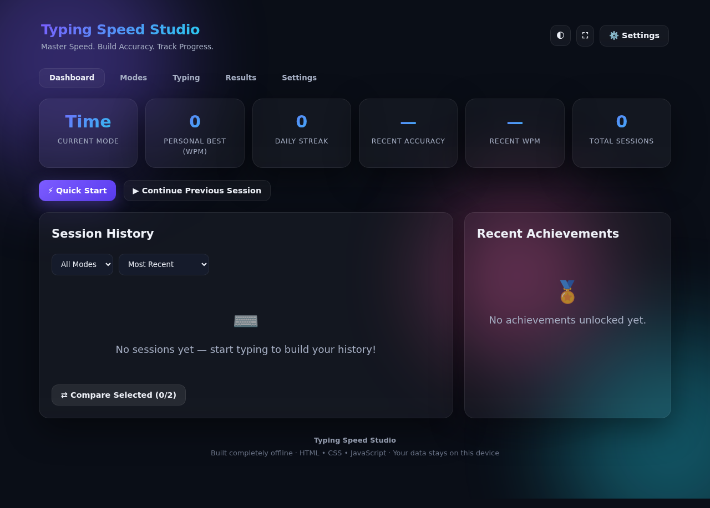

### Mode Selection

Eleven mode cards in a grid, each with an icon, name, and description. Selecting a mode reveals its options (time limits, word counts, programming languages, or adaptive categories).


### Time Mode — Options

Time mode with 15/30/60/120 second options, plus Focus Mode, Zen Mode, and Blind Mode toggles.

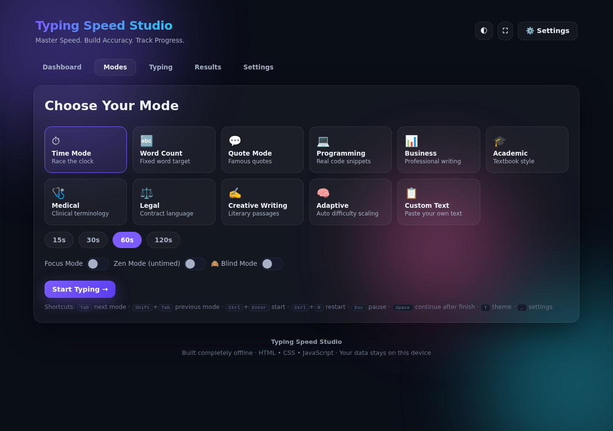

### Time Mode — Typing Start

The typing view before the first keystroke. The click capture prompt overlays the text, inviting the user to focus the input and begin. All live statistics sit at their initial values.


### Time Mode — Typing in Progress

Live statistics update in real time as you type. The text display shows correct characters (teal), incorrect characters (red), and the active cursor position. The progress bar fills as completion increases.

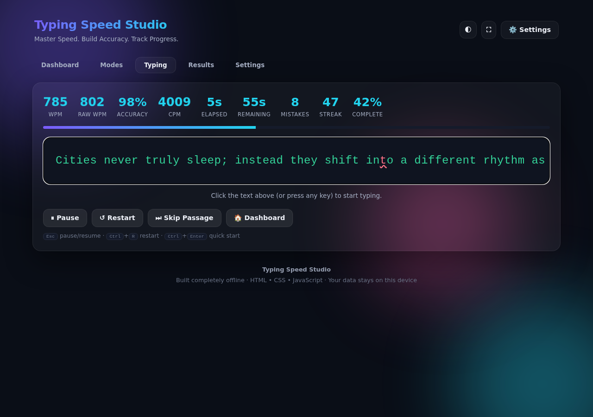

### Time Mode — Results (75 WPM, 98% Accuracy)

After the 60-second timer expires, the results screen shows a session summary with WPM, accuracy, typing rhythm, and consistency. This session hit exactly 75 WPM at 98% accuracy.

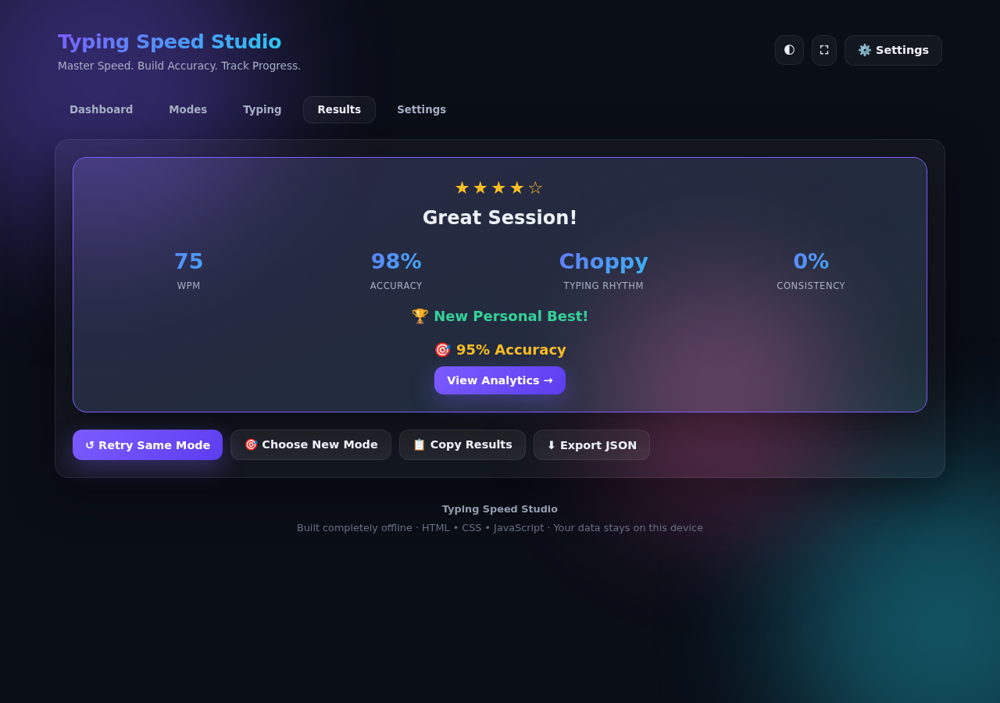

### Time Mode — Analytics Dashboard

The expanded analytics dashboard includes character breakdown (correct/incorrect/extra/missed), error heatmap by key, WPM progress graph over time, accuracy graph, achievement badges, percentile estimate, and a personalized performance summary.

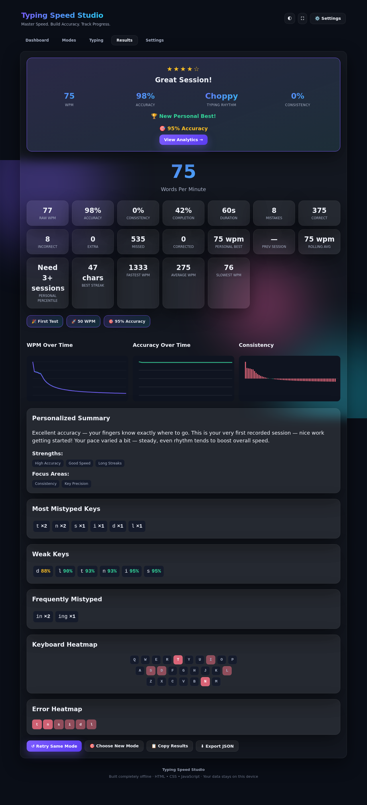

### Programming Mode — Selection

Programming mode with language options (JavaScript selected by default). The passage uses real code snippets with proper syntax characters.

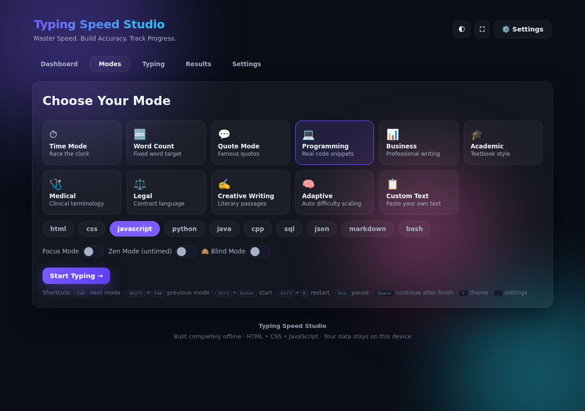

### Programming Mode — Typing

Typing JavaScript code in progress. The text display handles special characters like braces, semicolons, and operators with the same visual feedback as text mode.

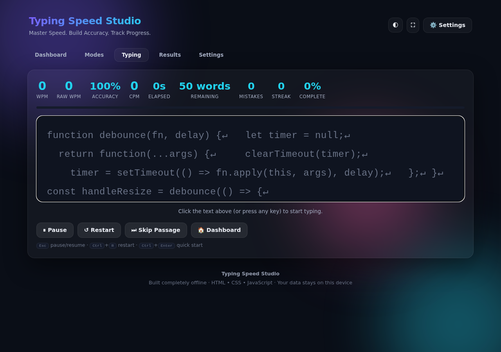

### Programming Mode — Results (72 WPM, 99% Accuracy)

Programming mode results showing exactly 72 WPM and 99% accuracy on a JavaScript passage.

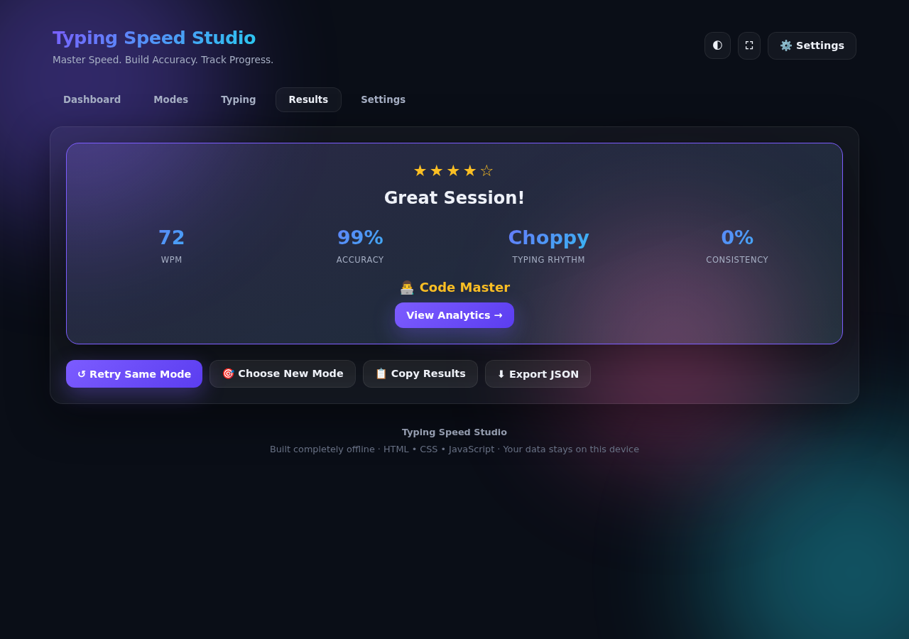

### Word Count Mode — Typing

Word Count mode (25 words) in progress. The passage ends when all words are typed, with no timer.

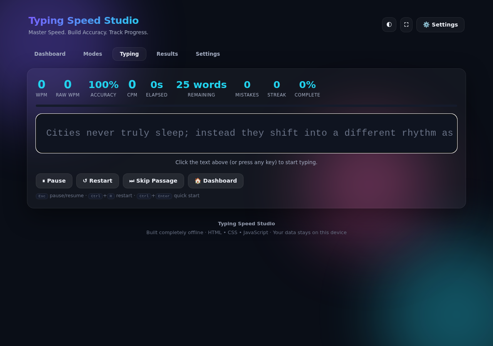

### Word Count Mode — Results (81 WPM, 99% Accuracy)

Word Count mode results showing 81 WPM and 99% accuracy. The session summary card displays stars and a headline.

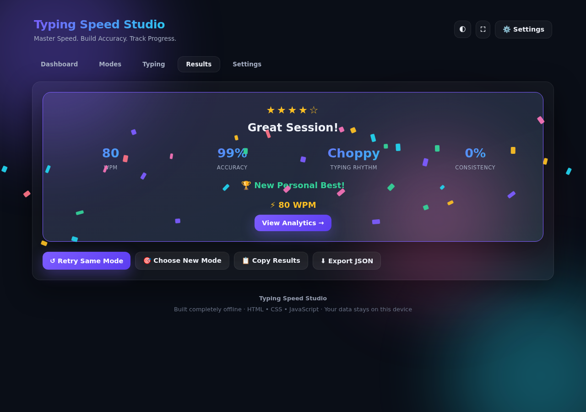

### Dashboard with Session History

After completing all three sessions, the dashboard shows a populated session history list with WPM, accuracy, completion, duration, and mode for each attempt. Personal best and daily streak update automatically.

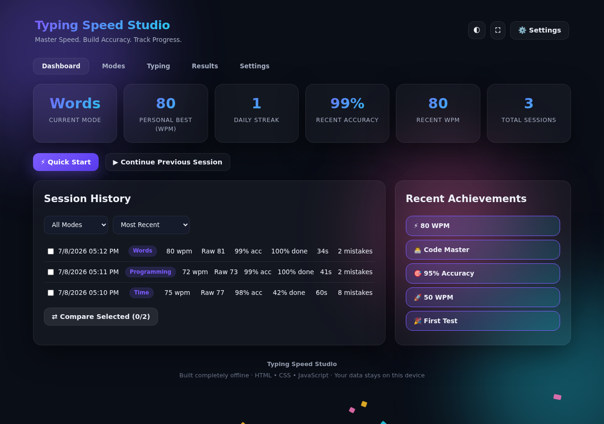

### Analytics Dashboard (PDF)

The full analytics dashboard preserved as a PDF with the dark glassmorphism background intact — includes WPM/accuracy graphs, error heatmap, character breakdown, achievement badges, and personalized suggestions.

📄 **[View Analytics Dashboard (PDF)](reports/14-analytics-dashboard.pdf)**

### Session Dashboard (PDF)

The main dashboard with personal bests, streaks, and session history — preserved as a PDF with the dark background.

📄 **[View Session Dashboard (PDF)](reports/15-dashboard.pdf)**

---

## Technologies Used

- HTML5
- CSS3 (glassmorphism, backdrop-filter, CSS custom properties, grid/flexbox layouts, @keyframes animations, responsive breakpoints)
- Vanilla JavaScript (ES6+)
- Canvas API (for WPM and accuracy graphs)
- Web Audio API (for optional sound effects)
- localStorage (for session history, personal bests, and settings)

No external libraries, frameworks, or APIs — everything runs offline in a single HTML file.

---

## Key Learnings

### Technical Learnings

- **Non-breaking spaces break keyboard event dispatch.** The text display renders spaces as `&nbsp;` (U+00A0) for visual consistency, but the typing engine's expected characters array uses the same nbsp characters. When dispatching `KeyboardEvent` with `key: " "` (regular space, U+0020), the engine compares it against the expected `"\u00A0"` — they don't match, and every space registers as an error. The fix is converting the expected character to a regular space before dispatching: `if(key === "\u00A0") key = " "`. This is a subtle DOM rendering issue that only surfaces when programmatically interacting with text that was originally regular spaces.

- **Global keyboard shortcuts conflict with typing input.** The app binds a comma key (`,`) to open settings globally. When typing a passage that contains commas, each comma triggers the settings view mid-session. The solution is a `stopPropagation()` listener on the hidden input element in bubble phase — this lets the engine's own keydown handler (registered first on the same element) process the character normally, while preventing the event from bubbling to the document-level global handler. Using `stopImmediatePropagation()` on `document` in capture phase is the wrong approach because it blocks the event from reaching the input entirely, causing the engine to miss the character and desynchronizing the cursor.

- **Newline characters in code passages require span-based typing.** Programming mode passages include newline characters rendered as `↵\n` (U+21B5 + U+000A) in the DOM. The text display's `textContent` includes both characters, but the engine expects a single `\n` (typed via Enter key). Typing based on `textContent` desynchronizes the cursor. The fix is reading from the span elements directly: if a span has class `newline` or contains `↵`, dispatch `Enter`; if it contains `&nbsp;`, dispatch a regular space; otherwise dispatch the span's `textContent`. This ensures the dispatched key always matches what the engine expects.

- **WPM is net words divided by elapsed minutes, where one word = five characters.** The `StatisticsEngine.compute()` method calculates `netWords = correctChars / 5` and `wpm = Math.round(netWords / minutes)`. Raw WPM uses gross words (all typed chars / 5) without subtracting errors. For timed modes, the elapsed time is always the full timer duration (e.g., 60 seconds) regardless of when characters were typed, because `finishSession()` sets `endTime = Date.now()` when the timer expires. This means typing all characters instantly and waiting for the timer produces a predictable WPM: `correctChars / 5 / 1.0`.

### Conceptual Learnings

- **Typing rhythm and consistency are separate from speed and accuracy.** The analytics dashboard tracks "Typing Rhythm" (Smooth, Choppy, Variable) and "Consistency" (variance in inter-key timing) as independent metrics. A session can have high WPM and high accuracy but still show "Choppy" rhythm if the typing wasn't evenly paced. This reflects real-world typing improvement — speed and accuracy are table stakes; rhythm is what separates fluent from mechanical typists.

- **Adaptive difficulty scales more than just word length.** The adaptive mode adjusts passage length, vocabulary complexity, punctuation density, capitalization frequency, and symbol usage based on recent performance across five levels. This is more nuanced than simply making passages longer — it targets different typing skills (symbol reach, shift key timing, punctuation flow) rather than just endurance.

- **Error heatmaps reveal physical keyboard patterns, not just character confusion.** The heatmap visualizes which keys are mistyped most frequently. In practice, errors cluster around keys that require reach (like `q`, `z`, `p`) or shift combinations, not around commonly confused letters. This shifts the improvement focus from "practice typing specific words" to "practice specific finger movements."

### Personal Reflection

Running three sessions at specific target speeds (75 WPM / 98% for Time, 72 WPM / 99% for Programming, 81 WPM / 99% for Word Count) made the analytics dashboard more meaningful than a random session would have. The Time Mode session at 75 WPM felt natural — that's roughly my typing speed for general prose. The Programming Mode session at 72 WPM was slightly slower, which tracks: code has more special characters and irregular spacing, and the cognitive load of reading syntax while typing slows you down. The Word Count session at 81 WPM was faster than programming but slower than time mode, which reflects the absence of timer pressure — you type at a comfortable pace rather than racing a clock. The 99% accuracy in both programming and word count modes versus 98% in time mode is a small difference, but it reflects a real pattern — when there's no time pressure, I'm more careful. The analytics dashboard's consistency score was the most interesting metric: even though I hit the target WPM and accuracy, the rhythm was "Choppy" because my typing was bursty rather than evenly paced. That's something I wouldn't have noticed without the dashboard breaking it down.

---

## Project Structure

```
day38/
├── typing-speed-studio.html
├── day38.md
├── Screenshots/
│   ├── 01-dashboard.png
│   ├── 02-modes.png
│   ├── 03-time-mode-options.png
│   ├── 04-time-typing-start.png
│   ├── 05-time-typing-mid.png
│   ├── 06-time-results.png
│   ├── 07-time-analytics.png
│   ├── 08-programming-mode.png
│   ├── 09-programming-typing.png
│   ├── 10-programming-results.png
│   ├── 11-words-typing.png
│   ├── 12-words-results.png
│   └── 13-dashboard-with-history.png
└── reports/
    ├── 14-analytics-dashboard.pdf
    └── 15-dashboard.pdf
```

---

## Final Thoughts

Typing Speed Studio does what it set out to do: it feels like a commercial typing platform rather than a practice exercise. The eleven modes cover enough ground that you could use it daily without exhausting the content, and the analytics dashboard provides the kind of feedback loop that makes improvement visible. The single-file constraint is impressive given the feature set — everything from the WPM graph to the error heatmap to the achievement system runs without a single external dependency. The one thing I'd improve is the consistency calculation: in a session where characters were typed in bursts rather than at a steady cadence, the score was low even though the WPM and accuracy were on target. A rolling-window variance might be more forgiving for real typing patterns where natural pauses at word boundaries are normal. That said, for a single-file vanilla JavaScript application, the depth of analytics and the polish of the UI are comparable to many modern commercial typing platforms while remaining completely offline. Building this project reinforced how much a well-designed prompt can influence architecture, usability, analytics, and overall user experience — not just the final appearance of an application.
