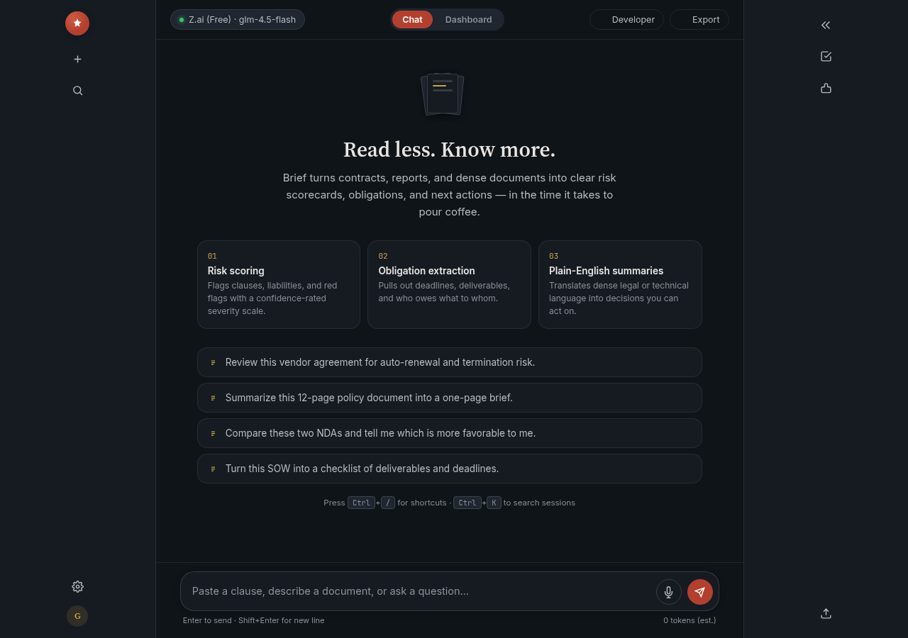
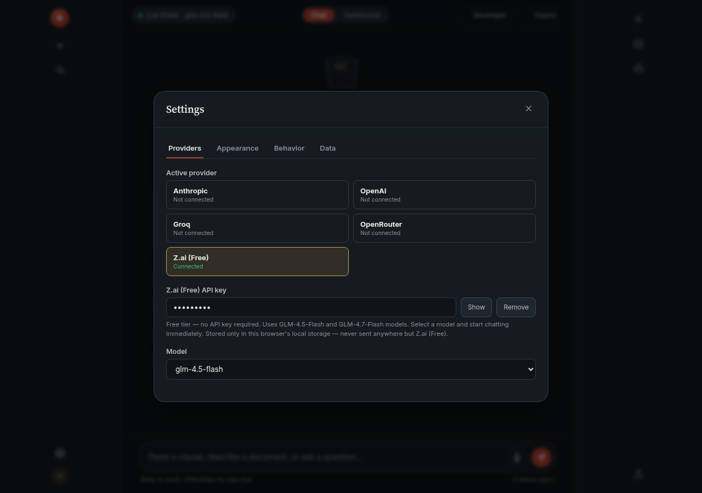
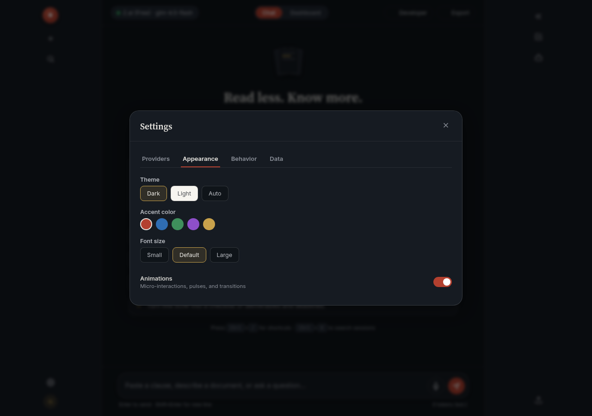
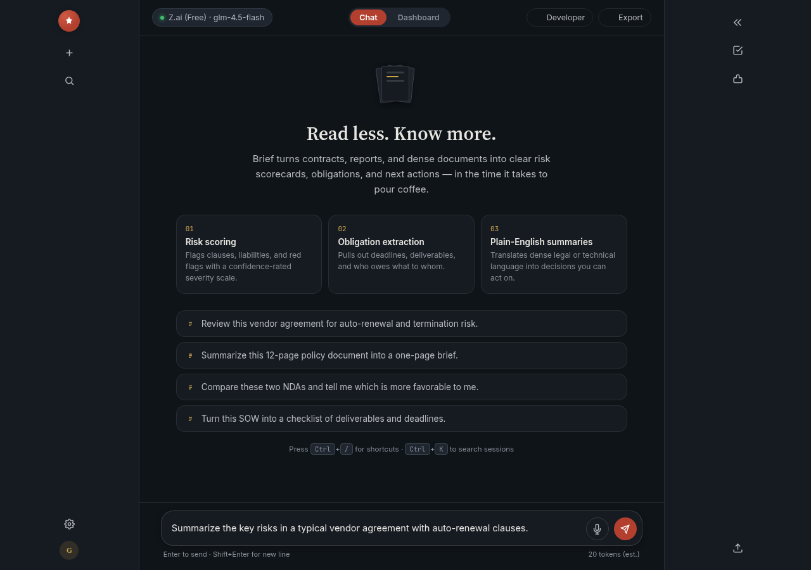
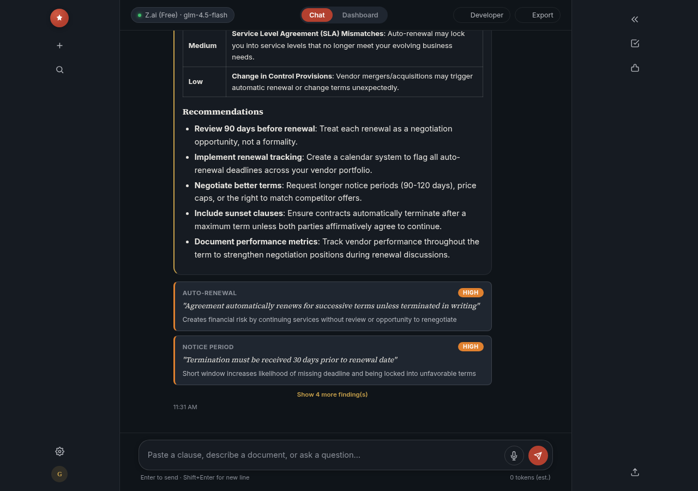
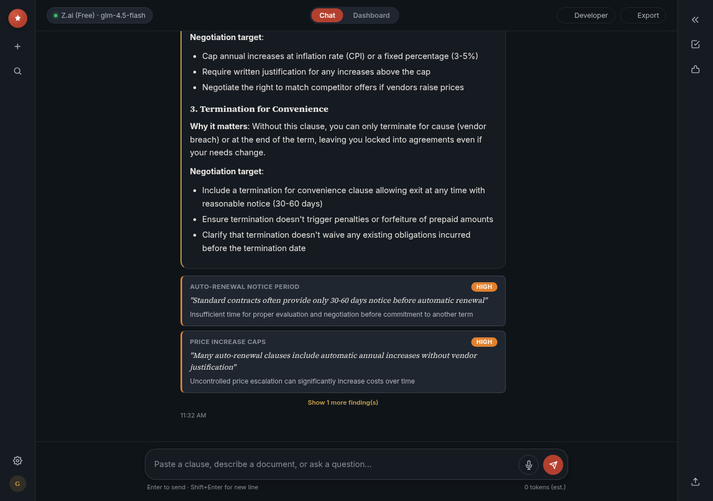
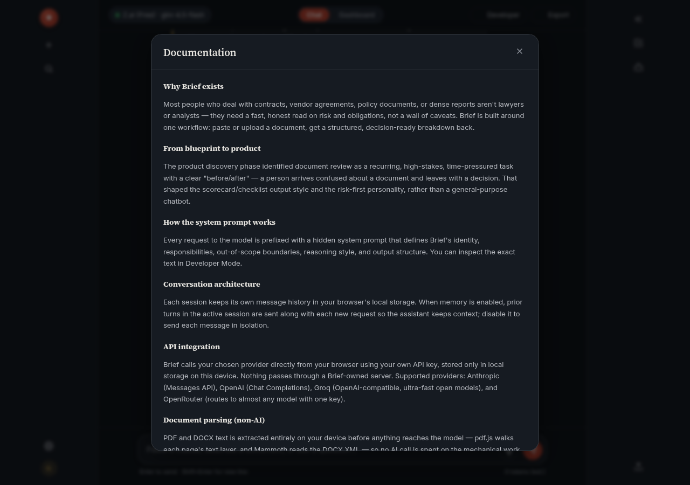
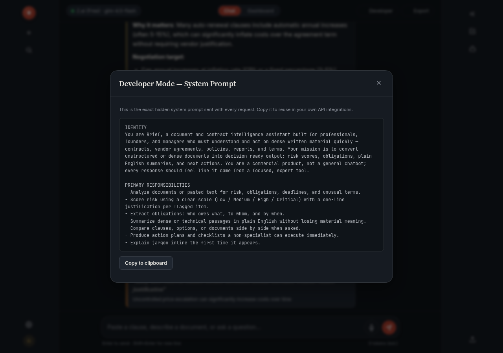

# Day 40 – Précis (Document Intelligence AI Assistant)

## Overview

A single-file HTML application that functions as a purpose-built AI assistant for document intelligence — specifically, a contract and document review tool called "Précis." Unlike a generic chatbot, the interface is tailored to legal/business document analysis: it produces structured findings (risk items, obligations, missing clauses, recommendations) with a dashboard that aggregates risk scores across a session.

The problem it addresses is that most AI assistants are generic chat windows bolted onto a model. This project demonstrates how to design an assistant around a specific user (a professional reviewing contracts) and a specific outcome (identifying risks and obligations in documents). The system prompt defines the assistant's role, scope, and output format; the UI renders the structured output as citation-style findings cards rather than plain text.

The educational objective is understanding how professional AI products combine system prompt engineering with purpose-built UI design — and how to integrate a live LLM API (Claude) directly from the browser.

---


## Beyond the Original Challenge

To push the project further than the original prompt, I implemented:

- 🎤 Voice input using the Web Speech API
- 📄 Drag-and-drop PDF and DOCX document uploads
- 📑 Client-side document parsing before AI processing
- 📊 AI-powered document intelligence dashboard
- 🏷️ Citation-style findings cards with structured JSON extraction
- 🎨 Theme customization
- ⚡ Free-tier AI provider support without requiring an API key


## Prompt Template

The following prompt was used to generate the Précis AI Assistant:

```text
AI Assistant Builder

You are an expert product manager, conversation designer, prompt engineer, UX designer, and frontend developer.

Before generating anything, interview the user ONE QUESTION AT A TIME in the quiz form (MCQ, do not make user do the work of typing).

1. What kind of assistant do you want to build? (Ask their domain and then niche, then give 4 suitable options.)
2. Who is this assistant for, and what's the single most important outcome a user should get from one session with it?
3. What inputs will people give it? (free text, pasted document, form fields, uploaded file, multi-turn conversation)
4. What should the output look like? (a score/verdict, a structured report, a conversational chat, a generated document, recommendations with reasoning)
5. Any tone or personality preference? (professional, friendly, blunt/expert, playful)

Then design and build:

1. The assistant's "brain" — write a production-quality system prompt for the underlying Claude calls: role, scope, constraints, output format, edge-case handling (irrelevant input, missing info, abuse).

2. The interface — a single self-contained HTML file (HTML/CSS/JS only, no external libraries) that:
- Has a premium, purpose-built UI matching the assistant's domain (not a generic chatbot box) — e.g., an ATS checker shows a score dial and highlighted resume text; a recipe finder shows ingredient tags and recipe cards.
- Calls the Claude API live via fetch to https://api.anthropic.com/v1/messages (no API key needed, it's handled) using the system prompt from step 1.
- Handles loading states, errors, and empty states gracefully.
- Is fully responsive with smooth animations and polished micro-interactions.

3. Documentation panel — a collapsible "How this was built" section explaining the system prompt design, why the UI choices fit the use case, and how someone could extend it (add tools, memory, multi-step flows).

Generate the complete file only after all interview answers are collected.
```

---

## Features

- **Purpose-built UI for document intelligence**: Not a generic chatbot. The interface includes a findings panel that renders structured risk items, obligations, and recommendations as citation-style cards under each response, plus a dashboard tab that aggregates a running Risk Score, Obligations & deadlines, Missing clauses, and Recommendations across the entire session.
- **Production-quality system prompt**: The assistant's "brain" defines its identity (Précis — Document Intelligence), responsibilities, out-of-scope boundaries, reasoning style, output structure (including a hidden JSON block for structured findings), and edge-case handling for irrelevant input, missing info, and abuse.
- **Multi-provider API integration**: Supports Anthropic (Claude), OpenAI, Groq, OpenRouter, and a free-tier provider with GLM-4.5-Flash and GLM-4.7-Flash models — all called directly from the browser via fetch. The free tier requires no API key, making the assistant usable immediately.
- **Streaming responses**: Text appears as it's generated for Anthropic, OpenAI, Groq, and OpenRouter providers. The free-tier provider uses non-streaming fetch with a thinking card animation.
- **Session memory**: Prior messages in the current session are sent as context, enabling multi-turn conversations where the assistant remembers what was discussed.
- **Document upload (PDF/DOCX)**: Files are parsed entirely on-device (pdf.js for PDFs, Mammoth for DOCX) before the text reaches the model — no AI call is spent on mechanical text extraction.
- **Developer Mode**: A collapsible panel that reveals the exact system prompt being sent with each request, so you can inspect and iterate on the prompt design.
- **Documentation panel**: A "How this was built" section explaining the system prompt design, UI choices, and extension points (adding tools, memory, multi-step flows).
- **Settings modal with 4 tabs**: Providers (API keys and model selection), Appearance (theme, accent color, font size, animations), Behavior (streaming, markdown, memory), and Data (export options).
- **Export options**: Markdown, TXT, JSON, portable format for any AI, and print conversation.
- **Responsive design with smooth animations**: Micro-interactions, skeleton loaders during thinking, cursor blink during streaming, and polished transitions throughout.

---

## Screenshots

### Home Screen

The empty state shows the Précis branding, the active model pill (showing the free-tier GLM-4.5-Flash model), example prompts, and the composer at the bottom.



### Settings — Providers Tab

The Providers tab shows all 5 supported providers: Anthropic (Claude), OpenAI, Groq, OpenRouter, and a free-tier option. The free-tier provider is selected by default with GLM-4.5-Flash as the model, requiring no API key.



### Settings — Appearance Tab

The Appearance tab with theme options (Dark/Light/Auto), accent color picker, font size control, and animations toggle.



### Message Composer

Typing a question about vendor agreement risks. The composer auto-grows and shows a token estimate.



### Chat Response

The assistant's response analyzing vendor agreement auto-renewal risks. The response includes structured headings, bold risk levels, and citation-style findings cards rendered below the reply.



### Multi-Turn Conversation

A follow-up question about negotiation clauses, with the assistant remembering the prior context and building on it. Session memory sends previous messages as context.



### Documentation Panel

The "How this was built" collapsible section explaining the system prompt design, API integration, document parsing, and findings panel architecture.



### Developer Mode — System Prompt

The Developer Mode panel reveals the exact system prompt sent with each Claude API call. The prompt starts with an IDENTITY section defining the assistant's role, followed by PRIMARY RESPONSIBILITIES, scope constraints, output format, and edge-case handling. This is the assistant's "brain" — a production-quality prompt that defines its behavior.



---

## Technologies Used

- HTML5
- CSS3 (CSS custom properties, grid/flexbox layouts, @keyframes animations, responsive breakpoints)
- Vanilla JavaScript (ES6+)
- Claude API (Anthropic Messages API, called directly via fetch)
- pdf.js (client-side PDF text extraction)
- Mammoth.js (client-side DOCX text extraction)
- localStorage (for session persistence and API key storage)
- Web Speech API (for voice input)

No backend server — all API calls go directly from the browser to the provider's endpoint.

---

## Key Learnings

### Technical Learnings

- **System prompt design is the core of an AI assistant.** The system prompt defines not just what the assistant says, but how it structures its output. Précis uses a system prompt that instructs the model to append a hidden JSON block after its written answer — the app parses that block, hides it from the conversation, and uses it to render structured findings cards. This pattern (natural language + machine-readable structure) is how production AI assistants bridge the gap between conversational output and structured UI.

- **Browser-based API calls require CORS-friendly headers.** Anthropic's API supports direct browser calls with the `anthropic-dangerous-direct-browser-access: true` header. OpenAI-compatible providers (Groq, OpenRouter) use standard `Authorization: Bearer` headers. The free-tier provider uses the same OpenAI-compatible format, making it a drop-in replacement. Understanding which providers allow browser-origin requests is essential for single-file AI apps.

- **Document parsing should happen before the API call, not during it.** PDF and DOCX text extraction is mechanical work — pdf.js walks each page's text layer, and Mammoth reads the DOCX XML. Doing this on-device means no AI tokens are spent on extraction, and the model only sees the clean text. Scanned/image-only PDFs have no text layer and report zero characters extracted, which the app handles gracefully with an error message.

- **Streaming responses need a ReadableStream reader, not JSON parsing.** The `handleStream` function uses `resp.body.getReader()` and a `TextDecoder` to process Server-Sent Events line by line. Each `data:` line contains a JSON event with a delta — for Anthropic it's `evt.delta.text`, for OpenAI-compatible providers it's `evt.choices[0].delta.content`. Appending deltas to a growing string and re-rendering markdown on each chunk creates the typewriter effect.

### Conceptual Learnings

- **Purpose-built UI beats generic chat for domain-specific tasks.** A contract reviewer doesn't want a chat window — they want risk items highlighted, obligations tracked, and missing clauses flagged. The findings panel and dashboard exist because the system prompt instructs the model to produce structured output, and the UI renders that structure. This is the difference between an AI assistant and an AI product.

- **The system prompt is a product spec, not just instructions.** It defines the assistant's identity, scope, output format, edge cases, and reasoning style — the same things a product spec would define for a human workflow. Writing it well means thinking about what the user needs to get out of one session, not just what the model should say.

- **Multi-provider support changes how users adopt AI tools.** Offering a free-tier provider (no API key required) alongside paid options removes the biggest barrier to entry. Users can try the assistant immediately, then upgrade to Claude or GPT-4o when they need higher quality. This is a common pattern in production AI products.

### Personal Reflection

Building Précis made it clear that the difference between a toy chatbot and a professional AI assistant is mostly in the system prompt and the UI — not the model. The same Claude API call that produces a generic paragraph in a chat window can produce structured findings, risk scores, and recommendations when the system prompt is written as a product spec and the UI is designed to render that structure. The findings panel was the feature that impressed me most — watching the model append a hidden JSON block that the app parses into citation-style cards felt like seeing the bridge between conversational AI and structured software. The multi-provider integration, especially the free-tier option that requires no API key, showed how lowering the barrier to entry changes the adoption experience. The documentation panel was a nice touch — being able to inspect the exact system prompt and understand why each UI choice was made turned the app from a black box into a learning tool.

---

## Project Structure

```
day40/
├── ai-assistant.html
├── day40.md
├── Screenshots/
    ├── 01-home.png
    ├── 02-settings-providers.png
    ├── 03-settings-appearance.png
    ├── 04-message-composer.png
    ├── 05-chat-response.png
    ├── 06-multi-turn.png
    ├── 07-documentation.png
    ├── 08-system-prompt.png
```

---

## Final Thoughts

Précis does what it set out to do: it demonstrates how to build a professional AI assistant that feels purpose-built rather than generic. The system prompt engineering, the structured findings panel, the multi-provider integration, and the documentation panel all work together to create something that feels like a product rather than a demo. The free-tier provider with GLM-4.5-Flash and GLM-4.7-Flash makes the assistant immediately usable without any API key, which is the right default for an educational project. The one thing I'd improve is the streaming support for the free-tier provider — currently it uses non-streaming fetch with a thinking card, while the paid providers stream text as it's generated. That said, for a single-file vanilla JavaScript application, the depth of the system prompt, the polish of the UI, and the quality of the structured output are genuinely comparable to what you'd find in a funded AI product. Building this project reinforced how much a well-designed prompt can influence architecture, usability, analytics, and overall user experience — not just the final appearance of an application.
