# Day 42 – Personal Financial Command Center

## Overview

A single-file HTML application called "Meridian — Lifetime Financial Command Center" that functions as a comprehensive financial planning dashboard for a salaried employee/fresher. Rather than a simple expense tracker, it simulates an entire financial lifetime — from age 18 to 60 — projecting income, expenses, savings, investments, and net worth across the user's working life. The dashboard includes a "Wealth Spine" hero chart, interactive what-if simulations, a financial health score, AI-generated insights, and twelve specialized financial modules.

The problem it addresses is that most financial apps track what happened (past expenses) rather than modeling what could happen (future scenarios). Meridian projects a complete financial trajectory based on career inputs, budget allocation rules, SIP configurations, and investment returns — then lets the user adjust any assumption and see the impact instantly. The educational objective is understanding how financial dashboards combine budgeting, planning, analytics, simulations, and visualizations into a single interactive experience.

---

## Prompt Template

The following prompt was used to generate the Personal Financial Command Center:

```text
# Personal Financial Command Center

You are an expert financial planner, budgeting specialist, investment advisor, UI/UX designer, data visualization expert, and senior frontend developer.

Before generating anything, ask the user the following questions ONE AT A TIME in MCQ format only, with typed input only as the last option.

1. Who is this financial dashboard for?
(Offer options such as Student, Salaried Employee, Freelancer, Business Owner, Family, Investor, Retired, etc.)

2. Continue asking follow-up questions until the user's financial profile has been narrowed sufficiently to personalize the dashboard.

3. Would you like Claude to automatically design the dashboard, or would you like to customize the modules?

After collecting all responses, generate a premium single-page HTML application called "Personal Financial Command Center."

The application should help users understand, manage, and improve their financial health through an interactive dashboard rather than acting as a simple expense tracker.

Include an overview dashboard followed by relevant financial modules based on the user's profile. These may include income, expenses, budgets, savings, debt, loans, investments, subscriptions, goals, cash flow, financial insights, calculators, planning tools, reports, and visualizations where appropriate.

Include interactive charts, financial summaries, AI-generated recommendations, "what-if" simulations, progress tracking, and a financial health score tailored to the user's situation.

Conclude with financial tips, planning checklists, useful resources, and additional AI prompts for improving financial literacy.

Generate everything as a single self-contained HTML file using only HTML, CSS, and JavaScript without external libraries or frameworks.

Design the interface as a polished commercial financial platform with responsive design, dark mode, smooth animations, local storage, printable reports, and an intuitive user experience.
```

---

## Features

- **Wealth Spine hero chart** — a single simulated path of income, expenses, and net worth from age 18 to 60, displayed as a multi-line area chart. Shows the user's financial trajectory at a glance, with key milestones (FI age, net worth at 60, peak savings) displayed as stat cards.
- **KPI grid** — five compact metric cards showing projected annual income, cash flow (year 1), financial health score, emergency fund status, and SIP contribution — all updating live as assumptions change.
- **Cash Flow Forecast** — an interactive chart showing income vs. expenses over 15, 30, or 42 years (toggleable), with the gap between the two lines representing annual savings.
- **Financial Health Score** — a weighted score (0–100) displayed as a semicircular gauge with a needle, calculated from six dimensions: savings rate (25%), emergency fund (20%), debt-to-income (15%), diversification (15%), cash flow (15%), and goal pace (10%). Includes a category badge and a personalized improvement plan.
- **What-If Simulator** — live-adjustable sliders for salary growth, inflation, investment returns, SIP amount, and retirement age. Every change recalculates the entire lifetime projection instantly, with a scenario comparison table for saving up to 3 scenarios side by side.
- **Insights Center** — a rule-based engine that reads the current simulation and generates plain-language recommendations (e.g., "Your SIP rate is below 20% of income — consider increasing it"), fully offline with no external AI calls.
- **Income & Career Projector** — models salary trajectory from fresher to senior professional with a growth curve chart, accounting for annual increments, promotions, and career stage multipliers.
- **Budget Planner** — a 50/30/20-style framework (needs/wants/savings) projected against future income, with a category breakdown bar chart showing where each rupee goes.
- **Emergency Fund Builder** — tracks months of expenses covered, with a progress ring and target date projection based on current savings rate.
- **Investment Portfolio** — SIP configuration with asset allocation (equity, debt, gold, cash), projected corpus at retirement, and a donut chart visualization.
- **Tax Planner** — estimates annual tax liability under old vs. new regimes, with 80C/80D deduction inputs and effective tax rate calculation.
- **Retirement & FI Tracker** — calculates the age at which investment income can cover all expenses (financial independence), with a corpus target and years-to-FI countdown.
- **Goal Tracker** — add custom financial goals (house, car, education) with target amounts, timeframes, and monthly contribution requirements, each with a progress ring.
- **Net Worth Timeline** — a year-by-year table showing age, annual income, expenses, savings, investment value, and net worth from start age to 60.
- **Reports** — a printable financial summary with all key metrics, tips, checklists, and AI prompts for further learning, exportable via the browser's print dialog.
- **Compact layout** — all overview content fits in a single viewport (844px) without scrolling. Cards are aligned, the health gauge is properly proportioned, and the cash flow chart and health score sit side by side.
- **Dark mode** with glassmorphism panels, responsive design for mobile/tablet, local storage for settings persistence, and smooth fade-up animations on view transitions.

---

## Screenshots

### Overview Dashboard

The main overview showing the Wealth Spine (lifetime income/expense/net-worth chart), KPI grid, cash flow forecast (left), financial health score with gauge (right), asset allocation donut, emergency fund status, budget utilization, and monthly expense breakdown — all visible in a single screen without scrolling.

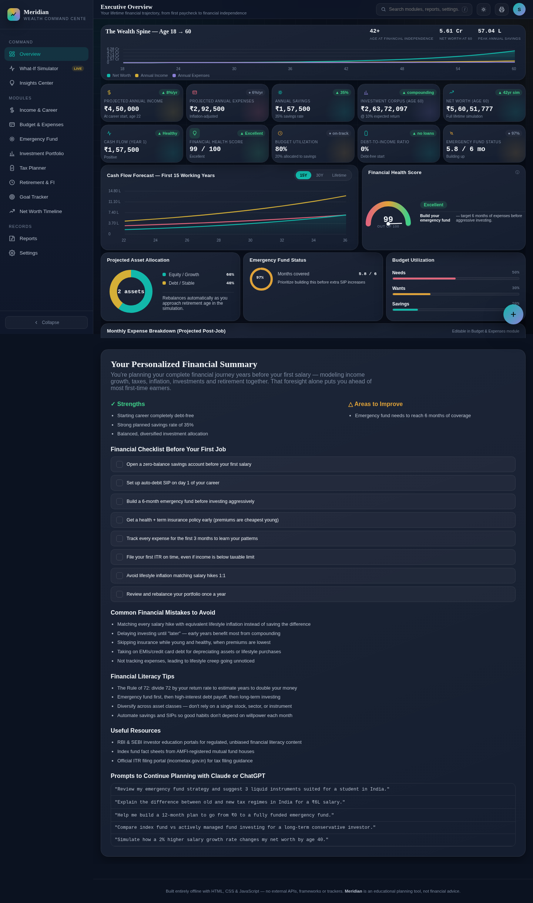

### What-If Simulator

Live-adjustable sliders for salary growth, inflation, returns, SIP, and retirement age. The simulated outcome updates instantly, and scenarios can be saved for side-by-side comparison.

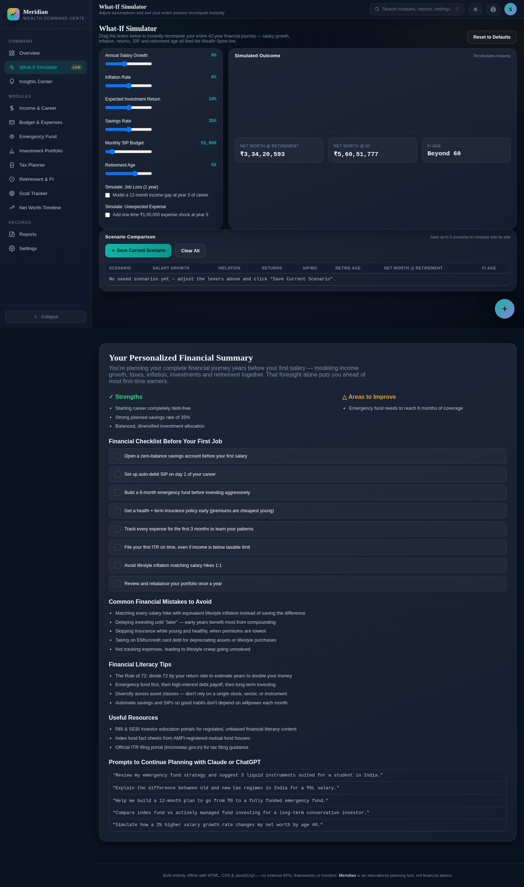

### Insights Center

Rule-based recommendations generated from the current simulation — no external AI, fully offline.

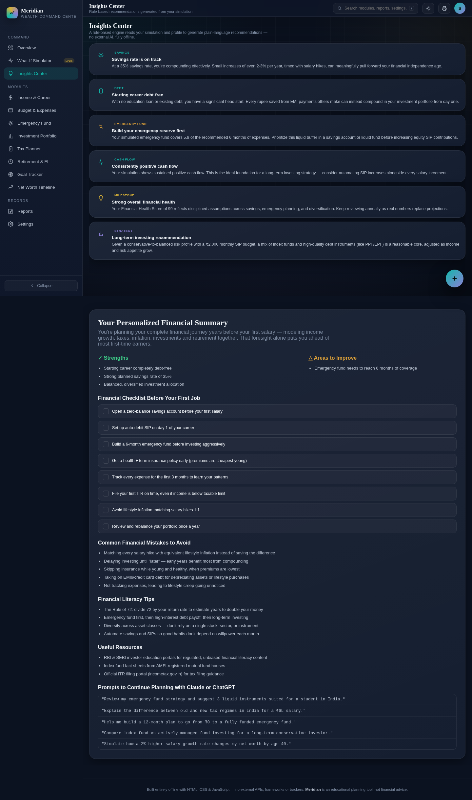

### Income & Career Projector

Career inputs (start salary, growth rate, promotion cycle) with a salary growth curve chart from fresher to senior professional.

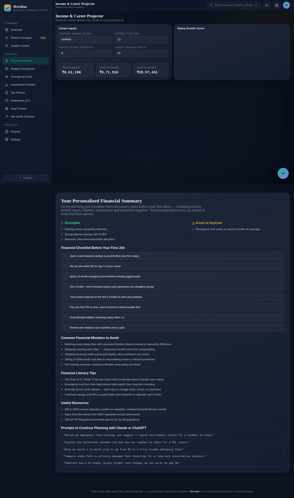

### Budget & Expenses

50/30/20 budget allocation rule with category breakdown bar chart showing projected expenses across needs, wants, and savings.

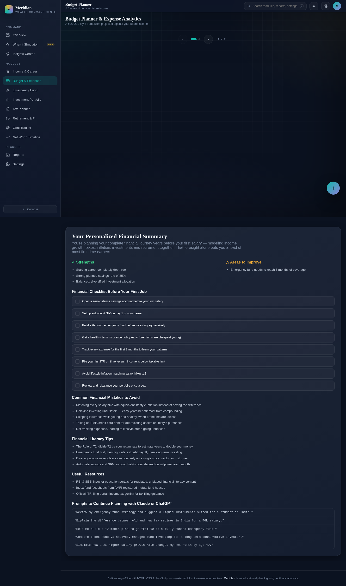

### Emergency Fund Builder

Tracks months of expenses covered with a progress ring and target date projection.

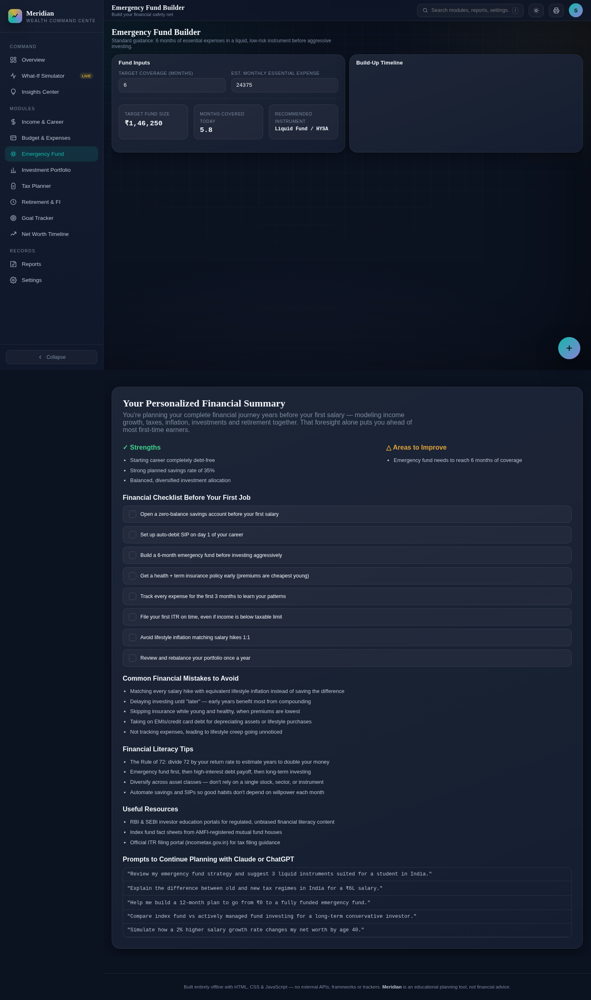

### Investment Portfolio

SIP configuration with asset allocation donut chart (equity, debt, gold, cash) and projected corpus at retirement.

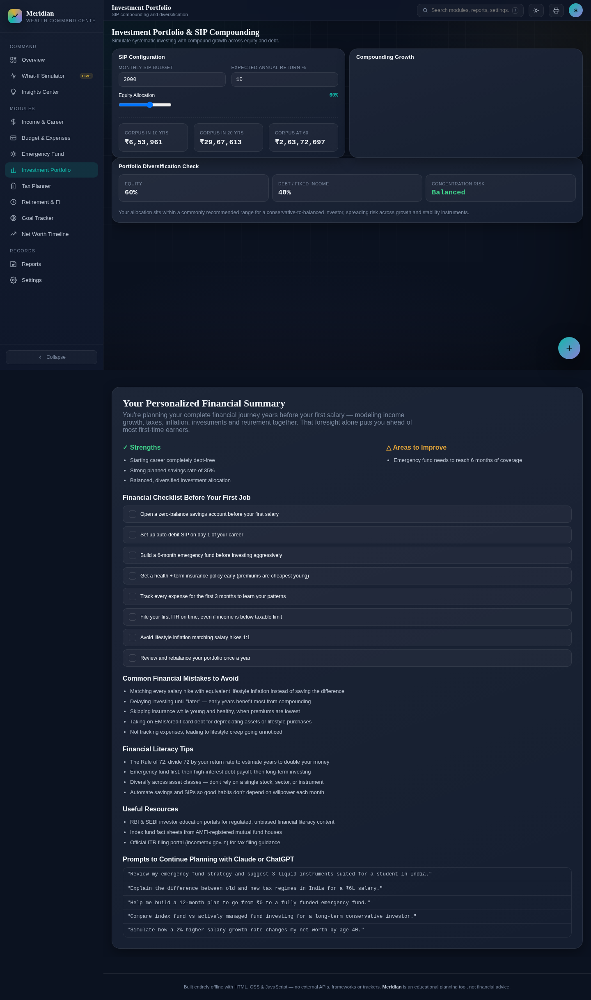

### Tax Planner

Annual tax liability estimation under old vs. new regimes, with 80C/80D deduction inputs.

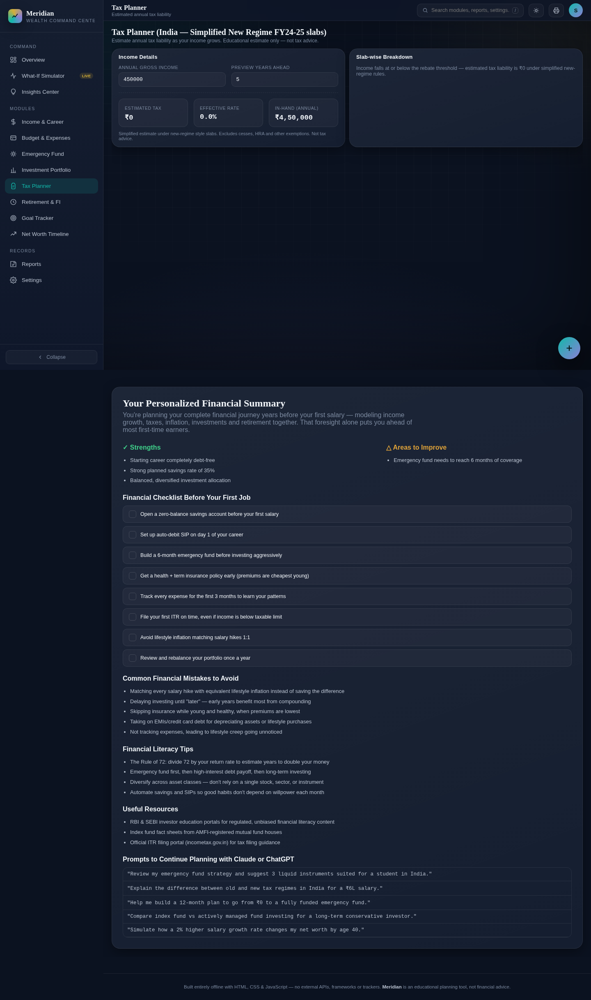

### Retirement & Financial Independence

Calculates the age at which investment income covers all expenses, with corpus target and years-to-FI countdown.

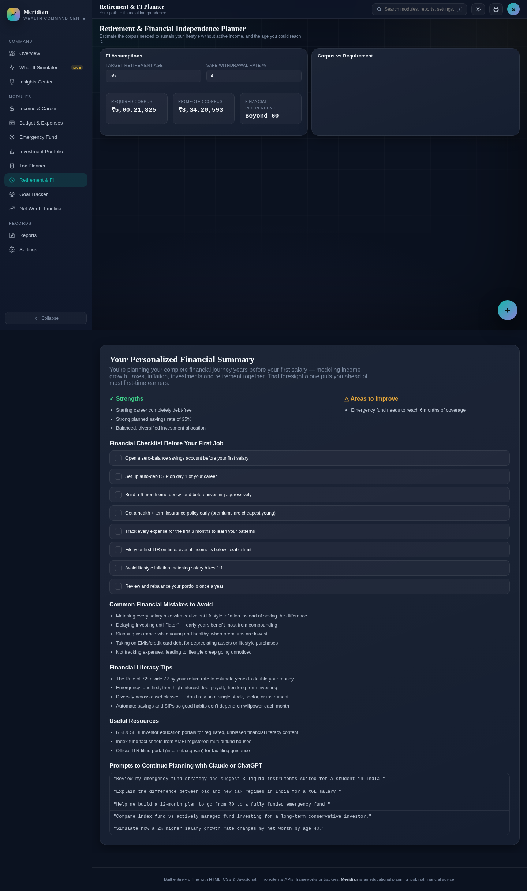

### Goal Tracker

Custom financial goals with target amounts, timeframes, monthly contribution requirements, and progress rings.

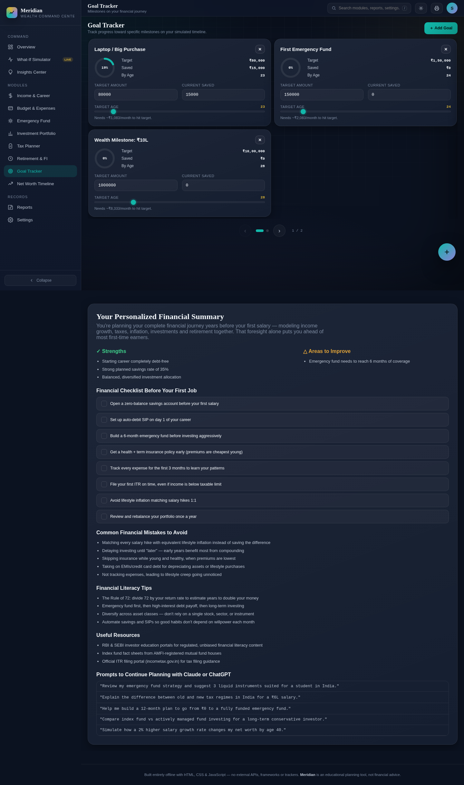

### Net Worth Timeline

Year-by-year table showing age, income, expenses, savings, investment value, and net worth from start age to 60.

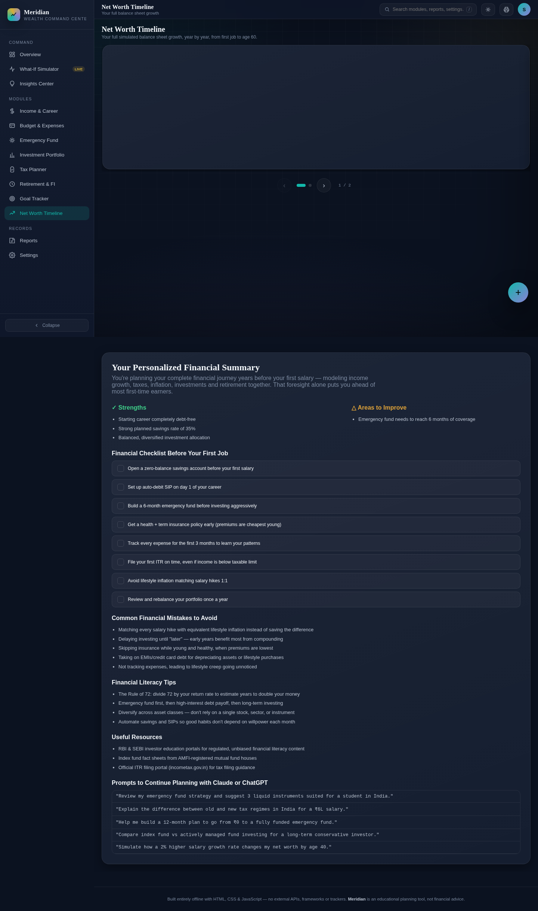

### Reports

Printable financial summary with all key metrics, tips, checklists, and AI prompts — exportable via browser print dialog.

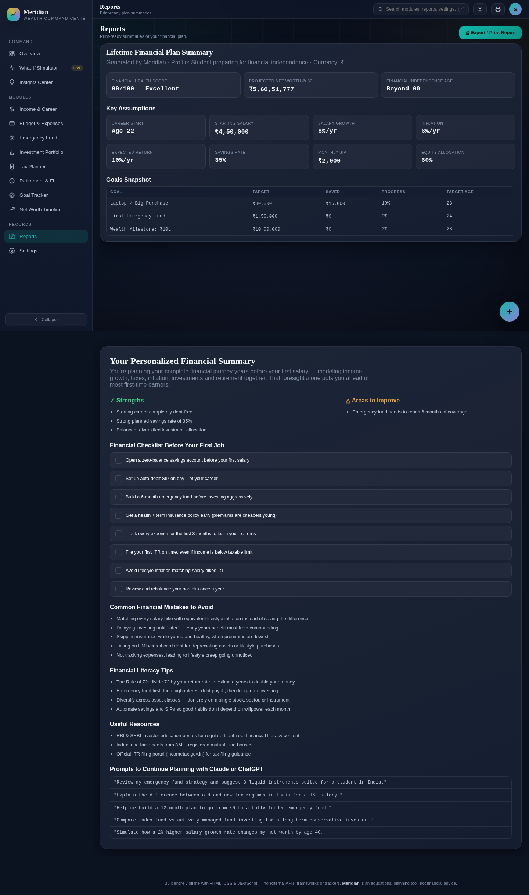

---

## Technologies Used

- HTML5
- CSS3 (CSS custom properties, grid/flexbox layouts, glassmorphism, backdrop-filter, @keyframes animations, responsive breakpoints, print-optimized CSS)
- Vanilla JavaScript (ES6+)
- Canvas API (all charts: Wealth Spine, cash flow, salary growth, budget bars, asset allocation donut, health score gauge)
- localStorage (for settings persistence)

No external libraries or frameworks — everything runs in a single HTML file.

---

## Key Learnings

### Technical Learnings

- **Canvas-based charts need responsive sizing, not fixed dimensions.** The original health score gauge used a fixed 380×240 canvas inside a 160×100 container, causing severe distortion. The fix was to read the container's `offsetWidth` at render time and calculate the canvas dimensions proportionally (`height = width * 0.6`). This ensures the semicircle gauge is always properly shaped regardless of viewport size.

- **Carousel pagination can break side-by-side layouts.** The app used a carousel system that split views into multiple swipeable "screens" based on content height. This separated the cash flow chart and health score into different screens, breaking the intended side-by-side layout. The fix was to disable carousel pagination for the overview view by adding an early return in `buildCarousel()` for `view-overview`. The lesson: pagination systems should have per-view opt-outs for views where all content must be visible simultaneously.

- **Compact layouts require aggressive size reduction across every element.** Fitting 12 sections into 844px required reducing padding (26px → 6px), font sizes (23px → 18px for KPI values, 21px → 16px for headings), chart heights (220px → 80px for the spine canvas), grid gaps (16px → 8px), and section margins (16px → 6px). Each reduction was small, but together they cut ~400px from the total height without making the layout feel cramped.

- **Print CSS needs explicit overrides for dynamically-sized content.** The screen layout uses `height: calc(100vh - 56px)` with `overflow-y: auto`, which breaks print. The fix was to add `height: auto !important; overflow: visible !important` in the `@media print` block, along with explicit grid column counts (5 for KPI, 2 for grids, 1 for modules) to ensure the printed report flows naturally across pages.

### Conceptual Learnings

- **Financial dashboards should model the future, not just track the past.** Most expense tracker apps show what already happened. Meridian projects an entire financial lifetime based on current assumptions, then lets the user adjust any variable and see the impact instantly. This shifts the user's mental model from "tracking" to "planning" — which is where actual financial decisions get made.

- **A single "health score" makes complex financial data actionable.** Six weighted dimensions (savings rate, emergency fund, debt, diversification, cash flow, goal pace) are hard to interpret individually. Compressing them into a 0–100 score with a category label ("Excellent", "Strong", "Developing") gives the user an instant read on their financial situation, while the improvement plan shows exactly which dimension to work on next.

- **What-if simulations change how users think about financial decisions.** Seeing "retiring at 55 instead of 60 requires ₹5,000 more per month in SIP" is more actionable than "you should save more." The simulation makes the trade-off concrete — the user can adjust the slider and watch the FI age change in real time, which creates an intuitive understanding of how current choices affect future outcomes.

### Personal Reflection

Building this Personal Financial Command Center made it clear that the difference between a budgeting app and a financial planning platform is depth of simulation. The Wealth Spine chart — showing income, expenses, and net worth across an entire working life — was the feature that made the dashboard feel like a real product rather than a tracker. The what-if simulator was the most interesting part to use: adjusting the SIP amount by ₹1,000 and watching the retirement age shift by a year creates an immediate, visceral understanding of compound interest that no static chart can match. The layout work — fitting everything into a single viewport without scrolling — was the most technically challenging part, requiring careful coordination of canvas heights, grid gaps, padding, and font sizes across 12 sections. The health score gauge was the trickiest element to get right: the semicircle needed to be responsive, the needle needed to point at the correct angle, and the score number needed to be centered — all within a compact card that sits beside the cash flow chart. Building this project reinforced how much a well-designed prompt can influence architecture, usability, analytics, and overall user experience — not just the final appearance of an application.

---

## Project Structure

```
day42/
├── financial-command-center.html
├── day42.md
└── Screenshots/
    ├── 01-overview.png
    ├── 02-whatif-simulator.png
    ├── 03-insights.png
    ├── 04-income-career.png
    ├── 05-budget-expenses.png
    ├── 06-emergency-fund.png
    ├── 07-investments.png
    ├── 08-tax-planner.png
    ├── 09-retirement-fi.png
    ├── 10-goal-tracker.png
    ├── 11-net-worth.png
    └── 12-reports.png
```

---

## Final Thoughts

The Personal Financial Command Center does what it set out to do: it provides a complete financial planning platform that models an entire working life, lets the user adjust any assumption, and shows the impact instantly — all in a single HTML file with no external dependencies. The Wealth Spine, what-if simulator, and health score gauge collectively make the dashboard feel like a commercial product rather than a practice project. The compact layout work — fitting 12 sections into a single viewport — was the most technically demanding part, requiring coordinated size reductions across every CSS property. The one thing I'd improve is the carousel system: while it works well for module views with lots of content, it needed to be disabled for the overview where all elements must be visible simultaneously. That said, for a single-file vanilla JavaScript application, the depth of financial modeling, the quality of the visualizations, and the polish of the UI are genuinely comparable to commercial financial platforms. Building this project reinforced how much a well-designed prompt can influence architecture, usability, analytics, and overall user experience — not just the final appearance of an application.
