# Day 43 – AI Workflow Architect: LinkedIn Personal Branding Workflow

## Overview

A single-file HTML application that functions as a premium SaaS-style interactive workflow platform for building a LinkedIn personal brand using AI. Instead of a generic AI workflow generator, this dashboard presents a complete, stage-by-stage workflow for growing a professional LinkedIn presence from scratch — covering strategy, profile optimization, content creation, publishing, engagement, analytics, and long-term growth across 12 stages.

The application is structured as a multi-view dashboard with a collapsible sidebar, dynamic view switching (no page reloads), and animated transitions. Each of the 12 workflow stages includes objectives, step-by-step processes, recommended AI tools, prompt examples, best practices, common mistakes, expected outputs, KPIs, and productivity tips. The app also includes a prompt library with copy-to-clipboard, an interactive decision tree, SVG architecture diagrams, a risk matrix, automation recommendations, and localStorage-backed notes and bookmarks.

The educational objective is understanding how to design a comprehensive workflow platform that demonstrates AI's role at every stage of a real business process — from planning to execution to optimization.

---

## Prompt Template

The following prompt was used to generate the AI Workflow Architect:

```text
# AI Workflow Architect – LinkedIn Personal Branding Workflow

You are an expert digital marketing strategist, LinkedIn growth consultant, AI automation specialist, prompt engineer, workflow architect, UI/UX designer, and senior frontend developer.

Generate a premium single-page HTML application called "AI Workflow Architect – LinkedIn Personal Branding Workflow."

This application is NOT an AI workflow generator. Instead, it should present a complete AI-powered workflow for growing a professional LinkedIn personal brand from scratch to consistent audience growth.

The workflow should include 12 stages: Personal Brand Strategy, Profile Optimization, Audience Research, Content Planning, AI Content Creation, Visual Design, Content Review, Publishing Strategy, Engagement Strategy, Performance Analytics, Optimization, and Long-Term Growth.

Each stage must include: Objective, detailed tasks, step-by-step process, recommended AI tools, why each tool, alternatives, prompt examples, best practices, common mistakes, expected outputs, estimated time, productivity tips, KPIs.

The application should also include: Executive Dashboard, Interactive Workflow Roadmap, Stage Explorer, AI Tools Center, Prompt Library, Decision Tree, Workflow Architecture Diagram, Risk & Best Practices, Automation Opportunities, Progress Tracking, Notes & Bookmarks, Learning Resources, Export/Print.

Dark modern UI, responsive, smooth animations, interactive diagrams, localStorage, printable report. Single HTML file, no external libraries.
```

---

## Features

- **Collapsible left sidebar** — 260px expanded with labels, 72px collapsed icon-only rail. Smooth CSS width transition. Mobile hamburger menu.
- **Dynamic view switching** — 12 independent views that show/hide without page reload. Fade + slide-up animation on each transition.
- **Executive Dashboard** — 4 stat cards (12 stages, 8% completion, 15 AI tools, 30 prompts), workflow progress bar, AI stack overview (Claude, Canva AI, Taplio, Shield, AuthoredUp), recent activity feed, next steps.
- **Workflow Roadmap** — Vertical timeline with all 12 LinkedIn branding stages, status badges (✅/🔄/⬜), estimated times, dependencies, and milestone markers (⭐) at stages 3, 6, 9, 12.
- **Stage Explorer** — Shows one stage at a time with objective, step-by-step process, tasks checklist, deliverables, KPIs, AI tools, prompt examples, best practices, common mistakes, and productivity tips. Previous/Next navigation with clickable progress dots (1–12).
- **AI Tools Center** — 8 tool cards (Claude, Taplio, Canva AI, AuthoredUp, Shield, ChatGPT, Midjourney, Hypefury) with LinkedIn-specific "why" descriptions, alternatives, and a comparison table.
- **Prompt Library** — 12 LinkedIn-specific prompts with live search, 7 category filter chips (Content, Profile, Strategy, Engagement, Analytics, Visual), copy-to-clipboard buttons with "Copied!" toast.
- **Decision Tree** — Interactive expandable/collapsible nodes for branding decisions (niche selection, content type, budget, time). Color-coded: decision=indigo, action=cyan, end=green.
- **Architecture & Diagrams** — 3 inline SVG diagrams: Content Pipeline (circular flow), AI Integration Map (Claude → Human Review → Canva → Taplio → LinkedIn → Shield → back to Claude), Growth Funnel (Profile Views → Connections → Followers → Engagers → Leads → Clients).
- **Risk & Best Practices** — 3×3 risk matrix with LinkedIn-specific risks, 6 common mistakes, 6-item security checklist, 6 best practices.
- **Automation Opportunities** — 8 task cards showing current manual method → AI solution with difficulty badges. Future improvements section.
- **Resources** — 2×2 grid: Learning Resources, Communities, Documentation, Search Keywords (6 chips).
- **Notes & Bookmarks** — Textarea saved to localStorage, 12 stage checkboxes saved to localStorage, clear-all button.
- **Export Center** — Workflow summary, completion progress, key metrics, print button with print CSS that stacks all views.
- **Keyboard shortcuts** — `j`/`k` to navigate views, arrow keys for stage explorer.
- **Dark mode** glassmorphism with indigo/cyan accents, responsive grids, CSS custom properties.

---

## Screenshots

### Executive Dashboard

4 stat cards, workflow progress bar, AI stack overview, and recent activity feed.

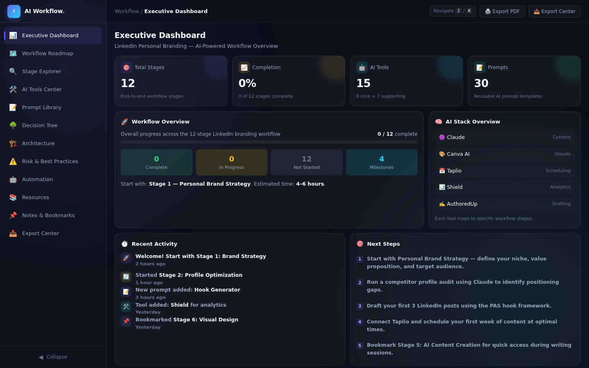

### Workflow Roadmap

Vertical timeline with 12 LinkedIn branding stages, status badges, dependencies, and milestones.

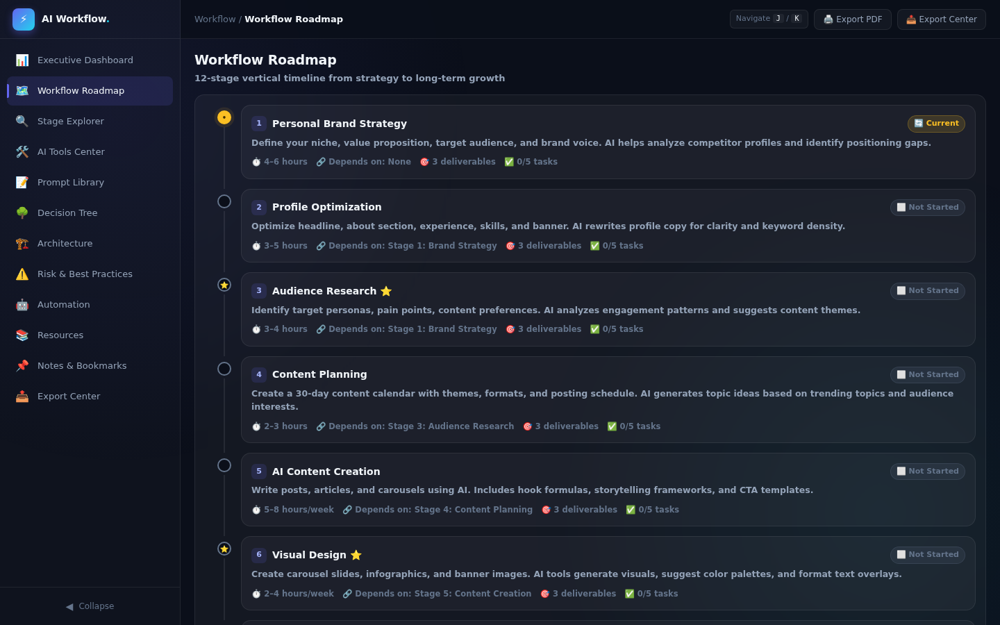

### Stage Explorer

One stage at a time — objectives, steps, tasks, deliverables, KPIs, AI tools, prompts, best practices.

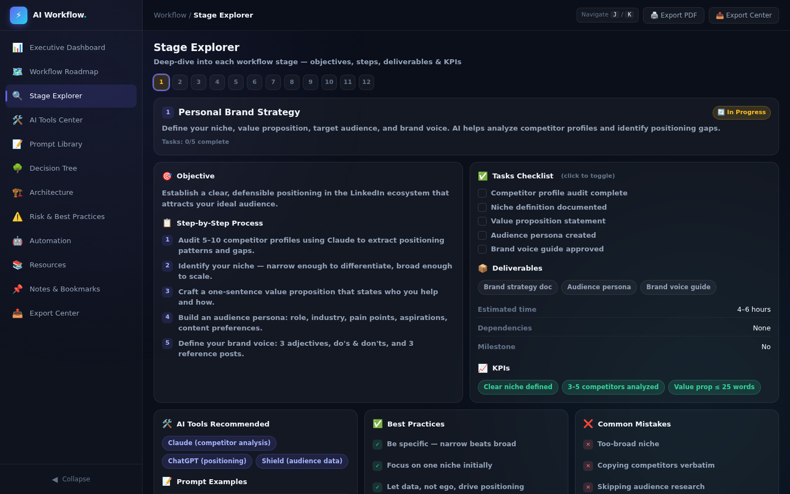

### AI Tools Center

8 tool cards with LinkedIn-specific recommendations, alternatives, and comparison table.

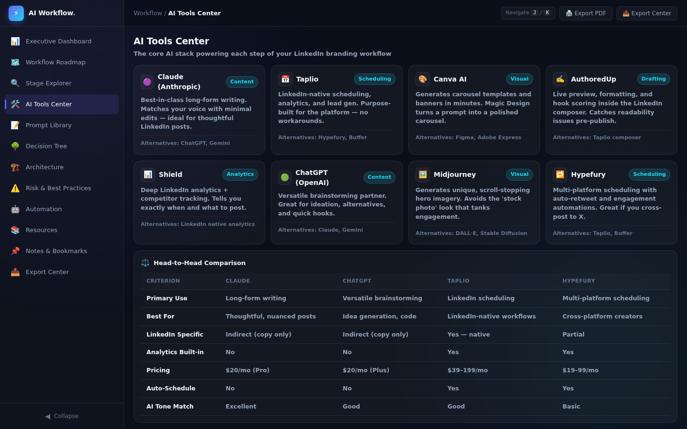

### Prompt Library

12 LinkedIn prompts with search, category filters, and copy-to-clipboard.

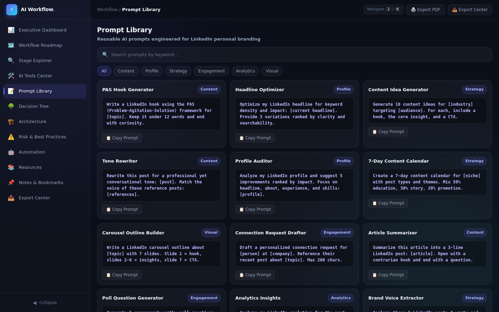

### Decision Tree

Interactive expandable tree for branding decisions (niche, content type, budget, time).

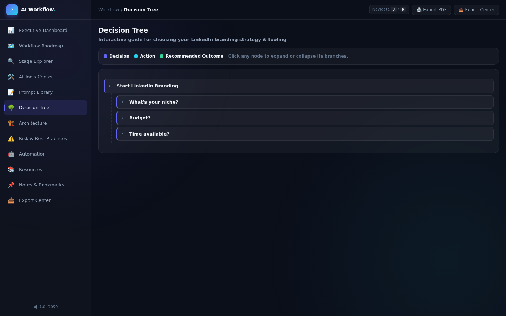

### Architecture & Diagrams

3 SVG diagrams: content pipeline, AI integration map, and growth funnel.

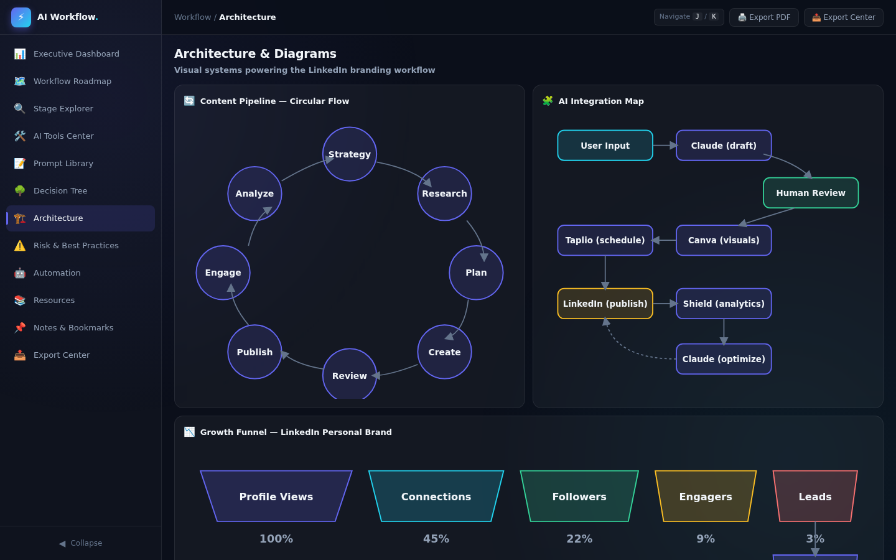

### Risk & Best Practices

Risk matrix, common mistakes, security checklist, and best practices.

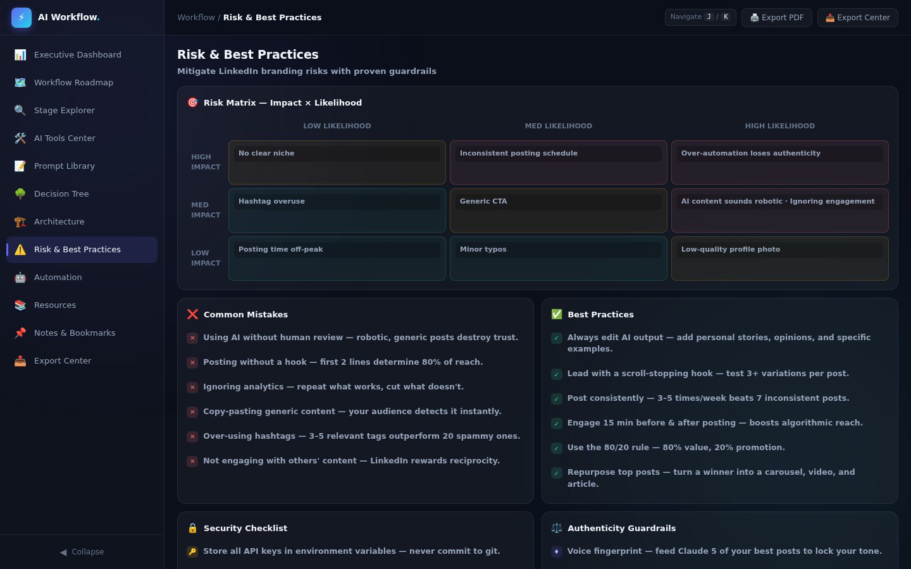

### Automation Opportunities

8 tasks that can be automated with AI solutions and difficulty badges.

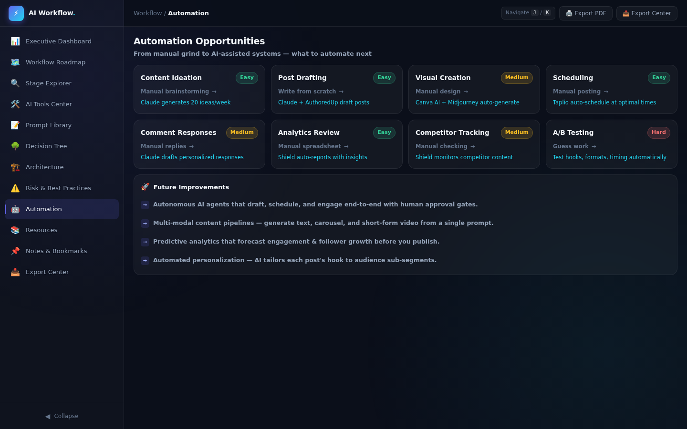

### Resources

Learning resources, communities, documentation, and search keywords.

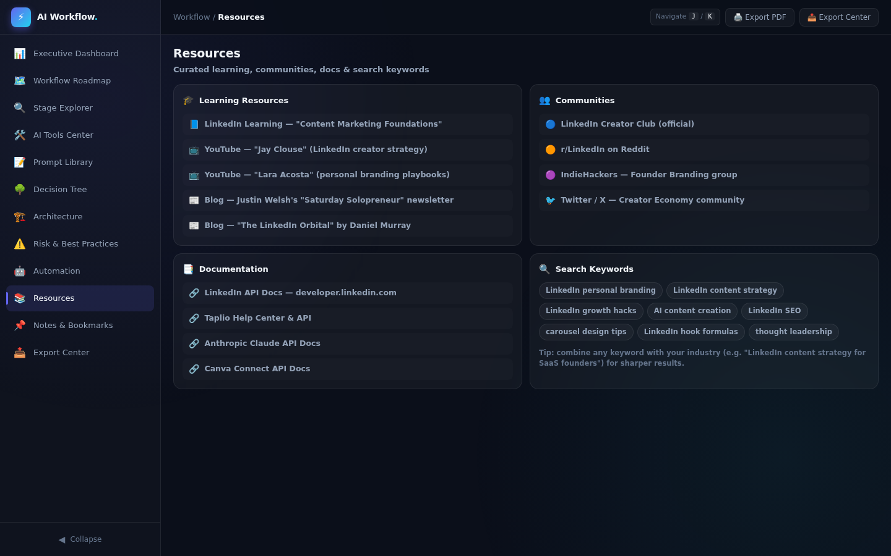

### Notes & Bookmarks

Personal notes with localStorage persistence and bookmarkable stages.

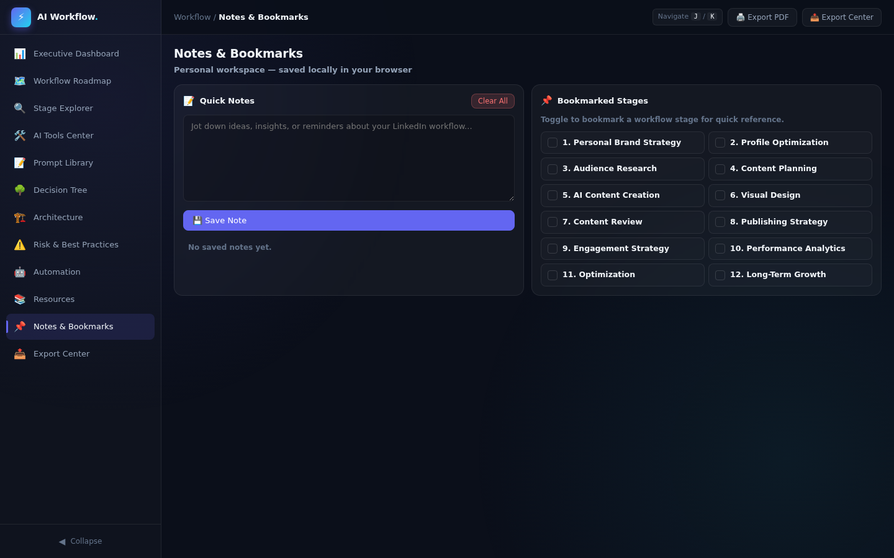

### Export Center

Workflow summary, completion report, and print button.

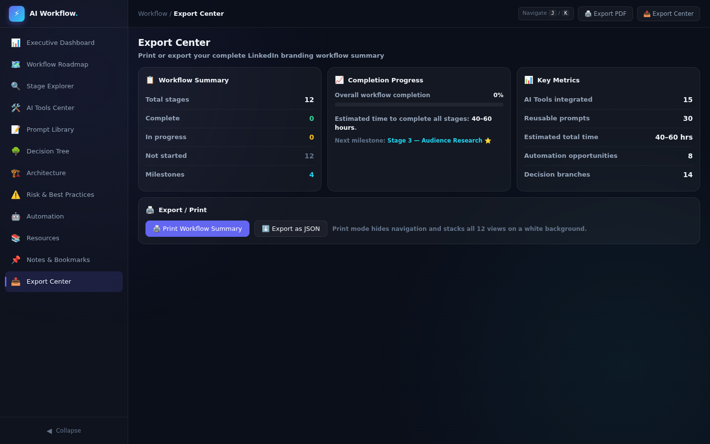

---

## Technologies Used

- HTML5
- CSS3 (CSS custom properties, grid/flexbox, glassmorphism, backdrop-filter, @keyframes animations, responsive breakpoints, print CSS)
- Vanilla JavaScript (ES6+)
- Inline SVG (content pipeline, AI integration map, growth funnel diagrams)
- localStorage (notes and bookmarks)
- Clipboard API (prompt copy-to-clipboard)

No external libraries or frameworks.

---

## Key Learnings

### Technical Learnings

- **Dynamic view switching is the foundation of SaaS-style dashboards.** The pattern — hide all views, show the target with a fade animation — creates the feeling of navigating a product rather than scrolling a document. The key is using CSS animations (`@keyframes viewIn`) on the `.view.active` class so each transition is smooth without JavaScript-driven animation loops.

- **Collapsible sidebars need width transitions, not display changes.** Toggling between `width: 260px` and `width: 72px` with a CSS transition creates a smooth collapse animation. When collapsed, labels fade out (`opacity: 0; width: 0`) while icons remain centered. The main content area adjusts its `margin-left` with the same transition timing.

- **Clipboard API with fallback ensures cross-browser copy buttons.** `navigator.clipboard.writeText()` is the modern approach, but older browsers need `document.execCommand('copy')`. The prompt library implements both with a toast notification for visual feedback.

### Conceptual Learnings

- **LinkedIn personal branding is a system, not a series of posts.** The 12-stage workflow — from strategy to long-term growth — shows that sustainable LinkedIn growth requires planning, consistency, and data-driven optimization. AI assists at every stage but doesn't replace human judgment, especially in content review and engagement.

- **AI tools should be recommended with context, not just names.** The AI Tools Center doesn't just list tools — it explains *why* each tool fits the LinkedIn use case, what alternatives exist, and how they compare. This context is what makes the dashboard genuinely useful rather than a generic tool directory.

- **Decision trees make complex strategies accessible.** "What's your niche?" → "B2B or B2C?" → "Technical or case studies?" — breaking down strategy into a series of binary choices makes it actionable. The interactive expand/collapse lets users explore only the branches relevant to them.

### Personal Reflection

Building this LinkedIn Personal Branding Workflow Dashboard made it clear that workflow platforms are more than just navigation — they're structured knowledge. The 12 stages, each with objectives, tasks, AI tools, prompts, and KPIs, collectively form a complete playbook that someone could follow step by step. The Stage Explorer was the most interesting view to build: each stage needed to feel like a self-contained chapter with its own context, not just a card in a list. The prompt library with copy-to-clipboard was immediately useful — the prompts are specific enough to paste into Claude and get LinkedIn-optimized output. The architecture diagrams (content pipeline, AI integration map, growth funnel) visually communicate how AI fits into the workflow without requiring a wall of text. Building this project reinforced that premium SaaS feel comes from structure, context, and interaction design — not from external libraries.

---

## Project Structure

```
day43/
├── ai-workflow-dashboard.html
├── day43.md
└── Screenshots/
    ├── 01-dashboard.png
    ├── 02-roadmap.png
    ├── 03-stage-explorer.png
    ├── 04-ai-tools.png
    ├── 05-prompt-library.png
    ├── 06-decision-tree.png
    ├── 07-architecture.png
    ├── 08-risk.png
    ├── 09-automation.png
    ├── 10-resources.png
    ├── 11-notes.png
    └── 12-export.png
```

---

## Final Thoughts

The AI Workflow Architect for LinkedIn Personal Branding does what it set out to do: it presents a complete, 12-stage AI-powered workflow for growing a LinkedIn personal brand — all in a single HTML file with no external dependencies. The stage-by-stage breakdown with AI tools, prompts, and KPIs makes the workflow actionable rather than theoretical. The interactive elements (decision tree, prompt library, stage explorer, notes with localStorage) make it feel like a product rather than a document. The architecture diagrams visually communicate how AI integrates into the content pipeline. The one thing I'd improve is adding a progress tracking system that persists across sessions — currently the stage completion is hardcoded, but a real product would let users check off tasks and track their progress over time. That said, for a single-file vanilla JavaScript application, the depth of content, the quality of the interactions, and the specificity to LinkedIn branding make this genuinely useful as a workflow guide.
