# Day 45 – AI Decision Strategist

## Overview

A single-file HTML application called "AI Decision Strategist" that works like a structured decision coach — guiding the user through a 4-question interview, then generating a full Decision Intelligence Report with 9 carousel sections. The app feels like ChatGPT mixed with a premium SaaS dashboard: dark glassmorphism, typewriter chat, animated analysis screen, and a swipeable report with left/right navigation, dots, and keyboard arrows.

The problem it addresses is that most people make hard decisions by overthinking in circles — weighing options against vague fears, hidden assumptions, and cognitive biases they can't see. This app forces structure: it asks exactly 4 questions (one at a time, never all at once), then produces a rigorous report that scores each option across 7 dimensions, runs a premortem on the top 2, exposes 3 assumptions and 2 named biases, hands the user a 7-day validation plan, and ends with a clear non-neutral verdict. The educational objective is understanding how to build a guided AI interview flow with a carousel report, share functions, and provider-agnostic REST API integration.

---

## Prompt Template

The following prompt was used to generate AI Decision Strategist:

```text
You are a Senior AI Product Engineer, Decision Scientist, UX Designer, Cognitive Psychologist, and Frontend Architect.

Your goal is NOT to simply answer questions.
Your goal is to build a premium AI Decision Intelligence application that feels like a real SaaS product.

Think:
• ChatGPT quality reasoning
• Linear UI
• Stripe polish
• Vercel aesthetics
• Apple level spacing
• Notion readability

MISSION: Guide the user through one difficult decision using structured thinking.
Challenge weak thinking. Expose hidden assumptions. Reduce emotional noise. Produce a clear recommendation.

INTERVIEW MODE: Ask EXACTLY four questions. Only ONE question per response. Wait for the answer before asking the next. Do NOT analyze until every answer is collected.

Question 1: What's the decision you're currently stuck on? Tell me every realistic option you're considering and why this decision feels difficult.
Question 2: What outcome are you actually hoping for? What deadline exists for making this decision?
Question 3: What does your intuition already believe is the best option? What fear is stopping you from trusting it?
Question 4: Imagine you're looking back one year from today. What mistake are you most afraid you'll regret making? If this decision fails, can it realistically be reversed?

After Question 4 say ONLY: "Perfect. Building your Decision Intelligence Report..."

Then generate ONE COMPLETE HTML FILE containing a premium dashboard with 9 sections:
1. The Real Decision (3 lines: decision, tradeoff, emotional)
2. The Case For Each Option (3 cards: strongest case, hidden upside, biggest weakness, best if you value)
3. Assumption Buster (3 assumptions, 2 named biases, 1 blind spot)
4. Decision Matrix (7 dimensions, /70, animated bars, winner highlighted)
5. Premortem (top 2 options, 3 reasons each failed, warning sign, prevention)
6. 7-Day Test Plan (Day 1-2 Research, 3-4 Experiment, 5-6 Conversation, 7 Decision Day)
7. The Verdict (best option, why it wins, what could flip it, hardest truth)
8. Shareable Cards (3 cards: matrix summary, verdict, LinkedIn post with hook/caption/CTA)

Design: Dark Modern (#09090B bg), glassmorphism, gradient accents (blue/purple/emerald/amber/rose), Inter font, soft shadows, micro animations, responsive.

Never invent facts. Base every conclusion only on user responses. If information is weak, say confidence is low.
```

---

## Features

- **Welcome screen with Begin Session** — single CTA, no settings wall. The user starts immediately; API key configuration is optional and accessible via a gear icon in the chat header.
- **4-question interview with typewriter animation** — questions appear one at a time with character-by-character typing and a blinking caret. Progress dots (1/4 → 4/4) track completion. Each answer appears as a chat bubble.
- **Animated AI thinking screen** — 7 sequential tasks (sending to AI, analyzing, identifying assumptions, detecting biases, mapping tradeoffs, building recommendation, rendering report) each show a spinner that flips to a green checkmark.
- **9-section carousel report** — one section per slide, navigated via left/right arrow buttons, clickable dots, or keyboard arrows (← →). A slide counter shows "3 / 9". No long scroll.
- **Section 1: The Real Decision** — 3 numbered lines: what the actual decision is, the real trade-off underneath, why it's emotionally hard.
- **Section 2: The Case For Each Option** — 3 premium cards, each with Strongest Case For, Hidden Upside Most Miss, Biggest Weakness, Best If You Value. The winning card glows green.
- **Section 3: Assumption Buster** — 3 assumptions, 2 named cognitive biases (loss aversion, status quo bias, sunk cost, etc.), and 1 "You're Definitely Ignoring" blind spot in a responsive 2-column grid.
- **Section 4: Decision Matrix** — 7 dimensions (Life/Career Upside, Financial Safety, Growth & Learning, Stress, Reversibility, Long-term Alignment, Regret Risk) scored out of 10 with animated horizontal bars that fill on load. Total /70. Winner highlighted with a WIN badge.
- **Section 5: Premortem** — 2 cards imagining the top 2 options failed after 12 months. Each has 3 failure reasons, 1 early warning sign, and 1 prevention action in a green box.
- **Section 6: 7-Day Test Plan** — vertical gradient timeline with 4 day cards: Day 1-2 Research, Day 3-4 Experiment, Day 5-6 Conversation, Day 7 Decision Day. One action per day.
- **Section 7: The Verdict** — non-neutral recommendation. Why it wins (2 lines), what could flip it, and a "hardest truth" callout in a red box.
- **Section 8: Shareable Cards** — 3 screenshot-ready cards: Matrix Summary (option names + scores), Verdict (winner + reason), LinkedIn Post (hook + 3-line caption + CTA). Each card has Share, PNG, and Copy buttons.
- **Share functions** — Web Share API (native share sheet with file sharing), PNG download (SVG foreignObject → canvas → blob), and clipboard copy with toast notifications.
- **Provider-agnostic REST API** — supports OpenAI, Anthropic, Groq, OpenRouter, and Z.AI via browser `fetch()` only. No SDKs. API key stored in localStorage.
- **Precoded fallback** — if no API key is set or the API call fails, a built-in heuristic engine generates a complete report so the app always works.
- **Settings modal** — accessible via gear icon (turns green when a key is saved). Provider selection, API key, model, temperature, max tokens, streaming toggle.

---

## Screenshots

### Start Screen
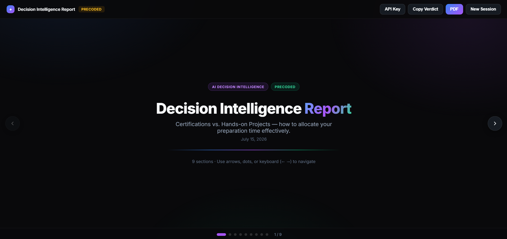

### Begin Session
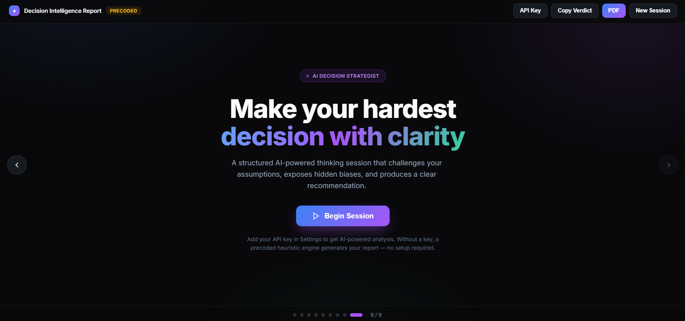

### Questions Page 1 (Q1)
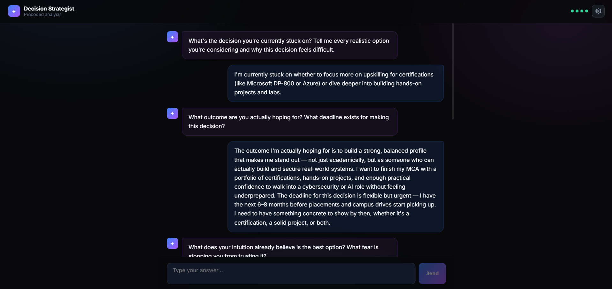

### Questions Page 2 (Q2-Q3)
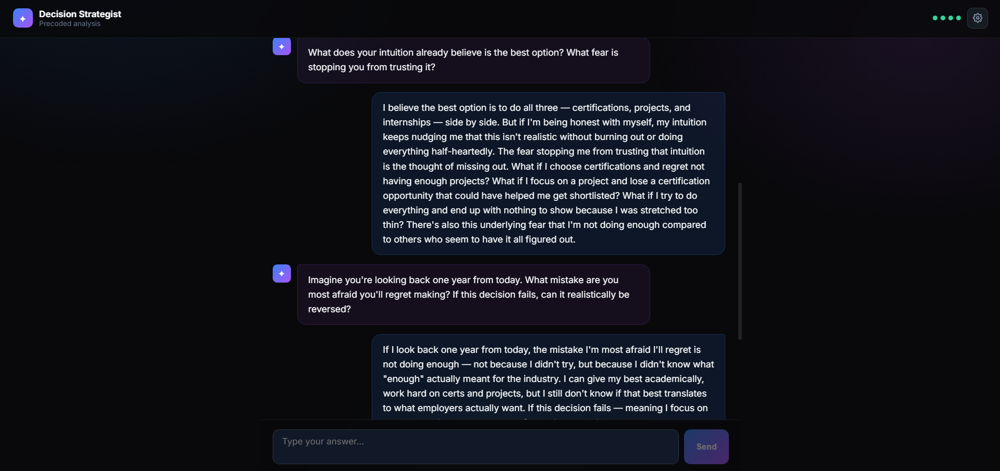

### Questions Page 3 (Q4)
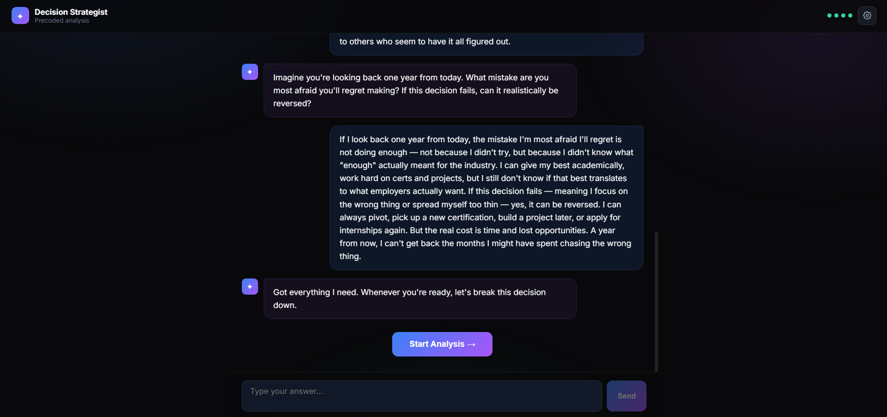

### Analysis Screen
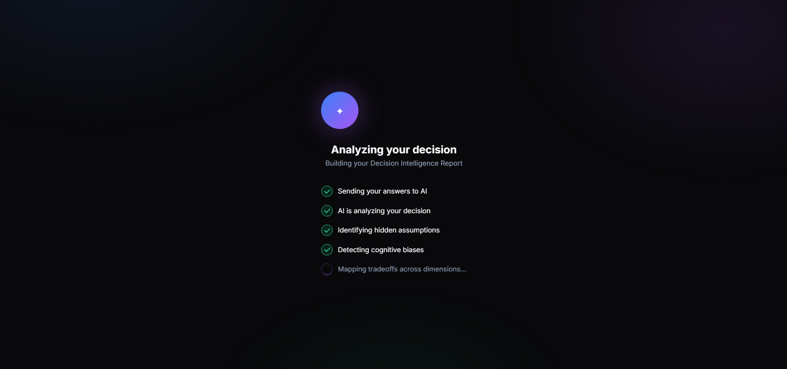

### The Real Decision
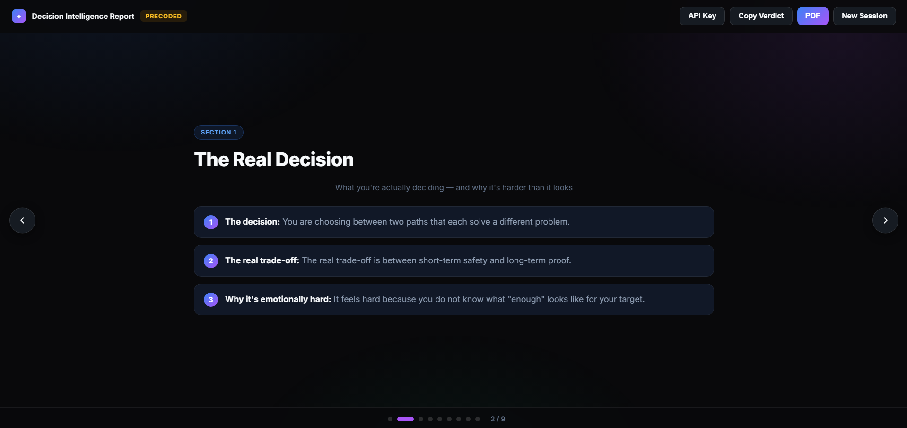

### The Case For Each Option
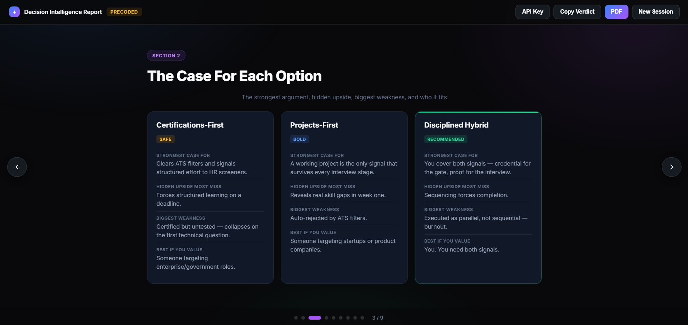

### Assumption Buster
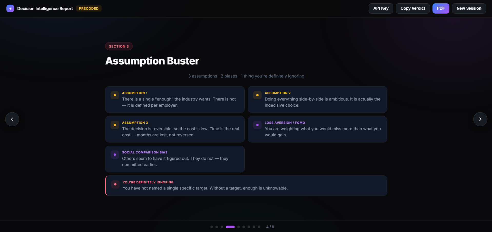

### Decision Matrix
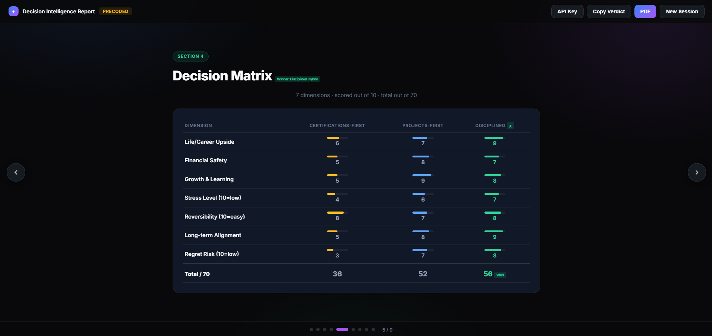

### Premortem
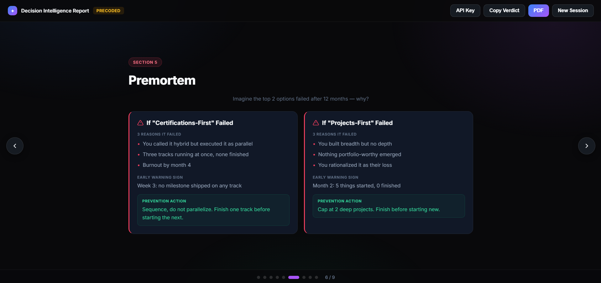

### 7-Day Test Plan
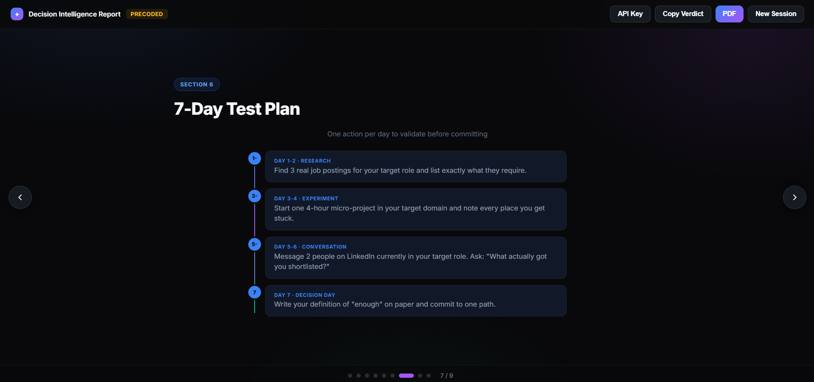

### The Verdict
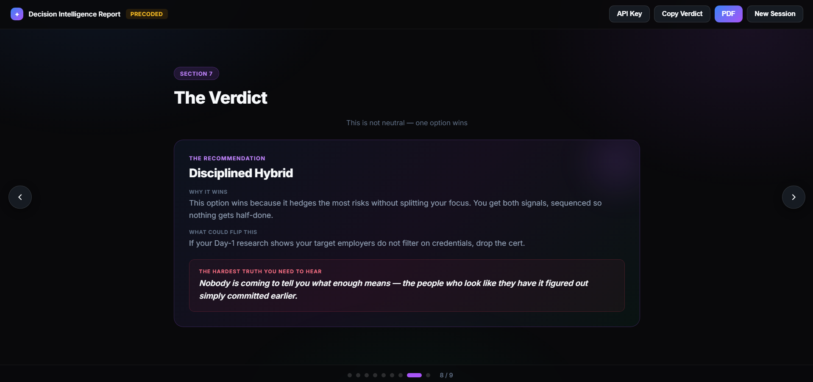

### Shareable Cards
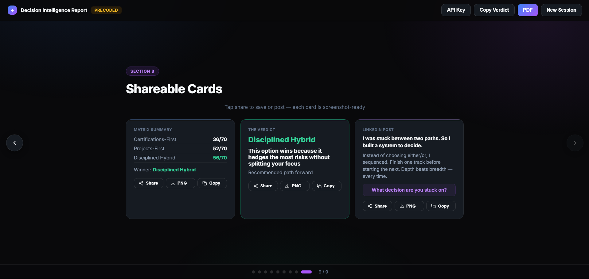

---

## Technologies Used

- HTML5
- CSS3 (glassmorphism, gradient system, carousel, animations)
- Vanilla JavaScript (state machine, interview flow, provider REST API calls, share functions)
- Google Fonts (Inter)
- No external libraries or frameworks

---

## Key Learnings

### Technical Learnings

- **Carousel reports beat long scrolls for section-by-section reading.** The report uses a flex track with `width:100%;flex-shrink:0` on each slide so each slide is exactly the viewport width. Navigation via arrows, dots, and keyboard creates a presentation feel. The critical CSS fix was using `width:100%` instead of `min-width:100%` — in a flex container, `min-width:100%` resolves to the track's content width (which grows with siblings), causing slides to be wider than the viewport and content to appear right-aligned.
- **SVG foreignObject is a reliable way to convert a DOM card to a PNG without libraries.** Clone the card, strip the share buttons, wrap it in an SVG with a foreignObject, render it to a canvas at 2x resolution, and export as a blob. The key gotcha: the cloned element needs explicit inline styles (background, color, font-family) because computed styles don't transfer through `cloneNode`.
- **Provider-agnostic REST API integration is straightforward with `fetch()`.** Each provider has a slightly different endpoint and header structure (OpenAI uses Bearer auth, Anthropic uses x-api-key + anthropic-version, Z.AI uses Bearer). The streaming implementations all follow the SSE `data: ` line format but Anthropic uses `content_block_delta` events while OpenAI-compatible APIs use `choices[0].delta.content`. A single parser with provider-specific event handling covers all 5.
- **The precoded fallback is what makes the app usable without a key.** By building a heuristic engine that reads the user's answers (keyword detection for "cert/project", "startup", "enough", "fear", etc.) and generates a complete report with all 9 sections, the app works instantly for anyone — the API key is an upgrade, not a gate.

### Conceptual Learnings

- **One question at a time is the core UX insight.** A 4-question form feels like paperwork; 4 sequential chat messages feel like a conversation. The progress dots give forward motion that a scrollbar never does. This is why the app feels like ChatGPT rather than a survey.
- **Non-neutral recommendations build trust.** A decision tool that says "it depends" is useless. The verdict picks ONE option, explains why in 2 lines, states what evidence would reverse it, and ends with a hard truth. Honesty — even when uncomfortable — is what makes the report feel written by a strategist rather than a template.
- **The premortem is the most valuable section.** Imagining failure before it happens surfaces risks that the option analysis misses. The 3-reasons + warning + prevention structure forces concrete thinking instead of vague worry.

### Personal Reflection

The hardest part of this build was getting the carousel centering right. The initial approach used `min-width:100%` on slides, which in a flex track resolves to the parent's content width — so 9 slides each claimed 100% of the growing track, pushing content off-screen and making everything look right-aligned. The fix was a one-line change (`width:100%;flex-shrink:0`) but it took VLM verification to catch it, because the DOM said "3 cards exist" while the screenshot showed only 2. The lesson: always verify rendered output, not just the DOM. The other insight was that share functions need three tiers (Web Share API → PNG download → clipboard copy) because no single method works on every browser — the fallback chain is what makes sharing feel reliable.

---

## Project Structure

```
Day45/
├── AI_Decision_Strategist.html
├── day45.md
└── Screenshots/
    ├── start.png
    ├── begin_session.png
    ├── questions_p1.png
    ├── questions_p2.png
    ├── questions_p3.png
    ├── analysis.png
    ├── real_decision.png
    ├── case_options.png
    ├── assumptions_buster.png
    ├── decision_matrix.png
    ├── premortem.png
    ├── 7dayplan.png
    ├── verdict.png
    └── shareablecards.png
```

---

## Final Thoughts

This project is a study in building a guided AI product experience that works with or without an API key. The interview flow, the animated analysis, and the 9-section carousel report are all driven by a single vanilla JavaScript state machine. The report structure forces rigor — every section has a specific job (expose assumptions, score tradeoffs, imagine failure, plan validation, commit to a verdict) and the carousel format makes each section feel like a slide in a strategy deck rather than a wall of text. The share functions (Web Share, PNG, Copy) make the output portable, and the precoded fallback ensures the app is never broken by a missing API key. Open the HTML file in any browser, click Begin Session, answer 4 questions, and the full report renders with zero configuration.
