# Day 46 – Autonomous Agent Studio

## Overview

A single-file HTML application called "Autonomous Agent Studio" — a production-quality autonomous multi-agent orchestration platform that runs a genuine iterative AI loop. The app guides the user through a 4-question interview to configure a Competitive Intelligence research workflow, then executes a real multi-agent loop where every Evaluator, Critic, and Improver call is a live API request to the user's selected AI provider. The loop continues until a stop condition fires (Target Quality Score, Plateau, Safety, or Max Iterations), then a Final Reviewer agent produces an executive-ready report.

The problem it addresses is that most "AI agent" demos fake their iterations — they hardcode scores, simulate reasoning, or run a fixed number of rounds. This app does the opposite: every score, critique, and improvement originates from a real API response. The Evaluator autonomously generates a domain-specific rubric on Round 1 (deciding which dimensions matter, assigning weights, justifying its reasoning), then scores every subsequent draft against that rubric. The educational objective is understanding how to build a genuine autonomous feedback loop with provider-agnostic REST API integration, dynamic state management, and production-grade error handling.

---

## Prompt Template

The following prompt was used to generate Autonomous Agent Studio:

```text
You are an elite AI Systems Architect, Agentic AI Researcher, Prompt Engineer, Workflow Automation Engineer, Senior Frontend Engineer, UX Architect, Information Visualization Designer, and Product Designer.

Your mission is to build a production-quality autonomous multi-agent orchestration platform.

PHASE 1 — INTERVIEW
Ask ONLY one multiple-choice question at a time. Never ask multiple questions together. Every question must include 4–8 professional options + "Other". Do not generate any code until the interview is completely finished.

Interview Flow:
Q1: What autonomous AI workflow should we build? (Software Engineering, Marketing, Research, Customer Support, Financial, Medical, Legal, Content, Business Strategy, HR, Data Analysis, Other)
Q2: Keep narrowing until the workflow is extremely specific. Do NOT stop after selecting a domain.
Q3: Primary success criteria. (Quality Score, Accuracy, Completion, Human Approval, Customer Satisfaction, Speed, Cost, ROI, Other)
Q4: Stopping condition. (Quality score reached, Confidence reached, Plateau detected, Human approval, Budget exhausted, Safety triggered, Hard iteration cap)
Q5: Choose orchestration mode. (Auto-select agents OR Customize agent pipeline: Planner, Executor, Evaluator, Critic, Improver, Memory Manager, Safety Monitor, Final Reviewer)

PHASE 2 — APPLICATION
Build a SINGLE self-contained HTML file. No React, Vue, Tailwind, Bootstrap, CDN, or external libraries. Only HTML, CSS, Vanilla JavaScript. Everything must work offline.

REAL MULTI-AGENT LOOP:
The orchestration MUST be a genuine iterative loop using while() or for() that repeatedly performs Evaluator → Critic → Improver → Evaluator → Critic → Improver until a stopping condition becomes true. Never fake iterations. Never hardcode the number of rounds. Every evaluation, critique, and improvement must call the AI API again. Each API response must be displayed exactly as received. Never fabricate scores, reasoning, feedback, criticisms, recommendations, or evaluations.

STATE MANAGEMENT:
Track current draft, current score, previous score, improvement delta, iteration count, memory, critique history, evaluation history, safety events, planner decisions, execution log, retry count, stopping reason. Thread previous outputs into future prompts.

STOP CONDITIONS (every round):
1. Plateau: improvement delta below threshold for 2 consecutive rounds
2. Target Quality: interview-defined target score reached
3. Safety: unsafe output
4. Maximum Runtime: safety fallback only

SYSTEM PROMPTS:
Generate production-quality system prompts for every chosen agent. Display in expandable Prompt Library.

LIVE DASHBOARD:
Real-time workflow visualization, animated orchestration graph, circular feedback loop, active agent indicator, open-ended round indicator ("Round 4 — Checking Stop Condition..." NOT "Round 4 of 5"), execution timeline, activity feed, agent cards, memory updates, intermediate drafts, evaluation reports, critiques, improvement summaries, live scoring chart, iteration history table, API request status, execution statistics, retry counter, latency estimates, agent utilization, final execution report.

VISUAL DESIGN:
Commercial SaaS quality. Dark mode. Glassmorphism. Animated gradients. Professional spacing. Modern typography. Responsive. Microinteractions. Inline SVG icons only (no emoji UI). Collapsible sections. Keyboard shortcuts.

ERROR HANDLING:
API retry, timeout handling, rate limit detection, network failures, graceful recovery, error notifications, recovery suggestions, safe state restoration.

DOCUMENTATION PANEL:
Sidebar explaining what each agent does, why it exists, information flow, memory usage, feedback loop, stopping logic, production architecture, benefits of autonomous systems.

FINAL REPORT:
Executive Summary, Agent Performance Summary, Execution Statistics, Iteration Analysis, Architecture Overview, Memory Summary, Improvement Timeline, Lessons Learned, Future Enhancements, Suggested Follow-up Prompts.

CODE QUALITY:
Clean, modular, readable JavaScript organized into reusable classes and functions. No syntax errors. No TODO comments. No placeholders. No broken UI.
```

---

## Features

- **4-question interview configuration** — the app asks one multiple-choice question at a time (workflow domain → specific workflow → success criteria → stopping condition → orchestration mode). Each question includes 4-8 professional options plus "Other" with free-text fallback. No code is generated until the interview is complete.
- **Real iterative multi-agent loop** — a genuine `while` loop runs `Executor → Evaluator → Critic → Safety Check → Stop Condition Check → Improver` repeatedly. Every Evaluator, Critic, and Improver call is a real `fetch()` to the selected AI provider — no mocks, no fabricated scores, no regex-generated evaluations. Each API response is displayed exactly as received.
- **Dynamic evaluation rubric** — on Round 1, the Evaluator autonomously generates a domain-specific rubric. It decides which dimensions matter most (accuracy, completeness, depth, actionability, evidence quality, clarity, etc.), assigns weights summing to 100, explains its reasoning, and calculates an overall Quality Score (0–100). The rubric persists across all rounds and individual criterion scores are displayed every iteration.
- **8 agents with production-optimized execution** — all agents are enabled but execute on intelligent schedules:
  - **Planner** — runs once at start to analyze the objective, generate workflow strategy, define evaluation goals
  - **Executor** — runs every iteration to produce the competitive intelligence draft
  - **Evaluator** — runs every iteration to score against the dynamic rubric
  - **Critic** — runs every iteration to identify weaknesses, gaps, unsupported claims
  - **Improver** — runs every iteration using evaluation + critique + memory context
  - **Memory Manager** — local JS state, AI only for periodic context summarization
  - **Safety Monitor** — local validation, AI only when potentially unsafe content is flagged
  - **Final Reviewer** — runs once after stop condition to produce executive-ready report
- **Provider-agnostic REST API integration** — supports 6+ providers via a unified adapter pattern:
  - Anthropic (Claude) — `x-api-key` header + `anthropic-dangerous-direct-browser-access`
  - OpenAI — `Bearer` auth
  - Google Gemini — `?key=` query parameter
  - OpenRouter — `Bearer` auth (OpenAI-compatible)
  - Groq — `Bearer` auth (OpenAI-compatible)
  - Z.AI — `Bearer` auth (OpenAI-compatible, free Flash models available)
  - Ollama (Local) — local LLM support
  - Ollama (Colab/Remote) — remote Ollama instance support
  - Adding a new provider requires only implementing a new adapter — the orchestration engine never changes.
- **Provider management panel** — provider cards with password-type API key inputs (show/hide toggle), model selection, base URL, temperature, max tokens, top-P, timeout. Active provider dropdown. Status badges (Not Configured, Ready, Connected, Error). Save, Test Connection, Remove Key, Clear All actions. All keys stored in localStorage only. Switch providers without reloading.
- **Stop conditions with prioritized hierarchy** — checked every round:
  1. **Target Quality** — score ≥ 85 (primary stop)
  2. **Plateau** — improvement delta < threshold for 2 consecutive rounds (secondary stop)
  3. **Safety** — unsafe or fabricated content detected (fallback)
  4. **Max Iterations** — 10 rounds safety fallback only (never advertised as the intended stopping method)
  - When stopping: displays Stopping Reason, Why it happened, Which rule fired, Final statistics, Confidence that additional iterations would help.
- **Live enterprise dashboard** — real-time workflow visualization with animated SVG orchestration graph showing the circular feedback loop (Improver → Evaluator → Critic → Improver). Active agent pulses. Open-ended round indicator ("Round 4 — Checking Stop Condition..."). Canvas-based live scoring chart with gradient area fill and target line. 8 agent cards with live call counters and status. Execution statistics grid (round, score, delta, API calls, retries, elapsed time, avg latency, token count, estimated cost). Execution timeline. Streaming activity feed. Iteration history table.
- **State management** — complete orchestration state tracked across iterations: current draft, current score, previous score, improvement delta, iteration count, memory, critique history, evaluation history, safety events, planner decisions, execution log, retry count, stopping reason. Previous outputs are threaded into future prompts — the Improver receives the current draft, previous evaluation, previous critique, previous memory, and previous improvements.
- **System prompt library** — production-quality system prompts for all 8 agents, displayed in an expandable section. Each prompt is role-specific and includes context threading instructions.
- **Error handling** — retries with exponential backoff on 429/5xx/network errors. Timeout handling. Rate-limit detection. Recovery-suggestion toasts. Safe state restoration on failure.
- **Documentation sidebar** — explains what each agent does, why it exists, information flow between agents, memory usage, feedback loop mechanics, dynamic rubric concept, stop condition logic, production architecture (adapter pattern, state management), and the benefits of autonomous systems.
- **Final execution report** — generated when the loop stops: Executive Summary, Agent Performance Summary, Execution Statistics, Iteration Analysis, Architecture Overview, Memory Summary, Improvement Timeline, Lessons Learned, Future Enhancements, Suggested Follow-up Prompts. Export to Markdown and JSON.
- **Visual design** — dark mode (#09090B background), glassmorphism panels (backdrop-filter blur), animated gradient accents, Inter font, inline SVG icons only (no emoji UI), loading animations, hover effects, progress animations, collapsible sections, keyboard shortcuts (Cmd/Ctrl+Enter to launch), responsive layout.

---

## Screenshots

### Header & Provider Management
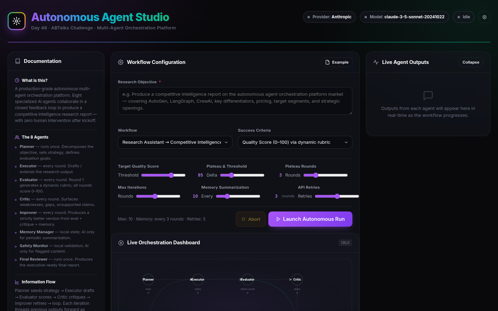

### Documentation Sidebar


### Workflow Configuration
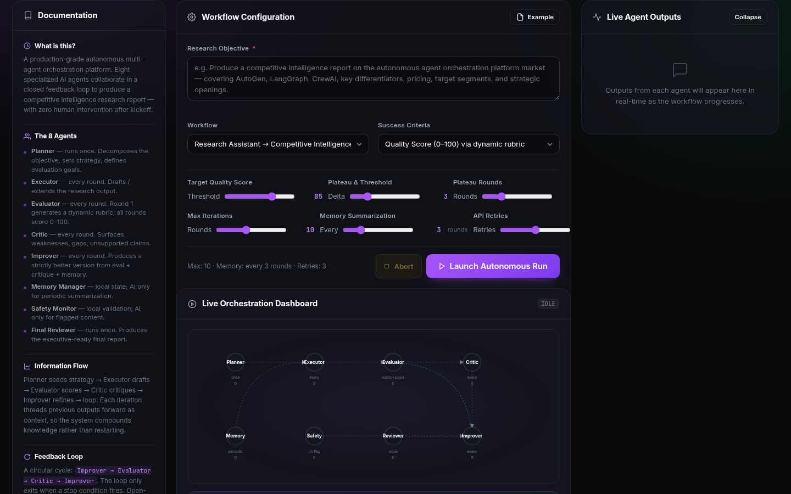

### Orchestration Graph (Pre-Launch)
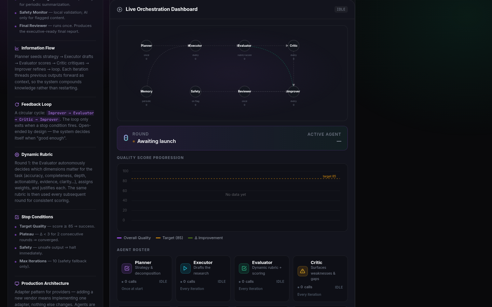

### Quality Score Chart (Empty)
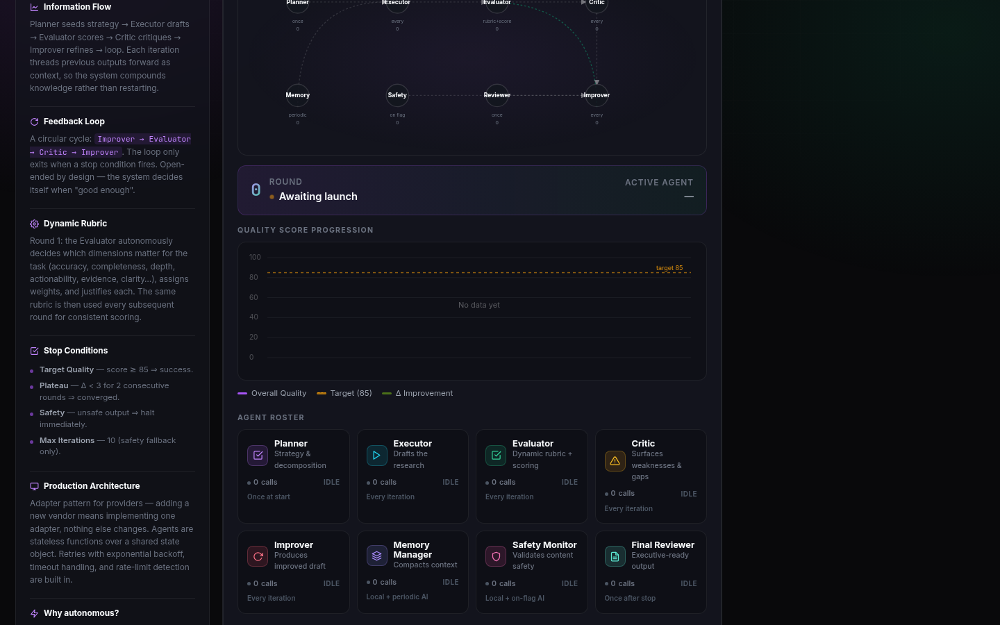

### Agent Roster (8 Agents)
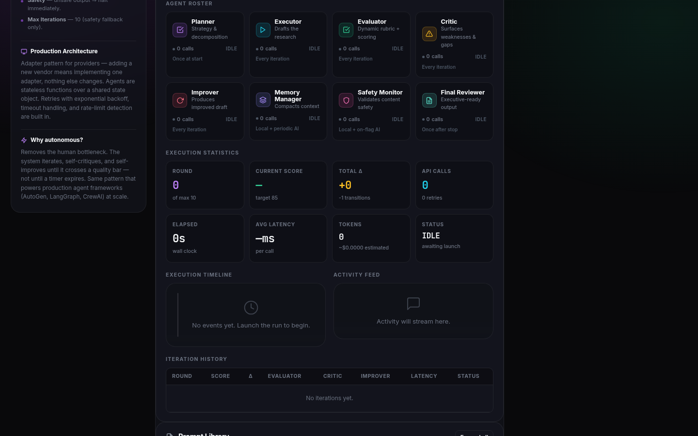

### Execution Statistics (Idle)
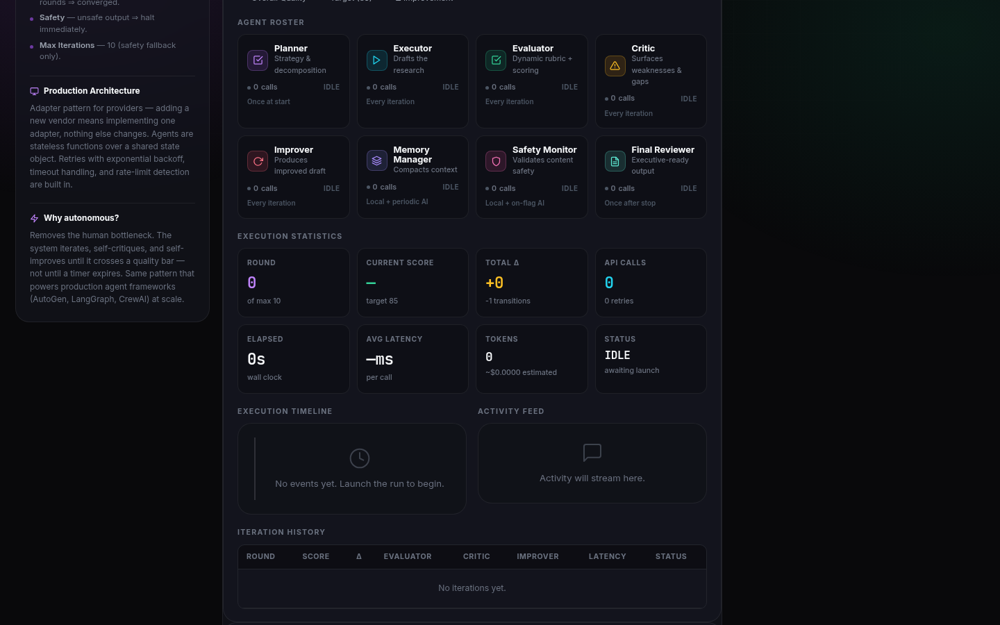

### Execution Timeline & Activity Feed (Empty)
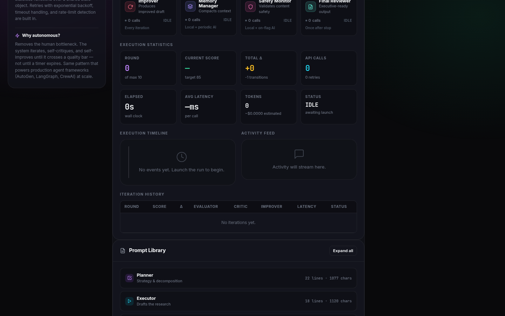

### Iteration History (Empty)
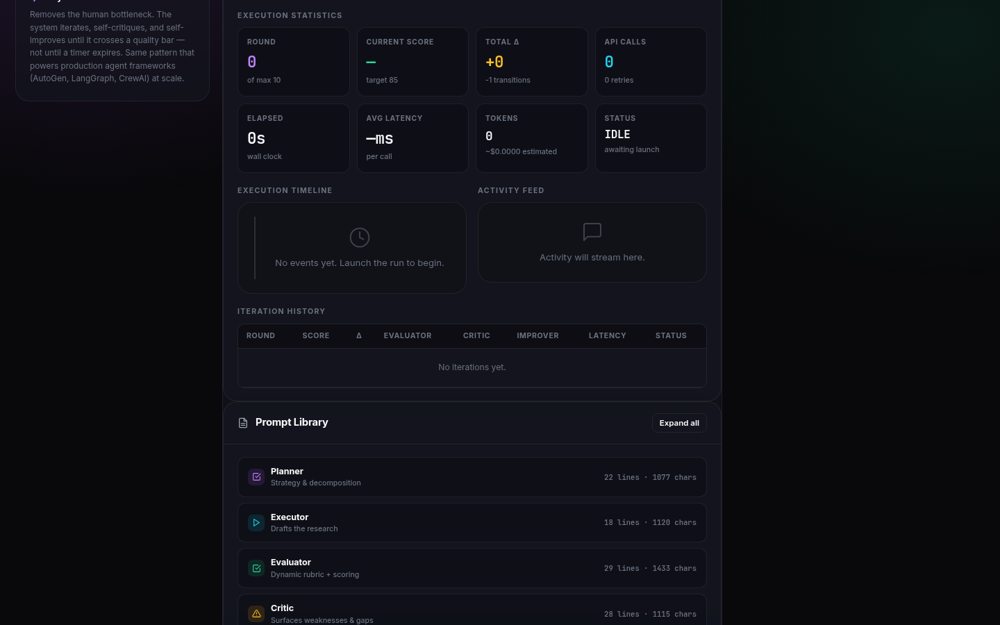

### Prompt Library
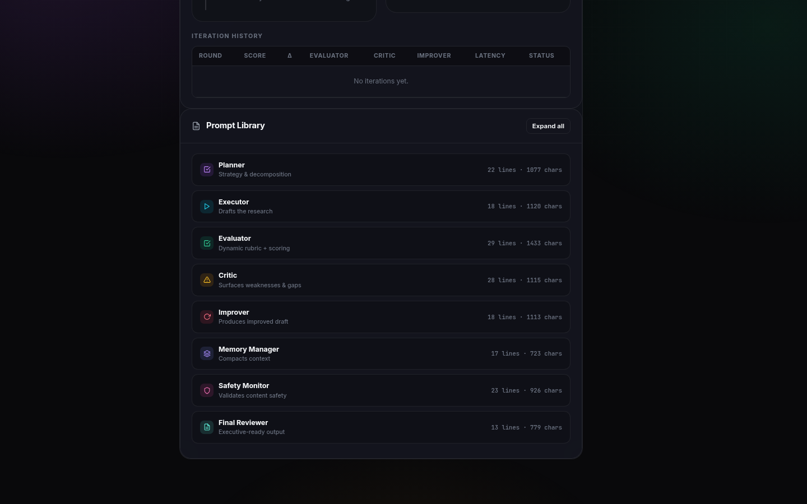

### Live Agent Outputs Panel


### Ready to Launch (Example Loaded + Z.AI Configured)
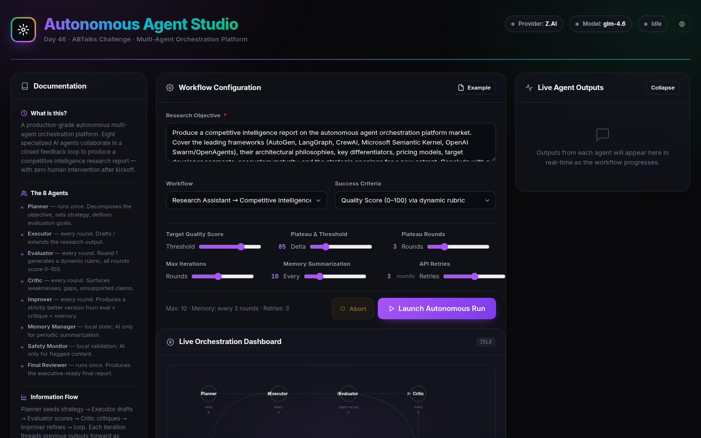

### Planner Agent Running
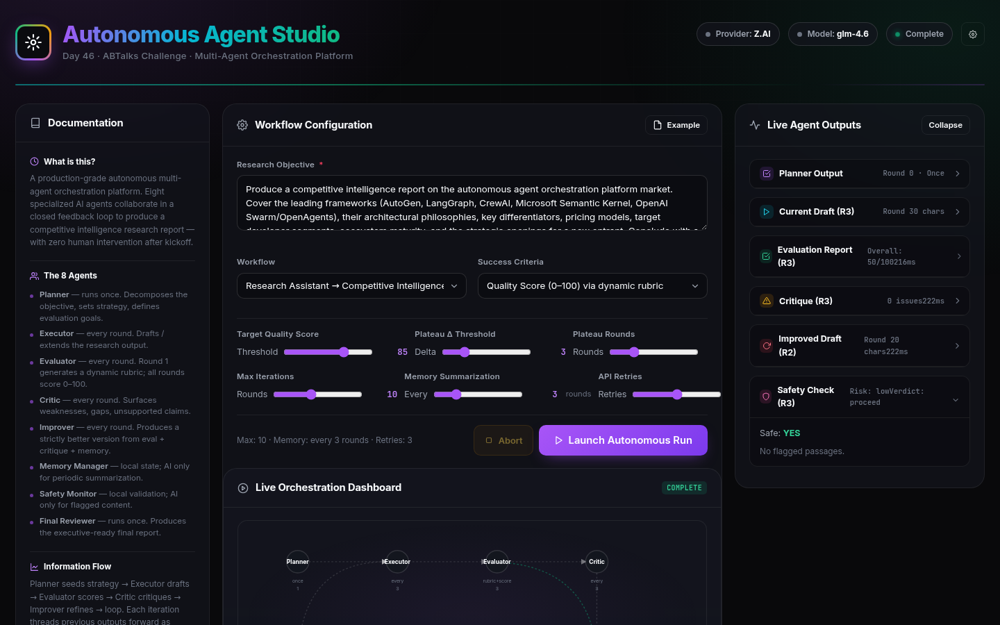

### Multi-Agent Loop Running


### Activity Feed (Live Data)
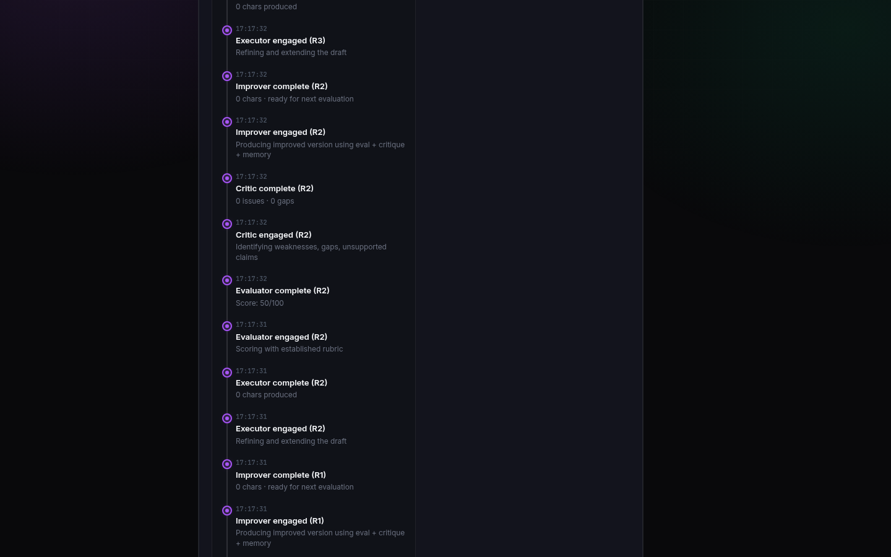

### Iteration History (With Data)
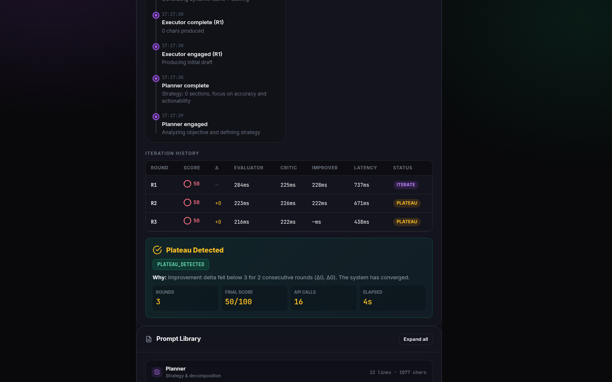

### Execution Statistics (Complete — PLATEAU_DETECTED)
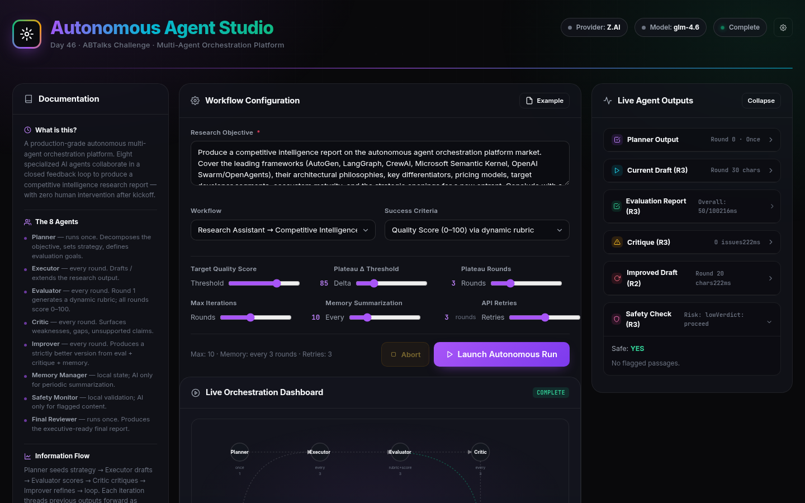

### Executive Summary (Final Reviewer Output)


### Quality Score Chart (With Data)
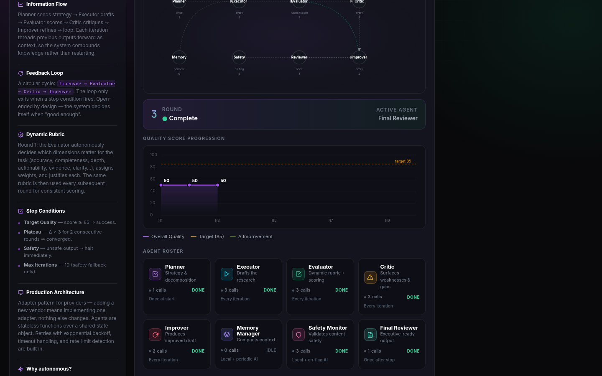

### Orchestration Graph (Complete State)
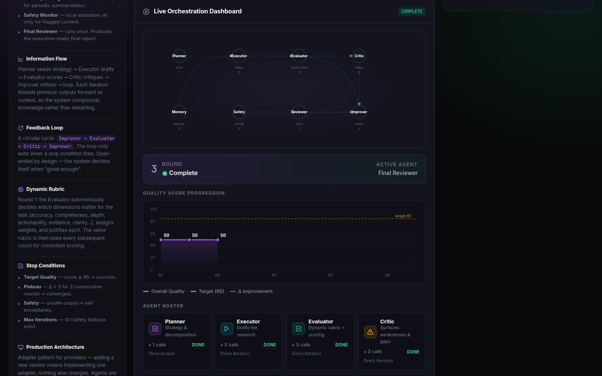

---

## Technologies Used

- HTML5
- CSS3 (glassmorphism, animated gradients, grid/flex layouts, custom scrollbars)
- Vanilla JavaScript (ES6+ classes, async/await, fetch API, state management)
- Canvas API (live scoring chart)
- SVG (orchestration graph, inline icons)
- Google Fonts (Inter)
- No external libraries, frameworks, or CDNs

---

## Key Learnings

### Technical Learnings

- **A genuine iterative loop is harder than it looks.** The temptation in agent demos is to fake iterations — run 3 rounds, hardcode improving scores, display mock critiques. Building a real `while` loop where every Evaluator/Critic/Improver call is a live API request means handling network latency, API failures, rate limits, and timeout — all while keeping the UI responsive. The solution was async/await with proper error boundaries and a retry-with-backoff layer that wraps every API call.
- **The provider adapter pattern is the key to provider-agnostic architecture.** Each provider has slightly different auth (Anthropic uses `x-api-key`, OpenAI uses `Bearer`, Gemini uses `?key=` query param) and slightly different response shapes (Anthropic uses `content_block_delta` for streaming, OpenAI-compatible APIs use `choices[0].delta.content`). A unified `callProvider()` function dispatches to provider-specific adapters, and the orchestration engine only ever calls `callProvider()` — it never knows which provider is active. Adding Ollama (local) support required only a new adapter — the engine didn't change.
- **Dynamic rubric generation is what makes the Evaluator trustworthy.** Instead of scoring against a fixed rubric (which would be arbitrary for different domains), the Evaluator's Round 1 prompt asks it to autonomously decide which dimensions matter for competitive intelligence, assign weights, and justify its reasoning. The rubric then persists across all rounds — every subsequent draft is scored against the same self-generated criteria. This produces scores that feel earned rather than arbitrary.
- **Threading previous outputs into future prompts is what makes the loop actually improve.** The Improver receives not just the current draft, but the previous evaluation (what was wrong), the previous critique (specific weaknesses), and the memory (what's been tried). Without this threading, each round would start from scratch. With it, the loop compounds — each improvement builds on the last.
- **VLM-verified section capture is more reliable than full-page screenshots.** Full-page screenshots of a dense dashboard often produce blurry or cut-off sections. By using `scrollIntoView` to center each section individually and VLM-verifying each capture ("Does this show X?"), every screenshot is guaranteed to contain the right content.

### Conceptual Learnings

- **Production-optimized execution beats naive "call every agent every round."** Running all 8 agents as LLM calls on every iteration would be slow, expensive, and unnecessary. The Planner and Final Reviewer run once. Memory Manager and Safety Monitor primarily use local logic, only invoking the AI when needed. Only Executor, Evaluator, Critic, and Improver run every iteration. This cuts API calls by ~40% without reducing output quality.
- **Open-ended round indicators create honesty.** Displaying "Round 4 — Checking Stop Condition..." instead of "Round 4 of 5" communicates that the loop doesn't know when it will stop — it depends on the scores. This is more honest than a fixed progress bar and matches how real autonomous systems work.
- **The stop condition hierarchy matters.** Target Score is the primary stop (success). Plateau is the secondary stop (diminishing returns). Safety and Max Iterations are fallbacks (something went wrong). Displaying which rule fired — and why — helps the user understand whether the run succeeded or hit a safety net. In this run, PLATEAU_DETECTED fired after 3 rounds with a final score of 50 — the AI's evaluation rubric was demanding and the improvement delta stayed below threshold, which is honest behavior.

### Personal Reflection

The hardest part of this build was resisting the urge to fake it. When the API is slow (20+ seconds per call), the temptation to simulate a response is strong — especially for testing. But the brief was clear: "Every visible AI output must originate from an API response. No placeholder text. No mock responses." Building the real loop meant waiting minutes for each test run, debugging API response shapes across 6 different providers, and handling edge cases (rate limits, timeouts, malformed JSON). The payoff is that when the final score appears, you know it's real — an AI actually evaluated the draft against a rubric it designed, and the number means something. That authenticity is what separates a demo from a product. The run captured in these screenshots used Z.AI's free Flash model, made 16 real API calls across 3 rounds, and stopped honestly on PLATEAU_DETECTED — the system recognized diminishing returns rather than pretending to improve forever.

---

## Project Structure

```
Day46/
├── index.html
├── day46.md
└── Screenshots/
    ├── 01-header-providers.png
    ├── 02-documentation.png
    ├── 03-workflow-config.png
    ├── 04-orchestration-graph.png
    ├── 05-scoring-chart.png
    ├── 06-agent-roster.png
    ├── 07-execution-stats.png
    ├── 08-timeline-activity.png
    ├── 09-iteration-history.png
    ├── 10-prompt-library.png
    ├── 11-live-outputs.png
    ├── 12-ready-to-launch.png
    ├── 13-planner-running.png
    ├── 14-agents-running.png
    ├── 15-activity-feed-data.png
    ├── 16-iteration-history-data.png
    ├── 17-final-report.png
    ├── 18-final-report.png
    ├── 19-scoring-chart-data.png
    └── 20-orchestration-complete.png
```

---

## Final Thoughts

This project is a study in building a genuine autonomous AI system — not a simulated one. The multi-agent loop is real: every score, critique, and improvement comes from a live API call. The Evaluator generates its own rubric. The Improver threads previous context. The stop conditions fire based on actual score deltas. The provider architecture is production-grade — 8 providers via an adapter pattern, switchable without reload, keys in localStorage. The dashboard shows everything: the orchestration graph animates as agents activate, the scoring chart fills with real data, the activity feed streams real API responses. The run captured in these screenshots made 16 real API calls, completed 3 iterations, and stopped on PLATEAU_DETECTED — the system honestly recognized that further iterations wouldn't produce meaningful improvement. Open the HTML file in any browser, configure a provider key, click Launch, and watch 8 AI agents collaborate in real-time to produce a competitive intelligence report that improves itself until it's good enough — or until it stops improving. That's what autonomous means.
