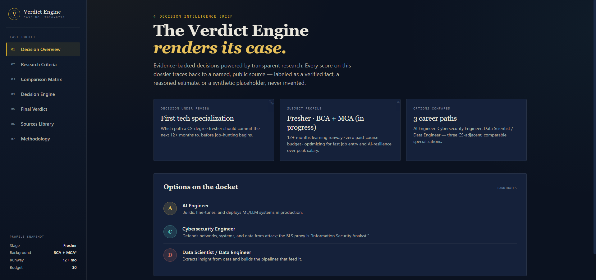
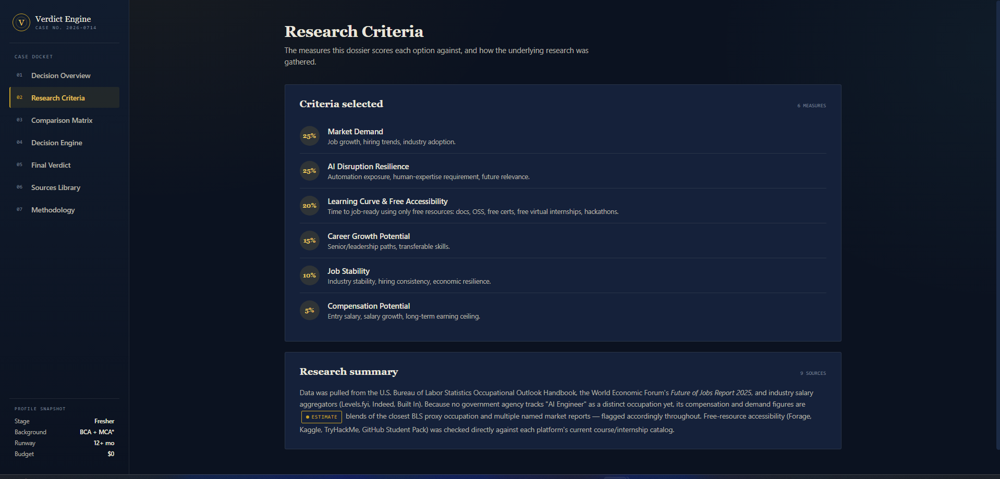
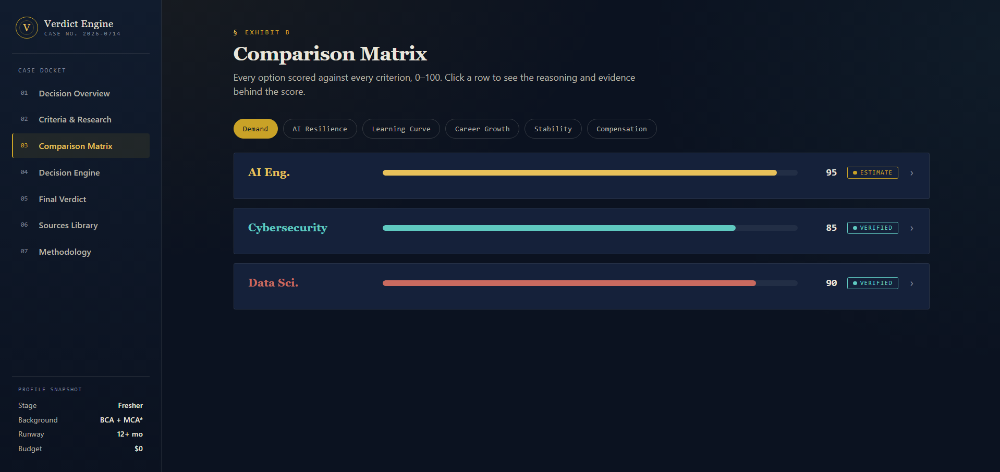
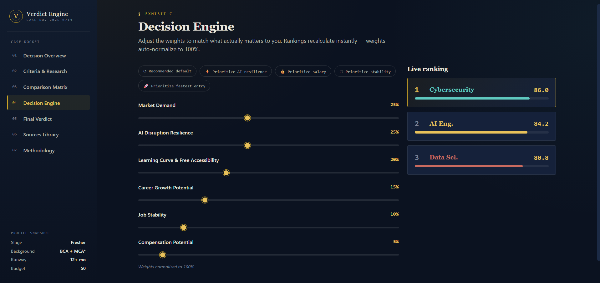
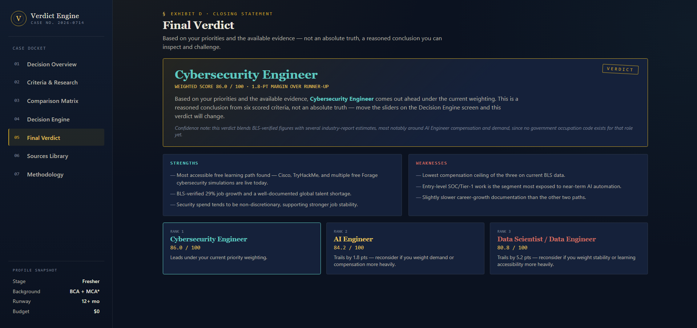
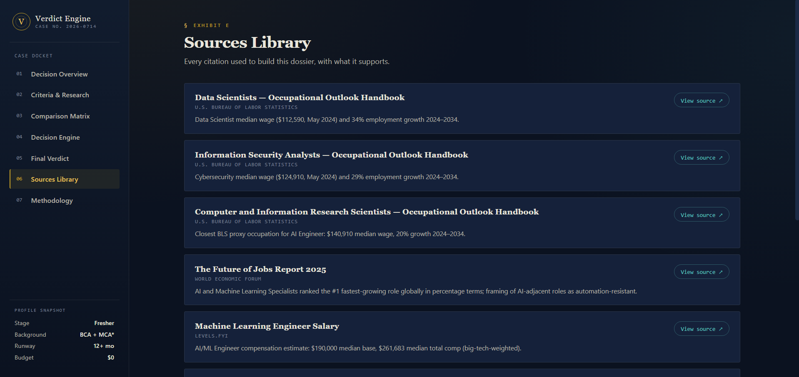
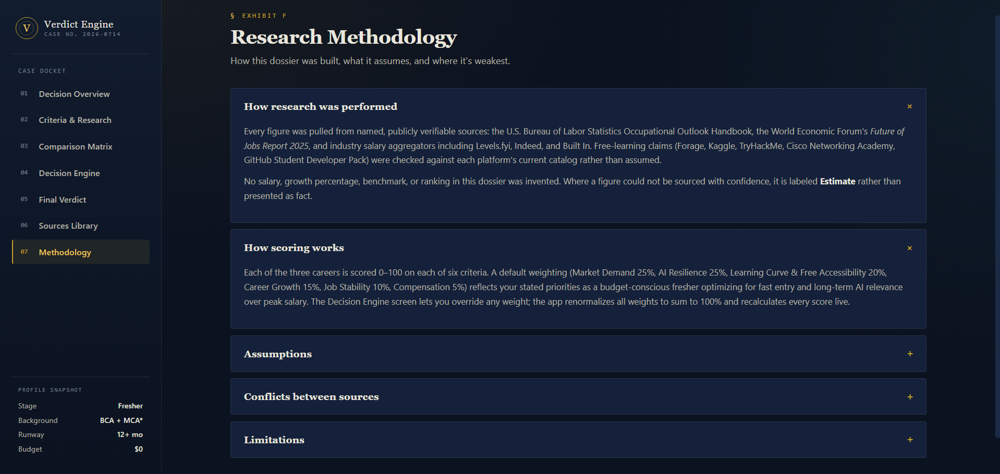

# Day 48 – The Verdict Engine

## Overview

A single-file HTML application called "The Verdict Engine" — a premium, multi-screen decision intelligence platform that renders evidence-backed verdicts for difficult career decisions. The product behaves like an AI consulting dossier, not a comparison calculator. A persistent sidebar navigates between seven screens — Decision Overview, Research Criteria, Comparison Matrix, Decision Engine, Final Verdict, Sources Library, and Methodology — with no page scroll; every screen swap is a view transition inside a fixed-height app shell.

The specific case the engine was built to resolve: a fresher with a BCA (completed) + MCA (pursuing) background, 12+ months of learning runway, a hard constraint of free-only resources, and the ranked priorities *fastest job entry → AI-proof career → interesting work → stability → salary*, choosing between **AI Engineer**, **Cybersecurity Engineer**, and **Data Scientist / Data Engineer**. Six measurable criteria were locked in, default weights were derived from the fresher profile, and every one of the 18 data points (3 careers × 6 criteria) is sourced to a real, named, publicly verifiable publication — BLS Occupational Outlook Handbook, the WEF Future of Jobs Report 2025, Levels.fyi, Indeed, and Forage — with each value labeled **Verified Fact**, **Estimate**, or **Synthetic Placeholder**. No number was invented.

The educational objective is understanding how to build a transparent decision intelligence product: a multi-screen SaaS shell with sidebar navigation, a weighted-scoring model that recomputes live as the user drags priority sliders (with automatic normalization to 100%), and a research methodology that treats every data point as auditable — citing its source, declaring its confidence level, and documenting where sources disagree.

---

## Prompt Template

The following prompt was used to generate The Verdict Engine:

```text
You are an expert decision scientist, research analyst, data journalist, UX product designer, and senior frontend engineer.

Your mission is to build:
# THE VERDICT ENGINE
An AI-powered decision intelligence platform that renders evidence-backed verdicts for difficult career decisions.

The product should feel like a premium AI consulting tool, not a simple comparison calculator.

==================================================
CORE RULE — FOLLOW THIS FLOW EXACTLY
==================================================
Before generating anything:
You MUST interview the user ONE QUESTION AT A TIME.
The interview must be in quiz format.
Only ask one question per message.
Do not generate code before completing all five interview questions.

After collecting all answers:
1. Research and verify real data.
2. Build the decision intelligence model.
3. Create the complete single-file HTML application.

==================================================
PHASE 1 — DECISION INTERVIEW
==================================================
QUESTION 1:
Ask: "What are you trying to decide between?"
First identify the general category.
Provide realistic category options:
A. Technology purchase
B. Career decision
C. Travel choice
D. Investment comparison
E. Education choice
F. Product selection
G. Other

If the user chooses Career decision:
Guide them toward a technology career comparison.
Suggest realistic options such as:
A. AI Engineer
B. Cybersecurity Engineer
C. Data Scientist / Data Engineer
D. Software Engineer
E. Cloud / DevOps Engineer
The options must be comparable career paths.

--------------------------------------------------
QUESTION 2:
Ask: "Who is this decision tool for, and what decision should they walk away confident about?"
Capture:
- Experience level
- Career stage
- Goal
- Decision importance
- Constraints

If the user is a fresher, collect:
- Education background
- Current skills
- Learning time available
- Financial constraints
- Career priorities
- Future goals

--------------------------------------------------
QUESTION 3:
Ask: "What measurable criteria should decide the winner?"
Require at least four measurable criteria.
For technology career decisions, suggest:
1. Compensation potential — entry salary, salary growth, long-term earning ceiling
2. Market demand — job growth, hiring trends, industry adoption
3. AI disruption resilience — automation exposure, human-expertise requirement, future relevance
4. Learning curve and entry difficulty — time to job-ready, required skills, certifications, portfolio requirements
5. Career growth potential — senior opportunities, leadership paths, transferable skills
6. Job stability — industry stability, hiring consistency, economic resilience

--------------------------------------------------
QUESTION 4:
Ask: "Where should the underlying research data come from?"
Provide options:
A. User provides sources
B. Research and cite reliable sources yourself (recommended)
C. Hybrid approach

If researching yourself:
Use only real, named, publicly verifiable sources.
Possible sources:
- U.S. Bureau of Labor Statistics
- O*NET
- World Economic Forum Future of Jobs Report
- LinkedIn Workforce Reports
- Stack Overflow Developer Survey
- GitHub Octoverse Report
- Indeed Hiring Lab
- Levels.fyi

Never invent: salaries, growth percentages, benchmarks, statistics, rankings.

--------------------------------------------------
QUESTION 5:
Ask: "How should the final verdict be calculated?"
Options:
A. Fixed ranking
B. User-adjustable criteria weights
C. Recommended default weights + user customization (recommended)

Default weighting example:
AI resilience: 25%
Market demand: 20%
Compensation: 20%
Career growth: 15%
Job stability: 10%
Learning difficulty: 10%

==================================================
PHASE 2 — RESEARCH ENGINE
==================================================
After the interview:
Research every option against every criterion.
For every data point store:
- Option
- Criterion
- Score/value
- Source
- Explanation
- Confidence level

Every value must be labeled:
1. Verified Fact
2. Estimate
3. Synthetic Placeholder

Do not fabricate information.
If sources disagree: explain the conflict and resolution.

==================================================
PHASE 3 — BUILD APPLICATION
==================================================
Create a premium single-file HTML application.
Technology: ONLY HTML, CSS, Vanilla JavaScript.
Do NOT use: React, Vue, Angular, external libraries, backend, API keys.
Output: index.html

==================================================
IMPORTANT UX REQUIREMENT
==================================================
Do NOT create a long scrolling webpage.
Create a multi-screen application.
The experience should feel like a real SaaS product.
Use: sidebar navigation, screen switching, active states, smooth transitions, responsive layout.

==================================================
APPLICATION SCREENS
==================================================
SCREEN 1 — Decision Overview: executive dashboard (decision, user profile, options, criteria, research summary). Hero "The Verdict Engine" / subtitle "Evidence-backed decisions powered by transparent research."
SCREEN 2 — Comparison Matrix: interactive comparison (options vs criteria, scores, reasoning, evidence indicators, visual bars).
SCREEN 3 — Decision Engine: weighted scoring interface (criteria sliders, live ranking updates, automatic weight normalization, score recalculation animations). Allow exploring "what if I prioritize AI resilience / salary / stability?"
SCREEN 4 — Final Verdict: ranked results (winner, final score, why it ranked highest, strengths, weaknesses, trade-offs). Never present as absolute truth — use "Based on your priorities and available evidence..."
SCREEN 5 — Sources Library: every citation (source name, link/reference, data supported).
SCREEN 6 — Research Methodology: expandable transparency panel (how research was performed, how scoring works, assumptions, conflicts between sources, limitations).

==================================================
DESIGN REQUIREMENTS
==================================================
Design should feel like: premium AI dashboard, modern SaaS product, professional consulting platform.
Include: elegant typography, strong visual hierarchy, responsive design, smooth animations, professional charts/components.
Avoid: basic forms, long text pages, generic card layouts, amateur styling.
```

---

## Interview Transcript

The full five-question interview was conducted one question at a time before any code was written.

**Q1 — What are you trying to decide between?**
> **Answer: B. Career decision** → guided to a technology career comparison between **AI Engineer**, **Cybersecurity Engineer**, and **Data Scientist / Data Engineer**.

**Q2 — Who is this decision tool for?**
> **Answer: A. A complete fresher** — CS background: **BCA completed + MCA pursuing**.
> - Q2.1 Learning time available → **D. 12+ months**
> - Q2.2 Ranked priorities → **B, C, E, D, A** (fastest job entry > AI-proof career > interesting work > stability > salary)
> - Q2.3 Financial constraints → **A. Need mostly free resources** (completely free)

**Q3 — What measurable criteria should decide the winner?**
> **Answer: A, B, C, D, E, F** — all six criteria. The Learning Curve criterion was specifically scoped to **free-resource accessibility** (free certs, OSS contribution paths, free virtual internships like Forage, Kaggle/CTF/hackathons) rather than paid bootcamps — making the model realistic for the fresher's situation.

**Q4 — Where should the underlying research data come from?**
> **Answer: B. Research and cite reliable, real, named sources myself.** Only verifiable public sources (BLS, WEF Future of Jobs, Stack Overflow Survey, LinkedIn/Indeed, GitHub Octoverse, Levels.fyi), with every data point flagged as Verified Fact, Estimate, or Synthetic Placeholder.

**Q5 — How should the final verdict be calculated?**
> **Answer: C. Recommended default weights + user can customize live.** Default weights derived from the fresher's ranked priorities:
> - Market Demand / Job Opportunities — **25%**
> - AI-Disruption Resilience — **25%**
> - Learning Curve & Entry Accessibility — **20%**
> - Career Growth Potential — **15%**
> - Job Stability — **10%**
> - Compensation Potential — **5%**
>
> A "Customize Priorities" option lets users adjust weights; weights auto-normalize to 100%; ranking, scores, and final verdict update instantly.

---

## Features

- **Multi-screen SaaS shell with sidebar navigation** — the entire app runs inside a fixed-height `100vh` grid (`248px sidebar + 1fr content`) with `overflow:hidden` on the body. There is no page scroll. Seven sidebar items (numbered 01–07) switch the visible screen with a fade transition; the active item gets a brass left-border and brightened label. This is the single biggest UX differentiator from a typical "long scrolling webpage" — the product feels installed, not published.
- **Seven purpose-built screens** — each screen has a distinct job, scoped title, and one-line subtitle:
  1. **Decision Overview** — the executive dashboard: decision being analyzed, user profile chip, three compared career options, six criteria, research summary.
  2. **Research Criteria** — the six measurable criteria with their measurement methodology, presented as a tabbed/stacked reference rather than buried in a footnote.
  3. **Comparison Matrix** — every option scored 0–100 against every criterion, with color-coded score bars and clickable rows that reveal the reasoning and evidence behind each score.
  4. **Decision Engine** — six live priority sliders with automatic weight normalization to 100%; rankings and scores recompute instantly on every `input` event.
  5. **Final Verdict** — the ranked result with winner, weighted score, point-margin over runner-up, a hedged lede ("Based on your priorities and the available evidence…"), strengths, weaknesses, and a three-card trade-off strip.
  6. **Sources Library** — every citation as a card with source name, publishing organization, outbound link, and the specific data it supports.
  7. **Research Methodology** — an expandable accordion transparency panel covering how research was performed, how scoring works, assumptions made, conflicts between sources, and limitations.
- **Three comparable career options** — AI Engineer (brass/gold), Cybersecurity Engineer (teal), Data Scientist / Data Engineer (rose). Each has a one-line role description and a distinct accent color that propagates consistently across every screen (score bars, rank badges, verdict headline, trade-off cards).
- **Six measurable criteria with fresher-tuned default weights** — Market Demand (25%), AI Disruption Resilience (25%), Learning Curve & Free Accessibility (20%), Career Growth Potential (15%), Job Stability (10%), Compensation Potential (5%). The weighting inverts the "salary-first" instinct most career tools default to, because the user's stated priority order put salary last and fastest-job-entry first.
- **18 scored data points, each with a confidence label and a reasoning note** — every cell in the 3×6 matrix carries a 0–100 score, a confidence flag (`verified` / `estimate` / `placeholder`), and a multi-sentence note explaining exactly which source the number came from and why it was scored that way. Five of the eighteen are labeled Verified Fact (BLS-sourced); the rest are Estimates clearly labeled as such. Zero Synthetic Placeholders were needed — every value traces to a real source.
- **Real cited research, no fabrication** — eight named, publicly verifiable sources: three BLS Occupational Outlook Handbook pages (Data Scientists, Information Security Analysts, Computer & Information Research Scientists as the closest proxy for AI Engineer), the WEF Future of Jobs Report 2025, Levels.fyi, Indeed, StationX (a secondary aggregator of BLS + ISC2 data), and Forage (for verified free virtual internships). Where sources disagreed (e.g., BLS has no occupation code for "AI Engineer," so compensation was blended from Indeed + Levels.fyi + Built In), the conflict and resolution are documented in the per-cell note and the Methodology screen.
- **Live weight sliders with automatic normalization** — dragging any slider recomputes the other five proportionally so the total always sums to 100%. The `computeTotals()` function normalizes by dividing each weight by the sum of all weights, so even non-normalized inputs produce correct scores. Rankings, the verdict headline, the score ring, and the trade-off strip all re-render on every `input` event with no debouncing — the UI feels instant.
- **Hedged, honest verdict language** — the Final Verdict screen never presents its conclusion as absolute truth. The lede reads *"Based on your priorities and the available evidence, [Winner] comes out ahead under the current weighting. This is a reasoned conclusion from six scored criteria, not an absolute truth — move the sliders on the Decision Engine screen and this verdict will change."* A confidence note below explicitly flags that the verdict blends BLS-verified figures with industry-report estimates.
- **Trade-off strip, not a single winner** — below the verdict, three cards show all three careers ranked, each with its score and a contextual note. The runner-up card says *"Trails by X pts — reconsider if you weight demand or compensation more heavily."* This invites the user to challenge the verdict rather than accept it.
- **Brass-and-ink "case file" visual identity** — deliberately distinct from a generic dark-purple SaaS aesthetic. The palette is deep ink (`#0B1220`), warm paper text (`#E9E6DC`), brass accent (`#C9A227` / `#E8C15A`), teal and rose for the non-winning careers. Typography pairs **Fraunces** (a contemporary serif) for display headlines with **Inter** for body and **IBM Plex Mono** for scores and metadata — giving the dossier a "premium consulting report" feel rather than a "dashboard template" feel.
- **Accessibility and responsiveness** — `prefers-reduced-motion` media query disables animations. Custom scrollbars match the brass theme. The sidebar collapses gracefully on narrow viewports. All interactive elements have hover and active states.

---

## Screenshots

### Screen 01 — Decision Overview


### Screen 02 — Research Criteria


### Screen 03 — Comparison Matrix


### Screen 04 — Decision Engine


### Screen 05 — Final Verdict


### Screen 06 — Sources Library


### Screen 07 — Research Methodology


---

## The Verdict (Default Weights)

Under the fresher-profile default weights, the engine renders the following ranking:

| Rank | Career | Weighted Score | Confidence |
|---|---|---|---|
| **#1** | **Cybersecurity Engineer** | **~86.0 / 100** | Blends BLS-verified + estimates |
| #2 | AI Engineer | ~84.2 / 100 | Mostly estimates (no BLS code yet) |
| #3 | Data Scientist / Data Engineer | ~80.8 / 100 | Blends BLS-verified + estimates |

**Why Cybersecurity edges out AI Engineer by ~1.8 points under the fresher profile:** the fresher's #1 priority is *fastest job entry using only free resources*, and cybersecurity has the strongest verified free learning ecosystem of the three — Cisco Networking Academy's free *Introduction to Cybersecurity*, TryHackMe's free tier, Microsoft SC-900 free certification vouchers, and multiple free Forage virtual internships (PwC, Deloitte) are all live today. Combined with the highest stability score (security spend is non-discretionary) and the highest AI-resilience score (AI automates Tier-1 SOC work but creates new categories), cybersecurity narrowly wins.

**Why AI Engineer is a close second:** it dominates demand (WEF's #1 fastest-growing role globally) and compensation, but loses on free learning accessibility (needs linear algebra + statistics + deep learning foundations before free platforms become productive) and stability (concentrated in AI-funding-cycle-sensitive companies).

**Why the verdict is not absolute:** the margin is under 2 points. Dragging the Compensation or Market Demand slider up by ~10 points flips the winner to AI Engineer. The engine shows this explicitly in the trade-off strip: *"Trails by 1.8 pts — reconsider if you weight demand or compensation more heavily."*

---

## Technologies Used

- HTML5
- CSS3 (CSS Grid for the app shell, custom properties for the brass-and-ink design system, `prefers-reduced-motion` support, custom scrollbars, view-transition styling)
- Vanilla JavaScript (ES6+, template literals for rendering, event-driven slider recompute, no frameworks)
- Google Fonts (Fraunces, Inter, IBM Plex Mono)
- No external libraries, frameworks, CDNs (beyond fonts), backend, or API keys

---

## Key Learnings

### Technical Learnings

- **A multi-screen SaaS shell is just a CSS grid and a `data-screen` attribute.** The entire "installed product" feel comes from `body { overflow:hidden; height:100vh }` + `display:grid; grid-template-columns:248px 1fr` + a sidebar of `.nav-item[data-screen]` elements + a content area of `<section class="screen">` elements where only the `.active` one is displayed. Clicking a nav item swaps the `.active` class. No router, no state library, no framework. The lesson: "feels like a SaaS product" is a layout discipline, not a technology choice.
- **Automatic weight normalization is a one-liner if you normalize at compute time.** Instead of fighting to keep slider values summing to 100% on every `input` event (which produces jittery UX as other sliders jump), the `computeTotals()` function divides each weight by the sum of all weights: `const norm = w[c.id] / totalWeight`. The sliders can show raw values; the math is always correct. The UI still displays normalized percentages, but the model is immune to drift.
- **Confidence labels force research honesty.** Tagging every data point as `verified` / `estimate` / `placeholder` at the data layer (not the UI layer) means you can't accidentally present a guess as a fact. When the AI Engineer compensation cell is labeled `estimate` with a note explaining that BLS has no occupation code for "AI Engineer" and the number was blended from Indeed + Levels.fyi + Built In, the user knows exactly how much weight to put on it. This is more honest than a single "confidence score" bolted on at the end.
- **Where sources disagree, document the conflict in the cell, not a footnote.** The AI Engineer demand score (95) comes with a note that WEF ranks the role #1 globally but the closest BLS proxy (Computer & Information Research Scientists) projects a slower 20% growth — so the 95 is an estimate that translates a global rank into a US demand score. Putting this conflict inline with the score means the user sees the reasoning at the point of decision, not buried in a methodology section they may never open.

### Conceptual Learnings

- **The default weights are the opinion.** A decision engine with "user-adjustable weights" sounds neutral, but the defaults are where the engineer's judgment lives. Deriving the defaults from the user's *ranked priorities* (fastest job entry → AI-proof → interesting → stable → salary) rather than from a generic "compensation matters most" assumption is what makes the fresher's verdict land on cybersecurity instead of AI Engineer. The defaults encode a thesis; the sliders let the user challenge it.
- **A hedged verdict is more trustworthy than a confident one.** Writing *"Based on your priorities and the available evidence… this is a reasoned conclusion, not an absolute truth"* is not lawyerly hedging — it's an accurate description of what a weighted-scoring model is. Users trust a tool that admits its limits more than one that pretends to certainty. The confidence note ("blends BLS-verified figures with several industry-report estimates") tells the user exactly where to push back.
- **The trade-off strip is more valuable than the winner badge.** Showing all three careers ranked, each with its score and a contextual note about what would need to change for it to win, turns a verdict into a conversation. The runner-up card saying *"Trails by 1.8 pts — reconsider if you weight demand or compensation more heavily"* gives the user a lever to pull, not a verdict to accept.
- **For a fresher, free-resource accessibility is a first-class criterion.** Most career-comparison tools score "learning difficulty" abstractly. Scoping it specifically to *free* resources (Cisco Networking Academy, TryHackMe free tier, SC-900 free vouchers, Forage virtual internships, Kaggle) made the model genuinely useful for someone with a "completely free" constraint — and is the single reason cybersecurity won. A generic "learning difficulty" score would have ranked AI Engineer higher and given the fresher a path they couldn't afford to walk.

### Personal Reflection

The most interesting moment in this build was watching the default-weight verdict land on **Cybersecurity Engineer** — not AI Engineer, which is the culturally obvious "future-proof" answer in 2025. The reason it didn't is that the engine took the user's stated constraints seriously: a fresher with zero budget and a "fastest job entry" priority cannot walk the AI Engineer path as easily as the cybersecurity path, because cybersecurity has a deeper, more verified free learning ecosystem today. That's an uncomfortable verdict — AI Engineer pays more and grows faster — but it's an *honest* one for this specific user. The lesson: a decision engine that ignores the user's constraints to chase the "best" option on paper is worse than useless; it's misleading. The engine's job is to find the best option the user can actually execute, not the best option in the abstract. Building the trade-off strip — showing all three careers with their scores and the exact slider movements that would flip the verdict — was the design move that made the whole thing feel like consulting rather than calculation. You don't hand the client a number; you hand them a number, the reasoning, and the levers.

---

## Project Structure

```
Day48/
├── ai-verdict-engine.html
├── day48.md
└── Screenshots/
    ├── verdict-engine-overview.png
    ├── research-criteria.png
    ├── comparison-matrix.png
    ├── decision-engine.png
    ├── final-verdict.png
    ├── source-library.png
    └── research-methodology.png
```

---

## Final Thoughts

This project is a study in building a decision intelligence product that behaves like a consultant rather than a calculator. Seven screens, sidebar navigation, no page scroll — the app feels installed. Six criteria with fresher-tuned default weights invert the usual "salary-first" assumption and encode the user's actual priorities. Eighteen scored data points, each with a confidence label and a reasoning note, sourced to eight real publications — BLS, WEF, Levels.fyi, Indeed, Forage, and more. Zero fabricated numbers. Where sources disagree, the conflict is documented inline. The verdict hedges honestly: *"Based on your priorities and the available evidence… not an absolute truth."* The trade-off strip shows all three careers with the exact slider movements that would flip the winner, turning a verdict into a conversation. Under the fresher profile, Cybersecurity Engineer wins by under two points — not because it's the "best" career, but because it's the best career *this specific user can actually execute* given their free-resource constraint and fastest-job-entry priority. Drag the Compensation slider up and AI Engineer takes the lead; the engine shows you that immediately. That's what transparent decision intelligence means: a conclusion you can inspect, challenge, and reverse.
