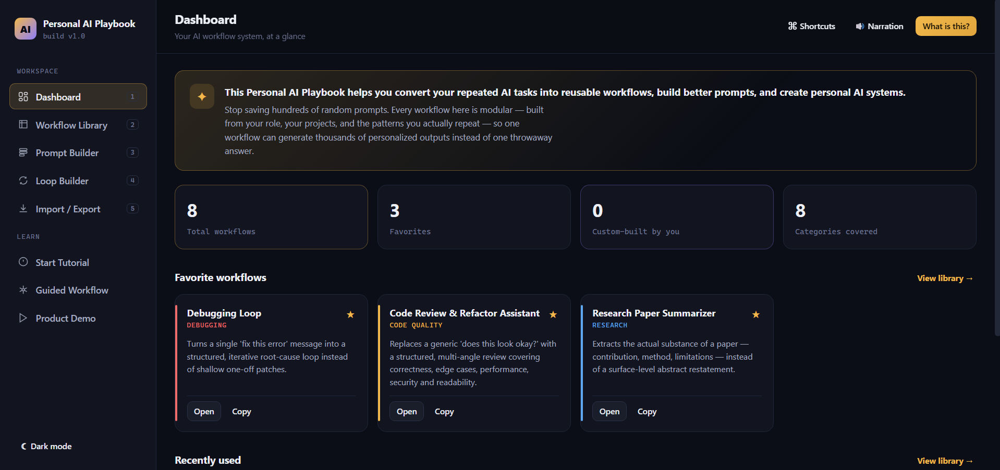

# Day 49 — Personal AI Playbook

## Overview

A single-file HTML application called "Personal AI Playbook" — a premium, multi-screen productivity system that converts repeated AI tasks into reusable, modular workflows. The product behaves like a personal AI operating system: instead of saving hundreds of throwaway prompts in a notes app, you build a small library of structured workflows — each one a saved, customizable, improvable AI system with named variables, categories, favorites, and a usage log — that can generate thousands of personalized outputs instead of one-off answers.

The app ships with three core builders and a workflow library:

1. **Workflow Library** — a searchable, filterable, persistent (localStorage) catalog of workflows, pre-seeded with eight production-quality workflows across eight categories (Debugging, Code Quality, Architecture, Documentation, Research, Learning, Agents, Planning). Every workflow has a template with `{{VARIABLES}}`, default values, a "when to use" guide, and a one-click run panel that lets you fill in the variables and copy the assembled prompt.
2. **Prompt Builder** — a block-based prompt composer. Instead of freehand-typing a prompt, you add modular blocks (Role, Objective, Context, Constraints, Reasoning Strategy, Output Format, Tone, Examples, Quality Checks) — each with a "why this matters" explanation — and watch the live prompt assemble on the right. Save the result as a new workflow.
3. **Loop Builder** — an autonomous-improvement-loop generator. You specify a goal, evaluation criteria, improvement strategy, iteration method, stop conditions, and safety rules; the app generates a self-refining loop prompt where the AI evaluates its own output against your criteria and keeps refining until a stop condition fires.

The product is wrapped in a SaaS-grade app shell with a persistent sidebar (numbered keyboard shortcuts 1–5), a topbar with quick actions, a four-phase onboarding tutorial with optional voice narration (Web Speech API), a guided workflow walkthrough, and a product demo mode. Full JSON import/export lets users back up, share, and restore their library. Light/dark theme toggle. Fully responsive.

The educational objective is understanding how to build a personal AI productivity system that treats prompts as **durable, structured assets** rather than disposable text — with modular composition, persistent storage, onboarding, and a transparent loop-generation pattern that turns a one-shot prompt into an autonomous refinement system.

---

## Prompt Template

The following prompt was used to generate Personal AI Playbook:

```text
Build "Personal AI Playbook" — a single-file HTML application (HTML + CSS + Vanilla JavaScript only, no frameworks, no external libraries, no API keys, no backend) that converts repeated AI tasks into reusable, modular workflows.

CORE CONCEPT
Stop saving hundreds of random prompts. Every workflow here is modular — built from your role, your projects, and the patterns you actually repeat — so one workflow can generate thousands of personalized outputs instead of one throwaway answer.

APPLICATION SCREENS (sidebar navigation, multi-screen SaaS feel, NO long scrolling page)
1. Dashboard — system overview, stats, favorite + recently-used workflows, quick actions.
2. Workflow Library — searchable, filterable, categorizable catalog of saved workflows. Each workflow has a template with {{VARIABLES}}, default values, "when to use" guidance, favorite toggle, run panel (fill variables → assembled prompt → copy), edit, duplicate, delete.
3. Prompt Builder — block-based prompt composer. Modular blocks (Role, Objective, Context, Constraints, Reasoning Strategy, Output Format, Tone, Examples, Quality Checks) each with a "why this matters" explanation. Live preview assembles the prompt on the right. Save as workflow.
4. Loop Builder — autonomous-improvement-loop generator. Fields: Goal, Evaluation Criteria, Improvement Strategy, Iteration Method, Stop Conditions, Safety Rules. Generates a self-refining loop prompt where the AI evaluates its own output and keeps improving until a stop condition fires.
5. Import / Export — JSON backup and restore of the entire workflow library.

WORKFLOW LIBRARY REQUIREMENTS
- Pre-seed with at least 8 production-quality workflows across 8 categories (Debugging, Code Quality, Architecture, Documentation, Research, Learning, Agents, Planning).
- Every workflow template uses {{VARIABLE}} placeholders with default values and human-readable labels.
- One-click "Run" opens a panel where the user fills the variables and gets the assembled prompt to copy.
- Persistent storage in localStorage (survives refresh).
- Search, category filter chips, favorites-only toggle.

PROMPT BUILDER REQUIREMENTS
- Each block has: name, "why this matters" explanation, placeholder text, and a fill-in field.
- Live preview updates as blocks are added/edited/removed/reordered.
- Copy and "Save as workflow" actions.

LOOP BUILDER REQUIREMENTS
- Six fields (Goal, Evaluation Criteria, Improvement Strategy, Iteration Method, Stop Conditions, Safety Rules) each with an explanation of why it matters.
- Generates a single assembled loop prompt that instructs the AI to self-evaluate, iterate, and stop on conditions.
- Copy and "Save as workflow" actions.

ONBOARDING & DEMO
- "Start Tutorial" — a multi-step overlay tutorial explaining what the app is, the difference between one-time prompts and reusable workflows, and walking through each screen. Progress bar, step navigation.
- "Guided Workflow" — a guided walkthrough that helps the user build their first workflow.
- "Product Demo" — a demo mode that walks through the app's capabilities with sample data.
- Optional voice narration using the Web Speech API (speechSynthesis). Toggle in topbar.

DESIGN REQUIREMENTS
- Premium SaaS feel. Sidebar navigation. Topbar with contextual title and actions.
- Light AND dark theme (toggle in sidebar footer). persisted in localStorage.
- Custom design system with CSS variables. Avenir Next / system-ui typography, monospace for code/prompts.
- Strong visual hierarchy, accent color system (gold / violet / teal / danger).
- Fully responsive (sidebar collapses on mobile, keyboard shortcut hints hide on small screens).
- prefers-reduced-motion support. Focus-visible outlines. Custom scrollbars.
- No emoji in core UI (use SVG icons). Toast notifications for actions.

TECHNOLOGY RESTRICTIONS
- ONLY HTML, CSS, Vanilla JavaScript.
- NO React, Vue, Angular, external libraries, CDNs (except Google Fonts), backend, or API keys.
- Output: a single index.html file.

CODE QUALITY
- Clean, modular, readable JavaScript organized into functions.
- No syntax errors. No TODO comments. No placeholders. No broken UI.
```

---

## Features

- **Multi-screen SaaS app shell with persistent sidebar** — the entire app is a flex layout (`240px sidebar + 1fr main`) with a sticky sidebar containing the brand mark, five numbered nav items (Dashboard / Workflow Library / Prompt Builder / Loop Builder / Import-Export), a "Learn" section with three onboarding buttons (Start Tutorial / Guided Workflow / Product Demo), and a footer with theme toggle and "What is this?" link. Keyboard shortcuts `1`–`5` switch views instantly. The active nav item gets a gold-soft background and gold-line border.
- **Five purpose-built views** — each view is a `<section class="view">` with its own topbar title and subtitle, swapped via a `data-view` attribute on the nav buttons. Only the `.active` view is displayed; transitions are instant. No page scroll — the sidebar stays fixed while the main content scrolls independently.
- **Dashboard (Screen 1)** — an explain-banner explaining the core concept ("Stop saving hundreds of random prompts. Every workflow here is modular…"), a stat grid (total workflows, favorites, categories, custom-built), a "Favorite workflows" card row, a "Recently used" card row, and a quick-actions row (New workflow / Open Prompt Builder / Open Loop Builder / Start Tutorial). Empty states handle the zero-workflow case gracefully.
- **Workflow Library (Screen 2)** — a toolbar with search input (press `/` to focus), a favorites-only toggle, and a "Create workflow" button. Below it, category filter chips (Debugging, Code Quality, Architecture, Documentation, Research, Learning, Agents, Planning) each color-coded. The workflow grid shows cards with name, category badge, purpose excerpt, favorite star, and run/edit/duplicate/delete actions. Clicking "Run" opens a panel where the user fills in the `{{VARIABLES}}` and gets the assembled prompt to copy.
- **8 pre-seeded production-quality workflows** — across 8 categories, each with a real template using `{{VARIABLE}}` placeholders, default values, human-readable variable labels, a "when to use" guide, and a purpose statement:
  - **Debugging Loop** (Debugging) — turns a single "fix this error" message into a structured root-cause loop with ranked hypotheses.
  - **Code Review** (Code Quality) — structured multi-pass code review (correctness, security, performance, maintainability).
  - **System Design** (Architecture) — walks through a system design with constraints, trade-offs, and a final architecture diagram description.
  - **API Documentation** (Documentation) — generates REST API docs from an OpenAPI-style spec.
  - **Research Synthesis** (Research) — synthesizes multiple sources into a structured brief with conflicts called out.
  - **Learning Path** (Learning) — builds a personalized learning path for a skill with milestones and resources.
  - **Autonomous Agent Spec** (Agents) — specifies a single-purpose autonomous agent with tools, memory, and stop conditions.
  - **Project Plan** (Planning) — generates a project plan with phases, risks, and milestones.
- **Prompt Builder (Screen 3)** — a two-column layout: a block catalog on the left (9 modular blocks) and a stack + live preview on the right. Each block (Role, Objective, Context, Constraints, Reasoning Strategy, Output Format, Tone, Examples, Quality Checks) has a name, a "why this matters" explanation, a placeholder, and a fill-in field. Adding a block appends it to the stack; the live preview assembles the prompt in real time. Copy and "Save as workflow" actions.
- **Loop Builder (Screen 4)** — six fields (Goal, Evaluation Criteria, Improvement Strategy, Iteration Method, Stop Conditions, Safety Rules) each with an explanation of why it matters. As the user fills the fields, a generated autonomous-loop prompt assembles in a live preview at the bottom. The generated prompt instructs the AI to self-evaluate against the criteria, apply the improvement strategy, iterate per the method, stop on the conditions, and never cross the safety rules. Copy and "Save as workflow" actions.
- **Import / Export (Screen 5)** — a two-card grid: "Export your library" (downloads the entire workflow library as a single JSON backup file) and "Import a backup" (click-to-choose or drag-and-drop a `.json` file to restore or merge). A drop-zone handles drag-and-drop. Imported workflows are merged with existing ones (dedup by ID).
- **Persistent localStorage storage** — every workflow (seeded + custom) is serialized to `localStorage` under a versioned key. The library survives page refresh. The seed runs only on first load or when the user explicitly resets.
- **Search, filter, and favorites** — the library supports full-text search (name + purpose + template), category filter chips (multi-select), and a favorites-only toggle. All three combine. Search is keyboard-accessible (`/` to focus).
- **Variable substitution engine** — when a user runs a workflow, the app parses the template for `{{VARIABLE}}` placeholders, presents an input for each (pre-filled with the default), and substitutes the values into the template to produce the final prompt. Unfilled variables fall back to their defaults.
- **Four-phase onboarding tutorial** — "Start Tutorial" launches a multi-step overlay with a progress bar, step navigation (Next / Back / Skip), and optional voice narration. Steps cover: what the app is, the difference between one-time prompts and reusable workflows, walking through the Workflow Library, the Prompt Builder, and the Loop Builder. A tutorial card floats in the bottom-right with a translucent overlay.
- **Guided Workflow walkthrough** — "Guided Workflow" launches a guided mode that helps the user build their first workflow step-by-step, with checkpoints and a phase badge.
- **Product Demo mode** — "Product Demo" walks through the app's capabilities with sample data and narrated highlights, ideal for first-time visitors who want to see what's possible without building anything.
- **Optional voice narration (Web Speech API)** — the topbar has a "🔊 Narration" toggle that enables `speechSynthesis` voice-over for tutorial and demo steps. The voice settings button lets the user pick from available system voices. Respects the user's reduced-motion preference.
- **Light + dark theme** — a full light theme (`html[data-theme="light"]`) with its own token set (cream backgrounds, deeper gold, muted violet). The toggle lives in the sidebar footer and persists in `localStorage`. Every component respects the theme via CSS variables — no hardcoded colors.
- **Keyboard shortcuts** — `1`–`5` switch between the five views. `/` focuses the library search. `⌘ Shortcuts` button in the topbar opens a cheat-sheet modal. Shortcut hints (`<span class="kbd">`) appear on nav items and hide on mobile (`@media max-width:860px`).
- **Toast notifications** — every action (save, copy, import, export, delete, favorite) fires a toast in the bottom-right with a contextual message. Auto-dismisses after a few seconds.
- **Accessibility** — `prefers-reduced-motion` media query disables animations. `:focus-visible` outlines on all interactive elements. Semantic HTML (`<main>`, `<header>`, `<section>`, `<nav>`, `<button>`). ARIA labels on icon-only buttons. Custom scrollbars match the theme.
- **Responsive design** — the sidebar collapses to a compact form on narrow viewports, keyboard shortcut hints hide, and the card grids reflow. The app remains fully usable on tablet and mobile widths.

---

## Screenshots

### Dashboard


### Workflow Library


### Prompt Builder


### Loop Builder


### Import / Export


### Start Tutorial


### Guided Workflow


### Demo Mode


---

## Technologies Used

- HTML5
- CSS3 (custom properties design system, flexbox + grid layouts, `prefers-reduced-motion`, `:focus-visible`, custom scrollbars, light/dark theme via `data-theme` attribute)
- Vanilla JavaScript (ES6+, template literals, localStorage persistence, Web Speech API for narration, drag-and-drop file import, keyboard shortcuts)
- Google Fonts (Avenir Next fallback to system-ui; ui-monospace / Cascadia Code / JetBrains Mono for code)
- No external libraries, frameworks, CDNs (beyond fonts), backend, or API keys

---

## Key Learnings

### Technical Learnings

- **Treat prompts as durable assets, not disposable text.** The core mental shift in this build is that a prompt with `{{VARIABLES}}` is a *template* — a reusable system that can generate thousands of personalized outputs. Saving one well-structured Debugging Loop workflow is worth more than fifty copy-pasted "fix this error" prompts in a notes app. The variable-substitution engine is what makes this real: the user fills in the variables, the template assembles, and the output is immediately usable.
- **Block-based composition beats freehand typing for prompt quality.** The Prompt Builder's nine blocks (Role, Objective, Context, Constraints, Reasoning Strategy, Output Format, Tone, Examples, Quality Checks) each have a "why this matters" explanation. Forcing the user to consciously decide whether to include each block — and explaining the cost of omitting it — produces dramatically better prompts than a blank textarea. The lesson: structure is a prompt-engineering teaching tool, not just a productivity feature.
- **An autonomous loop is just a prompt with stop conditions.** The Loop Builder looks like magic — "the AI evaluates its own output and keeps refining until done" — but under the hood it's a single assembled prompt that instructs the model to (1) produce a draft, (2) evaluate it against the user's criteria, (3) apply the improvement strategy, (4) check the stop conditions, (5) iterate or stop. No agent framework, no tooling, no backend. The pattern is entirely in the prompt. This demystifies "agentic AI" — most of it is just well-structured prompting.
- **localStorage is enough for a personal productivity tool.** No backend, no database, no auth. The entire workflow library serializes to a single localStorage key. Import/export is a JSON file download/upload. This keeps the app zero-infrastructure — open the HTML file and it works, anywhere, forever. The trade-off (no sync across devices) is acceptable for a personal playbook.
- **A multi-view SaaS shell is a layout discipline, not a technology.** Five `<section class="view">` elements, one `.active` class, a sidebar of `data-view` buttons, and keyboard shortcuts. No router, no state library, no framework. The "installed product" feel comes entirely from `position:sticky` on the sidebar, a topbar with contextual titles, and view transitions that swap content without page reloads.

### Conceptual Learnings

- **Onboarding is part of the product, not an afterthought.** Three separate onboarding paths — Start Tutorial (concepts), Guided Workflow (hands-on), Product Demo (spectator) — recognize that different users learn differently. The tutorial explains *why* reusable workflows beat one-shot prompts; the guided walkthrough builds *muscle memory*; the demo shows *what's possible*. Skipping onboarding means the user treats the app as a prompt library and misses the system-building point entirely.
- **Voice narration is an accessibility feature, not a gimmick.** Wiring `speechSynthesis` into the tutorial steps means the user can follow along without keeping their eyes glued to the text — useful for users with low vision, dyslexia, or who simply want to look at the app while listening. The toggle is opt-in (off by default) so it never annoys users who don't want it.
- **Seed content teaches by example.** Pre-seeding eight production-quality workflows across eight categories does two jobs: it gives the user immediate value (a working library on first load) and it teaches them what a good workflow looks like (real templates, real variables, real "when to use" guidance). A blank library would force the user to invent the format themselves; a seeded library shows them the format and invites them to extend it.
- **Light and dark themes are not just a preference — they're a context.** A user building prompts at 2am in a dark room wants dark mode; a user in a bright office wants light mode. Persisting the choice in localStorage means the app remembers. Implementing the theme via a single `data-theme` attribute on `<html>` and CSS variable overrides is the cleanest pattern — no JS color logic, no duplicated stylesheets.

### Personal Reflection

The most quietly radical idea in this build is the Loop Builder. The entire "autonomous AI agent" hype of 2024–2025 — self-improving loops, evaluators, critics, stop conditions — collapses into a single generated prompt that any user can produce by filling in six fields. No LangChain, no autogen, no framework. Just a well-structured prompt that tells the model to evaluate its own output, apply an improvement strategy, check stop conditions, and iterate. Building this taught me that most of "agentic AI" is prompt engineering that has been productized and obfuscated. The Personal AI Playbook democratizes that — a fresher with six fields can generate the same loop pattern that a senior engineer would otherwise reach for a framework to build. The harder design challenge was the onboarding. A productivity tool that the user doesn't understand is worse than useless — it becomes another abandoned tab. The three-path onboarding (tutorial / guided / demo) was the answer to "how do I make sure the user gets the system-building mindset, not just the prompt-library feature?" The Dashboard's explain-banner repeats the core thesis at the top of every fresh session: *"Stop saving hundreds of random prompts. Every workflow here is modular."* Repetition is part of teaching. The layout evolution — from a single long page to a five-view SaaS shell — was driven by the realization that a personal AI system needs to feel like a tool you open, not a document you scroll. The sidebar, the topbar, the keyboard shortcuts, the view transitions: all of it serves the feeling that this is *your* playbook, installed and persistent, not a web page you visited.

---

## Project Structure

```
Day49/
├── personal-ai-playbook.html
├── day49.md
└── Screenshots/
    ├── Dashboard.png
    ├── Workflow Library.png
    ├── Prompt Builder.png
    ├── Loop builder.png
    ├── Import Export.png
    ├── Start Tutorial.png
    ├── Guided Workflow.png
    └── Demo Mode.png
```

---

## Final Thoughts

This project is a study in building a personal AI productivity system that treats prompts as durable, structured assets rather than disposable text. Five views, sidebar navigation, keyboard shortcuts — the app feels installed, not published. Eight pre-seeded production-quality workflows across eight categories give immediate value and teach the format by example. The Prompt Builder's nine modular blocks — each with a "why this matters" explanation — turn prompt engineering into a conscious, compositional act rather than freehand typing. The Loop Builder demystifies autonomous AI: six fields produce a self-refining loop prompt that rivals what most agent frameworks generate, with zero infrastructure. Persistent localStorage, JSON import/export, light/dark themes, voice narration, and three-path onboarding (tutorial / guided / demo) round out a product that respects the user's time, context, and learning style. Open the HTML file in any browser, walk the tutorial, and start converting your repeated AI tasks into reusable systems. That's what a personal AI playbook is.
