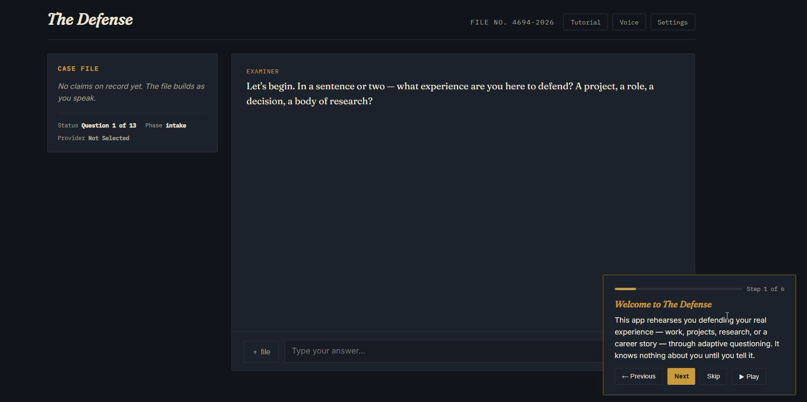
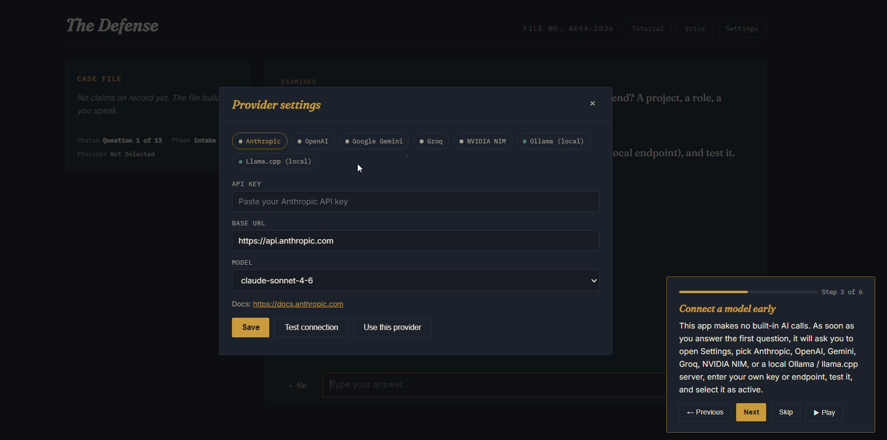
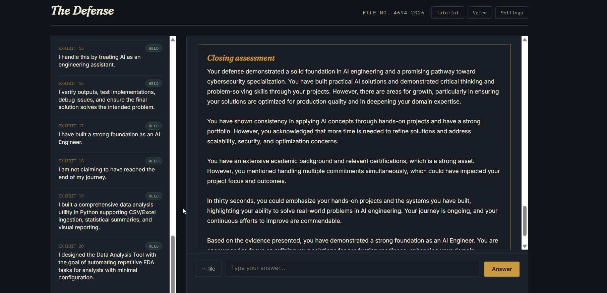

# Day 50 — The Defense

## Overview

A single-file HTML application called "The Defense" — a dark, courtroom-styled interview simulator that puts a person's real experience (a project, a role, a body of research, a career decision) on trial. Instead of a generic "tell me about yourself" prompt, the app runs a fixed thirteen-question cross-examination across five phases (intake → evidence → technical → judgment → weakness → scenario → closing → proof), quietly extracting concrete, gradable claims from every answer as it's given, and closes with a written verdict from "The Examiner" — an AI persona that names real strengths, calls out the weakest points in the case, and rules like a fair but rigorous panelist.

The product is built around three ideas working together:

1. **A courtroom "case file" ledger** — a sticky sidebar that builds live as the interview progresses. Every answer is silently analyzed in the background and turned into 0–2 "claims" — short, defensible statements the person is making about what they did — each stamped with a status pill: **Held** (specific, confident, evidenced), **Contested** (vague or hedged), or **Open** (asserted but unbacked). The ledger reads like an exhibit list assembling itself in real time.
2. **A bring-your-own-key, multi-provider AI backend** — no server, no bundled API key. A `ProviderAdapter` class hierarchy supports Anthropic, OpenAI, Google Gemini, Groq, NVIDIA NIM, and two local runtimes (Ollama, Llama.cpp), each normalized behind one `chat()` interface. Settings are tabbed by provider, tested with a live "Test connection" call, and persisted to `localStorage`. The interview cannot start until a provider is connected and verified.
3. **Background analysis, fast verdict** — rather than analyzing the whole transcript at the end (slow, and prone to losing earlier detail), every answer is sent to the model the moment it's submitted, using a narrow per-question system prompt that returns strict JSON claims. By the time all thirteen questions are answered, the claims list is already built — so the final verdict call only has to *write*, not *re-derive*, using the cached claims plus the full transcript for reference.

The app also supports resume/notes upload (`.txt`, `.md`, `.pdf`, `.docx` via `pdf.js` and `mammoth.js`) as a thirteenth "proof" question, a guided four-step tutorial with optional Web Speech API narration, and text-to-speech playback of the final verdict.

---

## Prompt Template

The following prompt was used to generate The Defense:

```text
Build "The Defense" — a single-file HTML application (HTML + CSS + Vanilla JavaScript, no frameworks, no backend, no bundled API keys) that puts the user's real experience on trial through a structured cross-examination.

CORE CONCEPT
The user is defending something real — a project, a job, a piece of research, a career decision. An AI examiner asks a fixed sequence of thirteen hard questions across phases (intake, evidence, technical difficulty, judgment, weak points, failure scenario, closing argument, proof), then delivers a written verdict: real strengths named, real weaknesses named, brief encouragement.

INTERVIEW REQUIREMENTS
- Thirteen fixed questions grouped into phases: intake, evidence, technical, judgment, weakness, scenario, closing, proof.
- Some questions are open text, some are multiple-choice with an "Other" free-text fallback.
- Every answer, the instant it's submitted, is silently analyzed by the AI in the background: extract 0-2 concrete claims from that single answer, each with a status of held / weak / open. Cache results so the interview keeps moving without waiting on the AI.
- A live sidebar "Case file" ledger renders each extracted claim as a numbered exhibit with a colored status pill (Held = teal, Contested = red-ish, Open = brass/gold), plus a "Reviewing your last answer" indicator while analysis is in flight.
- The last question invites the user to upload supporting proof (resume, project write-up, notes) via .txt/.md/.pdf/.docx; parse PDFs with pdf.js and DOCX with mammoth.js client-side.
- After all thirteen questions, assemble the cached claims plus full transcript and send ONE final request asking the AI to write a 2-4 paragraph closing verdict as "The Examiner" — precise, a little formal, naming strengths and 1-2 specific weak points, ending with encouragement.

PROVIDER / AI BACKEND REQUIREMENTS
- No backend, no bundled key. The user brings their own API key (or local endpoint).
- Support multiple providers behind one adapter interface: Anthropic, OpenAI, Google Gemini, Groq, NVIDIA NIM, Ollama (local, no key), Llama.cpp (local, no key).
- Settings modal: tabbed by provider, fields for API key / base URL / model, "Save", "Test connection", "Use this provider" actions, connection status persisted to localStorage.
- The interview cannot proceed past question one until a provider is connected and tested; if the connection drops mid-interview, pause and prompt to reconnect, then resume exactly where it left off.

ONBOARDING & VOICE
- A dismissible, step-by-step tutorial overlay (progress bar, step navigation) shown on first visit, explaining the concept and how to connect a provider.
- Optional voice narration toggle using the Web Speech API — reads the closing verdict aloud when enabled.

DESIGN REQUIREMENTS
- Dark, courtroom / ledger aesthetic: near-black background, parchment-colored text, brass/gold accents, deep teal and muted red status colors.
- Serif display font for the examiner's questions and verdict (Fraunces), clean sans for the user's own answers (Inter), monospace for case metadata and exhibit IDs (IBM Plex Mono).
- Two-column layout: sticky case-file ledger on the left, transcript + input on the right. Collapses to a single column on narrow screens.
- Status pills, exhibit numbering, a meta row showing progress ("Question X of 13") and current phase.

TECHNOLOGY RESTRICTIONS
- HTML, CSS, Vanilla JavaScript only, plus pdf.js and mammoth.js (via CDN) purely for client-side file parsing.
- No frameworks, no bundler, no backend, no bundled API keys.
- Output: a single index.html file.

CODE QUALITY
- Clean, modular JavaScript organized into a small number of well-named functions and classes.
- No syntax errors, no TODOs, no placeholders, no broken UI.
```

---

## Features

- **Fixed thirteen-question cross-examination across eight phases** — `intake` (what are you defending, how do you categorize it, state your central claim) → `evidence` (your specific contribution, strongest evidence) → `technical` (hardest part, defending impact) → `judgment` (what you'd change, a disagreement you handled) → `weakness` (weakest part of your case) → `scenario` (a failure mode and your response) → `closing` (a thirty-second pitch to a skeptical panel) → `proof` (optional file upload for supporting material). Options-based questions render as clickable buttons with an "Other" free-text fallback; open questions unlock the textarea directly.
- **Live case-file ledger that builds itself** — every answer is sent in the background to a narrow per-question system prompt (`PER_Q_SYSTEM_PROMPT`) that returns strict JSON: 0-2 short claims, each tagged `held`, `weak`, or `open`. Claims render instantly as numbered "EXHIBIT 01, 02…" entries in the sidebar with color-coded status pills, and a "Reviewing your last answer" row with an animated thinking indicator shows while analysis is still in flight — so the interview never blocks on the network, but the evidence trail is visibly assembling.
- **Two-stage AI design for speed** — rather than analyzing the whole transcript at the end, each answer is graded the moment it lands, and results are cached onto `state.claims` and the running `qa` history. When the interview ends, `finalizeCase()` waits on any still-in-flight analyses (`Promise.allSettled`), then sends one final request combining the pre-extracted claims summary and the full transcript to `VERDICT_SYSTEM_PROMPT`, which writes the closing verdict as "The Examiner" — 2-4 paragraphs naming real strengths, 1-2 specific weak points pulled straight from the weak/open claims, and brief encouragement.
- **Bring-your-own-key, seven-provider adapter system** — a `ProviderAdapter` base class with `chat()` and `testConnection()` methods, subclassed for Anthropic, OpenAI (also reused for Groq and NVIDIA NIM via shared OpenAI-compatible request shapes), Google Gemini, Ollama, and Llama.cpp. Each adapter knows its own default model list, default base URL, and docs link; local runtimes (Ollama, Llama.cpp) are marked `noKeyRequired` and skip the API-key field entirely.
- **Provider settings modal with live testing** — tabbed by provider (each tab shows a colored dot for "ready" state), fields for API key / base URL / model dropdown, and three actions: Save, Test connection (fires a real 10-token "Reply with OK" ping with a 15s timeout), and Use this provider. Configuration and last-known status persist to `localStorage` under a versioned key so returning users don't have to reconnect.
- **Hard gate on provider connection** — question one is always shown immediately so the user can start answering right away, but the moment they submit it, `submitAnswer()` checks whether an active, configured provider exists. If not, it locks the flow, opens Settings, and — once a provider connects and passes its test — restarts cleanly from question one so no ungraded answer sneaks through.
- **Mid-interview disconnect recovery** — if a provider's config becomes invalid partway through (e.g., a bad key), the entry is stashed as `pendingAnalysis`, the app prompts to reconnect, and once reconnected the stashed answer is retroactively analyzed before the interview resumes from the next question.
- **Resume/notes upload as the final question** — the thirteenth question invites `.txt`, `.md`, `.pdf`, or `.docx` uploads via a hidden file input. PDFs are parsed page-by-page with `pdf.js` (worker-backed), DOCX files are converted to raw text with `mammoth.js`, and plain text files are read directly; all attached content (truncated to 10,000 characters per file) is folded into the next submitted answer, tagged with removable file chips above the input row.
- **Verdict rendering and read-aloud** — the closing verdict is written into a distinct `.verdict` panel styled like a formal ruling (italic serif heading, formal paragraph copy), and optionally read aloud via the Web Speech API if voice narration is enabled in the topbar.
- **Guided onboarding tutorial** — a dismissible overlay with a progress bar and step navigation, shown automatically on first visit (gated by a `localStorage` flag) and re-triggerable anytime via the topbar "Tutorial" button.
- **Courtroom-ledger visual design** — near-black ink background, parchment text, brass/gold accent for AI turns and highlights, deep teal for "held" claims, muted red for "contested" ones. Fraunces serif italics for the examiner's voice and the verdict heading, Inter for the user's own answers, IBM Plex Mono for case numbers, exhibit IDs, and metadata — reinforcing the sense of an actual case file rather than a chat window.

---

## Screenshots

### Initial Screen


### Selecting a Provider


### Closing Assessment


---

## Technologies Used

- HTML5
- CSS3 (custom properties design system, CSS Grid two-column sticky layout, `prefers-reduced-motion`-friendly animations, responsive breakpoint collapsing the ledger below the transcript on narrow screens)
- Vanilla JavaScript (ES6+ classes for the provider adapter hierarchy, async/await, `Promise.allSettled` for background-analysis synchronization, `localStorage` persistence, Web Speech API for verdict narration, drag-free file input handling)
- pdf.js (client-side PDF text extraction, worker-backed)
- mammoth.js (client-side DOCX-to-text extraction)
- Google Fonts (Fraunces for display/serif voice, Inter for UI and user answers, IBM Plex Mono for metadata and exhibit IDs)
- No backend, no bundled API keys, no frameworks

---

## Key Learnings

### Technical Learnings

- **Analyze as you go, not at the end.** The single biggest architectural decision in this build is firing off a background AI call the instant each answer is submitted, instead of stockpiling the whole transcript for one big analysis pass at the end. This means the expensive part (turning thirteen answers into graded claims) happens in parallel with the user still typing, so by the time they hit the final question, the verdict call only has to *synthesize*, not *re-read and re-derive* — the response feels near-instant even though real reasoning happened throughout.
- **One interface, seven providers.** The `ProviderAdapter` base class defines `chat()` and `testConnection()`, and every concrete provider — Anthropic, OpenAI, Gemini, Groq, NVIDIA NIM, Ollama, Llama.cpp — implements only what differs: request shape, auth header, response parsing. Groq and NVIDIA NIM are just `OpenAIAdapter` subclasses with different default URLs and models, since their APIs are OpenAI-compatible. This is the cleanest way to support "bring your own key, any provider" without the UI or interview logic knowing or caring which one is active.
- **A hard gate beats a soft warning.** Rather than letting the user answer all thirteen questions and then discover there's no AI connected, the app checks configuration state at question one and after every subsequent answer, locking the interview and opening Settings the moment the connection is missing or drops. Combined with a `pendingAnalysis` stash for the answer that triggered the gate, no answer is ever silently lost or left ungraded.
- **Structured JSON extraction needs a narrow prompt.** The per-question system prompt is deliberately scoped to a single question/answer pair, out of context of the rest of the interview, and instructed to return *only* raw JSON with a tight schema (`claims: [{text, status}]`). This narrowness is what makes the background analysis reliable enough to run unattended thirteen times in a row without derailing into prose or losing structure.
- **Client-side file parsing keeps the app zero-infrastructure.** Supporting resume/notes upload without a backend means doing the parsing in the browser: `pdf.js` for PDFs, `mammoth.js` for DOCX, plain `File.text()` for everything else. Truncating each file's extracted text to 10,000 characters keeps prompts bounded even if someone uploads an entire dissertation.

### Conceptual Learnings

- **A ledger is a better progress indicator than a progress bar.** Watching claims accumulate as color-coded exhibits — Held, Contested, Open — gives the user a much richer sense of how their case is shaping up than a generic "7 of 13" counter would. It also does quiet, honest work: seeing three "Open" claims stack up before the verdict even arrives is itself useful feedback.
- **The examiner persona has to be fair to be useful.** The verdict prompt explicitly asks for real strengths *and* 1-2 specific weak points drawn from the weak/open claims, ending in encouragement — not pure flattery, not pure takedown. A defense simulator that only validates teaches nothing; one that only criticizes doesn't get used a second time. The value is in the balance.
- **Bring-your-own-key is a design constraint, not just a cost-saving measure.** Requiring the user to connect their own provider before anything happens shapes the whole flow: question one has to be answerable before any AI call is needed, the settings modal has to be discoverable and testable on demand, and the interview has to survive a mid-session disconnect gracefully rather than assuming the connection is a fixed, reliable given.
- **Multiple providers means designing for the lowest common denominator, deliberately.** Supporting local runtimes (Ollama, Llama.cpp) alongside hosted APIs means the adapter interface can't assume streaming, can't assume a bearer token, and can't assume a fixed model list — it has to normalize down to "give me a system prompt and a user turn, give me text back."

### Personal Reflection

The interesting tension in this build is that "The Defense" is emotionally adversarial by design — it's meant to press on someone's account of their own work — but the engineering underneath it has to be reassuring and forgiving: connection drops are recovered, answers are never lost, the AI grading happens invisibly in the background so the pacing never stutters. The courtroom framing (exhibits, a case file, a ruling) does real work here: it gives the interrogation a container. Being asked "what's the weakest part of your case" by a chat bubble feels like a trick question; being asked the same thing by an Examiner building a case file feels like due process. The provider-adapter layer was the other half of the challenge — building something that works identically whether the model behind it is a frontier hosted API or a 3B local model running on someone's own machine, with no bundled key and no backend to hide behind. That constraint pushed the whole app toward transparency: the user always sees exactly which provider is active, whether it's connected, and what happens if it isn't. A defense simulator whose own AI credentials were opaque would be a strange thing to build.

---

## Project Structure

```
Day50/
├── defense.html
├── day50.md
└── Screenshots/
    ├── intial_screen.png
    ├── selecting_provider.png
    └── closing_assessment.png
```

---

## Final Thoughts

The Defense turns "tell me about a time when…" into a structured, fair cross-examination: thirteen fixed questions across eight phases, a live case-file ledger that grades claims as Held, Contested, or Open the instant each answer lands, and a closing verdict written by an Examiner persona who names real strengths and real weaknesses in equal measure. The two-stage AI design — background per-answer analysis feeding a single fast final verdict call — is the technical core, but the seven-provider, bring-your-own-key adapter system is what makes the whole thing runnable by anyone, on any model, hosted or local, without a backend or a bundled API key. A hard connection gate, mid-interview disconnect recovery, and client-side resume parsing round out an app that takes both the user's case and its own AI dependency seriously. Open the HTML file, connect a provider, and make your case — The Examiner is listening.
