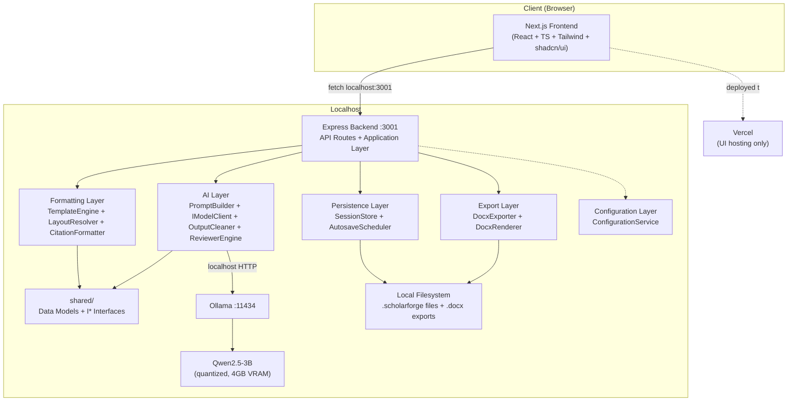
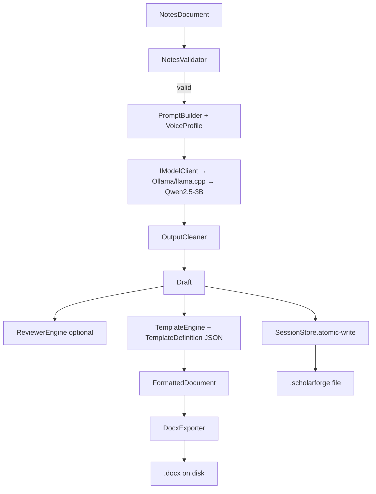
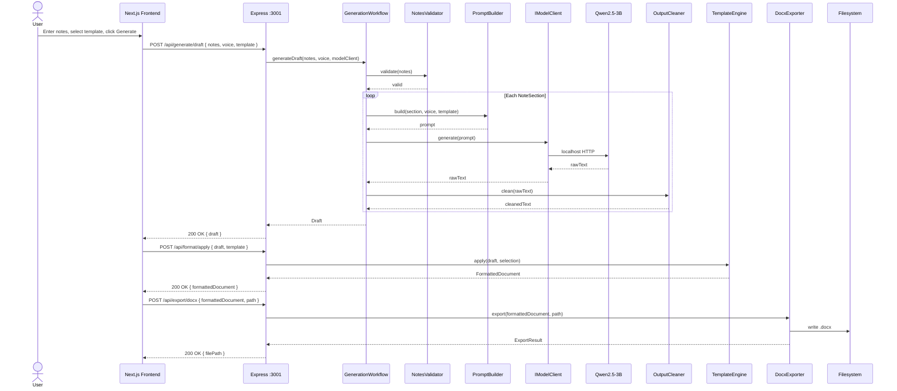

# ScholarForge — Architecture Document (V1.0)

**Source of truth:** ScholarForge V1.0 Product Vision (Approved) + PRD (Draft for Build) + Software Architecture Document (V1.0) + Implementation Blueprint (Days 2–10)
**Author role:** Principal Software Architect
**Status:** Implementation-ready blueprint — gates Day 3 development
**Scope discipline:** This document adds no features, changes no scope, and reinterprets no business decision from the four source documents. It specifies the *how* (technologies, interfaces, request lifecycles, endpoints) so implementation can begin immediately tomorrow.

---

## 1. Executive Summary

ScholarForge V1 is an **offline-first AI Academic Writing Assistant** that converts structured research notes into professionally formatted academic papers. It is intentionally not a Google Docs, Notion, Overleaf, cloud SaaS, collaborative editor, research manager, or document storage platform. Its purpose is exactly six things: accept structured academic input, generate academic content, apply a researcher persona, apply a personalized writing behaviour, enforce deterministic formatting rules, and export a valid DOCX. Nothing more.

The architecture is a **layered offline-first monolith with hard internal module boundaries** — not a distributed system, not microservices, not a client-server split beyond what the browser-to-localhost-backend shape requires. A single-process Express backend running on `localhost:3001` orchestrates every use case; a Next.js frontend (deployable locally for the offline demo or to Vercel for convenience access) renders the UI and calls the backend over HTTP. The local Qwen2.5-3B model runs via Ollama or llama.cpp on `localhost:11434` (or as a local process). No cloud inference. No OpenAI. No Anthropic. No paid APIs anywhere in the stack.

The one architectural decision that matters more than any other, and that every other decision in this document serves, is:

> **The AI Generation Layer and the Deterministic Formatting Layer never share responsibility for the same output.** The LLM only ever produces *language*. Every formatting decision — margins, headings, citation punctuation, page size, DOCX structure — is computed by deterministic code that has no dependency on model output quality, phrasing, or behavior.

This separation is what satisfies NFR-4 (formatting rules deterministic, not subject to LLM output variance), what makes the formatting layer unit-testable without a model loaded, and what makes every V2 extension (LoRA, PDF export, citation manager integration, cloud sync) an additive change behind an existing interface rather than a rearchitecture.

---

## 2. Final Technology Stack

The stack is locked as of this document. No technology may be added, swapped, or removed without an Architecture Decision Record (ADR) and explicit approval.

### 2.1 Frontend

| Technology | Version Target | Purpose | Why This, Not Alternatives |
|---|---|---|---|
| **Next.js** | 14+ (App Router) | Frontend framework, routing, SSR/SSG | Approved by Product Bible. App Router for modern conventions; SSR only used for initial shell — all interactive views are client components. |
| **TypeScript** | 5.x | Type safety across the frontend | Required by Product Bible. Strict mode on. |
| **TailwindCSS** | 3.x | Utility-first styling | Approved by Product Bible. Fast iteration, no CSS architecture to maintain solo. |
| **shadcn/ui** | Latest | Component library (New York style) | Approved by Product Bible. Copy-in components, not a dependency — survives any breaking change upstream. |
| **Lucide React** | Latest | Icons | Standard pairing with shadcn/ui. |
| **TanStack Query** | 5.x | Server-state management (caching, retries for backend calls) | Solo-dev-friendly; handles loading/error states for every fetch without boilerplate. |
| **Zustand** | 4.x | Client-state (current session, UI flags) | Lightweight; avoids Redux ceremony for a single-user app. |

### 2.2 Backend

| Technology | Version Target | Purpose | Why This, Not Alternatives |
|---|---|---|---|
| **Node.js** | 20 LTS | JavaScript runtime | Required by Product Bible (Node.js + Express). LTS for stability. |
| **Express** | 4.x | HTTP server, REST API | Required by Product Bible. Minimal, well-understood, no magic. |
| **TypeScript** | 5.x | Type safety across the backend | Shared types with frontend via a `shared/` package or path mapping. |
| **zod** | 3.x | Runtime validation (request bodies, config files, schemas) | TypeScript-native, single source of truth for types + validation. |
| **node-fetch** / native `fetch` | Native (Node 20) | HTTP client for Ollama localhost calls | No extra dependency. |
| **tsx** (or `ts-node`) | Latest | Run TypeScript directly in dev | Avoids a build step in development. |
| **cors** | Latest | Permissive CORS for Vercel origin | Required only if frontend is hosted on Vercel and backend on localhost. |

### 2.3 AI

| Technology | Version Target | Purpose | Why This, Not Alternatives |
|---|---|---|---|
| **Qwen2.5-3B Instruct** | Quantized (Q4_K_M target) | Local language model | Required by Product Bible. 3B fits 4GB VRAM at Q4_K_M with usable context window. NOT fine-tuned in V1. |
| **Ollama** | Latest | Local model runtime (primary backend) | localhost:11434 HTTP API. Easiest setup. |
| **llama.cpp** | Latest | Local model runtime (alternative backend) | Fallback if Ollama proves problematic; selected via config, not code change. |

### 2.4 Export

| Technology | Version Target | Purpose | Why This, Not Alternatives |
|---|---|---|---|
| **docx** (npm, by dolanmiu) | Latest | DOCX generation | Pure JS, no native deps, runs fully offline, no paid license. Produces valid OOXML. |
| **file-saver** | (browser-side, optional) | Trigger download of exported DOCX | Only used if frontend initiates the download; backend can also write directly to disk. |

### 2.5 Persistence

| Technology | Version Target | Purpose | Why This, Not Alternatives |
|---|---|---|---|
| **Node.js `fs`** | Native | Atomic file writes for `.scholarforge` session files | No database. ADR-006 explicitly rejected SQLite for V1. Single-user, single-project-at-a-time doesn't need query capability — only serialize/deserialize. |
| **JSON** | — | Serialization format for sessions, templates, config | Human-readable, schema-validatable, no binary format overhead. |

### 2.6 Testing

| Technology | Version Target | Purpose |
|---|---|---|
| **Vitest** | Latest | Unit + integration test runner (TypeScript-native, faster than Jest) |
| **@testing-library/react** | Latest | Component testing for Next.js views |
| **MSW** (Mock Service Worker) | Latest | Mock Express endpoints in frontend tests |
| **Playwright** (optional, Day 10) | Latest | End-to-end cold-start demo rehearsal |

### 2.7 Tooling

| Technology | Purpose |
|---|---|
| **ESLint + Prettier** | Code quality, formatting |
| **Husky + lint-staged** (optional) | Pre-commit hooks |
| **pnpm** (or npm) | Package management — pnpm preferred for workspace support (shared/ package) |

### 2.8 Deployment

| Target | Purpose | Notes |
|---|---|---|
| **Local (primary)** | Next.js dev server `localhost:3000` + Express `localhost:3001` + Ollama `localhost:11434` | This is the demo-ready, fully-offline mode that satisfies NFR-1. |
| **Vercel (secondary)** | Next.js bundle hosted on Vercel for convenience access | Browser still calls the user's local Express backend. CORS configured to allow the Vercel origin. User must have backend running locally. Not the primary demo mode. |

**Why two modes, not one:** The Product Bible specifies "Frontend deployed on Vercel, Backend running locally." Modern browsers permit HTTPS→localhost fetch (Chrome/Firefox/Safari treat `localhost` as a secure-context exception), so this works without HTTPS-certificate workarounds. The local-only mode exists as the primary because it's the only mode that fully satisfies NFR-1 (no internet connection required) — Vercel mode requires internet to load the UI bundle, even though inference stays local.

---

## 3. Component Diagram

The system is organized into seven layers (Presentation, Application, AI, Formatting, Persistence, Export, Configuration), communicating through narrow interfaces (`I*`) and plain data objects (NotesDocument, Draft, FormattedDocument) rather than shared mutable state.

*Full Mermaid source: [`diagrams/component-diagram.mmd`](./diagrams/component-diagram.mmd)*

### 3.1 Layer Responsibilities

| Layer | Owns | Never Does |
|---|---|---|
| **Presentation** (Next.js) | Rendering UI, capturing input, displaying draft/feedback | Business logic, formatting math, direct model calls, direct file I/O |
| **Application** (Express + workflows) | Orchestrating use cases (generate, review, save, export), validating inputs, wiring dependencies | Knowing how AI or formatting layers work internally |
| **AI Layer** | Prompting, model invocation, response cleaning, voice-profile injection, Reviewer Mode generation | Deciding margins, headings, citation punctuation, file formats |
| **Formatting Layer** | Template rules per standard/edition, deterministic layout decisions, citation structure | Generating prose, calling the model, touching the filesystem |
| **Persistence Layer** | Session serialization, autosave, load/recovery | Formatting decisions, AI calls |
| **Export Layer** | Assembling the final DOCX from formatted+generated content | Deciding what content or formatting should be — only renders what it's given |
| **Configuration Layer** | All tunables: model settings, voice profile, template registry, storage paths | Any runtime business logic |

This is a classic **Ports & Adapters (Hexagonal) shape** applied pragmatically: the Application Layer defines interfaces (ports); AI, Formatting, Persistence, and Export are adapters behind those interfaces. This is what makes "swap Ollama for llama.cpp" or "add PDF export in V2" additive rather than invasive.

---

## 4. Data Flow

The full pipeline, end to end: structured notes flow through validation into a section-by-section prompt/generate/clean loop to produce a `Draft`. The `Draft` is handed to a single, generic `TemplateEngine` that resolves layout and citation rules from JSON data files (never from LLM output) producing a `FormattedDocument`. That structural tree is rendered to a real `.docx` by a `DocxExporter` with no knowledge of model behavior. In parallel, `SessionStore` continuously autosaves the full working state, and `ReviewerEngine` can run against any completed `Draft` to produce content-specific feedback.

*Full Mermaid source: [`diagrams/data-flow.mmd`](./diagrams/data-flow.mmd)*

### 4.1 Step-by-Step

1. **Notes → Validation:** `NotesValidator` checks structural completeness (sections present, no empty required fields) *before* any model call — avoids wasting GPU cycles on invalid input (NFR-5).
2. **Validation → Prompt Builder:** Only validated notes reach the AI layer. `PromptBuilder` composes one prompt per section (not one giant prompt for the whole paper) — keeps context small enough for 4GB VRAM (NFR-2) and allows per-section regeneration.
3. **Prompt Builder → Local AI:** `IModelClient` sends the prompt to the configured backend (Ollama or llama.cpp) and returns raw text. This is the *only* point where the LLM has any influence, scoped strictly to prose content.
4. **Local AI → Output Cleaner:** Raw model output is never passed downstream unmodified. Cleaning happens once, in one place.
5. **Output Cleaner → Draft:** A `Draft` is assembled — ordered `DraftSection[]`, each linked back to its source `NoteSection` for traceability.
6. **Draft → Reviewer Engine (optional):** Runs against the completed `Draft`, not raw model output, producing feedback tied to actual section content.
7. **Draft → Template Engine:** `TemplateEngine` receives the `Draft` and the user's `TemplateSelection`, produces a `FormattedDocument`. 100% deterministic, fully unit-testable in isolation (NFR-4).
8. **FormattedDocument → DOCX Export:** `DocxExporter` renders the structural tree into a real `.docx` — margins, fonts, headings, references, captions all driven by `FormattedDocument`'s `StyleSheet`, never by LLM text.
9. **Session Save (parallel, continuous):** At every meaningful state transition, `AutosaveScheduler` persists state via `SessionStore` so any point in the flow can be reloaded (FR-6/FR-7).

---

## 5. Request Lifecycle

The full lifecycle of a "Generate Draft → Format → Export" request, from browser click to DOCX file on disk:

*Full Mermaid source: [`diagrams/request-lifecycle.mmd`](./diagrams/request-lifecycle.mmd)*

### 5.1 Lifecycle Notes

- **No state on the backend between requests.** The Express backend is stateless from the HTTP perspective — all state lives in the frontend (Zustand store) and is persisted to the `.scholarforge` file via the `/api/session/save` endpoint. Each API call receives the full input it needs (Draft, FormattedDocument, etc.) in the request body. This keeps the backend simple and crash-resilient: a backend restart doesn't lose user work because the frontend holds the source of truth and re-persists on next autosave.
- **Section-by-section generation is visible to the user.** The `/api/generate/draft` endpoint optionally supports Server-Sent Events (SSE) or a polling pattern so the frontend can show progress as each section completes. See API.md §3.2 for the streaming variant.
- **Autosave is frontend-triggered.** The frontend's Zustand store has a subscriber that calls `POST /api/session/save` on a debounce after any state change. The backend's `SessionStore.save()` does the atomic write. This keeps the backend stateless while still providing crash-safe persistence.

---

## 6. AI Interaction

### 6.1 The Writing Intelligence Engine

The Writing Intelligence Engine is the heart of ScholarForge. It is **not** the model — the model is one component inside it. The engine performs intelligence operations **before** the model is called (prompt composition, voice injection, academic rule application, context budgeting) and **after** the model responds (artifact stripping, truncation repair, validation, retry logic).

```mermaid
flowchart LR
    subgraph PRE["Pre-Generation Intelligence"]
        PB1[PromptBuilder]
        PB2[Load section template]
        PB3[Inject note content]
        PB4[Inject VoiceProfile]
        PB5[Apply academic rules]
        PB6[Enforce context budget]
    end
    MODEL[Qwen2.5-3B via IModelClient]
    subgraph POST["Post-Generation Intelligence"]
        OC1[OutputCleaner]
        OC2[Strip artifacts]
        OC3[Repair truncation]
        OC4[Normalize whitespace]
        OC5[Validate non-empty + min-length]
    end
    PRE --> MODEL --> POST
```

*Full Mermaid source: [`diagrams/ai-pipeline.mmd`](./diagrams/ai-pipeline.mmd)*

### 6.2 Engine Capability Map

| Capability | Where it lives | How it works |
|---|---|---|
| Sentence restructuring | `PromptBuilder` + `OutputCleaner` | Prompt instructs model to restructure; cleaner drops incomplete trailing sentences at truncation boundaries |
| Academic vocabulary enhancement | `VoiceProfile` + section templates | Voice profile's `formality` and `exemplarSnippets` inject vocabulary expectations at prompt start |
| Passive ↔ active transformation | `VoiceProfile.personPreference` | Voice config instructs model on voice preference; not enforced post-hoc (would require a second model call) |
| Coherence improvement | Section-by-section generation | Each section gets a focused, self-contained prompt rather than a degraded long-context mega-prompt |
| Transition improvement | Section prompt templates | Templates include transition-language instructions per section type |
| Paragraph refinement | `OutputCleaner` whitespace normalization + min-length validation | Cleaner enforces paragraph structure; rejects degenerate single-line output |
| Logical flow | Section ordering preserved end-to-end | `NotesDocument.sections` order → `Draft.sections` order → `FormattedDocument.sections` order |
| Academic tone | `VoiceProfile.formality` + section templates | Tone is a prompt-engineering concern, not a post-processing step |
| Repetition reduction | `OutputCleaner` boilerplate stripping | Detects and strips repeated preambles/refusals |
| Human-like sentence variation | `VoiceProfile.sentenceLengthTendency` + `exemplarSnippets` | Exemplars show the model what variation looks like; more effective than abstract instructions |
| Readability optimization | Section template instructions | Templates include readability guidance per section type |
| Research writing behaviour | `VoiceProfile` holistically | The voice profile IS the writing behaviour — captured as configurable data, not hardcoded logic |
| Introduction improvement | Introduction-specific section template | Data file (`Introduction.json`), tunable without code change |
| Conclusion improvement | Conclusion-specific section template | Data file (`Conclusion.json`), tunable without code change |
| Consistency checking | `ReviewerEngine` (separate pipeline) | Reviewer Mode runs on the completed Draft, not during generation |

### 6.3 Model Configuration

`model.config.json` holds: backend selection (`ollama` | `llamacpp`), model name/path, quantization level, context window size, temperature/top-p, and hard timeout values — all tuned empirically against the 4GB GPU target on Day 3 of the build.

### 6.4 Voice Profile

A configuration object capturing stylistic parameters — `formality`, `sentenceLengthTendency`, `personPreference`, `hedgingLevel`, `exemplarSnippets[]`. Injected into every prompt as instruction + optional few-shot exemplar text. Because voice preservation is inherently approximate (per both source documents' risk sections), the architecture treats it purely as a prompt-engineering concern — there is no separate "voice validation" component pretending to objectively verify style match.

### 6.5 Reviewer Mode

A separate `ReviewerEngine` with its own prompt template family, operating on the assembled `Draft` (post-cleaning) rather than notes. This separation exists because reviewer prompts need different instructions (critique framing) than generation prompts (production framing), and conflating them in one prompt builder would create fragile conditional logic.

### 6.6 Section-by-Section Generation

The AI layer generates one paper section at a time rather than one prompt for the entire paper. This keeps prompt/context size within what a 3B model on 4GB VRAM can handle reliably (NFR-2, NFR-5) and allows partial-failure recovery (one bad section doesn't require regenerating the whole draft). See ADR-005.

### 6.7 Error Recovery

If `IModelClient.generate()` throws (model not loaded, OOM, timeout), `GenerationWorkflow` catches it, surfaces a clear, actionable error to the Presentation layer, and never lets a failure corrupt the `Draft` already accumulated for prior sections — partial drafts remain usable.

---

## 7. External Services

ScholarForge V1 has exactly one external dependency: the local AI runtime (Ollama or llama.cpp). Everything else is local computation or local filesystem.

| Service | Location | Purpose | Network Egress? |
|---|---|---|---|
| **Ollama daemon** | `localhost:11434` | Local model runtime (HTTP API) | No — localhost only |
| **llama.cpp** | Local process (IPC or subprocess) | Alternative local model runtime | No — local only |
| **Qwen2.5-3B model weights** | Local disk | The model itself | No — downloaded once during setup, never re-fetched |
| **Vercel** (secondary deployment only) | Cloud | Static + SSR hosting for Next.js bundle | Yes — but only to serve the UI bundle; no inference, no user data |

**Privacy guarantee (architectural, not just promised):** Because the AI Layer's only external dependency is a local model runtime, and every other layer is pure local computation, "no user data leaves the machine" is a structural property of this design, not a policy statement layered on top of a system that could technically phone home. The only component that touches a network socket at all (`OllamaClient`) communicates exclusively with `localhost` — never an external host.

---

## 8. Design Decisions

Every decision below is an ADR from the source Architecture Document, restated here for self-containment. The full ADR text lives in `docs/adr/` in the implementation repository.

### ADR-001: Separate Deterministic Formatting from AI Generation
**Decision:** Formatting logic and DOCX/template rendering are 100% deterministic code with no LLM involvement; the LLM only ever produces prose content.
**Reason:** NFR-4 explicitly requires formatting to be independent of LLM variance; this is also the only way to make the formatting layer unit-testable without a model loaded.
**Alternative considered:** Ask the LLM to directly output formatted text (e.g., "write this in APA format"). Rejected — formatting compliance would then depend on model reliability, which both source documents identify as an inherent risk of a small 3B model.

### ADR-002: Data-Driven Template Definitions Instead of Per-Standard Classes
**Decision:** Each citation standard/edition is a JSON data file conforming to a shared schema, not a subclass of a template base class.
**Reason:** Avoids duplicated renderer code across six standard/edition combinations; makes adding a new standard a data change, not a code change.
**Alternative considered:** Class-per-standard (`IEEETemplate extends BaseTemplate`). Rejected — leads to duplicated layout logic across subclasses.

### ADR-003: `IModelClient` Abstraction over Ollama/llama.cpp
**Decision:** Both backends implement one interface; backend choice is a config value.
**Reason:** PRD explicitly allows either backend; hard-coding one would contradict the "modular, extensible" mandate and make backend switching require code changes instead of config changes.
**Alternative considered:** Pick one backend and hardcode it. Rejected — removes flexibility needed to empirically tune for the 4GB GPU constraint.

### ADR-004: Single-Process Monolith, Not Distributed Services
**Decision:** ScholarForge is one local Express backend process (with the local model runtime as a separate but co-located process), not a microservice architecture.
**Reason:** Single-user, single-session, fully offline requirement makes distributed architecture pure overhead with no benefit.
**Alternative considered:** Split UI and backend into separately-deployed services. Rejected — adds deployment complexity a solo 10-day build cannot afford.

### ADR-005: Section-by-Section Generation Instead of Whole-Document Generation
**Decision:** The AI layer generates one paper section at a time rather than one prompt for the entire paper.
**Reason:** Keeps prompt/context size within what a 3B model on 4GB VRAM can handle reliably (NFR-2, NFR-5); also allows partial-failure recovery.
**Alternative considered:** Single mega-prompt for the whole document. Rejected — high risk of exceeding context limits or producing degraded quality in later sections.

### ADR-006: Session State as a Single Local Project File (No Database)
**Decision:** All session state persists to one versioned local `.scholarforge` file per project.
**Reason:** Matches the explicit V1 assumption of single-session, single-user, local-only workflow; avoids the complexity of a database for a single-file-per-project use case.
**Alternative considered:** A local embedded database (SQLite). Rejected for V1 as unnecessary complexity — a single-user, single-project-at-a-time tool doesn't need query capability, only serialize/deserialize.

### ADR-007: Frontend on Vercel, Backend on Localhost (Two-Mode Deployment)
**Decision:** Support both local-only (primary) and Vercel-hosted-UI (secondary) deployment modes.
**Reason:** Product Bible specifies Vercel for the frontend, but NFR-1 requires full offline operation. The local-only mode satisfies NFR-1 for the demo; the Vercel mode provides convenient access when online. Browsers permit HTTPS→localhost fetch, so no certificate workarounds are needed.
**Alternative considered:** Vercel-only. Rejected — would violate NFR-1 (no internet required) for the primary demo path. Local-only was also considered and rejected as too restrictive for the "convenient access" use case.

### ADR-008: Stateless Express Backend
**Decision:** The Express backend holds no session state between HTTP requests. Each API call receives its full input in the request body; the frontend holds the source of truth and triggers persistence via `/api/session/save`.
**Reason:** A stateless backend is crash-resilient (restart loses nothing — frontend re-persists on next autosave), horizontally scalable if ever needed, and trivially testable (no state setup/teardown in tests).
**Alternative considered:** Backend-held session state with session IDs. Rejected — adds session management complexity (timeouts, cleanup, memory pressure) with no benefit for a single-user local app.

---

## 9. V2 Readiness (Without Touching V1 Code)

Every item in the Product Vision's V2.0 roadmap maps to an interface that already exists in V1, because the architecture was built around ports-and-adapters from day one:

| V2.0 Vision item | How it slots in |
|---|---|
| LoRA personalization | New `IModelClient` implementation or a config flag pointing at a LoRA-adapted model file |
| Fine-tuned academic model | Same seam — swap `model.config.json`'s model path |
| Citation manager integration | New `INotesSource` adapter feeding `NotesDocument.sourceRefs` |
| Research paper library | New Persistence-layer feature (multi-project index) — additive |
| PDF export | New `IExporter` implementation alongside `DocxExporter` |
| Semantic search | New capability inside NotesModule/Application layer |
| Journal templates | New `TemplateDefinition` data files — zero engine changes |
| Multi-language support | New `VoiceProfile`/`PromptTemplate` variants — additive data |
| Cloud synchronization | New `ISessionStore` implementation alongside the local one |
| Plugin architecture | Falls naturally out of the existing registry-driven backend/template/exporter pattern |

**The unifying reason none of this requires touching V1 code:** every extension point in V2's vision maps to an interface (`I*`) that already exists in V1.

---

## 10. Final Technical Summary

ScholarForge V1 is a single-process, offline, layered application built around one non-negotiable seam: **AI generates language; deterministic code generates formatting.** Everything else in this architecture exists to make that seam clean and everything around it swappable.

Concretely: notes flow through validation into a section-by-section prompt/generate/clean loop (`AI Layer`, behind `IModelClient`, backed by Ollama or llama.cpp running Qwen2.5-3B) to produce a `Draft`. The `Draft` is handed to a single, generic `TemplateEngine` that resolves layout and citation rules from data files (`TemplateDefinition` JSON, one per standard/edition) — never from LLM output — producing a `FormattedDocument`. That structural tree is rendered to a real `.docx` by a `DocxExporter` that has no knowledge of, or dependency on, model behavior. In parallel, `SessionStore` continuously autosaves the full working state to a single local project file, and `ReviewerEngine` can run against any completed `Draft` to produce content-specific feedback.

The single sentence a senior engineer picking this up should remember:

> **If a piece of logic decides what the document says, it lives in the AI layer behind `IModelClient`; if it decides what the document looks like, it lives in the Formatting or Export layer and never touches the model.**

---

## 11. References

| Document | Location |
|---|---|
| ScholarForge V1.0 Product Vision (Approved) | `docs/product_vision.md` |
| ScholarForge PRD (Draft for Build) | `docs/prd.md` |
| ScholarForge Software Architecture Document (V1.0) | `docs/architecture.md` |
| ScholarForge Engineering Implementation Blueprint (Days 2–10) | `docs/implementation_blueprint.md` |
| This document | `Day52/ARCHITECTURE.md` |
| Component diagram | `Day52/diagrams/component-diagram.mmd` |
| Data flow diagram | `Day52/diagrams/data-flow.mmd` |
| Request lifecycle diagram | `Day52/diagrams/request-lifecycle.mmd` |
| AI pipeline diagram | `Day52/diagrams/ai-pipeline.mmd` |
| User flow diagram | `Day52/diagrams/user-flow.mmd` |
| API specification | `Day52/API.md` |
| Storage architecture | `Day52/SCHEMA.md` |
| Project structure | `Day52/PROJECT-STRUCTURE.md` |
| UI wireframes | `Day52/UI-WIREFRAMES.md` |
| Updated implementation blueprint | `Day52/IMPLEMENTATION-BLUEPRINT.md` |
| Day 3 readiness review | `Day52/day52.md` |
