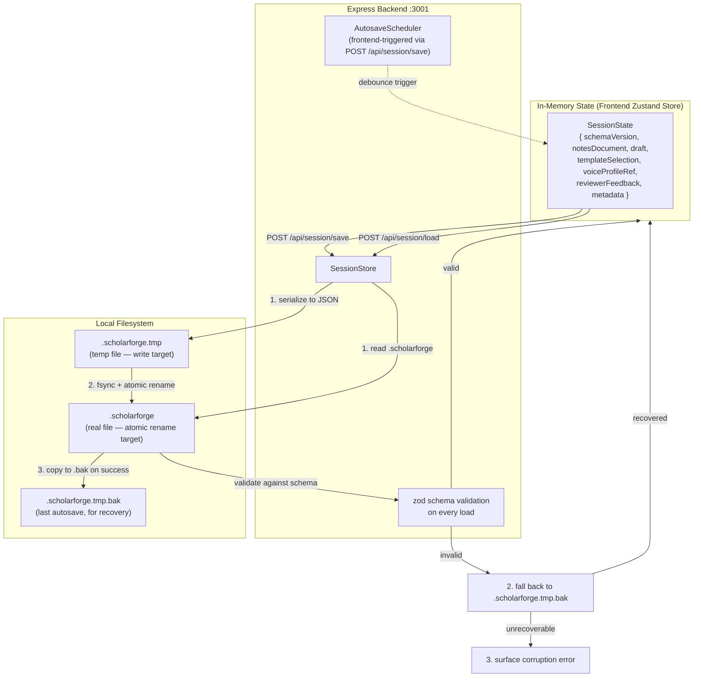

# ScholarForge — Storage Architecture (V1.0)

**Source of truth:** ScholarForge V1.0 Product Vision + PRD + Software Architecture Document (ADR-006) + Implementation Blueprint
**Author role:** Principal Software Architect
**Status:** Implementation-ready storage design — gates Day 3 development
**Scope discipline:** No database introduced unless justified. ADR-006 explicitly rejected SQLite for V1. This document explains why and defines what exists instead.

---

## 1. Executive Decision: No Database in V1

ScholarForge V1 has **no SQL database** and **no embedded database** (no SQLite, no LevelDB, no IndexedDB-as-primary-store). All persistence is **file-based**: a single `.scholarforge` project file per project, stored on the local filesystem, written atomically.

This is a deliberate, justified decision — not a deferral.

### 1.1 Why No Database

| Question | Answer |
|---|---|
| Is there multi-user access? | No. PRD §13 explicitly assumes single-session, single-user, local-only. |
| Is there multi-project concurrent access? | No. One project open at a time. |
| Is there a need for query capability (filter, sort, aggregate)? | No. The UI loads the entire project into memory; all "queries" are in-memory array operations on already-deserialized objects. |
| Is there a need for transactional multi-row writes? | No. Each save is a single atomic file write — one object serialized to one file. |
| Is there a need for indexed lookup? | No. The project file is small (KB to low-MB range — text content, no binary assets in V1). Full deserialization is instant. |
| Is there a need for relational integrity? | No. The data model is a single aggregate (SessionState) containing nested objects — referential integrity is enforced by TypeScript types and zod validation, not by foreign keys. |
| Is there a need for historical versioning? | No. Draft versioning is explicitly out of scope for V1 (PRD §13, Blueprint Day 7). The schema is versioned (`schemaVersion` field) for future migration, but no version history is stored in V1. |

**Conclusion:** A database would add complexity (schema migrations, connection management, query layer, backup strategy) with zero corresponding benefit for V1's use case. ADR-006 correctly rejected SQLite. This decision will be revisited only if V2's "research paper library" (multi-project index) becomes a hard requirement — and even then, the schema-versioned file format is designed to make that migration additive, not a rewrite.

### 1.2 What Exists Instead

A **single `.scholarforge` project file** per project, containing the full serializable application state. The file is:

- **JSON** (human-readable, schema-validatable, no binary format overhead in V1)
- **Schema-versioned** (`schemaVersion` field from day one, for future migration safety)
- **Atomically written** (temp-file-then-rename pattern — never write directly over the existing good file)
- **Autosaved** on a debounce timer after every meaningful state change
- **Recoverable** on corruption (fall back to last autosave temp file before surfacing an error)

---

## 2. Storage Architecture



### 2.1 Storage Locations

| Artifact | Default Path | Configurable? |
|---|---|---|
| Project files (`.scholarforge`) | User-chosen directory (file picker on Save As) | Yes — user picks path on first save |
| Autosave temp files | Same directory as the project file, hidden prefix (`.<filename>.tmp`) | No — always co-located with the project file |
| Exported DOCX files | User-chosen directory (file picker on Export) | Yes |
| Global config (`model.config.json`, etc.) | `~/.scholarforge/config/` (OS-appropriate user config dir) | Yes — via `SCHOLARFORGE_CONFIG_DIR` env var |
| Template definition files | Bundled with the app at `formatting/templates/` | No — shipped with the app, not user-editable |
| Voice profile files | `~/.scholarforge/voice_profiles/` (user-created overrides) + bundled defaults | Yes — user can create custom profiles |

### 2.2 Write Pattern (Atomic)

Every save — whether manual or autosave — follows the same atomic-write pattern:

```
1. Serialize SessionState to JSON string
2. Write JSON string to <projectfile>.tmp
3. fsync(<projectfile>.tmp)  // ensure data is on disk, not just in OS cache
4. rename(<projectfile>.tmp, <projectfile>)  // atomic on POSIX filesystems
5. Copy old <projectfile> to <projectfile>.tmp.bak (for recovery)
6. Update in-memory "last save timestamp"
```

**Why this pattern:**
- Steps 1–3 write to a temp file, so a crash mid-write never corrupts the last-known-good project file.
- Step 4 is atomic on POSIX filesystems — the rename either fully succeeds or fully fails, never leaves a half-written file.
- Step 5 maintains a one-deep backup for corruption recovery (covers the edge case where the real file itself is corrupted by external causes — disk error, manual edit, etc.).

---

## 3. Data Models (The "Schema")

The "schema" for ScholarForge V1 is the TypeScript type definitions of the shared data models, validated at runtime by zod schemas. These are the contracts every layer consumes — changes to these models are expensive and should be treated as breaking changes requiring a `schemaVersion` bump.

### 3.1 Core Data Models

#### `NotesDocument` (input — owned by NotesModule)

```typescript
interface NotesDocument {
  sections: NoteSection[];
}

interface NoteSection {
  id: string;                    // UUID, stable across edits
  heading: string;               // Non-empty after validation
  bullets: string[];             // At least 1 after validation
  sourceRefs: SourceRef[];       // Optional — may be empty
  sectionType: SectionType;      // "introduction" | "literature_review" | "methodology" | "results" | "discussion" | "conclusion" | "custom"
}

interface SourceRef {
  id: string;                    // UUID
  author: string;                // "Smith, J."
  year: string;                  // "2023"
  title: string;                 // Paper title
  source: string;                // Journal/conference/URL
}

type SectionType = "introduction" | "literature_review" | "methodology" | "results" | "discussion" | "conclusion" | "custom";
```

**Validation rules (NotesValidator):**
- `sections` array must have at least 1 element
- Each section's `heading` must be non-empty after trim
- Each section's `bullets` array must have at least 1 element
- `sourceRefs` is optional (may be empty array)
- `sectionType` must be one of the enum values
- Section `id`s must be unique within the document

#### `Draft` (AI output — owned by AI Layer)

```typescript
interface Draft {
  sections: DraftSection[];
  failedSectionIds: string[];    // Sections that failed generation (partial-failure tolerance)
  generatedAt: string;           // ISO 8601 timestamp
  modelConfig: ModelConfigSnapshot;  // What model/settings produced this draft
}

interface DraftSection {
  id: string;                    // UUID (new per generation, not inherited from NoteSection)
  sourceSectionId: string;       // FK to NoteSection.id — traceability
  heading: string;               // Inherited from source NoteSection
  content: string;               // Cleaned prose (post-OutputCleaner)
  generationMetadata: {
    promptTokensEstimate: number;
    responseTimeMs: number;
    retries: number;             // 0 = first attempt succeeded
  };
}

interface ModelConfigSnapshot {
  backend: "ollama" | "llamacpp";
  modelName: string;
  quantization: string;
  temperature: number;
  topP: number;
}
```

#### `FormattedDocument` (Formatting Layer output — owned by TemplateEngine)

```typescript
interface FormattedDocument {
  sections: FormattedSection[];
  styleSheet: StyleSheet;
  references: FormattedReference[];
  templateSelection: TemplateSelection;
}

interface FormattedSection {
  sourceDraftSectionId: string;  // FK to DraftSection.id
  heading: string;
  headingLevel: 1 | 2 | 3;       // Resolved from template + sectionType
  content: string;               // Cleaned prose, unchanged from Draft
  contentBlocks?: ContentBlock[]; // Optional: tables, images, captions
}

interface StyleSheet {
  pageSize: "US Letter" | "A4";
  margins: { top: string; bottom: string; left: string; right: string };  // e.g., "1in"
  font: { family: string; size: number };
  spacing: { line: "single" | "1.5" | "double"; paragraphIndent: string };
  headings: { level: number; style: string }[];
}

interface FormattedReference {
  number?: number;               // Present for numeric citation styles (IEEE)
  inTextCitation: string;        // e.g., "[1]" or "(Smith, 2023)"
  referenceListEntry: string;    // Formatted per template's referenceEntryFormat
  sourceRefId: string;           // FK to SourceRef.id
}

interface TemplateSelection {
  standard: "IEEE" | "APA" | "MLA" | "Chicago";
  edition: string;               // e.g., "7" for APA 7th
  pageSize: "US Letter" | "A4";  // Only where applicable (IEEE)
}
```

#### `ReviewerFeedback` (Reviewer output — owned by ReviewerEngine)

```typescript
interface ReviewerFeedback {
  sectionId: string;             // FK to DraftSection.id
  issue: string;                 // Specific, content-referenced
  suggestion: string;            // Actionable improvement
  severity: "low" | "medium" | "high";
  category: "clarity" | "argument" | "evidence" | "style" | "structure";
}

interface ReviewResult {
  feedback: ReviewerFeedback[];
  reviewedAt: string;            // ISO 8601
  reviewedDraftId: string;       // FK to Draft (traceability)
}
```

### 3.2 Configuration Models

#### `SessionState` (the serializable aggregate — this IS the .scholarforge file content)

```typescript
interface SessionState {
  schemaVersion: 1;              // Bump on breaking schema changes
  metadata: {
    projectName: string;
    createdAt: string;           // ISO 8601
    lastModified: string;        // ISO 8601
    lastExport?: {
      path: string;
      templateUsed: TemplateSelection;
      exportedAt: string;
    };
    appVersion: string;          // ScholarForge version that wrote this file
  };
  notesDocument: NotesDocument;
  draft: Draft | null;           // null until first generation
  templateSelection: TemplateSelection | null;  // null until user picks
  voiceProfileRef: {             // Reference to voice profile (not embedded)
    profileId: string;           // e.g., "default" or "user_custom_1"
    profileSnapshot: VoiceProfile;  // Copy at save time (reproducibility)
  };
  formattedDocument: FormattedDocument | null;  // Cached, null until formatting applied
  reviewerFeedback: ReviewerFeedback[] | null;  // null until reviewer run
}

interface VoiceProfile {
  profileId: string;
  profileName: string;
  formality: "informal" | "neutral" | "formal" | "very_formal";
  sentenceLengthTendency: "short" | "varied" | "long";
  personPreference: "first_person" | "third_person" | "passive";
  hedgingLevel: "direct" | "moderate" | "hedged";
  exemplarSnippets: string[];    // 1-3 short writing samples in the target voice
}
```

#### `ModelConfig` (global config — not per-project)

```typescript
interface ModelConfig {
  backend: "ollama" | "llamacpp";
  modelName: string;             // e.g., "qwen2.5:3b-instruct-q4_K_M"
  quantization: string;          // e.g., "Q4_K_M"
  contextWindow: number;         // Max tokens — tuned empirically on Day 3
  temperature: number;           // e.g., 0.7
  topP: number;                  // e.g., 0.9
  timeoutMs: number;             // Hard timeout per generation call
  ollamaBaseUrl?: string;        // Default: http://localhost:11434
  llamacppPath?: string;         // Path to llama.cpp binary if backend is llamacpp
}
```

#### `ReviewerConfig`

```typescript
interface ReviewerConfig {
  categories: ReviewerCategory[];  // Which categories to check
  verbosity: "brief" | "normal" | "detailed";
  maxFeedbackPerSection: number;   // Prevent overwhelming output
}

type ReviewerCategory = "clarity" | "argument" | "evidence" | "style" | "structure";
```

### 3.3 Template Definition Schema (Data Files, Not Code)

Each `TemplateDefinition` JSON file conforms to this schema. Validated on load by `ConfigurationService`.

```typescript
interface TemplateDefinition {
  standard: "IEEE" | "APA" | "MLA" | "Chicago";
  edition: string;               // e.g., "7"
  pageSize: "US Letter" | "A4";
  margins: { top: string; bottom: string; left: string; right: string };
  font: { family: string; size: number };
  spacing: { line: "single" | "1.5" | "double"; paragraphIndent: string };
  headings: {
    levels: { level: number; style: string }[];
  };
  citation: {
    inTextStyle: "numeric" | "author-date" | "footnote";
    referenceListTitle: string;          // "References" / "Works Cited" / "Bibliography"
    referenceEntryFormat: string;        // Template string with {author} {year} {title} {source}
  };
  titlePage: {
    required: boolean;
    fields: string[];                    // e.g., ["title", "author", "affiliation"]
  };
  headers?: { runningHead?: string; pageNumberPosition?: "top-right" | "bottom-center" };
}
```

**Example: `ieee_us_letter.json`**

```json
{
  "standard": "IEEE",
  "edition": "1",
  "pageSize": "US Letter",
  "margins": { "top": "0.75in", "bottom": "1in", "left": "0.625in", "right": "0.625in" },
  "font": { "family": "Times New Roman", "size": 10 },
  "spacing": { "line": "single", "paragraphIndent": "0.2in" },
  "headings": {
    "levels": [
      { "level": 1, "style": "centered-smallcaps" },
      { "level": 2, "style": "left-italic" },
      { "level": 3, "style": "left-italic-indented" }
    ]
  },
  "citation": {
    "inTextStyle": "numeric",
    "referenceListTitle": "References",
    "referenceEntryFormat": "[{number}] {author}, \"{title},\" {source}, {year}."
  },
  "titlePage": { "required": false },
  "headers": { "pageNumberPosition": "top-right" }
}
```

### 3.4 Section Prompt Template Schema

```typescript
interface SectionPromptTemplate {
  sectionType: SectionType;
  systemInstruction: string;     // Role/behavior framing
  taskInstruction: string;       // What to produce (with {placeholders})
  voiceInjectionPoint: "start" | "end";  // Where voice profile goes in the prompt
  contextBudgetChars: number;    // Max prompt length for this section type
  minOutputLengthChars: number;  // OutputCleaner's minimum acceptable length
  retryInstructionSuffix: string;  // Appended on retry (e.g., "Write at least 5 sentences.")
}
```

---

## 4. Schema Versioning & Migration

### 4.1 Version Field

Every `.scholarforge` file contains a `schemaVersion` field (currently `1`). On load, `SessionStore` checks this field:

| `schemaVersion` value | Action |
|---|---|
| Matches current app version (1) | Load normally |
| Lower than app version | Future V2 migration path — run migrator function (not needed in V1) |
| Higher than app version | **Refuse to load** with clear error: "This project was created by a newer version of ScholarForge. Please update the app." Never attempt silent best-effort parse. |

### 4.2 Forward Compatibility Strategy

When V2 introduces schema changes (e.g., draft versioning history), the migration approach is:

1. Bump `schemaVersion` to 2
2. Write a `migrate_v1_to_v2(state: SessionState_v1): SessionState_v2` function
3. On load, if `schemaVersion === 1`, run the migrator, then load
4. The migrator is pure (no side effects) and additive (only adds new fields, never removes or renames without providing both)
5. Save always writes the current (highest) version

This means V1 files will always be loadable by V2, V3, etc. — backward compatibility is preserved by design.

---

## 5. Corruption Recovery

### 5.1 Detection

On `SessionStore.load(path)`:

1. Read the file. If read fails (file doesn't exist, permission denied), surface a clear error.
2. Parse as JSON. If parse fails, the file is corrupt — go to recovery.
3. Validate against `session_schema_v1` (zod). If validation fails, the file is structurally invalid — go to recovery.
4. Check `schemaVersion`. If higher than app supports, refuse to load (see §4.1).
5. If all checks pass, deserialize into `SessionState` and return.

### 5.2 Recovery Flow

```
1. Try to load <projectfile>
   ├── Success → return SessionState
   └── Failure (corrupt/invalid) ↓

2. Try to load <projectfile>.tmp.bak (last autosave backup)
   ├── Success → return SessionState with warning: "Recovered from backup — some recent changes may be lost"
   └── Failure (also corrupt) ↓

3. Surface explicit error to user:
   "This project file is corrupt and the backup is also corrupt.
    The file may have been damaged by an external program.
    Original error: {details}"
   Never silently return a partial/garbage state.
```

### 5.3 Testing

- Unit test: deliberately truncate a save file mid-write, verify recovery falls back to `.bak`
- Unit test: corrupt both files, verify explicit error (not silent partial load)
- Integration test (Day 7): kill the app process mid-autosave, verify next launch loads cleanly from the last completed save

---

## 6. What Is NOT Stored

To prevent scope creep, the following are explicitly **not persisted** in V1:

| Data | Why Not Stored |
|---|---|
| Draft version history | Out of scope (PRD §13). Only the latest Draft is stored. |
| Multiple projects in one file | One file = one project. Multi-project library is V2. |
| User accounts / auth | Out of scope (Vision §7). Single-user, local-only. |
| Cloud sync state | Out of scope (Vision §7). V2 `CloudSessionStore` would handle this. |
| Usage analytics / telemetry | Out of scope (Architecture §13). No telemetry in V1. |
| Cached model responses | Not needed — generation is deterministic enough that re-generation is acceptable; caching adds complexity without clear V1 benefit. |
| Binary assets (images embedded in notes) | V1 notes are text-only. If V2 adds image support, the file format upgrades to a ZIP container (still `.scholarforge` extension) with JSON + assets. |

---

## 7. Storage Decisions Summary

| Decision | Rationale | ADR Reference |
|---|---|---|
| No SQL database | Single-user, single-project, no query need — file I/O suffices | ADR-006 |
| No SQLite | Same as above — would add migration/connection overhead with no benefit | ADR-006 |
| JSON format | Human-readable, schema-validatable, no binary overhead in V1 | ADR-006 |
| Atomic writes (temp + rename) | Crash-safety — never corrupt the last good file | Architecture §9 |
| Schema-versioned from day one | Forward-compatible migration path for V2 | Architecture §9 |
| One `.bak` file for recovery | Covers external-corruption edge case without complex version history | Architecture §9 |
| Stateless backend (state in frontend) | Crash-resilient, trivially testable, no session management | ADR-008 |
| Voice profile snapshot in session | Reproducibility — a project sounds the same even if global voice config changes | Architecture §11 |

---

## 8. References

| Document | Section |
|---|---|
| Software Architecture Document | §9 (Session Architecture), §11 (Configuration), ADR-006 |
| PRD | §13 (Assumptions — single-session, single-user, local-only) |
| Product Vision | §7 (V1 Exclusions — no collaboration, no cloud sync) |
| Implementation Blueprint | Day 7 (Session persistence — full build plan) |
| This document | `Day52/SCHEMA.md` |
| ARCHITECTURE.md | §2.5 (Persistence technology), §8 (ADR-006, ADR-008) |
| API.md | §6 (Session endpoints — save/load/autosave) |
