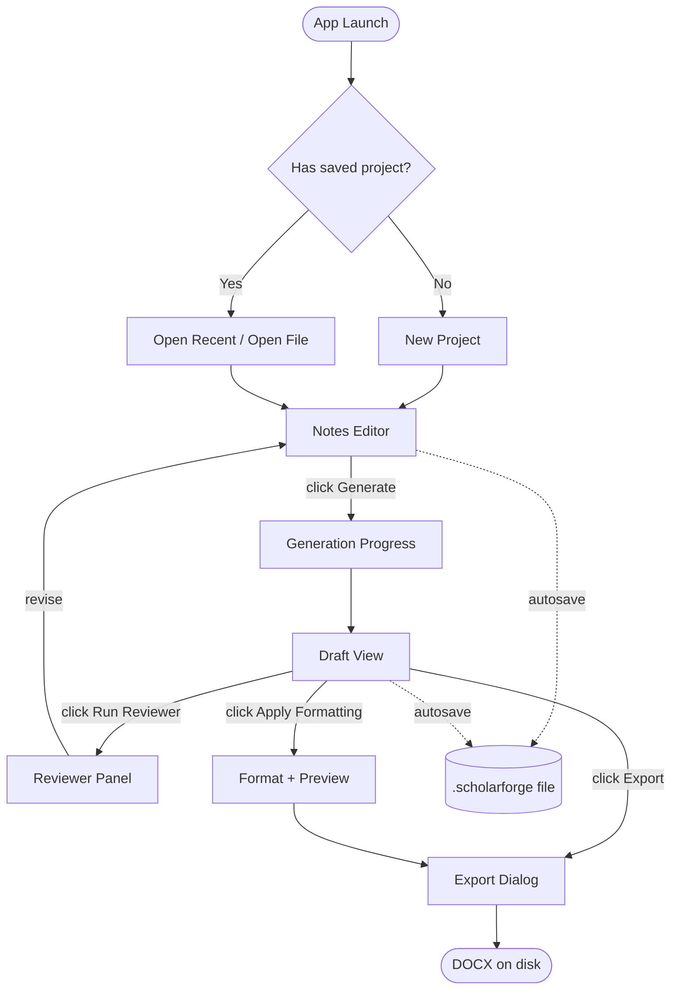

# ScholarForge — UI Wireframes & User Journey (V1.0)

**Source of truth:** ScholarForge V1.0 Product Vision + PRD (User Stories §6, Functional Requirements §7) + Software Architecture Document §3.1 + Implementation Blueprint
**Author role:** Principal Software Architect / UX Engineer
**Status:** Implementation-ready wireframes — gates Day 3 development
**Scope discipline:** Every screen maps to a PRD functional requirement (FR-1 through FR-10) and a user story. No screen exists that isn't traceable to an approved requirement.

---

## 1. Design Principles

### 1.1 What ScholarForge's UI Is — and Isn't

ScholarForge is **not** a Google Docs-style collaborative editor. It is **not** a Notion-style block-based workspace. It is **not** an Overleaf-style LaTeX IDE. It is a **purpose-built, single-user, offline academic writing assistant** with a focused, linear workflow: notes in → draft generated → review → format → export. The UI reflects this linearity — it does not try to be a general-purpose document editor.

### 1.2 UI Design Constraints

| Constraint | Source | How It Shapes the UI |
|---|---|---|
| Single-user, single-session | PRD §13 | No multi-user indicators, no presence, no share buttons |
| Offline-first | NFR-1 | No "connecting..." spinners, no online/offline toggle, no cloud-sync UI |
| Local model latency (seconds, not milliseconds) | NFR-5 | Every generation action shows a progress indicator with per-section status |
| Deterministic formatting | NFR-4 | Template selection is a deliberate, visible choice — the user sees what standard will be applied before generation |
| Solo-dev, 10-day build | Vision §11 | Maximum reuse of shadcn/ui components — no custom design system, no animations beyond CSS transitions |

### 1.3 Visual Language

- **Component library:** shadcn/ui (New York style) — clean, professional, no decoration
- **Typography:** System font stack (no custom font loading — keeps the bundle small and avoids FOUT)
- **Color:** Neutral grays (slate) for chrome, one accent color (indigo) for primary actions, semantic colors (green/amber/red) for status. **No indigo-or-blue backgrounds** per the project's UI rules — accent is used sparingly for buttons and active states only.
- **Spacing:** Tailwind's default 4px grid. Consistent `p-4` / `p-6` for content, `gap-4` / `gap-6` for spacing.
- **Long lists:** `max-h-96 overflow-y-auto` with custom scrollbar styling for any list longer than 8 items.

---

## 2. User Journey



*Full Mermaid source: [`diagrams/user-flow.mmd`](./diagrams/user-flow.mmd)*

### 2.1 Primary User Flow (Happy Path)

1. **Launch app** → Home screen
2. **New Project** or **Open Recent** → Notes Editor
3. **Enter structured notes** (sections, bullets, source references) → Notes Editor validates inline
4. **Select template** (IEEE / APA / MLA / Chicago + edition) → Template Picker dialog
5. **Click "Generate Draft"** → Progress indicator (section-by-section)
6. **Review generated Draft** → Draft View (read-only, section by section)
7. **Optional: Run Reviewer Mode** → Reviewer Panel (feedback per section)
8. **Apply Formatting** → Formatted preview (IEEE layout applied)
9. **Export to DOCX** → File Save dialog → DOCX file on disk
10. **Autosave** runs throughout — every state change atomically writes to the `.scholarforge` file

### 2.2 Alternate Flows

| Flow | Trigger | Path |
|---|---|---|
| Resume work | App launch with existing project | Home → Open Recent → Notes Editor (with draft/template restored) |
| Regenerate one section | Draft View, click "Regenerate" on a section | Single-section generation → Draft updated for that section only |
| Recover from corruption | App launch, project file corrupt | Auto-fallback to backup → Warning banner → Notes Editor |
| Switch template mid-session | Template Picker → change selection | Re-apply formatting → Formatted preview updates |
| Partial generation failure | Some sections fail during generation | Draft View shows which sections failed → "Regenerate failed sections" button |

---

## 3. Screen-by-Screen Wireframes

Every wireframe below is **low-fidelity ASCII art** — intentionally. The goal is to communicate layout and information hierarchy, not visual polish. Implementation uses shadcn/ui components per §1.3.

### 3.1 Home Screen (Project Picker)

**Route:** `/`
**Purpose:** Entry point. Let the user start a new project or resume an existing one. (FR-6, FR-7)

```
┌─────────────────────────────────────────────────────────────────────┐
│  ScholarForge                                  [Settings]  [About]  │
├─────────────────────────────────────────────────────────────────────┤
│                                                                     │
│                        Welcome back, Devpal.                        │
│                                                                     │
│           ┌─────────────────┐    ┌─────────────────┐                │
│           │   + New Project │    │   📂 Open File  │                │
│           └─────────────────┘    └─────────────────┘                │
│                                                                     │
│  ── Recent Projects ──────────────────────────────────────────────  │
│                                                                     │
│  📄 My Capstone Paper                              2 hours ago      │
│     /Users/devpal/Documents/capstone.scholarforge                   │
│                                                                     │
│  📄 Literature Review Draft                       Yesterday         │
│     /Users/devpal/Documents/litreview.scholarforge                  │
│                                                                     │
│  📄 AI in Education Paper                         3 days ago        │
│     /Users/devpal/Documents/ai-edu.scholarforge                     │
│                                                                     │
│                                                                     │
│  ── Status ───────────────────────────────────────────────────────  │
│  ● Backend: Online (localhost:3001)                                 │
│  ● Model: Qwen2.5-3B via Ollama (localhost:11434) — Ready            │
│                                                                     │
└─────────────────────────────────────────────────────────────────────┘
```

**Components:**
- Header with app name + Settings/About links
- Two primary action cards: "New Project" (creates empty SessionState), "Open File" (file picker for `.scholarforge` files)
- Recent projects list (from `GET /session/recent`) — clickable, opens the project
- Status footer showing backend + model reachability (from `GET /health`)

**Empty state:** If no recent projects, the Recent section shows "No recent projects yet. Click 'New Project' to get started."

**Error state:** If backend unreachable, the Status footer shows `● Backend: Offline` in red, and the action cards are disabled with a tooltip: "Start the ScholarForge backend to continue."

---

### 3.2 Notes Editor (Primary Workspace)

**Route:** `/project/[projectId]`
**Purpose:** Capture structured research notes. (FR-1)

```
┌─────────────────────────────────────────────────────────────────────┐
│  📄 My Capstone Paper   [💾 Saved]    [Template: IEEE ▼]  [⚙️]      │
├──────────┬──────────────────────────────────────────────────────────┤
│          │                                                          │
│ SECTIONS │  ┌── Section 1: Introduction ──────────────────── [×] ┐  │
│          │  │ Type: [Introduction ▼]                             │  │
│ ▸ Intro  │  │                                                    │  │
│ ▸ LitRev │  │ Bullets:                                           │  │
│ ▸ Method │  │  • The rapid evolution of AI in education...       │  │
│ ▸ Result │  │  • Growing concern about academic integrity        │  │
│ ▸ Discus │  │  • Need for structured writing tools [+]           │  │
│ ▸ Conclu │  │                                                    │  │
│          │  │ Sources:                                           │  │
│ + Add    │  │  [1] Smith, 2023, "AI in Education", Journal of X  │  │
│          │  │  [2] Jones, 2024, "Academic Integrity", Conf. Y    │  │
│          │  │  [+ Add Source]                                    │  │
│          │  └────────────────────────────────────────────────────┘  │
│          │                                                          │
│          │  ┌── Section 2: Literature Review ────────────── [×] ┐  │
│          │  │ Type: [Literature Review ▼]                       │  │
│          │  │                                                    │  │
│          │  │ Bullets:                                           │  │
│          │  │  • Existing tools require cloud APIs...            │  │
│          │  │  • Privacy concerns with student data [+]          │  │
│          │  └────────────────────────────────────────────────────┘  │
│          │                                                          │
│          │  [+ Add Section]                                         │
│          │                                                          │
├──────────┴──────────────────────────────────────────────────────────┤
│  ⚠️ Validation: Section 3 has no bullets                            │
│  [Validate]  [Generate Draft ▶]                                     │
└─────────────────────────────────────────────────────────────────────┘
```

**Components:**
- **Header:** Project name, autosave indicator ("Saved" / "Saving..." / "Unsaved changes"), template selector (opens Template Picker dialog), settings gear
- **Left sidebar:** Collapsible list of sections — click to jump, drag to reorder. "+ Add" creates a new section with a default heading.
- **Main area:** One card per section. Each card has:
  - Section heading (editable inline)
  - Section type dropdown (Introduction, Literature Review, Methodology, Results, Discussion, Conclusion, Custom)
  - Bullets list (add/remove/edit inline)
  - Source references list (add/remove/edit inline)
  - Delete section button (×)
- **Footer:** Validation issues (if any), Validate button, Generate Draft button (disabled if validation fails)

**Validation feedback:** Inline — if a section has no heading or no bullets, a red border appears on that section's card with a specific message. The "Generate Draft" button is disabled until validation passes.

**Autosave:** The "Saved" / "Saving..." indicator in the header reflects the Zustand store's autosave state. Every edit triggers a debounced `POST /session/save`.

---

### 3.3 Draft View (Generated Content)

**Route:** `/project/[id]/draft`
**Purpose:** Display the AI-generated draft, section by section. Allow regeneration of individual sections. (FR-2, FR-5)

```
┌─────────────────────────────────────────────────────────────────────┐
│  📄 My Capstone Paper   [💾 Saved]    [Template: IEEE ▼]  [⚙️]      │
├──────────┬──────────────────────────────────────────────────────────┤
│          │                                                          │
│ SECTIONS │  ┌── Draft — Generated at 10:30 AM ───────────────────┐  │
│          │  │  Model: Qwen2.5-3B (Ollama) — 3.4s avg/section      │  │
│ ▸ Intro  │  └────────────────────────────────────────────────────┘  │
│ ▸ LitRev │                                                          │
│ ▸ Method │  ┌── 1. Introduction ───────────────────── [↻ Regen] ┐  │
│ ▸ Result │  │                                                    │  │
│ ▸ Discus │  │  The rapid evolution of artificial intelligence    │  │
│ ▸ Conclu │  │  in educational settings has prompted growing      │  │
│          │  │  concern about academic integrity and the need     │  │
│          │  │  for structured writing tools that preserve         │  │
│          │  │  authorial voice...                                 │  │
│          │  │                                                    │  │
│          │  │  Generated in 3.2s • 412 tokens prompt             │  │
│          │  └────────────────────────────────────────────────────┘  │
│          │                                                          │
│          │  ┌── 2. Literature Review ───────────────── [↻ Regen] ┐  │
│          │  │                                                    │  │
│          │  │  Existing AI writing tools predominantly rely on   │  │
│          │  │  cloud-based APIs, requiring constant internet     │  │
│          │  │  connectivity and routing research content...       │  │
│          │  │                                                    │  │
│          │  │  Generated in 4.1s • 387 tokens prompt             │  │
│          │  └────────────────────────────────────────────────────┘  │
│          │                                                          │
│          │  ⚠️ Section 3 failed to generate — [↻ Retry All Failed]  │
│          │                                                          │
├──────────┴──────────────────────────────────────────────────────────┤
│  [← Back to Notes]   [🔍 Run Reviewer]   [✨ Apply Formatting]      │
└─────────────────────────────────────────────────────────────────────┘
```

**Components:**
- Same header + sidebar as Notes Editor (consistency)
- **Draft metadata banner:** Generation timestamp, model used, average time per section
- **Section cards:** One per DraftSection, showing:
  - Section heading
  - Generated prose (read-only, formatted as paragraphs)
  - Per-section metadata: generation time, prompt token estimate
  - "Regenerate" button (↻) — regenerates only this section via `/generate/draft` with just that section
- **Failure indicator:** If any sections failed, a warning banner shows which ones, with a "Retry All Failed" button
- **Footer actions:** Back to Notes, Run Reviewer, Apply Formatting

**Generation progress (during generation):** When the user clicks "Generate Draft" from the Notes Editor, a progress overlay appears:

```
┌────────────────────────────────────────────────────────┐
│  Generating Draft...                              [×] │
├────────────────────────────────────────────────────────┤
│                                                        │
│  ✓ Section 1: Introduction          (3.2s)            │
│  ✓ Section 2: Literature Review     (4.1s)            │
│  ⏳ Section 3: Methodology           generating...     │
│  ○ Section 4: Results               queued             │
│  ○ Section 5: Discussion            queued             │
│  ○ Section 6: Conclusion            queued             │
│                                                        │
│  ████████░░░░░░░░░░░░  33%                             │
│                                                        │
│  Elapsed: 7.3s • Est. remaining: ~14s                  │
│                                                        │
└────────────────────────────────────────────────────────┘
```

This overlay is driven by the SSE stream from `/generate/draft/stream` — each `section_started` / `section_completed` event updates the UI in real time.

---

### 3.4 Reviewer Panel

**Route:** `/project/[id]/review`
**Purpose:** Display structured feedback on the draft, grouped by section, with severity indicators. (FR-8)

```
┌─────────────────────────────────────────────────────────────────────┐
│  📄 My Capstone Paper   [💾 Saved]    [Template: IEEE ▼]  [⚙️]      │
├──────────┬──────────────────────────────────────────────────────────┤
│          │                                                          │
│ FEEDBACK │  ┌── Reviewer Feedback — Run at 10:35 AM ──────────────┐  │
│          │  │  3 issues found across 2 sections                    │  │
│          │  └────────────────────────────────────────────────────┘  │
│ ▸ Intro  │                                                          │
│   • 🟡 2 │  ┌── Section 1: Introduction ──────────────────────────┐  │
│ ▸ LitRev │  │                                                    │  │
│   • 🔴 1 │  │  🟡 MEDIUM — Evidence                               │  │
│          │  │  Issue: The opening paragraph makes a broad claim   │  │
│          │  │  about 'rapid evolution' without citing a source.   │  │
│          │  │  Suggestion: Add an in-text citation to a specific  │  │
│          │  │  source from the sourceRefs, or rephrase as 'has    │  │
│          │  │  been characterized as rapid (Author, Year)'.       │  │
│          │  │                                                    │  │
│          │  │  🟡 MEDIUM — Clarity                                │  │
│          │  │  Issue: The sentence starting 'Growing concern...'  │  │
│          │  │  is vague — concern from whom?                      │  │
│          │  │  Suggestion: Specify the stakeholder group          │  │
│          │  │  (educators, administrators, students).             │  │
│          │  └────────────────────────────────────────────────────┘  │
│          │                                                          │
│          │  ┌── Section 2: Literature Review ─────────────────────┐  │
│          │  │                                                    │  │
│          │  │  🔴 HIGH — Argument                                 │  │
│          │  │  Issue: The claim 'No current tool combines local   │  │
│          │  │  inference...' is made without supporting evidence. │  │
│          │  │  Suggestion: Either cite a survey of existing tools │  │
│          │  │  or soften to 'Few tools combine...'.               │  │
│          │  └────────────────────────────────────────────────────┘  │
│          │                                                          │
├──────────┴──────────────────────────────────────────────────────────┤
│  [← Back to Draft]   [↻ Re-run Reviewer]   [✨ Apply Formatting]    │
└─────────────────────────────────────────────────────────────────────┘
```

**Components:**
- **Sidebar:** List of sections with feedback, grouped by severity count (🟡 medium, 🔴 high, 🟢 low). Clicking a section scrolls to its feedback.
- **Main area:** Feedback cards per section, each showing:
  - Severity indicator (🔴 high / 🟡 medium / 🟢 low)
  - Category (Evidence, Clarity, Argument, Style, Structure)
  - Issue (specific, references actual draft text)
  - Suggestion (actionable)
- **Footer:** Back to Draft, Re-run Reviewer, Apply Formatting

**Empty state:** If no review has been run, the main area shows a centered message: "No feedback yet. Click 'Run Reviewer' to analyze the draft."

---

### 3.5 Export View

**Route:** `/project/[id]/export`
**Purpose:** Apply formatting and export to DOCX. (FR-3, FR-4, FR-9)

```
┌─────────────────────────────────────────────────────────────────────┐
│  📄 My Capstone Paper   [💾 Saved]    [Template: IEEE ▼]  [⚙️]      │
├──────────┬──────────────────────────────────────────────────────────┤
│          │                                                          │
│  EXPORT  │  ┌── Format & Export ──────────────────────────────────┐  │
│          │  │                                                    │  │
│ Template │  │  Template: IEEE (US Letter)                         │  │
│ ✓ IEEE   │  │  ✓ Margins: 0.75" top, 1" bottom, 0.625" sides     │  │
│ ○ APA 7  │  │  ✓ Font: Times New Roman 10pt                       │  │
│ ○ MLA 9  │  │  ✓ Spacing: Single line, 0.2" paragraph indent      │  │
│ ○ Chi 17 │  │  ✓ Citations: Numeric [1], [2] in-text              │  │
│          │  │  ✓ References: "References" section, numbered        │  │
│          │  │                                                    │  │
│          │  │  [Change Template]                                  │  │
│          │  └────────────────────────────────────────────────────┘  │
│          │                                                          │
│          │  ┌── Preview ─────────────────────────────────────────┐  │
│          │  │                                                    │  │
│          │  │  ┌──────────────────────────────────────────────┐  │  │
│          │  │  │                                              │  │  │
│          │  │  │            1. Introduction                    │  │  │
│          │  │  │                                              │  │  │
│          │  │  │  The rapid evolution of artificial           │  │  │
│          │  │  │  intelligence in educational settings        │  │  │
│          │  │  │  has prompted growing concern about          │  │  │
│          │  │  │  academic integrity [1]...                   │  │  │
│          │  │  │                                              │  │  │
│          │  │  │  ...                                         │  │  │
│          │  │  │                                              │  │  │
│          │  │  │  References                                  │  │  │
│          │  │  │  [1] Smith, "AI in Education," J. of X, 2023.│  │  │
│          │  │  │                                              │  │  │
│          │  │  └──────────────────────────────────────────────┘  │  │
│          │  └────────────────────────────────────────────────────┘  │
│          │                                                          │
│          │  ┌── Export ──────────────────────────────────────────┐  │
│          │  │  Output path: [/Users/devpal/Documents/_________]  │  │
│          │  │  Filename:    [my_paper.docx_________]             │  │
│          │  │  Author:      [Devpal Singh Anand_____]            │  │
│          │  │  Title:       [AI in Education: A Review___]       │  │
│          │  │                                                    │  │
│          │  │  [📄 Export to DOCX]                                │  │
│          │  └────────────────────────────────────────────────────┘  │
│          │                                                          │
├──────────┴──────────────────────────────────────────────────────────┤
│  [← Back to Draft]                                                  │
└─────────────────────────────────────────────────────────────────────┘
```

**Components:**
- **Sidebar:** Available templates (radio list — only one active at a time). IEEE is checked by default per the depth-over-breadth strategy.
- **Template details card:** Shows the resolved formatting rules (margins, font, spacing, citations, references) pulled from the selected `TemplateDefinition`.
- **Preview area:** A scaled-down preview of the formatted document — shows heading hierarchy, body text, in-text citations, and the references section. Not a full WYSIWYG (that's out of scope for V1), but a structural preview.
- **Export form:** Output path (file picker), filename, author metadata, title.
- **Export button:** Triggers `POST /export/docx`. On success, shows a success toast with the file path and a "Show in folder" button.

**Export success state:**
```
┌────────────────────────────────────────────────────────┐
│  ✓ Export Complete                                     │
├────────────────────────────────────────────────────────┤
│                                                        │
│  File saved to:                                        │
│  /Users/devpal/Documents/my_paper.docx                 │
│  Size: 45.2 KB                                         │
│                                                        │
│  [📂 Show in Folder]  [📄 Open in Word]  [Done]        │
│                                                        │
└────────────────────────────────────────────────────────┘
```

---

### 3.6 Settings Screen

**Route:** `/settings`
**Purpose:** View and edit model configuration, voice profiles. (FR-5, NFR-6)

```
┌─────────────────────────────────────────────────────────────────────┐
│  ScholarForge                                  [← Back]   [About]   │
├─────────────────────────────────────────────────────────────────────┤
│                                                                     │
│  ── Model Configuration ──────────────────────────────────────────  │
│                                                                     │
│  Backend:        ( ) Ollama   ( ) llama.cpp                         │
│  Model:          [qwen2.5:3b-instruct-q4_K_M___________]            │
│  Quantization:   [Q4_K_M_____________]                              │
│  Context Window: [4096____] tokens                                  │
│  Temperature:    [0.7____]                                          │
│  Top-P:          [0.9____]                                          │
│  Timeout:        [30000___] ms                                      │
│                                                                     │
│  [Test Connection]   ● Model: Ready                                 │
│                                                                     │
│  ── Voice Profiles ────────────────────────────────────────────────  │
│                                                                     │
│  Active profile: [Default Academic ▼]                               │
│                                                                     │
│  Formality:           [Formal___________]                            │
│  Sentence Length:     [Varied___________]                            │
│  Person Preference:   [Third Person_____]                            │
│  Hedging Level:       [Moderate_________]                            │
│                                                                     │
│  Exemplar Snippets (1-3 short writing samples in your voice):       │
│  ┌────────────────────────────────────────────────────────────────┐ │
│  │ The results indicate a significant correlation between...      │ │
│  └────────────────────────────────────────────────────────────────┘ │
│  [+ Add Snippet]                                                    │
│                                                                     │
│  [Save Profile As...]   [Reset to Default]                          │
│                                                                     │
└─────────────────────────────────────────────────────────────────────┘
```

**Components:**
- **Model Configuration section:** Form for `model.config.json` fields. "Test Connection" button calls `/health` and shows model reachability.
- **Voice Profiles section:** Dropdown to select active profile, form to edit the selected profile's fields, exemplar snippets textarea, "Save Profile As" for creating custom profiles.

**Notes:**
- Changes to model config require a backend restart (or a config reload endpoint, if added). The UI shows a warning: "Changes take effect on next backend restart."
- Voice profile changes are hot — they apply to the next generation call without restart.

---

## 4. Navigation

### 4.1 Primary Navigation

Navigation between views is **linear, not tabbed.** The user moves through the workflow: Notes → Draft → Review → Export. The sidebar shows the current section list (contextual to the active view), not a global nav menu.

```
Notes Editor  →  Draft View  →  Reviewer Panel  →  Export View
     ↑               │               │                │
     └───────────────┴───────────────┘                │
     (user can go back to revise notes at any point)  │
                                                      ↓
                                                DOCX on disk
```

### 4.2 Back Navigation

Every non-home view has a "← Back" button in the footer that returns to the previous view in the workflow:
- Draft View → Notes Editor
- Reviewer Panel → Draft View
- Export View → Draft View

### 4.3 Template Picker (Modal)

The template selector in the header opens a modal dialog (not a separate route) — it's a quick setting, not a destination:

```
┌────────────────────────────────────────────────────────┐
│  Select Template                              [×]      │
├────────────────────────────────────────────────────────┤
│                                                        │
│  Standard:    ( ) IEEE  ( ) APA  ( ) MLA  ( ) Chicago  │
│  Edition:     [7____] (varies by standard)             │
│  Page Size:   ( ) US Letter  ( ) A4  (IEEE only)       │
│                                                        │
│  ┌── Preview ────────────────────────────────────────┐ │
│  │ Margins: 1" all sides (APA 7th)                   │ │
│  │ Font: Times New Roman 12pt                         │ │
│  │ Citations: (Author, Year) in-text                  │ │
│  │ References: "References" section, alphabetical     │ │
│  └────────────────────────────────────────────────────┘ │
│                                                        │
│  [Cancel]  [Apply]                                     │
└────────────────────────────────────────────────────────┘
```

---

## 5. Empty, Loading, and Error States

### 5.1 Empty States

| View | Empty State |
|---|---|
| Home (no recent projects) | "No recent projects yet. Click 'New Project' to get started." |
| Notes Editor (new project) | One empty section card pre-created, with placeholder text "Enter section heading..." |
| Draft View (no draft yet) | "No draft generated yet. Go back to Notes and click 'Generate Draft'." |
| Reviewer Panel (no review) | "No feedback yet. Click 'Run Reviewer' to analyze the draft." |

### 5.2 Loading States

| Action | Loading UI |
|---|---|
| Generate Draft | Full-screen progress overlay with per-section status (see §3.3) |
| Run Reviewer | Inline spinner on the "Run Reviewer" button + "Analyzing draft..." text |
| Apply Formatting | Inline spinner on the "Apply Formatting" button + "Formatting..." text |
| Export DOCX | Inline spinner on the "Export" button + "Generating DOCX..." text |
| Load Session | Full-screen spinner + "Loading project..." |

### 5.3 Error States

| Error | UI |
|---|---|
| Backend unreachable (503 on /health) | Red banner at top of every view: "Backend offline. Start the ScholarForge backend to continue." All action buttons disabled. |
| Model unreachable (503 on /generate) | Toast notification: "Model backend not reachable. Is Ollama running?" |
| Generation timeout (408) | Inline message on the failed section: "Section timed out. [Retry]" |
| Session file corrupt (500 on /load) | Modal dialog: "This project file is corrupt and the backup is also corrupt. [Open a different project]" |
| Export path invalid (422) | Inline validation on the path field: "Path must be absolute and end in .docx" |

All error messages are **specific and actionable** — never a generic "Something went wrong." This is a direct implementation of the Architecture Document §12 error-handling strategy.

---

## 6. Responsive Behavior

ScholarForge V1 is **desktop-first.** The target user is on a laptop/desktop with a 4GB GPU — mobile is out of scope (Vision §7).

| Breakpoint | Behavior |
|---|---|
| ≥ 1024px (default) | Full layout — sidebar + main area side by side |
| 768px – 1023px | Sidebar collapses to icons only (headings hidden, expandable on hover) |
| < 768px | Not supported in V1 — show a message: "ScholarForge requires a desktop screen. Please use a wider viewport." |

---

## 7. Accessibility

| Concern | Implementation |
|---|---|
| Keyboard navigation | All interactive elements are focusable; tab order follows visual order; Enter/Space activate buttons |
| Screen reader labels | Every icon button has `aria-label`; every form field has `<label>` |
| Color contrast | shadcn/ui default theme meets WCAG AA; semantic colors (red/amber/green) are tested for contrast |
| Focus indicators | shadcn/ui default focus rings (2px indigo outline) |
| Reduced motion | CSS `@media (prefers-reduced-motion)` disables transitions |

---

## 8. Screen → Requirement Traceability

| Screen | Primary FR | User Story |
|---|---|---|
| Home (Project Picker) | FR-6, FR-7 | #4, #5 (save/load session) |
| Notes Editor | FR-1 | #1 (enter structured notes) |
| Template Picker | FR-3 | #2 (select citation standard) |
| Draft View | FR-2, FR-5 | #3 (generated prose reflects voice) |
| Reviewer Panel | FR-8 | #6 (reviewer feedback) |
| Export View | FR-3, FR-4, FR-9 | #7 (export to DOCX), #10 (deterministic formatting) |
| Settings | FR-5 | #3 (configure writing voice) |

Every screen traces to at least one PRD functional requirement and one user story. No screen is "nice to have" — each is required.

---

## 9. References

| Document | Section |
|---|---|
| PRD | §6 (User Stories), §7 (Functional Requirements) |
| Software Architecture Document | §3.1 (NotesModule + Presentation Layer) |
| Implementation Blueprint | Day 2 (Notes Editor), Day 4 (Draft View), Day 8 (Reviewer Panel), Day 6 (Export) |
| This document | `Day52/UI-WIREFRAMES.md` |
| User flow diagram | `Day52/diagrams/user-flow.mmd` |
| PROJECT-STRUCTURE.md | §2.2 (Route → view mapping) |
